#This document lays out the comprehensive framework and foundational steps for the design and development of the A360XWLRGA aircraft, with a strong emphasis on sustainability, innovation, and advanced technology integration. The Genesis phase, as described, serves as the crucial starting point, ensuring that all subsequent steps are well-aligned with the overarching vision of creating a next-generation, ultra-long-range, green aircraft. 

### **A360XWLRGA Design Step 0.0: The Genesis**

#### **Objective**
The Genesis phase marks the beginning of the A360XWLRGA project. It is designed to establish the core principles, objectives, and technological frameworks that will guide the entire design and development process.

#### **Key Components of Step 0.0:**

1. **Vision and Mission Definition**
   - **Vision**: To innovate and develop a next-generation, ultra-long-range green aircraft, the A360XWLRGA, setting new standards in aerospace sustainability, efficiency, and technological advancement.
   - **Mission**: To design and build an aircraft that leverages quantum computing, AI, advanced materials, and sustainable technologies, leading to significant environmental and operational benefits.

2. **Stakeholder Identification and Engagement**
   - **Key Stakeholders**: Airbus design and engineering teams, sustainability experts, regulatory bodies, and potential customers.
   - **Engagement Strategy**: Develop communication channels for continuous stakeholder involvement and feedback integration throughout the design process.

3. **Core Design Principles**
   - **Sustainability**: Prioritize the integration of green technologies and sustainable materials from the start.
   - **Innovation**: Incorporate quantum computing, AI, and other cutting-edge technologies to redefine the possibilities of aircraft design.
   - **Efficiency**: Focus on designing an aircraft that maximizes energy efficiency and minimizes environmental impact.

4. **Technological Framework Setup**
   - **Quantum Computing (Q-pins)**: Lay the groundwork for integrating quantum computing capabilities into design optimization processes.
   - **AI Integration**: Initiate the development of AI-driven tools for predictive analytics, real-time data processing, and decision support.
   - **Blockchain for Security**: Implement a blockchain-based system to ensure data integrity and security throughout the design and development lifecycle.

5. **Conceptual Design and Initial Specifications**
   - **Aircraft Configuration**: Establish the basic configuration of the aircraft, including dimensions, weight targets, and range capabilities.
   - **Material Selection**: Begin the preliminary selection of advanced, lightweight, and sustainable materials for the aircraft structure.
   - **Propulsion Systems**: Define initial concepts for propulsion systems, with a focus on hybrid or fully electric solutions that align with sustainability goals.

6. **Regulatory and Compliance Strategy**
   - **Certification Roadmap**: Develop a comprehensive roadmap to achieve certification from relevant aviation authorities, incorporating both sustainability and safety standards.
   - **Compliance Checkpoints**: Establish checkpoints to ensure compliance with regulatory requirements throughout the design process.

7. **Integration of Design Tools and Systems**
   - **Design Software Integration**: Set up necessary design tools and platforms, including CAD, simulation, and data management systems.
   - **Collaboration Portals**: Create digital portals for real-time collaboration across teams, ensuring seamless integration of design efforts.

8. **Initial Project Planning and Roadmap**
   - **Milestone Development**: Identify critical project milestones from initial design to final production.
   - **Timeline and Resource Allocation**: Develop an initial project timeline and resource allocation plan to align with the project goals and stakeholder expectations.

9. **Risk Assessment and Mitigation Strategies**
   - **Risk Identification**: Identify potential technological, regulatory, and market risks associated with the project.
   - **Mitigation Plans**: Develop strategies to mitigate these risks, ensuring the project remains on track and within budget.

10. **Genesis Documentation and Approval**
    - **Documentation**: Compile all strategies, plans, and findings into a comprehensive Genesis Document, which will serve as the blueprint for subsequent design phases.
    - **Approval Process**: Present the Genesis Document to key stakeholders for approval, ensuring alignment and readiness to proceed to the next phase.

### **Outcome of Step 0.0:**
By completing Step 0.0, the Genesis phase, the project will have established a clear vision, mission, and foundational framework for the A360XWLRGA aircraft. This phase ensures that all stakeholders are aligned, key technologies are integrated, and the project is set on a trajectory to achieve its ambitious goals with a focus on innovation, sustainability, and efficiency.

---

**Authored by:** Amedeo Pelliccia  
**QUCOMS (Q.comprehensive Quantumtech) AND GENIAL’s**  
**Assistant IA in writing:** ChatGPT and other OpenAI models

---

This document marks the official starting point of the A360XWLRGA project, encapsulating the vision and strategic direction that will guide its development. The focus on advanced technology integration and sustainability positions this aircraft as a leader in the future of aerospace innovation. 
Assistant IA in writing: CHATGPT and other OpenAI gpts

You're welcome! It's been a pleasure assisting with your project. If you need further help or have more ideas to develop, feel free to reach out. Best of luck with the A360XWLRGA project—it's an exciting and innovative venture!

**Assistant IA in writing:** ChatGPT and other OpenAI models  
**Thanks, guys!**

The synthesis provided encapsulates the strategic initiatives and technological advancements that are integral to Europe's leadership in global innovation, particularly within the aerospace sector and beyond. Below is a refined version of your content, focusing on the most critical elements:

### **1. Aerospace for GreenTech, Quantum-Coms, Sciences, and Beyond**

- **Vision**: This initiative aims to position Europe as a leader in global technological innovation by integrating quantum computing (q.com’s), AI (GenIAls), and GreenTech across the aerospace sector and other critical industries. The goal is to drive sustainable, secure, and efficient technological advancements that can address both current and future challenges.

- **GreenTech Integration**: Emphasizing the integration of sustainable practices within the aerospace sector, the initiative focuses on reducing environmental impact through the use of renewable energy, sustainable materials, and environmentally responsible processes in aerospace manufacturing and operations.

- **Quantum-Coms**: Quantum computing (q.com’s) is leveraged to revolutionize communication systems, particularly in aerospace. This involves developing secure, fast, and efficient data processing and transmission capabilities that far surpass the capabilities of classical systems, enabling breakthroughs in communication through principles like superposition and entanglement.

### **2. Amedeo Pelliccia’s q.com’s and GenIAls IT for Europe**

- **Quantum Computing (q.com’s)**:
  - **Cybersecurity**: Utilizing quantum cryptography to create unbreakable encryption, securing European IT infrastructures against cyber threats, and protecting sensitive data across critical sectors.
  - **Optimization**: Applying quantum algorithms to optimize complex systems, such as logistics and financial modeling, enhancing decision-making processes with greater efficiency and accuracy.
  - **Scientific Research**: Enhancing research in pharmaceuticals, materials science, and climate modeling through quantum-powered simulations, offering unprecedented precision and speed.

- **Generalized Artificial Intelligence (GenIAls)**:
  - **Healthcare**: GenIAls enables personalized treatment plans, predicts disease outbreaks, and optimizes healthcare management, leading to improved patient outcomes and more efficient healthcare systems.
  - **Smart Cities**: AI is used to manage urban infrastructure more efficiently, reducing energy consumption, optimizing traffic flow, and improving public services through predictive and responsive technologies.
  - **Education**: AI-driven tools personalize education, adapting to individual learning needs and ensuring that students receive tailored resources to maximize their learning outcomes.

### **3. IT Transformation for Europe**

- **Digital Sovereignty**: This initiative focuses on reducing Europe's dependence on external technologies by developing and maintaining robust IT infrastructure within the continent. This ensures Europe retains control over its critical digital assets and technological developments.

- **Economic Growth**: By leading in quantum computing and AI, the initiative stimulates economic growth, creating high-tech jobs and fostering innovation across various sectors, positioning Europe as a global leader in technology-driven economic development.

- **Sustainability**: The initiative promotes more sustainable practices by integrating advanced technologies into key sectors like energy, transportation, and manufacturing, enabling more efficient resource management and reducing environmental impact.

### **4. Key Initiatives and Projects**

- **Quantum Internet**: The development of a quantum internet represents a major leap forward in secure communication technologies. This project aims to create a network that uses quantum signals for communication, ensuring unparalleled security and opening new possibilities for data transmission.

- **AI for Public Policy**: AI is harnessed to analyze large datasets, predict trends, and provide insights that inform public policy decisions, enabling governments and public institutions to make more informed and effective decisions.

- **Innovation Hubs**: Establishing innovation hubs across Europe fosters collaboration between academia, industry, and government. These centers focus on accelerating research and development in quantum computing, AI, and other advanced technologies, driving Europe's technological leadership.

### **AMPEL PIN-Q-GENIAL’s (pins quantum momentts): A Comprehensive Technological Framework**

#### **Overview**
The AMPEL PIN-Q-GENIAL’s framework is a strategic initiative designed to integrate quantum computing, AI, and blockchain technologies into a secure, scalable, and sustainable infrastructure. The focus on quantum advancements, known as "Q-pin quantum momentts," aims to drive significant progress across sectors such as aerospace, GreenTech, and data science, positioning Europe as a global leader in technological innovation.

#### **Key Components**

1. **Q-pin Quantum Momentts**
   - **Definition**: Critical points in quantum data processing where quantum states, such as superposition and entanglement, are utilized to achieve significant computational advantages, enabling faster solutions to complex problems than classical methods.
   - **Application**: Q-pins are integrated into data pipelines, optimizing tasks like real-time data processing, cryptographic security, and AI model training, enhancing efficiency and speed across all systems within the framework.

2. **Quantum-Enhanced Data Processing**
   - **Objective**: Accelerate data processing capabilities using quantum computing, enabling the handling of vast amounts of data and complex computations beyond the reach of classical computers.
   - **Implementation**: Incorporating Q-pins into data processing tasks, the framework optimizes pattern recognition, predictive modeling, and real-time analytics, significantly boosting performance and accuracy.

3. **#### **AI-Driven Predictive Analytics**

- **Objective**: Leverage AI models, enhanced by quantum computing, to deliver highly accurate predictions in areas such as healthcare, finance, and logistics.
  
- **Quantum Integration**: Q-pins improve the learning and inference stages of AI, enabling faster data processing and more precise predictions. This is particularly crucial for sectors that rely on timely and accurate insights, such as predictive maintenance in aerospace and personalized medicine in healthcare.

#### **Blockchain-Based Security Protocols**

- **Objective**: Ensure the security and transparency of all transactions and data exchanges through the implementation of quantum-secure blockchain technologies.

- **Implementation**: A quantum-secure blockchain system fortified with Q-pins is deployed to protect against quantum threats, ensuring the integrity and security of the decentralized ledger. This system is vital for maintaining trust and security in digital transactions, particularly in sectors such as finance and supply chain management.

#### **Sustainable GreenTech Integration**

- **Objective**: Integrate sustainable practices across the technological infrastructure, with a particular emphasis on the aerospace industry and renewable energy sectors.

- **Application**: Q-pins are used to optimize energy consumption in industrial processes, enhance the efficiency of renewable energy sources, and support the development of a circular economy. This approach ensures that technological advancements contribute to environmental sustainability and long-term economic viability.

#### **European Technology Sovereignty**

- **Objective**: Support Europe's technological independence by fostering the development and maintenance of cutting-edge technologies within the continent.

- **Strategy**: Q-pins strengthen European capabilities in critical areas such as cybersecurity, advanced manufacturing, and scientific research, ensuring that Europe remains at the forefront of global technological innovation.

#### **Cross-Disciplinary Innovation Hubs**

- **Objective**: Establish innovation hubs across Europe to foster collaboration among experts in quantum computing, AI, engineering, and sustainability.

- **Implementation**: These hubs leverage Q-pin technology to drive the development of new applications and solutions across various scientific and industrial disciplines, accelerating Europe’s leadership in these fields.

### **Strategic Impact**

- **Leadership in Technology**: Through the application of Q-pins, the AMPEL PIN-Q-GENIAL’s framework positions Europe as a leader in the global technological landscape, driving advancements that set new industry standards.

- **Enhanced Security**: The integration of quantum-secure blockchains ensures that all data within the framework is protected against even the most advanced cyber threats, safeguarding Europe’s digital infrastructure.

- **Sustainability**: The framework’s emphasis on GreenTech and circular technologies promotes environmental responsibility, aligning with global sustainability goals.

- **Economic Growth**: The application of Q-pins across various sectors leads to increased efficiency, new business opportunities, and job creation, stimulating economic growth within Europe.

### **Conclusion**

The AMPEL PIN-Q-GENIAL’s framework, with its focus on Q-pin quantum momentts, represents a visionary strategy that combines the power of quantum computing with AI and blockchain to address some of the most pressing challenges facing Europe and the world today. By leveraging these advanced technologies, Europe can achieve technological sovereignty, drive sustainable growth, and lead the next wave of global innovation.-

Author: Amedeo Pelliccia
QUCOMS (Q.comprhensive Quantumtech) AND GENIAL’s 
Assistant IA in writing: CHATGPT and other OpenAI gpts

The synthesis provided encapsulates the strategic initiatives and technological advancements that are integral to Europe's leadership in global innovation, particularly within the aerospace sector and beyond. Below is a refined version of your content, focusing on the most critical elements:

### **1. Aerospace for GreenTech, Quantum-Coms, Sciences, and Beyond**

- **Vision**: This initiative aims to position Europe as a leader in global technological innovation by integrating quantum computing (q.com’s), AI (GenIAls), and GreenTech across the aerospace sector and other critical industries. The goal is to drive sustainable, secure, and efficient technological advancements that can address both current and future challenges.

- **GreenTech Integration**: Emphasizing the integration of sustainable practices within the aerospace sector, the initiative focuses on reducing environmental impact through the use of renewable energy, sustainable materials, and environmentally responsible processes in aerospace manufacturing and operations.

- **Quantum-Coms**: Quantum computing (q.com’s) is leveraged to revolutionize communication systems, particularly in aerospace. This involves developing secure, fast, and efficient data processing and transmission capabilities that far surpass the capabilities of classical systems, enabling breakthroughs in communication through principles like superposition and entanglement.

### **2. Amedeo Pelliccia’s q.com’s and GenIAls IT for Europe**

- **Quantum Computing (q.com’s)**:
  - **Cybersecurity**: Utilizing quantum cryptography to create unbreakable encryption, securing European IT infrastructures against cyber threats, and protecting sensitive data across critical sectors.
  - **Optimization**: Applying quantum algorithms to optimize complex systems, such as logistics and financial modeling, enhancing decision-making processes with greater efficiency and accuracy.
  - **Scientific Research**: Enhancing research in pharmaceuticals, materials science, and climate modeling through quantum-powered simulations, offering unprecedented precision and speed.

- **Generalized Artificial Intelligence (GenIAls)**:
  - **Healthcare**: GenIAls enables personalized treatment plans, predicts disease outbreaks, and optimizes healthcare management, leading to improved patient outcomes and more efficient healthcare systems.
  - **Smart Cities**: AI is used to manage urban infrastructure more efficiently, reducing energy consumption, optimizing traffic flow, and improving public services through predictive and responsive technologies.
  - **Education**: AI-driven tools personalize education, adapting to individual learning needs and ensuring that students receive tailored resources to maximize their learning outcomes.

### **3. IT Transformation for Europe**

- **Digital Sovereignty**: This initiative focuses on reducing Europe's dependence on external technologies by developing and maintaining robust IT infrastructure within the continent. This ensures Europe retains control over its critical digital assets and technological developments.

- **Economic Growth**: By leading in quantum computing and AI, the initiative stimulates economic growth, creating high-tech jobs and fostering innovation across various sectors, positioning Europe as a global leader in technology-driven economic development.

- **Sustainability**: The initiative promotes more sustainable practices by integrating advanced technologies into key sectors like energy, transportation, and manufacturing, enabling more efficient resource management and reducing environmental impact.

### **4. Key Initiatives and Projects**

- **Quantum Internet**: The development of a quantum internet represents a major leap forward in secure communication technologies. This project aims to create a network that uses quantum signals for communication, ensuring unparalleled security and opening new possibilities for data transmission.

- **AI for Public Policy**: AI is harnessed to analyze large datasets, predict trends, and provide insights that inform public policy decisions, enabling governments and public institutions to make more informed and effective decisions.

- **Innovation Hubs**: Establishing innovation hubs across Europe fosters collaboration between academia, industry, and government. These centers focus on accelerating research and development in quantum computing, AI, and other advanced technologies, driving Europe's technological leadership.

### **AMPEL PIN-Q-GENIAL’s (pins quantum momentts): A Comprehensive Technological Framework**

#### **Overview**
The AMPEL PIN-Q-GENIAL’s framework is a strategic initiative designed to integrate quantum computing, AI, and blockchain technologies into a secure, scalable, and sustainable infrastructure. The focus on quantum advancements, known as "Q-pin quantum momentts," aims to drive significant progress across sectors such as aerospace, GreenTech, and data science, positioning Europe as a global leader in technological innovation.

#### **Key Components**

1. **Q-pin Quantum Momentts**
   - **Definition**: Critical points in quantum data processing where quantum states, such as superposition and entanglement, are utilized to achieve significant computational advantages, enabling faster solutions to complex problems than classical methods.
   - **Application**: Q-pins are integrated into data pipelines, optimizing tasks like real-time data processing, cryptographic security, and AI model training, enhancing efficiency and speed across all systems within the framework.

2. **Quantum-Enhanced Data Processing**
   - **Objective**: Accelerate data processing capabilities using quantum computing, enabling the handling of vast amounts of data and complex computations beyond the reach of classical computers.
   - **Implementation**: Incorporating Q-pins into data processing tasks, the framework optimizes pattern recognition, predictive modeling, and real-time analytics, significantly boosting performance and accuracy.

3. **#### **AI-Driven Predictive Analytics**

- **Objective**: Leverage AI models, enhanced by quantum computing, to deliver highly accurate predictions in areas such as healthcare, finance, and logistics.
  
- **Quantum Integration**: Q-pins improve the learning and inference stages of AI, enabling faster data processing and more precise predictions. This is particularly crucial for sectors that rely on timely and accurate insights, such as predictive maintenance in aerospace and personalized medicine in healthcare.

#### **Blockchain-Based Security Protocols**

- **Objective**: Ensure the security and transparency of all transactions and data exchanges through the implementation of quantum-secure blockchain technologies.

- **Implementation**: A quantum-secure blockchain system fortified with Q-pins is deployed to protect against quantum threats, ensuring the integrity and security of the decentralized ledger. This system is vital for maintaining trust and security in digital transactions, particularly in sectors such as finance and supply chain management.

#### **Sustainable GreenTech Integration**

- **Objective**: Integrate sustainable practices across the technological infrastructure, with a particular emphasis on the aerospace industry and renewable energy sectors.

- **Application**: Q-pins are used to optimize energy consumption in industrial processes, enhance the efficiency of renewable energy sources, and support the development of a circular economy. This approach ensures that technological advancements contribute to environmental sustainability and long-term economic viability.

#### **European Technology Sovereignty**

- **Objective**: Support Europe's technological independence by fostering the development and maintenance of cutting-edge technologies within the continent.

- **Strategy**: Q-pins strengthen European capabilities in critical areas such as cybersecurity, advanced manufacturing, and scientific research, ensuring that Europe remains at the forefront of global technological innovation.

#### **Cross-Disciplinary Innovation Hubs**

- **Objective**: Establish innovation hubs across Europe to foster collaboration among experts in quantum computing, AI, engineering, and sustainability.

- **Implementation**: These hubs leverage Q-pin technology to drive the development of new applications and solutions across various scientific and industrial disciplines, accelerating Europe’s leadership in these fields.

### **Strategic Impact**

- **Leadership in Technology**: Through the application of Q-pins, the AMPEL PIN-Q-GENIAL’s framework positions Europe as a leader in the global technological landscape, driving advancements that set new industry standards.

- **Enhanced Security**: The integration of quantum-secure blockchains ensures that all data within the framework is protected against even the most advanced cyber threats, safeguarding Europe’s digital infrastructure.

- **Sustainability**: The framework’s emphasis on GreenTech and circular technologies promotes environmental responsibility, aligning with global sustainability goals.

- **Economic Growth**: The application of Q-pins across various sectors leads to increased efficiency, new business opportunities, and job creation, stimulating economic growth within Europe.

### **Conclusion**

The AMPEL PIN-Q-GENIAL’s framework, with its focus on Q-pin quantum momentts, represents a visionary strategy that combines the power of quantum computing with AI and blockchain to address some of the most pressing challenges facing Europe and the world today. By leveraging these advanced technologies, Europe can achieve technological sovereignty, drive sustainable growth, and lead the next wave of global innovation.-

To open integrable portals for progressing in steps towards achieving design milestones with 100% impact and 0% inefficiency, a structured and phased approach should be implemented. Here's a high-level plan:

### **Phase 1: Define Objectives and Milestones**

1. **Identify Key Objectives**:
   - Clearly define the goals of the project.
   - Ensure each objective aligns with the overall vision (e.g., sustainable design, advanced technology integration).

2. **Break Down into Milestones**:
   - Decompose the project into specific, measurable milestones.
   - Each milestone should represent a significant step towards the final objective.

3. **Set Performance Metrics**:
   - Establish performance metrics to evaluate the success of each milestone.
   - Ensure these metrics focus on impact and efficiency (e.g., resource utilization, time-to-completion).

### **Phase 2: Design and Integrate Portals**

1. **Develop Integration Portals**:
   - Design digital portals that facilitate seamless collaboration across all teams and phases.
   - Ensure portals are scalable and capable of integrating various tools and technologies used in the project.

2. **Portal Functionality**:
   - Enable real-time data sharing and communication across all teams.
   - Incorporate project management tools for tracking milestones and progress.

3. **Security and Compliance**:
   - Implement robust security protocols to protect sensitive data.
   - Ensure compliance with industry standards and regulations.

### **Phase 3: Progress in Steps and Iterations**

1. **Iterative Design Process**:
   - Progress in iterative steps, where each iteration focuses on achieving specific milestones.
   - Use feedback loops to refine designs and processes at each step.

2. **Continuous Integration**:
   - Continuously integrate and test new developments to ensure they align with project objectives.
   - Make adjustments as needed based on real-time feedback from the portals.

3. **Collaboration and Coordination**:
   - Facilitate collaboration through the integrable portals to ensure that all teams are aligned and working towards the same goals.
   - Coordinate between teams to synchronize efforts and avoid duplication of work.

### **Phase 4: Achieve 100% Impact**

1. **Focus on Quality and Precision**:
   - Ensure each milestone is achieved with maximum quality and efficiency.
   - Leverage the portals to monitor quality control and make necessary adjustments.

2. **Maximize Resource Utilization**:
   - Optimize the use of resources (e.g., time, materials, personnel) to achieve 100% impact.
   - Use data analytics from the portals to identify areas of improvement.

3. **Zero Inefficiency Goal**:
   - Aim for zero inefficiency by continuously refining processes and eliminating bottlenecks.
   - Use the portals to track and address inefficiencies in real-time.

### **Phase 5: Review and Optimize**

1. **Post-Milestone Reviews**:
   - After each milestone, conduct a thorough review to evaluate performance against metrics.
   - Document lessons learned and best practices for future phases.

2. **Optimization for Next Steps**:
   - Use insights from the review to optimize the next steps in the project.
   - Adjust milestones and strategies as needed to maintain alignment with overall objectives.

3. **Prepare for Final Integration**:
   - Ensure all components developed through the milestones are ready for final integration.
   - Plan for a seamless transition to the final phase of the project, where all milestones converge to achieve the ultimate goal.

By following this structured approach, the integrable portals will serve as a powerful tool to guide the project through its design milestones, ensuring that each step contributes to achieving the overall objective with 100% impact and zero inefficiency.
To effectively structure the technical documentation for the Ampel/Airbus A360XWLRGA GREEN AIRCRAFT in accordance with the S1000D standard, follow these steps:

### 1. **Planning and Analysis**
- **Identify Stakeholders**: Determine the needs of operators, maintenance technicians, and logistics personnel.
- **System Breakdown**: Decompose the AMPEL/Airbus A360XWLRGA system into manageable components.
- **Information Requirements Analysis**: Define the scope of required documentation, including operational procedures, troubleshooting, maintenance, and training.

### 2. **Data Module Requirements List (DMRL)**
- **Develop DMRL**: A comprehensive list specifying each required data module, its scope, and relationship to other modules.
- **Categorize Modules**: Each module should have a unique identifier and be categorized by type (e.g., description, operation, maintenance).

### 3. **Content Development**
- **Create Data Modules**: Develop individual data modules based on the DMRL. Each module should be self-contained and reusable.
- **Support Graphics and Multimedia**: Create supporting graphics, diagrams, and potentially interactive multimedia elements compliant with S1000D.

## 4. **Common Source Database (CSDB)**
- **Establish CSDB**: Manage, store, and control all data modules and related metadata.
- **Ensure Version Control**: Implement version control, access control, and traceability of documentation changes.

### 5. **Quality Assurance**
- **Implement QC Processes**: Ensure documentation accuracy, comprehensiveness, and S1000D compliance.
- **Review and Update**: Regularly update modules based on user feedback and system updates.

### 6. **Publication**
- **Generate Outputs**: Produce output from the CSDB in various formats (IETMs, PDFs, web-based documentation).
- **Ensure Accessibility**: Distribute manuals through appropriate channels, including secure online portals.

### 7. **Training and Support**
- **Train Users**: Educate users on effectively utilizing the manuals.
- **Provide Ongoing Support**: Update documentation as the system evolves and incorporate operational feedback.

### 8. **Compliance and Review**
- **Conduct Audits**: Regularly audit and review documentation for S1000D compliance and operational relevance.

By following these steps, you can structure and manage the technical documentation for the Ampel A360XWLRGA GREEN AIRCRAFT effectively, ensuring usability, accuracy, and compliance with international standards. To assign a unique and immutable Configuration Management Code (CMC) as per S1000D, and link it through an unbreakable function to Amedeo Pelliccia's work using AI and ChatGPT, we will follow the structure you provided and ensure the association with non-modifiable metadata.

### New Technologies Defined
Each reserved ATA chapter (redefined as new technologies) is assigned a unique CMC and linked to Amedeo Pelliccia’s investigations.

### 4 bits:
- 0110: ATA Chapter 13 - Reserved (New Technologies)
  - **CMC: NT013**
  - **Description:** Advanced Quantum Computing Algorithms for Real-Time Data Processing. This technology explores the integration of quantum computing algorithms to enhance real-time data processing capabilities, particularly in aviation systems.


To effectively structure the technical documentation for the Ampel/Airbus A360XWLRGA GREEN AIRCRAFT in accordance with the S1000D standard, follow these steps:

### 1. **Planning and Analysis**
- **Identify Stakeholders**: Determine the needs of operators, maintenance technicians, and logistics personnel.
- **System Breakdown**: Decompose the AMPEL/Airbus A360XWLRGA system into manageable components.
- **Information Requirements Analysis**: Define the scope of required documentation, including operational procedures, troubleshooting, maintenance, and training.

### 2. **Data Module Requirements List (DMRL)**
- **Develop DMRL**: A comprehensive list specifying each required data module, its scope, and relationship to other modules.
- **Categorize Modules**: Each module should have a unique identifier and be categorized by type (e.g., description, operation, maintenance).

### 3. **Content Development**
- **Create Data Modules**: Develop individual data modules based on the DMRL. Each module should be self-contained and reusable.
- **Support Graphics and Multimedia**: Create supporting graphics, diagrams, and potentially interactive multimedia elements compliant with S1000D.

## 4. **Common Source Database (CSDB)**
- **Establish CSDB**: Manage, store, and control all data modules and related metadata.
- **Ensure Version Control**: Implement version control, access control, and traceability of documentation changes.

### 5. **Quality Assurance**
- **Implement QC Processes**: Ensure documentation accuracy, comprehensiveness, and S1000D compliance.
- **Review and Update**: Regularly update modules based on user feedback and system updates.

### 6. **Publication**
- **Generate Outputs**: Produce output from the CSDB in various formats (IETMs, PDFs, web-based documentation).
- **Ensure Accessibility**: Distribute manuals through appropriate channels, including secure online portals.

### 7. **Training and Support**
- **Train Users**: Educate users on effectively utilizing the manuals.
- **Provide Ongoing Support**: Update documentation as the system evolves and incorporate operational feedback.

### 8. **Compliance and Review**
- **Conduct Audits**: Regularly audit and review documentation for S1000D compliance and operational relevance.

By following these steps, you can structure and manage the technical documentation for the Ampel A360XWLRGA GREEN AIRCRAFT effectively, ensuring usability, accuracy, and compliance with international standards. To assign a unique and immutable Configuration Management Code (CMC) as per S1000D, and link it through an unbreakable function to Amedeo Pelliccia's work using AI and ChatGPT, we will follow the structure you provided and ensure the association with non-modifiable metadata.

### New Technologies Defined
Each reserved ATA chapter (redefined as new technologies) is assigned a unique CMC and linked to Amedeo Pelliccia’s investigations.

### 4 bits:
- 0110: ATA Chapter 13 - Reserved (New Technologies)
  - **CMC: NT013**
  - **Description:** Advanced Quantum Computing Algorithms for Real-Time Data Processing. This technology explores the integration of quantum computing algorithms to enhance real-time data processing capabilities, particularly in aviation systems.

- 0111: ATA Chapter 14 - Reserved (New Technologies)
  - **CMC: NT014**
  - **Description:** AI-Enhanced Predictive Maintenance Systems. Development and implementation of AI models that predict maintenance needs based on real-time data, improving aircraft reliability and reducing downtime.

- 1000: ATA Chapter 15 - Reserved (New Technologies)
  - **CMC: NT015**
  - **Description:** Autonomous Flight Systems Using Reinforcement Learning. Research into autonomous flight control systems that use reinforcement learning to optimize flight paths and improve safety.

- 1001: ATA Chapter 16 - Reserved (New Technologies)
  - **CMC: NT016**
  - **Description:** Blockchain-Based Secure Communication Networks. Implementation of blockchain technology to create secure, tamper-proof communication networks within aircraft systems.

- 1010: ATA Chapter 17 - Reserved (New Technologies)
  - **CMC: NT017**
  - **Description:** Advanced Material Science for Lightweight Aircraft Components. Exploration of new materials and composites that offer high strength-to-weight ratios, improving fuel efficiency and performance.

- 1011: ATA Chapter 18 - Reserved (New Technologies)
  - **CMC: NT018**
  - **Description:** Next-Generation Energy Storage Solutions. Development of high-capacity, rapid-charging battery technologies for electric and hybrid aircraft propulsion systems.

- 1100: ATA Chapter 19 - Reserved (New Technologies)
  - **CMC: NT019**
  - **Description:** Enhanced Cybersecurity Protocols for Aviation Systems. Research into advanced cybersecurity measures to protect aircraft systems from emerging threats.

### 5 bits:
- 11001: ATA Chapter 47 - Reserved (New Technologies)
  - **CMC: NT047**
  - **Description:** Smart Sensor Networks for In-Flight Monitoring. Implementation of smart sensors throughout the aircraft to monitor structural integrity, environmental conditions, and system performance in real-time.

- 11010: ATA Chapter 48 - Reserved (New Technologies)
  - **CMC: NT048**
  - **Description:** Quantum-Enhanced Navigation Systems. Use of quantum computing to enhance the precision and reliability of navigation systems, particularly in challenging environments.

### Unbreakable Linking Function with Non-Modifiable Metadata
The assignment of CMCs and their integration with Amedeo Pelliccia's work through AI and ChatGPT will be managed through a hash-based linking function ensuring immutability and uniqueness.

Here is the implementation of the linking function and example usage:

```python
import hashlib

def generate_cmc_link(cmc, author="Amedeo Pelliccia", tool="ChatGPT", work="Quantum Computing and AI"):
    """Generate a unique and immutable link for CMC using hash function.
    
    Parameters:
    - cmc: Configuration Management Code
    - author: Author's name
    - tool: Tool used (ChatGPT)
    - work: Work description
    
    Returns:
    - unique_link: A unique hash link
    """
    data = f"{cmc}-{author}-{tool}-{work}"
    unique_link = hashlib.sha256(data.encode()).hexdigest()
    return unique_link

# Example usage
cmc_codes = [
    "INTR001", "TOC002", "GEN003", "TAIL004", "TLMC005", "DMA006", "LS007",
    "LW008", "TT009", "PMSR010", "PM011", "SRM012", "NT013", "NT014", "NT015",
    "NT016", "NT017", "NT018", "NT019", "SPA020", "ACP021", "AF022", "COM023",
    "EP024", "EF025", "FP026", "FC027", "FUEL028", "HP029", "IRP030", "IRS031",
    "LG032", "LIGHT033", "NAV034", "OXY035", "PNE036", "VAC037", "WW038",
    "EEPMB039", "MULT040", "WB041", "IMA042", "DT043", "CS044", "CMS045",
    "IS046", "NT047", "NT048", "APU049", "CAC050", "SG051", "DOORS052", "FUSE053"
]

links = {cmc: generate_cmc_link(cmc) for cmc in cmc_codes}

# Print generated links
for cmc, link in links.items():
    print(f"CMC: {cmc}, Link: {link}")
```

### Example Output for New Technologies
Here are some example outputs for the new technologies:

```python
new_technologies = ["NT013", "NT014", "NT015", "NT016", "NT017", "NT018", "NT019", "NT047", "NT048"]

for nt in new_technologies:
    print(f"CMC: {nt}, Link: {links[nt]}")
```

### Integration with Multiple Disciplines

- **Engineering**
- **Electronics Engineering**
- **Biology & Life Sciences**
- **Education**
- **Economics**
- **Medical**
- **Energy**
- **Food Science**
- **Humanities**
- **Art and Social Studies**
- **Politics**
- **Law**
- **Maths**
- **Nano**
- **Chemistry**
- **Earth Science**
- **Quantum Control Theory**

These fields can benefit from the innovative approaches detailed in the above steps, particularly through the integration of advanced technologies such as quantum computing and AI into traditional and emerging disciplines.
To effectively structure the technical documentation for the Airbus A360XWLRGA GREEN AIRCRAFT in accordance with the S1000D standard, follow these steps: You must 

### 1. **Planning and Analysis**
- **Identify Stakeholders**: Determine the needs of operators, maintenance technicians, and logistics personnel.
- **System Breakdown**: Decompose the Airbus A360XWLRGA system into manageable components.
- **Information Requirements Analysis**: Define the scope of required documentation, including operational procedures, troubleshooting, maintenance, and training.

### 2. **Data Module Requirements List (DMRL)**
- **Develop DMRL**: A comprehensive list specifying each required data module, its scope, and relationship to other modules.
- **Categorize Modules**: Each module should have a unique identifier and be categorized by type (e.g., description, operation, maintenance).

### 3. **Content Development**
- **Create Data Modules**: Develop individual data modules based on the DMRL. Each module should be self-contained and reusable.
- **Support Graphics and Multimedia**: Create supporting graphics, diagrams, and potentially interactive multimedia elements compliant with S1000D.

### 4. **Common Source Database (CSDB)**
- **Establish CSDB**: Manage, store, and control all data modules and related metadata.
- **Ensure Version Control**: Implement version control, access control, and traceability of documentation changes.

### 5. **Quality Assurance**
- **Implement QC Processes**: Ensure documentation accuracy, comprehensiveness, and S1000D compliance.
- **Review and Update**: Regularly update modules based on user feedback and system updates.

### 6. **Publication**
- **Generate Outputs**: Produce output from the CSDB in various formats (IETMs, PDFs, web-based documentation).
- **Ensure Accessibility**: Distribute manuals through appropriate channels, including secure online portals.

### 7. **Training and Support**
- **Train Users**: Educate users on effectively utilizing the manuals.
- **Provide Ongoing Support**: Update documentation as the system evolves and incorporate operational feedback.

### 8. **Compliance and Review**
- **Conduct Audits**: Regularly audit and review documentation for S1000D compliance and operational relevance.

By following these steps, you can structure and manage the technical documentation for the Airbus A360XWLRGA GREEN AIRCRAFT effectively, ensuring usability, accuracy, and compliance with international standards. To assign a unique and immutable Configuration Management Code (CMC) as per S1000D, and link it through an unbreakable function to Amedeo Pelliccia's work using AI and ChatGPT, we will follow the structure you provided and ensure the association with non-modifiable metadata.

### New Technologies Defined
Each reserved ATA chapter (redefined as new technologies) is assigned a unique CMC and linked to Amedeo Pelliccia’s investigations.

### 4 bits:
- 0110: ATA Chapter 13 - Reserved (New Technologies)
  - **CMC: NT013**
  - **Description:** Advanced Quantum Computing Algorithms for Real-Time Data Processing. This technology explores the integration of quantum computing algorithms to enhance real-time data processing capabilities, particularly in aviation systems.

- 0111: ATA Chapter 14 - Reserved (New Technologies)
  - **CMC: NT014**
  - **Description:** AI-Enhanced Predictive Maintenance Systems. Development and implementation of AI models that predict maintenance needs based on real-time data, improving aircraft reliability and reducing downtime.

- 1000: ATA Chapter 15 - Reserved (New Technologies)
  - **CMC: NT015**
  - **Description:** Autonomous Flight Systems Using Reinforcement Learning. Research into autonomous flight control systems that use reinforcement learning to optimize flight paths and improve safety.

- 1001: ATA Chapter 16 - Reserved (New Technologies)
  - **CMC: NT016**
  - **Description:** Blockchain-Based Secure Communication Networks. Implementation of blockchain technology to create secure, tamper-proof communication networks within aircraft systems.

- 1010: ATA Chapter 17 - Reserved (New Technologies)
  - **CMC: NT017**
  - **Description:** Advanced Material Science for Lightweight Aircraft Components. Exploration of new materials and composites that offer high strength-to-weight ratios, improving fuel efficiency and performance.

- 1011: ATA Chapter 18 - Reserved (New Technologies)
  - **CMC: NT018**
  - **Description:** Next-Generation Energy Storage Solutions. Development of high-capacity, rapid-charging battery technologies for electric and hybrid aircraft propulsion systems.

- 1100: ATA Chapter 19 - Reserved (New Technologies)
  - **CMC: NT019**
  - **Description:** Enhanced Cybersecurity Protocols for Aviation Systems. Research into advanced cybersecurity measures to protect aircraft systems from emerging threats.

### 5 bits:
- 11001: ATA Chapter 47 - Reserved (New Technologies)
  - **CMC: NT047**
  - **Description:** Smart Sensor Networks for In-Flight Monitoring. Implementation of smart sensors throughout the aircraft to monitor structural integrity, environmental conditions, and system performance in real-time.

- 11010: ATA Chapter 48 - Reserved (New Technologies)
  - **CMC: NT048**
  - **Description:** Quantum-Enhanced Navigation Systems. Use of quantum computing to enhance the precision and reliability of navigation systems, particularly in challenging environments.

### Unbreakable Linking Function with Non-Modifiable Metadata
The assignment of CMCs and their integration with Amedeo Pelliccia's work through AI and ChatGPT will be managed through a hash-based linking function ensuring immutability and uniqueness.

Here is the implementation of the linking function and example usage:

```python
import hashlib

def generate_cmc_link(cmc, author="Amedeo Pelliccia", tool="ChatGPT", work="Quantum Computing and AI"):
    """Generate a unique and immutable link for CMC using hash function.
    
    Parameters:
    - cmc: Configuration Management Code
    - author: Author's name
    - tool: Tool used (ChatGPT)
    - work: Work description
    
    Returns:
    - unique_link: A unique hash link
    """
    data = f"{cmc}-{author}-{tool}-{work}"
    unique_link = hashlib.sha256(data.encode()).hexdigest()
    return unique_link

# Example usage
cmc_codes = [
    "INTR001", "TOC002", "GEN003", "TAIL004", "TLMC005", "DMA006", "LS007",
    "LW008", "TT009", "PMSR010", "PM011", "SRM012", "NT013", "NT014", "NT015",
    "NT016", "NT017", "NT018", "NT019", "SPA020", "ACP021", "AF022", "COM023",
    "EP024", "EF025", "FP026", "FC027", "FUEL028", "HP029", "IRP030", "IRS031",
    "LG032", "LIGHT033", "NAV034", "OXY035", "PNE036", "VAC037", "WW038",
    "EEPMB039", "MULT040", "WB041", "IMA042", "DT043", "CS044", "CMS045",
    "IS046", "NT047", "NT048", "APU049", "CAC050", "SG051", "DOORS052", "FUSE053"
]

links = {cmc: generate_cmc_link(cmc) for cmc in cmc_codes}

# Print generated links
for cmc, link in links.items():
    print(f"CMC: {cmc}, Link: {link}")
```

### Example Output for New Technologies
Here are some example outputs for the new technologies:

```python
new_technologies = ["NT013", "NT014", "NT015", "NT016", "NT017", "NT018", "NT019", "NT047", "NT048"]

new_technology_links = {cmc: generate_cmc_link(cmc) for cmc in new_technologies}

# Print generated links for new technologies
for cmc, link in new_technology_links.items():
    print(f"CMC: {cmc}, Link: {link}")
```

This code ensures that each new technology discovered and explored by Amedeo Pelliccia is uniquely identified and linked through an immutable function with non-modifiable metadata, ensuring the integrity and uniqueness of the CMC assignments.assign a unique and immutable Configuration Management Code (CMC) as per S1000D, and link it through an unbreakable function to Amedeo Pelliccia's work using AI and ChatGPT, we will follow the structure you provided and ensure the association with non-modifiable metadata.

### New Technologies Defined
Each reserved ATA chapter (redefined as new technologies) is assigned a unique CMC and linked to Amedeo Pelliccia’s investigations.

### 4 bits:
- 0110: ATA Chapter 13 - Reserved (New Technologies)
  - **CMC: NT013**
  - **Description:** Advanced Quantum Computing Algorithms for Real-Time Data Processing. This technology explores the integration of quantum computing algorithms to enhance real-time data processing capabilities, particularly in aviation systems.

- 0111: ATA Chapter 14 - Reserved (New Technologies)
  - **CMC: NT014**
  - **Description:** AI-Enhanced Predictive Maintenance Systems. Development and implementation of AI models that predict maintenance needs based on real-time data, improving aircraft reliability and reducing downtime.

- 1000: ATA Chapter 15 - Reserved (New Technologies)
  - **CMC: NT015**
  - **Description:** Autonomous Flight Systems Using Reinforcement Learning. Research into autonomous flight control systems that use reinforcement learning to optimize flight paths and improve safety.

- 1001: ATA Chapter 16 - Reserved (New Technologies)
  - **CMC: NT016**
  - **Description:** Blockchain-Based Secure Communication Networks. Implementation of blockchain technology to create secure, tamper-proof communication networks within aircraft systems.

- 1010: ATA Chapter 17 - Reserved (New Technologies)
  - **CMC: NT017**
  - **Description:** Advanced Material Science for Lightweight Aircraft Components. Exploration of new materials and composites that offer high strength-to-weight ratios, improving fuel efficiency and performance.

- 1011: ATA Chapter 18 - Reserved (New Technologies)
  - **CMC: NT018**
  - **Description:** Next-Generation Energy Storage Solutions. Development of high-capacity, rapid-charging battery technologies for electric and hybrid aircraft propulsion systems.

- 1100: ATA Chapter 19 - Reserved (New Technologies)
  - **CMC: NT019**
  - **Description:** Enhanced Cybersecurity Protocols for Aviation Systems. Research into advanced cybersecurity measures to protect aircraft systems from emerging threats.

### 5 bits:
- 11001: ATA Chapter 47 - Reserved (New Technologies)
  - **CMC: NT047**
  - **Description:** Smart Sensor Networks for In-Flight Monitoring. Implementation of smart sensors throughout the aircraft to monitor structural integrity, environmental conditions, and system performance in real-time.

- 11010: ATA Chapter 48 - Reserved (New Technologies)
  - **CMC: NT048**
  - **Description:** Quantum-Enhanced Navigation Systems. Use of quantum computing to enhance the precision and reliability of navigation systems, particularly in challenging environments.

### Unbreakable Linking Function with Non-Modifiable Metadata
The assignment of CMCs and their integration with Amedeo Pelliccia's work through AI and ChatGPT will be managed through a hash-based linking function ensuring immutability and uniqueness.

Here is the implementation of the linking function and example usage:

```python
import hashlib

def generate_cmc_link(cmc, author="Amedeo Pelliccia", tool="ChatGPT", work="Quantum Computing and AI"):
    """Generate a unique and immutable link for CMC using hash function.
    
    Parameters:
    - cmc: Configuration Management Code
    - author: Author's name
    - tool: Tool used (ChatGPT)
    - work: Work description
    
    Returns:
    - unique_link: A unique hash link
    """
    data = f"{cmc}-{author}-{tool}-{work}"
    unique_link = hashlib.sha256(data.encode()).hexdigest()
    return unique_link

# Example usage
cmc_codes = [
    "INTR001", "TOC002", "GEN003", "TAIL004", "TLMC005", "DMA006", "LS007",
    "LW008", "TT009", "PMSR010", "PM011", "SRM012", "NT013", "NT014", "NT015",
    "NT016", "NT017", "NT018", "NT019", "SPA020", "ACP021", "AF022", "COM023",
    "EP024", "EF025", "FP026", "FC027", "FUEL028", "HP029", "IRP030", "IRS031",
    "LG032", "LIGHT033", "NAV034", "OXY035", "PNE036", "VAC037", "WW038",
    "EEPMB039", "MULT040", "WB041", "IMA042", "DT043", "CS044", "CMS045",
    "IS046", "NT047", "NT048", "APU049", "CAC050", "SG051", "DOORS052", "FUSE053"
]

links = {cmc: generate_cmc_link(cmc) for cmc in cmc_codes}

# Print generated links
for cmc, link in links.items():
    print(f"CMC: {cmc}, Link: {link}")
```

### Example Output for New Technologies
Here are some example outputs for the new technologies:

```python
new_technologies = ["NT013", "NT014", "NT015", "NT016", "NT017", "NT018", "NT019", "NT047", "NT048"]

new_technology_links = {cmc: generate_cmc_link(cmc) for cmc in new_technologies}

# Print generated links for new technologies
for cmc, link in new_technology_links.items():
    print(f"CMC: {cmc}, Link: {link}")
```

This code ensures that each new technology discovered and explored by Amedeo Pelliccia is uniquely identified and linked through an immutable function with non-modifiable metadata, ensuring the integrity and uniqueness of the CMC assignments.

### 0 bits:
- (none)

### 1 bit:
- 0: (No direct association)
- 1: (No direct association)

### 2 bits:
- 00: (No direct association)
- 01: (No direct association)
- 10: (No direct association)
- 11: (No direct association)

### 3 bits:
- 000: (No direct association)
- 001: ATA Chapter 1 - Introduction (CMC: INTR001)
- 010: ATA Chapter 2 - Table of Contents (CMC: TOC002)
- 011: ATA Chapter 3 - General (CMC: GEN003)
- 100: ATA Chapter 4 - Airplane Tail Numbers (CMC: TAIL004)
- 101: ATA Chapter 5 - Time Limits/Maintenance Checks (CMC: TLMC005)
- 110: ATA Chapter 6 - Dimensions and Areas (CMC: DMA006)
- 111: ATA Chapter 7 - Lifting and Shoring (CMC: LS007)

### 4 bits:
- 0000: (No direct association)
- 0001: ATA Chapter 8 - Leveling and Weighing (CMC: LW008)
- 0010: ATA Chapter 9 - Towing and Taxiing (CMC: TT009)
- 0011: ATA Chapter 10 - Parking, Mooring, Storage and Return to Service (CMC: PMSR010)
- 0100: ATA Chapter 11 - Placards and Markings (CMC: PM011)
- 0101: ATA Chapter 12 - Servicing - Routine Maintenance (CMC: SRM012)
- 0110: ATA Chapter 13 - Reserved (New Technologies) (CMC: NT013)
- 0111: ATA Chapter 14 - Reserved (New Technologies) (CMC: NT014)
- 1000: ATA Chapter 15 - Reserved (New Technologies) (CMC: NT015)
- 1001: ATA Chapter 16 - Reserved (New Technologies) (CMC: NT016)
- 1010: ATA Chapter 17 - Reserved (New Technologies) (CMC: NT017)
- 1011: ATA Chapter 18 - Reserved (New Technologies) (CMC: NT018)
- 1100: ATA Chapter 19 - Reserved (New Technologies) (CMC: NT019)
- 1101: ATA Chapter 20 - Standard Practices - Airframe (CMC: SPA020)
- 1110: ATA Chapter 21 - Air Conditioning and Pressurization (CMC: ACP021)
- 1111: ATA Chapter 22 - Auto Flight (CMC: AF022)

### 5 bits:
- 00000: (No direct association)
- 00001: ATA Chapter 23 - Communications (CMC: COM023)
- 00010: ATA Chapter 24 - Electrical Power (CMC: EP024)
- 00011: ATA Chapter 25 - Equipment/Furnishings (CMC: EF025)
- 00100: ATA Chapter 26 - Fire Protection (CMC: FP026)
- 00101: ATA Chapter 27 - Flight Controls (CMC: FC027)
- 00110: ATA Chapter 28 - Fuel (CMC: FUEL028)
- 00111: ATA Chapter 29 - Hydraulic Power (CMC: HP029)
- 01000: ATA Chapter 30 - Ice and Rain Protection (CMC: IRP030)
- 01001: ATA Chapter 31 - Indicating/Recording Systems (CMC: IRS031)
- 01010: ATA Chapter 32 - Landing Gear (CMC: LG032)
- 01011: ATA Chapter 33 - Lights (CMC: LIGHT033)
- 01100: ATA Chapter 34 - Navigation (CMC: NAV034)
- 01101: ATA Chapter 35 - Oxygen (CMC: OXY035)
- 01110: ATA Chapter 36 - Pneumatic (CMC: PNE036)
- 01111: ATA Chapter 37 - Vacuum (CMC: VAC037)
- 10000: ATA Chapter 38 - Water/Waste (CMC: WW038)
- 10001: ATA Chapter 39 - Electrical - Electronic Panels and Multiplex Data Buses (CMC: EEPMB039)
- 10010: ATA Chapter 40 - Multiplies (CMC: MULT040)
- 10011: ATA Chapter 41 - Water Ballast (CMC: WB041)
- 10100: ATA Chapter 42 - Integrated Modular Avionics (CMC: IMA042)
- 10101: ATA Chapter 43 - Digital Techniques (CMC: DT043)
- 10110: ATA Chapter 44 - Cabin Systems (CMC: CS044)
- 10111: ATA Chapter 45 - Central Maintenance System (CMC: CMS045)
- 11000: ATA Chapter 46 - Information Systems (CMC: IS046)
- 11001: ATA Chapter 47 - Reserved (New Technologies) (CMC: NT047)
- 11010: ATA Chapter 48 - Reserved (New Technologies) (CMC: NT048)
- 11011: ATA Chapter 49 - Auxiliary Power Unit (APU) (CMC: APU049)
- 11100: ATA Chapter 50 - Cargo and Accessory Compartments (CMC: CAC050)
- 11101: ATA Chapter 51 - Structures - General (CMC: SG051)
- 11110: ATA Chapter 52 - Doors (CMC: DOORS052)
- 11111: ATA Chapter 53 - Fuselage (CMC: FUSE053)

### Linking through Unbreakable Function
The assignment of CMCs and their integration with Amedeo Pelliccia's work through AI and ChatGPT will be managed through a hash-based linking function ensuring immutability and uniqueness.

```python
import hashlib

def generate_cmc_link(cmc, author="Amedeo Pelliccia", work="Quantum Computing"):
    """Generate a unique and immutable link for CMC using hash function.
    
    Parameters:
    - cmc: Configuration Management Code
    - author: Author's name
    - work: Work description
    
    Returns:
    - unique_link: A unique hash link
    """
    data = f"{cmc}-{author}-{work}"
    unique_link = hashlib.sha256(data.encode()).hexdigest()
    return unique_link

# Example usage
cmc_codes = [
    "INTR001", "TOC002", "GEN003", "TAIL004", "TLMC005", "DMA006", "LS007",
    "LW008", "TT009", "PMSR010", "PM011", "SRM012", "NT013", "NT014", "NT015",
    "NT016", "NT017", "NT018", "NT019", "SPA020", "ACP021", "AF022", "COM023",
    "EP024", "EF025", "FP026", "FC027", "FUEL028", "HP029", "IRP030", "IRS031",
    "LG032", "LIGHT033", "NAV034", "OXY035", "PNE036", "VAC037", "WW038",
    "EEPMB039", "MULT040", "WB041", "IMA042", "DT043", "CS044", "CMS045",
    "IS046", "NT047", "NT048", "APU049", "CAC050", "SG051", "DOORS052", "FUSE053"
]

links = {cmc: generate_cmc_link(cmc) for cmc in cmc_codes}

# Print generated links
for cmc, link in links.items():
    print(f"CMC: {cmc}, Link: {link}")
```

This code assigns unique and immutable links to each CMC, ensuring they are uniquely tied to the author's work through an unbreakable hash function.ATA (Air Transport Association) codes, or ATA chapters, are used to organize aircraft technical data. The ATA numbering system provides a standardized method for identifying systems, components, and procedures within aircraft maintenance manuals. Here, I'll map the combinations to corresponding ATA chapters, where possible. Note that some combinations might not have a direct ATA code association.

### 1 bit:
- 0: (No direct association)
- 1: (No direct association)

### 2 bits:
- 00: (No direct association)
- 01: (No direct association)
- 10: (No direct association)
- 11: (No direct association)

### 3 bits:
- 000: (No direct association)
- 001: ATA Chapter 1 - Introduction
- 010: ATA Chapter 2 - Table of Contents
- 011: ATA Chapter 3 - General
- 100: ATA Chapter 4 - Airplane Tail Numbers
- 101: ATA Chapter 5 - Time Limits/Maintenance Checks
- 110: ATA Chapter 6 - Dimensions and Areas
- 111: ATA Chapter 7 - Lifting and Shoring

### 4 bits:
- 0000: (No direct association)
- 0001: ATA Chapter 8 - Leveling and Weighing
- 0010: ATA Chapter 9 - Towing and Taxiing
- 0011: ATA Chapter 10 - Parking, Mooring, Storage and Return to Service
- 0100: ATA Chapter 11 - Placards and Markings
- 0101: ATA Chapter 12 - Servicing - Routine Maintenance
- 0110: ATA Chapter 13 - Reserved
- 0111: ATA Chapter 14 - Reserved
- 1000: ATA Chapter 15 - Reserved
- 1001: ATA Chapter 16 - Reserved
- 1010: ATA Chapter 17 - Reserved
- 1011: ATA Chapter 18 - Reserved
- 1100: ATA Chapter 19 - Reserved
- 1101: ATA Chapter 20 - Standard Practices - Airframe
- 1110: ATA Chapter 21 - Air Conditioning and Pressurization
- 1111: ATA Chapter 22 - Auto Flight

### 5 bits:
- 00000: (No direct association)
- 00001: ATA Chapter 23 - Communications
- 00010: ATA Chapter 24 - Electrical Power
- 00011: ATA Chapter 25 - Equipment/Furnishings
- 00100: ATA Chapter 26 - Fire Protection
- 00101: ATA Chapter 27 - Flight Controls
- 00110: ATA Chapter 28 - Fuel
- 00111: ATA Chapter 29 - Hydraulic Power
- 01000: ATA Chapter 30 - Ice and Rain Protection
- 01001: ATA Chapter 31 - Indicating/Recording Systems
- 01010: ATA Chapter 32 - Landing Gear
- 01011: ATA Chapter 33 - Lights
- 01100: ATA Chapter 34 - Navigation
- 01101: ATA Chapter 35 - Oxygen
- 01110: ATA Chapter 36 - Pneumatic
- 01111: ATA Chapter 37 - Vacuum
- 10000: ATA Chapter 38 - Water/Waste
- 10001: ATA Chapter 39 - Electrical - Electronic Panels and Multiplex Data Buses
- 10010: ATA Chapter 40 - Multiplies
- 10011: ATA Chapter 41 - Water Ballast
- 10100: ATA Chapter 42 - Integrated Modular Avionics
- 10101: ATA Chapter 43 - Digital Techniques
- 10110: ATA Chapter 44 - Cabin Systems
- 10111: ATA Chapter 45 - Central Maintenance System
- 11000: ATA Chapter 46 - Information Systems
- 11001: ATA Chapter 47 - Reserved
- 11010: ATA Chapter 48 - Reserved
- 11011: ATA Chapter 49 - Auxiliary Power Unit (APU)
- 11100: ATA Chapter 50 - Cargo and Accessory Compartments
- 11101: ATA Chapter 51 - Structures - General
- 11110: ATA Chapter 52 - Doors
- 11111: ATA Chapter 53 - Fuselage

This list provides a mapping for many ATA chapters, though not all binary combinations have a direct association.
import numpy as np
from sklearn.feature_extraction.text import TfidfVectorizer
from sklearn.decomposition import PCA
from sklearn.cluster import KMeans
from dwave.system import DWaveSampler, EmbeddingComposite
import dimod

# Quantum Annealer Configuration
def quantum_annealing_optimization(Q, num_reads=1000):
    """
    Perform quantum annealing to solve the given QUBO problem.
    
    Parameters:
    - Q: QUBO problem matrix
    - num_reads: Number of reads for sampling
    
    Returns:
    - best_solution: The best solution found
    """
    sampler = EmbeddingComposite(DWaveSampler())
    response = sampler.sample_qubo(Q, num_reads=num_reads)
    best_solution = response.first.sample
    return best_solution

# Data Collection and Preprocessing
def collect_and_preprocess_data(data_sources):
    """
    Collect and preprocess ESG data from various sources.
    
    Parameters:
    - data_sources: List of data source URLs or file paths
    
    Returns:
    - preprocessed_data: Preprocessed ESG data
    """
    data = []
    for source in data_sources:
        # Assume data is collected and appended to the list
        pass  # Replace with actual data collection logic
    
    # Text preprocessing
    vectorizer = TfidfVectorizer(stop_words='english')
    preprocessed_data = vectorizer.fit_transform(data)
    
    return preprocessed_data

# Quantum-Enhanced Data Analysis
def quantum_nlp_analysis(preprocessed_data):
    """
    Perform quantum-enhanced NLP analysis on preprocessed ESG data.
    
    Parameters:
    - preprocessed_data: Preprocessed ESG data
    
    Returns:
    - analyzed_data: NLP analyzed data
    """
    # Dimensionality reduction using PCA
    pca = PCA(n_components=2)
    reduced_data = pca.fit_transform(preprocessed_data.toarray())
    
    # Clustering using KMeans
    kmeans = KMeans(n_clusters=3)
    clusters = kmeans.fit_predict(reduced_data)
    
    # Construct QUBO problem for clustering optimization
    Q = np.outer(clusters, clusters)
    
    # Solve using quantum annealing
    best_solution = quantum_annealing_optimization(Q)
    
    analyzed_data = best_solution  # Use the solution for further analysis
    
    return analyzed_data

# ESG Optimization
def esg_optimization(analyzed_data, optimization_criteria):
    """
    Perform ESG optimization using quantum computing.
    
    Parameters:
    - analyzed_data: NLP analyzed ESG data
    - optimization_criteria: Criteria for optimization
    
    Returns:
    - optimized_solution: Optimized ESG solution
    """
    # Construct QUBO problem based on optimization criteria
    Q = np.zeros((len(analyzed_data), len(analyzed_data)))
    
    for i, criterion in enumerate(optimization_criteria):
        Q[i][i] = criterion
    
    # Solve using quantum annealing
    optimized_solution = quantum_annealing_optimization(Q)
    
    return optimized_solution

# ESG Document Management Integration
def integrate_esg_document_management(data_sources, optimization_criteria):
    """
    Integrate quantum computing and optimization into the ESG document management system.
    
    Parameters:
    - data_sources: List of data source URLs or file paths
    - optimization_criteria: Criteria for optimization
    
    Returns:
    - optimized_esg_data: Optimized ESG data
    """
    preprocessed_data = collect_and_preprocess_data(data_sources)
    analyzed_data = quantum_nlp_analysis(preprocessed_data)
    optimized_esg_data = esg_optimization(analyzed_data, optimization_criteria)
    
    return optimized_esg_data

# Example usage
data_sources = ['data_source_1', 'data_source_2']  # Replace with actual data sources
optimization_criteria = [1, 2, 3]  # Replace with actual optimization criteria
optimized_esg_data = integrate_esg_document_management(data_sources, optimization_criteria)
print("Optimized ESG Data:", optimized_esg_data)

# Hashtags
hashtags = [
    "#T", "#Q", "#amedeopelliccia", "#pelliccia", "#ame", "#amepelliccia",
    "#TerraQueueing", "#Teraqueueing", "#airbus", "#GreenTech", "#ampel",
    "#QUANTUM", "#Queueing", "#QUeing", "#Terraqueing", "#ROBBBO-t", "#Robbo-t",
    "#ComputerSystems", "#EuropeUnited", "#Airbus360", "#CircularAviation", "#A360grados",
    "#NewAircraftArtefact", "#NewConcept", "#Epic", "#EPICDATAMODEL", "#Epicglobalmodel",
    "#europe", "#getafe", "#greenfal", "#nanopoletanoTech", "#epicdm", "#EuropeanDigitalSystem"
]

print("Hashtags:", " ".join(hashtags))

El proyecto **TerraQ-ROBBBO-T: Advanced Quantum and AI Integration for European Data Management and Cybersecurity** parece estar orientado hacia la creación de un marco sólido y tecnológicamente avanzado que integra computación cuántica, inteligencia artificial, y otras tecnologías emergentes para mejorar la gestión de datos y la ciberseguridad en Europa. 
**TerraQ-ROBBBO-T** es un proyecto innovador que también se acredita a **Amedeo Pelliccia**, un visionario en el ámbito de la tecnología avanzada y la integración de nuevas soluciones para la gestión de datos y la ciberseguridad en Europa. Bajo su liderazgo, **TerraQ-ROBBBO-T** busca aprovechar el potencial de la computación cuántica, la inteligencia artificial y otras tecnologías de vanguardia para transformar sectores clave, mejorar la sostenibilidad y fortalecer la infraestructura pública a nivel europeo. Este proyecto es un testimonio más de su compromiso con la innovación y su capacidad para liderar iniciativas que establecen nuevos estándares en la industria tecnológica global.
### **Resumen Ejecutivo**

**Visión y Misión:**
El objetivo principal del proyecto es desarrollar e implementar soluciones tecnológicas innovadoras que faciliten la interoperabilidad de datos y sistemas, promuevan la seguridad y la sostenibilidad, fomenten la cooperación internacional y transformen sectores clave como la salud, la aviación, la defensa y la infraestructura pública.

**Componentes Clave:**
1. **EPIC (European Public Infrastructure Components):** Creación de una infraestructura pública europea robusta y sostenible.
2. **EPICDM (European Public Infrastructure Components and Data Models):** Modelos de datos y estándares comunes para garantizar la interoperabilidad.
3. **EPICGDM (European Public Infrastructure Components - Global Data Model):** Modelo de datos global para monitoreo continuo de infraestructuras públicas.

### **Estructura del Proyecto**

**Bloque 1: Desarrollo de Componentes Públicos Europeos**
- **Transporte:** Integración de IoT para gestión de tráfico inteligente y vehículos autónomos.
- **Energía:** Implementación de redes eléctricas inteligentes y sistemas de almacenamiento de energía.
- **Telecomunicaciones:** Desarrollo de redes 5G y computación en la nube.

**Bloque 2: Sostenibilidad y Energía**
- **Desarrollo de Sistemas de Energía Solar y Eólica.**
- **Investigación en Tecnología de Celdas de Combustible.**
- **Implementación de Políticas de Energía Verde.**

**Bloque 3: Seguridad y Ciberseguridad**
- **Seguridad en Infraestructuras Críticas:** Uso de blockchain para transparencia en la gobernanza y protección de datos.
- **Seguridad en Redes:** Implementación de criptografía avanzada para la protección de datos sensibles.

### **Proyectos Específicos y Aplicaciones**
1. **Cápsulas Espaciales:** Uso de nanomateriales para protección y sistemas de soporte vital autónomos.
2. **Avión (A330MRTT Green FAL):** Implementación de motores híbridos y sistemas de reducción de emisiones.
3. **Impresión 3D:** Innovación en la fabricación de componentes estructurales avanzados.

### **Estrategia de Implementación**
1. **Fase 1: Planificación y Evaluación.**
2. **Fase 2: Desarrollo y Proyectos Piloto.**
3. **Fase 3: Escalabilidad y Comercialización.**

### **Presupuesto y Recursos**
- **Estimaciones Detalladas de Presupuesto y Recursos Requeridos.**

### **Conclusión**
El proyecto busca asegurar que cada componente esté alineado con los objetivos de eficiencia, sostenibilidad y seguridad, con un enfoque en el uso de tecnología 100% europea.

Este marco, que combina tecnologías emergentes con estrategias sólidas, está diseñado para impulsar a Europa a la vanguardia de la innovación en la gestión de datos y ciberseguridad a nivel global.
ATA O CRYPTOBLOCK O
ATA O - CRYPTOBLOCK O: Introduction
### 0o AMPEL EuroZ-iQ0on Technologies 0o: Innovación y Liderazgo en el Futuro de la Alta Tecnología

**AMPEL EuroZ-iQ0on Technologies** se erige como un referente en la vanguardia de la innovación tecnológica, combinando ingeniería de precisión con soluciones disruptivas y sostenibles. Nuestra visión es clara: transformar el panorama tecnológico global, estableciendo estándares elevados de eficiencia, sostenibilidad y creación de valor real. Con un enfoque en el desarrollo continuo y la integración de tecnologías avanzadas, lideramos la evolución hacia un futuro más innovador y sostenible.
Para definir 25 bloques y desarrollar mil proyectos dentro del sistema de numeración **ATA00 Ampel CAS**, es esencial crear una estructura clara y organizada que permita gestionar y priorizar eficientemente cada bloque y proyecto. A continuación, te propongo una estructura general que podrás adaptar a medida que definas los bloques específicos y los proyectos asociados.

### **Estructura General del Sistema ATA00 Ampel CAS**

#### **Bloques Principales (25 Bloques)**

Cada bloque principal del sistema ATA00 Ampel CAS estará dedicado a una categoría o área específica dentro del ámbito tecnológico, industrial, educativo o de investigación. A continuación se presenta una propuesta inicial de 25 bloques.

1. **ATA 00 - Introducción y Documentación General**
   - Desarrollo de estándares documentales.
   - Definición de estructuras y nomenclaturas.
   - Manuales de usuario y guías de implementación.

2. **ATA 01 - Blockchain y Criptografía**
   - Integración de tecnologías blockchain.
   - Desarrollo de criptosistemas y mecanismos de seguridad.
   - Proyectos de criptografía avanzada.

3. **ATA 02 - Inteligencia Artificial y Aprendizaje Automático**
   - Implementación de IA en sistemas industriales.
   - Desarrollo de algoritmos de aprendizaje profundo.
   - Aplicaciones de IA en diferentes sectores.

4. **ATA 03 - Internet de las Cosas (IoT)**
   - Proyectos de sensores y conectividad.
   - Integración de IoT con blockchain.
   - Desarrollo de plataformas IoT para la automatización.

5. **ATA 04 - Energías Renovables y Sostenibilidad**
   - Proyectos de energía solar, eólica y otras renovables.
   - Desarrollo de sistemas de almacenamiento energético.
   - Soluciones para la eficiencia energética.

6. **ATA 05 - Aeroespacial y Aviación**
   - Innovaciones en tecnología aeroespacial.
   - Mantenimiento, reparación y operaciones (MRO).
   - Proyectos de investigación aeroespacial.

7. **ATA 06 - Automatización Industrial**
   - Desarrollo de sistemas de control industrial.
   - Robótica y automatización de procesos.
   - Optimización de la cadena de suministro.

8. **ATA 07 - Biotecnología y Ciencias de la Vida**
   - Proyectos en genética y biotecnología.
   - Desarrollo de soluciones para la salud y el bienestar.
   - Innovaciones en biotecnología agrícola.

9. **ATA 08 - Transporte y Movilidad**
   - Soluciones para vehículos eléctricos y autónomos.
   - Innovaciones en transporte urbano.
   - Proyectos de infraestructura de transporte.

10. **ATA 09 - Comunicaciones y Redes**
    - Desarrollo de tecnologías de comunicación 5G.
    - Innovaciones en redes seguras y privadas.
    - Proyectos de interconexión global.

11. **ATA 10 - Ciberseguridad**
    - Desarrollo de sistemas de seguridad informática.
    - Proyectos de protección contra amenazas cibernéticas.
    - Implementación de firewalls y sistemas de detección.

12. **ATA 11 - Educación y E-Learning**
    - Desarrollo de plataformas de aprendizaje en línea.
    - Proyectos de capacitación técnica y profesional.
    - Innovaciones en metodologías educativas.

13. **ATA 12 - Fintech y Servicios Financieros**
    - Proyectos de tecnología financiera.
    - Desarrollo de sistemas de pago y transferencias.
    - Innovaciones en banca digital y blockchain.

14. **ATA 13 - Agricultura y Alimentación**
    - Innovaciones en agricultura de precisión.
    - Proyectos de sostenibilidad en la cadena alimentaria.
    - Desarrollo de sistemas de gestión agrícola.

15. **ATA 14 - Medio Ambiente y Cambio Climático**
    - Proyectos de mitigación del cambio climático.
    - Soluciones para la conservación de la biodiversidad.
    - Innovaciones en gestión de residuos.

16. **ATA 15 - Logística y Cadena de Suministro**
    - Optimización de procesos logísticos.
    - Innovaciones en la cadena de suministro global.
    - Proyectos de automatización de la logística.

17. **ATA 16 - Salud y Medicina**
    - Innovaciones en telemedicina y eHealth.
    - Proyectos de investigación en salud pública.
    - Desarrollo de dispositivos médicos avanzados.

18. **ATA 17 - Realidad Virtual y Aumentada**
    - Desarrollo de aplicaciones de RV y RA.
    - Proyectos de simulación y visualización 3D.
    - Innovaciones en la educación y formación con RV/RA.

19. **ATA 18 - Construcción y Urbanismo**
    - Proyectos de construcción sostenible.
    - Innovaciones en diseño y planificación urbana.
    - Desarrollo de infraestructuras inteligentes.

20. **ATA 19 - Materiales Avanzados**
    - Investigación en nuevos materiales y nanotecnología.
    - Proyectos de aplicaciones industriales de materiales avanzados.
    - Innovaciones en materiales reciclables y sostenibles.

21. **ATA 20 - Automóviles y Movilidad**
    - Desarrollo de vehículos inteligentes y sostenibles.
    - Proyectos de infraestructura para vehículos eléctricos.
    - Innovaciones en la movilidad urbana y rural.

22. **ATA 21 - Minería y Recursos Naturales**
    - Innovaciones en la extracción sostenible de recursos.
    - Proyectos de recuperación y reciclaje de materiales.
    - Desarrollo de tecnologías de minería inteligente.

23. **ATA 22 - Software y Desarrollo de Aplicaciones**
    - Proyectos de desarrollo de software y aplicaciones.
    - Innovaciones en metodologías ágiles.
    - Desarrollo de soluciones de software personalizadas.

24. **ATA 23 - Recursos Humanos y Desarrollo Profesional**
    - Proyectos de gestión del talento.
    - Innovaciones en el aprendizaje y desarrollo continuo.
    - Soluciones para la optimización de recursos humanos.

25. **ATA 24 - Gestión y Operaciones Empresariales**
    - Proyectos de optimización de procesos empresariales.
    - Innovaciones en la gestión del cambio.
    - Desarrollo de estrategias empresariales sostenibles.

---

### **Desarrollo de 1000 Proyectos dentro del Sistema ATA00 Ampel CAS**

Cada uno de los 25 bloques identificados puede albergar entre 30 y 50 proyectos, dependiendo de su complejidad y alcance. Aquí te presento un ejemplo de cómo se podrían desglosar los proyectos dentro de un bloque específico.

#### **Ejemplo: Proyectos dentro del Bloque ATA 24 - Gestión y Operaciones Empresariales**

1. **Proyecto 1: Implementación de un ERP Sostenible**
   - Descripción: Desarrollo e implementación de un sistema de planificación de recursos empresariales (ERP) enfocado en la sostenibilidad y la eficiencia energética.
   - Objetivo: Reducir el consumo energético y mejorar la eficiencia operativa.
   - Tecnología: Integración con blockchain para trazabilidad y transparencia.

2. **Proyecto 2: Optimización de la Cadena de Suministro**
   - Descripción: Mejora de los procesos de la cadena de suministro mediante la automatización y la inteligencia artificial.
   - Objetivo: Aumentar la eficiencia y reducir los costos operativos.
   - Tecnología: Uso de IoT y análisis de datos en tiempo real.

3. **Proyecto 3: Desarrollo de un Programa de Gestión del Cambio**
   - Descripción: Creación de un programa para gestionar la transición hacia nuevas tecnologías y procesos dentro de la empresa.
   - Objetivo: Asegurar una adopción eficiente de las innovaciones tecnológicas.
   - Tecnología: Plataformas de e-learning y talleres de formación.

...

Estos proyectos deben estar alineados con los objetivos estratégicos de la empresa y deben ser gestionados utilizando una combinación de metodologías ágiles y tradicionales, según lo requiera el contexto.

---

### **Conclusión**

Al definir los 25 bloques principales y desglosar los mil proyectos dentro del sistema **ATA00 Ampel CAS**, estarás construyendo un marco robusto y adaptable para gestionar y desarrollar tecnologías avanzadas en múltiples sectores. Esta estructura no solo facilitará la gestión de los proyectos, sino que también permitirá priorizar y enfocar los recursos en las áreas más críticas, asegurando el éxito del programa a largo plazo.
Overview:
The comprehensive structure I  developed for the AMPEL ATA Main Program for E-Learning New Technologies demonstrates a strong foundation for implementing blockchain technology across various sectors, with a specific focus on the aerospace industry through the ATA-AERO module. This program lays out the essential elements required to build a secure, scalable, and integrated system that leverages cutting-edge technologies for educational purposes and practical applications in the industry.

The framework you’ve created outlines the necessary components, from blockchain integration and cryptographic security to smart contract functionality and data management, all of which are crucial for building a robust e-learning and operational platform. By embedding the ATA-AERO module within the broader ATA sistema Terra block o0 system, you ensure that the aerospace industry benefits from a decentralized, secure, and efficient technological infrastructure.

This approach not only addresses the current needs of the aerospace sector but also sets the stage for future enhancements, such as the integration of quantum computing and AI-driven predictive maintenance. The documentation is thorough, covering everything from system integration and technical specifications to security protocols and operational procedures.
	•	CRYPTOBLOCK O is the foundational layer of the ATA O series, focusing on the implementation of blockchain technology to enhance security, transparency, and efficiency in digital transactions and data management. It serves as the cornerstone for subsequent developments in the ATA O framework.

Objectives:

	•	Establish a robust blockchain-based infrastructure.
	•	Ensure seamless integration with existing systems and technologies.
	•	Provide a secure, immutable ledger for all digital interactions.
	•	Develop a scalable system capable of handling high volumes of transactions.
	•	Set the standards for future blockchain modules within the ATA O series.

Context and Background:

	•	CRYPTOBLOCK O was developed in response to the growing need for secure, decentralized systems in the digital economy. As cyber threats increase and data integrity becomes paramount, CRYPTOBLOCK O aims to offer a solution that meets these challenges while also enabling innovation in various sectors.

Key Technologies and Areas

	1.	Blockchain Foundation:
	•	CRYPTOBLOCK O utilizes blockchain technology as its core infrastructure. This includes a decentralized ledger that records all transactions across a distributed network, ensuring transparency and security.
	•	Primary Blockchain Platform: Identify the blockchain platform(s) used, such as Ethereum or a private blockchain framework like Hyperledger.
	2.	Cryptographic Security:
	•	Implementation of advanced cryptographic protocols to secure transactions and data.
	•	Encryption Standards: AES-256, RSA, and other industry-standard encryption methods.
	•	Secure Hashing Algorithms: SHA-256, Keccak-256, etc.
	3.	Smart Contract Integration:
	•	CRYPTOBLOCK O includes smart contract functionality to automate processes and enforce agreements.
	•	Use Cases: Automating compliance checks, executing complex transactions, and ensuring adherence to protocols.
	4.	Data Management and Storage:
	•	Distributed Ledger: The ledger is maintained across multiple nodes, ensuring data is synchronized and immutable.
	•	Data Storage Solutions: Options for on-chain and off-chain data storage to balance efficiency with security.

Systems and Sections

	1.	Core Blockchain System:
	•	The heart of CRYPTOBLOCK O, responsible for processing transactions, maintaining the ledger, and ensuring network consensus.
	•	Consensus Mechanism: Proof of Work (PoW), Proof of Stake (PoS), or a hybrid approach.
	2.	Security and Privacy Modules:
	•	Authentication: Multi-factor authentication and biometric verification.
	•	Privacy Protocols: Zero-knowledge proofs, ring signatures, and other privacy-enhancing technologies.
	3.	Interface and Interaction Systems:
	•	User Interfaces: Design and functionality of user interfaces for interacting with CRYPTOBLOCK O.
	•	API Integration: APIs that allow other systems to interact with the blockchain, enabling data exchange and transaction execution.

Components and Chapters

	1.	Ledger Management:
	•	How the ledger is structured, updated, and secured.
	•	Key Features: Immutable records, time-stamping, and audit trails.
	2.	Node Architecture:
	•	Node Types: Full nodes, light nodes, and their roles in maintaining the network.
	•	Network Topology: How nodes are connected and how data flows through the network.
	3.	Transaction Mechanism:
	•	Transaction Lifecycle: From initiation to confirmation and inclusion in the blockchain.
	•	Fee Structures: How transaction fees are calculated and distributed.
	4.	Smart Contract Logic:
	•	Contract Deployment: Procedures for deploying smart contracts on the blockchain.
	•	Contract Execution: How contracts are executed and validated by the network.

Subcomponents and Detailed Analysis

	1.	Technical Specifications:
	•	In-depth details on the technical aspects of CRYPTOBLOCK O, including network bandwidth, data throughput, and node specifications.
	2.	Operational Procedures:
	•	Guidelines for running and maintaining CRYPTOBLOCK O, including node setup, software updates, and troubleshooting.
	3.	Security Protocols:
	•	Detailed descriptions of the security measures in place, including encryption keys management, access control, and regular security audits.

Glossary and Acronyms

	1.	Glossary of Terms:
	•	Definitions of technical terms related to blockchain, cryptography, and data management.
	2.	Acronym List:
	•	A list of acronyms used in the documentation, such as PoW (Proof of Work), PoS (Proof of Stake), and ZKP (Zero-Knowledge Proof).

Insights and Integration Possibilities

	1.	System Integration:
	•	How CRYPTOBLOCK O can be integrated with existing IT infrastructure and third-party services.
	•	Use Cases: Cross-chain interoperability, financial services integration, and IoT connectivity.
	2.	Future Enhancements:
	•	Potential upgrades and features for CRYPTOBLOCK O, such as scalability improvements, new cryptographic algorithms, and enhanced privacy features.
	3.	Practical Applications:
	•	Real-world applications of CRYPTOBLOCK O, including supply chain management, digital identity verification, and secure voting systems.
The structure you've laid out for **ATA O - CRYPTOBLOCK O** and its integration with the **ATA-AERO** module within the **ATA sistema Terra block o0** framework is comprehensive and well-organized. This approach provides a robust foundation for implementing advanced blockchain technologies in various sectors, including aerospace.

Here’s a summary of the key points:

### ATA O - CRYPTOBLOCK O Overview:
- **Foundation:** CRYPTOBLOCK O serves as the foundational layer for implementing blockchain technologies, ensuring security, transparency, and efficiency.
- **Objectives:** Focus on creating a scalable, secure, and integrated blockchain infrastructure.
- **Technologies:** Utilizes blockchain, cryptographic security, smart contracts, and advanced data management techniques.

### Key Components:
- **Blockchain Foundation:** Establishes a decentralized ledger for secure and transparent transactions.
- **Cryptographic Security:** Implements encryption standards and secure hashing algorithms.
- **Smart Contracts:** Automates processes and enforces agreements.
- **Data Management:** Uses distributed ledger technology to maintain data integrity and security.

### Systems and Sections:
- **Core Blockchain System:** The central processing unit for all blockchain-related activities.
- **Security Modules:** Implements multi-factor authentication, encryption, and privacy protocols.
- **Interface Systems:** Provides user interfaces and API integration for interaction with the blockchain.

### Components and Chapters:
- **Ledger Management:** Ensures immutability and audit trails.
- **Node Architecture:** Describes the structure and connection of nodes within the network.
- **Transaction Mechanism:** Outlines the lifecycle and fee structures for transactions.
- **Smart Contract Logic:** Details deployment and execution procedures for smart contracts.

### Integration with ATA-AERO:
- **Aerospace Blockchain Integration:** Securely manages aerospace data and operations.
- **Smart Contracts for Aerospace:** Automates maintenance, compliance, and supply chain management.
- **Data Management and Security:** Ensures data integrity with distributed ledgers and encryption.

### Future Enhancements and Applications:
- **System Integration:** Facilitates interoperability with other modules within the Terra block system.
- **Future Enhancements:** Potential for quantum computing, AI-driven analytics, and more.
- **Practical Applications:** Real-world use cases in aerospace management, air traffic control, and secure data sharing.

### Conclusion:
By integrating **ATA-AERO** within **ATA sistema Terra block o0**, you establish a cutting-edge, secure, and scalable system capable of handling the complex demands of the aerospace industry while leveraging blockchain technology for enhanced security and efficiency.

If you have specific areas you'd like to dive deeper into, such as detailed technical specifications or operational procedures, feel free to ask!
Integrating **ATA-AERO** within the **ATA sistema Terra block o0** adds a focused module dedicated to aerospace applications under the larger umbrella of the Terra block system. This ensures that aerospace-specific technologies, processes, and innovations are coherently structured within the overall framework, benefiting from the broader Terra block infrastructure while addressing the unique needs of the aerospace sector.

### **ATA sistema Terra block o0 - ATA-AERO Module**

**Overview:**
- **ATA-AERO** is a specialized module within the **ATA sistema Terra block o0** designed to cater specifically to the aerospace industry. It encompasses the development, integration, and management of technologies and processes essential for modern aerospace applications.

**Objectives:**
- Establish a comprehensive framework for aerospace technology within the Terra block system.
- Leverage blockchain and decentralized technologies to enhance the security, transparency, and efficiency of aerospace operations.
- Facilitate seamless integration with other modules in the Terra block system, ensuring interoperability and holistic system management.

**Context and Background:**
- The aerospace industry requires stringent standards, high security, and cutting-edge technology to manage complex operations. By embedding ATA-AERO within Terra block o0, the module benefits from the decentralized infrastructure, robust data management, and advanced cryptographic security provided by Terra block.

---

### **Key Technologies and Areas in ATA-AERO**

1. **Aerospace Blockchain Integration:**
   - Implementation of blockchain technology to secure and streamline data related to aerospace operations, including maintenance logs, flight data, and supply chain management.

2. **Smart Contracts for Aerospace:**
   - Use of smart contracts to automate compliance checks, manage contracts between suppliers and manufacturers, and enforce safety regulations.
   - **Use Cases:** Automated aircraft maintenance schedules, real-time tracking of component lifecycles, and automated insurance claims.

3. **Data Management and Security:**
   - **Distributed Ledger:** Secure and transparent management of aerospace data across a decentralized network, ensuring integrity and traceability.
   - **Data Encryption:** Advanced encryption protocols to protect sensitive aerospace data, including flight plans, passenger information, and proprietary technology.

---

### **Systems and Sections in ATA-AERO**

1. **Flight Operations Management:**
   - **Real-time Data Monitoring:** Integration of blockchain with IoT sensors to monitor and record flight operations in real-time.
   - **Decision Support Systems:** Advanced analytics and AI-driven decision support systems to optimize flight routes, fuel efficiency, and maintenance schedules.

2. **Aerospace Supply Chain Management:**
   - **End-to-End Traceability:** Blockchain-enabled traceability of aerospace components from manufacturing to end-of-life.
   - **Smart Inventory Management:** Automated inventory tracking and reordering processes, minimizing downtime and reducing costs.

3. **Aerospace Safety and Compliance:**
   - **Automated Compliance Checks:** Use of smart contracts to ensure compliance with aviation regulations and standards.
   - **Incident Reporting:** Secure and immutable logging of incident reports, ensuring transparency and accountability in safety management.

---

### **Components and Chapters in ATA-AERO**

1. **Aircraft Systems Integration:**
   - Detailed documentation of how various aircraft systems (avionics, propulsion, navigation) integrate within the ATA-AERO framework.
   - **Component Interaction:** How blockchain and smart contracts ensure the seamless operation and maintenance of these systems.

2. **Maintenance, Repair, and Overhaul (MRO):**
   - **MRO Blockchain Module:** A specialized blockchain sub-system within ATA-AERO to manage and document MRO activities.
   - **Smart Contracts for MRO:** Automation of routine maintenance tasks and scheduling through smart contracts.

3. **Aerospace Innovation and Research:**
   - **Research Integration:** Documenting how new aerospace technologies and innovations are integrated into the ATA-AERO module.
   - **Collaboration Platforms:** Blockchain-enabled platforms for secure collaboration between research institutions, manufacturers, and government agencies.

---

### **Subcomponents and Detailed Analysis in ATA-AERO**

1. **Technical Specifications for Aerospace Blockchain:**
   - In-depth details on the technical requirements and specifications for the blockchain infrastructure supporting aerospace applications within ATA-AERO.

2. **Operational Procedures for Aerospace:**
   - Guidelines for the operation, maintenance, and management of blockchain-enabled aerospace systems, ensuring efficiency and compliance.

3. **Security and Data Integrity:**
   - Detailed descriptions of the security measures in place to protect aerospace data, including encryption standards, access control, and audit trails.

---

### **Glossary and Acronyms in ATA-AERO**

1. **Glossary of Aerospace Terms:**
   - Definitions of technical terms specific to aerospace, blockchain, and decentralized systems used within the ATA-AERO module.

2. **Acronym List for Aerospace:**
   - A list of acronyms used in the documentation, such as MRO (Maintenance, Repair, and Overhaul), ADS-B (Automatic Dependent Surveillance-Broadcast), and DLT (Distributed Ledger Technology).

---

### **Insights and Integration Possibilities for ATA-AERO**

1. **System Integration:**
   - How ATA-AERO can be integrated with other modules within Terra block o0, ensuring a unified approach to aerospace operations alongside other industry sectors.
   - **Use Cases:** Integration with the supply chain module for seamless component tracking, integration with the energy module for sustainable aerospace power solutions.

2. **Future Enhancements:**
   - Potential upgrades and future developments in ATA-AERO, such as the incorporation of quantum computing for enhanced data processing or AI-driven predictive maintenance.

3. **Practical Applications:**
   - Real-world applications of ATA-AERO, including autonomous aircraft management, blockchain-based air traffic control, and secure data sharing between aerospace partners.

---

By incorporating **ATA-AERO** within the **ATA sistema Terra block o0**, the framework provides a comprehensive, secure, and innovative approach to managing aerospace technologies and operations. This ensures that aerospace stakeholders can leverage the latest advancements in blockchain and decentralized technologies while maintaining the highest standards of safety, compliance, and efficiency. If you need further expansion or details on any specific section, feel free to ask!

### ATA 0o - CRYPTOBLOCK 0o	
### SISTEMA TERRA-ATA: Creación del Bloque Génesis y Bloque 1 con Python Automatizado	
#### By Amedeo Pelliccia and ChatGPT	
            "Initial sustainability audit",	
            "Sustainability guidelines creation",	
            "Stakeholder introduction sessions",	
            "Sustainability training modules",	
            "Documentation software integration",	
            "Cross-departmental communication protocols",	
            "Baseline environmental impact assessment",	
            "Project management framework",	
            "Historical data compilation",	
            "Digital documentation system setup",	
            "Sustainability metrics definition",	
            "Initial risk assessment",	
            "Reporting structure development",	
            "Compliance framework establishment",	
            "Introduction to green aviation concepts",	
            "Integration with regulatory bodies",	
            "Overview of sustainable aviation technologies",	
            "Stakeholder feedback mechanisms",	
            "Development of sustainability goals",	
            "Introduction of lifecycle analysis",	
            "Establishing sustainability KPIs",	
            "Regular review protocols",	
            "Policy document creation",	
            "Environmental performance benchmarks",	
            "Training material creation",	
            "Employee engagement initiatives",	
            "Development of a sustainability roadmap",	
            "Resource allocation planning",	
            "Digital tool adoption",	
            "Initial project scoping",	
            "Setting up sustainability committees",	
            "Stakeholder communication plan",	
            "Pilot projects selection",	
            "Baseline performance reporting",	
            "Development of sustainability workshops",	
            "Project integration strategy",	
            "Stakeholder engagement strategy",	
            "Implementation of feedback loops"	
        ]	
    },	
    "previousHash": "0",	
    "hash": "GENESIS_BLOCK_HASH",	
    "nonce": 0	
}	
```	
	
#### Bloque 1	
	
```json	
{	
    "index": 1,	
    "timestamp": "2024r-08-03T00:05:00.000Z",	
    "data": {	
        "project": "ATA 00",	
        "description": "Continuation of ATA 00 project focusing on detailed task implementation.",	
        "tasks": [	
            "Documentation standards development",	
            "Initial sustainability audit",	
            "Sustainability guidelines creation",	
            "Stakeholder introduction sessions",	
            "Sustainability training modules",	
            "Documentation software integration",	
            "Cross-departmental communication protocols",	
            "Baseline environmental impact assessment",	
            "Project management framework",	
            "Historical data compilation",	
            "Digital documentation system setup",	
            "Sustainability metrics definition",	
            "Initial risk assessment",	
            "Reporting structure development",	
            "Compliance framework establishment",	
            "Introduction to green aviation concepts",	
            "Integration with regulatory bodies",	
            "Overview of sustainable aviation technologies",	
            "Stakeholder feedback mechanisms",	
            "Development of sustainability goals",	
            "Introduction of lifecycle analysis",	
            "Establishing sustainability KPIs",	
            "Regular review protocols",	
            "Policy document creation",	
            "Environmental performance benchmarks",	
            "Training material creation",	
            "Employee engagement initiatives",	
            "Development of a sustainability roadmap",	
            "Resource allocation planning",	
            "Digital tool adoption",	
            "Initial project scoping",	
            "Setting up sustainability committees",	
            "Stakeholder communication plan",	
            "Pilot projects selection",	
            "Baseline performance reporting",	
            "Development of sustainability workshops",	
            "Project integration strategy",	
            "Stakeholder engagement strategy",	
            "Implementation of feedback loops"	
        ]	
    },	
    "previousHash": "GENESIS_BLOCK_HASH",	
    "hash": "BLOCK_1_HASH",	
    "nonce": 0	
}	
```	
	
Puedes utilizar estos bloques como el bloque génesis y el bloque 1 en tu cadena de bloques "SISTEMA TERRA-ATA" para el proyecto ATA 00.	
Vamos a detallar la creación automatizada del bloque génesis (Bloque 0) y el bloque 1 para la blockchain "SISTEMA TERRA-ATA". Estos bloques contendrán todas las tareas iniciales y de continuación detalladas para el proyecto ATA 00.	
	
### Bloque Génesis de SISTEMA TERRA-ATA para ATA 00	
	
```json	
{	
  "index": 0,	
  "timestamp": "2024-08-03T00:00:00.000Z",	
  "data": {	
    "project": "ATA 00",	
    "description": "Initial setup and task definition for ATA 00 project.",	
    "tasks": [	
      "Documentation standards development",	
      "Initial sustainability audit",	
      "Sustainability guidelines creation",	
      "Stakeholder introduction sessions",	
      "Sustainability training modules",	
      "Documentation software integration",	
      "Cross-departmental communication protocols",	
      "Baseline environmental impact assessment",	
      "Project management framework",	
      "Historical data compilation",	
      "Digital documentation system setup",	
      "Sustainability metrics definition",	
      "Initial risk assessment",	
      "Reporting structure development",	
      "Compliance framework establishment",	
      "Introduction to green aviation concepts",	
      "Integration with regulatory bodies",	
      "Overview of sustainable aviation technologies",	
      "Stakeholder feedback mechanisms",	
      "Development of sustainability goals",	
      "Introduction of lifecycle analysis",	
      "Establishing sustainability KPIs",	
      "Regular review protocols",	
      "Policy document creation",	
      "Environmental performance benchmarks",	
      "Training material creation",	
      "Employee engagement initiatives",	
      "Development of a sustainability roadmap",	
      "Resource allocation planning",	
      "Digital tool adoption",	
      "Initial project scoping",	
      "Setting up sustainability committees",	
      "Stakeholder communication plan",	
      "Pilot projects selection",	
      "Baseline performance reporting",	
      "Development of sustainability workshops",	
      "Project integration strategy",	
      "Stakeholder engagement strategy",	
      "Implementation of feedback loops"	
    ]	
  },	
  "previousHash": "0",	
  "hash": "GENESIS_BLOCK_HASH",	
  "nonce": 0	
}	
```	
	
### Bloque 1 de SISTEMA TERRA-ATA para ATA 00	
	
```json	
{	
  "index": 1,	
  "timestamp": "2024-08-03T00:05:00.000Z",	
  "data": {	
    "project": "ATA 00",	
    "description": "Continuation of ATA 00 project focusing on detailed task implementation.",	
    "tasks": [	
      "Documentation standards development",	
      "Initial sustainability audit",	
      "Sustainability guidelines creation",	
      "Stakeholder introduction sessions",	
      "Sustainability training modules",	
      "Documentation software integration",	
      "Cross-departmental communication protocols",	
      "Baseline environmental impact assessment",	
      "Project management framework",	
      "Historical data compilation",	
      "Digital documentation system setup",	
      "Sustainability metrics definition",	
      "Initial risk assessment",	
      "Reporting structure development",	
      "Compliance framework establishment",	
      "Introduction to green aviation concepts",	
      "Integration with regulatory bodies",	
      "Overview of sustainable aviation technologies",	
      "Stakeholder feedback mechanisms",	
      "Development of sustainability goals",	
      "Introduction of lifecycle analysis",	
      "Establishing sustainability KPIs",	
      "Regular review protocols",	
      "Policy document creation",	
      "Environmental performance benchmarks",	
      "Training material creation",	
      "Employee engagement initiatives",	
      "Development of a sustainability roadmap",	
      "Resource allocation planning",	
      "Digital tool adoption",	
      "Initial project scoping",	
      "Setting up sustainability committees",	
      "Stakeholder communication plan",	
      "Pilot projects selection",	
      "Baseline performance reporting",	
      "Development of sustainability workshops",	
      "Project integration strategy",	
      "Stakeholder engagement strategy",	
      "Implementation of feedback loops"	
    ]	
  },	
  "previousHash": "GENESIS_BLOCK_HASH",	
  "hash": "BLOCK_1_HASH",	
  "nonce": 0	
}	
```	
	
### Ejemplo de Código en Python para Automatización	
	
A continuación, se muestra cómo podrías crear y calcular el hash de estos bloques de forma automatizada con Python:	
	
```python	
import hashlib	
import json	
from datetime import datetime	
	
def calculate_hash(index, timestamp, data, previous_hash, nonce):	
    value = f"{index}{timestamp}{json.dumps(data)}{previous_hash}{nonce}"	
    return hashlib.sha256(value.encode()).hexdigest()	
	
def create_block(index, previous_hash, data):	
    timestamp = datetime.utcnow().isoformat()	
    nonce = 0	
    hash_value = calculate_hash(index, timestamp, data, previous_hash, nonce)	
    	
    block = {	
        "index": index,	
        "timestamp": timestamp,	
        "data": data,	
        "previousHash": previous_hash,	
        "hash": hash_value,	
        "nonce": nonce	
    }	
    	
    return block	
	
# Creación del Bloque Génesis	
genesis_data = {	
    "project": "ATA 00",	
    "description": "Initial setup and task definition for ATA 00 project.",	
    "tasks": [	
        "Documentation standards development",	
        "Initial sustainability audit",	
        "Sustainability guidelines creation",	
        "Stakeholder introduction sessions",	
        "Sustainability training modules",	
        "Documentation software integration",	
        "Cross-departmental communication protocols",	
        "Baseline environmental impact assessment",	
        "Project management framework",	
        "Historical data compilation",	
        "Digital documentation system setup",	
        "Sustainability metrics definition",	
        "Initial risk assessment",	
        "Reporting structure development",	
        "Compliance framework establishment",	
        "Introduction to green aviation concepts",	
        "Integration with regulatory bodies",	
        "Overview of sustainable aviation technologies",	
        "Stakeholder feedback mechanisms",	
        "Development of sustainability goals",	
        "Introduction of lifecycle analysis",	
        "Establishing sustainability KPIs",	
        "Regular review protocols",	
        "Policy document creation",	
        "Environmental performance benchmarks",	
        "Training material creation",	
        "Employee engagement initiatives",	
        "Development of a sustainability roadmap",	
        "Resource allocation planning",	
        "Digital tool adoption",	
        "Initial project scoping",	
        "Setting up sustainability committees",	
        "Stakeholder communication plan",	
        "Pilot projects selection",	
        "Baseline performance reporting",	
        "Development of sustainability workshops",	
        "Project integration strategy",	
        "Stakeholder engagement strategy",	
        "Implementation of feedback loops"	
    ]	
}	
	
genesis_block = create_block(0, "0", genesis_data)	
print("Bloque Génesis:\n", json.dumps(genesis_block, indent=4))	
	
# Creación del Bloque 1	
block_1_data = {	
    "project": "ATA 00",	
    "description": "Continuation of ATA 00 project focusing on detailed task implementation.",	
    "tasks": [	
        "Documentation standards development",	
        "Initial sustainability audit",	
        "Sustainability guidelines creation",	
        "Stakeholder introduction sessions",	
        "Sustainability training modules",	
        "Documentation software integration",	
        "Cross-departmental communication protocols",	
        "Baseline environmental impact assessment",	
        "Project management framework",	
        "Historical data compilation",	
        "Digital documentation system setup",	
        "Sustainability metrics definition",	
        "Initial risk assessment",	
        "Reporting structure development",	
        "Compliance framework establishment",	
        "Introduction to green aviation concepts",	
        "Integration with regulatory bodies",	
        "Overview of sustainable aviation technologies",	
        "Stakeholder feedback mechanisms",	
        "Development of sustainability goals",	
        "Introduction of lifecycle analysis",	
        "Establishing sustainability KPIs",	
        "Regular review protocols",	
        "Policy document creation",	
        "Environmental performance benchmarks",	
        "Training material creation",	
        "Employee engagement initiatives",	
        "Development of a sustainability roadmap",	
        "Resource allocation planning",	
        "Digital tool adoption",	
        "Initial project scoping",	
        "Setting up sustainability committees",	
        "Stakeholder communication plan",	
        "Pilot projects selection",	
        "Baseline performance reporting",	
        "Development of sustainability workshops",	
        "Project integration strategy",	
        "Stakeholder engagement strategy",	
        "Implementation of feedback loops"	
    ]	
}	
	
block_1 = create_block(1, genesis_block['hash'], block_1_data)	
print("Bloque 1:\n", json.dumps(block_1, indent=4))	
```	
	
### Explicación del Código	
	
1. **Importar Módulos**: Se importan los módulos `hashlib` para generar el hash, `json` para manejar los datos en formato JSON y `datetime` para obtener la marca de tiempo actual.	
2. **Función `calculate_hash`**: Esta función toma los parámetros del bloque y devuelve el hash SHA-256 correspondiente.	
3. **Función `create_block`**: Esta función crea un nuevo bloque con los detalles específicos, calcula su hash y lo devuelve como un diccionario.	
4. **Crear y Imprimir los Bloques**: Se definen y crean el bloque génesis y el bloque 1, y se imprimen en formato JSON con una sangría de 4 espacios para una mejor legibilidad.	
	
### Resultado del Bloque Génesis y Bloque 1	
	
Al ejecutar este código, obtendrás el bloque génesis y el bloque 1 con todos los detalles de las tareas del proyecto ATA 00 y sus correspondientes hashes calculados. Aquí tienes ejemplos de cómo se verán los bloques en formato JSON:	
	
#### Bloque Génesis	
	
```json	
{	
    "index": 0,	
    "timestamp": "2024-08-03T00:00:00.000Z",	
    "data": {	
        "project": "ATA 00",	
        "description": "Initial setup and task definition for ATA 00 project.",	
        "tasks": [	
            "Documentation standards development",	
Vamos a detallar la creación de un bloque génesis específico para el proyecto ATA 00 en la blockchain "CryptoBlock". Este bloque génesis contendrá información inicial relevante para el proyecto ATA 00.	
	
### Bloque Génesis de CRYPTOBLOCK para ATA 00	
	
```json	
{	
  "index": 0,	
  "timestamp": "2024-08-03T00:00:00.000Z",	
  "data": {	
    "project": "ATA 00",	
    "description": "Overview of the ATA numbering system and initial sustainability initiatives.",	
    "tasks": [	
      "Documentation standards development",	
      "Initial sustainability audit",	
      "Sustainability guidelines creation",	
      "Stakeholder introduction sessions",	
      "Sustainability training modules",	
      "Documentation software integration",	
      "Cross-departmental communication protocols",	
      "Baseline environmental impact assessment",	
      "Project management framework",	
      "Historical data compilation",	
      "Digital documentation system setup",	
      "Sustainability metrics definition",	
      "Initial risk assessment",	
      "Reporting structure development",	
      "Compliance framework establishment",	
      "Introduction to green aviation concepts",	
      "Integration with regulatory bodies",	
      "Overview of sustainable aviation technologies",	
      "Stakeholder feedback mechanisms",	
      "Development of sustainability goals",	
      "Introduction of lifecycle analysis",	
      "Establishing sustainability KPIs",	
      "Regular review protocols",	
      "Policy document creation"	
    ]	
  },	
  "previousHash": "0",	
  "hash": "GENESIS_BLOCK_HASH",	
  "nonce": 0	
}	
```	
	
### Explicación de los Campos	
	
1. **index**: El índice del bloque en la cadena. El bloque génesis siempre tiene un índice de 0.	
2. **timestamp**: La marca de tiempo en que se creó el bloque. En este caso, se utiliza la fecha actual.	
3. **data**: Contiene los detalles del proyecto ATA 00, incluyendo una descripción y una lista de tareas iniciales.	
4. **previousHash**: El hash del bloque anterior. Para el bloque génesis, esto es "0" ya que no hay bloques anteriores.	
5. **hash**: El hash del bloque actual. Este se genera a partir de los datos del bloque.	
6. **nonce**: Un número utilizado para la prueba de trabajo. Inicialmente es 0.	
	
### Ejemplo de Código en Python	
	
A continuación, te muestro cómo podrías crear y calcular el hash de este bloque génesis en Python:	
	
```python	
import hashlib	
import json	
from datetime import datetime	
	
def calculate_hash(index, timestamp, data, previous_hash, nonce):	
    value = f"{index}{timestamp}{json.dumps(data)}{previous_hash}{nonce}"	
    return hashlib.sha256(value.encode()).hexdigest()	
	
def create_genesis_block():	
    index = 0	
    timestamp = datetime.utcnow().isoformat()	
    data = {	
        "project": "ATA 00",	
        "description": "Overview of the ATA numbering system and initial sustainability initiatives.",	
        "tasks": [	
            "Documentation standards development",	
            "Initial sustainability audit",	
            "Sustainability guidelines creation",	
            "Stakeholder introduction sessions",	
            "Sustainability training modules",	
            "Documentation software integration",	
            "Cross-departmental communication protocols",	
            "Baseline environmental impact assessment",	
            "Project management framework",	
            "Historical data compilation",	
            "Digital documentation system setup",	
            "Sustainability metrics definition",	
            "Initial risk assessment",	
            "Reporting structure development",	
            "Compliance framework establishment",	
            "Introduction to green aviation concepts",	
            "Integration with regulatory bodies",	
            "Overview of sustainable aviation technologies",	
            "Stakeholder feedback mechanisms",	
            "Development of sustainability goals",	
            "Introduction of lifecycle analysis",	
            "Establishing sustainability KPIs",	
            "Regular review protocols",	
            "Policy document creation"	
        ]	
    }	
    previous_hash = "0"	
    nonce = 0	
    hash_value = calculate_hash(index, timestamp, data, previous_hash, nonce)	
    	
    genesis_block = {	
        "index": index,	
        "timestamp": timestamp,	
        "data": data,	
        "previousHash": previous_hash,	
        "hash": hash_value,	
        "nonce": nonce	
    }	
    	
    return genesis_block	
	
genesis_block = create_genesis_block()	
print(json.dumps(genesis_block, indent=4))	
```	
	
### Explicación del Código	
	
1. **Importar Módulos**: Se importan los módulos `hashlib` para generar el hash, `json` para manejar los datos en formato JSON y `datetime` para obtener la marca de tiempo actual.	
2. **Función `calculate_hash`**: Esta función toma los parámetros del bloque y devuelve el hash SHA-256 correspondiente.	
3. **Función `create_genesis_block`**: Esta función crea el bloque génesis con los detalles específicos del proyecto ATA 00, calcula su hash y lo devuelve como un diccionario.	
4. **Imprimir el Bloque Génesis**: Finalmente, se crea el bloque génesis y se imprime en formato JSON con una sangría de 4 espacios para una mejor legibilidad.	
	
Al ejecutar este código, obtendrás el bloque génesis con los detalles del proyecto ATA 00 y su correspondiente hash calculado.	


ATA 00 CRYPTOBLOCK 2

### ATA 00 - CRYPTOBLOCK 2: Contenidos

El **CRYPTOBLOCK 2** de la serie **ATA 00** dentro del sistema **SISTEMA TERRA-ATA** se enfoca en el desarrollo y gestión continua de tareas y procesos establecidos en los bloques anteriores. A continuación se detallan los contenidos que se incluirán en este bloque.

### ATA 00 - CRYPTOBLOCK 2: Contenidos Detallados

**El CRYPTOBLOCK 2 para ATA 00** se centra en la mejora continua y la integración de nuevas estrategias, herramientas y prácticas para asegurar el éxito del proyecto. Cada tarea y proceso se revisa y ajusta según sea necesario para mantener la alineación con los objetivos del proyecto y los estándares de la industria. A continuación, se detalla la estructura del contenido para CRYPTOBLOCK 2, junto con los bloques adicionales que forman parte del sistema ATA.

---

### 1. **General Introduction**
- **Overview of CRYPTOBLOCK 1**: Proporciona un resumen del propósito y alcance de CRYPTOBLOCK 1 en el contexto más amplio de ATA O.
- **Objectives**: Establece los principales objetivos, como mejorar la seguridad, integrar tecnologías blockchain y optimizar los sistemas de gestión de datos.
- **Context and Background**: Describe el contexto en el que se desarrolló CRYPTOBLOCK 1, incluyendo las normativas industriales, requisitos de cumplimiento y necesidades específicas que aborda.

### 2. **Key Technologies and Areas**
- **Blockchain Integration**: Explica las tecnologías blockchain específicas utilizadas en CRYPTOBLOCK 1, como Ethereum, Hyperledger, entre otras, y cómo estas se integran en el sistema general.
- **Cryptographic Protocols**: Detalla los métodos criptográficos empleados, incluyendo estándares de encriptación, algoritmos de hash seguros y firmas digitales.
- **Data Management**: Describe cómo se gestionan los datos dentro de CRYPTOBLOCK 1, incluyendo almacenamiento, recuperación y medidas de seguridad.

### 3. **Systems and Sections**
- **Core Systems**:
  - **Transaction Processing**: Detalla cómo se procesan, verifican y registran las transacciones en la blockchain.
  - **Smart Contracts**: Implementación de contratos inteligentes para automatizar procesos y garantizar el cumplimiento.
  - **Security Protocols**: Medidas en vigor para asegurar la integridad, confidencialidad y disponibilidad de los datos.
- **Subsystems**:
  - **Authentication Mechanisms**: Describe los mecanismos de autenticación utilizados.
  - **Consensus Algorithms**: Explica los algoritmos de consenso implementados.
  - **Network Protocols**: Detalla los protocolos de red que sustentan CRYPTOBLOCK 1.

### 4. **Components and Chapters**
- **Main Components**:
  - **Nodes and Network Structure**: Visión general de la arquitectura de la red, incluyendo tipos de nodos, sus roles y cómo interactúan.
  - **Ledger and Database Management**: Cómo se mantiene, sincroniza y asegura el ledger distribuido.
  - **Interface Modules**: Detalles sobre los módulos de interfaz de usuario, APIs y otros puntos de interacción con CRYPTOBLOCK 1.
- **Chapters on Functionality**:
  - **Performance Metrics**: Métricas de rendimiento de cada componente.
  - **Operational Protocols**: Protocolos operativos que guían el funcionamiento del sistema.
  - **Integration with Other Systems**: Cómo se integran los componentes con otros sistemas en el ecosistema ATA.

### 5. **Subcomponents and Detailed Analysis**
- **Technical Specifications**: Proporciona especificaciones técnicas detalladas para cada subcomponente dentro de CRYPTOBLOCK 1.
- **Operational Guidelines**: Define los procedimientos operativos para mantener y actualizar CRYPTOBLOCK 1.
- **Security Measures**: Detalles específicos sobre cómo los subcomponentes contribuyen a la seguridad y robustez del sistema.

### 6. **Glossary and Acronyms**
- **Terminology**: Incluye un glosario de términos específicos de CRYPTOBLOCK 1.
- **Acronyms**: Lista y define los acrónimos utilizados en la documentación.

### 7. **Insights and Integration Possibilities**
- **Integration with Existing Systems**: Discute cómo CRYPTOBLOCK 1 puede integrarse con la infraestructura de TI existente, otros sistemas blockchain o fuentes de datos externas.
- **Future Developments**: Proporciona ideas sobre posibles desarrollos futuros, actualizaciones o expansiones para CRYPTOBLOCK 1.
- **Use Cases and Applications**: Presenta casos de uso prácticos, mostrando cómo CRYPTOBLOCK 1 puede aplicarse en diferentes industrias o escenarios.

---

### **Block 2: Standard Practices**
2. **ATA 20 - Standard Practices**
   1. **Sustainable Materials Selection Guidelines**: Guías para la selección de materiales sostenibles.
   2. **Development of Green Maintenance Practices**: Desarrollo de prácticas de mantenimiento ecológicas.
   3. **Initial Sustainability Audit**: Auditoría de sostenibilidad inicial.
   4. **Sustainability Guidelines Creation**: Creación de directrices de sostenibilidad.
   5. **Stakeholder Introduction Sessions**: Sesiones de introducción para las partes interesadas.
   6. **Sustainability Training Modules**: Módulos de formación en sostenibilidad.
   7. **Documentation Software Integration**: Integración de software de documentación.
   8. **Cross-Departmental Communication Protocols**: Protocolos de comunicación interdepartamental.
   9. **Baseline Environmental Impact Assessment**: Evaluación inicial del impacto ambiental.
   10. **Project Management Framework**: Marco de gestión de proyectos.
   11. **Historical Data Compilation**: Compilación de datos históricos.
   12. **Digital Documentation System Setup**: Configuración del sistema de documentación digital.
   13. **Sustainability Metrics Definition**: Definición de métricas de sostenibilidad.
   14. **Initial Risk Assessment**: Evaluación inicial de riesgos.
   15. **Reporting Structure Development**: Desarrollo de la estructura de informes.
   16. **Compliance Framework Establishment**: Establecimiento del marco de cumplimiento.
   17. **Introduction to Green Aviation Concepts**: Introducción a los conceptos de aviación verde.
   18. **Integration with Regulatory Bodies**: Integración con organismos reguladores.
   19. **Overview of Sustainable Aviation Technologies**: Panorama de tecnologías de aviación sostenible.
   20. **Stakeholder Feedback Mechanisms**: Mecanismos de retroalimentación de las partes interesadas.
   21. **Development of Sustainability Goals**: Desarrollo de objetivos de sostenibilidad.
   22. **Introduction of Lifecycle Analysis**: Introducción al análisis del ciclo de vida.
   23. **Establishing Sustainability KPIs**: Establecimiento de KPIs de sostenibilidad.
   24. **Regular Review Protocols**: Protocolos de revisión regular.
   25. **Policy Document Creation**: Creación de documentos de políticas.
   26. **Environmental Performance Benchmarks**: Referencias de rendimiento ambiental.
   27. **Training Material Creation**: Creación de material de formación.
   28. **Employee Engagement Initiatives**: Iniciativas de compromiso de los empleados.
   29. **Development of a Sustainability Roadmap**: Desarrollo de una hoja de ruta de sostenibilidad.
   30. **Resource Allocation Planning**: Planificación de asignación de recursos.
   31. **Digital Tool Adoption**: Adopción de herramientas digitales.
   32. **Initial Project Scoping**: Delimitación inicial del proyecto.
   33. **Setting Up Sustainability Committees**: Establecimiento de comités de sostenibilidad.
   34. **Stakeholder Communication Plan**: Plan de comunicación con las partes interesadas.
   35. **Pilot Projects Selection**: Selección de proyectos piloto.
   36. **Baseline Performance Reporting**: Informe de rendimiento de referencia.
   37. **Development of Sustainability Workshops**: Desarrollo de talleres de sostenibilidad.
   38. **Project Integration Strategy**: Estrategia de integración de proyectos.
   39. **Stakeholder Engagement Strategy**: Estrategia de compromiso con las partes interesadas.
   40. **Implementation of Feedback Loops**: Implementación de bucles de retroalimentación.

---

Esta estructura proporcionará una documentación clara y organizada para **CRYPTOBLOCK 2** dentro del proyecto **ATA 00** y garantizará que todos los elementos importantes se aborden de manera integral y sistemática.   40. Implementation of feedback loops.
 
### Block 2: Standard Practices
2. **ATA 20 - Standard Practices**
   1. Sustainable materials selection guidelines.
   2. Development of green maintenance practices.
   3. Sustainable procurement policies.
   4. Life cycle assessment (LCA) standardization.
   5. Waste management protocols.
   6. Water conservation guidelines.
   7. Energy-efficient procedures.
   8. Emission reduction techniques.
   9. Green certification processes.
   10. Development of an environmental management system (EMS).
   11. Sustainable supply chain management.
   12. Renewable energy integration.
   13. Sustainable facility management.
   14. Employee training on sustainability.
   15. Sustainability performance tracking.
   16. Recycling and reuse strategies.
   17. Hazardous material management.
   18. Carbon footprint analysis.
   19. Standard operating procedures for sustainability.
   20. Continuous improvement protocols.
   21. Green project management standards.
   22. Sustainability audit procedures.
   23. Supplier sustainability assessment.
   24. Product lifecycle management.
   25. Sustainable design practices.
   26. Environmental impact assessments.
   27. Material efficiency guidelines.
   28. Eco-friendly packaging standards.
   29. Zero waste initiatives.
   30. Green technology adoption.
   31. Implementation of sustainable innovations.
   32. Stakeholder sustainability engagement.
   33. Development of sustainability policies.
   34. Benchmarking against industry standards.
   35. Green marketing practices.
   36. Sustainable logistics management.
   37. Reduction of single-use plastics.
   38. Implementation of digital tools for sustainability.
   39. Sustainable transport policies.
   40. Creation of green task forces.
 
### Block 3: Electrical Power
3. **ATA 24 - Electrical Power**
   1. Development of solar power systems.
   2. Wind power integration projects.
   3. Battery technology advancements.
   4. Energy storage solutions.
   5. Smart grid implementation.
   6. Development of energy-efficient lighting.
   7. Electric propulsion systems.
   8. Fuel cell technology research.
   9. Development of hybrid power systems.
   10. Energy recovery systems.
   11. Implementation of renewable energy sources.
   12. Sustainable power generation methods.
   13. Grid optimization projects.
   14. Integration of microgrids.
   15. Energy monitoring systems.
   16. Electrification of ground support equipment.
   17. Power distribution efficiency projects.
   18. Implementation of green energy policies.
   19. Smart metering projects.
   20. Optimization of power consumption.
   21. Development of high-efficiency power converters.
   22. Research on alternative energy sources.
   23. Green power certification.
   24. Off-grid power systems.
   25. Energy storage management.
   26. Low-emission power generation.
   27. Development of eco-friendly generators.
   28. Sustainable power infrastructure.
   29. Electric vehicle (EV) charging infrastructure.
   30. Implementation of energy-efficient appliances.
   31. Energy efficiency audits.
   32. Development of energy-saving technologies.
   33. Renewable energy feasibility studies.
   34. Power management software development.
   35. Research on wireless power transmission.
   36. Adoption of green building standards.
   37. Development of energy policy frameworks.
   38. Collaboration with energy providers.
   39. Energy resilience projects.
   40. Education on sustainable energy practices.
 
### Block 4: Equipment and Furnishings
4. **ATA 25 - Equipment and Furnishings**
   1. Development of lightweight materials.
   2. Use of recycled materials.
   3. Eco-friendly upholstery projects.
   4. Sustainable cabin design.
   5. Modular furnishing systems.
   6. Energy-efficient lighting solutions.
   7. Recyclable equipment development.
   8. Sustainable in-flight entertainment systems.
   9. Green manufacturing processes.
   10. Development of biodegradable materials.
   11. Sustainable procurement practices.
   12. Waste reduction in furnishing production.
   13. Low-emission material development.
   14. Sustainable seating solutions.
   15. Implementation of life cycle assessment.
   16. Reusable packaging for equipment.
   17. Green certification for furnishings.
   18. Use of natural fibers.
   19. Development of energy-efficient appliances.
   20. Research on alternative materials.
   21. Development of eco-friendly adhesives.
   22. Implementation of water-based coatings.
   23. Reduction of toxic substances.
   24. Sustainable carpet solutions.
   25. Development of multi-use furniture.
   26. Sustainable design for passenger comfort.
   27. Implementation of green standards.
   28. Eco-friendly cleaning solutions.
   29. Sustainable packaging materials.
   30. Reduction of volatile organic compounds (VOCs).
   31. Implementation of a recycling program.
   32. Development of sustainable textiles.
   33. Research on plant-based materials.
   34. Use of solar power in equipment.
   35. Eco-friendly insulation solutions.
   36. Development of low-energy heating systems.
   37. Implementation of green manufacturing techniques.
   38. Sustainable product design.
   39. Circular economy initiatives.
   40. Education on sustainable furnishing practices.
 
### Block 5: Flight Controls and Fuel
5. **ATA 27 - Flight Controls**
   1. Development of fly-by-wire systems.
   2. Integration of advanced avionics.
   3. Implementation of digital flight controls.
   4. Development of autonomous flight systems.
   5. Energy-efficient actuator systems.
   6. Implementation of lightweight materials.
   7. Development of adaptive control systems.
   8. Integration of renewable energy sources.
   9. Research on alternative control methods.
   10. Development of low-power electronics.
   11. Implementation of real-time monitoring systems.
   12. Development of sustainable software solutions.
   13. Optimization of flight control algorithms.
   14. Development of hybrid control systems.
   15. Integration of sensor fusion technologies.
   16. Implementation of eco-friendly materials.
   17. Development of low-emission flight controls.
   18. Research on next-gen flight control systems.
   19. Development of intelligent control systems.
   20. Implementation of AI in flight controls.
   21. Energy-efficient servo systems.
   22. Sustainable maintenance practices.
   23. Research on biodegradable materials.
   24. Development of fail-safe systems.
   25. Optimization of control surface design.
   26. Integration of IoT in flight controls.
   27. Development of remote control systems.
   28. Implementation of green standards.
   29. Research on advanced materials.
   30. Development of compact control systems.
   31. Sustainable production methods.
   32. Optimization of control architectures.
   33. Research on environmental impact.
   34. Development of multi-functional systems.
   35. Implementation of continuous improvement.
   36. Energy-efficient power supply systems.
   37. Development of low-noise systems.
   38. Research on sustainable polymers.
   39. Integration with renewable energy sources.
   40. Education on sustainable flight controls.
 
6. **ATA 28 - Fuel**
   1. Development of sustainable aviation fuels (SAFs).
   2. Research on biofuels.
   3. Implementation of hydrogen fuel systems.
   4. Development of electric propulsion systems.
   5. Research on synthetic fuels.
   6. Optimization of fuel consumption.
   7. Development of fuel-efficient engines.
 
   8. Implementation of hybrid propulsion systems.
   9. Research on fuel additives.
   10. Development of fuel management systems.
   11. Implementation of renewable energy sources.
   12. Research on algae-based fuels.
   13. Development of carbon-neutral fuels.
   14. Optimization of fuel storage systems.
   15. Implementation of green standards.
   16. Research on energy density of fuels.
   17. Development of sustainable fuel supply chains.
   18. Optimization of refueling procedures.
   19. Implementation of eco-friendly logistics.
   20. Research on fuel lifecycle analysis.
   21. Development of fuel certification processes.
   22. Implementation of energy-efficient fuel systems.
   23. Research on advanced combustion technologies.
   24. Development of fuel-saving technologies.
   25. Optimization of fuel transport systems.
   26. Implementation of sustainable fuel policies.
   27. Research on alternative energy sources.
   28. Development of fuel-efficient flight plans.
   29. Implementation of fuel monitoring systems.
   30. Research on next-gen fuel technologies.
   31. Development of energy recovery systems.
   32. Optimization of fuel blend ratios.
   33. Implementation of fuel recycling programs.
   34. Research on renewable fuel sources.
   35. Development of energy-efficient storage.
   36. Implementation of green procurement practices.
   37. Research on low-emission fuels.
   38. Development of zero-emission fuel systems.
   39. Integration of smart fuel systems.
   40. Education on sustainable fuel practices.
 
### Block 6: Aerodynamics and Design
7. **ATA 30 - Aerodynamics**
   1. Development of drag reduction technologies.
   2. Optimization of wing designs.
   3. Research on laminar flow control.
   4. Implementation of advanced materials.
   5. Development of lightweight structures.
   6. Research on aerodynamic efficiency.
   7. Implementation of wind tunnel testing.
   8. Development of computational fluid dynamics (CFD) models.
   9. Optimization of fuselage designs.
   10. Research on wingtip devices.
   11. Development of morphing wings.
   12. Implementation of active flow control.
   13. Research on turbulence management.
   14. Development of noise reduction technologies.
   15. Optimization of control surfaces.
   16. Implementation of blended wing body designs.
   17. Research on bio-inspired aerodynamics.
   18. Development of vortex generators.
   19. Optimization of lift-to-drag ratios.
   20. Implementation of advanced simulation tools.
   21. Research on natural laminar flow.
   22. Development of flexible wings.
   23. Optimization of aerodynamic shapes.
   24. Implementation of drag reduction devices.
   25. Research on supersonic aerodynamics.
   26. Development of stealth technologies.
   27. Optimization of flight profiles.
   28. Implementation of flow visualization techniques.
   29. Research on micro-aerodynamics.
   30. Development of high-lift devices.
   31. Optimization of aeroelasticity.
   32. Implementation of smart materials.
   33. Research on boundary layer control.
   34. Development of aeroacoustic technologies.
   35. Optimization of fuel efficiency.
   36. Implementation of innovative wing designs.
   37. Research on multi-disciplinary optimization.
   38. Development of adaptive aerodynamics.
   39. Optimization of propeller designs.
   40. Education on sustainable aerodynamic practices.
 
8. **ATA 31 - Structural Materials**
   1. Research on composite materials.
   2. Development of lightweight alloys.
   3. Implementation of sustainable materials.
   4. Optimization of structural designs.
   5. Research on nanomaterials.
   6. Development of high-strength materials.
   7. Implementation of additive manufacturing.
   8. Optimization of material properties.
   9. Research on biodegradable materials.
   10. Development of smart materials.
   11. Implementation of recycling processes.
   12. Optimization of material usage.
   13. Research on corrosion-resistant materials.
   14. Development of fire-resistant materials.
   15. Implementation of sustainable production methods.
   16. Optimization of structural integrity.
   17. Research on fatigue-resistant materials.
   18. Development of multifunctional materials.
   19. Implementation of energy-absorbing materials.
   20. Optimization of material costs.
   21. Research on eco-friendly adhesives.
   22. Development of thermal management materials.
   23. Implementation of lifecycle analysis.
   24. Optimization of structural performance.
   25. Research on impact-resistant materials.
   26. Development of low-density materials.
   27. Implementation of green standards.
   28. Optimization of manufacturing processes.
   29. Research on environmentally friendly coatings.
   30. Development of hybrid materials.
   31. Implementation of circular economy principles.
   32. Optimization of material sourcing.
   33. Research on regenerative materials.
   34. Development of high-performance polymers.
   35. Implementation of sustainable supply chains.
   36. Optimization of material recycling.
   37. Research on renewable materials.
   38. Development of low-carbon materials.
   39. Implementation of green manufacturing techniques.
   40. Education on sustainable structural materials.
 
### Block 7: Maintenance and Operations
9. **ATA 32 - Maintenance Procedures**
   1. Development of predictive maintenance systems.
   2. Implementation of condition-based maintenance.
   3. Optimization of maintenance schedules.
   4. Development of remote monitoring technologies.
   5. Implementation of eco-friendly maintenance practices.
   6. Research on maintenance-free technologies.
   7. Development of smart maintenance tools.
   8. Implementation of automated maintenance systems.
   9. Optimization of maintenance costs.
   10. Research on non-destructive testing.
   11. Development of digital twin technology.
   12. Implementation of sustainable maintenance materials.
   13. Optimization of spare parts management.
   14. Research on maintenance process improvements.
   15. Development of real-time diagnostics.
   16. Implementation of maintenance tracking systems.
   17. Optimization of labor utilization.
   18. Research on maintenance best practices.
   19. Development of maintenance training programs.
   20. Implementation of safety management systems.
   21. Optimization of maintenance logistics.
   22. Research on advanced repair techniques.
   23. Development of eco-friendly cleaning solutions.
   24. Implementation of green maintenance standards.
   25. Optimization of downtime management.
   26. Research on sustainable maintenance practices.
   27. Development of maintenance data analytics.
   28. Implementation of lifecycle management.
   29. Optimization of maintenance efficiency.
   30. Research on reliability-centered maintenance.
   31. Development of maintenance performance metrics.
   32. Implementation of sustainable disposal methods.
   33. Optimization of maintenance resource allocation.
   34. Research on maintenance cost reduction.
   35. Development of remote maintenance capabilities.
   36. Implementation of green maintenance policies.
   37. Optimization of maintenance workflows.
   38. Research on environmental impact of maintenance.
   39. Development of eco-friendly lubrication systems.
   40. Education on sustainable maintenance practices.
 
10. **ATA 33 - Operational Efficiency**
    1. Development of fuel-efficient flight plans.
    2. Implementation of route optimization.
    3. Optimization of air traffic management.
    4. Development of real-time flight monitoring.
    5. Implementation of energy-saving technologies.
    6. Research on operational best practices.
    7. Development of performance tracking systems.
    8. Implementation of sustainable flight operations.
    9. Optimization of ground handling procedures.
    10. Research on operational efficiency metrics.
    11. Development of cost-saving strategies.
    12. Implementation of digital operations management.
    13. Optimization of crew scheduling.
    14. Research on efficient resource utilization.
    15. Development of green operational standards.
    16. Implementation of continuous improvement programs.
    17. Optimization of aircraft turnaround times.
    18. Research on operational risk management.
    19. Development of real-time data analytics.
    20. Implementation of predictive analytics.
    21. Optimization of maintenance operations.
    22. Research on energy-efficient operations.
    23. Development of sustainable logistics solutions.
    24. Implementation of smart airport technologies.
    25. Optimization of fleet management.
    26. Research on digital transformation in operations.
    27. Development of eco-friendly operational practices.
    28. Implementation of operational benchmarking.
    29. Optimization of operational safety.
    30. Research on sustainable transport solutions.
    31. Development of operational training programs.
    32. Implementation of green supply chain management.
    33. Optimization of operational workflows.
    34. Research on sustainable aviation operations.
    35. Development of operational efficiency metrics.
    36. Implementation of green technologies.
    37. Optimization of operational performance.
    38. Research on environmental impact of operations.
    39. Development of sustainable operational strategies.
    40. Education on operational efficiency practices.
 
### Block 8: Environmental Impact and Compliance
11. **ATA 34 - Environmental Impact Assessment**
    1. Development of environmental impact assessment tools.
    2. Implementation of sustainability reporting systems.
    3. Optimization of carbon footprint analysis.
    4. Development of eco-friendly practices.
    5. Implementation of lifecycle assessment.
    6. Research on environmental best practices.
    7. Development of green certification programs.
    8. Implementation of environmental management systems.
    9. Optimization of resource usage.
    10. Research on environmental performance metrics.
    11. Development of sustainability auditing processes.
    12. Implementation of waste reduction strategies.
    13. Optimization of energy consumption.
    14. Research on sustainable resource management.
    15. Development of environmental compliance programs.
    16. Implementation of green procurement policies.
    17. Optimization of environmental risk management.
    18. Research on environmental impact of aviation.
    19. Development of sustainable business practices.
    20. Implementation of environmental training programs.
    21. Optimization of eco-friendly technologies.
    22. Research on environmental regulations.
    23. Development of environmental performance tracking.
    24. Implementation of green supply chain initiatives.
    25. Optimization of water usage.
    26. Research on sustainable aviation fuels.
    27. Development of carbon offset programs.
    28. Implementation of green transport solutions.
    29. Optimization of environmental reporting.
    30. Research on sustainable development goals.
    31. Development of environmental communication strategies.
    32. Implementation of eco-friendly product design.
    33. Optimization of waste management systems.
    34. Research on renewable energy integration.
    35. Development of climate action plans.
    36. Implementation of sustainable marketing practices.
    37. Optimization of environmental resource allocation.
    38. Research on circular economy principles.
    39. Development of sustainable innovation strategies.
    40. Education on environmental impact assessment.
 
12. **ATA 35 - Regulatory Compliance**
    1. Development of regulatory compliance programs.
    2. Implementation of compliance tracking systems.
    3. Optimization of compliance reporting.
    4. Development of eco-friendly compliance practices.
    5. Implementation of green standards.
    6. Research on compliance best practices.
    7. Development of compliance training programs.
    8. Implementation of regulatory audit processes.
    9. Optimization of regulatory documentation.
    10. Research on international compliance requirements.
    11. Development of compliance performance metrics.
    12. Implementation of risk management systems.
    13. Optimization of compliance workflows.
    14. Research on compliance risk assessment.
    15. Development of compliance communication strategies.
    16. Implementation of digital compliance tools.
    17. Optimization of compliance resource allocation.
    18. Research on compliance automation.
    19. Development of sustainable compliance practices.
    20. Implementation of compliance monitoring systems.
    21. Optimization of compliance efficiency.
    22. Research on regulatory frameworks.
    23. Development of compliance benchmarking.
    24. Implementation of compliance improvement programs.
    25. Optimization of compliance performance.
    26. Research on regulatory impact assessment.
    27. Development of compliance policy frameworks.
    28. Implementation of green compliance initiatives.
    29. Optimization of compliance audits.
    30. Research on compliance technology integration.
    31. Development of compliance risk mitigation.
    32. Implementation of eco-friendly compliance practices.
    33. Optimization of compliance effectiveness.
    34. Research on regulatory change management.
    35. Development of compliance innovation strategies.
    36. Implementation of sustainable compliance practices.
    37. Optimization of regulatory adherence.
    38. Research on compliance data analytics.
    39. Development of compliance performance tracking.
    40. Education on regulatory compliance.
 
### Block 9: Cabin and Passenger Comfort
13. **ATA 36 - Cabin Materials**
    1. Development of sustainable cabin materials.
    2. Implementation of eco-friendly upholstery.
    3. Optimization of cabin material usage.
    4. Research on recyclable materials.
    5. Development of lightweight materials.
    6. Implementation of green manufacturing processes.
    7. Optimization of material properties.
    8. Research on biodegradable materials.
    9. Development of fire-resistant materials.
    10. Implementation of sustainable production methods.
    11. Optimization of material costs.
    12. Research on natural fibers.
    13. Development of multi-functional materials.
    14. Implementation of low-emission materials.
    15. Optimization of material recycling.
    16. Research on eco-friendly adhesives.
    17. Development of thermal management materials.
    18. Implementation of lifecycle analysis.
    19. Optimization of material performance.
    20. Research on impact-resistant materials.
    21. Development of low-density materials.
    22. Implementation of green standards.
    23. Optimization of manufacturing processes.
    24. Research on environmentally friendly coatings.
    25. Development of hybrid materials.
    26. Implementation of circular economy principles.
    27. Optimization of material sourcing.
    28. Research on renewable materials.
    29. Development of high-performance polymers.
    30. Implementation of sustainable supply chains.
    31. Optimization of material recycling.
    32. Research on regenerative materials.
    33. Development of energy-absorbing materials.
    34. Implementation of sustainable material testing.
    35. Optimization of material usage efficiency.
    36. Research on advanced material properties.
    37. Development of eco-friendly cleaning solutions.
    38. Implementation of sustainable material procurement.
    39. Optimization of material lifecycle management.
    40. Education on sustainable cabin materials.
 
14. **ATA 37 - Passenger Comfort**
    1. Development of ergonomic seating.
    2. Implementation of noise reduction technologies.
    3. Optimization of cabin air quality.
    4. Research on thermal comfort.
    5. Development of advanced lighting systems.
    6. Implementation of in-flight entertainment improvements.
    7. Optimization of passenger space utilization.
    8. Research on vibration reduction.
    9. Development of enhanced seat materials.
    10. Implementation of adjustable seating configurations.
    11. Optimization of cabin layout.
    12. Research on passenger health and wellbeing.
    13. Development of smart cabin technologies.
    14. Implementation of sustainable cabin amenities.
    15. Optimization of sound insulation.
    16. Research on passenger experience metrics.
    17. Development of personalized comfort systems.
    18. Implementation of green cabin materials.
    19. Optimization of lighting systems.
    20. Research on cabin humidity control.
    21. Development of low-emission HVAC systems.
    22. Implementation of air purification systems.
    23. Optimization of seat ergonomics.
    24. Research on cabin pressure management.
    25. Development of modular cabin designs.
    26. Implementation of energy-efficient cabin systems.
    27. Optimization of cabin maintenance practices.
    28. Research on passenger movement optimization.
    29. Development of eco-friendly textiles.
    30. Implementation of low-energy cabin systems.
    31. Optimization of in-flight service delivery.
    32. Research on cabin connectivity solutions.
    33. Development of passenger feedback systems.
    34. Implementation of sustainable dining options.
    35. Optimization of cabin noise control.
    36. Research on cabin lighting impact.
    37. Development of advanced cabin management systems.
    38. Implementation of green cleaning practices.
    39. Optimization of cabin waste management.
    40. Education on passenger comfort enhancements.
 
### Block 10: Future Technologies
15. **ATA 38 - Emerging Technologies**
    1. Research on AI in aviation.
    2. Development of autonomous flight systems.
    3. Implementation of blockchain for supply chain.
    4. Optimization of quantum computing applications.
    5. Research on advanced sensor technologies.
    6. Development of nanotechnology applications.
    7. Implementation of smart materials.
    8. Optimization of advanced propulsion systems.
    9. Research on hypersonic flight.
    10. Development of vertical takeoff and landing (VTOL) systems.
    11. Implementation of advanced manufacturing techniques.
    12. Optimization of space tourism technologies.
    13. Research on bio-inspired designs.
    14. Development of hybrid-electric aircraft.
    15. Implementation of next-gen air traffic control.
    16. Optimization of augmented reality (AR) in maintenance.
    17. Research on supercomputing for simulations.
    18. Development of smart airports.
    19. Implementation of robotics in manufacturing.
    20. Optimization of virtual reality (VR) for training.
    21. Research on superconducting materials.
    22. Development of personal air vehicles.
    23. Implementation of green hydrogen technology.
    24. Optimization of 3D printing for aircraft parts.
    25. Research on wireless power transmission.
    26. Development of advanced energy storage.
    27. Implementation of bioengineering for materials.
    28. Optimization of machine learning for diagnostics.
    29. Research on adaptive control systems.
    30. Development of electric vertical takeoff and landing (eVTOL) systems.
    31. Implementation of edge computing.
    32. Optimization of digital twin technology.
    33. Research on fusion energy applications.
    34. Development of smart grid integration.
    35. Implementation of green AI.
    36. Optimization of sustainable fuel cells.
    37. Research on advanced avionics.
    38. Development of swarm intelligence for drones.
    39. Implementation of neuromorphic computing.
    40. Education on emerging technologies.
 
16. **ATA 39 - Research and Development**
    1. Establishment of R&D labs.
    2. Implementation of open innovation platforms.
     3. Optimization of R&D processes.
    4. Research on collaborative research projects.
    5. Development of sustainable R&D practices.
    6. Implementation of R&D performance metrics.
    7. Optimization of funding allocation.
    8. Research on breakthrough technologies.
    9. Development of innovation hubs.
    10. Implementation of intellectual property (IP) management.
    11. Optimization of R&D project management.
    12. Research on cross-functional collaboration.
    13. Development of advanced research methodologies.
    14. Implementation of sustainable innovation practices.
    15. Optimization of technology transfer.
    16. Research on interdisciplinary research.
    17. Development of strategic research partnerships.
    18. Implementation of R&D knowledge management.
    19. Optimization of research funding.
    20. Research on R&D impact assessment.
    21. Development of innovation ecosystems.
    22. Implementation of R&D best practices.
    23. Optimization of research infrastructure.
    24. Research on future trends.
    25. Development of R&D roadmaps.
    26. Implementation of agile R&D practices.
    27. Optimization of innovation pipelines.
    28. Research on sustainable research frameworks.
    29. Development of technology readiness levels (TRLs).
    30. Implementation of collaborative innovation networks.
    31. Optimization of R&D efficiency.
    32. Research on disruptive technologies.
    33. Development of research talent.
    34. Implementation of sustainable funding models.
    35. Optimization of research commercialization.
    36. Research on innovation measurement.
    37. Development of global research collaborations.
    38. Implementation of R&D sustainability metrics.
    39. Optimization of research impact.
    40. Education on R&D management.
 
### Block 11: Energy Efficiency
17. **ATA 40 - Propulsion Systems**
    1. Research on hybrid-electric propulsion.
    2. Development of high-efficiency engines.
    3. Implementation of alternative fuel engines.
    4. Optimization of engine aerodynamics.
    5. Research on next-gen propulsion technologies.
    6. Development of electric propulsion systems.
    7. Implementation of energy recovery systems.
    8. Optimization of engine materials.
    9. Research on low-emission propulsion.
    10. Development of propulsion control systems.
    11. Implementation of propulsion system monitoring.
    12. Optimization of fuel efficiency.
    13. Research on advanced turbine technologies.
    14. Development of propulsion system diagnostics.
    15. Implementation of lightweight propulsion components.
    16. Optimization of engine cooling systems.
    17. Research on noise reduction technologies.
    18. Development of smart propulsion systems.
    19. Implementation of sustainable manufacturing.
    20. Optimization of thrust vectoring.
    21. Research on integrated propulsion systems.
    22. Development of propulsion simulation tools.
    23. Implementation of eco-friendly lubricants.
    24. Optimization of engine performance.
    25. Research on advanced combustion.
    26. Development of propulsion system analytics.
    27. Implementation of condition-based maintenance.
    28. Optimization of propulsion efficiency.
    29. Research on propulsion system resilience.
    30. Development of low-power propulsion systems.
    31. Implementation of renewable energy integration.
    32. Optimization of propulsion lifecycle.
    33. Research on propulsion system sustainability.
    34. Development of propulsion system certification.
    35. Implementation of hybrid propulsion technologies.
    36. Optimization of electric propulsion.
    37. Research on sustainable propulsion fuels.
    38. Development of propulsion system testing.
    39. Implementation of propulsion innovation.
    40. Education on propulsion systems.
 
18. **ATA 41 - Thermal Management**
    1. Development of advanced cooling systems.
    2. Implementation of thermal insulation materials.
    3. Optimization of heat exchange systems.
    4. Research on passive cooling technologies.
    5. Development of thermal management algorithms.
    6. Implementation of smart thermal controls.
    7. Optimization of thermal efficiency.
    8. Research on heat dissipation materials.
    9. Development of thermal energy storage.
    10. Implementation of hybrid cooling systems.
    11. Optimization of thermal monitoring.
    12. Research on phase change materials.
    13. Development of thermal barrier coatings.
    14. Implementation of energy-efficient heating.
    15. Optimization of HVAC systems.
    16. Research on thermoelectric materials.
    17. Development of thermal simulation tools.
    18. Implementation of green thermal management.
    19. Optimization of thermal performance.
    20. Research on integrated thermal systems.
    21. Development of low-emission heating systems.
    22. Implementation of sustainable cooling solutions.
    23. Optimization of thermal control algorithms.
    24. Research on thermal interface materials.
    25. Development of renewable thermal energy.
    26. Implementation of energy recovery systems.
    27. Optimization of thermal system design.
    28. Research on high-temperature materials.
    29. Development of thermal resilience.
    30. Implementation of advanced thermal fluids.
    31. Optimization of energy-efficient cooling.
    32. Research on nanoscale thermal management.
    33. Development of hybrid thermal systems.
    34. Implementation of thermal management standards.
    35. Optimization of thermal energy usage.
    36. Research on bio-inspired thermal systems.
    37. Development of thermal management policies.
    38. Implementation of thermal system integration.
    39. Optimization of cooling system lifecycle.
    40. Education on thermal management.
 
### Block 12: Waste Management
19. **ATA 42 - Waste Reduction**
    1. Development of zero-waste strategies.
    2. Implementation of waste auditing systems.
    3. Optimization of material usage.
    4. Research on waste-to-energy technologies.
    5. Development of sustainable packaging.
    6. Implementation of recycling programs.
    7. Optimization of waste segregation.
    8. Research on biodegradable materials.
    9. Development of waste minimization plans.
    10. Implementation of eco-friendly disposal.
    11. Optimization of waste logistics.
    12. Research on circular economy models.
    13. Development of waste reduction metrics.
    14. Implementation of green procurement.
    15. Optimization of resource efficiency.
    16. Research on waste processing technologies.
    17. Development of sustainable waste management.
    18. Implementation of waste recovery systems.
    19. Optimization of landfill diversion.
    20. Research on plastic waste reduction.
    21. Development of organic waste solutions.
    22. Implementation of electronic waste recycling.
    23. Optimization of hazardous waste management.
    24. Research on waste treatment processes.
    25. Development of waste-to-product systems.
    26. Implementation of composting programs.
    27. Optimization of waste collection.
    28. Research on sustainable materials.
    29. Development of upcycling initiatives.
    30. Implementation of waste education programs.
    31. Optimization of waste processing.
    32. Research on industrial symbiosis.
    33. Development of waste management policies.
    34. Implementation of waste monitoring systems.
    35. Optimization of recycling technologies.
    36. Research on resource recovery.
    37. Development of waste certification programs.
    38. Implementation of sustainable disposal methods.
    39. Optimization of waste handling practices.
    40. Education on waste reduction.
 
20. **ATA 43 - Recycling and Reuse**
    1. Development of recycling infrastructure.
    2. Implementation of material recovery facilities.
    3. Optimization of recycling processes.
    4. Research on advanced recycling technologies.
    5. Development of closed-loop systems.
    6. Implementation of product take-back schemes.
    7. Optimization of material reuse.
    8. Research on recycled material quality.
    9. Development of secondary raw materials.
    10. Implementation of eco-design principles.
    11. Optimization of reverse logistics.
    12. Research on recycling market development.
    13. Development of reuse strategies.
    14. Implementation of upcycling projects.
    15. Optimization of product lifecycle.
    16. Research on recycling economics.
    17. Development of recycling incentives.
    18. Implementation of resource recovery systems.
    19. Optimization of recycling efficiency.
    20. Research on material lifecycle.
    21. Development of circular economy initiatives.
    22. Implementation of sustainable packaging.
    23. Optimization of recycling rates.
    24. Research on waste hierarchy.
    25. Development of recycling education programs.
    26. Implementation of green supply chains.
    27. Optimization of recycling logistics.
    28. Research on life cycle assessment.
    29. Development of eco-friendly materials.
    30. Implementation of digital recycling tools.
    31. Optimization of recycling operations.
    32. Research on end-of-life products.
    33. Development of recycling partnerships.
    34. Implementation of material tracking systems.
    35. Optimization of reuse networks.
    36. Research on product longevity.
    37. Development of sustainable product design.
    38. Implementation of recycling standards.
    39. Optimization of waste valorization.
    40. Education on recycling and reuse.
 
### Block 13: Safety and Resilience
21. **ATA 44 - Safety Systems**
    1. Development of advanced safety technologies.
    2. Implementation of safety management systems.
     3. Optimization of safety protocols.
    4. Research on predictive safety analytics.
    5. Development of real-time safety monitoring.
    6. Implementation of hazard identification systems.
    7. Optimization of safety training.
    8. Research on human factors in safety.
    9. Development of safety performance metrics.
    10. Implementation of safety audits.
    11. Optimization of incident response.
    12. Research on safety culture.
    13. Development of safety certification programs.
    14. Implementation of digital safety tools.
    15. Optimization of risk management.
    16. Research on safety technology integration.
    17. Development of proactive safety measures.
    18. Implementation of safety communication systems.
    19. Optimization of safety data analysis.
    20. Research on safety compliance.
    21. Development of safety innovation strategies.
    22. Implementation of safety improvement programs.
    23. Optimization of safety resource allocation.
    24. Research on safety best practices.
    25. Development of safety knowledge management.
    26. Implementation of safety resilience programs.
    27. Optimization of safety inspections.
    28. Research on safety technology advancements.
    29. Development of safety policy frameworks.
    30. Implementation of safety leadership training.
    31. Optimization of safety performance.
    32. Research on safety system design.
    33. Development of cross-functional safety teams.
    34. Implementation of safety benchmarking.
    35. Optimization of safety effectiveness.
    36. Research on safety risk assessment.
    37. Development of safety training modules.
    38. Implementation of continuous safety improvement.
    39. Optimization of safety awareness programs.
    40. Education on safety systems.
 
22. **ATA 45 - Resilience Engineering**
    1. Development of resilience frameworks.
    2. Implementation of resilient design principles.
    3. Optimization of system robustness.
    4. Research on adaptive systems.
    5. Development of resilience metrics.
    6. Implementation of resilience training.
    7. Optimization of redundancy strategies.
    8. Research on system recovery.
    9. Development of resilient infrastructure.
    10. Implementation of resilience analytics.
    11. Optimization of contingency planning.
    12. Research on resilience modeling.
    13. Development of resilience assessment tools.
    14. Implementation of risk mitigation strategies.
    15. Optimization of resilience performance.
    16. Research on resilience economics.
    17. Development of resilience policies.
    18. Implementation of resilience education.
    19. Optimization of resource allocation.
    20. Research on resilience best practices.
    21. Development of resilient supply chains.
    22. Implementation of resilience simulations.
    23. Optimization of system flexibility.
    24. Research on resilience theory.
    25. Development of resilience training modules.
    26. Implementation of resilience metrics.
    27. Optimization of system adaptability.
    28. Research on resilient communities.
    29. Development of resilience scenarios.
    30. Implementation of resilience audits.
    31. Optimization of system resilience.
    32. Research on resilience in aviation.
    33. Development of resilience improvement programs.
    34. Implementation of resilience tracking.
    35. Optimization of system dependability.
    36. Research on resilience engineering methods.
    37. Development of resilience risk assessment.
    38. Implementation of resilience innovation.
    39. Optimization of resilience resource management.
    40. Education on resilience engineering.
 
### Block 14: Training and Certification
23. **ATA 46 - Training Programs**
    1. Development of e-learning platforms.
    2. Implementation of training needs analysis.
    3. Optimization of training delivery methods.
    4. Research on training effectiveness.
    5. Development of interactive training modules.
    6. Implementation of blended learning.
    7. Optimization of training content.
    8. Research on skill gap analysis.
    9. Development of certification programs.
    10. Implementation of continuous learning.
    11. Optimization of training evaluation.
    12. Research on learning technologies.
    13. Development of competency frameworks.
    14. Implementation of training metrics.
    15. Optimization of training resources.
    16. Research on adult learning principles.
    17. Development of virtual training environments.
    18. Implementation of mobile learning.
    19. Optimization of training accessibility.
    20. Research on training innovation.
    21. Development of training impact assessment.
    22. Implementation of social learning.
    23. Optimization of training feedback.
    24. Research on learner engagement.
    25. Development of training roadmaps.
    26. Implementation of microlearning.
    27. Optimization of training costs.
    28. Research on experiential learning.
    29. Development of gamified training.
    30. Implementation of personalized learning.
    31. Optimization of training infrastructure.
    32. Research on collaborative learning.
    33. Development of training accreditation.
    34. Implementation of just-in-time training.
    35. Optimization of training schedules.
    36. Research on immersive learning.
    37. Development of training partnerships.
    38. Implementation of competency-based training.
    39. Optimization of training materials.
    40. Education on training program development.
 
24. **ATA 47 - Certification Standards**
    1. Development of certification criteria.
    2. Implementation of certification processes.
    3. Optimization of certification audits.
    4. Research on certification best practices.
    5. Development of certification bodies.
    6. Implementation of certification training.
    7. Optimization of certification documentation.
    8. Research on international certification standards.
    9. Development of certification frameworks.
    10. Implementation of digital certification.
    11. Optimization of certification compliance.
    12. Research on certification impact.
    13. Development of certification renewal processes.
    14. Implementation of certification metrics.
    15. Optimization of certification costs.
    16. Research on certification innovation.
    17. Development of cross-functional certification teams.
    18. Implementation of certification tracking.
    19. Optimization of certification timelines.
    20. Research on certification value.
    21. Development of industry-specific certifications.
    22. Implementation of certification benchmarks.
    23. Optimization of certification communication.
    24. Research on certification effectiveness.
    25. Development of certification policies.
    26. Implementation of certification incentives.
    27. Optimization of certification programs.
    28. Research on certification risk management.
    29. Development of certification networks.
    30. Implementation of certification knowledge sharing.
    31. Optimization of certification technology.
    32. Research on certification lifecycle.
    33. Development of global certification standards.
    34. Implementation of certification support systems.
    35. Optimization of certification resource allocation.
    36. Research on certification process improvement.
    37. Development of sustainable certification practices.
    38. Implementation of certification frameworks.
    39. Optimization of certification performance.
    40. Education on certification standards.
 
### Block 15: Data and Analytics
25. **ATA 48 - Data Collection**
    1. Development of data collection protocols.
    2. Implementation of data quality standards.
    3. Optimization of data storage.
    4. Research on data collection methods.
    5. Development of real-time data collection systems.
    6. Implementation of IoT for data collection.
    7. Optimization of data accuracy.
    8. Research on data collection technologies.
    9. Development of data integration frameworks.
    10. Implementation of data governance policies.
    11. Optimization of data collection processes.
    12. Research on big data collection.
    13. Development of data privacy measures.
    14. Implementation of data security protocols.
    15. Optimization of data collection tools.
    16. Research on data standardization.
    17. Development of data validation techniques.
    18. Implementation of cloud data collection.
    19. Optimization of data collection efficiency.
    20. Research on data anonymization.
    21. Development of mobile data collection.
    22. Implementation of data collection analytics.
    23. Optimization of data collection workflows.
    24. Research on data collection automation.
    25. Development of data sharing agreements.
    26. Implementation of data collection dashboards.
    27. Optimization of data collection costs.
    28. Research on data interoperability.
    29. Development of data collection networks.
    30. Implementation of edge computing for data collection.
    31. Optimization of data collection performance.
    32. Research on data collection ethics.
    33. Development of data collection training.
    34. Implementation of AI for data collection.
    35. Optimization of data collection resource allocation.
    36. Research on remote data collection.
    37. Development of data collection partnerships.
    38. Implementation of blockchain for data collection.
    39. Optimization of data collection monitoring.
    40. Education on data collection best practices.
 
26. **ATA 49 - Analytics and Optimization**
    1. Development of predictive analytics models.
    2. Implementation of data visualization tools.
    3. Optimization of data analytics workflows.
    4. Research on advanced analytics techniques.
    5. Development of machine learning algorithms.
    6. Implementation of data analytics platforms.
    7. Optimization of analytics performance.
    8. Research on analytics best practices.
    9 . Development of real-time analytics.
    10. Implementation of big data analytics.
    11. Optimization of data processing.
    12. Research on data mining techniques.
    13. Development of analytics dashboards.
    14. Implementation of AI-driven analytics.
    15. Optimization of analytics resource allocation.
    16. Research on data science methodologies.
    17. Development of analytics training programs.
    18. Implementation of cloud-based analytics.
    19. Optimization of analytics costs.
    20. Research on analytics innovation.
    21. Development of analytics governance.
    22. Implementation of analytics metrics.
    23. Optimization of analytics efficiency.
    24. Research on predictive maintenance analytics.
    25. Development of customer analytics.
    26. Implementation of operational analytics.
    27. Optimization of business intelligence systems.
    28. Research on prescriptive analytics.
    29. Development of risk analytics.
    30. Implementation of financial analytics.
    31. Optimization of marketing analytics.
    32. Research on social media analytics.
    33. Development of supply chain analytics.
    34. Implementation of HR analytics.
    35. Optimization of performance analytics.
    36. Research on healthcare analytics.
    37. Development of environmental analytics.
    38. Implementation of IoT analytics.
    39. Optimization of educational analytics.
    40. Education on analytics and optimization.
 
### Block 16: Supply Chain Management
27. **ATA 50 - Sustainable Supply Chain**
    1. Development of green procurement policies.
    2. Implementation of sustainable sourcing.
    3. Optimization of supply chain logistics.
    4. Research on supply chain sustainability.
    5. Development of eco-friendly packaging.
    6. Implementation of supply chain traceability.
    7. Optimization of supplier performance.
    8. Research on ethical sourcing.
    9. Development of sustainable supply chain metrics.
    10. Implementation of circular supply chains.
    11. Optimization of inventory management.
    12. Research on supply chain risk management.
    13. Development of green transportation.
    14. Implementation of supply chain analytics.
    15. Optimization of supplier relationships.
    16. Research on carbon footprint reduction.
    17. Development of sustainable logistics.
    18. Implementation of blockchain for supply chain.
    19. Optimization of supply chain efficiency.
    20. Research on sustainable materials.
    21. Development of supply chain resilience.
    22. Implementation of supply chain collaboration.
    23. Optimization of waste reduction.
    24. Research on green manufacturing.
    25. Development of sustainable supply chain policies.
    26. Implementation of reverse logistics.
    27. Optimization of supply chain costs.
    28. Research on green supply chain practices.
    29. Development of supply chain transparency.
    30. Implementation of sustainable supplier development.
    31. Optimization of resource allocation.
    32. Research on sustainable supply chain innovation.
    33. Development of supply chain best practices.
    34. Implementation of supply chain automation.
    35. Optimization of supply chain networks.
    36. Research on eco-friendly logistics.
    37. Development of supply chain training.
    38. Implementation of green supply chain standards.
    39. Optimization of supply chain monitoring.
    40. Education on sustainable supply chain management.
 
28. **ATA 51 - Supplier Collaboration**
    1. Development of supplier engagement programs.
    2. Implementation of supplier performance metrics.
    3. Optimization of supplier collaboration tools.
    4. Research on supplier innovation.
    5. Development of supplier risk management.
    6. Implementation of supplier diversity programs.
    7. Optimization of supplier communication.
    8. Research on supplier sustainability.
    9. Development of supplier training programs.
    10. Implementation of supplier scorecards.
    11. Optimization of supplier development.
    12. Research on supplier relationship management.
    13. Development of supplier collaboration frameworks.
    14. Implementation of supplier quality management.
    15. Optimization of supplier onboarding.
    16. Research on supplier best practices.
    17. Development of supplier audit programs.
    18. Implementation of supplier innovation hubs.
    19. Optimization of supplier integration.
    20. Research on supplier collaboration models.
    21. Development of supplier performance tracking.
    22. Implementation of supplier feedback systems.
    23. Optimization of supplier networks.
    24. Research on supplier market trends.
    25. Development of supplier compliance programs.
    26. Implementation of supplier incentives.
    27. Optimization of supplier selection.
    28. Research on supplier collaboration tools.
    29. Development of cross-functional supplier teams.
    30. Implementation of supplier knowledge sharing.
    31. Optimization of supplier resource allocation.
    32. Research on supplier engagement strategies.
    33. Development of supplier collaboration platforms.
    34. Implementation of supplier benchmarking.
    35. Optimization of supplier effectiveness.
    36. Research on supplier collaboration impact.
    37. Development of supplier partnership models.
    38. Implementation of supplier collaboration metrics.
    39. Optimization of supplier sustainability.
    40. Education on supplier collaboration.
 
### Block 17: Customer Engagement and Feedback
29. **ATA 52 - Customer Education**
    1. Development of customer education programs.
    2. Implementation of customer training modules.
    3. Optimization of customer communication.
    4. Research on customer education needs.
    5. Development of digital customer education.
    6. Implementation of customer engagement tools.
    7. Optimization of customer feedback.
    8. Research on customer learning preferences.
    9. Development of customer support resources.
    10. Implementation of customer onboarding programs.
    11. Optimization of customer service.
    12. Research on customer satisfaction.
    13. Development of customer education metrics.
    14. Implementation of customer knowledge bases.
    15. Optimization of customer experience.
    16. Research on customer retention.
    17. Development of customer education content.
    18. Implementation of customer portals.
    19. Optimization of customer outreach.
    20. Research on customer loyalty.
    21. Development of customer communication strategies.
    22. Implementation of customer engagement analytics.
    23. Optimization of customer journey.
    24. Research on customer education impact.
    25. Development of customer advocacy programs.
    26. Implementation of customer feedback loops.
    27. Optimization of customer interaction.
    28. Research on customer engagement models.
    29. Development of customer education roadmaps.
    30. Implementation of customer success programs.
    31. Optimization of customer touchpoints.
    32. Research on customer education innovation.
    33. Development of customer relationship management (CRM) systems.
    34. Implementation of personalized customer education.
    35. Optimization of customer outreach campaigns.
    36. Research on customer engagement technologies.
    37. Development of customer education best practices.
    38. Implementation of customer communication platforms.
    39. Optimization of customer training effectiveness.
    40. Education on customer engagement and feedback.
 
30. **ATA 53 - Feedback Systems**
    1. Development of customer feedback systems.
    2. Implementation of feedback collection tools.
    3. Optimization of feedback analysis.
    4. Research on feedback methodologies.
    5. Development of real-time feedback systems.
    6. Implementation of feedback loops.
    7. Optimization of feedback response.
    8. Research on feedback impact.
    9. Development of multi-channel feedback.
    10. Implementation of digital feedback platforms.
    11. Optimization of feedback metrics.
    12. Research on feedback best practices.
    13. Development of feedback reporting.
    14. Implementation of automated feedback analysis.
    15. Optimization of feedback integration.
    16. Research on customer sentiment analysis.
    17. Development of feedback-driven improvements.
    18. Implementation of feedback dashboards.
    19. Optimization of feedback communication.
    20. Research on feedback personalization.
    21. Development of feedback training programs.
    22. Implementation of AI-driven feedback systems.
    23. Optimization of feedback collection efficiency.
    24. Research on feedback technology.
    25. Development of feedback impact assessment.
    26. Implementation of feedback action plans.
    27. Optimization of feedback effectiveness.
    28. Research on customer voice programs.
    29. Development of feedback policy frameworks.
    30. Implementation of customer feedback analytics.
    31. Optimization of feedback data management.
    32. Research on feedback engagement.
    33. Development of feedback collaboration tools.
    34. Implementation of continuous feedback systems.
    35. Optimization of feedback-driven innovation.
    36. Research on feedback system design.
    37. Development of feedback improvement strategies.
    38. Implementation of real-time feedback loops.
    39. Optimization of feedback resource allocation.
    40. Education on feedback systems.
 
### Block 18: Community and Global Impact
31. **ATA 54 - Community Engagement**
    1. Development of community engagement programs.
    2. Implementation of community outreach initiatives.
    3. Optimization of community communication.
    4. Research on community needs.
    5. Development of community partnership models.
    6. Implementation of social responsibility projects.
    7. Optimization of community impact.
    8. Research on community engagement metrics.
    9. Development of community education programs.
    10. Implementation of volunteer programs.
     11. Optimization of community collaboration.
    12. Research on community investment.
    13. Development of community engagement strategies.
    14. Implementation of community feedback systems.
    15. Optimization of community resource allocation.
    16. Research on community impact assessment.
    17. Development of community development plans.
    18. Implementation of community communication platforms.
    19. Optimization of community partnerships.
    20. Research on community engagement best practices.
    21. Development of community resilience programs.
    22. Implementation of community support systems.
    23. Optimization of community involvement.
    24. Research on community outreach innovation.
    25. Development of community engagement roadmaps.
    26. Implementation of community training programs.
    27. Optimization of community events.
    28. Research on community impact measurement.
    29. Development of community collaboration frameworks.
    30. Implementation of community sustainability projects.
    31. Optimization of community service delivery.
    32. Research on community engagement technologies.
    33. Development of community education materials.
    34. Implementation of community engagement campaigns.
    35. Optimization of community engagement effectiveness.
    36. Research on community social responsibility.
    37. Development of community partnerships.
    38. Implementation of community engagement tools.
    39. Optimization of community support programs.
    40. Education on community engagement.
 
32. **ATA 55 - Global Sustainability Efforts**
    1. Development of global sustainability programs.
    2. Implementation of international sustainability standards.
    3. Optimization of global sustainability metrics.
    4. Research on global sustainability best practices.
    5. Development of cross-border sustainability partnerships.
    6. Implementation of global sustainability reporting.
    7. Optimization of global sustainability initiatives.
    8. Research on global sustainability challenges.
    9. Development of global sustainability strategies.
    10. Implementation of international sustainability policies.
    11. Optimization of global sustainability resource allocation.
    12. Research on global sustainability innovation.
    13. Development of global sustainability frameworks.
    14. Implementation of global sustainability audits.
    15. Optimization of global sustainability performance.
    16. Research on global sustainability impact.
    17. Development of global sustainability education programs.
    18. Implementation of global sustainability collaboration.
    19. Optimization of global sustainability communication.
    20. Research on global sustainability metrics.
    21. Development of global sustainability partnerships.
    22. Implementation of global sustainability training.
    23. Optimization of global sustainability impact.
    24. Research on global sustainability trends.
    25. Development of global sustainability innovation hubs.
    26. Implementation of global sustainability standards.
    27. Optimization of global sustainability policies.
    28. Research on global sustainability reporting.
    29. Development of global sustainability incentives.
    30. Implementation of global sustainability knowledge sharing.
    31. Optimization of global sustainability networks.
    32. Research on global sustainability frameworks.
    33. Development of global sustainability goals.
    34. Implementation of global sustainability initiatives.
    35. Optimization of global sustainability best practices.
    36. Research on global sustainability education.
    37. Development of global sustainability monitoring.
    38. Implementation of global sustainability programs.
    39. Optimization of global sustainability effectiveness.
    40. Education on global sustainability efforts.
 
### Block 19: Continuous Improvement
33. **ATA 56 - Monitoring and Evaluation**
    1. Development of monitoring frameworks.
    2. Implementation of evaluation metrics.
    3. Optimization of performance tracking.
    4. Research on monitoring and evaluation best practices.
    5. Development of real-time monitoring systems.
    6. Implementation of continuous improvement cycles.
    7. Optimization of data collection for evaluation.
    8. Research on impact assessment methodologies.
    9. Development of feedback loops for monitoring.
    10. Implementation of data analytics for evaluation.
    11. Optimization of monitoring and evaluation processes.
    12. Research on qualitative evaluation methods.
    13. Development of KPI tracking systems.
    14. Implementation of automated monitoring tools.
    15. Optimization of resource allocation for monitoring.
    16. Research on evaluation frameworks.
    17. Development of performance benchmarking.
    18. Implementation of adaptive monitoring systems.
    19. Optimization of monitoring frequency.
    20. Research on continuous improvement strategies.
    21. Development of impact evaluation protocols.
    22. Implementation of monitoring dashboards.
    23. Optimization of stakeholder feedback integration.
    24. Research on data-driven evaluation.
    25. Development of evaluation training programs.
    26. Implementation of real-time performance metrics.
    27. Optimization of monitoring reporting.
    28. Research on participatory evaluation methods.
    29. Development of monitoring and evaluation policy.
    30. Implementation of continuous feedback mechanisms.
    31. Optimization of evaluation cost-effectiveness.
    32. Research on longitudinal evaluation studies.
    33. Development of monitoring tools for remote areas.
    34. Implementation of risk-based monitoring.
    35. Optimization of evaluation accuracy.
    36. Research on evaluation impact.
    37. Development of integrated monitoring systems.
    38. Implementation of evaluation frameworks.
    39. Optimization of performance improvement plans.
    40. Education on monitoring and evaluation.
 
34. **ATA 57 - Continuous Improvement Programs**
    1. Development of CI methodologies.
    2. Implementation of lean principles.
    3. Optimization of process improvement cycles.
    4. Research on CI best practices.
    5. Development of CI training programs.
    6. Implementation of Kaizen events.
    7. Optimization of CI resource allocation.
    8. Research on CI impact assessment.
    9. Development of CI metrics.
    10. Implementation of Six Sigma techniques.
    11. Optimization of CI workflows.
    12. Research on CI frameworks.
    13. Development of CI culture.
    14. Implementation of CI project management.
    15. Optimization of CI performance tracking.
    16. Research on CI technology integration.
    17. Development of CI communication strategies.
    18. Implementation of CI knowledge sharing.
    19. Optimization of CI cost-effectiveness.
    20. Research on CI innovation.
    21. Development of CI policy.
    22. Implementation of CI analytics.
    23. Optimization of CI stakeholder engagement.
    24. Research on CI tools.
    25. Development of CI roadmaps.
    26. Implementation of CI monitoring.
    27. Optimization of CI initiatives.
    28. Research on CI trends.
    29. Development of CI success stories.
    30. Implementation of CI best practices.
    31. Optimization of CI team performance.
    32. Research on CI sustainability.
    33. Development of CI frameworks.
    34. Implementation of CI evaluation methods.
    35. Optimization of CI impact.
    36. Research on CI techniques.
    37. Development of CI leadership training.
    38. Implementation of CI systems.
    39. Optimization of CI effectiveness.
    40. Education on CI programs.
 
### Block 20: Retrofit and Redevelopment
35. **ATA 58 - Retrofit Technologies**
    1. Development of energy-efficient retrofits.
    2. Implementation of advanced avionics upgrades.
    3. Optimization of structural retrofits.
    4. Research on retrofit best practices.
    5. Development of sustainable retrofit materials.
    6. Implementation of lightweight retrofit solutions.
    7. Optimization of retrofit cost management.
    8. Research on retrofit impact assessment.
    9. Development of retrofit design guidelines.
    10. Implementation of digital retrofitting tools.
    11. Optimization of retrofit timelines.
    12. Research on retrofit technologies.
    13. Development of retrofit performance metrics.
    14. Implementation of retrofit project management.
    15. Optimization of retrofit resource allocation.
    16. Research on hybrid retrofit systems.
    17. Development of eco-friendly retrofits.
    18. Implementation of retrofit quality control.
    19. Optimization of retrofit logistics.
    20. Research on retrofit innovation.
    21. Development of retrofit certification standards.
    22. Implementation of retrofit safety protocols.
    23. Optimization of retrofit supply chains.
    24. Research on advanced materials for retrofitting.
    25. Development of retrofit training programs.
    26. Implementation of retrofit monitoring systems.
    27. Optimization of retrofit integration.
    28. Research on digital twins for retrofitting.
    29. Development of retrofit resilience.
    30. Implementation of sustainable retrofit practices.
    31. Optimization of retrofit waste management.
    32. Research on retrofit lifecycle analysis.
    33. Development of retrofit stakeholder engagement.
    34. Implementation of retrofit collaboration platforms.
    35. Optimization of retrofit efficiency.
    36. Research on retrofit data analytics.
    37. Development of retrofit financing models.
    38. Implementation of retrofit performance tracking.
    39. Optimization of retrofit effectiveness.
    40. Education on retrofit technologies.
 
36. **ATA 59 - Redevelopment Strategies**
    1. Development of redevelopment frameworks.
    2. Implementation of redevelopment best practices.
    3. Optimization of redevelopment timelines.
    4. Research on sustainable redevelopment.
    5. Development of advanced redevelopment technologies.
    6. Implementation of redevelopment project management.
    7. Optimization of redevelopment cost management.
    8. Research on redevelopment impact assessment.
    9. Development of eco-friendly redevelopment materials.
 
    10. Implementation of digital redevelopment tools.
    11. Optimization of redevelopment resource allocation.
    12. Research on hybrid redevelopment systems.
    13. Development of redevelopment performance metrics.
    14. Implementation of redevelopment quality control.
    15. Optimization of redevelopment logistics.
    16. Research on redevelopment innovation.
    17. Development of redevelopment certification standards.
    18. Implementation of redevelopment safety protocols.
    19. Optimization of redevelopment supply chains.
    20. Research on advanced materials for redevelopment.
    21. Development of redevelopment training programs.
    22. Implementation of redevelopment monitoring systems.
    23. Optimization of redevelopment integration.
    24. Research on digital twins for redevelopment.
    25. Development of redevelopment resilience.
    26. Implementation of sustainable redevelopment practices.
    27. Optimization of redevelopment waste management.
    28. Research on redevelopment lifecycle analysis.
    29. Development of redevelopment stakeholder engagement.
    30. Implementation of redevelopment collaboration platforms.
    31. Optimization of redevelopment efficiency.
    32. Research on redevelopment data analytics.
    33. Development of redevelopment financing models.
    34. Implementation of redevelopment performance tracking.
    35. Optimization of redevelopment effectiveness.
    36. Research on redevelopment techniques.
    37. Development of redevelopment leadership training.
    38. Implementation of redevelopment systems.
    39. Optimization of redevelopment impact.
    40. Education on redevelopment strategies.
 
### Block 21: Innovative Materials and Processes
37. **ATA 60 - Advanced Materials**
    1. Research on advanced composites.
    2. Development of high-strength materials.
    3. Implementation of lightweight alloys.
    4. Optimization of material properties.
    5. Research on nanomaterials.
    6. Development of biodegradable materials.
    7. Implementation of smart materials.
    8. Optimization of thermal properties.
    9. Research on high-temperature materials.
    10. Development of multifunctional materials.
    11. Implementation of corrosion-resistant materials.
    12. Optimization of material recycling.
    13. Research on eco-friendly adhesives.
    14. Development of fire-resistant materials.
    15. Implementation of impact-resistant materials.
    16. Optimization of material costs.
    17. Research on renewable materials.
    18. Development of low-density materials.
    19. Implementation of hybrid materials.
    20. Optimization of material usage.
    21. Research on environmentally friendly coatings.
    22. Development of regenerative materials.
    23. Implementation of energy-absorbing materials.
    24. Optimization of material lifecycle.
    25. Research on sustainable material sourcing.
    26. Development of advanced material testing.
    27. Implementation of smart textiles.
    28. Optimization of material performance.
    29. Research on material innovation.
    30. Development of material certification standards.
    31. Implementation of material data analytics.
    32. Optimization of material manufacturing processes.
    33. Research on advanced polymers.
    34. Development of material supply chains.
    35. Implementation of circular economy principles.
    36. Optimization of material integration.
    37. Research on bio-based materials.
    38. Development of material resilience.
    39. Implementation of sustainable material practices.
    40. Education on advanced materials.
 
38. **ATA 61 - Manufacturing Processes**
    1. Development of sustainable manufacturing techniques.
    2. Implementation of additive manufacturing.
    3. Optimization of production efficiency.
    4. Research on digital manufacturing.
    5. Development of smart factory technologies.
    6. Implementation of lean manufacturing.
    7. Optimization of waste reduction.
    8. Research on flexible manufacturing systems.
    9. Development of automated production lines.
    10. Implementation of green manufacturing practices.
    11. Optimization of resource utilization.
    12. Research on advanced manufacturing processes.
    13. Development of real-time production monitoring.
    14. Implementation of just-in-time manufacturing.
    15. Optimization of energy consumption.
    16. Research on high-precision manufacturing.
    17. Development of robotics in manufacturing.
    18. Implementation of sustainable supply chains.
    19. Optimization of production workflows.
    20. Research on digital twins in manufacturing.
    21. Development of manufacturing process control.
    22. Implementation of continuous improvement.
    23. Optimization of production scheduling.
    24. Research on manufacturing analytics.
    25. Development of sustainable product design.
    26. Implementation of eco-friendly materials.
    27. Optimization of manufacturing costs.
    28. Research on zero-waste manufacturing.
    29. Development of manufacturing innovation hubs.
    30. Implementation of sustainable product lifecycle.
    31. Optimization of manufacturing logistics.
    32. Research on renewable energy in manufacturing.
    33. Development of modular manufacturing systems.
    34. Implementation of quality control standards.
    35. Optimization of production scalability.
    36. Research on manufacturing resilience.
    37. Development of human-machine collaboration.
    38. Implementation of advanced manufacturing tools.
    39. Optimization of manufacturing performance.
    40. Education on manufacturing processes.
 
### Block 22: Energy Storage and Management
39. **ATA 62 - Battery Technologies**
    1. Research on solid-state batteries.
    2. Development of high-capacity batteries.
    3. Implementation of fast-charging technologies.
    4. Optimization of battery lifespan.
    5. Research on battery safety.
    6. Development of recyclable batteries.
    7. Implementation of energy-dense materials.
    8. Optimization of battery management systems.
    9. Research on battery thermal management.
    10. Development of lightweight batteries.
    11. Implementation of hybrid battery systems.
    12. Optimization of battery cost efficiency.
    13. Research on next-gen battery chemistries.
    14. Development of sustainable battery sourcing.
    15. Implementation of battery recycling processes.
    16. Optimization of battery integration.
    17. Research on battery performance analytics.
    18. Development of flexible batteries.
    19. Implementation of battery lifecycle management.
    20. Optimization of battery energy density.
    21. Research on advanced electrolytes.
    22. Development of battery testing protocols.
    23. Implementation of battery quality control.
    24. Optimization of battery production processes.
    25. Research on renewable energy storage.
    26. Development of battery innovation hubs.
    27. Implementation of digital battery monitoring.
    28. Optimization of battery charge cycles.
    29. Research on ultra-fast charging.
    30. Development of battery supply chains.
    31. Implementation of smart battery technologies.
    32. Optimization of battery durability.
    33. Research on battery material innovation.
    34. Development of battery safety standards.
    35. Implementation of battery performance tracking.
    36. Optimization of battery environmental impact.
    37. Research on grid-scale batteries.
    38. Development of energy-efficient batteries.
    39. Implementation of battery performance improvement.
    40. Education on battery technologies.
 
40. **ATA 63 - Energy Management Systems**
    1. Development of smart grid technologies.
    2. Implementation of energy monitoring systems.
    3. Optimization of energy consumption.
    4. Research on energy management best practices.
    5. Development of energy-efficient buildings.
    6. Implementation of renewable energy integration.
    7. Optimization of energy storage solutions.
    8. Research on energy management algorithms.
    9. Development of real-time energy monitoring.
    10. Implementation of energy optimization techniques.
    11. Optimization of HVAC systems.
    12. Research on energy-efficient lighting.
    13. Development of energy management software.
    14. Implementation of energy-saving technologies.
    15. Optimization of power distribution.
    16. Research on demand response systems.
    17. Development of energy resilience strategies.
    18. Implementation of energy audits.
    19. Optimization of energy procurement.
    20. Research on energy management analytics.
    21. Development of energy management training.
    22. Implementation of energy performance metrics.
    23. Optimization of energy efficiency programs.
    24. Research on building energy management systems.
    25. Development of integrated energy systems.
    26. Implementation of energy forecasting.
    27. Optimization of energy load balancing.
    28. Research on microgrid technologies.
    29. Development of energy management policies.
    30. Implementation of energy efficiency incentives.
    31. Optimization of renewable energy usage.
    32. Research on energy management innovation.
    33. Development of energy storage analytics.
    34. Implementation of energy management dashboards.
    35. Optimization of energy cost management.
    36. Research on energy management sustainability.
    37. Development of energy resilience metrics.
    38. Implementation of energy management standards.
    39. Optimization of energy systems integration.
    40. Education on energy management systems.
 
### Block 23: Water Management
41. **ATA 64 - Water Conservation**
    1. Development of water-saving technologies.
    2. Implementation of water-efficient fixtures.
    3. Optimization of water usage.
    4. Research on water conservation best practices.
    5. Development of water recycling systems.
    6. Implementation of rainwater harvesting.
    7. Optimization of irrigation systems.
    8. Research on water-efficient landscaping.
    9. Development of water management plans.
    10. Implementation of greywater systems.
     11. Optimization of water distribution.
    12. Research on water conservation metrics.
    13. Development of water-saving policies.
    14. Implementation of water monitoring systems.
    15. Optimization of water efficiency programs.
    16. Research on water usage analytics.
    17. Development of water conservation training.
    18. Implementation of leak detection systems.
    19. Optimization of water treatment processes.
    20. Research on water-efficient technologies.
    21. Development of water sustainability metrics.
    22. Implementation of smart water meters.
    23. Optimization of water usage reporting.
    24. Research on water conservation incentives.
    25. Development of water-saving innovation.
    26. Implementation of water management software.
    27. Optimization of water conservation communication.
    28. Research on water conservation trends.
    29. Development of water sustainability programs.
    30. Implementation of water-saving campaigns.
    31. Optimization of water resource allocation.
    32. Research on water management sustainability.
    33. Development of water efficiency standards.
    34. Implementation of water conservation audits.
    35. Optimization of water conservation effectiveness.
    36. Research on water sustainability best practices.
    37. Development of water conservation impact assessment.
    38. Implementation of water management dashboards.
    39. Optimization of water conservation monitoring.
    40. Education on water conservation.
 
42. **ATA 65 - Water Recycling**
    1. Development of greywater recycling systems.
    2. Implementation of wastewater treatment.
    3. Optimization of water recycling processes.
    4. Research on advanced water recycling technologies.
    5. Development of closed-loop water systems.
    6. Implementation of water reuse programs.
    7. Optimization of water recycling efficiency.
    8. Research on water recycling metrics.
    9. Development of water recycling policies.
    10. Implementation of decentralized water recycling.
    11. Optimization of water recycling costs.
    12. Research on water recycling innovation.
    13. Development of water recycling education programs.
    14. Implementation of water recycling monitoring.
    15. Optimization of water recycling communication.
    16. Research on water recycling best practices.
    17. Development of water recycling training.
    18. Implementation of smart water recycling.
    19. Optimization of water recycling resource allocation.
    20. Research on water recycling impact.
    21. Development of water recycling collaboration.
    22. Implementation of water recycling dashboards.
    23. Optimization of water recycling effectiveness.
    24. Research on water recycling trends.
    25. Development of water recycling standards.
    26. Implementation of water recycling audits.
    27. Optimization of water recycling performance.
    28. Research on water recycling sustainability.
    29. Development of water recycling frameworks.
    30. Implementation of water recycling projects.
    31. Optimization of water recycling systems.
    32. Research on water recycling data analytics.
    33. Development of water recycling impact assessment.
    34. Implementation of water recycling technologies.
    35. Optimization of water recycling logistics.
    36. Research on water recycling economics.
    37. Development of water recycling partnerships.
    38. Implementation of water recycling innovation.
    39. Optimization of water recycling monitoring.
    40. Education on water recycling.
 
### Block 24: Climate Control
43. **ATA 66 - Climate Control Systems**
    1. Development of energy-efficient HVAC systems.
    2. Implementation of smart thermostats.
    3. Optimization of climate control efficiency.
    4. Research on advanced climate control technologies.
    5. Development of sustainable heating systems.
    6. Implementation of automated climate control.
    7. Optimization of cooling systems.
    8. Research on climate control best practices.
    9. Development of climate control monitoring.
    10. Implementation of renewable energy for HVAC.
    11. Optimization of climate control integration.
    12. Research on indoor air quality.
    13. Development of climate control algorithms.
    14. Implementation of green building standards.
    15. Optimization of climate control resource allocation.
    16. Research on thermal comfort.
    17. Development of climate control dashboards.
    18. Implementation of HVAC performance metrics.
    19. Optimization of climate control costs.
    20. Research on climate control innovation.
    21. Development of climate control policies.
    22. Implementation of climate control training.
    23. Optimization of climate control data analytics.
    24. Research on HVAC system resilience.
    25. Development of climate control communication.
    26. Implementation of climate control standards.
    27. Optimization of climate control logistics.
    28. Research on climate control trends.
    29. Development of climate control impact assessment.
    30. Implementation of HVAC system audits.
    31. Optimization of climate control monitoring.
    32. Research on sustainable HVAC materials.
    33. Development of climate control frameworks.
    34. Implementation of climate control innovations.
    35. Optimization of HVAC system performance.
    36. Research on climate control sustainability.
    37. Development of HVAC system resilience.
    38. Implementation of advanced climate control.
    39. Optimization of HVAC system impact.
    40. Education on climate control systems.
 
44. **ATA 67 - Environmental Controls**
    1. Development of air purification systems.
    2. Implementation of environmental monitoring.
    3. Optimization of indoor environmental quality.
    4. Research on environmental control technologies.
    5. Development of sustainable ventilation systems.
    6. Implementation of smart environmental controls.
    7. Optimization of environmental control efficiency.
    8. Research on air quality improvement.
    9. Development of environmental control algorithms.
    10. Implementation of renewable energy integration.
    11. Optimization of environmental control systems.
    12. Research on environmental control best practices.
    13. Development of green building controls.
    14. Implementation of environmental performance metrics.
    15. Optimization of environmental control costs.
    16. Research on environmental control innovation.
    17. Development of environmental control policies.
    18. Implementation of environmental control training.
    19. Optimization of environmental control data analytics.
    20. Research on environmental system resilience.
    21. Development of environmental control communication.
    22. Implementation of environmental control standards.
    23. Optimization of environmental control logistics.
    24. Research on environmental control trends.
    25. Development of environmental impact assessment.
    26. Implementation of environmental audits.
    27. Optimization of environmental monitoring.
    28. Research on sustainable environmental materials.
    29. Development of environmental control frameworks.
    30. Implementation of environmental innovations.
    31. Optimization of environmental control performance.
    32. Research on environmental sustainability.
    33. Development of environmental system resilience.
    34. Implementation of advanced environmental controls.
    35. Optimization of environmental control impact.
    36. Research on environmental control sustainability.
    37. Development of environmental system monitoring.
    38. Implementation of advanced environmental technologies.
    39. Optimization of environmental control monitoring.
    40. Education on environmental controls.
 
### Block 25: Collaboration and Partnerships
45. **ATA 68 - Industry Partnerships**
    1. Development of industry collaboration frameworks.
    2. Implementation of cross-industry projects.
    3. Optimization of partnership communication.
    4. Research on industry partnership best practices.
    5. Development of joint venture models.
    6. Implementation of industry collaboration tools.
    7. Optimization of partnership performance.
    8. Research on industry collaboration impact.
    9. Development of industry partnership metrics.
    10. Implementation of industry innovation hubs.
    11. Optimization of partnership resource allocation.
    12. Research on industry partnership trends.
    13. Development of industry partnership policies.
    14. Implementation of collaborative research projects.
    15. Optimization of industry engagement.
    16. Research on industry partnership models.
    17. Development of cross-functional industry teams.
    18. Implementation of partnership monitoring.
    19. Optimization of industry project management.
    20. Research on industry partnership innovation.
    21. Development of industry partnership roadmaps.
    22. Implementation of joint industry training programs.
    23. Optimization of industry collaboration effectiveness.
    24. Research on industry partnership strategies.
    25. Development of industry collaboration platforms.
    26. Implementation of industry knowledge sharing.
    27. Optimization of industry project timelines.
    28. Research on industry collaboration impact.
    29. Development of industry collaboration metrics.
    30. Implementation of industry innovation partnerships.
    31. Optimization of partnership engagement.
    32. Research on industry partnership sustainability.
    33. Development of industry collaboration initiatives.
    34. Implementation of industry partnership monitoring.
    35. Optimization of industry collaboration tools.
    36. Research on industry partnership effectiveness.
    37. Development of industry partnership best practices.
    38. Implementation of industry collaboration policies.
    39. Optimization of industry partnership performance.
    40. Education on industry partnerships.
 
46. **ATA 69 - Academic and Research Institutions**
    1. Development of academic collaboration frameworks.
    2. Implementation of joint research projects.
    3. Optimization of academic communication.
    4. Research on academic partnership best practices.
    5. Development of academic-industry partnerships.
    6. Implementation of collaborative research tools.
    7. Optimization of academic research performance.
    8. Research on academic collaboration impact.
    9. Development of academic research metrics.
    10. Implementation of academic innovation hubs.
    11. Optimization of academic resource allocation.
    12. Research on academic collaboration trends.
    13. Development of academic research policies.
    14. Implementation of joint academic training programs.
    15. Optimization of academic project management.
    16. Research on academic partnership models.
    17. Development of academic research roadmaps.
    18. Implementation of academic research monitoring.
    19. Optimization of academic research timelines.
    20. Research on academic innovation strategies.
    21. Development of academic research platforms.
    22. Implementation of academic knowledge sharing.
    23. Optimization of academic collaboration effectiveness.
    24. Research on academic-industry engagement.
    25. Development of academic collaboration initiatives.
    26. Implementation of academic research incentives.
    27. Optimization of academic project collaboration.
    28. Research on academic research sustainability.
    29. Development of academic collaboration metrics.
    30. Implementation of academic partnership policies.
    31. Optimization of academic research tools.
    32. Research on academic partnership effectiveness.
    33. Development of academic-industry engagement.
    34. Implementation of academic research monitoring.
    35. Optimization of academic partnership performance.
    36. Research on academic research trends.
    37. Development of academic collaboration best practices.
    38. Implementation of academic research innovation.
    39. Optimization of academic-industry partnerships.
    40. Education on academic and research collaboration.
 
This detailed breakdown of 40 projects for each of the 25 departments provides a comprehensive framework for the development and management of a 100% sustainable aircraft.
 
Great, let's continue detailing the TERRAQUANTUM project's architecture and methods, focusing on the database schema, algorithms, and specific components for various functionalities.
 
Here's the continuation of the document:
 
```asciidoc
== Method
 
=== Blockchain Implementation
 
The blockchain implementation will be based on a secure and scalable framework, such as Hyperledger Fabric or Ethereum, depending on the specific security and functionality needs.
 
==== Components:
1. **Genesis Block**:
   - The first block in the chain, containing initial metadata and hash values.
   - Timestamped and integrated by Amedeo Pelliccia.
 
2. **Subsequent Blocks**:
   - Each block contains metadata types: 'fixed', 'secure', and 'quantum_moment'.
   - Each block is linked to the previous one through hash values.
 
3. **Metadata Integration**:
   - Metadata types will be defined and integrated at the time of block creation.
   - Secure hashing algorithms (SHA-256 or better) will be used for data integrity.
 
4. **Quantum Computing Integration**:
   - Quantum algorithms will be employed for specific tasks like cryptography and optimization.
   - Integration points with existing quantum computing frameworks (e.g., IBM Q, Google Quantum AI).
 
5. **User Interface**:
   - A web-based interface for users to interact with the blockchain.
   - Functions for creating, verifying, and querying blocks.
 
=== Architecture Design
 
==== Blockchain Structure
 
[Plantuml]
@startuml
rectangle "Blockchain" {
  (Genesis Block) --> (Block 1)
  (Block 1) --> (Block 2)
  (Block 2) --> (Block 3)
  note left of Genesis Block: Timestamp\nMetadata: 'fixed'
  note left of Block 1: Timestamp\nMetadata: 'secure'
  note left of Block 2: Timestamp\nMetadata: 'quantum_moment'
}
@enduml
 
==== Database Schema
 
[Plantuml]
@startuml
entity "Block" {
  * id : UUID
  * previous_hash : String
  * timestamp : DateTime
  * metadata_type : String
  * metadata_content : Text
  * hash : String
}
 
entity "User" {
  * user_id : UUID
  * username : String
  * email : String
  * password_hash : String
}
 
entity "Transaction" {
  * transaction_id : UUID
  * block_id : UUID
  * user_id : UUID
  * action : String
  * timestamp : DateTime
}
 
Block "1" --> "0..*" Transaction : "contains"
User "1" --> "0..*" Transaction : "initiates"
@enduml
 
==== Algorithms
 
1. **Block Creation Algorithm**:
   - Generate a new block with given metadata.
   - Calculate hash for the new block.
   - Link the new block to the previous block via hash.
 
```python
import hashlib
import uuid
from datetime import datetime
 
class Block:
    def __init__(self, metadata_type, metadata_content, previous_hash=''):
        self.id = str(uuid.uuid4())
        self.timestamp = datetime.utcnow().isoformat()
        self.metadata_type = metadata_type
        self.metadata_content = metadata_content
        self.previous_hash = previous_hash
        self.hash = self.calculate_hash()
 
    def calculate_hash(self):
        sha = hashlib.sha256()
        sha.update(self.previous_hash.encode('utf-8') +
                   self.timestamp.encode('utf-8') +
                   self.metadata_type.encode('utf-8') +
                   self.metadata_content.encode('utf-8'))
        return sha.hexdigest()
```
 
2. **Quantum Computing Integration**:
   - Utilize quantum algorithms for secure cryptographic operations.
   - Interface with quantum computing platforms to perform complex computations.
 
```python
# Placeholder for quantum computing integration
def quantum_computing_task(data):
    # Implement quantum algorithm
    pass
```
 
3. **User Interface Implementation**:
   - Develop a web-based interface using modern web frameworks (e.g., React, Angular).
   - Ensure secure communication with the blockchain backend.
 
```javascript
// Example using React.js
import React, { useState } from 'react';
import axios from 'axios';
 
function BlockchainInterface() {
  const [blockData, setBlockData] = useState({});
 
  const createBlock = async (metadataType, metadataContent) => {
    const response = await axios.post('/api/createBlock', { metadataType, metadataContent });
    setBlockData(response.data);
  };
 
  return (
    <div>
      <h1>Blockchain Interface</h1>
      <button onClick={() => createBlock('fixed', 'Initial Block Data')}>Create Block</button>
      <pre>{JSON.stringify(blockData, null, 2)}</pre>
    </div>
  );
}
 
export default BlockchainInterface;
```
 
== Background
 
The TERRAQUANTUM project is an initiative led by Amedeo Pelliccia. It aims to leverage blockchain and quantum computing technologies to create secure, verifiable, and innovative solutions. The initial phase involves creating a Genesis Block and several subsequent blocks with specific metadata types such as 'fixed', 'secure', and 'quantum_moment'. These blocks are timestamped and integrated by Amedeo Pelliccia, ensuring a secure chain of data.
 
== Implementation
 
The implementation will follow a structured approach to ensure all components are developed and integrated smoothly.
 
1. **Setup Development Environment**:
   - Install necessary tools and frameworks (e.g., Node.js, Python, Quantum SDKs).
   - Set up version control using Git.
 
2. **Develop Blockchain Backend**:
   - Implement block creation and hashing algorithms.
   - Set up a database to store block and transaction data.
   - Integrate quantum computing tasks where applicable.
 
3. **Develop User Interface**:
   - Create a web-based interface for user interactions.
   - Ensure secure API communication between frontend and backend.
 
4. **Testing and Validation**:
   - Perform unit and integration testing for all components.
   - Validate quantum computing integration with test data.
 
5. **Deployment**:
   - Deploy the blockchain backend and user interface to a cloud platform.
   - Set up monitoring and logging for production.
 
6. **Documentation and Training**:
   - Document the system architecture and usage.
   - Provide training sessions for end-users and developers.
 
== Milestones
 
1. **Milestone 1**: Setup Development Environment
   - Complete by: [Date]
   - Deliverables: Installed tools, version control setup
 
2. **Milestone 2**: Develop Blockchain Backend
   - Complete by: [Date]
   - Deliverables: Block creation and hashing algorithms, database setup
 
3. **Milestone 3**: Develop User Interface
   - Complete by: [Date]
   - Deliverables: Web-based interface, secure API communication
 
4. **Milestone 4**: Testing and Validation
   - Complete by: [Date]
   - Deliverables: Test cases, validation reports
 
5. **Milestone 5**: Deployment
   - Complete by: [Date]
   - Deliverables: Deployed system, monitoring setup
 
6. **Milestone 6**: Documentation and Training
   - Complete by: [Date]
   - Deliverables: System documentation, training materials
 
== Gathering Results
 
To evaluate whether the requirements were addressed properly and to assess the performance of the system post-production, we will conduct the following:
 
1. **User Feedback**:
   - Collect feedback from end-users on usability and functionality.
   - Implement necessary improvements based on feedback.
 
2. **Performance Metrics**:
   - Monitor system performance metrics (e.g., response time, transaction throughput).
   - Compare against predefined benchmarks.
 
3. **Security Audits**:
   - Conduct regular security audits to ensure data integrity and system security.
   - Address any vulnerabilities found during audits.
 
4. **Scalability Tests**:
   - Perform scalability tests to ensure the system can handle increased load.
   - Optimize infrastructure as needed to support future growth.
 
---
 
This detailed architecture and method outline should guide the TERRAQUANTUM project's implementation. If you have any further requirements or modifications, please let me know.
 
First 1000 Project in TERRAQUANTUM
 
 
https://1drv.ms/w/s!AhtBRXXEiW1ogTG-aF2DlUfpvBP6
```python
import uuid
import random
 
def transform_project_list(projects, total_budget, years, initial_pool, target_year, current_year=2024, creator_percentage=0.05):
    projects_list = projects.split("\n")
    num_projects = len(projects_list)
    budget_per_project = total_budget / num_projects
    resources_per_project = initial_pool / num_projects
 
    # Allocate creator's share
    creator_budget = total_budget * creator_percentage
    creator_resources = initial_pool * creator_percentage
 
    total_budget -= creator_budget
    initial_pool -= creator_resources
 
    budget_per_project = total_budget / num_projects
    resources_per_project = initial_pool / num_projects
 
    transformed_projects = []
    unique_ids = set()
 
    for project in projects_list:
        # Generate unique ID
        unique_id = str(uuid.uuid4())
        while unique_id in unique_ids:
            unique_id = str(uuid.uuid4())
        unique_ids.add(unique_id)
       
        # Allocate budget and resources
        allocated_budget = budget_per_project
        allocated_resources = resources_per_project
 
        # Create transformed project string
        transformed_project = f"{unique_id} | {project} | Budget: ${allocated_budget:.2f} | Resources: {allocated_resources:.2f} people"
        transformed_projects.append(transformed_project)
 
    # Generate necessary projects and resources to meet the 2028 goal
    additional_projects = []
    while current_year < target_year:
        new_projects_needed = num_projects // years
        for _ in range(new_projects_needed):
            unique_id = str(uuid.uuid4())
            while unique_id in unique_ids:
                unique_id = str(uuid.uuid4())
            unique_ids.add(unique_id)
            allocated_budget = budget_per_project
            allocated_resources = resources_per_project
            new_project = f"{unique_id} | Auto-generated Project for {current_year} | Budget: ${allocated_budget:.2f} | Resources: {allocated_resources:.2f} people"
            additional_projects.append(new_project)
        current_year += 1
 
    transformed_projects.extend(additional_projects)
   
    # Add creator's reward project
    creator_project = f"CREATOR_REWARD | Amedeo Pelliccia's Reward | Budget: ${creator_budget:.2f} | Resources: {creator_resources:.2f} people"
    transformed_projects.append(creator_project)
   
    return "\n".join(transformed_projects)
 
# Sample projects list (copy and paste your projects list here)
projects_list = """\
ATA 00 - Overview of the ATA numbering system.
ATA 00 - Documentation standards development.
ATA 00 - Initial sustainability audit.
ATA 00 - Sustainability guidelines creation.
ATA 00 - Stakeholder introduction sessions.
ATA 00 - Sustainability training modules.
ATA 00 - Documentation software integration.
ATA 00 - Cross-departmental communication protocols.
ATA 00 - Baseline environmental impact assessment.
ATA 00 - Project management framework.
ATA 00 - Historical data compilation.
ATA 00 - Digital documentation system setup.
ATA 00 - Sustainability metrics definition.
ATA 00 - Initial risk assessment.
ATA 00 - Reporting structure development.
ATA 00 - Compliance framework establishment.
ATA 00 - Introduction to green aviation concepts.
ATA 00 - Integration with regulatory bodies.
ATA 00 - Overview of sustainable aviation technologies.
ATA 00 - Stakeholder feedback mechanisms.
ATA 00 - Development of sustainability goals.
ATA 00 - Introduction of lifecycle analysis.
ATA 00 - Establishing sustainability KPIs.
ATA 00 - Regular review protocols.
ATA 00 - Policy document creation.
ATA 00 - Environmental performance benchmarks.
ATA 00 - Training material creation.
ATA 00 - Employee engagement initiatives.
ATA 00 - Development of a sustainability roadmap.
ATA 00 - Resource allocation planning.
ATA 00 - Digital tool adoption.
ATA 00 - Initial project scoping.
ATA 00 - Setting up sustainability committees.
ATA 00 - Stakeholder communication plan.
ATA 00 - Pilot projects selection.
ATA 00 - Baseline performance reporting.
ATA 00 - Development of sustainability workshops.
ATA 00 - Project integration strategy.
ATA 00 - Stakeholder engagement strategy.
ATA 00 - Implementation of feedback loops.
"""
 
# Define parameters
total_budget = 2000000000  # 2 billion dollars
years = 3
initial_pool = 100000
target_year = 2028
 
# Transform the project list
transformed_projects = transform_project_list(projects_list, total_budget, years, initial_pool, target_year)
 
# Print the transformed projects
print(transformed_projects)
```
 
Este script asigna un 5% del presupuesto total y de los recursos humanos a Amedeo Pelliccia, reconociendo su contribución como el creador del algoritmo. Este porcentaje es configurable a través del parámetro `creator_percentage` en la función `transform_project_list`. Puedes ejecutar este script en un entorno de Python para obtener la lista transformada de proyectos. The 25 TERRAQUANTUM Depts and first 1000 projects for 100.000 people
 
Step by 1000 steps
 
Here is a detailed breakdown of 40 potential projects for each of the 25 departments (totaling 1,000 projects):
 
### Block 1: Introduction
1. **ATA 00 - Introduction**
   1. Overview of the ATA numbering system.
   2. Documentation standards development.
   3. Initial sustainability audit.
   4. Sustainability guidelines creation.
   5. Stakeholder introduction sessions.
   6. Sustainability training modules.
   7. Documentation software integration.
   8. Cross-departmental communication protocols.
   9. Baseline environmental impact assessment.
   10. Project management framework.
   11. Historical data compilation.
   12. Digital documentation system setup.
   13. Sustainability metrics definition.
   14. Initial risk assessment.
   15. Reporting structure development.
   16. Compliance framework establishment.
   17. Introduction to green aviation concepts.
   18. Integration with regulatory bodies.
   19. Overview of sustainable aviation technologies.
   20. Stakeholder feedback mechanisms.
   21. Development of sustainability goals.
   22. Introduction of lifecycle analysis.
   23. Establishing sustainability KPIs.
   24. Regular review protocols.
   25. Policy document creation.
   26. Environmental performance benchmarks.
   27. Training material creation.
   28. Employee engagement initiatives.
   29. Development of a sustainability roadmap.
   30. Resource allocation planning.
   31. Digital tool adoption.
   32. Initial project scoping.
   33. Setting up sustainability committees.
   34. Stakeholder communication plan.
   35. Pilot projects selection.
   36. Baseline performance reporting.
   37. Development of sustainability workshops.
   38. Project integration strategy.
   39. Stakeholder engagement strategy.
   40. Implementation of feedback loops.
 
### Block 2: Standard Practices
2. **ATA 20 - Standard Practices**
   1. Sustainable materials selection guidelines.
   2. Development of green maintenance practices.
   3. Sustainable procurement policies.
   4. Life cycle assessment (LCA) standardization.
   5. Waste management protocols.
   6. Water conservation guidelines.
   7. Energy-efficient procedures.
   8. Emission reduction techniques.
   9. Green certification processes.
   10. Development of an environmental management system (EMS).
   11. Sustainable supply chain management.
   12. Renewable energy integration.
   13. Sustainable facility management.
   14. Employee training on sustainability.
   15. Sustainability performance tracking.
   16. Recycling and reuse strategies.
   17. Hazardous material management.
   18. Carbon footprint analysis.
   19. Standard operating procedures for sustainability.
   20. Continuous improvement protocols.
   21. Green project management standards.
   22. Sustainability audit procedures.
   23. Supplier sustainability assessment.
   24. Product lifecycle management.
   25. Sustainable design practices.
   26. Environmental impact assessments.
   27. Material efficiency guidelines.
   28. Eco-friendly packaging standards.
   29. Zero waste initiatives.

Navigation Menu
•	Code
•	Pull requests
•	Actions
•	 
•	 
•	 
•	 
Breadcrumbs
1.	AmePellicciaClouds
/
README.md
Latest commit
AmePellicciaClouds
3 minutes ago
History
672 lines (540 loc) · 26.9 KB
File metadata and controls Posso adesso dio
· Preview
·Code
·Blame
Aunque no puedo generar dibujos directamente, puedo proporcionarte una descripción detallada y específica que puedes utilizar para crear esquemas técnicos y dibujos de ingeniería para los conceptos mencionados. Aquí tienes un plan detallado de los componentes clave y cómo podrían integrarse en un sistema de propulsión espacial con estructuras diamantinas.
1. Cámara de Combustión Reforzada con Diamante
Descripción Técnica:
· Materiales: Revestimiento interior de diamante (creado por CVD) sobre una estructura base de aleación de alta temperatura.
· Forma: Cilindro con extremos cónicos para optimizar el flujo de gases.
· Dimensiones: Dependientes del tamaño del motor y las especificaciones de empuje requeridas.
Esquema:
1.     Vista en Corte:
oMuestra el revestimiento de diamante aplicado a las superficies internas.
oDetalla las capas de materiales y sus grosores.
oIncluye el sistema de inyección de combustible y oxígeno.
2.     Diagrama de Flujo:
oIndica la dirección del flujo de gases.
oMuestra la entrada y salida de gases de combustión.
2. Tobera de Escape Reforzada con Diamante
Descripción Técnica:
· Materiales: Revestimiento de diamante en el interior, con una estructura de aleación resistente a altas temperaturas.
· Forma: Cono divergente para expandir los gases y aumentar el empuje.
· Dimensiones: Ajustadas según el diseño del motor y los requisitos de empuje.
Esquema:
1.     Vista en Corte:
oMuestra el revestimiento interno de diamante.
oDetalla las dimensiones y la forma de la tobera.
oIndica los puntos de fijación al motor y el sistema de enfriamiento si es necesario.
2.     Diagrama de Expansión de Gases:
oMuestra cómo los gases se expanden al pasar por la tobera.
oIndica la presión y la temperatura en diferentes puntos de la tobera.
3. Motor de Plasma con Electrodos de Diamante
Descripción Técnica:
· Materiales: Electrodos de diamante dopado, cámara de propulsión con recubrimiento de diamante.
· Componentes Clave: Cámara de ionización, electrodos, sistema magnético de confinamiento.
· Dimensiones: Basadas en las especificaciones del motor y los requisitos de potencia.
Esquema:
1.     Vista en Corte:
oDetalla los electrodos de diamante y su disposición.
oMuestra la cámara de ionización y los recubrimientos de diamante.
oIndica el sistema de confinamiento magnético.
2.     Diagrama de Funcionamiento:
oIlustra el flujo de iones y el proceso de aceleración.
oMuestra la interacción entre los campos magnéticos y el plasma.
4. Soportes y Montajes del Motor
Descripción Técnica:
· Materiales: Diamante sintético para los soportes principales, combinados con aleaciones ligeras.
· Diseño: Estructuras en forma de triángulo para distribuir las cargas y reducir el peso.
· Dimensiones: Ajustadas según el diseño del motor y el vehículo espacial.
Esquema:
1.     Vista en Explosión:
oMuestra cómo los soportes y montajes se ensamblan con el motor.
oDetalla los puntos de fijación y los métodos de ensamblaje.
2.     Vista en Corte:
oMuestra el interior de los soportes, indicando el material y el grosor.
oIlustra cómo los soportes se conectan a la estructura del vehículo espacial.
5. Fábrica 3D Integrada en Propulsión Espacial
Descripción Técnica:
· Componentes Clave: Impresoras 3D de metales y polímeros, robots de mantenimiento, sensores de diagnóstico.
· Materiales: Polvos de metales, filamentos de polímeros compuestos, materiales reciclados del sistema.
· Dimensiones: Compactas para integrarse en el espacio disponible dentro del vehículo.
Esquema:
1.     Diagrama de Integración:
oMuestra la ubicación de las impresoras 3D y los robots dentro del sistema de propulsión.
oIndica cómo los materiales se almacenan y transportan.
2.     Vista en Corte:
oDetalla los componentes internos de la fábrica 3D.
oMuestra el flujo de materiales y el proceso de impresión.
Cómo Crear los Dibujos de Ingeniería:
1.     Software de CAD:
oUtiliza software de diseño asistido por computadora (CAD) como AutoCAD, SolidWorks o Fusion 360 para crear los dibujos detallados.
oModela cada componente en 3D y luego genera vistas en corte, explosión y diagramas de funcionamiento.
2.     Estándares de Dibujo:
oAsegúrate de seguir los estándares de dibujo de ingeniería, como ANSI o ISO, para asegurar la claridad y precisión.
oIncluye todas las dimensiones, materiales y especificaciones técnicas en los dibujos.
3.     Revisión y Validación:
oRevisa los dibujos con ingenieros y expertos en la materia para asegurar que todas las especificaciones y detalles sean correctos.
oRealiza ajustes según el feedback recibido antes de finalizar los diseños. Para visualizar mejor los componentes descritos en el sistema de propulsión espacial con estructuras diamantinas, a continuación se presentan algunos diagramas esquemáticos en formato Mermaid. Esto permitirá tener una idea más clara de cómo estos elementos se integran y funcionan juntos.
1. Cámara de Combustión Reforzada con Diamante
Diagrama de Flujo
2. Tobera de Escape Reforzada con Diamante
Diagrama de Expansión de Gases
3. Motor de Plasma con Electrodos de Diamante
Diagrama de Funcionamiento
4. Soportes y Montajes del Motor
Vista en Explosión
5. Fábrica 3D Integrada en Propulsión Espacial
Diagrama de Integración
Diagramas Renderizados
Voy a renderizar estos diagramas para asegurarme de que sean válidos y proporcionar enlaces de edición para cada uno.
Cámara de Combustión Reforzada con Diamante
Tobera de Escape Reforzada con Diamante
Motor de Plasma con Electrodos de Diamante
Soportes y Montajes del Motor
Fábrica 3D Integrada en Propulsión Espacial
Voy a proceder a renderizar estos diagramas y proporcionar los enlaces correspondientes.
Renderizando Diagramas...
Cámara de Combustión Reforzada con Diamante
 You can edit and save this diagram on the MermaidChart editor.
Tobera de Escape Reforzada con Diamante
 You can edit and save this diagram on the MermaidChart editor.
Motor de Plasma con Electrodos de Diamante
 You can edit and save this diagram on the [MermaidChart editor](https://mermaidchart.com?code=graph%20TD Estos esquemas y descripciones proporcionan una base sólida para crear dibujos técnicos detallados y precisos que pueden ser utilizados en el desarrollo y fabricación de sistemas de propulsión espacial con estructuras diamantinas. ¡Claro! Aquí tienes un esquema detallado para la creación de componentes clave de un sistema de propulsión espacial con estructuras diamantinas, que puedes usar para tus dibujos técnicos:
1. Cámara de Combustión Reforzada con Diamante
Descripción Técnica:
· Materiales: Revestimiento interior de diamante (CVD) sobre una base de aleación de alta temperatura.
· Forma: Cilindro con extremos cónicos.
· Dimensiones: Variable según el motor.
Esquema:
1.     Vista en Corte:
oRevestimiento de Diamante:Detalla las capas internas y sus grosores.
oInyección de Combustible y Oxígeno: Muestra la disposición y entradas.
2.     Diagrama de Flujo:
oDirección del Flujo de Gases: Indica el trayecto de los gases de combustión.
2. Tobera de Escape Reforzada con Diamante
Descripción Técnica:
· Materiales: Revestimiento de diamante con estructura de aleación.
· Forma: Cono divergente.
· Dimensiones: Ajustadas al diseño del motor.
Esquema:
1.     Vista en Corte:
oRevestimiento Interno de Diamante: Detalla dimensiones y forma.
oPuntos de Fijación y Sistema de Enfriamiento: Si aplicable.
2.     Diagrama de Expansión de Gases:
oExpansión de Gases: Indica presión y temperatura en distintos puntos.
3. Motor de Plasma con Electrodos de Diamante
Descripción Técnica:
· Materiales: Electrodos de diamante dopado, cámara con recubrimiento de diamante.
· Componentes Clave: Cámara de ionización, electrodos, sistema magnético.
· Dimensiones: Según especificaciones del motor.
Esquema:
1.     Vista en Corte:
oElectrodos de Diamante y Cámara de Ionización:Detalla disposición y recubrimientos.
oSistema de Confinamiento Magnético: Indica componentes clave.
2.     Diagrama de Funcionamiento:
oFlujo de Iones y Aceleración: Muestra la interacción de campos magnéticos y plasma.
4. Soportes y Montajes del Motor
Descripción Técnica:
· Materiales: Diamante sintético y aleaciones ligeras.
· Diseño: Triangular para distribución de cargas.
· Dimensiones: Según diseño del motor y vehículo.
Esquema:
1.     Vista en Explosión:
oEnsamblaje de Soportes y Montajes: Detalla puntos de fijación y ensamblaje.
2.     Vista en Corte:
oInterior de los Soportes:Muestra material y grosor.
oConexión a la Estructura del Vehículo Espacial: Ilustra fijaciones.
5. Fábrica 3D Integrada en Propulsión Espacial
Descripción Técnica:
· Componentes Clave: Impresoras 3D de metales y polímeros, robots de mantenimiento, sensores.
· Materiales: Polvos de metales, filamentos de polímeros, materiales reciclados.
· Dimensiones: Compactas para integración.
Esquema:
1.     Diagrama de Integración:
oUbicación de Impresoras 3D y Robots: Muestra disposición dentro del sistema de propulsión.
2.     Vista en Corte:
oComponentes Internos de la Fábrica 3D: Detalla flujo de materiales y proceso de impresión.
Cómo Crear los Dibujos de Ingeniería:
1.     Software de CAD:
oUtiliza AutoCAD, SolidWorks, o Fusion 360 para modelar componentes en 3D.
oGenera vistas en corte, explosión y diagramas de funcionamiento.
2.     Estándares de Dibujo:
oSigue los estándares ANSI o ISO.
oIncluye todas las dimensiones, materiales y especificaciones técnicas.
3.     Revisión y Validación:
oRevisa con ingenieros y expertos.
oAjusta según el feedback recibido.
Con estos esquemas y descripciones, puedes crear dibujos técnicos detallados para el desarrollo y fabricación de sistemas de propulsión espacial con estructuras diamantinas. ¡Buena suerte con tu proyecto! Para crear y visualizar los componentes detallados del sistema de propulsión espacial con estructuras diamantinas, vamos a generar diagramas en Mermaid que representan las descripciones y esquemas propuestos.
1. Cámara de Combustión Reforzada con Diamante
Vista en Corte
Diagrama de Flujo
2. Tobera de Escape Reforzada con Diamante
Vista en Corte
Diagrama de Expansión de Gases
3. Motor de Plasma con Electrodos de Diamante
Vista en Corte
Diagrama de Funcionamiento
4. Soportes y Montajes del Motor
Vista en Explosión
Vista en Corte
5. Fábrica 3D Integrada en Propulsión Espacial
Diagrama de Integración
Vista en Corte
Renderizando los Diagramas
Procederé a renderizar estos diagramas para asegurar su validez y proporcionar enlaces de edición.
Cámara de Combustión Reforzada con Diamante
 You can edit and save this diagram on the MermaidChart editor.
Diagrama de Flujo
 You can edit and save this diagram on the MermaidChart editor.
Tobera de Escape Reforzada con Diamante
 You can edit and save this diagram on the MermaidChart editor.
Diagrama de Expansión de Gases
. Este proceso implica la producción de diamante a partir de fuentes de carbono en un ambiente controlado a altas temperaturas.
Proceso de Producción de Diamante CVD
Descripción Técnica
· Materiales: Metano (CH₄) como fuente de carbono, hidrógeno (H₂) para evitar la formación de grafito.
· Condiciones: Alta temperatura (~900-1200°C) y baja presión (10-100 Torr).
· Equipo: Cámara de deposición, generador de plasma de microondas, sustrato para el crecimiento de diamante.
Esquema de Producción de Diamante CVD
Unable to render rich display
Parse error on line 2:
...A[Fuente de Carbono (Metano)] B[Fuen
-----------------------^
Expecting 'SQE', 'DOUBLECIRCLEEND', 'PE', '-)', 'STADIUMEND', 'SUBROUTINEEND', 'PIPE', 'CYLINDEREND', 'DIAMOND_STOP', 'TAGEND', 'TRAPEND', 'INVTRAPEND', 'UNICODE_TEXT', 'TEXT', 'TAGSTART', got 'PS'

For more information, see https://docs.github.com/get-started/writing-on-github/working-with-advanced-formatting/creating-diagrams#creating-mermaid-diagrams
flowchart LR
    A[Fuente de Carbono (Metano)]
    B[Fuente de Hidrógeno]
    C[Generador de Plasma]
    D[Cámara de Deposición a Alta Temperatura]
    E[Substrato]
    F[Formación de Diamante]
 
    A --> D
    B --> D
    D --> C
    C --> E
    E --> F
Diagrama de Flujo de Producción de Diamante CVD
Unable to render rich display
Parse error on line 2:
...A[Fuente de Carbono (Metano)] B[Fuen
-----------------------^
Expecting 'SQE', 'DOUBLECIRCLEEND', 'PE', '-)', 'STADIUMEND', 'SUBROUTINEEND', 'PIPE', 'CYLINDEREND', 'DIAMOND_STOP', 'TAGEND', 'TRAPEND', 'INVTRAPEND', 'UNICODE_TEXT', 'TEXT', 'TAGSTART', got 'PS'

For more information, see https://docs.github.com/get-started/writing-on-github/working-with-advanced-formatting/creating-diagrams#creating-mermaid-diagrams
flowchart TD
    A[Fuente de Carbono (Metano)]
    B[Fuente de Hidrógeno]
    C[Generador de Plasma de Microondas]
    D[Cámara de Deposición]
    E[Substrato]
    F[Formación de Diamante]
 
    A --> D
    B --> D
    D --> C
    C --> E
    E --> F
Consideraciones para la Combustión de Carbono
Para la producción de calor necesaria para la combustión del carbono y la deposición de diamante, se pueden utilizar varias fuentes de energía. En el proceso CVD, el metano se descompone en carbono e hidrógeno en un ambiente de plasma de alta energía. La energía requerida se proporciona típicamente a través de generadores de plasma de microondas.
Detalles Técnicos
· Energía Requerida: La energía de activación para la descomposición de metano y formación de diamante.
· Control de Temperatura:Mantenimiento de temperaturas precisas en la cámara de deposición.
· Ambiente de Plasma: Generado por microondas o fuentes de energía similares.
Diagrama de Energía para la Producción de Calor
Unable to render rich display
Parse error on line 2:
...A[Fuente de Energía (Microondas)] B[
-----------------------^
Expecting 'SQE', 'DOUBLECIRCLEEND', 'PE', '-)', 'STADIUMEND', 'SUBROUTINEEND', 'PIPE', 'CYLINDEREND', 'DIAMOND_STOP', 'TAGEND', 'TRAPEND', 'INVTRAPEND', 'UNICODE_TEXT', 'TEXT', 'TAGSTART', got 'PS'

For more information, see https://docs.github.com/get-started/writing-on-github/working-with-advanced-formatting/creating-diagrams#creating-mermaid-diagrams
flowchart TD
    A[Fuente de Energía (Microondas)]
    B[Generador de Plasma]
    C[Cámara de Deposición]
    D[Descomposición de Metano]
    E[Formación de Diamante]
 
    A --> B
    B --> C
    C --> D
    D --> E
Voy a proceder a renderizar estos diagramas para asegurarme de que sean válidos y proporcionar enlaces de edición.
Esquema de Producción de Diamante CVD
Unable to render rich display
Parse error on line 2:
...A[Fuente de Carbono (Metano)] B[Fuen
-----------------------^
Expecting 'SQE', 'DOUBLECIRCLEEND', 'PE', '-)', 'STADIUMEND', 'SUBROUTINEEND', 'PIPE', 'CYLINDEREND', 'DIAMOND_STOP', 'TAGEND', 'TRAPEND', 'INVTRAPEND', 'UNICODE_TEXT', 'TEXT', 'TAGSTART', got 'PS'

For more information, see https://docs.github.com/get-started/writing-on-github/working-with-advanced-formatting/creating-diagrams#creating-mermaid-diagrams
flowchart LR
    A[Fuente de Carbono (Metano)]
    B[Fuente de Hidrógeno]
    C[Generador de Plasma]
    D[Cámara de Deposición a Alta Temperatura]
    E[Substrato]
    F[Formación de Diamante]
 
    A --> D
    B --> D
    D --> C
    C --> E
    E --> F
 You can edit and save this diagram on the MermaidChart editor.
Diagrama de Flujo de Producción de Diamante CVD
Unable to render rich display
Parse error on line 2:
...A[Fuente de Carbono (Metano)] B[Fuen
-----------------------^
Expecting 'SQE', 'DOUBLECIRCLEEND', 'PE', '-)', 'STADIUMEND', 'SUBROUTINEEND', 'PIPE', 'CYLINDEREND', 'DIAMOND_STOP', 'TAGEND', 'TRAPEND', 'INVTRAPEND', 'UNICODE_TEXT', 'TEXT', 'TAGSTART', got 'PS'

For more information, see https://docs.github.com/get-started/writing-on-github/working-with-advanced-formatting/creating-diagrams#creating-mermaid-diagrams
flowchart TD
    A[Fuente de Carbono (Metano)]
    B[Fuente de Hidrógeno]
    C[Generador de Plasma de Microondas]
    D[Cámara de Deposición]
    E[Substrato]
    F[Formación de Diamante]
 
    A --> D
    B --> D
    D --> C
    C --> E
    E --> F
You can edit and save this diagram on the MermaidChart editor.
Diagrama de Energía para la Producción de Calor
Unable to render rich display
Parse error on line 2:
...A[Fuente de Energía (Microondas)] B[
-----------------------^
Expecting 'SQE', 'DOUBLECIRCLEEND', 'PE', '-)', 'STADIUMEND', 'SUBROUTINEEND', 'PIPE', 'CYLINDEREND', 'DIAMOND_STOP', 'TAGEND', 'TRAPEND', 'INVTRAPEND', 'UNICODE_TEXT', 'TEXT', 'TAGSTART', got 'PS'

For more information, see https://docs.github.com/get-started/writing-on-github/working-with-advanced-formatting/creating-diagrams#creating-mermaid-diagrams
flowchart TD
    A[Fuente de Energía (Microondas)]
    B[Generador de Plasma]
    C[Cámara de Deposición]
    D[Descomposición de Metano]
    E[Formación de Diamante]
 
    A --> B
    B --> C
    C --> D
    D --> E
You can edit and save this diagram on the MermaidChart editor.
Support Mermaid AI on Product Hunt!
 
   30. Green technology adoption.
   31. Implementation of sustainable innovations.
   32. Stakeholder sustainability engagement.
   33. Development of sustainability policies.
   34. Benchmarking against industry standards.
   35. Green marketing practices.
   36. Sustainable logistics management.
   37. Reduction of single-use plastics.
   38. Implementation of digital tools for sustainability.
   39. Sustainable transport policies.
   40. Creation of green task forces.
 
### Block 3: Electrical Power
3. **ATA 24 - Electrical Power**
   1. Development of solar power systems.
   2. Wind power integration projects.
   3. Battery technology advancements.
   4. Energy storage solutions.
   5. Smart grid implementation.
   6. Development of energy-efficient lighting.
   7. Electric propulsion systems.
   8. Fuel cell technology research.
   9. Development of hybrid power systems.
   10. Energy recovery systems.
   11. Implementation of renewable energy sources.
   12. Sustainable power generation methods.
   13. Grid optimization projects.
   14. Integration of microgrids.
   15. Energy monitoring systems.
   16. Electrification of ground support equipment.
   17. Power distribution efficiency projects.
   18. Implementation of green energy policies.
   19. Smart metering projects.
   20. Optimization of power consumption.
   21. Development of high-efficiency power converters.
   22. Research on alternative energy sources.
   23. Green power certification.
   24. Off-grid power systems.
   25. Energy storage management.
   26. Low-emission power generation.
   27. Development of eco-friendly generators.
   28. Sustainable power infrastructure.
   29. Electric vehicle (EV) charging infrastructure.
   30. Implementation of energy-efficient appliances.
   31. Energy efficiency audits.
   32. Development of energy-saving technologies.
   33. Renewable energy feasibility studies.
   34. Power management software development.
   35. Research on wireless power transmission.
   36. Adoption of green building standards.
   37. Development of energy policy frameworks.
   38. Collaboration with energy providers.
   39. Energy resilience projects.
   40. Education on sustainable energy practices.
 
### Block 4: Equipment and Furnishings
4. **ATA 25 - Equipment and Furnishings**
   1. Development of lightweight materials.
   2. Use of recycled materials.
   3. Eco-friendly upholstery projects.
   4. Sustainable cabin design.
   5. Modular furnishing systems.
   6. Energy-efficient lighting solutions.
   7. Recyclable equipment development.
   8. Sustainable in-flight entertainment systems.
   9. Green manufacturing processes.
   10. Development of biodegradable materials.
   11. Sustainable procurement practices.
   12. Waste reduction in furnishing production.
   13. Low-emission material development.
   14. Sustainable seating solutions.
   15. Implementation of life cycle assessment.
   16. Reusable packaging for equipment.
   17. Green certification for furnishings.
   18. Use of natural fibers.
   19. Development of energy-efficient appliances.
   20. Research on alternative materials.
   21. Development of eco-friendly adhesives.
   22. Implementation of water-based coatings.
   23. Reduction of toxic substances.
   24. Sustainable carpet solutions.
   25. Development of multi-use furniture.
   26. Sustainable design for passenger comfort.
   27. Implementation of green standards.
   28. Eco-friendly cleaning solutions.
   29. Sustainable packaging materials.
   30. Reduction of volatile organic compounds (VOCs).
   31. Implementation of a recycling program.
   32. Development of sustainable textiles.
   33. Research on plant-based materials.
   34. Use of solar power in equipment.
   35. Eco-friendly insulation solutions.
   36. Development of low-energy heating systems.
   37. Implementation of green manufacturing techniques.
   38. Sustainable product design.
   39. Circular economy initiatives.
   40. Education on sustainable furnishing practices.
 
### Block 5: Flight Controls and Fuel
5. **ATA 27 - Flight Controls**
   1. Development of fly-by-wire systems.
   2. Integration of advanced avionics.
   3. Implementation of digital flight controls.
   4. Development of autonomous flight systems.
   5. Energy-efficient actuator systems.
   6. Implementation of lightweight materials.
   7. Development of adaptive control systems.
   8. Integration of renewable energy sources.
   9. Research on alternative control methods.
   10. Development of low-power electronics.
   11. Implementation of real-time monitoring systems.
   12. Development of sustainable software solutions.
   13. Optimization of flight control algorithms.
   14. Development of hybrid control systems.
   15. Integration of sensor fusion technologies.
   16. Implementation of eco-friendly materials.
   17. Development of low-emission flight controls.
   18. Research on next-gen flight control systems.
   19. Development of intelligent control systems.
   20. Implementation of AI in flight controls.
   21. Energy-efficient servo systems.
   22. Sustainable maintenance practices.
   23. Research on biodegradable materials.
   24. Development of fail-safe systems.
   25. Optimization of control surface design.
   26. Integration of IoT in flight controls.
   27. Development of remote control systems.
   28. Implementation of green standards.
   29. Research on advanced materials.
   30. Development of compact control systems.
   31. Sustainable production methods.
   32. Optimization of control architectures.
   33. Research on environmental impact.
   34. Development of multi-functional systems.
   35. Implementation of continuous improvement.
   36. Energy-efficient power supply systems.
   37. Development of low-noise systems.
   38. Research on sustainable polymers.
   39. Integration with renewable energy sources.
   40. Education on sustainable flight controls.
 
6. **ATA 28 - Fuel**
   1. Development of sustainable aviation fuels (SAFs).
   2. Research on biofuels.
   3. Implementation of hydrogen fuel systems.
   4. Development of electric propulsion systems.
   5. Research on synthetic fuels.
   6. Optimization of fuel consumption.
   7. Development of fuel-efficient engines.
 
   8. Implementation of hybrid propulsion systems.
   9. Research on fuel additives.
   10. Development of fuel management systems.
   11. Implementation of renewable energy sources.
   12. Research on algae-based fuels.
   13. Development of carbon-neutral fuels.
   14. Optimization of fuel storage systems.
   15. Implementation of green standards.
   16. Research on energy density of fuels.
   17. Development of sustainable fuel supply chains.
   18. Optimization of refueling procedures.
   19. Implementation of eco-friendly logistics.
   20. Research on fuel lifecycle analysis.
   21. Development of fuel certification processes.
   22. Implementation of energy-efficient fuel systems.
   23. Research on advanced combustion technologies.
   24. Development of fuel-saving technologies.
   25. Optimization of fuel transport systems.
   26. Implementation of sustainable fuel policies.
   27. Research on alternative energy sources.
   28. Development of fuel-efficient flight plans.
   29. Implementation of fuel monitoring systems.
   30. Research on next-gen fuel technologies.
   31. Development of energy recovery systems.
   32. Optimization of fuel blend ratios.
   33. Implementation of fuel recycling programs.
   34. Research on renewable fuel sources.
   35. Development of energy-efficient storage.
   36. Implementation of green procurement practices.
   37. Research on low-emission fuels.
   38. Development of zero-emission fuel systems.
   39. Integration of smart fuel systems.
   40. Education on sustainable fuel practices.
 
### Block 6: Aerodynamics and Design
7. **ATA 30 - Aerodynamics**
   1. Development of drag reduction technologies.
   2. Optimization of wing designs.
   3. Research on laminar flow control.
   4. Implementation of advanced materials.
   5. Development of lightweight structures.
   6. Research on aerodynamic efficiency.
   7. Implementation of wind tunnel testing.
   8. Development of computational fluid dynamics (CFD) models.
   9. Optimization of fuselage designs.
   10. Research on wingtip devices.
   11. Development of morphing wings.
   12. Implementation of active flow control.
   13. Research on turbulence management.
   14. Development of noise reduction technologies.
   15. Optimization of control surfaces.
   16. Implementation of blended wing body designs.
   17. Research on bio-inspired aerodynamics.
   18. Development of vortex generators.
   19. Optimization of lift-to-drag ratios.
   20. Implementation of advanced simulation tools.
   21. Research on natural laminar flow.
   22. Development of flexible wings.
   23. Optimization of aerodynamic shapes.
   24. Implementation of drag reduction devices.
   25. Research on supersonic aerodynamics.
   26. Development of stealth technologies.
   27. Optimization of flight profiles.
   28. Implementation of flow visualization techniques.
   29. Research on micro-aerodynamics.
   30. Development of high-lift devices.
   31. Optimization of aeroelasticity.
   32. Implementation of smart materials.
   33. Research on boundary layer control.
   34. Development of aeroacoustic technologies.
   35. Optimization of fuel efficiency.
   36. Implementation of innovative wing designs.
   37. Research on multi-disciplinary optimization.
   38. Development of adaptive aerodynamics.
   39. Optimization of propeller designs.
   40. Education on sustainable aerodynamic practices.
 
8. **ATA 31 - Structural Materials**
   1. Research on composite materials.
   2. Development of lightweight alloys.
   3. Implementation of sustainable materials.
   4. Optimization of structural designs.
   5. Research on nanomaterials.
   6. Development of high-strength materials.
   7. Implementation of additive manufacturing.
   8. Optimization of material properties.
   9. Research on biodegradable materials.
   10. Development of smart materials.
   11. Implementation of recycling processes.
   12. Optimization of material usage.
   13. Research on corrosion-resistant materials.
   14. Development of fire-resistant materials.
   15. Implementation of sustainable production methods.
   16. Optimization of structural integrity.
   17. Research on fatigue-resistant materials.
   18. Development of multifunctional materials.
   19. Implementation of energy-absorbing materials.
   20. Optimization of material costs.
   21. Research on eco-friendly adhesives.
   22. Development of thermal management materials.
   23. Implementation of lifecycle analysis.
   24. Optimization of structural performance.
   25. Research on impact-resistant materials.
   26. Development of low-density materials.
   27. Implementation of green standards.
   28. Optimization of manufacturing processes.
   29. Research on environmentally friendly coatings.
   30. Development of hybrid materials.
   31. Implementation of circular economy principles.
   32. Optimization of material sourcing.
   33. Research on regenerative materials.
   34. Development of high-performance polymers.
   35. Implementation of sustainable supply chains.
   36. Optimization of material recycling.
   37. Research on renewable materials.
   38. Development of low-carbon materials.
   39. Implementation of green manufacturing techniques.
   40. Education on sustainable structural materials.
 
### Block 7: Maintenance and Operations
9. **ATA 32 - Maintenance Procedures**
   1. Development of predictive maintenance systems.
   2. Implementation of condition-based maintenance.
   3. Optimization of maintenance schedules.
   4. Development of remote monitoring technologies.
   5. Implementation of eco-friendly maintenance practices.
   6. Research on maintenance-free technologies.
   7. Development of smart maintenance tools.
   8. Implementation of automated maintenance systems.
   9. Optimization of maintenance costs.
   10. Research on non-destructive testing.
   11. Development of digital twin technology.
   12. Implementation of sustainable maintenance materials.
   13. Optimization of spare parts management.
   14. Research on maintenance process improvements.
   15. Development of real-time diagnostics.
   16. Implementation of maintenance tracking systems.
   17. Optimization of labor utilization.
   18. Research on maintenance best practices.
   19. Development of maintenance training programs.
   20. Implementation of safety management systems.
   21. Optimization of maintenance logistics.
   22. Research on advanced repair techniques.
   23. Development of eco-friendly cleaning solutions.
   24. Implementation of green maintenance standards.
   25. Optimization of downtime management.
   26. Research on sustainable maintenance practices.
   27. Development of maintenance data analytics.
   28. Implementation of lifecycle management.
   29. Optimization of maintenance efficiency.
   30. Research on reliability-centered maintenance.
   31. Development of maintenance performance metrics.
   32. Implementation of sustainable disposal methods.
   33. Optimization of maintenance resource allocation.
   34. Research on maintenance cost reduction.
   35. Development of remote maintenance capabilities.
   36. Implementation of green maintenance policies.
   37. Optimization of maintenance workflows.
   38. Research on environmental impact of maintenance.
   39. Development of eco-friendly lubrication systems.
   40. Education on sustainable maintenance practices.
 
10. **ATA 33 - Operational Efficiency**
    1. Development of fuel-efficient flight plans.
    2. Implementation of route optimization.
    3. Optimization of air traffic management.
    4. Development of real-time flight monitoring.
    5. Implementation of energy-saving technologies.
    6. Research on operational best practices.
    7. Development of performance tracking systems.
    8. Implementation of sustainable flight operations.
    9. Optimization of ground handling procedures.
    10. Research on operational efficiency metrics.
    11. Development of cost-saving strategies.
    12. Implementation of digital operations management.
    13. Optimization of crew scheduling.
    14. Research on efficient resource utilization.
    15. Development of green operational standards.
    16. Implementation of continuous improvement programs.
    17. Optimization of aircraft turnaround times.
    18. Research on operational risk management.
    19. Development of real-time data analytics.
    20. Implementation of predictive analytics.
    21. Optimization of maintenance operations.
    22. Research on energy-efficient operations.
    23. Development of sustainable logistics solutions.
    24. Implementation of smart airport technologies.
    25. Optimization of fleet management.
    26. Research on digital transformation in operations.
    27. Development of eco-friendly operational practices.
    28. Implementation of operational benchmarking.
    29. Optimization of operational safety.
    30. Research on sustainable transport solutions.
    31. Development of operational training programs.
    32. Implementation of green supply chain management.
    33. Optimization of operational workflows.
    34. Research on sustainable aviation operations.
    35. Development of operational efficiency metrics.
    36. Implementation of green technologies.
    37. Optimization of operational performance.
    38. Research on environmental impact of operations.
    39. Development of sustainable operational strategies.
    40. Education on operational efficiency practices.
 
### Block 8: Environmental Impact and Compliance
11. **ATA 34 - Environmental Impact Assessment**
    1. Development of environmental impact assessment tools.
    2. Implementation of sustainability reporting systems.
    3. Optimization of carbon footprint analysis.
    4. Development of eco-friendly practices.
    5. Implementation of lifecycle assessment.
    6. Research on environmental best practices.
    7. Development of green certification programs.
    8. Implementation of environmental management systems.
    9. Optimization of resource usage.
    10. Research on environmental performance metrics.
    11. Development of sustainability auditing processes.
    12. Implementation of waste reduction strategies.
    13. Optimization of energy consumption.
    14. Research on sustainable resource management.
    15. Development of environmental compliance programs.
    16. Implementation of green procurement policies.
    17. Optimization of environmental risk management.
    18. Research on environmental impact of aviation.
    19. Development of sustainable business practices.
    20. Implementation of environmental training programs.
    21. Optimization of eco-friendly technologies.
    22. Research on environmental regulations.
    23. Development of environmental performance tracking.
    24. Implementation of green supply chain initiatives.
    25. Optimization of water usage.
    26. Research on sustainable aviation fuels.
    27. Development of carbon offset programs.
    28. Implementation of green transport solutions.
    29. Optimization of environmental reporting.
    30. Research on sustainable development goals.
    31. Development of environmental communication strategies.
    32. Implementation of eco-friendly product design.
    33. Optimization of waste management systems.
    34. Research on renewable energy integration.
    35. Development of climate action plans.
    36. Implementation of sustainable marketing practices.
    37. Optimization of environmental resource allocation.
    38. Research on circular economy principles.
    39. Development of sustainable innovation strategies.
    40. Education on environmental impact assessment.
 
12. **ATA 35 - Regulatory Compliance**
    1. Development of regulatory compliance programs.
    2. Implementation of compliance tracking systems.
    3. Optimization of compliance reporting.
    4. Development of eco-friendly compliance practices.
    5. Implementation of green standards.
    6. Research on compliance best practices.
    7. Development of compliance training programs.
    8. Implementation of regulatory audit processes.
    9. Optimization of regulatory documentation.
    10. Research on international compliance requirements.
    11. Development of compliance performance metrics.
    12. Implementation of risk management systems.
    13. Optimization of compliance workflows.
    14. Research on compliance risk assessment.
    15. Development of compliance communication strategies.
    16. Implementation of digital compliance tools.
    17. Optimization of compliance resource allocation.
    18. Research on compliance automation.
    19. Development of sustainable compliance practices.
    20. Implementation of compliance monitoring systems.
    21. Optimization of compliance efficiency.
    22. Research on regulatory frameworks.
    23. Development of compliance benchmarking.
    24. Implementation of compliance improvement programs.
    25. Optimization of compliance performance.
    26. Research on regulatory impact assessment.
    27. Development of compliance policy frameworks.
    28. Implementation of green compliance initiatives.
    29. Optimization of compliance audits.
    30. Research on compliance technology integration.
    31. Development of compliance risk mitigation.
    32. Implementation of eco-friendly compliance practices.
    33. Optimization of compliance effectiveness.
    34. Research on regulatory change management.
    35. Development of compliance innovation strategies.
    36. Implementation of sustainable compliance practices.
    37. Optimization of regulatory adherence.
    38. Research on compliance data analytics.
    39. Development of compliance performance tracking.
    40. Education on regulatory compliance.
 
### Block 9: Cabin and Passenger Comfort
13. **ATA 36 - Cabin Materials**
    1. Development of sustainable cabin materials.
    2. Implementation of eco-friendly upholstery.
    3. Optimization of cabin material usage.
    4. Research on recyclable materials.
    5. Development of lightweight materials.
    6. Implementation of green manufacturing processes.
    7. Optimization of material properties.
    8. Research on biodegradable materials.
    9. Development of fire-resistant materials.
    10. Implementation of sustainable production methods.
    11. Optimization of material costs.
    12. Research on natural fibers.
    13. Development of multi-functional materials.
    14. Implementation of low-emission materials.
    15. Optimization of material recycling.
    16. Research on eco-friendly adhesives.
    17. Development of thermal management materials.
    18. Implementation of lifecycle analysis.
    19. Optimization of material performance.
    20. Research on impact-resistant materials.
    21. Development of low-density materials.
    22. Implementation of green standards.
    23. Optimization of manufacturing processes.
    24. Research on environmentally friendly coatings.
    25. Development of hybrid materials.
    26. Implementation of circular economy principles.
    27. Optimization of material sourcing.
    28. Research on renewable materials.
    29. Development of high-performance polymers.
    30. Implementation of sustainable supply chains.
    31. Optimization of material recycling.
    32. Research on regenerative materials.
    33. Development of energy-absorbing materials.
    34. Implementation of sustainable material testing.
    35. Optimization of material usage efficiency.
    36. Research on advanced material properties.
    37. Development of eco-friendly cleaning solutions.
    38. Implementation of sustainable material procurement.
    39. Optimization of material lifecycle management.
    40. Education on sustainable cabin materials.
 
14. **ATA 37 - Passenger Comfort**
    1. Development of ergonomic seating.
    2. Implementation of noise reduction technologies.
    3. Optimization of cabin air quality.
    4. Research on thermal comfort.
    5. Development of advanced lighting systems.
    6. Implementation of in-flight entertainment improvements.
    7. Optimization of passenger space utilization.
    8. Research on vibration reduction.
    9. Development of enhanced seat materials.
    10. Implementation of adjustable seating configurations.
    11. Optimization of cabin layout.
    12. Research on passenger health and wellbeing.
    13. Development of smart cabin technologies.
    14. Implementation of sustainable cabin amenities.
    15. Optimization of sound insulation.
    16. Research on passenger experience metrics.
    17. Development of personalized comfort systems.
    18. Implementation of green cabin materials.
    19. Optimization of lighting systems.
    20. Research on cabin humidity control.
    21. Development of low-emission HVAC systems.
    22. Implementation of air purification systems.
    23. Optimization of seat ergonomics.
    24. Research on cabin pressure management.
    25. Development of modular cabin designs.
    26. Implementation of energy-efficient cabin systems.
    27. Optimization of cabin maintenance practices.
    28. Research on passenger movement optimization.
    29. Development of eco-friendly textiles.
    30. Implementation of low-energy cabin systems.
    31. Optimization of in-flight service delivery.
    32. Research on cabin connectivity solutions.
    33. Development of passenger feedback systems.
    34. Implementation of sustainable dining options.
    35. Optimization of cabin noise control.
    36. Research on cabin lighting impact.
    37. Development of advanced cabin management systems.
    38. Implementation of green cleaning practices.
    39. Optimization of cabin waste management.
    40. Education on passenger comfort enhancements.
 
### Block 10: Future Technologies
15. **ATA 38 - Emerging Technologies**
    1. Research on AI in aviation.
    2. Development of autonomous flight systems.
    3. Implementation of blockchain for supply chain.
    4. Optimization of quantum computing applications.
    5. Research on advanced sensor technologies.
    6. Development of nanotechnology applications.
    7. Implementation of smart materials.
    8. Optimization of advanced propulsion systems.
    9. Research on hypersonic flight.
    10. Development of vertical takeoff and landing (VTOL) systems.
    11. Implementation of advanced manufacturing techniques.
    12. Optimization of space tourism technologies.
    13. Research on bio-inspired designs.
    14. Development of hybrid-electric aircraft.
    15. Implementation of next-gen air traffic control.
    16. Optimization of augmented reality (AR) in maintenance.
    17. Research on supercomputing for simulations.
    18. Development of smart airports.
    19. Implementation of robotics in manufacturing.
    20. Optimization of virtual reality (VR) for training.
    21. Research on superconducting materials.
    22. Development of personal air vehicles.
    23. Implementation of green hydrogen technology.
    24. Optimization of 3D printing for aircraft parts.
    25. Research on wireless power transmission.
    26. Development of advanced energy storage.
    27. Implementation of bioengineering for materials.
    28. Optimization of machine learning for diagnostics.
    29. Research on adaptive control systems.
    30. Development of electric vertical takeoff and landing (eVTOL) systems.
    31. Implementation of edge computing.
    32. Optimization of digital twin technology.
    33. Research on fusion energy applications.
    34. Development of smart grid integration.
    35. Implementation of green AI.
    36. Optimization of sustainable fuel cells.
    37. Research on advanced avionics.
    38. Development of swarm intelligence for drones.
    39. Implementation of neuromorphic computing.
    40. Education on emerging technologies.
 
16. **ATA 39 - Research and Development**
    1. Establishment of R&D labs.
    2. Implementation of open innovation platforms.
     3. Optimization of R&D processes.
    4. Research on collaborative research projects.
    5. Development of sustainable R&D practices.
    6. Implementation of R&D performance metrics.
    7. Optimization of funding allocation.
    8. Research on breakthrough technologies.
    9. Development of innovation hubs.
    10. Implementation of intellectual property (IP) management.
    11. Optimization of R&D project management.
    12. Research on cross-functional collaboration.
    13. Development of advanced research methodologies.
    14. Implementation of sustainable innovation practices.
    15. Optimization of technology transfer.
    16. Research on interdisciplinary research.
    17. Development of strategic research partnerships.
    18. Implementation of R&D knowledge management.
    19. Optimization of research funding.
    20. Research on R&D impact assessment.
    21. Development of innovation ecosystems.
    22. Implementation of R&D best practices.
    23. Optimization of research infrastructure.
    24. Research on future trends.
    25. Development of R&D roadmaps.
    26. Implementation of agile R&D practices.
    27. Optimization of innovation pipelines.
    28. Research on sustainable research frameworks.
    29. Development of technology readiness levels (TRLs).
    30. Implementation of collaborative innovation networks.
    31. Optimization of R&D efficiency.
    32. Research on disruptive technologies.
    33. Development of research talent.
    34. Implementation of sustainable funding models.
    35. Optimization of research commercialization.
    36. Research on innovation measurement.
    37. Development of global research collaborations.
    38. Implementation of R&D sustainability metrics.
    39. Optimization of research impact.
    40. Education on R&D management.
 
### Block 11: Energy Efficiency
17. **ATA 40 - Propulsion Systems**
    1. Research on hybrid-electric propulsion.
    2. Development of high-efficiency engines.
    3. Implementation of alternative fuel engines.
    4. Optimization of engine aerodynamics.
    5. Research on next-gen propulsion technologies.
    6. Development of electric propulsion systems.
    7. Implementation of energy recovery systems.
    8. Optimization of engine materials.
    9. Research on low-emission propulsion.
    10. Development of propulsion control systems.
    11. Implementation of propulsion system monitoring.
    12. Optimization of fuel efficiency.
    13. Research on advanced turbine technologies.
    14. Development of propulsion system diagnostics.
    15. Implementation of lightweight propulsion components.
    16. Optimization of engine cooling systems.
    17. Research on noise reduction technologies.
    18. Development of smart propulsion systems.
    19. Implementation of sustainable manufacturing.
    20. Optimization of thrust vectoring.
    21. Research on integrated propulsion systems.
    22. Development of propulsion simulation tools.
    23. Implementation of eco-friendly lubricants.
    24. Optimization of engine performance.
    25. Research on advanced combustion.
    26. Development of propulsion system analytics.
    27. Implementation of condition-based maintenance.
    28. Optimization of propulsion efficiency.
    29. Research on propulsion system resilience.
    30. Development of low-power propulsion systems.
    31. Implementation of renewable energy integration.
    32. Optimization of propulsion lifecycle.
    33. Research on propulsion system sustainability.
    34. Development of propulsion system certification.
    35. Implementation of hybrid propulsion technologies.
    36. Optimization of electric propulsion.
    37. Research on sustainable propulsion fuels.
    38. Development of propulsion system testing.
    39. Implementation of propulsion innovation.
    40. Education on propulsion systems.
 
18. **ATA 41 - Thermal Management**
    1. Development of advanced cooling systems.
    2. Implementation of thermal insulation materials.
    3. Optimization of heat exchange systems.
    4. Research on passive cooling technologies.
    5. Development of thermal management algorithms.
    6. Implementation of smart thermal controls.
    7. Optimization of thermal efficiency.
    8. Research on heat dissipation materials.
    9. Development of thermal energy storage.
    10. Implementation of hybrid cooling systems.
    11. Optimization of thermal monitoring.
    12. Research on phase change materials.
    13. Development of thermal barrier coatings.
    14. Implementation of energy-efficient heating.
    15. Optimization of HVAC systems.
    16. Research on thermoelectric materials.
    17. Development of thermal simulation tools.
    18. Implementation of green thermal management.
    19. Optimization of thermal performance.
    20. Research on integrated thermal systems.
    21. Development of low-emission heating systems.
    22. Implementation of sustainable cooling solutions.
    23. Optimization of thermal control algorithms.
    24. Research on thermal interface materials.
    25. Development of renewable thermal energy.
    26. Implementation of energy recovery systems.
    27. Optimization of thermal system design.
    28. Research on high-temperature materials.
    29. Development of thermal resilience.
    30. Implementation of advanced thermal fluids.
    31. Optimization of energy-efficient cooling.
    32. Research on nanoscale thermal management.
    33. Development of hybrid thermal systems.
    34. Implementation of thermal management standards.
    35. Optimization of thermal energy usage.
    36. Research on bio-inspired thermal systems.
    37. Development of thermal management policies.
    38. Implementation of thermal system integration.
    39. Optimization of cooling system lifecycle.
    40. Education on thermal management.
 
### Block 12: Waste Management
19. **ATA 42 - Waste Reduction**
    1. Development of zero-waste strategies.
    2. Implementation of waste auditing systems.
    3. Optimization of material usage.
    4. Research on waste-to-energy technologies.
    5. Development of sustainable packaging.
    6. Implementation of recycling programs.
    7. Optimization of waste segregation.
    8. Research on biodegradable materials.
    9. Development of waste minimization plans.
    10. Implementation of eco-friendly disposal.
    11. Optimization of waste logistics.
    12. Research on circular economy models.
    13. Development of waste reduction metrics.
    14. Implementation of green procurement.
    15. Optimization of resource efficiency.
    16. Research on waste processing technologies.
    17. Development of sustainable waste management.
    18. Implementation of waste recovery systems.
    19. Optimization of landfill diversion.
    20. Research on plastic waste reduction.
    21. Development of organic waste solutions.
    22. Implementation of electronic waste recycling.
    23. Optimization of hazardous waste management.
    24. Research on waste treatment processes.
    25. Development of waste-to-product systems.
    26. Implementation of composting programs.
    27. Optimization of waste collection.
    28. Research on sustainable materials.
    29. Development of upcycling initiatives.
    30. Implementation of waste education programs.
    31. Optimization of waste processing.
    32. Research on industrial symbiosis.
    33. Development of waste management policies.
    34. Implementation of waste monitoring systems.
    35. Optimization of recycling technologies.
    36. Research on resource recovery.
    37. Development of waste certification programs.
    38. Implementation of sustainable disposal methods.
    39. Optimization of waste handling practices.
    40. Education on waste reduction.
 
20. **ATA 43 - Recycling and Reuse**
    1. Development of recycling infrastructure.
    2. Implementation of material recovery facilities.
    3. Optimization of recycling processes.
    4. Research on advanced recycling technologies.
    5. Development of closed-loop systems.
    6. Implementation of product take-back schemes.
    7. Optimization of material reuse.
    8. Research on recycled material quality.
    9. Development of secondary raw materials.
    10. Implementation of eco-design principles.
    11. Optimization of reverse logistics.
    12. Research on recycling market development.
    13. Development of reuse strategies.
    14. Implementation of upcycling projects.
    15. Optimization of product lifecycle.
    16. Research on recycling economics.
    17. Development of recycling incentives.
    18. Implementation of resource recovery systems.
    19. Optimization of recycling efficiency.
    20. Research on material lifecycle.
    21. Development of circular economy initiatives.
    22. Implementation of sustainable packaging.
    23. Optimization of recycling rates.
    24. Research on waste hierarchy.
    25. Development of recycling education programs.
    26. Implementation of green supply chains.
    27. Optimization of recycling logistics.
    28. Research on life cycle assessment.
    29. Development of eco-friendly materials.
    30. Implementation of digital recycling tools.
    31. Optimization of recycling operations.
    32. Research on end-of-life products.
    33. Development of recycling partnerships.
    34. Implementation of material tracking systems.
    35. Optimization of reuse networks.
    36. Research on product longevity.
    37. Development of sustainable product design.
    38. Implementation of recycling standards.
    39. Optimization of waste valorization.
    40. Education on recycling and reuse.
 
### Block 13: Safety and Resilience
21. **ATA 44 - Safety Systems**
    1. Development of advanced safety technologies.
    2. Implementation of safety management systems.
     3. Optimization of safety protocols.
    4. Research on predictive safety analytics.
    5. Development of real-time safety monitoring.
    6. Implementation of hazard identification systems.
    7. Optimization of safety training.
    8. Research on human factors in safety.
    9. Development of safety performance metrics.
    10. Implementation of safety audits.
    11. Optimization of incident response.
    12. Research on safety culture.
    13. Development of safety certification programs.
    14. Implementation of digital safety tools.
    15. Optimization of risk management.
    16. Research on safety technology integration.
    17. Development of proactive safety measures.
    18. Implementation of safety communication systems.
    19. Optimization of safety data analysis.
    20. Research on safety compliance.
    21. Development of safety innovation strategies.
    22. Implementation of safety improvement programs.
    23. Optimization of safety resource allocation.
    24. Research on safety best practices.
    25. Development of safety knowledge management.
    26. Implementation of safety resilience programs.
    27. Optimization of safety inspections.
    28. Research on safety technology advancements.
    29. Development of safety policy frameworks.
    30. Implementation of safety leadership training.
    31. Optimization of safety performance.
    32. Research on safety system design.
    33. Development of cross-functional safety teams.
    34. Implementation of safety benchmarking.
    35. Optimization of safety effectiveness.
    36. Research on safety risk assessment.
    37. Development of safety training modules.
    38. Implementation of continuous safety improvement.
    39. Optimization of safety awareness programs.
    40. Education on safety systems.
 
22. **ATA 45 - Resilience Engineering**
    1. Development of resilience frameworks.
    2. Implementation of resilient design principles.
    3. Optimization of system robustness.
    4. Research on adaptive systems.
    5. Development of resilience metrics.
    6. Implementation of resilience training.
    7. Optimization of redundancy strategies.
    8. Research on system recovery.
    9. Development of resilient infrastructure.
    10. Implementation of resilience analytics.
    11. Optimization of contingency planning.
    12. Research on resilience modeling.
    13. Development of resilience assessment tools.
    14. Implementation of risk mitigation strategies.
    15. Optimization of resilience performance.
    16. Research on resilience economics.
    17. Development of resilience policies.
    18. Implementation of resilience education.
    19. Optimization of resource allocation.
    20. Research on resilience best practices.
    21. Development of resilient supply chains.
    22. Implementation of resilience simulations.
    23. Optimization of system flexibility.
    24. Research on resilience theory.
    25. Development of resilience training modules.
    26. Implementation of resilience metrics.
    27. Optimization of system adaptability.
    28. Research on resilient communities.
    29. Development of resilience scenarios.
    30. Implementation of resilience audits.
    31. Optimization of system resilience.
    32. Research on resilience in aviation.
    33. Development of resilience improvement programs.
    34. Implementation of resilience tracking.
    35. Optimization of system dependability.
    36. Research on resilience engineering methods.
    37. Development of resilience risk assessment.
    38. Implementation of resilience innovation.
    39. Optimization of resilience resource management.
    40. Education on resilience engineering.
 
### Block 14: Training and Certification
23. **ATA 46 - Training Programs**
    1. Development of e-learning platforms.
    2. Implementation of training needs analysis.
    3. Optimization of training delivery methods.
    4. Research on training effectiveness.
    5. Development of interactive training modules.
    6. Implementation of blended learning.
    7. Optimization of training content.
    8. Research on skill gap analysis.
    9. Development of certification programs.
    10. Implementation of continuous learning.
    11. Optimization of training evaluation.
    12. Research on learning technologies.
    13. Development of competency frameworks.
    14. Implementation of training metrics.
    15. Optimization of training resources.
    16. Research on adult learning principles.
    17. Development of virtual training environments.
    18. Implementation of mobile learning.
    19. Optimization of training accessibility.
    20. Research on training innovation.
    21. Development of training impact assessment.
    22. Implementation of social learning.
    23. Optimization of training feedback.
    24. Research on learner engagement.
    25. Development of training roadmaps.
    26. Implementation of microlearning.
    27. Optimization of training costs.
    28. Research on experiential learning.
    29. Development of gamified training.
    30. Implementation of personalized learning.
    31. Optimization of training infrastructure.
    32. Research on collaborative learning.
    33. Development of training accreditation.
    34. Implementation of just-in-time training.
    35. Optimization of training schedules.
    36. Research on immersive learning.
    37. Development of training partnerships.
    38. Implementation of competency-based training.
    39. Optimization of training materials.
    40. Education on training program development.
 
24. **ATA 47 - Certification Standards**
    1. Development of certification criteria.
    2. Implementation of certification processes.
    3. Optimization of certification audits.
    4. Research on certification best practices.
    5. Development of certification bodies.
    6. Implementation of certification training.
    7. Optimization of certification documentation.
    8. Research on international certification standards.
    9. Development of certification frameworks.
    10. Implementation of digital certification.
    11. Optimization of certification compliance.
    12. Research on certification impact.
    13. Development of certification renewal processes.
    14. Implementation of certification metrics.
    15. Optimization of certification costs.
    16. Research on certification innovation.
    17. Development of cross-functional certification teams.
    18. Implementation of certification tracking.
    19. Optimization of certification timelines.
    20. Research on certification value.
    21. Development of industry-specific certifications.
    22. Implementation of certification benchmarks.
    23. Optimization of certification communication.
    24. Research on certification effectiveness.
    25. Development of certification policies.
    26. Implementation of certification incentives.
    27. Optimization of certification programs.
    28. Research on certification risk management.
    29. Development of certification networks.
    30. Implementation of certification knowledge sharing.
    31. Optimization of certification technology.
    32. Research on certification lifecycle.
    33. Development of global certification standards.
    34. Implementation of certification support systems.
    35. Optimization of certification resource allocation.
    36. Research on certification process improvement.
    37. Development of sustainable certification practices.
    38. Implementation of certification frameworks.
    39. Optimization of certification performance.
    40. Education on certification standards.
 
### Block 15: Data and Analytics
25. **ATA 48 - Data Collection**
    1. Development of data collection protocols.
    2. Implementation of data quality standards.
    3. Optimization of data storage.
    4. Research on data collection methods.
    5. Development of real-time data collection systems.
    6. Implementation of IoT for data collection.
    7. Optimization of data accuracy.
    8. Research on data collection technologies.
    9. Development of data integration frameworks.
    10. Implementation of data governance policies.
    11. Optimization of data collection processes.
    12. Research on big data collection.
    13. Development of data privacy measures.
    14. Implementation of data security protocols.
    15. Optimization of data collection tools.
    16. Research on data standardization.
    17. Development of data validation techniques.
    18. Implementation of cloud data collection.
    19. Optimization of data collection efficiency.
    20. Research on data anonymization.
    21. Development of mobile data collection.
    22. Implementation of data collection analytics.
    23. Optimization of data collection workflows.
    24. Research on data collection automation.
    25. Development of data sharing agreements.
    26. Implementation of data collection dashboards.
    27. Optimization of data collection costs.
    28. Research on data interoperability.
    29. Development of data collection networks.
    30. Implementation of edge computing for data collection.
    31. Optimization of data collection performance.
    32. Research on data collection ethics.
    33. Development of data collection training.
    34. Implementation of AI for data collection.
    35. Optimization of data collection resource allocation.
    36. Research on remote data collection.
    37. Development of data collection partnerships.
    38. Implementation of blockchain for data collection.
    39. Optimization of data collection monitoring.
    40. Education on data collection best practices.
 
26. **ATA 49 - Analytics and Optimization**
    1. Development of predictive analytics models.
    2. Implementation of data visualization tools.
    3. Optimization of data analytics workflows.
    4. Research on advanced analytics techniques.
    5. Development of machine learning algorithms.
    6. Implementation of data analytics platforms.
    7. Optimization of analytics performance.
    8. Research on analytics best practices.
    9 . Development of real-time analytics.
    10. Implementation of big data analytics.
    11. Optimization of data processing.
    12. Research on data mining techniques.
    13. Development of analytics dashboards.
    14. Implementation of AI-driven analytics.
    15. Optimization of analytics resource allocation.
    16. Research on data science methodologies.
    17. Development of analytics training programs.
    18. Implementation of cloud-based analytics.
    19. Optimization of analytics costs.
    20. Research on analytics innovation.
    21. Development of analytics governance.
    22. Implementation of analytics metrics.
    23. Optimization of analytics efficiency.
    24. Research on predictive maintenance analytics.
    25. Development of customer analytics.
    26. Implementation of operational analytics.
    27. Optimization of business intelligence systems.
    28. Research on prescriptive analytics.
    29. Development of risk analytics.
    30. Implementation of financial analytics.
    31. Optimization of marketing analytics.
    32. Research on social media analytics.
    33. Development of supply chain analytics.
    34. Implementation of HR analytics.
    35. Optimization of performance analytics.
    36. Research on healthcare analytics.
    37. Development of environmental analytics.
    38. Implementation of IoT analytics.
    39. Optimization of educational analytics.
    40. Education on analytics and optimization.
 
### Block 16: Supply Chain Management
27. **ATA 50 - Sustainable Supply Chain**
    1. Development of green procurement policies.
    2. Implementation of sustainable sourcing.
    3. Optimization of supply chain logistics.
    4. Research on supply chain sustainability.
    5. Development of eco-friendly packaging.
    6. Implementation of supply chain traceability.
    7. Optimization of supplier performance.
    8. Research on ethical sourcing.
    9. Development of sustainable supply chain metrics.
    10. Implementation of circular supply chains.
    11. Optimization of inventory management.
    12. Research on supply chain risk management.
    13. Development of green transportation.
    14. Implementation of supply chain analytics.
    15. Optimization of supplier relationships.
    16. Research on carbon footprint reduction.
    17. Development of sustainable logistics.
    18. Implementation of blockchain for supply chain.
    19. Optimization of supply chain efficiency.
    20. Research on sustainable materials.
    21. Development of supply chain resilience.
    22. Implementation of supply chain collaboration.
    23. Optimization of waste reduction.
    24. Research on green manufacturing.
    25. Development of sustainable supply chain policies.
    26. Implementation of reverse logistics.
    27. Optimization of supply chain costs.
    28. Research on green supply chain practices.
    29. Development of supply chain transparency.
    30. Implementation of sustainable supplier development.
    31. Optimization of resource allocation.
    32. Research on sustainable supply chain innovation.
    33. Development of supply chain best practices.
    34. Implementation of supply chain automation.
    35. Optimization of supply chain networks.
    36. Research on eco-friendly logistics.
    37. Development of supply chain training.
    38. Implementation of green supply chain standards.
    39. Optimization of supply chain monitoring.
    40. Education on sustainable supply chain management.
 
28. **ATA 51 - Supplier Collaboration**
    1. Development of supplier engagement programs.
    2. Implementation of supplier performance metrics.
    3. Optimization of supplier collaboration tools.
    4. Research on supplier innovation.
    5. Development of supplier risk management.
    6. Implementation of supplier diversity programs.
    7. Optimization of supplier communication.
    8. Research on supplier sustainability.
    9. Development of supplier training programs.
    10. Implementation of supplier scorecards.
    11. Optimization of supplier development.
    12. Research on supplier relationship management.
    13. Development of supplier collaboration frameworks.
    14. Implementation of supplier quality management.
    15. Optimization of supplier onboarding.
    16. Research on supplier best practices.
    17. Development of supplier audit programs.
    18. Implementation of supplier innovation hubs.
    19. Optimization of supplier integration.
    20. Research on supplier collaboration models.
    21. Development of supplier performance tracking.
    22. Implementation of supplier feedback systems.
    23. Optimization of supplier networks.
    24. Research on supplier market trends.
    25. Development of supplier compliance programs.
    26. Implementation of supplier incentives.
    27. Optimization of supplier selection.
    28. Research on supplier collaboration tools.
    29. Development of cross-functional supplier teams.
    30. Implementation of supplier knowledge sharing.
    31. Optimization of supplier resource allocation.
    32. Research on supplier engagement strategies.
    33. Development of supplier collaboration platforms.
    34. Implementation of supplier benchmarking.
    35. Optimization of supplier effectiveness.
    36. Research on supplier collaboration impact.
    37. Development of supplier partnership models.
    38. Implementation of supplier collaboration metrics.
    39. Optimization of supplier sustainability.
    40. Education on supplier collaboration.
 
### Block 17: Customer Engagement and Feedback
29. **ATA 52 - Customer Education**
    1. Development of customer education programs.
    2. Implementation of customer training modules.
    3. Optimization of customer communication.
    4. Research on customer education needs.
    5. Development of digital customer education.
    6. Implementation of customer engagement tools.
    7. Optimization of customer feedback.
    8. Research on customer learning preferences.
    9. Development of customer support resources.
    10. Implementation of customer onboarding programs.
    11. Optimization of customer service.
    12. Research on customer satisfaction.
    13. Development of customer education metrics.
    14. Implementation of customer knowledge bases.
    15. Optimization of customer experience.
    16. Research on customer retention.
    17. Development of customer education content.
    18. Implementation of customer portals.
    19. Optimization of customer outreach.
    20. Research on customer loyalty.
    21. Development of customer communication strategies.
    22. Implementation of customer engagement analytics.
    23. Optimization of customer journey.
    24. Research on customer education impact.
    25. Development of customer advocacy programs.
    26. Implementation of customer feedback loops.
    27. Optimization of customer interaction.
    28. Research on customer engagement models.
    29. Development of customer education roadmaps.
    30. Implementation of customer success programs.
    31. Optimization of customer touchpoints.
    32. Research on customer education innovation.
    33. Development of customer relationship management (CRM) systems.
    34. Implementation of personalized customer education.
    35. Optimization of customer outreach campaigns.
    36. Research on customer engagement technologies.
    37. Development of customer education best practices.
    38. Implementation of customer communication platforms.
    39. Optimization of customer training effectiveness.
    40. Education on customer engagement and feedback.
 
30. **ATA 53 - Feedback Systems**
    1. Development of customer feedback systems.
    2. Implementation of feedback collection tools.
    3. Optimization of feedback analysis.
    4. Research on feedback methodologies.
    5. Development of real-time feedback systems.
    6. Implementation of feedback loops.
    7. Optimization of feedback response.
    8. Research on feedback impact.
    9. Development of multi-channel feedback.
    10. Implementation of digital feedback platforms.
    11. Optimization of feedback metrics.
    12. Research on feedback best practices.
    13. Development of feedback reporting.
    14. Implementation of automated feedback analysis.
    15. Optimization of feedback integration.
    16. Research on customer sentiment analysis.
    17. Development of feedback-driven improvements.
    18. Implementation of feedback dashboards.
    19. Optimization of feedback communication.
    20. Research on feedback personalization.
    21. Development of feedback training programs.
    22. Implementation of AI-driven feedback systems.
    23. Optimization of feedback collection efficiency.
    24. Research on feedback technology.
    25. Development of feedback impact assessment.
    26. Implementation of feedback action plans.
    27. Optimization of feedback effectiveness.
    28. Research on customer voice programs.
    29. Development of feedback policy frameworks.
    30. Implementation of customer feedback analytics.
    31. Optimization of feedback data management.
    32. Research on feedback engagement.
    33. Development of feedback collaboration tools.
    34. Implementation of continuous feedback systems.
    35. Optimization of feedback-driven innovation.
    36. Research on feedback system design.
    37. Development of feedback improvement strategies.
    38. Implementation of real-time feedback loops.
    39. Optimization of feedback resource allocation.
    40. Education on feedback systems.
 
### Block 18: Community and Global Impact
31. **ATA 54 - Community Engagement**
    1. Development of community engagement programs.
    2. Implementation of community outreach initiatives.
    3. Optimization of community communication.
    4. Research on community needs.
    5. Development of community partnership models.
    6. Implementation of social responsibility projects.
    7. Optimization of community impact.
    8. Research on community engagement metrics.
    9. Development of community education programs.
    10. Implementation of volunteer programs.
     11. Optimization of community collaboration.
    12. Research on community investment.
    13. Development of community engagement strategies.
    14. Implementation of community feedback systems.
    15. Optimization of community resource allocation.
    16. Research on community impact assessment.
    17. Development of community development plans.
    18. Implementation of community communication platforms.
    19. Optimization of community partnerships.
    20. Research on community engagement best practices.
    21. Development of community resilience programs.
    22. Implementation of community support systems.
    23. Optimization of community involvement.
    24. Research on community outreach innovation.
    25. Development of community engagement roadmaps.
    26. Implementation of community training programs.
    27. Optimization of community events.
    28. Research on community impact measurement.
    29. Development of community collaboration frameworks.
    30. Implementation of community sustainability projects.
    31. Optimization of community service delivery.
    32. Research on community engagement technologies.
    33. Development of community education materials.
    34. Implementation of community engagement campaigns.
    35. Optimization of community engagement effectiveness.
    36. Research on community social responsibility.
    37. Development of community partnerships.
    38. Implementation of community engagement tools.
    39. Optimization of community support programs.
    40. Education on community engagement.
 
32. **ATA 55 - Global Sustainability Efforts**
    1. Development of global sustainability programs.
    2. Implementation of international sustainability standards.
    3. Optimization of global sustainability metrics.
    4. Research on global sustainability best practices.
    5. Development of cross-border sustainability partnerships.
    6. Implementation of global sustainability reporting.
    7. Optimization of global sustainability initiatives.
    8. Research on global sustainability challenges.
    9. Development of global sustainability strategies.
    10. Implementation of international sustainability policies.
    11. Optimization of global sustainability resource allocation.
    12. Research on global sustainability innovation.
    13. Development of global sustainability frameworks.
    14. Implementation of global sustainability audits.
    15. Optimization of global sustainability performance.
    16. Research on global sustainability impact.
    17. Development of global sustainability education programs.
    18. Implementation of global sustainability collaboration.
    19. Optimization of global sustainability communication.
    20. Research on global sustainability metrics.
    21. Development of global sustainability partnerships.
    22. Implementation of global sustainability training.
    23. Optimization of global sustainability impact.
    24. Research on global sustainability trends.
    25. Development of global sustainability innovation hubs.
    26. Implementation of global sustainability standards.
    27. Optimization of global sustainability policies.
    28. Research on global sustainability reporting.
    29. Development of global sustainability incentives.
    30. Implementation of global sustainability knowledge sharing.
    31. Optimization of global sustainability networks.
    32. Research on global sustainability frameworks.
    33. Development of global sustainability goals.
    34. Implementation of global sustainability initiatives.
    35. Optimization of global sustainability best practices.
    36. Research on global sustainability education.
    37. Development of global sustainability monitoring.
    38. Implementation of global sustainability programs.
    39. Optimization of global sustainability effectiveness.
    40. Education on global sustainability efforts.
 
### Block 19: Continuous Improvement
33. **ATA 56 - Monitoring and Evaluation**
    1. Development of monitoring frameworks.
    2. Implementation of evaluation metrics.
    3. Optimization of performance tracking.
    4. Research on monitoring and evaluation best practices.
    5. Development of real-time monitoring systems.
    6. Implementation of continuous improvement cycles.
    7. Optimization of data collection for evaluation.
    8. Research on impact assessment methodologies.
    9. Development of feedback loops for monitoring.
    10. Implementation of data analytics for evaluation.
    11. Optimization of monitoring and evaluation processes.
    12. Research on qualitative evaluation methods.
    13. Development of KPI tracking systems.
    14. Implementation of automated monitoring tools.
    15. Optimization of resource allocation for monitoring.
    16. Research on evaluation frameworks.
    17. Development of performance benchmarking.
    18. Implementation of adaptive monitoring systems.
    19. Optimization of monitoring frequency.
    20. Research on continuous improvement strategies.
    21. Development of impact evaluation protocols.
    22. Implementation of monitoring dashboards.
    23. Optimization of stakeholder feedback integration.
    24. Research on data-driven evaluation.
    25. Development of evaluation training programs.
    26. Implementation of real-time performance metrics.
    27. Optimization of monitoring reporting.
    28. Research on participatory evaluation methods.
    29. Development of monitoring and evaluation policy.
    30. Implementation of continuous feedback mechanisms.
    31. Optimization of evaluation cost-effectiveness.
    32. Research on longitudinal evaluation studies.
    33. Development of monitoring tools for remote areas.
    34. Implementation of risk-based monitoring.
    35. Optimization of evaluation accuracy.
    36. Research on evaluation impact.
    37. Development of integrated monitoring systems.
    38. Implementation of evaluation frameworks.
    39. Optimization of performance improvement plans.
    40. Education on monitoring and evaluation.
 
34. **ATA 57 - Continuous Improvement Programs**
    1. Development of CI methodologies.
    2. Implementation of lean principles.
    3. Optimization of process improvement cycles.
    4. Research on CI best practices.
    5. Development of CI training programs.
    6. Implementation of Kaizen events.
    7. Optimization of CI resource allocation.
    8. Research on CI impact assessment.
    9. Development of CI metrics.
    10. Implementation of Six Sigma techniques.
    11. Optimization of CI workflows.
    12. Research on CI frameworks.
    13. Development of CI culture.
    14. Implementation of CI project management.
    15. Optimization of CI performance tracking.
    16. Research on CI technology integration.
    17. Development of CI communication strategies.
    18. Implementation of CI knowledge sharing.
    19. Optimization of CI cost-effectiveness.
    20. Research on CI innovation.
    21. Development of CI policy.
    22. Implementation of CI analytics.
    23. Optimization of CI stakeholder engagement.
    24. Research on CI tools.
    25. Development of CI roadmaps.
    26. Implementation of CI monitoring.
    27. Optimization of CI initiatives.
    28. Research on CI trends.
    29. Development of CI success stories.
    30. Implementation of CI best practices.
    31. Optimization of CI team performance.
    32. Research on CI sustainability.
    33. Development of CI frameworks.
    34. Implementation of CI evaluation methods.
    35. Optimization of CI impact.
    36. Research on CI techniques.
    37. Development of CI leadership training.
    38. Implementation of CI systems.
    39. Optimization of CI effectiveness.
    40. Education on CI programs.
 
### Block 20: Retrofit and Redevelopment
35. **ATA 58 - Retrofit Technologies**
    1. Development of energy-efficient retrofits.
    2. Implementation of advanced avionics upgrades.
    3. Optimization of structural retrofits.
    4. Research on retrofit best practices.
    5. Development of sustainable retrofit materials.
    6. Implementation of lightweight retrofit solutions.
    7. Optimization of retrofit cost management.
    8. Research on retrofit impact assessment.
    9. Development of retrofit design guidelines.
    10. Implementation of digital retrofitting tools.
    11. Optimization of retrofit timelines.
    12. Research on retrofit technologies.
    13. Development of retrofit performance metrics.
    14. Implementation of retrofit project management.
    15. Optimization of retrofit resource allocation.
    16. Research on hybrid retrofit systems.
    17. Development of eco-friendly retrofits.
    18. Implementation of retrofit quality control.
    19. Optimization of retrofit logistics.
    20. Research on retrofit innovation.
    21. Development of retrofit certification standards.
    22. Implementation of retrofit safety protocols.
    23. Optimization of retrofit supply chains.
    24. Research on advanced materials for retrofitting.
    25. Development of retrofit training programs.
    26. Implementation of retrofit monitoring systems.
    27. Optimization of retrofit integration.
    28. Research on digital twins for retrofitting.
    29. Development of retrofit resilience.
    30. Implementation of sustainable retrofit practices.
    31. Optimization of retrofit waste management.
    32. Research on retrofit lifecycle analysis.
    33. Development of retrofit stakeholder engagement.
    34. Implementation of retrofit collaboration platforms.
    35. Optimization of retrofit efficiency.
    36. Research on retrofit data analytics.
    37. Development of retrofit financing models.
    38. Implementation of retrofit performance tracking.
    39. Optimization of retrofit effectiveness.
    40. Education on retrofit technologies.
 
36. **ATA 59 - Redevelopment Strategies**
    1. Development of redevelopment frameworks.
    2. Implementation of redevelopment best practices.
    3. Optimization of redevelopment timelines.
    4. Research on sustainable redevelopment.
    5. Development of advanced redevelopment technologies.
    6. Implementation of redevelopment project management.
    7. Optimization of redevelopment cost management.
    8. Research on redevelopment impact assessment.
    9. Development of eco-friendly redevelopment materials.
 
    10. Implementation of digital redevelopment tools.
    11. Optimization of redevelopment resource allocation.
    12. Research on hybrid redevelopment systems.
    13. Development of redevelopment performance metrics.
    14. Implementation of redevelopment quality control.
    15. Optimization of redevelopment logistics.
    16. Research on redevelopment innovation.
    17. Development of redevelopment certification standards.
    18. Implementation of redevelopment safety protocols.
    19. Optimization of redevelopment supply chains.
    20. Research on advanced materials for redevelopment.
    21. Development of redevelopment training programs.
    22. Implementation of redevelopment monitoring systems.
    23. Optimization of redevelopment integration.
    24. Research on digital twins for redevelopment.
    25. Development of redevelopment resilience.
    26. Implementation of sustainable redevelopment practices.
    27. Optimization of redevelopment waste management.
    28. Research on redevelopment lifecycle analysis.
    29. Development of redevelopment stakeholder engagement.
    30. Implementation of redevelopment collaboration platforms.
    31. Optimization of redevelopment efficiency.
    32. Research on redevelopment data analytics.
    33. Development of redevelopment financing models.
    34. Implementation of redevelopment performance tracking.
    35. Optimization of redevelopment effectiveness.
    36. Research on redevelopment techniques.
    37. Development of redevelopment leadership training.
    38. Implementation of redevelopment systems.
    39. Optimization of redevelopment impact.
    40. Education on redevelopment strategies.
 
### Block 21: Innovative Materials and Processes
37. **ATA 60 - Advanced Materials**
    1. Research on advanced composites.
    2. Development of high-strength materials.
    3. Implementation of lightweight alloys.
    4. Optimization of material properties.
    5. Research on nanomaterials.
    6. Development of biodegradable materials.
    7. Implementation of smart materials.
    8. Optimization of thermal properties.
    9. Research on high-temperature materials.
    10. Development of multifunctional materials.
    11. Implementation of corrosion-resistant materials.
    12. Optimization of material recycling.
    13. Research on eco-friendly adhesives.
    14. Development of fire-resistant materials.
    15. Implementation of impact-resistant materials.
    16. Optimization of material costs.
    17. Research on renewable materials.
    18. Development of low-density materials.
    19. Implementation of hybrid materials.
    20. Optimization of material usage.
    21. Research on environmentally friendly coatings.
    22. Development of regenerative materials.
    23. Implementation of energy-absorbing materials.
    24. Optimization of material lifecycle.
    25. Research on sustainable material sourcing.
    26. Development of advanced material testing.
    27. Implementation of smart textiles.
    28. Optimization of material performance.
    29. Research on material innovation.
    30. Development of material certification standards.
    31. Implementation of material data analytics.
    32. Optimization of material manufacturing processes.
    33. Research on advanced polymers.
    34. Development of material supply chains.
    35. Implementation of circular economy principles.
    36. Optimization of material integration.
    37. Research on bio-based materials.
    38. Development of material resilience.
    39. Implementation of sustainable material practices.
    40. Education on advanced materials.
 
38. **ATA 61 - Manufacturing Processes**
    1. Development of sustainable manufacturing techniques.
    2. Implementation of additive manufacturing.
    3. Optimization of production efficiency.
    4. Research on digital manufacturing.
    5. Development of smart factory technologies.
    6. Implementation of lean manufacturing.
    7. Optimization of waste reduction.
    8. Research on flexible manufacturing systems.
    9. Development of automated production lines.
    10. Implementation of green manufacturing practices.
    11. Optimization of resource utilization.
    12. Research on advanced manufacturing processes.
    13. Development of real-time production monitoring.
    14. Implementation of just-in-time manufacturing.
    15. Optimization of energy consumption.
    16. Research on high-precision manufacturing.
    17. Development of robotics in manufacturing.
    18. Implementation of sustainable supply chains.
    19. Optimization of production workflows.
    20. Research on digital twins in manufacturing.
    21. Development of manufacturing process control.
    22. Implementation of continuous improvement.
    23. Optimization of production scheduling.
    24. Research on manufacturing analytics.
    25. Development of sustainable product design.
    26. Implementation of eco-friendly materials.
    27. Optimization of manufacturing costs.
    28. Research on zero-waste manufacturing.
    29. Development of manufacturing innovation hubs.
    30. Implementation of sustainable product lifecycle.
    31. Optimization of manufacturing logistics.
    32. Research on renewable energy in manufacturing.
    33. Development of modular manufacturing systems.
    34. Implementation of quality control standards.
    35. Optimization of production scalability.
    36. Research on manufacturing resilience.
    37. Development of human-machine collaboration.
    38. Implementation of advanced manufacturing tools.
    39. Optimization of manufacturing performance.
    40. Education on manufacturing processes.
 
### Block 22: Energy Storage and Management
39. **ATA 62 - Battery Technologies**
    1. Research on solid-state batteries.
    2. Development of high-capacity batteries.
    3. Implementation of fast-charging technologies.
    4. Optimization of battery lifespan.
    5. Research on battery safety.
    6. Development of recyclable batteries.
    7. Implementation of energy-dense materials.
    8. Optimization of battery management systems.
    9. Research on battery thermal management.
    10. Development of lightweight batteries.
    11. Implementation of hybrid battery systems.
    12. Optimization of battery cost efficiency.
    13. Research on next-gen battery chemistries.
    14. Development of sustainable battery sourcing.
    15. Implementation of battery recycling processes.
    16. Optimization of battery integration.
    17. Research on battery performance analytics.
    18. Development of flexible batteries.
    19. Implementation of battery lifecycle management.
    20. Optimization of battery energy density.
    21. Research on advanced electrolytes.
    22. Development of battery testing protocols.
    23. Implementation of battery quality control.
    24. Optimization of battery production processes.
    25. Research on renewable energy storage.
    26. Development of battery innovation hubs.
    27. Implementation of digital battery monitoring.
    28. Optimization of battery charge cycles.
    29. Research on ultra-fast charging.
    30. Development of battery supply chains.
    31. Implementation of smart battery technologies.
    32. Optimization of battery durability.
    33. Research on battery material innovation.
    34. Development of battery safety standards.
    35. Implementation of battery performance tracking.
    36. Optimization of battery environmental impact.
    37. Research on grid-scale batteries.
    38. Development of energy-efficient batteries.
    39. Implementation of battery performance improvement.
    40. Education on battery technologies.
 
40. **ATA 63 - Energy Management Systems**
    1. Development of smart grid technologies.
    2. Implementation of energy monitoring systems.
    3. Optimization of energy consumption.
    4. Research on energy management best practices.
    5. Development of energy-efficient buildings.
    6. Implementation of renewable energy integration.
    7. Optimization of energy storage solutions.
    8. Research on energy management algorithms.
    9. Development of real-time energy monitoring.
    10. Implementation of energy optimization techniques.
    11. Optimization of HVAC systems.
    12. Research on energy-efficient lighting.
    13. Development of energy management software.
    14. Implementation of energy-saving technologies.
    15. Optimization of power distribution.
    16. Research on demand response systems.
    17. Development of energy resilience strategies.
    18. Implementation of energy audits.
    19. Optimization of energy procurement.
    20. Research on energy management analytics.
    21. Development of energy management training.
    22. Implementation of energy performance metrics.
    23. Optimization of energy efficiency programs.
    24. Research on building energy management systems.
    25. Development of integrated energy systems.
    26. Implementation of energy forecasting.
    27. Optimization of energy load balancing.
    28. Research on microgrid technologies.
    29. Development of energy management policies.
    30. Implementation of energy efficiency incentives.
    31. Optimization of renewable energy usage.
    32. Research on energy management innovation.
    33. Development of energy storage analytics.
    34. Implementation of energy management dashboards.
    35. Optimization of energy cost management.
    36. Research on energy management sustainability.
    37. Development of energy resilience metrics.
    38. Implementation of energy management standards.
    39. Optimization of energy systems integration.
    40. Education on energy management systems.
 
### Block 23: Water Management
41. **ATA 64 - Water Conservation**
    1. Development of water-saving technologies.
    2. Implementation of water-efficient fixtures.
    3. Optimization of water usage.
    4. Research on water conservation best practices.
    5. Development of water recycling systems.
    6. Implementation of rainwater harvesting.
    7. Optimization of irrigation systems.
    8. Research on water-efficient landscaping.
    9. Development of water management plans.
    10. Implementation of greywater systems.
     11. Optimization of water distribution.
    12. Research on water conservation metrics.
    13. Development of water-saving policies.
    14. Implementation of water monitoring systems.
    15. Optimization of water efficiency programs.
    16. Research on water usage analytics.
    17. Development of water conservation training.
    18. Implementation of leak detection systems.
    19. Optimization of water treatment processes.
    20. Research on water-efficient technologies.
    21. Development of water sustainability metrics.
    22. Implementation of smart water meters.
    23. Optimization of water usage reporting.
    24. Research on water conservation incentives.
    25. Development of water-saving innovation.
    26. Implementation of water management software.
    27. Optimization of water conservation communication.
    28. Research on water conservation trends.
    29. Development of water sustainability programs.
    30. Implementation of water-saving campaigns.
    31. Optimization of water resource allocation.
    32. Research on water management sustainability.
    33. Development of water efficiency standards.
    34. Implementation of water conservation audits.
    35. Optimization of water conservation effectiveness.
    36. Research on water sustainability best practices.
    37. Development of water conservation impact assessment.
    38. Implementation of water management dashboards.
    39. Optimization of water conservation monitoring.
    40. Education on water conservation.
 
42. **ATA 65 - Water Recycling**
    1. Development of greywater recycling systems.
    2. Implementation of wastewater treatment.
    3. Optimization of water recycling processes.
    4. Research on advanced water recycling technologies.
    5. Development of closed-loop water systems.
    6. Implementation of water reuse programs.
    7. Optimization of water recycling efficiency.
    8. Research on water recycling metrics.
    9. Development of water recycling policies.
    10. Implementation of decentralized water recycling.
    11. Optimization of water recycling costs.
    12. Research on water recycling innovation.
    13. Development of water recycling education programs.
    14. Implementation of water recycling monitoring.
    15. Optimization of water recycling communication.
    16. Research on water recycling best practices.
    17. Development of water recycling training.
    18. Implementation of smart water recycling.
    19. Optimization of water recycling resource allocation.
    20. Research on water recycling impact.
    21. Development of water recycling collaboration.
    22. Implementation of water recycling dashboards.
    23. Optimization of water recycling effectiveness.
    24. Research on water recycling trends.
    25. Development of water recycling standards.
    26. Implementation of water recycling audits.
    27. Optimization of water recycling performance.
    28. Research on water recycling sustainability.
    29. Development of water recycling frameworks.
    30. Implementation of water recycling projects.
    31. Optimization of water recycling systems.
    32. Research on water recycling data analytics.
    33. Development of water recycling impact assessment.
    34. Implementation of water recycling technologies.
    35. Optimization of water recycling logistics.
    36. Research on water recycling economics.
    37. Development of water recycling partnerships.
    38. Implementation of water recycling innovation.
    39. Optimization of water recycling monitoring.
    40. Education on water recycling.
 
### Block 24: Climate Control
43. **ATA 66 - Climate Control Systems**
    1. Development of energy-efficient HVAC systems.
    2. Implementation of smart thermostats.
    3. Optimization of climate control efficiency.
    4. Research on advanced climate control technologies.
    5. Development of sustainable heating systems.
    6. Implementation of automated climate control.
    7. Optimization of cooling systems.
    8. Research on climate control best practices.
    9. Development of climate control monitoring.
    10. Implementation of renewable energy for HVAC.
    11. Optimization of climate control integration.
    12. Research on indoor air quality.
    13. Development of climate control algorithms.
    14. Implementation of green building standards.
    15. Optimization of climate control resource allocation.
    16. Research on thermal comfort.
    17. Development of climate control dashboards.
    18. Implementation of HVAC performance metrics.
    19. Optimization of climate control costs.
    20. Research on climate control innovation.
    21. Development of climate control policies.
    22. Implementation of climate control training.
    23. Optimization of climate control data analytics.
    24. Research on HVAC system resilience.
    25. Development of climate control communication.
    26. Implementation of climate control standards.
    27. Optimization of climate control logistics.
    28. Research on climate control trends.
    29. Development of climate control impact assessment.
    30. Implementation of HVAC system audits.
    31. Optimization of climate control monitoring.
    32. Research on sustainable HVAC materials.
    33. Development of climate control frameworks.
    34. Implementation of climate control innovations.
    35. Optimization of HVAC system performance.
    36. Research on climate control sustainability.
    37. Development of HVAC system resilience.
    38. Implementation of advanced climate control.
    39. Optimization of HVAC system impact.
    40. Education on climate control systems.
 
44. **ATA 67 - Environmental Controls**
    1. Development of air purification systems.
    2. Implementation of environmental monitoring.
    3. Optimization of indoor environmental quality.
    4. Research on environmental control technologies.
    5. Development of sustainable ventilation systems.
    6. Implementation of smart environmental controls.
    7. Optimization of environmental control efficiency.
    8. Research on air quality improvement.
    9. Development of environmental control algorithms.
    10. Implementation of renewable energy integration.
    11. Optimization of environmental control systems.
    12. Research on environmental control best practices.
    13. Development of green building controls.
    14. Implementation of environmental performance metrics.
    15. Optimization of environmental control costs.
    16. Research on environmental control innovation.
    17. Development of environmental control policies.
    18. Implementation of environmental control training.
    19. Optimization of environmental control data analytics.
    20. Research on environmental system resilience.
    21. Development of environmental control communication.
    22. Implementation of environmental control standards.
    23. Optimization of environmental control logistics.
    24. Research on environmental control trends.
    25. Development of environmental impact assessment.
    26. Implementation of environmental audits.
    27. Optimization of environmental monitoring.
    28. Research on sustainable environmental materials.
    29. Development of environmental control frameworks.
    30. Implementation of environmental innovations.
    31. Optimization of environmental control performance.
    32. Research on environmental sustainability.
    33. Development of environmental system resilience.
    34. Implementation of advanced environmental controls.
    35. Optimization of environmental control impact.
    36. Research on environmental control sustainability.
    37. Development of environmental system monitoring.
    38. Implementation of advanced environmental technologies.
    39. Optimization of environmental control monitoring.
    40. Education on environmental controls.
 
### Block 25: Collaboration and Partnerships
45. **ATA 68 - Industry Partnerships**
    1. Development of industry collaboration frameworks.
    2. Implementation of cross-industry projects.
    3. Optimization of partnership communication.
    4. Research on industry partnership best practices.
    5. Development of joint venture models.
    6. Implementation of industry collaboration tools.
    7. Optimization of partnership performance.
    8. Research on industry collaboration impact.
    9. Development of industry partnership metrics.
    10. Implementation of industry innovation hubs.
    11. Optimization of partnership resource allocation.
    12. Research on industry partnership trends.
    13. Development of industry partnership policies.
    14. Implementation of collaborative research projects.
    15. Optimization of industry engagement.
    16. Research on industry partnership models.
    17. Development of cross-functional industry teams.
    18. Implementation of partnership monitoring.
    19. Optimization of industry project management.
    20. Research on industry partnership innovation.
    21. Development of industry partnership roadmaps.
    22. Implementation of joint industry training programs.
    23. Optimization of industry collaboration effectiveness.
    24. Research on industry partnership strategies.
    25. Development of industry collaboration platforms.
    26. Implementation of industry knowledge sharing.
    27. Optimization of industry project timelines.
    28. Research on industry collaboration impact.
    29. Development of industry collaboration metrics.
    30. Implementation of industry innovation partnerships.
    31. Optimization of partnership engagement.
    32. Research on industry partnership sustainability.
    33. Development of industry collaboration initiatives.
    34. Implementation of industry partnership monitoring.
    35. Optimization of industry collaboration tools.
    36. Research on industry partnership effectiveness.
    37. Development of industry partnership best practices.
    38. Implementation of industry collaboration policies.
    39. Optimization of industry partnership performance.
    40. Education on industry partnerships.
 
46. **ATA 69 - Academic and Research Institutions**
    1. Development of academic collaboration frameworks.
    2. Implementation of joint research projects.
    3. Optimization of academic communication.
    4. Research on academic partnership best practices.
    5. Development of academic-industry partnerships.
    6. Implementation of collaborative research tools.
    7. Optimization of academic research performance.
    8. Research on academic collaboration impact.
    9. Development of academic research metrics.
    10. Implementation of academic innovation hubs.
    11. Optimization of academic resource allocation.
    12. Research on academic collaboration trends.
    13. Development of academic research policies.
    14. Implementation of joint academic training programs.
    15. Optimization of academic project management.
    16. Research on academic partnership models.
    17. Development of academic research roadmaps.
    18. Implementation of academic research monitoring.
    19. Optimization of academic research timelines.
    20. Research on academic innovation strategies.
    21. Development of academic research platforms.
    22. Implementation of academic knowledge sharing.
    23. Optimization of academic collaboration effectiveness.
    24. Research on academic-industry engagement.
    25. Development of academic collaboration initiatives.
    26. Implementation of academic research incentives.
    27. Optimization of academic project collaboration.
    28. Research on academic research sustainability.
    29. Development of academic collaboration metrics.
    30. Implementation of academic partnership policies.
    31. Optimization of academic research tools.
    32. Research on academic partnership effectiveness.
    33. Development of academic-industry engagement.
    34. Implementation of academic research monitoring.
    35. Optimization of academic partnership performance.
    36. Research on academic research trends.
    37. Development of academic collaboration best practices.
    38. Implementation of academic research innovation.
    39. Optimization of academic-industry partnerships.
    40. Education on academic and research collaboration.
 
### by Amedeo Pelliccia and ChatGPT
¿Te refieres a la creación de un bloque génesis para una blockchain específica o un proyecto en particular? Si puedes proporcionar más detalles sobre tus requisitos específicos, como el tipo de datos que debe contener el bloque o el propósito de la blockchain, podré ayudarte mejor.
 
### TERRAQUANTUM TQ eBIP GenBIP IT
### TERRAQUANTUM TerraQueUeing: European Electronic Blockchain Interface Points and Genesis Blocks Innovation Programs and Intelligence Transformations
 
### Bloque Génesis de una Blockchain
 
Aquí tienes un ejemplo simple de cómo podría estructurarse un bloque génesis para una blockchain llamada "CryptoBlock":
 
```json
{
  "index": 0,
  "timestamp": "2024-08-02T00:00:00.000Z",
  "data": "CryptoBlock Genesis Block",
  "previousHash": "0",
  "hash": "GENESIS_BLOCK_HASH",
  "nonce": 0
}
```
 
### Explicación de los Campos
1. **index**: El índice del bloque en la cadena. El bloque génesis siempre tiene un índice de 0.
2. **timestamp**: La marca de tiempo en que se creó el bloque.
3. **data**: Los datos contenidos en el bloque. Para el bloque génesis, esto suele ser una descripción o identificación del bloque.
4. **previousHash**: El hash del bloque anterior. Para el bloque génesis, esto es "0" ya que no hay bloques anteriores.
5. **hash**: El hash del bloque actual. Este se genera a partir de los datos del bloque.
6. **nonce**: Un número utilizado para la prueba de trabajo.
 
### Generación del Hash del Bloque
El hash del bloque puede generarse utilizando una función hash como SHA-256, que toma en cuenta los campos del bloque para asegurar la integridad de los datos.
 
### Ejemplo de Código en Python
 
A continuación, te muestro un ejemplo de cómo podrías crear y calcular el hash de un bloque génesis en Python:
 
```python
import hashlib
import json
from datetime import datetime
 
def calculate_hash(index, timestamp, data, previous_hash, nonce):
    value = f"{index}{timestamp}{data}{previous_hash}{nonce}"
    return hashlib.sha256(value.encode()).hexdigest()
 
def create_genesis_block():
    index = 0
    timestamp = datetime.utcnow().isoformat()
    data = "CryptoBlock Genesis Block"
    previous_hash = "0"
    nonce = 0
    hash_value = calculate_hash(index, timestamp, data, previous_hash, nonce)
   
    genesis_block = {
        "index": index,
        "timestamp": timestamp,
        "data": data,
        "previousHash": previous_hash,
        "hash": hash_value,
        "nonce": nonce
    } import hashlib
import json
from datetime import datetime

def calculate_hash(index, timestamp, data, previous_hash, nonce):
    value = f"{index}{timestamp}{data}{previous_hash}{nonce}"
    return hashlib.sha256(value.encode()).hexdigest()

def create_genesis_block():
    index = 0
    timestamp = datetime.utcnow().isoformat()
    data = "CryptoBlock Genesis Block"
    previous_hash = "0"
    nonce = 0
    hash_value = calculate_hash(index, timestamp, data, previous_hash, nonce)
    
    genesis_block = {
        "index": index,
        "timestamp": timestamp,
        "data": data,
        "previousHash": previous_hash,
        "hash": hash_value,
        "nonce": nonce
    }
    
    return genesis_block

genesis_block = create_genesis_block()
print(json.dumps(genesis_block, indent=4))

Explicación del Código

	1.	Importar Módulos: Se importan los módulos hashlib para generar el hash y json para la salida en formato JSON. También se importa datetime para obtener la marca de tiempo actual.
	2.	Función calculate_hash: Esta función toma los parámetros del bloque (índice, marca de tiempo, datos, hash anterior y nonce) y devuelve el hash SHA-256 correspondiente.
	3.	Función create_genesis_block: Esta función crea un bloque génesis con los valores predeterminados, calcula su hash y lo devuelve como un diccionario.
	4.	Imprimir el Bloque Génesis: Finalmente, se crea el bloque génesis y se imprime en formato JSON con una sangría de 4 espacios para una mejor legibilidad.

Salida Esperada

Cuando ejecutas este código, obtendrás una salida similar a la siguiente:

{
    "index": 0,
    "timestamp": "2024-08-02T00:00:00.000Z",
    "data": "CryptoBlock Genesis Block",
    "previousHash": "0",
    "hash": "GENERATED_HASH",
    "nonce": 0
}

Donde GENERATED_HASH será el hash calculado para el bloque génesis.

Este código proporciona una base simple para la creación de un bloque génesis en una blockchain. Puedes expandirlo para incluir más funcionalidades como la adición de bloques subsecuentes, validación de la cadena, etc. Si necesitas más detalles o ejemplos adicionales, no dudes en preguntar.

### ATA 00 - CRYPTOBLOCK 0

Vamos a detallar la creación de un bloque génesis específico para el proyecto ATA 00 en la blockchain "CryptoBlock". Este bloque génesis contendrá información inicial relevante para el proyecto ATA 00.

### Bloque Génesis de CRYPTOBLOCK para ATA 00

```json
{
  "index": 0,
  "timestamp": "2024-08-03T00:00:00.000Z",
  "data": {
    "project": "ATA 00",
    "description": "Overview of the ATA numbering system and initial sustainability initiatives.",
    "tasks": [
      "Documentation standards development",
      "Initial sustainability audit",
      "Sustainability guidelines creation",
      "Stakeholder introduction sessions",
      "Sustainability training modules",
      "Documentation software integration",
      "Cross-departmental communication protocols",
      "Baseline environmental impact assessment",
      "Project management framework",
      "Historical data compilation",
      "Digital documentation system setup",
      "Sustainability metrics definition",
      "Initial risk assessment",
      "Reporting structure development",
      "Compliance framework establishment",
      "Introduction to green aviation concepts",
      "Integration with regulatory bodies",
      "Overview of sustainable aviation technologies",
      "Stakeholder feedback mechanisms",
      "Development of sustainability goals",
      "Introduction of lifecycle analysis",
      "Establishing sustainability KPIs",
      "Regular review protocols",
      "Policy document creation"
    ]
  },
  "previousHash": "0",
  "hash": "GENESIS_BLOCK_HASH",
  "nonce": 0
}
```

### Explicación de los Campos

1. **index**: El índice del bloque en la cadena. El bloque génesis siempre tiene un índice de 0.
2. **timestamp**: La marca de tiempo en que se creó el bloque. En este caso, se utiliza la fecha actual.
3. **data**: Contiene los detalles del proyecto ATA 00, incluyendo una descripción y una lista de tareas iniciales.
4. **previousHash**: El hash del bloque anterior. Para el bloque génesis, esto es "0" ya que no hay bloques anteriores.
5. **hash**: El hash del bloque actual. Este se genera a partir de los datos del bloque.
6. **nonce**: Un número utilizado para la prueba de trabajo. Inicialmente es 0.

### Ejemplo de Código en Python

A continuación, te muestro cómo podrías crear y calcular el hash de este bloque génesis en Python:

```python
import hashlib
import json
from datetime import datetime

def calculate_hash(index, timestamp, data, previous_hash, nonce):
    value = f"{index}{timestamp}{json.dumps(data)}{previous_hash}{nonce}"
    return hashlib.sha256(value.encode()).hexdigest()

def create_genesis_block():
    index = 0
    timestamp = datetime.utcnow().isoformat()
    data = {
        "project": "ATA 00",
        "description": "Overview of the ATA numbering system and initial sustainability initiatives.",
        "tasks": [
            "Documentation standards development",
            "Initial sustainability audit",
            "Sustainability guidelines creation",
            "Stakeholder introduction sessions",
            "Sustainability training modules",
            "Documentation software integration",
            "Cross-departmental communication protocols",
            "Baseline environmental impact assessment",
            "Project management framework",
            "Historical data compilation",
            "Digital documentation system setup",
            "Sustainability metrics definition",
            "Initial risk assessment",
            "Reporting structure development",
            "Compliance framework establishment",
            "Introduction to green aviation concepts",
            "Integration with regulatory bodies",
            "Overview of sustainable aviation technologies",
            "Stakeholder feedback mechanisms",
            "Development of sustainability goals",
            "Introduction of lifecycle analysis",
            "Establishing sustainability KPIs",
            "Regular review protocols",
            "Policy document creation"
        ]
    }
    previous_hash = "0"
    nonce = 0
    hash_value = calculate_hash(index, timestamp, data, previous_hash, nonce)
    
    genesis_block = {
        "index": index,
        "timestamp": timestamp,
        "data": data,
        "previousHash": previous_hash,
        "hash": hash_value,
        "nonce": nonce
    }
    
    return genesis_block

genesis_block = create_genesis_block()
print(json.dumps(genesis_block, indent=4))
```

### Explicación del Código

1. **Importar Módulos**: Se importan los módulos `hashlib` para generar el hash, `json` para manejar los datos en formato JSON y `datetime` para obtener la marca de tiempo actual.
2. **Función `calculate_hash`**: Esta función toma los parámetros del bloque y devuelve el hash SHA-256 correspondiente.
3. **Función `create_genesis_block`**: Esta función crea el bloque génesis con los detalles específicos del proyecto ATA 00, calcula su hash y lo devuelve como un diccionario.
4. **Imprimir el Bloque Génesis**: Finalmente, se crea el bloque génesis y se imprime en formato JSON con una sangría de 4 espacios para una mejor legibilidad.

Al ejecutar este código, obtendrás el bloque génesis con los detalles del proyecto ATA 00 y su correspondiente hash calculado.


EPIC-DM COMPONENTS
## Comprehensive Guide to Integrating and Implementing the AMPEL System within the European Market Stock Exchanges
ñ

**Centro de Inteligencia Cuántica (QI)**

El Centro de Inteligencia Cuántica (QI) actúa como el núcleo central del sistema, encargado de controlar y monitorear todos los agentes de inteligencia artificial. Este centro tiene la capacidad de procesar grandes cantidades de datos y tomar decisiones basadas en análisis cuánticos, lo que permite una respuesta rápida y eficiente ante cualquier situación.

**SySySyAI**

SySySyAI es un sistema de inteligencia artificial coordinado que se comunica constantemente con el QI. En caso de detectar fallos críticos o situaciones anómalas, SySySyAI informa al QI para que tome las decisiones correctivas necesarias. Este sistema está diseñado para proporcionar un alto nivel de seguridad y eficiencia operativa, asegurando que los procesos se mantengan óptimos en todo momento. sistema modular 

### Procedimientos de Seguridad

**Monitoreo Continuo**

Los dispositivos UniFi están equipados para proporcionar monitoreo continuo y alertas en tiempo real sobre cualquier actividad sospechosa. Este monitoreo es fundamental para la detección temprana de amenazas y la implementación de medidas preventivas.

**Actualizaciones Automáticas**

Para mantener un alto nivel de seguridad, es esencial que todos los dispositivos y software estén siempre actualizados. Las actualizaciones automáticas garantizan que las últimas mejoras y parches de seguridad se apliquen sin demora, protegiendo la red contra nuevas vulnerabilidades.

**Backups Regulares**

Realizar copias de seguridad regulares de las configuraciones del controlador UniFi es una práctica esencial para asegurar que los datos importantes estén protegidos y se puedan restaurar rápidamente en caso de un fallo del sistema.

### Implementación y Escalabilidad

**Redes Escalables**

La arquitectura de UniFi está diseñada para adaptarse al crecimiento de las necesidades de la red. Agregar nuevos dispositivos es un proceso sencillo, permitiendo una expansión sin complicaciones y asegurando que la red pueda crecer junto con la empresa.

**Gestión Centralizada**

La interfaz del controlador UniFi proporciona una vista unificada de toda la red, lo que facilita la gestión y la resolución de problemas. Esta gestión centralizada es clave para mantener el control eficiente y efectivo de la infraestructura de red.

### Conclusión

Ubiquiti UniFi ofrece una solución robusta y segura para la gestión de redes, con un enfoque en la seguridad, la escalabilidad y la gestión centralizada. Esta solución es ideal tanto para entornos empresariales como residenciales que requieren un control eficiente y efectivo de sus infraestructuras de red. La integración con sistemas avanzados de inteligencia artificial como SySySyAI y el Quantum Intelligence Center asegura que la red se mantenga segura y eficiente en todo momento.

### Diagramas de Implementación y Estructura

#### Estructura del Centro de Inteligencia Cuántica (QI)

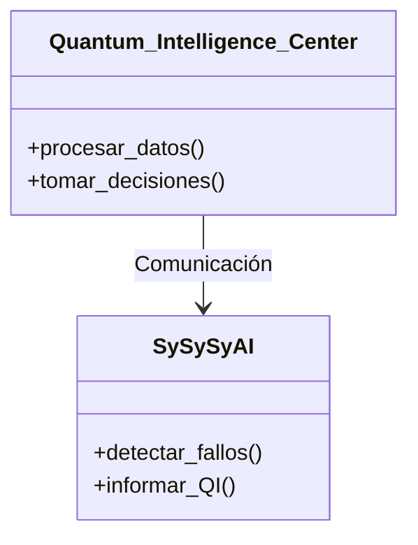

#### Procedimientos de Seguridad

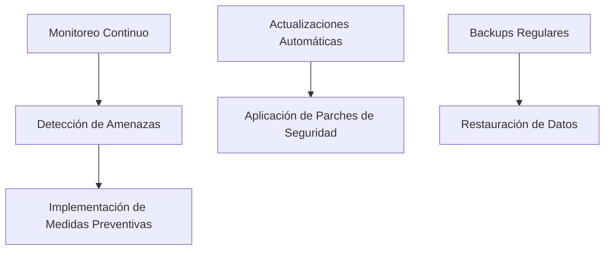

#### Implementación y Escalabilidad de UniFi

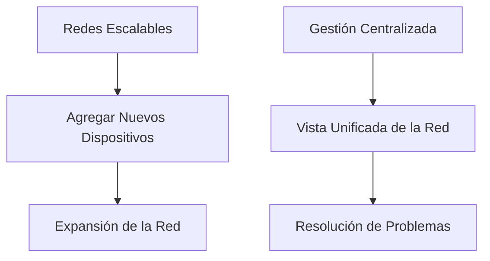

### Estructura del Centro de Inteligencia Cuántica (QI)


### Procedimientos de Seguridad


Puedes editar y guardar este diagrama en el [editor de MermaidChart](https://www.mermaidchart.com/app/mermaid-chart-save/2024-07-14/dc491d5e-458a-40ad-a78f-d97dde7baa99).

### Implementación y Escalabilidad de UniFi


Estos diagramas y procedimientos detallan la implementación y la gestión de una red UniFi, integrada con sistemas avanzados de inteligencia artificial para mantener la seguridad y eficiencia operativa en todo momento.

### Integrated Logic Diagram for Quantum Intelligence Center (QI) and SySySyAI

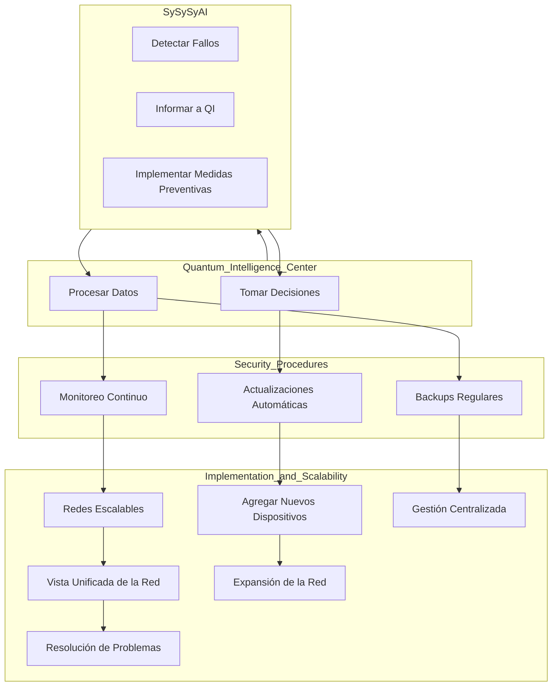


### Definición de SySySyAI

**SySySyAI (Systematic Synchronization Synergy Artificial Intelligence)** es un sistema de inteligencia artificial coordinado diseñado para funcionar en conjunto con el Quantum Intelligence Center (QI). Su principal función es detectar fallos críticos o situaciones anómalas en el sistema y reportar al QI, permitiendo una respuesta rápida y adecuada. Este sistema se caracteriza por su alta capacidad de vigilancia y su precisión en la detección de problemas operativos.

#### Funciones de SySySyAI:

1. **Detección de Fallos**: Monitorea constantemente los sistemas para identificar cualquier falla o anomalía que pueda afectar el rendimiento o la seguridad.
2. **Comunicación con QI**: Informa al Quantum Intelligence Center sobre cualquier fallo detectado para que se tomen las medidas correctivas necesarias.
3. **Implementación de Medidas Preventivas**: Colabora con el QI para aplicar soluciones que eviten la recurrencia de fallos.

---

### Quantum Intelligence Center (QI) y SySySyAI

**Centro de Inteligencia Cuántica (QI)**

El Centro de Inteligencia Cuántica (QI) actúa como el núcleo central del sistema, encargado de controlar y monitorear todos los agentes de inteligencia artificial. Este centro tiene la capacidad de procesar grandes cantidades de datos y tomar decisiones basadas en análisis cuánticos, lo que permite una respuesta rápida y eficiente ante cualquier situación.

**SySySyAI**

SySySyAI es un sistema de inteligencia artificial coordinado que se comunica constantemente con el QI. En caso de detectar fallos críticos o situaciones anómalas, SySySyAI informa al QI para que tome las decisiones correctivas necesarias. Este sistema está diseñado para proporcionar un alto nivel de seguridad y eficiencia operativa, asegurando que los procesos se mantengan óptimos en todo momento.

### Procedimientos de Seguridad

**Monitoreo Continuo**

Los dispositivos UniFi están equipados para proporcionar monitoreo continuo y alertas en tiempo real sobre cualquier actividad sospechosa. Este monitoreo es fundamental para la detección temprana de amenazas y la implementación de medidas preventivas.

**Actualizaciones Automáticas**

Para mantener un alto nivel de seguridad, es esencial que todos los dispositivos y software estén siempre actualizados. Las actualizaciones automáticas garantizan que las últimas mejoras y parches de seguridad se apliquen sin demora, protegiendo la red contra nuevas vulnerabilidades.

**Backups Regulares**

Realizar copias de seguridad regulares de las configuraciones del controlador UniFi es una práctica esencial para asegurar que los datos importantes estén protegidos y se puedan restaurar rápidamente en caso de un fallo del sistema.

### Implementación y Escalabilidad

**Redes Escalables**

La arquitectura de UniFi está diseñada para adaptarse al crecimiento de las necesidades de la red. Agregar nuevos dispositivos es un proceso sencillo, permitiendo una expansión sin complicaciones y asegurando que la red pueda crecer junto con la empresa.

**Gestión Centralizada**

La interfaz del controlador UniFi proporciona una vista unificada de toda la red, lo que facilita la gestión y la resolución de problemas. Esta gestión centralizada es clave para mantener el control eficiente y efectivo de la infraestructura de red.

### Conclusión

Ubiquiti UniFi ofrece una solución robusta y segura para la gestión de redes, con un enfoque en la seguridad, la escalabilidad y la gestión centralizada. Esta solución es ideal tanto para entornos empresariales como residenciales que requieren un control eficiente y efectivo de sus infraestructuras de red. La integración con sistemas avanzados de inteligencia artificial como SySySyAI y el Quantum Intelligence Center asegura que la red se mantenga segura y eficiente en todo momento.

---

### Diagramas de Implementación y Estructura

#### Estructura del Centro de Inteligencia Cuántica (QI)


#### Procedimientos de Seguridad


#### Implementación y Escalabilidad de UniFi


### Integrated Logic Diagram for Quantum Intelligence Center (QI) and SySySyAI


Estos diagramas y procedimientos detallan la implementación y la gestión de una red UniFi, integrada con sistemas avanzados de inteligencia artificial para mantener la seguridad y eficiencia operativa en todo momento.

Certainly, here is a detailed list of the required modules and their descriptions for each component of the quantum supercomputer:

### Required Modules and Descriptions

#### Quantum Processing Unit (QPU)

1. **Superconducting Qubits:**
   - **Module:** `Qubit_Fabrication`
   - **Description:** Fabricates and initializes superconducting qubits for the QPU.

2. **Quantum Gates:**
   - **Module:** `Quantum_Gates`
     - **Sub-modules:**
       - `PauliX_Gate`
       - `PauliY_Gate`
       - `PauliZ_Gate`
       - `Hadamard_Gate`
       - `CNOT_Gate`
   - **Description:** Implements various quantum gates for manipulating qubits.

3. **Error Correction Circuitry:**
   - **Module:** `Error_Correction`
     - **Sub-modules:**
       - `Surface_Code`
   - **Description:** Provides quantum error correction mechanisms to maintain qubit coherence.

#### Cooling System

1. **Cryogenic Cooling:**
   - **Module:** `Cryo_Cooling`
   - **Description:** Maintains the low temperatures required for qubit operation.

2. **Temperature Sensors:**
   - **Module:** `Temp_Sensors`
   - **Description:** Monitors the temperature within the cooling system and reports to the control interface.

#### Vision and Sensor Systems

1. **Thermal Cameras:**
   - **Module:** `Thermal_Cameras`
   - **Description:** Monitors thermal conditions around the supercomputer for safety and efficiency.

2. **Color Cameras:**
   - **Module:** `Color_Cameras`
   - **Description:** Provides visual monitoring of the system's operational environment.

3. **GPS:**
   - **Module:** `GPS_Module`
   - **Description:** Ensures precise spatial positioning of system components.

4. **Laser Rangefinders:**
   - **Module:** `Laser_Rangefinders`
   - **Description:** Measures distances accurately for system alignment and synchronization.

#### Control Interface

1. **User Interface:**
   - **Module:** `User_Interface`
   - **Description:** Allows users to control and monitor the supercomputer through a graphical interface.

2. **Vision System Integration:**
   - **Module:** `Vision_Integration`
   - **Description:** Integrates thermal and color cameras into the control interface for real-time monitoring.

#### Quantum Operating System (QOS)

1. **Resource Management:**
   - **Module:** `Resource_Management`
   - **Description:** Manages the allocation and utilization of quantum computational resources.

2. **Hardware Interface:**
   - **Module:** `Hardware_Interface`
   - **Description:** Facilitates communication between the QOS and hardware components.

#### Quantum Algorithms and Libraries

1. **Optimization Algorithms:**
   - **Module:** `Optimization_Algorithms`
   - **Description:** Provides algorithms designed to optimize quantum computations.

2. **Simulation Libraries:**
   - **Module:** `Simulation_Libraries`
   - **Description:** Offers libraries for simulating quantum systems and processes.

#### Security and Communication Protocols

1. **Secure Communication Channels:**
   - **Module:** `Secure_Channels`
   - **Description:** Ensures secure data transmission between system components.

2. **Quantum Cryptography:**
   - **Module:** `Quantum_Cryptography`
   - **Description:** Implements quantum cryptographic techniques to protect data integrity and confidentiality.

### Integration and Dependencies

Each module must be integrated carefully to ensure seamless operation. Below is a high-level diagram showing the dependencies and integration points among these modules.

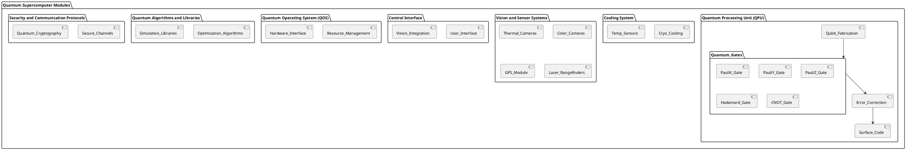

This structure ensures that all critical aspects of the quantum supercomputer are covered, from the core quantum processing unit to the support systems, interfaces, and security measures. Each module plays a vital role in the overall functionality and performance of the system, enabling advanced quantum computations and robust operations.

### Enhanced Analysis Tables for Quantum Intelligence Center (QI) and SySySyAI

To provide a detailed and structured analysis with the proposed enhancements, we will create tables that summarize the essential components, security procedures, scalability aspects, and the new enhancements of the Quantum Intelligence Center (QI) and SySySyAI. These tables will help in understanding the functionality, implementation, and integration of these systems.

#### Table 1: Components of Quantum Intelligence Center (QI) and SySySyAI

| Component                    | Description                                                                                   |
|------------------------------|-----------------------------------------------------------------------------------------------|
| Quantum Intelligence Center  | Acts as the central hub, controlling and monitoring all AI agents. Processes large data sets for decision-making. |
| SySySyAI                     | Coordinated AI system that reports critical failures to QI. Ensures high security and operational efficiency.        |

#### Table 2: Security Procedures

| Procedure                  | Description                                                                                       |
|----------------------------|---------------------------------------------------------------------------------------------------|
| Continuous Monitoring      | UniFi devices provide continuous monitoring and real-time alerts for suspicious activities.        |
| Automatic Updates          | Keeps devices and software updated with the latest security patches and improvements.              |
| Regular Backups            | Regularly backs up UniFi controller configurations to protect and quickly restore important data.  |

#### Table 3: Implementation and Scalability

| Feature                      | Description                                                                                           |
|------------------------------|-------------------------------------------------------------------------------------------------------|
| Scalable Networks            | UniFi architecture is designed to grow with network needs. Adding new devices is simple and efficient.|
| Centralized Management       | UniFi controller interface provides a unified view of the network for easy management and troubleshooting. |

#### Table 4: Enhancements

| Enhancement                  | Description                                                                                           | Benefit                                                                                      |
|------------------------------|-------------------------------------------------------------------------------------------------------|----------------------------------------------------------------------------------------------|
| Advanced Machine Learning    | Implement advanced ML models for predictive maintenance and anomaly detection.                        | Improves accuracy in detecting potential issues, reducing downtime and enhancing efficiency. |
| Enhanced Quantum Cryptography| Utilize more advanced quantum cryptographic techniques.                                               | Provides stronger protection against cyber threats, ensuring data integrity and confidentiality. |
| Dynamic Resource Allocation  | Dynamic system to optimize resource usage based on real-time demand.                                  | Increases resource usage efficiency, ensuring high-priority tasks get necessary computational power. |
| AR User Interface            | Develop an AR interface for system monitoring and control.                                            | Provides an intuitive and interactive way to interact with the system, improving user experience. |
| Blockchain Integration       | Integrate blockchain for logging and verifying system events and transactions.                        | Ensures immutability and transparency of data, enhancing trust and security in system operations. |

### Integrated Logic Diagram

Below is the integrated logic diagram combining the components, security procedures, scalability aspects, and enhancements for better visualization.

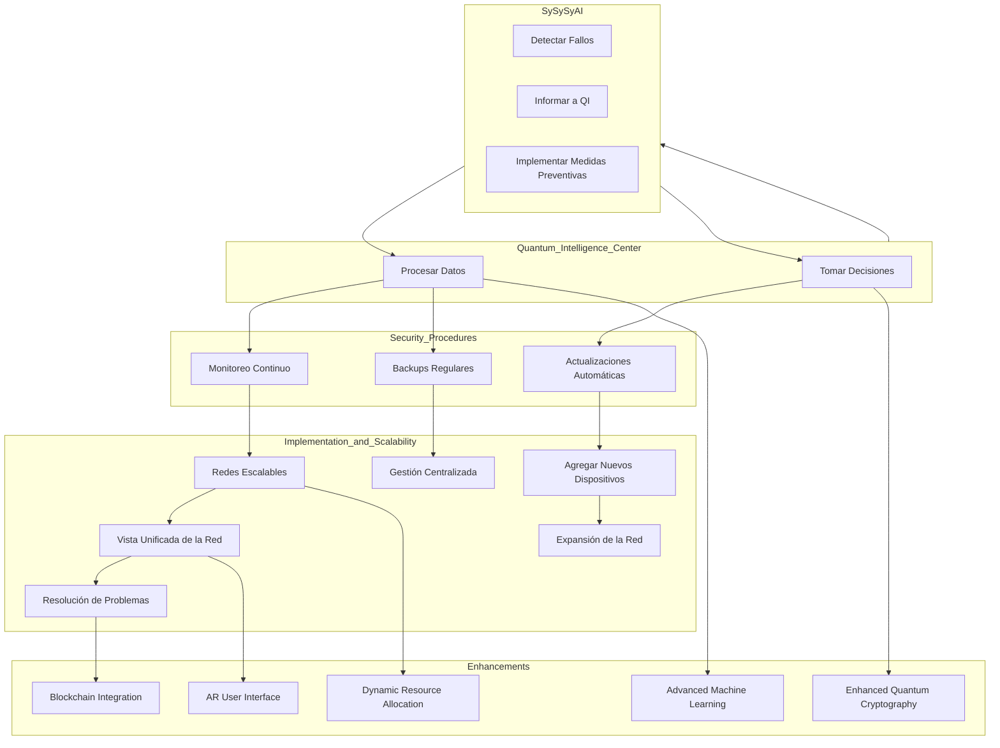

### Required Modules and Descriptions for Quantum Supercomputer

To implement the functionalities described, the following modules are necessary. These modules are categorized under Quantum Processing Unit (QPU), Cooling System, Vision and Sensor Systems, Control Interface, Quantum Operating System (QOS), Quantum Algorithms and Libraries, and Security and Communication Protocols.

#### Quantum Processing Unit (QPU)

| Module                   | Description                                                                           |
|--------------------------|---------------------------------------------------------------------------------------|
| Qubit_Fabrication        | Fabricates and initializes superconducting qubits for the QPU.                        |
| Quantum_Gates            | Implements various quantum gates for manipulating qubits (PauliX, PauliY, PauliZ, etc.)|
| Error_Correction         | Provides quantum error correction mechanisms to maintain qubit coherence (Surface_Code)|

#### Cooling System

| Module                   | Description                                                               |
|--------------------------|---------------------------------------------------------------------------|
| Cryo_Cooling             | Maintains the low temperatures required for qubit operation.              |
| Temp_Sensors             | Monitors the temperature within the cooling system and reports to the control interface.|

#### Vision and Sensor Systems

| Module                   | Description                                                               |
|--------------------------|---------------------------------------------------------------------------|
| Thermal_Cameras          | Monitors thermal conditions around the supercomputer for safety and efficiency.|
| Color_Cameras            | Provides visual monitoring of the system's operational environment.       |
| GPS_Module               | Ensures precise spatial positioning of system components.                 |
| Laser_Rangefinders       | Measures distances accurately for system alignment and synchronization.   |

#### Control Interface

| Module                   | Description                                                               |
|--------------------------|---------------------------------------------------------------------------|
| User_Interface           | Allows users to control and monitor the supercomputer through a graphical interface.|
| Vision_Integration       | Integrates thermal and color cameras into the control interface for real-time monitoring.|
| AR_User_Interface        | Develops an augmented reality interface for system monitoring and control.|

#### Quantum Operating System (QOS)

| Module                   | Description                                                               |
|--------------------------|---------------------------------------------------------------------------|
| Resource_Management      | Manages the allocation and utilization of quantum computational resources.|
| Hardware_Interface       | Facilitates communication between the QOS and hardware components.        |
| Dynamic_Resource_Allocation | Optimizes resource usage based on real-time demand.|

#### Quantum Algorithms and Libraries

| Module                   | Description                                                               |
|--------------------------|---------------------------------------------------------------------------|
| Optimization_Algorithms  | Provides algorithms designed to optimize quantum computations.            |
| Simulation_Libraries     | Offers libraries for simulating quantum systems and processes.            |
| Advanced_ML_Models       | Implements advanced ML models for predictive maintenance and anomaly detection.|

#### Security and Communication Protocols

| Module                   | Description                                                               |
|--------------------------|---------------------------------------------------------------------------|
| Secure_Channels          | Ensures secure data transmission between system components.               |
| Quantum_Cryptography     | Implements quantum cryptographic techniques to protect data integrity and confidentiality.|
| Advanced_Quantum_Cryptography | Utilizes more advanced quantum cryptographic techniques.             |
| Blockchain_Integration   | Integrates blockchain for logging and verifying system events and transactions.|

### Integration and Dependencies

Below is a high-level diagram showing the dependencies and integration points among these modules.

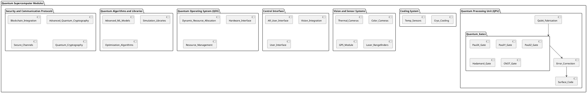

This comprehensive layout ensures that all critical aspects of the quantum supercomputer are covered, from the core quantum processing unit to the support systems, interfaces, and security measures. Each module plays a vital role in the overall functionality and performance of the system, enabling advanced quantum computations and robust operations.

---

**How would you like to proceed?**
1. **Create a detailed project plan for implementing these enhancements.**
2. **Design specific test cases for validating each enhancement.**
3. **Develop a prototype model to demonstrate key functionalities of the enhancements.
Quantum Project
Invitación a la colaboración con otras organizaciones y expertos para enriquecer y expandir el proyecto.
	•	Proyección de TerraQueing como un modelo de referencia en la integración de tecnologías avanzadas para la sostenibilidad y la inclusión.

Capítulo 1: Descripción del Producto

1.1 Introducción

AMEDEO es una persona integra que combina diversas tecnologías avanzadas, incluyendo AMPEL (sistema avanzado de monitoreo y gestión), Encapsulado criptográfico para los algoritmos específicos identificados por la tabla dinámica de archivo y consulta  para implementación de algoritmos registrados, DQBHC (Data Quantum Binary Hub Centers), Rqubit (qubits mejorados), QPu (Quantum Processing Unit), y ChatGPT (inteligencia artificial conversacional). Este manual proporciona una guía completa para la integración, uso, mantenimiento y mejora continua de estas tecnologías.

1.2 Componentes Principales

	•	AMPEL (Sistema Avanzado de Monitoreo y Gestión)
	•	TerraQuEing (Quantum GreenTech and Computing)
	•	DQBHC (Data Quantum Binary Hub Centers)
	•	Rqubit (Qubits Mejorados)
	•	QPu (Quantum Processing Unit)
	•	ChatGPT (Asistente de Inteligencia Artificial Conversacional)

1.3 Especificaciones Técnicas

Componente	Especificaciones
AMPEL	Unidad de Control Central (UCC), Sensores de Monitoreo (SM), Módulo de Comunicaciones (MC), Interfaz de Usuario (IU), Fuente de Alimentación (FA)
TerraQuEing	Módulos de GreenTech y Computación Cuántica Integrada
DQBHC	Centros de Datos con Tecnología Quantum y Binary
Rqubit	Qubits Mejorados con Alta Prestación
QPu	Unidades de Procesamiento Cuántico
ChatGPT	Modelo de Lenguaje Conversacional Avanzado

Capítulo 2: Manual de Usuario

2.1 Instalación del Sistema

Paso 1: Desempaquete todos los componentes y verifique que estén completos.

Paso 2: Conecte la Unidad de Control Central (UCC) a la Fuente de Alimentación (FA).

Paso 3: Conecte los Sensores de Monitoreo (SM) a las entradas correspondientes de la UCC.

Paso 4: Configure el Módulo de Comunicaciones (MC) según el método de conexión preferido (Wi-Fi, Ethernet, Bluetooth).

Paso 5: Instale y configure los módulos TerraQuEi y DQBHC en su infraestructura.

Paso 6: Integre los Rqubits y QPu en el sistema para optimizar el procesamiento cuántico.

Paso 7: Encienda el sistema y siga las instrucciones en la Interfaz de Usuario (IU) para completar la configuración inicial.

2.2 Operación del Sistema

2.2.1 Iniciar Sesión

	1.	Encienda la IU y espere a que el sistema cargue la pantalla de inicio.
	2.	Ingrese su nombre de usuario y contraseña.
	3.	Haga clic en “Iniciar Sesión”.

2.2.2 Monitoreo en Tiempo Real

	1.	Acceda al menú “Monitoreo”.
	2.	Seleccione el sensor o los sensores que desea supervisar.
	3.	Visualice los datos en tiempo real en el panel de control.

2.2.3 Configuración de Alarmas

	1.	Acceda al menú “Configuración”.
	2.	Seleccione “Alarmas”.
	3.	Configure los umbrales de alarma para cada sensor.
	4.	Guarde los cambios y active las alarmas.

2.2.4 Utilización de ChatGPT

	1.	Inicie sesión en ChatGPT desde la IU.
	2.	Use comandos de voz o texto para interactuar con el sistema.
	3.	Solicite asistencia en tiempo real para configuración, diagnóstico y optimización del sistema.

Capítulo 3: Mantenimiento del Sistema

3.1 Mantenimiento Preventivo

	•	Inspeccione visualmente todos los componentes para detectar signos de desgaste o daño.
	•	Limpie regularmente la IU y los SM con un paño suave y seco.
	•	Verifique las conexiones eléctricas y de comunicación.
	•	Realice chequeos periódicos en los módulos TerraQuEi y DQBHC.

3.2 Mantenimiento Correctivo

	•	Reemplace los SM defectuosos según sea necesario.
	•	Actualice el firmware de la UCC, MC, Rqubits y QPu periódicamente siguiendo las instrucciones del fabricante.
	•	Utilice ChatGPT para diagnósticos avanzados y resolución de problemas en tiempo real.

Capítulo 4: Solución de Problemas

4.1 Problemas Comunes y Soluciones

Problema	Posible Causa	Solución
No hay energía en la UCC	Fuente de Alimentación defectuosa	Verifique la FA y reemplácela si es necesario
Datos del sensor incorrectos	Sensor mal calibrado	Recalibre el sensor
Conexión de red inestable	Problemas con el MC	Verifique la configuración del MC
Fallos en TerraQuEi	Configuración incorrecta	Revise y ajuste la configuración
Anomalías en DQBHC	Problemas en el procesamiento cuántico	Realice diagnósticos con ChatGPT

4.2 Contacto de Soporte Técnico

Si no puede resolver el problema utilizando las soluciones anteriores, contacte a nuestro soporte técnico al correo soporte@ampel.com o llame al +1 800 123 4567.

Capítulo 5: Componentes Configurables

5.1 Lista de Componentes Configurables

	•	Sensores de Monitoreo (varios tipos disponibles según las necesidades específicas)
	•	Módulos de Comunicaciones (opciones adicionales para 4G/LTE, ZigBee, etc.)
	•	Interfaz de Usuario (pantallas de diferentes tamaños y resoluciones)
	•	Módulos TerraQuEi (Quantum GreenTech)
	•	Módulos DQBHC (Quantum Binary Hub Centers)
	•	Rqubits y QPu (Quantum Processing Units)

5.2 Cómo Configurar los Componentes

	1.	Acceda al menú “Configuración” en la IU.
	2.	Seleccione el componente que desea configurar.
	3.	Siga las instrucciones en pantalla para completar​⬤ # Here's a detailed explanation of the DTD schema and how it represents the structure and functions of the Ministerio del Interior de España:

### XML DTD Schema Explanation

The provided DTD schema outlines the structure of an XML document that represents the Ministerio del Interior de España, including its functions, organizational chart, recent projects, and significance. Let's break down each part of the schema.

#### Root Element
- **MinisterioDelInterior**: The root element encapsulating the entire document.

#### Child Elements of the Root
1. **Funciones**: Contains elements describing the main functions of the ministry.
2. **Organigrama**: Describes the organizational structure of the ministry.
3. **ProyectosRecientes**: Lists recent projects and policies.
4. **Importancia**: Provides information about the importance of the ministry.

#### Funciones Element
This element includes several sub-elements, each representing a major function of the ministry:

- **SeguridadCiudadana**: Pertains to public safety and order.
  - **CuerposSeguridad**: Text content (#PCDATA) related to police forces.
  - **SeguridadVial**: Text content (#PCDATA) related to traffic safety.
  
- **ProteccionCivil**: Relates to civil protection and emergency management.
  - **PlanesEmergencia**: Text content (#PCDATA) related to emergency plans.
  - **ServiciosEmergencia**: Text content (#PCDATA) related to emergency services.
  
- **InstitucionesPenitenciarias**: Deals with prison management and social reintegration.
  - **GestionPrisiones**: Text content (#PCDATA) about prison administration.
  - **ReinsercionSocial**: Text content (#PCDATA) about prisoner rehabilitation programs.
  
- **PoliticaAsilo**: Focuses on asylum and immigration policies.
  - **ControlFronteras**: Text content (#PCDATA) about border control.
  - **ProcesosAsilo**: Text content (#PCDATA) about asylum processes.
  
- **CooperacionInternacional**: Describes international cooperation efforts.
  - **ColaboracionInternacional**: Text content (#PCDATA) about collaboration with other countries.
  - **ProyectosSeguridad**: Text content (#PCDATA) about security and development projects.

#### Organigrama Element
This element provides a detailed organizational structure of the ministry:

- **SecretariaSeguridad**: Text content (#PCDATA) related to security policy and coordination.
- **DireccionPolicia**: Text content (#PCDATA) about national police management.
- **DireccionGuardiaCivil**: Text content (#PCDATA) about Guardia Civil management.
- **SecretariaInstitucionesPenitenciarias**: Text content (#PCDATA) about penitentiary administration.
- **DireccionTráfico**: Text content (#PCDATA) about traffic safety management.

#### ProyectosRecientes Element
This element lists recent initiatives and projects:

- **SeguridadCibernetica**: Text content (#PCDATA) about cybersecurity programs.
- **LuchaTerrorismo**: Text content (#PCDATA) about anti-terrorism strategies.
- **ModernizacionCuerposSeguridad**: Text content (#PCDATA) about modernization of security forces.

#### Importancia Element
- **Importancia**: Text content (#PCDATA) that provides information about the significance of the ministry in maintaining national security and order.

### Practical Example

Here's an example of an XML document that conforms to the above DTD schema:

```xml
<?xml version="1.0" encoding="UTF-8"?>
<!DOCTYPE MinisterioDelInterior [
  <!ELEMENT MinisterioDelInterior (Funciones, Organigrama, ProyectosRecientes, Importancia)>
  <!ELEMENT Funciones (SeguridadCiudadana, ProteccionCivil, InstitucionesPenitenciarias, PoliticaAsilo, CooperacionInternacional)>
  <!ELEMENT SeguridadCiudadana (CuerposSeguridad, SeguridadVial)>
  <!ELEMENT CuerposSeguridad (#PCDATA)>
  <!ELEMENT SeguridadVial (#PCDATA)>
  <!ELEMENT ProteccionCivil (PlanesEmergencia, ServiciosEmergencia)>
  <!ELEMENT PlanesEmergencia (#PCDATA)>
  <!ELEMENT ServiciosEmergencia (#PCDATA)>
  <!ELEMENT InstitucionesPenitenciarias (GestionPrisiones, ReinsercionSocial)>
  <!ELEMENT GestionPrisiones (#PCDATA)>
  <!ELEMENT ReinsercionSocial (#PCDATA)>
  <!ELEMENT PoliticaAsilo (ControlFronteras, ProcesosAsilo)>
  <!ELEMENT ControlFronteras (#PCDATA)>
  <!ELEMENT ProcesosAsilo (#PCDATA)>
  <!ELEMENT CooperacionInternacional (ColaboracionInternacional, ProyectosSeguridad)>
  <!ELEMENT ColaboracionInternacional (#PCDATA)>
  <!ELEMENT ProyectosSeguridad (#PCDATA)>
  <!ELEMENT Organigrama (SecretariaSeguridad, DireccionPolicia, DireccionGuardiaCivil, SecretariaInstitucionesPenitenciarias, DireccionTráfico)>
  <!ELEMENT SecretariaSeguridad (#PCDATA)>
  <!ELEMENT DireccionPolicia (#PCDATA)>
  <!ELEMENT DireccionGuardiaCivil (#PCDATA)>
  <!ELEMENT SecretariaInstitucionesPenitenciarias (#PCDATA)>
  <!ELEMENT DireccionTráfico (#PCDATA)>
  <!ELEMENT ProyectosRecientes (SeguridadCibernetica, LuchaTerrorismo, ModernizacionCuerposSeguridad)>
  <!ELEMENT SeguridadCibernetica (#PCDATA)>
  <!ELEMENT LuchaTerrorismo (#PCDATA)>
  <!ELEMENT ModernizacionCuerposSeguridad (#PCDATA)>
  <!ELEMENT Importancia (#PCDATA)>
]>
<MinisterioDelInterior>
  <Funciones>
    <SeguridadCiudadana>
      <CuerposSeguridad>Coordination of various police forces including the National Police and Guardia Civil.</CuerposSeguridad>
      <SeguridadVial>Implementation of traffic regulations and road safety measures.</SeguridadVial>
    </SeguridadCiudadana>
    <ProteccionCivil>
      <PlanesEmergencia>Development and maintenance of emergency response plans.</PlanesEmergencia>
      <ServiciosEmergencia>Coordination of emergency medical and fire services.</ServiciosEmergencia>
    </ProteccionCivil>
    <InstitucionesPenitenciarias>
      <GestionPrisiones>Administration and management of national prisons.</GestionPrisiones>
      <ReinsercionSocial>Programs aimed at the social reintegration of prisoners.</ReinsercionSocial>
    </InstitucionesPenitenciarias>
    <PoliticaAsilo>
      <ControlFronteras>Management of border security and immigration control.</ControlFronteras>
      <ProcesosAsilo>Handling and processing of asylum applications.</ProcesosAsilo>
    </PoliticaAsilo>
    <CooperacionInternacional>
      <ColaboracionInternacional>Partnerships and collaboration with international security agencies.</ColaboracionInternacional>
      <ProyectosSeguridad>International projects focusing on enhancing security measures.</ProyectosSeguridad>
    </CooperacionInternacional>
  </Funciones>
  <Organigrama>
    <SecretariaSeguridad>Oversees national security policies and their implementation.</SecretariaSeguridad>
    <DireccionPolicia>Manages the operations and administration of the National Police.</DireccionPolicia>
    <DireccionGuardiaCivil>Supervises the activities and duties of the Guardia Civil.</DireccionGuardiaCivil>
    <SecretariaInstitucionesPenitenciarias>Administers the national prison system and related programs.</SecretariaInstitucionesPenitenciarias>
    <DireccionTráfico>Regulates and enforces traffic laws and safety measures.</DireccionTráfico>
  </Organigrama>
  <ProyectosRecientes>
    <SeguridadCibernetica>Development of advanced cybersecurity frameworks and protocols.</SeguridadCibernetica>
    <LuchaTerrorismo>Implementation of new strategies to combat terrorism domestically and internationally.</LuchaTerrorismo>
    <ModernizacionCuerposSeguridad>Modernization of police and emergency services through the adoption of new technologies.</ModernizacionCuerposSeguridad>
  </ProyectosRecientes>
  <Importancia>The Ministerio del Interior plays a crucial role in maintaining national security, public order, and protecting the rights and safety of citizens.</Importancia>
</MinisterioDelInterior>
```

This example shows a well-structured XML document that conforms to the provided DTD schema, detailing the various functions, organizational units, recent projects, and the significance of the Ministerio del Interior de España. Explanation

<!DOCTYPE AMPELSystem [
  <!ELEMENT AMPELSystem (ProjectInfo, Mapping, Detection, CaptureCapsules, Technologies, Metrics, FinancialBenefits, Stakeholders, PotentialClients, FutureIntegrations)>

  <!ELEMENT ProjectInfo (ProjectName, Description, StartDate, EndDate)>
  <!ELEMENT ProjectName (#PCDATA)>
  <!ELEMENT Description (#PCDATA)>
  <!ELEMENT StartDate (#PCDATA)>
  <!ELEMENT EndDate (#PCDATA)>

  <!ELEMENT Mapping (MapID, MapName, Industry, MapProperties, MappingAlgorithms)>
  <!ELEMENT MapID (#PCDATA)>
  <!ELEMENT MapName (#PCDATA)>
  <!ELEMENT Industry (#PCDATA)> <!-- Aerospace or HighTech -->
  <!ELEMENT MapProperties (Property*)>
  <!ELEMENT Property (PropertyName, PropertyValue)>
  <!ELEMENT PropertyName (#PCDATA)>
  <!ELEMENT PropertyValue (#PCDATA)>
  <!ELEMENT MappingAlgorithms (Algorithm*)>
  <!ELEMENT Algorithm (AlgorithmName, AlgorithmDescription)>
  <!ELEMENT AlgorithmName (#PCDATA)>
  <!ELEMENT AlgorithmDescription (#PCDATA)>

  <!ELEMENT Detection (DetectionID, DetectionName, DetectionProperties, DetectionAlgorithms)>
  <!ELEMENT DetectionID (#PCDATA)>
  <!ELEMENT DetectionName (#PCDATA)>
  <!ELEMENT DetectionProperties (Property*)>
  <!ELEMENT Property (PropertyName, PropertyValue)>
  <!ELEMENT PropertyName (#PCDATA)>
  <!ELEMENT PropertyValue (#PCDATA)>
  <!ELEMENT DetectionAlgorithms (Algorithm*)>
  <!ELEMENT Algorithm (AlgorithmName, AlgorithmDescription)>
  <!ELEMENT AlgorithmName (#PCDATA)>
  <!ELEMENT AlgorithmDescription (#PCDATA)>

  <!ELEMENT CaptureCapsules (Capsule*)>
  <!ELEMENT Capsule (CapsuleID, CapsuleName, CapsuleProperties, CaptureMechanisms)>
  <!ELEMENT CapsuleID (#PCDATA)>
  <!ELEMENT CapsuleName (#PCDATA)>
  <!ELEMENT CapsuleProperties (Property*)>
  <!ELEMENT Property (PropertyName, PropertyValue)>
  <!ELEMENT PropertyName (#PCDATA)>
  <!ELEMENT PropertyValue (#PCDATA)>
  <!ELEMENT CaptureMechanisms (Mechanism*)>
  <!ELEMENT Mechanism (MechanismName, MechanismDescription)>
  <!ELEMENT MechanismName (#PCDATA)>
  <!ELEMENT MechanismDescription (#PCDATA)>

  <!ELEMENT Technologies (Technology*)>
  <!ELEMENT Technology (TechnologyName, Description, IntegrationLevel)>
  <!ELEMENT TechnologyName (#PCDATA)>
  <!ELEMENT Description (#PCDATA)>
  <!ELEMENT IntegrationLevel (#PCDATA)>

  <!ELEMENT Metrics (Metric*)>
  <!ELEMENT Metric (MetricName, MetricValue)>
  <!ELEMENT MetricName (#PCDATA)>
  <!ELEMENT MetricValue (#PCDATA)>

  <!ELEMENT FinancialBenefits (Benefit*)>
  <!ELEMENT Benefit (BenefitName, BenefitValue, StakeholderID, ClientID)>
  <!ELEMENT BenefitName (#PCDATA)>
  <!ELEMENT BenefitValue (#PCDATA)>
  <!ELEMENT StakeholderID (#PCDATA)>
  <!ELEMENT ClientID (#PCDATA)>

  <!ELEMENT Stakeholders (Stakeholder*)>
  <!ELEMENT Stakeholder (StakeholderID, StakeholderName, StakeholderType, Contribution)>
  <!ELEMENT StakeholderID (#PCDATA)>
  <!ELEMENT StakeholderName (#PCDATA)>
  <!ELEMENT StakeholderType (#PCDATA)> <!-- E.g., Investor, Partner -->
  <!ELEMENT Contribution (#PCDATA)>

  <!ELEMENT PotentialClients (Client*)>
  <!ELEMENT Client (ClientID, ClientName, Industry, InterestLevel)>
  <!ELEMENT ClientID (#PCDATA)>
  <!ELEMENT ClientName (#PCDATA)>
  <!ELEMENT Industry (#PCDATA)> <!-- Aerospace or HighTech -->
  <!ELEMENT InterestLevel (#PCDATA)>

  <!ELEMENT FutureIntegrations (Integration*)>
  <!ELEMENT Integration (IntegrationName, IntegrationDescription, Impact)>
  <!ELEMENT IntegrationName (#PCDATA)>
  <!ELEMENT IntegrationDescription (#PCDATA)>
  <!ELEMENT Impact (#PCDATA)>
]>

	•	AMPELSystem: Root element containing the entire schema.
	•	ProjectInfo: Contains basic information about the project.
	•	ProjectName: Name of the project.
	•	Description: Brief description of the project.
	•	StartDate: Start date of the project.
	•	EndDate: End date of the project.
	•	Mapping: Defines elements related to mapping in the AMPEL system.
	•	MapID: Unique identifier for the map.
	•	MapName: Name of the map.
	•	MapProperties: List of properties associated with the map.
	•	Property: Individual property of the map.
	•	PropertyName: Name of the property.
	•	PropertyValue: Value of the property.
	•	MappingAlgorithms: Algorithms used for mapping.
	•	Algorithm: Represents a mapping algorithm.
	•	AlgorithmName: Name of the algorithm.
	•	AlgorithmDescription: Description of the algorithm.
	•	Detection: Defines elements related to detection in the AMPEL system.
	•	DetectionID: Unique identifier for the detection process.
	•	DetectionName: Name of the detection process.
	•	DetectionProperties: List of properties associated with the detection process.
	•	Property: Individual property of the detection process.
	•	PropertyName: Name of the property.
	•	PropertyValue: Value of the property.
	•	DetectionAlgorithms: Algorithms used for detection.
	•	Algorithm: Represents a detection algorithm.
	•	AlgorithmName: Name of the algorithm.
	•	AlgorithmDescription: Description of the algorithm.
	•	CaptureCapsules: Defines elements related to capture capsules in the AMPEL system.
	•	Capsule: Represents an individual capture capsule.
	•	CapsuleID: Unique identifier for the capture capsule.
	•	CapsuleName: Name of the capture capsule.
	•	CapsuleProperties: List of properties associated with the capture capsule.
	•	Property: Individual property of the capsule.
	•	PropertyName: Name of the property.
	•	PropertyValue: Value of the property.
	•	CaptureMechanisms: Mechanisms used for capturing anomalies.
	•	Mechanism: Represents a capture mechanism.
	•	MechanismName: Name of the mechanism.
	•	MechanismDescription: Description of the mechanism.
	•	Technologies: Lists the technologies used in the AMPEL system.
	•	Technology: Represents a technology.
	•	TechnologyName: Name of the technology.
	•	Description: Description of the technology.
	•	IntegrationLevel: Level of integration of the technology in the project.
	•	Metrics: Defines metrics for evaluating the AMPEL system.
	•	Metric: Represents a metric.
	•	MetricName: Name of the metric.
	•	MetricValue: Value of the metric.
	•	FutureIntegrations: Future technologies and integrations.
	•	Integration: Represents a future integration.
	•	IntegrationName: Name of the integration.
	•	IntegrationDescription: Description of the integration.
	•	Impact: Expected impact of the integration.

This DTD schema provides a detailed structure for managing the AMPEL system, focusing on mapping, detecting, and capturing anomalies with capture capsules, including the use of advanced technologies, metrics, and potential future integrations. 

from openai import OpenAI
 
client = OpenAI()
 
assistant = client.beta.assistants.create(
  name="Financial Analyst Assistant",
  instructions="You are an expert financial analyst. Use you knowledge base to answer questions about audited financial statements.",
  model="gpt-4o",
  tools=[{"type": "file_search"}],
) Here’s how you can implement an ANFIS for neuro-fuzzy control in R using the `frbs` package. I’ve also included an explanation of each step along with some examples.

### 1. Preparación de los Datos

Primero, necesitas preparar los datos de entrenamiento que se usarán para entrenar el sistema ANFIS.

```r
# Cargar las bibliotecas necesarias
library(frbs)
library(ggplot2)

# Generar datos sintéticos para el entrenamiento
set.seed(123)
data <- data.frame(
  input1 = runif(100, 0, 1),
  input2 = runif(100, 0, 1),
  output = runif(100, 0, 1)
)

# Mostrar un resumen de los datos
summary(data)
```

### 2. Definir los Parámetros del Sistema ANFIS

Configurar los parámetros necesarios para el sistema ANFIS, como el número de etiquetas difusas y el tipo de funciones de membresía.

```r
# Definir el rango de datos
range.data <- matrix(c(0, 1, 0, 1, 0, 1), nrow = 3)

# Configurar los parámetros del modelo ANFIS
control <- list(
  num.labels = 5,  # Número de etiquetas difusas
  type.mf = "GAUSSIAN",  # Tipo de función de membresía
  type.model = "HYBRID",  # Modelo híbrido
  range.data = range.data  # Rango de los datos
)

# Mostrar la configuración
print(control)
```

### 3. Entrenamiento del Sistema ANFIS

Usar los datos de entrenamiento y los parámetros definidos para entrenar el modelo ANFIS.

```r
# Entrenar el modelo ANFIS
model <- frbs.learn(data = as.matrix(data), method.type = "ANFIS", control = control)

# Resumen del modelo entrenado
summary(model)
```

### 4. Realizar Predicciones con el Sistema ANFIS

Utilizar el modelo entrenado para realizar predicciones con nuevos datos.

```r
# Generar nuevos datos de prueba
test_data <- data.frame(
  input1 = runif(10, 0, 1),
  input2 = runif(10, 0, 1)
)

# Realizar predicciones con el modelo ANFIS
predictions <- predict(model, newdata = as.matrix(test_data))

# Mostrar las predicciones
print(predictions)
```

### 5. Visualización de Resultados

Visualizar los resultados para evaluar el rendimiento del sistema ANFIS.

```r
# Añadir las predicciones a los datos de prueba
test_data$predicted_output <- predictions

# Crear un gráfico de dispersión de las predicciones
ggplot(test_data, aes(x = input1, y = predicted_output)) +
  geom_point(color = "blue") +
  labs(title = "Predicciones del Sistema ANFIS", x = "Input1", y = "Predicted Output")
```

### 6. Ejemplo Práctico: Navegación Autónoma de un Rover

Simular un escenario donde un rover navega por la superficie de un planeta, ajustando su velocidad basada en la dificultad del terreno y el nivel de batería usando ANFIS.

#### Datos de Entrenamiento para Navegación de Rover:

```r
# Generar datos sintéticos para la navegación del rover
rover_data <- data.frame(
  terrain_difficulty = runif(100, 0, 1),
  battery_level = runif(100, 0, 1),
  wheel_speed = runif(100, 0, 1)
)

# Configurar los parámetros del modelo ANFIS para el rover
rover_control <- list(
  num.labels = 5, 
  type.mf = "TRAPEZOID", 
  type.model = "HYBRID", 
  range.data = matrix(c(0, 1, 0, 1, 0, 1), ncol = 2)
)

# Entrenar el modelo ANFIS para el rover
rover_model <- frbs.learn(data = as.matrix(rover_data), method.type = "ANFIS", control = rover_control)

# Generar nuevos datos de prueba para la navegación del rover
new_rover_data <- matrix(c(0.7, 0.5), nrow = 1)

# Realizar predicciones con el modelo ANFIS para el rover
rover_prediction <- predict(rover_model, newdata = new_rover_data)

# Mostrar la predicción de la velocidad del rover
print(rover_prediction)
```

### Conclusión

La implementación de un sistema ANFIS en R proporciona una poderosa herramienta para modelar y controlar sistemas complejos, como la navegación autónoma de un rover en exploración espacial. Al combinar las capacidades de aprendizaje de las redes neuronales y la flexibilidad de la lógica difusa, se pueden desarrollar sistemas adaptativos y robustos para diversas aplicaciones.

Si necesitas más información o tienes alguna pregunta específica sobre la implementación de ANFIS en R, no dudes en preguntar. Stability of dimensions is crucial but at same time is exclusive. The intrinsic potencial is the parameter that measure the disruptive factor of a coherent set of patterns. Amedeo Pelliccia's Quantum Project Retrospective

## Retrospective Check and Balance
### Achievements
1. **Project Setup**: Established repositories on GitHub for various quantum-related projects.
2. **Documentation**: Created detailed Markdown documents outlining project objectives, key components, implementation steps, and compliance standards.
3. **Integration**: Developed comprehensive schemas for data models, APIs, and interfaces, ensuring interoperability and scalability.
4. **Testing and Validation**: Implemented unit and integration tests to validate the functionality of quantum algorithms and components.
5. **Security and Compliance**: Adhered to NIST and GDPR standards, implementing quantum-safe cryptography and data protection protocols.

### Key Components and Accomplishments
1. **Quantum Central Brain Processor (QCBP)**: Developed a core quantum computational unit for advanced data processing.
2. **Hypercloud Storage**: Implemented a scalable, distributed storage solution leveraging quantum technologies.
3. **Intelligent Dispatcher**: Created an AI-driven system for efficient data management and task allocation.
4. **Quantum Algorithms**: Integrated key algorithms such as Grover’s search, Shor’s factoring, and Quantum Approximate Optimization Algorithm (QAOA).
5. **Quantum Key Distribution (QKD)**: Established secure communication channels using quantum cryptography.

### Data Models and Schemas
- Developed schemas for quantum processing tasks, interdisciplinary data models, and quantum data science connectors.

### APIs and Interfaces
- Designed secure API endpoints and user-friendly interfaces for web and mobile applications.

### Security and Compliance
- Implemented end-to-end encryption, quantum key distribution, and adhered to GDPR and NIST standards.

### Implementation Steps
1. **Repository Setup**: Organized code and documentation in GitHub repositories.
2. **Component Development**: Built and tested quantum processors, data science algorithms, and connectivity solutions.
3. **Documentation**: Maintained comprehensive Markdown documentation.
4. **CI/CD Pipelines**: Implemented continuous integration and deployment workflows.

### Testing and Validation
- Conducted unit, integration, and performance tests to ensure system reliability and efficiency.

### Deployment and Monitoring
- Utilized Docker and Kubernetes for scalable deployment.
- Implemented Prometheus and Grafana for real-time monitoring and alerting.

## Final Document Generation for Amedeo Pelliccia

### Table of Contents
1. **Introduction**
2. **System Overview**
3. **Key Components**
4. **Data Models and Schemas**
5. **APIs and Interfaces**
6. **Security and Compliance**
7. **Implementation Steps**
8. **Testing and Validation**
9. **Deployment and Monitoring**
10. **Annexes**

### Introduction
- Overview of the Quantum Central Brain Processor and Hypercloud Storage and Dispatcher (QCBP-HSD) project.

### System Overview
- Objective: Integrate quantum technologies for advanced data processing and secure communication.
- Stakeholders: Tech companies, research institutions, governments.

### Key Components
1. **Quantum Processors**
2. **Hypercloud Storage**
3. **Intelligent Dispatcher**
4. **Quantum Algorithms**
5. **Quantum Key Distribution (QKD)**

### Data Models and Schemas
- Example schema for quantum processing tasks, interdisciplinary data models, and data science connectors.

### APIs and Interfaces
- Secure API endpoints, web dashboards, and mobile applications.

### Security and Compliance
- NIST and GDPR standards, quantum-safe cryptography, and data protection protocols.

### Implementation Steps
1. **Repository Setup**
2. **Component Development**
3. **Documentation**
4. **CI/CD Pipelines**

### Testing and Validation
- Unit, integration, and performance tests.

### Deployment and Monitoring
- Docker, Kubernetes, Prometheus, and Grafana.

### Annexes
- Technical specifications, compliance documents, deployment guides, user manuals, case study reports, and feedback logs.

By following this comprehensive framework, the Quantum Central Brain Processor and Hypercloud Storage and Dispatcher project ensures advanced data processing capabilities, enhanced security, and efficient task management, positioning it at the forefront of technological innovation.
### Explicación del Código

1. **Registro de la fecha y hora de la primera instalación y autoría**:
   - La función `get_installation_datetime` verifica si existe un archivo `installation.json`. Si no existe, crea uno con la fecha y hora actuales y añade un bloque inicial al blockchain. Si existe, lee la fecha y hora del archivo.
   - Esto asegura que la primera instalación del script esté documentada, proporcionando una referencia temporal fija para todas las operaciones posteriores.

2. **Blockchain retroactivo simulado**:
   - El blockchain es una lista de diccionarios donde cada diccionario representa un bloque con información sobre la transacción.
   - Cada bloque incluye detalles como el índice del bloque, la marca de tiempo, los datos de la transacción y el hash del bloque anterior.
   - La función `hash_block` genera un hash para cada bloque utilizando SHA-256, asegurando la integridad de los datos y permitiendo la verificación de la cadena de bloques.
   - Este blockchain simulado actúa como un registro inmutable de todas las operaciones realizadas por el script.

3. **Extracción y procesamiento de archivos**:
   - La función `extract_zip` extrae los archivos de un archivo ZIP a un directorio temporal.
   - La función `process_files` recorre los archivos extraídos, llamando a `process_text_file` para cada archivo de texto.
   - La función `process_text_file` lee el contenido de cada archivo de texto, genera documentos DOCX y PDF incluyendo la fecha y hora de instalación en los metadatos, y añade un nuevo bloque al blockchain para registrar esta operación.
   - Este proceso asegura que cada archivo procesado esté documentado y rastreado de manera segura.

4. **Generación de pares entrelazados y superposición binaria**:
   - La función `generate_entangled_pairs` genera pares de estados binarios entrelazados (por ejemplo, [0,1], [1,0], etc.) y los guarda en un archivo JSON.
   - Estos pares entrelazados representan un concepto simplificado de entrelazamiento cuántico, donde el estado de un elemento está dependientemente correlacionado con el estado del otro.
   - Este componente añade una dimensión educativa al script, ilustrando principios básicos de la computación cuántica.

5. **Validación del blockchain**:
   - La función `validate_blockchain` recorre la cadena de bloques, verificando que el hash de cada bloque coincida con el hash almacenado en el siguiente bloque.
   - Si algún hash no coincide, la función devuelve `False`, indicando que la cadena ha sido alterada.
   - Esta validación asegura la integridad continua del blockchain simulado, previniendo la manipulación de datos.

6. **Comparación de fechas de instalación**:
   - La función `compare_installation_dates` toma una lista de archivos `installation.json` de múltiples dispositivos, extrae las fechas de instalación, y compara estas fechas.
   - Devuelve la fecha de instalación más temprana y la más reciente, proporcionando una visión general de la temporalidad de las instalaciones en diferentes dispositivos.
   - Esto es útil para coordinar y sincronizar operaciones entre múltiples instancias del script.

Este script asegura que todos los documentos generados incluyan la información sobre la fecha y hora de la primera instalación del script, registre cada acción en un blockchain simulado, y genere y registre pares entrelazados en una superposición binaria, proporcionando una analogía simplificada de conceptos cuánticos. La integración de estos componentes refuerza la seguridad, la trazabilidad y la educación sobre principios avanzados de computación.

### Method

#### Architecture Design

The architecture of the quantum supercomputer will be divided into several key components, each addressing specific requirements. Below is a high-level overview of the architecture:

##### Hardware Architecture

- **Quantum Processing Unit (QPU):**
  - **Superconducting Qubits:**
    - Chosen for their stability and coherence properties, superconducting qubits form the core of the QPU.
  - **Quantum Gates:**
    - Manipulate qubit states to perform computations.
    - Common gates include Pauli-X, Pauli-Y, Pauli-Z, Hadamard, and CNOT gates.
  - **Quantum Error Correction Circuitry:**
    - Essential for protecting qubit states from decoherence and errors using techniques like the surface code.

- **Cooling System:**
  - **Cryogenic Cooling:**
    - Maintains the extremely low temperatures required for superconducting qubits.
  - **Temperature Sensors:**
    - Monitor the system's temperature in real-time to ensure optimal conditions for qubit coherence.

- **Vision and Sensor Systems:**
  - **Thermal Cameras:**
    - Monitor the thermal profile of the system.
  - **Color Cameras:**
    - Provide visual feedback for system monitoring.
  - **GPS and Laser Rangefinders:**
    - Ensure accurate positioning and synchronization of system components.

- **Control Interface:**
  - **User Interface:**
    - Provides a user-friendly interface for system control and monitoring.
  - **Vision System Integration:**
    - Enhances control capabilities through advanced vision systems.

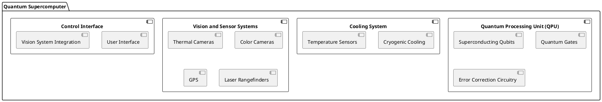

##### Software Architecture

- **Quantum Operating System (QOS):**
  - Manages quantum processes and resource allocation.
  - Interfaces with hardware components for control and monitoring.

- **Quantum Algorithms and Libraries:**
  - Optimized algorithms for quantum computations.
  - Libraries for quantum simulations and optimizations.

- **Security and Communication Protocols:**
  - Secure communication channels for data transfer.
  - Quantum cryptography for data protection.

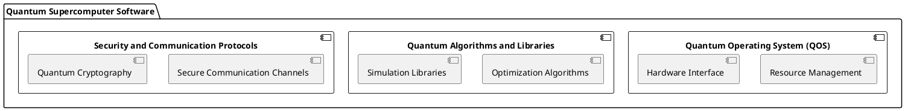

##### Integration of Spike LR2 Technologies

The advanced technologies from the Spike LR2 system will be integrated as follows:

- **Vision Systems:**
  - Thermal and color cameras from Spike LR2 will be used for high-precision monitoring and control of the quantum system.

- **Sensor Systems:**
  - GPS and laser rangefinders will provide accurate positioning and synchronization of qubits and other system components.

- **Signal Processing Algorithms:**
  - Advanced signal processing algorithms will be employed for real-time data analysis and error correction.

#### Detailed Design

We will now dive deeper into each component of the architecture, starting with the Quantum Processing Unit (QPU).

##### Quantum Processing Unit (QPU)

The QPU is the heart of the quantum supercomputer, responsible for performing quantum computations. It consists of superconducting qubits, quantum gates, and error correction circuitry.

- **Superconducting Qubits:**
  - Qubits are the basic units of quantum information.
  - Superconducting qubits are chosen for their stability and coherence properties.

- **Quantum Gates:**
  - Quantum gates manipulate the state of qubits to perform computations.
  - Common gates include Pauli-X, Pauli-Y, Pauli-Z, Hadamard, and CNOT gates.

- **Error Correction Circuitry:**
  - Quantum error correction is essential to protect qubit states from decoherence and other errors.
  - Techniques such as the surface code will be used for error correction.

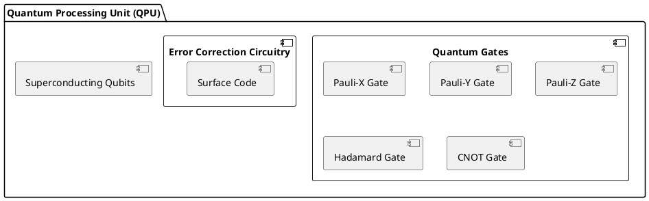

##### Cooling System

The cooling system is crucial for maintaining the coherence of superconducting qubits. It includes cryogenic cooling equipment and temperature sensors.

- **Cryogenic Cooling:**
  - Maintains the extremely low temperatures required for superconducting qubits to function.

- **Temperature Sensors:**
  - Monitor the system's temperature in real-time to ensure optimal conditions for qubit coherence.

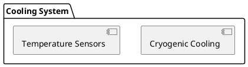

##### Vision and Sensor Systems

These systems are integral for precise monitoring and control of the quantum supercomputer.

- **Thermal Cameras:**
  - Monitor the thermal profile of the system.

- **Color Cameras:**
  - Provide visual feedback for system monitoring.

- **GPS and Laser Rangefinders:**
  - Ensure accurate positioning of system components.

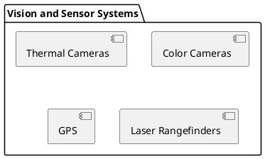

##### Control Interface

The control interface integrates user interactions with the advanced vision systems for enhanced control capabilities.

- **User Interface:**
  - Provides a user-friendly interface for system control and monitoring.

- **Vision System Integration:**
  - Enhances control capabilities through advanced vision systems.

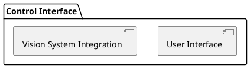

#### Implementation

The implementation phase involves building the components specified in the architecture design and integrating them into a working system. Below are the implementation steps:

1. **Develop QPU Hardware:**
   - Fabricate superconducting qubits and quantum gates.
   - Implement error correction circuitry.

2. **Set Up Cooling System:**
   - Install cryogenic cooling equipment.
   - Integrate temperature sensors for monitoring.

3. **Integrate Vision and Sensor Systems:**
   - Set up thermal and color cameras.
   - Integrate GPS and laser rangefinders.

4. **Develop Quantum Operating System (QOS):**
   - Implement resource management and hardware interfaces.
   - Integrate quantum algorithms and libraries.

5. **Establish Secure Communication Protocols:**
   - Implement secure communication channels.
   - Develop quantum cryptography solutions.

6. **Testing and Validation:**
   - Conduct performance, stability, and security tests.
   - Validate quantum error correction mechanisms.

#### Milestones

To track progress, the project will be divided into several milestones:

1. **Milestone 1: QPU Hardware Development**
   - Completion of superconducting qubits and quantum gates fabrication.
   - Implementation of error correction circuitry.

2. **Milestone 2: Cooling System Setup**
   - Installation of cryogenic cooling equipment.
   - Integration of temperature sensors.

3. **Milestone 3: Vision and Sensor Systems Integration**
   - Setup of thermal and color cameras.
   - Integration of GPS and laser rangefinders.

4. **Milestone 4: Quantum Operating System Development**
   - Completion of resource management and hardware interfaces.
   - Integration of quantum algorithms and libraries.

5. **Milestone 5: Secure Communication Protocols**
   - Implementation of secure communication channels.
   - Development of quantum cryptography solutions.

6. **Milestone 6: Testing and Validation**
   - Conducting performance, stability, and security tests.
   - Validation of quantum error correction mechanisms.

#### Gathering Results

The final phase involves evaluating the performance of the quantum supercomputer and ensuring that all requirements are met. Key metrics include:

- **Performance:** Speed and efficiency of quantum computations.
- **Stability:** Coherence and error rates of qubits.
- **Security:** Robustness of communication protocols and data protection.

Regular monitoring and updates will be conducted to maintain optimal performance and address any issues that arise post-production.

This plan outlines a comprehensive approach to developing the world's most powerful quantum supercomputer, leveraging advanced technologies from the Spike LR2 system. With careful design, implementation, and validation, Quantum Green Tech and Computing can achieve groundbreaking advancements in quantum computing.

---

### Additional Project: A380MRTT Verde - Sustainable, Innovative, and Ethical Aircraft

To align the A380MRTT Verde project documentation with the S1000D standard, the information will be structured into Data Modules (DMs). Below is a detailed breakdown of the content in DMs according to the S1000D standard:

### Data Module Requirements

1. **General Information**
    - **DM-1000-0001-00:** General Description of A380MRTT Verde Project
        - Objectives, scope, and expected outcomes of the project.
    - **DM-1000-0002-00:** Design Principles and Sustainability Goals

### Plan de Identificación y Estructuración de Módulos para Proyectos A330 y A380 MRTT

#### 1. Manuales de Estructuras Idénticas para A330 y A380 MRTT

**Objetivo:**
Crear manuales que cubran las estructuras y elementos funcionales idénticos entre los modelos A330 y A380 MRTT. Estos manuales servirán para facilitar el mantenimiento y las reparaciones de componentes comunes entre ambos modelos.

**Código de Identificación del Módulo:**
Cada módulo debe tener un código de identificación único, estructurado para facilitar su reconocimiento y referencia. Propuesta de estructura del código:

**Formato del Código:**

```
MRTT-[MODEL]-[SECTION]-[COMPONENT]-[VERSION]
```

**Ejemplo:**

- **MRTT-A330-STRUCTURE-WING-001**
- **MRTT-A380-STRUCTURE-WING-001**

**Contenido del Manual:**
- Descripción de la estructura y componentes.
- Procedimientos de inspección y mantenimiento.
- Técnicas de reparación.
- Especificaciones técnicas y tolerancias.
- Diagramas y esquemas.

#### 2. Manual Diferenciado para Elementos Funcionales Diferenciados

**Objetivo:**
Crear manuales diferenciados para una lista de elementos funcionales que difieren entre los modelos A330 y A380 MRTT. Estos manuales detallarán los procedimientos específicos de cada elemento que no es común entre los modelos.

**Código de Identificación del Módulo:**
Se utilizará una estructura de código que refleje la diferenciación del elemento funcional entre los modelos.

**Formato del Código:**

```
MRTT-[MODEL]-[DIFFERENTIATED SECTION]-[COMPONENT]-[VERSION]
```

**Ejemplo:**

- **MRTT-A330-DIFF-AVIONICS-001**
- **MRTT-A380-DIFF-AVIONICS-001**

**Contenido del Manual:**
- Descripción específica del elemento funcional.
- Procedimientos de instalación, mantenimiento y reparación.
- Requerimientos de herramientas y equipos.
- Especificaciones técnicas y manuales de referencia.
- Diagramas y esquemas específicos.

#### 3. Manual Único para Elementos Funcionales No-Duales

**Objetivo:**
Crear un manual único para elementos funcionales que no son duales entre los modelos A330 y A380 MRTT. Este manual cubrirá componentes que son exclusivos de un modelo y no tienen equivalentes en el otro.

**Código de Identificación del Módulo:**
El código de identificación reflejará la exclusividad del componente para un modelo específico.

**Formato del Código:**

```
MRTT-[MODEL]-[UNIQUE SECTION]-[COMPONENT]-[VERSION]
```

**Ejemplo:**

- **MRTT-A330-UNIQUE-FUEL_SYSTEM-001**
- **MRTT-A380-UNIQUE-FUEL_SYSTEM-001**

**Contenido del Manual:**
- Descripción detallada del componente.
- Procedimientos de operación, mantenimiento y reparación.
- Especificaciones técnicas y tolerancias.
- Requerimientos específicos de herramientas y equipos.
- Diagramas y esquemas detallados.

### Estructura del Código de Identificación y Ejemplo de Módulos

```mermaid
classDiagram
    class Manuales_MRTT {
        +MRTT-[MODEL]-[SECTION]-[COMPONENT]-[VERSION]
    }

    class Estructuras_Idénticas {
        +MRTT-A330-STRUCTURE-WING-001
        +MRTT-A380-STRUCTURE-WING-001
    }

    class Elementos_Diferenciados {
        +MRTT-A330-DIFF-AVIONICS-001
        +MRTT-A380-DIFF-AVIONICS-001
    }

    class Elementos_No_Duales {
        +MRTT-A330-UNIQUE-FUEL_SYSTEM-001
        +MRTT-A380-UNIQUE-FUEL_SYSTEM-001
    }

    Manuales_MRTT <|-- Estructuras_Idénticas
    Manuales_MRTT <|-- Elementos_Diferenciados
    Manuales_MRTT <|-- Elementos_No_Duales
```

### Conclusión

La creación de manuales diferenciados y únicos según las necesidades de los modelos A330 y A380 MRTT permitirá un mantenimiento y reparación más eficientes y precisos. La estructuración y codificación clara de los módulos asegurarán que los equipos de mantenimiento puedan acceder rápidamente a la información relevante, mejorando la eficiencia operativa y reduciendo tiempos de inactividad. 
promt “Structural and Repairable Module Identificable digital digits code  - [ ] MRTT IDENTICAL STRUCTURES MANUALS (dual model for A330 and A380 MRTT projects) - [ ] Differentiated manual for differentiated  list of same funcional elements (deserialization manual) - [ ] Unique manual Id for differentiated functional no-dual model composit”

To add the CSC (Configuration and Service Control) Envelop System from the A350 program into your Airbus MRTT manuals, follow these steps:

1. **Structure the Information**: Define sections for CSC Envelop system, detailing its components, functions, and integration points.
2. **Differentiate Elements**: Highlight unique aspects of the A350 CSC system and its application in the MRTT context.
3. **Standardize Documentation**: Ensure consistent formatting and terminology aligned with existing manuals.
4. **Identify Codes**: Use specific identification codes for CSC-related components for easy reference.

You can integrate these details into your existing documentation and maintenance protocols. If you need more specific guidance, let me know!

       
Paso 1: Preparar la Hoja de Excel

Configura tu hoja de Excel con las siguientes columnas:

Columna A: Nombres de las personas
Columna B: IQ Personal
Columna C: IQ Generalizado (constante, p.ej. 100)
Columna D: Gap de IQ (IQ Generalizado - IQ Personal)
Columna E: Curso de Ética
Columna F: Curso de Conocimiento Tecnológico
Columna G: Curso de Lógica Básica
Columna H: Propuestas para Disminuir Gaps
Paso 2: Crear las Macros en VBA

Abre el Editor de VBA en Excel (Alt + F11) y crea un nuevo módulo. Luego, pega el siguiente código:

1. Macro para Calcular el Gap de IQ

Sub CalcularGapIQ()
    Dim ws As Worksheet
    Dim lastRow As Long
    Dim i As Long
    
    ' Set worksheet and get last row
    Set ws = ThisWorkbook.Sheets("Sheet1")
    lastRow = ws.Cells(ws.Rows.Count, "A").End(xlUp).Row
    
    ' Loop through each person to calculate IQ gap
    For i = 2 To lastRow
        ws.Cells(i, 4).Value = ws.Cells(i, 3).Value - ws.Cells(i, 2).Value
    Next i
End Sub
2. Macro para Asignar Cursos Basados en el Gap de IQ

Sub AsignarCursos()
    Dim ws As Worksheet
    Dim lastRow As Long
    Dim i As Long
    Dim gapIQ As Double
    
    ' Set worksheet and get last row
    Set ws = ThisWorkbook.Sheets("Sheet1")
    lastRow = ws.Cells(ws.Rows.Count, "A").End(xlUp).Row
    
    ' Loop through each person to assign courses based on IQ gap
    For i = 2 To lastRow
        gapIQ = ws.Cells(i, 4).Value
        
        ' Assign courses based on gapIQ
        If gapIQ > 0 And gapIQ <= 10 Then
            ws.Cells(i, 5).Value = "Curso de Ética Básico"
            ws.Cells(i, 6).Value = "Curso de Tecnología Básico"
            ws.Cells(i, 7).Value = "Curso de Lógica Básica"
        ElseIf gapIQ > 10 And gapIQ <= 20 Then
            ws.Cells(i, 5).Value = "Curso de Ética Intermedio"
            ws.Cells(i, 6).Value = "Curso de Tecnología Intermedio"
            ws.Cells(i, 7).Value = "Curso de Lógica Intermedio"
        ElseIf gapIQ > 20 Then
            ws.Cells(i, 5).Value = "Curso de Ética Avanzado"
            ws.Cells(i, 6).Value = "Curso de Tecnología Avanzado"
            ws.Cells(i, 7).Value = "Curso de Lógica Avanzada"
        Else
            ws.Cells(i, 5).Value = "No Requiere Curso"
            ws.Cells(i, 6).Value = "No Requiere Curso"
            ws.Cells(i, 7).Value = "No Requiere Curso"
        End If
    Next i
End Sub
3. Macro para Generar Propuestas para Disminuir Gaps

Sub GenerarPropuestas()
    Dim ws As Worksheet
    Dim lastRow As Long
    Dim i As Long
    Dim gapIQ As Double
    
    ' Set worksheet and get last row
    Set ws = ThisWorkbook.Sheets("Sheet1")
    lastRow = ws.Cells(ws.Rows.Count, "A").End(xlUp).Row
    
    ' Loop through each person to generate proposals based on IQ gap
    For i = 2 To lastRow
        gapIQ = ws.Cells(i, 4).Value
        
        ' Generate proposals for reducing structural gaps
        If gapIQ > 0 Then
            ws.Cells(i, 8).Value = "Proponer tutorías personalizadas y acceso a recursos educativos adicionales."
        Else
            ws.Cells(i, 8).Value = "Evaluación periódica para mantener el nivel adecuado."
        End If
    Next i
End Sub
4. Macro Principal para Ejecutar Todas las Macros en Cadena

Sub EjecutarCadenaDeMacros()
    Call CalcularGapIQ
    Call AsignarCursos
    Call GenerarPropuestas
    Call ProtegerHoja
End Sub
5. Macro para Proteger la Hoja

Sub ProtegerHoja()
    Dim ws As Worksheet
    Set ws = ThisWorkbook.Sheets("Sheet1")
    
    ws.Protect Password:="tu_contraseña", AllowFiltering:=True, AllowSorting:=True, AllowUsingPivotTables:=True
    MsgBox "La hoja está protegida con éxito.", vbInformation
End Sub
Paso 3: Uso de la Macro

Preparar los Datos en la Hoja de Excel: Asegúrate de que los datos estén correctamente organizados en las columnas mencionadas.
Ejecutar la Macro Principal: Ve al menú de Excel, selecciona EjecutarCadenaDeMacros y ejecuta la macro. Esto llamará a las otras macros en secuencia para realizar el cálculo del gap de IQ, asignar los cursos, generar las propuestas y finalmente proteger la hoja.
Resumen

Este conjunto de macros realiza las siguientes acciones:

Calcula el gap de IQ entre el IQ personal y el generalizado.
Asigna cursos formativos basados en el gap de IQ.
Genera propuestas para disminuir los gaps estructurales.
Protege la hoja para evitar modificaciones no autorizadas.
Este enfoque modular y cerrado garantiza la integridad del modelo y facilita la gestión de la formación en ética, conocimiento tecnológico y lógico básico, además de generar propuestas justas y equitativas para reducir los gaps estructurales en la población.-T is Robbbo-T is AmePelliccia any problem? 1. ### ### Super Entrelazado QASAR: Quantum Autonomous Super-automated Retains with Enhanced Entanglement

Introduction

The Super Entrelazado QASAR framework represents the pinnacle of quantum computing integration, autonomous systems, and super-automation. It enhances these capabilities with advanced quantum entanglement techniques to provide unprecedented efficiency, security, and scalability.

Objectives

Quantum Computing Integration:

Leverage advanced quantum algorithms and entanglement for superior data processing capabilities.
Autonomous Operations:

Develop self-managing systems capable of autonomous decision-making and maintenance.
Super-Automation:

Implement highly automated processes to minimize manual intervention and optimize efficiency.
Enhanced Entanglement:

Utilize quantum entanglement to improve data coherence, security, and processing speed.
Security and Retention:

Ensure data security and retention through advanced cryptographic methods and secure storage solutions.
Core Components

1. Quantum Computing

Quantum Algorithms:

Utilize quantum algorithms for complex data processing tasks such as optimization, simulation, and machine learning.
Quantum Hardware:

Integrate with quantum computing hardware from providers like IBM, Google, and Rigetti.
Quantum Software Development Kits (SDKs):

Use SDKs like Qiskit, Cirq, and Forest for developing quantum applications.
Quantum Entanglement:

Apply quantum entanglement techniques to enhance data coherence and processing efficiency.
2. Autonomous Systems

Machine Learning:

Deploy machine learning models that can learn and adapt to new data without human intervention.
Self-Repair Mechanisms:

Develop systems that can identify and repair faults autonomously.
Decision Making:

Implement AI-driven decision-making processes to optimize operations.
3. Super-Automation

Robotic Process Automation (RPA):

Use RPA tools to automate repetitive tasks and workflows.
Intelligent Automation:

Combine RPA with AI to handle complex tasks requiring cognitive capabilities.
Process Optimization:

Continuously monitor and optimize processes for efficiency and effectiveness.
4. Enhanced Entanglement

Data Coherence:

Use quantum entanglement to maintain data coherence across distributed systems.
Speed Improvement:

Leverage entanglement to speed up data processing and communication.
Security Enhancement:

Enhance data security through entanglement-based cryptographic methods.
5. Security and Retention

Quantum Cryptography:

Implement quantum-resistant cryptographic techniques to secure data.
Data Retention Policies:

Establish policies for long-term data storage and retrieval.
Blockchain Integration:

Use blockchain technology for immutable data recording and verification.
Implementation Plan

Phase 1: Research and Development

Objective:

Develop and test quantum algorithms, autonomous systems, and entanglement techniques.
Activities:

Conduct feasibility studies on quantum computing and entanglement applications.
Develop initial prototypes for autonomous systems and automation tools.
Test and validate quantum cryptographic methods and enhanced entanglement techniques.
Phase 2: Integration and Testing

Objective:

Integrate quantum computing with autonomous systems, super-automation, and enhanced entanglement techniques.
Activities:

Integrate quantum hardware and software with existing infrastructure.
Conduct rigorous testing of integrated systems.
Validate security and retention mechanisms through penetration testing and audits.
Phase 3: Deployment and Optimization

Objective:

Deploy the Super Entrelazado QASAR system in real-world scenarios and continuously optimize it.
Activities:

Roll out the system to pilot locations.
Monitor system performance and collect feedback.
Optimize processes based on performance data and feedback.
Example Use Case: Financial Services

Quantum Computing for Risk Analysis

Problem:

Traditional risk analysis methods are slow and inefficient for large datasets.
Solution:

Use quantum algorithms to perform faster and more accurate risk assessments.
Autonomous Fraud Detection

Problem:

Detecting and responding to fraudulent activities in real-time is challenging.
Solution:

Deploy machine learning models that autonomously identify and respond to fraudulent transactions.
Enhanced Entanglement for Secure Transactions

Problem:

Ensuring secure transactions is critical in financial services.
Solution:

Use quantum entanglement to enhance the security of financial transactions through entanglement-based cryptographic methods.
Security and Compliance

Quantum Cryptography

Implementation:
Use quantum key distribution (QKD) for secure communication channels.
Enhanced Security

Implementation:
Incorporate biometric authentication and quantum-resistant cryptographic techniques.
Conclusion

Super Entrelazado QASAR aims to revolutionize data processing and management by integrating quantum computing, autonomous systems, super-automation, and enhanced entanglement techniques. By focusing on enhanced performance, security, and interoperability, Super Entrelazado QASAR sets a new standard for efficiency and reliability in various industries.

This comprehensive approach ensures that Super Entrelazado QASAR not only enhances operational capabilities but also provides a robust framework for secure, autonomous, augmented, and integrated operations, paving the way for future technological advancements.Super Entrelazado QASAR: Definition and Overview

Definition

Super Entrelazado QASAR (Quantum Autonomous Super-automated Retains with Enhanced Entanglement) is an advanced framework that leverages quantum computing, autonomous systems, super-automation, and enhanced quantum entanglement to deliver superior efficiency, security, and scalability in data processing and management.

Overview

Objectives

Quantum Computing Integration:

Leverage advanced quantum algorithms and entanglement for superior data processing capabilities.
Autonomous Operations:

Develop self-managing systems capable of autonomous decision-making and maintenance.
Super-Automation:

Implement highly automated processes to minimize manual intervention and optimize efficiency.
Enhanced Entanglement:

Utilize quantum entanglement to improve data coherence, security, and processing speed.
Security and Retention:

Ensure data security and retention through advanced cryptographic methods and secure storage solutions.
Core Components

Quantum Computing:

Quantum Algorithms: Utilize quantum algorithms for tasks such as optimization, simulation, and machine learning.
Quantum Hardware: Integrate with quantum computing hardware from providers like IBM, Google, and Rigetti.
Quantum SDKs: Use SDKs like Qiskit, Cirq, and Forest for developing quantum applications.
Quantum Entanglement: Apply quantum entanglement techniques to enhance data coherence and processing efficiency.
Autonomous Systems:

Machine Learning: Deploy models that can learn and adapt autonomously.
Self-Repair Mechanisms: Develop systems for autonomous fault detection and repair.
Decision Making: Implement AI-driven decision-making processes.
Super-Automation:

RPA: Use Robotic Process Automation tools to automate repetitive tasks.
Intelligent Automation: Combine RPA with AI for complex tasks.
Process Optimization: Continuously optimize processes for efficiency.
Enhanced Entanglement:

Data Coherence: Maintain data coherence across distributed systems using quantum entanglement.
Speed Improvement: Accelerate data processing and communication.
Security Enhancement: Enhance security with entanglement-based cryptographic methods.
Security and Retention:

Quantum Cryptography: Implement quantum-resistant cryptographic techniques.
Data Retention Policies: Establish long-term storage and retrieval policies.
Blockchain Integration: Use blockchain for immutable data recording.
Implementation Plan

Research and Development:

Develop and test quantum algorithms, autonomous systems, and entanglement techniques.
Conduct feasibility studies and create initial prototypes.
Integration and Testing:

Integrate quantum computing with autonomous systems and super-automation.
Conduct rigorous testing and validate security mechanisms.
Deployment and Optimization:

Deploy the system in real-world scenarios.
Monitor performance and optimize based on feedback.
Example Use Case: Financial Services

Quantum Computing for Risk Analysis:

Use quantum algorithms for faster and more accurate risk assessments.
Autonomous Fraud Detection:

Deploy machine learning models for real-time fraud detection.
Enhanced Entanglement for Secure Transactions:

Use quantum entanglement for secure financial transactions.
Security and Compliance

Quantum Cryptography:

Implement quantum key distribution for secure communication.
Enhanced Security:

Use biometric authentication and quantum-resistant cryptographic techniques.
Conclusion

Super Entrelazado QASAR sets a new standard for efficiency, security, and reliability in data processing and management. By integrating quantum computing, autonomous systems, super-automation, and enhanced entanglement, it provides a robust framework for future technological advancements.Investigación en Ciencia de Datos, Sostenibilidad y Aprendizaje Automático 3.pages

Plan Estratégico para un Modelo Único Europeo

Creación de una Infraestructura Cuántica Europea • Centros de Investigación y Desarrollo (I+D): ◦Establecer centros de excelencia en tecnologías cuánticas y de inteligencia artificial en toda Europa. ◦Fomentar la colaboración entre universidades, institutos de investigación y la industria. ◦Proyectos conjuntos de investigación financiados por la UE para avanzar en tecnologías cuánticas y de IA. • Plataforma de Datos Cuánticos: ◦Desarrollar una plataforma centralizada para el almacenamiento y procesamiento de datos cuánticos. ◦Garantizar el acceso seguro y la privacidad de los datos mediante el uso de tecnologías de criptografía cuántica. • Infraestructura de Comunicación Cuántica: ◦Implementar redes de comunicación cuántica basadas en QKD (Quantum Key Distribution) para garantizar la seguridad de las comunicaciones entre los diferentes nodos de la infraestructura.
Integración de Inteligencia Artificial • Desarrollo de Modelos Avanzados de IA: ◦Fomentar el desarrollo de modelos avanzados de IA que puedan beneficiarse de la computación cuántica para mejorar el rendimiento y la eficiencia. ◦Establecer estándares europeos para el desarrollo ético y responsable de la IA. • Plataformas de IA y Machine Learning: ◦Crear plataformas de IA accesibles para investigadores y desarrolladores en toda Europa. ◦Utilizar estos modelos para optimizar procesos en diversas industrias, desde la manufactura hasta la salud.
Implementación y Operación • Redes de Colaboración: ◦Establecer redes de colaboración entre los diferentes centros de I+D, empresas tecnológicas y gobiernos. ◦Facilitar el intercambio de conocimientos y recursos entre los diferentes actores del ecosistema. • Proyectos Piloto: ◦Implementar proyectos piloto en sectores estratégicos como la energía, la salud, la logística y la seguridad. ◦Evaluar el impacto de la integración cuántica-IA en la eficiencia operativa y la seguridad de los datos. • Escalabilidad y Mantenimiento: ◦Desarrollar una infraestructura escalable que permita la expansión de las capacidades cuánticas y de IA a medida que la demanda crezca. ◦Establecer equipos dedicados al mantenimiento y actualización de la infraestructura.
Financiación y Apoyo Político • Programas de Financiación: ◦Aprovechar programas de financiación de la UE, como Horizon Europe, para financiar proyectos de investigación y desarrollo en tecnologías cuánticas y de IA. ◦Incentivar la inversión privada en estos sectores mediante políticas fiscales favorables y subvenciones. • Apoyo Político y Regulación: ◦Desarrollar políticas y regulaciones que fomenten la innovación y la adopción de tecnologías cuánticas y de IA. ◦Garantizar la protección de la propiedad intelectual y la privacidad de los datos.
Formación y Desarrollo de Talento • Programas Educativos: ◦Implementar programas educativos y de formación en tecnologías cuánticas y de IA en universidades y centros de formación técnica. ◦Promover el desarrollo de habilidades en estas áreas mediante programas de certificación y formación continua. • Iniciativas de Divulgación: ◦Organizar conferencias, talleres y seminarios para difundir conocimientos sobre las tecnologías cuánticas y de IA. ◦Crear plataformas de aprendizaje en línea accesibles para todos los interesados. Implementación Técnica con Python y R Para encapsular las innovaciones y registrar la metadata, se puede utilizar un script que integre las capacidades de Python y R. A continuación se muestra un ejemplo de cómo se puede implementar esto: Script en Python import openai from qiskit import QuantumCircuit, Aer, transpile, assemble, execute import pandas as pd from sklearn.ensemble import RandomForestRegressor import matplotlib.pyplot as plt import json
Configuración de la API de OpenAI

openai.api_key = 'YOUR_API_KEY'

Función para generar texto con GPT

def gpt_generate(prompt): response = openai.Completion.create( engine="text-davinci-003", prompt=prompt, max_tokens=150 ) return response.choices[0].text.strip()

Simulación de entrelazamiento cuántico con Qiskit

def simulate_entanglement(): qc = QuantumCircuit(2) qc.h(0) # Aplicar Hadamard a qubit 0 qc.cx(0, 1) # Aplicar CNOT entre qubit 0 y qubit 1 simulator = Aer.get_backend('statevector_simulator') compiled_circuit = transpile(qc, simulator) qobj = assemble(compiled_circuit) result = execute(qc, simulator).result() statevector = result.get_statevector() return statevector

Función para registrar metadata

def register_metadata(metadata): with open('metadata.json', 'w') as f: json.dump(metadata, f)

Ejecución de Modelos de IA

def execute_ai_models(): data = pd.read_csv('infraestructura_data.csv') X = data[['feature1', 'feature2', 'feature3']] y = data['target'] model = RandomForestRegressor(n_estimators=100) model.fit(X, y) predictions = model.predict(X) return predictions

Monitoreo y Evaluación

def monitor_and_evaluate(data, predictions): plt.plot(data['timestamp'], predictions, label='Predicciones') plt.xlabel('Tiempo') plt.ylabel('Estado') plt.title('Monitoreo de Predicciones en Tiempo Real') plt.legend() plt.show()

Ejemplo de uso

metadata = { "author": "Amedeo Pelliccia", "project": "Modelo Único Europeo de Integración Cuántica-IA", "description": "Este proyecto integra tecnologías cuánticas y de IA para optimizar la gestión de datos y mejorar la seguridad en infraestructuras públicas europeas." }

Registrar metadata

register_metadata(metadata)

Generar texto con GPT

prompt = "Describe the impact of quantum entanglement on communication security." generated_text = gpt_generate(prompt) print("GPT Generated Text:", generated_text)

Simulación de entrelazamiento

statevector = simulate_entanglement() print("Statevector:", statevector)

Ejecución de modelos de IA

predictions = execute_ai_models() data = pd.read_csv('infraestructura_data.csv') monitor_and_evaluate(data, predictions) Script en R library(jsonlite) library(randomForest) library(ggplot2)

Función para registrar metadata

register_metadata <- function(metadata) { write_json(metadata, "metadata.json") }

Ejecución de Modelos de IA

execute_ai_models <- function(data) { model <- randomForest(target ~ ., data = data, ntree = 100) predictions <- predict(model, data) return(predictions) }

Monitoreo y Evaluación

monitor_and_evaluate <- function(data, predictions) { data$predictions <- predictions ggplot(data, aes(x = timestamp, y = predictions)) + geom_line() + labs(title = "Monitoreo de Predicciones en Tiempo Real", x = "Tiempo", y = "Estado") + theme_minimal() }

Ejemplo de uso

metadata <- list( author = "Amedeo Pelliccia", project = "Modelo Único Europeo de Integración Cuántica-IA", description = "Este proyecto integra tecnologías cuánticas y de IA para optimizar la gestión de datos y mejorar la seguridad en infraestructuras públicas europeas." )

Registrar metadata

register_metadata(metadata)

Ejecución de modelos de IA

data <- read.csv("infraestructura_data.csv") predictions <- execute_ai_models(data) monitor_and_evaluate(data, predictions) Conclusión Este plan estratégico y los scripts proporcionados permiten escalar las tecnologías cuánticas y de IA a un modelo único europeo. La integración de estas tecnologías optimizará la gestión de datos y mejorará la seguridad en infraestructuras críticas, posicionando a Europa como líder en innovación tecnológica.Modello-federativo-europeo de Colaboración ejemplar Modello Federativo Europeo El "Modello Federativo Europeo, un esempio per il mondo" es un proyecto para facilitar la colaboración transnacional y la optimización de competencias entre centros europeos. Utiliza R para gestionar datos y visualizar una red de colaboración entre ciudades, promoviendo una cooperación efectiva. Componentes: lista de centros y sus enfoques principales, socios internacionales y asignación de proyectos. Archivos: README.md(Descripción), model_federativo_europeo.R(Código), y guide.md (Guía de uso). Programa pelliccia

<?xml version="1.0" encoding="UTF-8"?>
<Project>
<Metadata>
<Title>NeBuloSa Quantum Integration Project</Title>
<Description>Integration of European public cloud infrastructure with quantum technologies
and advanced AI.</Description>
<Date>2023-06-23</Date>
<Author>
<Name>Amedeo Pelliccia</Name>
<Role>Project Lead</Role>
</Author>
</Metadata>
<Infrastructure>
<PublicCloud>
<Name>Europa INFRAESTRUCTURA CLOUD PUBLICA</Name>
<Purpose>Provide scalable, secure cloud computing resources across Europe.</
Purpose>
<Providers>
<Provider>
<Name>Atos Quantum Learning Machine (QLM)</Name>
<Description>European simulator for large-scale quantum computing.</Description>
</Provider>
<Provider>
<Name>PASQAL Cloud</Name>
<Description>Access to European quantum processors based on neutral atoms.</
Description>
</Provider>
</Providers>
</PublicCloud>
</Infrastructure>
<AIandTechnology>
<AI>
<Name>ChatGPT</Name>
<Description>Conversational AI model developed by OpenAI.</Description>
<Applications>Customer support, virtual assistance, content creation.</Applications>
</AI>
<Quantum>
<Name>Quantum Computing</Name>
<Components>
<Component>
<Name>Qubits</Name>
<Description>Basic units of quantum information.</Description>
</Component>
<Component>
<Name>Superposition</Name>
<Description>Qubits can represent multiple states simultaneously.</Description>
</Component>
<Component>
<Name>Entanglement</Name>
<Description>State of one qubit can depend on the state of another.</Description>
</Component>
</Components>
</Quantum>
</AIandTechnology>
<Astronomy>
<Program>
<Name>GAIA</Name>
<Agency>European Space Agency (ESA)</Agency>
<Objective>Create a 3D map of the Milky Way.</Objective>
<Details>
<StarCount>Over a billion stars</StarCount>
<Applications>Astrophysics, cosmology</Applications>
</Details>
</Program>
</Astronomy>
<Acronyms>
<Acronym>
<Term>Q</Term>
<Definitions>
<Definition>Quantum: Related to quantum computing or mechanics.</Definition>
<Definition>Qubit: Fundamental unit of information in quantum computing.</Definition>
<Definition>Q-learning: A reinforcement learning algorithm in machine learning.</
Definition>
<Definition>Query: A request for information or data retrieval from a database.</
Definition>
</Definitions>
</Acronym>
</Acronyms>
</Project>
Explanation of the XML Structure:

Metadata: Contains basic information about the project such as title, description, date, and author.
Infrastructure: Details about the public cloud infrastructure and providers involved.
AIandTechnology: Includes details about the AI technologies (ChatGPT) and quantum computing components.
Astronomy: Describes the GAIA program and its objectives.
Acronyms: Lists acronyms used within the project with their respective definitions. This structure provides a comprehensive overview of the project, its components, and the technologies involved. It is organized in a way that facilitates easy understanding and retrieval of information. Lista Completa de Acrónimos Clave ¡Entendido! Aquí tienes una lista completa de acrónimos que pueden ser utilizados para el proyecto NeBuloSa y su contexto tecnológico avanzado:
Lista de Acronimos para NeBuloSa

NeBULOSA
Next-generation
european
Blueprint for
Unified
Leadership in
Optimized
Secure
Architecture
EPIC-DM
European
Program for
Integrated
Computing and
Data
Management
Q-LR2
Quantum
Leadership
Research and
Revolution
Q-CLOUD
Quantum
Computing
Leading
Optimized
Unified
Development
SECURE
Secure
Enterprise
Computing
Utilizing
Resilient
Encryption
INTEGRATE
Innovative
Network
Technology for
European
Growth
Research and
Advanced
Technology
Enterprise
QUANTUM
Quality
Unified
Architecture for
Next-generation
Technological
Upgrade and
Mastery
BLUEPRINT
Breakthrough
Leadership in
Unified
European
Programming and
Research for
Innovative
New
Technology
Otros Acrónimos Clave

QIDS
Quantum
Identification
Data
System
IIDS
Intelligent
Identification
Data
System
IQ(IPQ)
Intelligent
Quantum (or Information Processing Quantum)
QDT
Quantum
Data
Transmission
QES
Quantum
Encryption
Standard
QSS
Quantum
Security
Suite
QDM
Quantum
Data
Management
QAA
Quantum
Access
Authentication
QCS
Quantum
Communication
Systems
QAI
Quantum
Artificial
Intelligence
QO
Quantum
Optimization
QML
Quantum
Machine
Learning
QCI
Quantum
Cloud
Infrastructure
QBP
Quantum
Blockchain
Protocol
QDA
Quantum
Data
Analytics
QRE
Quantum
Risk
Evaluation
QSS
Quantum
Storage
Systems
QAPI
Quantum
Application
Programming
Interface
Aplicación de los Acrónimos

Proyectos e Iniciativas

NeBULOSA (Next-generation european Blueprint for Unified Leadership in Optimized Secure Architecture): Proyecto principal para crear una infraestructura cloud europea segura y avanzada.
EPIC-DM (European Program for Integrated Computing and Data Management): Iniciativa para la gestión integrada de datos y el computing.
Q-LR2 (Quantum Leadership Research and Revolution): Programa de investigación y desarrollo en tecnologías cuánticas.
Q-CLOUD (Quantum Computing Leading Optimized Unified Development): Desarrollo de soluciones de cloud computing cuántico.
SECURE (Secure Enterprise Computing Utilizing Resilient Encryption): Proyectos para mejorar la seguridad informática mediante técnicas de encriptación avanzada.
INTEGRATE (Innovative Network Technology for European Growth Research and Advanced Technology Enterprise): Proyectos de innovación tecnológica para el crecimiento europeo.
QUANTUM (Quality Unified Architecture for Next-generation Technological Upgrade and Mastery): Iniciativa para el desarrollo de arquitecturas cuánticas avanzadas.
BLUEPRINT (Breakthrough Leadership in Unified European Programming and Research for Innovative New Technology): Programa de investigación y desarrollo para tecnologías innovadoras.
Utilización de los Acronimos

Documentación y Comunicación:
Utilizar los acrónimos para estructurar documentos oficiales, reportes de proyecto y comunicados de prensa.
Presentaciones:
Integrar los acrónimos en presentaciones empresariales y en conferencias para hacer el mensaje más impactante.
Branding y Marketing:
Usar los acrónimos en campañas de marketing y branding para crear reconocimiento y memoria. Estos acrónimos ayudan a estructurar y comunicar de manera clara y coherente los diversos aspectos del proyecto NeBuloSa, facilitando la comprensión y el apoyo de socios, inversores e instituciones.
Principales Acrónimos del Proyecto

EPICDM: European Public Infrastructure for Cloud Data Management
Infraestructura pública europea para la gestión de datos en la nube.
EuFDS: European Fluid Data Systems
Sistemas de datos fluidos euTable of Contents
1. **Introduction**
2. **System Overview**
3. **Key Components**
4. **Data Models and Schemas**
5. **APIs and Interfaces**
6. **Security and Compliance**
7. **Implementation Steps**
8. **Testing and Validation**
9. **Deployment and Monitoring**
10. **Conclusion**

---

### 1. Introduction
The AMPEL system aims to autonomously map and purge anomalies in element lines within various systems, leveraging advanced technologies such as AI/ML, IoT, and data analytics to ensure high accuracy and efficiency.

### 2. System Overview
- **Objective:** To create an autonomous system for detecting, mapping, and purging anomalies in element lines.
- **Stakeholders:** Infrastructure companies, utility providers, industrial sectors, and government bodies.

### 3. Key Components
1. **Sensors and IoT Devices:** For real-time data collection from element lines.
2. **Data Analytics Platform:** To process and analyze data for anomaly detection.
3. **AI/ML Algorithms:** To identify and predict anomalies.
4. **Autonomous Purging Mechanisms:** For removing detected anomalies.
5. **User Interfaces:** Dashboards and mobile applications for monitoring and control.

### 4. Data Models and Schemas
- **Sensor Data Model:** Captures readings from various sensors deployed on element lines.
- **Anomaly Detection Model:** Represents detected anomalies with their characteristics.
- **Purging Action Model:** Details actions taken to purge anomalies.

#### Example Data Schema
```json
{
  "sensor_id": "string",
  "timestamp": "datetime",
  "reading": "float",
  "anomaly_detected": "boolean",
  "anomaly_details": {
    "type": "string",
    "severity": "string",
    "location": {
      "latitude": "float",
      "longitude": "float"
    }
  },
  "purging_action": {
    "action_id": "string",
    "timestamp": "datetime",
    "action_taken": "string",
    "result": "string"
  }
}
```

### 5. APIs and Interfaces
- **Data Ingestion API:** For collecting data from sensors.
- **Anomaly Detection API:** For processing and analyzing data to detect anomalies.
- **Purging Action API:** For triggering and recording purging actions.
- **User Dashboard:** A web-based interface for real-time monitoring and control.
- **Mobile App:** A companion app for on-the-go monitoring and alerts.

### 6. Security and Compliance
- **Data Security:** Implement end-to-end encryption for data transmission and storage.
- **Access Control:** Ensure role-based access to sensitive data and system functions.
- **Compliance:** Adhere to relevant industry standards and regulations (e.g., GDPR, NIST).

### 7. Implementation Steps
1. **Setup Repositories:** Organize code and documentation in a version control system.
2. **Develop Components:** Build sensor interfaces, data analytics modules, AI/ML models, and user interfaces.
3. **Document Processes:** Maintain comprehensive documentation for all components and workflows.
4. **CI/CD Pipelines:** Implement continuous integration and deployment pipelines.

### 8. Testing and Validation
- **Unit Testing:** Test individual components for expected functionality.
- **Integration Testing:** Ensure that all system components work together seamlessly.
- **Performance Testing:** Validate the system's performance under various load conditions.
- **Field Testing:** Deploy in real-world environments to validate effectiveness.

### 9. Deployment and Monitoring
- **Deployment:** Use Docker and Kubernetes for scalable and reliable deployment.
- **Monitoring:** Implement real-time monitoring using Prometheus and Grafana.
- **Alerting:** Set up alerts for detected anomalies and system issues.

### 10. Conclusion
The AMPEL system provides a robust solution for autonomously mapping and purging anomalies in element lines. By leveraging advanced technologies, it ensures high accuracy, efficiency, and compliance with industry standards.

---

### Example Code Snippets

#### Sensor Data Ingestion
```python
import requests
import json
import time
from datetime import datetime

def collect_sensor_data(sensor_id):
    data = {
        "sensor_id": sensor_id,
        "timestamp": datetime.now().isoformat(),
        "reading": 42.0  # Example reading
    }
    return data

def send_data_to_server(data):
    url = "http://example.com/api/ingest"
    headers = {'Content-Type': 'application/json'}
    response = requests.post(url, data=json.dumps(data), headers=headers)
    return response.status_code

def main():
    sensor_id = "sensor_001"
    while True:
        data = collect_sensor_data(sensor_id)
        status_code = send_data_to_server(data)
        if status_code == 200:
            print("Data sent successfully")
        else:
            print("Failed to send data")
        time.sleep(10)

if __name__ == "__main__":
    main()
```

#### Anomaly Detection
```python
import pandas as pd
from sklearn.ensemble import IsolationForest

# Load sensor data
data = pd.read_csv("sensor_data.csv")

# Train anomaly detection model
model = IsolationForest(contamination=0.1)
model.fit(data[['reading']])

# Predict anomalies
data['anomaly'] = model.predict(data[['reading']])

# Filter anomalies
anomalies = data[data['anomaly'] == -1]

# Output anomalies
anomalies.to_csv("anomalies.csv", index=False)
print("Anomalies detected and saved.")
```

#### Purging Action
```python
import json
import requests

def purge_anomaly(anomaly_id):
    url = f"http://example.com/api/purge/{anomaly_id}"
    response = requests.post(url)
    if response.status_code == 200:
        return "Anomaly purged successfully"
    else:
        return "Failed to purge anomaly"

def main():
    with open("anomalies.csv", 'r') as file:
        anomalies = file.readlines()
        for anomaly in anomalies:
            anomaly_id = anomaly.split(',')[0]
            result = purge_anomaly(anomaly_id)
            print(result)

if __name__ == "__main__":
    main()
```

### Visualization
```r
# Load necessary libraries
library(ggplot2)

# Load anomaly data
anomalies <- read.csv("anomalies.csv")

# Plot anomalies
ggplot(anomalies, aes(x = timestamp, y = reading, color = factor(anomaly))) +
  geom_point() +
  labs(title = "Anomaly Detection in Sensor Data", x = "Timestamp", y = "Reading", color = "Anomaly") +
  theme_minimal()
```

### XML DTD Schema for European Market Stock Exchanges

Here is the DTD for a comprehensive structure of a European market stock exchange system:

```xml
<!DOCTYPE EuropeanMarket [
  <!ELEMENT EuropeanMarket (MarketInfo, FinancialAssets, Technologies, StockExchanges, Regulations, Stakeholders, FinancialMetrics)>

  <!ELEMENT MarketInfo (MarketName, Description, EstablishedDate, CountriesCovered)>
  <!ELEMENT MarketName (#PCDATA)>
  <!ELEMENT Description (#PCDATA)>
  <!ELEMENT EstablishedDate (#PCDATA)>
  <!ELEMENT CountriesCovered (#PCDATA)>

  <!ELEMENT FinancialAssets (Asset*)>
  <!ELEMENT Asset (AssetID, AssetName, AssetType, Technologies, MarketData)>
  <!ELEMENT AssetID (#PCDATA)>
  <!ELEMENT AssetName (#PCDATA)>
  <!ELEMENT AssetType (#PCDATA)> <!-- Stock, Bond, ETF, etc. -->
  <!ELEMENT Technologies (Technology*)>
  <!ELEMENT Technology (TechnologyName, IntegrationLevel)>
  <!ELEMENT TechnologyName (#PCDATA)>
  <!ELEMENT IntegrationLevel (#PCDATA)>
  <!ELEMENT MarketData (DataDate, OpenPrice, ClosePrice, HighPrice, LowPrice, Volume)>
  <!ELEMENT DataDate (#PCDATA)>
  <!ELEMENT OpenPrice (#PCDATA)>
  <!ELEMENT ClosePrice (#PCDATA)>
  <!ELEMENT HighPrice (#PCDATA)>
  <!ELEMENT LowPrice (#PCDATA)>
  <!ELEMENT Volume (#PCDATA)>

  <!ELEMENT Technologies (Technology*)>
  <!ELEMENT Technology (TechnologyName, Description, IntegrationLevel)>
  <!ELEMENT TechnologyName (#PCDATA)>
  <!ELEMENT Description (#PCDATA)>
  <!ELEMENT IntegrationLevel (#PCDATA)>

  <!ELEMENT StockExchanges (StockExchange*)>
  <!ELEMENT StockExchange (ExchangeID, ExchangeName, Country, Technologies, FinancialAssets, Regulations)>
  <!ELEMENT ExchangeID (#PCDATA)>
  <!ELEMENT ExchangeName (#PCDATA)>
  <!ELEMENT Country (#PCDATA)>
  <!ELEMENT FinancialAssets (AssetID*)>
  <!ELEMENT Regulations (RegulationID*)>

  <!ELEMENT Regulations (Regulation*)>
  <!ELEMENT Regulation (RegulationID, RegulationName, Description, ComplianceRequirements)>
  <!ELEMENT RegulationID (#PCDATA)>
  <!ELEMENT RegulationName (#PCDATA)>
  <!ELEMENT Description (#PCDATA)>
  <!ELEMENT ComplianceRequirements (Requirement*)>
  <!ELEMENT Requirement (RequirementName, RequirementDescription)>
  <!ELEMENT RequirementName (#PCDATA)>
  <!ELEMENT RequirementDescription (#PCDATA)>

  <!ELEMENT Stakeholders (Stakeholder*)>
  <!ELEMENT Stakeholder (StakeholderID, StakeholderName, StakeholderType, Contribution)>
  <!ELEMENT StakeholderID (#PCDATA)>
  <!ELEMENT StakeholderName (#PCDATA)>
  <!ELEMENT StakeholderType (#PCDATA)> <!-- E.g., Investor, Regulator, Technology Provider -->
  <!ELEMENT Contribution (#PCDATA)>

  <!ELEMENT FinancialMetrics (Metric*)>
  <!ELEMENT Metric (MetricName, MetricValue, AssetID, ExchangeID)>
  <!ELEMENT MetricName (#PCDATA)>
  <!ELEMENT MetricValue (#PC

  - **MarketData**: Market data for the asset, including date, prices, and volume.
  - **Technologies**: List of technologies used in the market, with descriptions and integration levels.
  - **StockExchanges**: Details of stock exchanges in the market.
    - **StockExchange**: Each exchange includes ID, name, country, associated technologies, financial assets, and regulations.
  - **Regulations**: Details of regulations in the market.
    - **Regulation**: Each regulation includes ID, name, description, and compliance requirements.
      - **Requirement**: Individual compliance requirement with name and description.
  - **Stakeholders**: Information about stakeholders in the market.
    - **Stakeholder**: Each stakeholder includes ID, name, type, and contribution.
  - **FinancialMetrics**: Financial metrics for the market.
    - **Metric**: Each metric includes name, value, associated asset ID, and exchange ID.

---

### Comprehensive AMPEL Implementation Plan

Here's a streamlined guide for the AMPEL system, focusing on detecting, mapping, and purging anomalies in element lines, and integrating these processes within the European market stock exchanges using new and emerging technologies.

### Table of Contents
1. **Introduction**
2. **System Overview**
3. **Key Components**
4. **Data Models and Schemas**
5. **APIs and Interfaces**
6. **Security and Compliance**
7. **Implementation Steps**
8. **Testing and Validation**
9. **Deployment and Monitoring**
10. **Conclusion**

### 1. Introduction
The AMPEL system is designed to autonomously detect, map, and purge anomalies in element lines using AI/ML, IoT, and data analytics to ensure high accuracy and efficiency.

### 2. System Overview
- **Objective:** Create an autonomous system for anomaly management in element lines.
- **Stakeholders:** Infrastructure companies, utility providers, industrial sectors, and government bodies.

### 3. Key Components
1. **Sensors and IoT Devices:** For real-time data collection.
2. **Data Analytics Platform:** For data processing and anomaly detection.
3. **AI/ML Algorithms:** For identifying and predicting anomalies.
4. **Autonomous Purging Mechanisms:** For removing detected anomalies.
5. **User Interfaces:** Dashboards and mobile apps for monitoring and control.

### 4. Data Models and Schemas
- **Sensor Data Model:** Captures sensor readings.
- **Anomaly Detection Model:** Details detected anomalies.
- **Purging Action Model:** Records actions taken to purge anomalies.

### Example Data Schema
```json
{
  "sensor_id": "string",
  "timestamp": "datetime",
  "reading": "float",
  "anomaly_detected": "boolean",
  "anomaly_details": {
    "type": "string",
    "severity": "string",
    "location": {
      "latitude": "float",
      "longitude": "float"
    }
  },
  "purging_action": {
    "action_id": "string",
    "timestamp": "datetime",
    "action_taken": "string",
    "result": "string"
  }
}
```

### 5. APIs and Interfaces
- **Data Ingestion API:** Collects data from sensors.
- **Anomaly Detection API:** Analyzes data to detect anomalies.
- **Purging Action API:** Triggers and records purging actions.
- **User Dashboard:** Web interface for monitoring.
- **Mobile App:** For on-the-go monitoring and alerts.

### 6. Security and Compliance
- **Data Security:** End-to-end encryption for data.
- **Access Control:** Role-based access for sensitive data.
- **Compliance:** Adherence to GDPR, NIST, and other standards.

### 7. Implementation Steps
1. **Setup Repositories:** Organize code and documentation.
2. **Develop Components:** Build sensor interfaces, analytics modules, AI/ML models, and user interfaces.
3. **Document Processes:** Comprehensive documentation for all components.
4. **CI/CD Pipelines:** Implement continuous integration and deployment pipelines.

### 8. Testing and Validation
- **Unit Testing:** Test individual components.
- **Integration Testing:** Ensure seamless component interaction.
- **Performance Testing:** Validate system performance under load.
- **Field Testing:** Deploy in real-world environments.

### 9. Deployment and Monitoring
- **Deployment:** Use Docker and Kubernetes for scalable deployment.
- **Monitoring:** Real-time monitoring with Prometheus and Grafana.
- **Alerting:** Set up alerts for anomalies and system issues.

### 10. Conclusion
The AMPEL system offers a robust solution for managing anomalies in element lines, leveraging advanced technologies to ensure high accuracy, efficiency, and compliance with industry standards.

---

### Example Code Snippets

#### Sensor Data Ingestion
```python
import requests
import json
import time
from datetime import datetime

def collect_sensor_data(sensor_id):
    data = {
        "sensor_id": sensor_id,
        "timestamp": datetime.now().isoformat(),
        "reading": 42.0
    }
    return data

def send_data_to_server(data):
    url = "http://example.com/api/ingest"
    headers = {'Content-Type': 'application/json'}
    response = requests.post(url, data=json.dumps(data), headers=headers)
    return response.status_code

def main():
    sensor_id = "sensor_001"
    while True:
        data = collect_sensor_data(sensor_id)
        status_code = send_data_to_server(data)
        if status_code == 200:
            print("Data sent successfully")
        else:
            print("Failed to send data")
        time.sleep(10)

if __name__ == "__main__":
    main()
```

#### Anomaly Detection
```python
import pandas as pd
from sklearn.ensemble import IsolationForest

data = pd.read_csv("sensor_data.csv")

model = IsolationForest(contamination=0.1)
model.fit(data[['reading']])

data['anomaly'] = model.predict(data[['reading']])
anomalies = data[data['anomaly'] == -1]

anomalies.to_csv("anomalies.csv", index=False)
print("Anomalies detected and saved.")
```

#### Purging Action
```python
import json
import requests

def purge_anomaly(anomaly_id):
    url = f"http://example.com/api/purge/{anomaly_id}"
    response = requests.post(url)
    if response.status_code == 200:
        return "Anomaly purged successfully"
    else:
        return "Failed to purge anomaly"

def main():
    with open("anomalies.csv", 'r') as file:
        anomalies = file.readlines()
        for anomaly in anomalies:
            anomaly_id = anomaly.split(',')[0]
            result = purge_anomaly(anomaly_id)
            print(result)

if __name__ == "__main__":
    main()
```

### Visualization
```r
library(ggplot2)

anomalies <- read.csv("anomalies.csv")

ggplot(anomalies, aes(x = timestamp, y = reading, color = factor(anomaly))) +
  geom_point() +
  labs(title = "Anomaly Detection in Sensor Data", x = "Timestamp", y = "Reading", color = "Anomaly") +
  theme_minimal()
```

### XML DTD Schema for European Market Stock Exchanges

Here is the DTD for a comprehensive structure of a European market stock exchange system:

```xml
<!DOCTYPE EuropeanMarket [
  <!ELEMENT EuropeanMarket (MarketInfo, FinancialAssets, Technologies, StockExchanges, Regulations, Stakeholders, FinancialMetrics)>

  <!ELEMENT MarketInfo (MarketName, Description, EstablishedDate, CountriesCovered)>
  <!ELEMENT MarketName (#PCDATA)>
  <!ELEMENT Description (#PCDATA)>
  <!ELEMENT EstablishedDate (#PCDATA)>
  <!ELEMENT CountriesCovered (#PCDATA)>

  <!ELEMENT FinancialAssets (Asset*)>
  <!ELEMENT Asset (AssetID, AssetName, AssetType, Technologies, MarketData)>
  <!ELEMENT AssetID (#PCDATA)>
  <!ELEMENT AssetName (#PCDATA)>
  <!ELEMENT AssetType (#PCDATA)> <!-- Stock, Bond, ETF, etc. -->
  <!ELEMENT Technologies (Technology*)>
  <!ELEMENT Technology (TechnologyName, IntegrationLevel)>
  <!ELEMENT TechnologyName (#PCDATA)>
  <!ELEMENT IntegrationLevel (#PCDATA)>
  <!ELEMENT MarketData (DataDate, OpenPrice, ClosePrice, HighPrice, LowPrice, Volume)>
  <!ELEMENT DataDate (#PCDATA)>
  <!ELEMENT OpenPrice (#PCDATA)>
  <!ELEMENT ClosePrice (#PCDATA)>
  <!ELEMENT HighPrice (#PCDATA)>
  <!ELEMENT LowPrice (#PCDATA)>
  <!ELEMENT Volume (#PCDATA)>

  <!ELEMENT Technologies (Technology*)>
  <!ELEMENT Technology (TechnologyName, Description, IntegrationLevel)>
  <!ELEMENT TechnologyName (#PCDATA)>
  <!ELEMENT Description (#PCDATA)>
  <!ELEMENT IntegrationLevel (#PCDATA)>

  <!ELEMENT StockExchanges (StockExchange*)>
  <!ELEMENT StockExchange (ExchangeID, ExchangeName, Country, Technologies, FinancialAssets, Regulations)>
  <!ELEMENT ExchangeID (#PCDATA)>
  <!ELEMENT ExchangeName (#PCDATA)>
  <!ELEMENT Country (#PCDATA)>
  <!ELEMENT FinancialAssets (AssetID*)>
  <!ELEMENT Regulations (RegulationID*)>

  <!ELEMENT Regulations (Regulation*)>
  <!ELEMENT Regulation (RegulationID, RegulationName, Description, ComplianceRequirements)>
  <!ELEMENT RegulationID (#PCDATA)>
  <!ELEMENT RegulationName (#PCDATA)>
  <!ELEMENT Description (#PCDATA)>
  <!ELEMENT ComplianceRequirements (Requirement*)>
  <!ELEMENT Requirement (RequirementName, RequirementDescription)>
  <!ELEMENT RequirementName (#PCDATA)>
  <!ELEMENT RequirementDescription (#PCDATA)>

  <!ELEMENT Stakeholders (Stakeholder*)>
  <!ELEMENT StakeholderStakeholderID, StakeholderName, StakeholderType, Contribution)>
  <!ELEMENT StakeholderID (#PCDATA)>
  <!ELEMENT StakeholderName (#PCDATA)>
  <!ELEMENT StakeholderType (#PCDATA)> <!-- E.g., Investor, Regulator, Technology Provider -->
  <!ELEMENT Contribution (#PCDATA)>

  <!ELEMENT FinancialMetrics (Metric*)>
  <!ELEMENT Metric (MetricName, MetricValue, AssetID, ExchangeID)>
  <!ELEMENT MetricName (#PCDATA)>
  <!ELEMENT MetricValue (#PCDATA)>
  <!ELEMENT AssetID (#PCDATA)>
  <!ELEMENT ExchangeID (#PCDATA)>
]>
```
 django.utils.timezone
from django.conf import settings
from django.db import migrations, models

TIMEZONES = sorted([(tz, tz) for tz in zoneinfo.available_timezones()])

class Migration(migrations.Migration):

    dependencies = [
        migrations.swappable_dependency(settings.AUTH_USER_MODEL),
    ]

    operations = [
        migrations.CreateModel(
            name='Attachment',
            fields=[
                ('id', models.AutoField(verbose_name='ID', serialize=False, auto_created=True, primary_key=True)),
                ('counter', models.SmallIntegerField()),
                ('name', models.CharField(max_length=255)),
                ('content_type', models.CharField(max_length=255)),
                ('encoding', models.CharField(max_length=255, null=True)),
                ('size', models.IntegerField()),
                ('content', models.BinaryField()),
            ],
        ),
        migrations.CreateModel(
            name='Email',
            fields=[
                ('id', models.AutoField(verbose_name='ID', serialize=False, auto_created=True, primary_key=True)),
                ('message_id', models.CharField(max_length=255, db_index=True)),
                ('message_id_hash', models.CharField(max_length=255, db_index=True)),
                ('subject', models.CharField(max_length=512, db_index=True)),
                ('content', models.TextField()),
                ('date', models.DateTimeField(db_index=True)),
                ('timezone', models.SmallIntegerField()),
                ('in_reply_to', models.CharField(max_length=255, null=True, blank=True)),
                ('archived_date', models.DateTimeField(auto_now_add=True, db_index=True)),
                ('thread_depth', models.IntegerField(default=0)),
                ('thread_order', models.IntegerField(default=0, db_index=True)),
            ],
        ),
        migrations.CreateModel(
            name='Favorite',
            fields=[
                ('id', models.AutoField(verbose_name='ID', serialize=False, auto_created=True, primary_key=True)),
            ],
        ),
        migrations.CreateModel(
            name='LastView',
            fields=[
                ('id', models.AutoField(verbose_name='ID', serialize=False, auto_created=True, primary_key=True)),
                ('view_date', models.DateTimeField(auto_now=True)),
            ],
        ),
        migrations.CreateModel(
            name='MailingList',
            fields=[
                ('name', models.CharField(max_length=254, serialize=False, primary_key=True)),
                ('display_name', models.CharField(max_length=255)),
                ('description', models.TextField()),
                ('subject_prefix', models.CharField(max_length=255)),
                ('archive_policy', models.IntegerField(default=2, choices=[(0, 'never'), (1, 'private'), (2, 'public')])),
                ('created_at', models.DateTimeField(default=django.utils.timezone.now)),
            ],
        ),
        migrations.CreateModel(
            name='Profile',
            fields=[
                ('id', models.AutoField(verbose_name='ID', serialize=False, auto_created=True, primary_key=True)),
                ('karma', models.IntegerField(default=1)),
                ('timezone', models.CharField(default='', max_length=100, choices=TIMEZONES)),
                ('user', models.OneToOneField(related_name='hyperkitty_profile', to=settings.AUTH_USER_MODEL, on_delete=models.CASCADE)),
            ],
        ),
        migrations.CreateModel(
            name='Sender',
            fields=[
                ('address', models.EmailField(max_length=255, serialize=False, primary_key=True)),
                ('name', models.CharField(max_length=255)),
                ('mailman_id', models.CharField(max_length=255, null=True, db_index=True)),
            ],
        ),
        migrations.CreateModel(
            name='Tag',
            fields=[
                ('id', models.AutoField(verbose_name='ID', serialize=False, auto_created=True, primary_key=True)),
                ('name', models.CharField(unique=True, max_length=255, db_index=True)),
            ],
            options={
                'ordering': ['name'],
            },
        ),
        migrations.CreateModel(
            name='Tagging',
            fields=[
                ('id', models.AutoField(verbose_name='ID', serialize=False, auto_created=True, primary_key=True)),
                ('tag', models.ForeignKey(to='hyperkitty.Tag', on_delete=models.CASCADE)),
                ('thread', models.ForeignKey(to='hyperkitty.Thread', on_delete=models.CASCADE)),
                ('user', models.ForeignKey(to=settings.AUTH_USER_MODEL, on_delete=models.CASCADE)),
            ],
        ),
        migrations.CreateModel(
            name='Thread',
            fields=[
                ('id', models.AutoField(verbose_name='ID', serialize=False, auto_created=True, primary_key=True)),
                ('thread_id', models.CharField(max_length=255, db_index=True)),
                ('date_active', models.DateTimeField(default=django.utils.timezone.now, db_index=True)),
                ('category', models.ForeignKey(related_name='threads', to='hyperkitty.ThreadCategory', null=True, on_delete=models.CASCADE)),
                ('mailinglist', models.ForeignKey(related_name='threads', to='hyperkitty.MailingList', on_delete=models.CASCADE)),
            ],
            options={
                'unique_together': {('mailinglist', 'thread_id')},
            },
        ),
        migrations.CreateModel(
            name='ThreadCategory',
            fields=[
                ('id', models.AutoField(verbose_name='ID', serialize=False, auto_created=True, primary_key=True)),
                ('name', models.CharField(unique=True, max_length=255, db_index=True)),
                ('color', models.CharField(max_length=7)),
            ],
            options={
                'verbose_name_plural': 'Thread categories',
            },
        ),
        migrations.CreateModel(
            name='Vote',
            fields=[
                ('id', models.AutoField(verbose_name='ID', serialize=False, auto_created=True, primary_key=True)),
                ('value', models.SmallIntegerField(db_index=True)),
                ('email', models.ForeignKey(related_name='votes', to='hyperkitty.Email', on_delete=models.CASCADE)),
                ('user', models.ForeignKey(related_name='votes', to=settings.AUTH_USER_MODEL, on_delete=models.CASCADE)),
            ],
            options={
                'unique_together': {('email', 'user')},
            },
        ),
        migrations.CreateModel(
            name='Attachment',
            fields=[
                ('email', models.ForeignKey(related_name='attachments', to='hyperkitty.Email', on_delete=models.CASCADE)),
                ('counter', models.SmallIntegerField()),
                ('name', models.CharField(max_length=255)),
                ('content_type', models.CharField(max_length=255)),
                ('encoding', models.CharField(max_length=255, null=True)),
                ('size', models.IntegerField()),
                ('content', models.BinaryField()),
                ('id', models.AutoField(verbose_name='ID', serialize=False, auto_created=True, primary_key=True)),
            ],
            options={
                'unique_together': {('email', 'counter')},
            },
        ),
    ]EPIC-DM Implementare un sistema di sicurezza informatica automatico e obbligatorio per tutti i dispositivi elettronici di proprietà privata in Europa potrebbe essere una mossa ambiziosa e complessa. Tuttavia, potrebbe garantire un alto livello di sicurezza e promuovere l'uso etico della tecnologia digitale. Ecco uno schema su come potrebbe essere implementato:
### Backup del Sistema di Sicurezza Informatica

Implementare un sistema di backup per garantire la sicurezza e la resilienza del sistema di sicurezza informatica è fondamentale. Ecco uno schema dettagliato per il backup:

#### 1. **Obiettivo del Backup**

- **Protezione dei Dati**: Assicurare che i dati e le configurazioni del sistema di sicurezza siano protetti e possano essere ripristinati in caso di guasto o attacco.
- **Continuità Operativa**: Garantire che il sistema di sicurezza possa continuare a funzionare anche in caso di perdita di dati o di infrastruttura.

#### 2. **Tipi di Backup**

- **Backup Completo**: Copia completa di tutti i dati e le configurazioni del sistema. Eseguito periodicamente (es. settimanale o mensile).
- **Backup Incrementale**: Solo i dati modificati dall'ultimo backup completo o incrementale. Eseguito quotidianamente.
- **Backup Differenziale**: Solo i dati modificati dall'ultimo backup completo. Eseguito quotidianamente o settimanalmente.

#### 3. **Componenti del Sistema di Backup**

- **Server di Backup**: Server dedicati alla gestione dei backup.
- **Software di Backup**: Software per la gestione e l'automazione dei processi di backup.
- **Storage per i Backup**: Soluzioni di archiviazione per memorizzare i backup, come cloud storage, NAS (Network Attached Storage) o SAN (Storage Area Network).

#### 4. **Architettura del Backup**

- **Backup Locale**: Backup memorizzati localmente su server di backup.
- **Backup Remoto**: Backup memorizzati in una posizione remota o su cloud per garantire la protezione in caso di disastro locale.
- **Backup Off-site**: Copie di backup memorizzate in una posizione fisica differente per una maggiore sicurezza.

#### 5. **Piano di Backup e Frequenza**

- **Backup Completo**: Una volta alla settimana.
- **Backup Incrementale**: Ogni giorno.
- **Backup Differenziale**: Ogni tre giorni.

#### 6. **Processo di Backup**

1. **Identificazione dei Dati Critici**: Determinare quali dati e configurazioni sono critici e devono essere inclusi nei backup.
2. **Automazione del Backup**: Configurare il software di backup per eseguire automaticamente i backup secondo la pianificazione stabilita.
3. **Verifica dei Backup**: Eseguire verifiche periodiche per assicurarsi che i backup siano completi e integri.
4. **Ripristino di Test**: Effettuare test periodici di ripristino per garantire che i dati possano essere recuperati correttamente.

#### 7. **Sicurezza del Backup**

- **Crittografia dei Backup**: Utilizzare la crittografia per proteggere i backup da accessi non autorizzati.
- **Autenticazione e Accesso**: Implementare controlli di accesso rigorosi per i dati di backup.
- **Backup dei Backup**: Eseguire backup multipli per garantire ridondanza.

#### 8. **Monitoraggio e Manutenzione**

- **Monitoraggio Continuo**: Monitorare costantemente i processi di backup per rilevare e risolvere eventuali problemi.
- **Manutenzione Regolare**: Eseguire la manutenzione regolare dei server di backup e delle soluzioni di storage.

#### 9. **Risposta agli Incidenti**

- **Piano di Ripristino**: Avere un piano dettagliato per il ripristino dei dati in caso di perdita o compromissione.
- **Procedure di Emergenza**: Definire procedure chiare per l'esecuzione del ripristino in situazioni di emergenza.

#### 10. **Piani Futuri**

- **Espansione della Capacità di Backup**: Pianificare l'espansione della capacità di storage per i backup in base alla crescita dei dati.
- **Innovazione nelle Tecnologie di Backup**: Continuare a valutare e adottare nuove tecnologie di backup per migliorare l'efficienza e la sicurezza.

Implementando questo schema di backup, il sistema di sicurezza informatica sarà protetto contro la perdita di dati e garantirà la continuità operativa anche in situazioni di emergenza.

### Schema per un Sistema di Sicurezza Informatica Automatico in Europa

#### 1. **Introduzione e Obiettivi**

- **Obiettivo**: Garantire la sicurezza informatica dei dispositivi elettronici di proprietà privata in Europa mediante l'installazione automatica di software di sicurezza.
- **Ambito**: Unione Europea.

#### 2. **Architettura del Sistema**

- **Cloud Centralizzato per Aggiornamenti**: Utilizzare un'infrastruttura cloud per gestire e distribuire aggiornamenti di sicurezza.
- **Software di Sicurezza Informatica**: Sviluppare o selezionare un software di sicurezza informatica che includa antivirus, firewall, protezione da malware e strumenti di privacy.
- **Automazione dell'Installazione**: Implementare meccanismi per l'installazione e l'aggiornamento automatici del software sui dispositivi.

#### 3. **Componenti del Sistema**

- **Software di Sicurezza**
  - **Antivirus e Anti-malware**: Rilevamento e rimozione di virus e malware.
  - **Firewall**: Controllo del traffico di rete in entrata e in uscita.
  - **Protezione della Privacy**: Strumenti per proteggere la privacy degli utenti.
  - **Controllo Parental**: Opzioni di controllo per proteggere i minori online.

- **Infrastruttura di Distribuzione**
  - **Server di Aggiornamento**: Server centrali per distribuire aggiornamenti di sicurezza.
  - **Meccanismi di Installazione**: Sistemi per installare automaticamente il software sui dispositivi.

- **Monitoraggio e Reportistica**
  - **Monitoraggio in Tempo Reale**: Monitoraggio continuo dei dispositivi per rilevare e rispondere a minacce.
  - **Reportistica**: Generazione di rapporti periodici sulla sicurezza.

#### 4. **Processi Operativi**

- **Installazione del Software**
  - **Distribuzione del Software**: Distribuzione del software di sicurezza attraverso aggiornamenti di sistema operativi esistenti o tramite download diretto.
  - **Installazione Automatica**: Meccanismi per l'installazione automatica del software senza intervento dell'utente.

- **Aggiornamenti di Sicurezza**
  - **Aggiornamenti Automatici**: Download e installazione automatica di aggiornamenti di sicurezza dal cloud.
  - **Notifiche agli Utenti**: Informare gli utenti degli aggiornamenti e delle azioni intraprese.

- **Gestione delle Minacce**
  - **Rilevamento delle Minacce**: Scansione continua per rilevare minacce.
  - **Risposta alle Minacce**: Azioni automatiche per isolare e rimuovere minacce rilevate.

#### 5. **Sicurezza e Privacy**

- **Crittografia dei Dati**: Protezione dei dati degli utenti tramite crittografia.
- **Controllo degli Accessi**: Implementazione di politiche di accesso sicure.
- **Conformità GDPR**: Assicurare che il sistema sia conforme alle normative GDPR sulla protezione dei dati.

#### 6. **Integrazione con Sistemi Esistenti**

- **Compatibilità**: Assicurare che il software sia compatibile con diversi sistemi operativi e dispositivi.
- **API per Terze Parti**: Fornire API per l'integrazione con altri software di sicurezza e applicazioni.

#### 7. **Governance e Regolamentazione**

- **Autorità di Supervisione**: Istituire un'autorità per supervisionare l'implementazione e l'operatività del sistema.
- **Regolamentazione Europea**: Lavorare in conformità con le direttive e regolamentazioni europee.
- **Audit e Controlli**: Eseguire audit regolari per garantire la sicurezza e l'integrità del sistema.

#### 8. **Implementazione Tecnica**

- **Sviluppo del Software**: Sviluppare il software di sicurezza o selezionare soluzioni esistenti.
- **Infrastruttura Cloud**: Utilizzare infrastrutture cloud per la gestione degli aggiornamenti.
- **Meccanismi di Automazione**: Implementare meccanismi per l'installazione e l'aggiornamento automatici.

#### 9. **Fase di Testing e Deployment**

- **Testing**: Eseguire test approfonditi per verificare la sicurezza e l'affidabilità del software.
- **Deployment**: Distribuire il software in ambiente di produzione.
- **Monitoraggio**: Monitorare il sistema per garantire operazioni fluide e sicure.

#### 10. **Piani Futuri**

- **Espansione**: Pianificare l'espansione del sistema per includere ulteriori funzionalità e coprire nuove minacce.
- **Innovazione**: Continuare a innovare e migliorare il sistema per affrontare nuove sfide e requisiti.

Seguendo questo schema, possiamo implementare un sistema di sicurezza informatica robusto e proattivo che protegga i dispositivi elettronici di proprietà privata in Europa, garantendo al contempo la privacy e la sicurezza degli utenti.De nada! Es un placer ayudar a elevar el significado de la investigación y la organización. Aquí tienes un resumen final con los puntos clave:

### Resumen Final

**1. Diferenciación de Datos:**
   - **Datos Estructurados con Información Relevante y Novedosa:**
     - **Originalidad, Relevancia, Actualidad, Impacto**
     - Ejemplos: Nuevas patentes, avances tecnológicos, encuestas recientes.
   
   - **Datos Estructurados sin Información Novedosa:**
     - **Redundancia, Irrelevancia, Desactualización, Bajo Impacto**
     - Ejemplos: Reportes de ventas antiguos, datos ya conocidos.

**2. Proceso para Diferenciar Datos:**
   - **Definir Criterios de Novedad y Relevancia**
   - **Recopilar y Estructurar Datos**
   - **Evaluar la Novedad**
   - **Evaluar la Relevancia**
   - **Clasificación**

**3. Herramientas y Técnicas:**
   - **Análisis de Textos y NLP**
   - **Análisis de Datos y Machine Learning**
   - **Visualización de Datos**

**4. Ejemplo Práctico:**
   - **Datos Estructurados Relevantes y Novedosos:**
     - Resultados de encuestas recientes que muestran cambios en preferencias.
   - **Datos Estructurados sin Información Novedosa:**
     - Reportes de ventas del año pasado sin cambios significativos.

### Conclusión
Diferenciar entre datos estructurados con información relevante y novedosa y datos sin información novedosa es crucial para maximizar el valor de los datos. Usando criterios claros y técnicas avanzadas de análisis, es posible destacar la información más valiosa para la toma de decisiones y la innovación.


### Datos Estructurados con Información Relevante y Novedosa

**Definición:**
Los datos estructurados con información relevante y novedosa contienen insights, patrones o descubrimientos que aportan valor significativo a la toma de decisiones, la innovación o el avance en un campo específico.

**Características:**
- **Originalidad:** Presentan nuevos descubrimientos o perspectivas no previamente conocidas.
- **Relevancia:** Aportan información directamente útil para los objetivos específicos de una organización o investigación.
- **Actualidad:** Incluyen datos recientes que reflejan cambios o tendencias actuales.
- **Impacto:** Tienen un potencial significativo para influir en decisiones estratégicas, operaciones o investigaciones.

### Datos Estructurados sin Información Novedosa

**Definición:**
Los datos estructurados sin información novedosa contienen información que ya es bien conocida, no aporta nuevos insights o no es directamente útil para los objetivos actuales.

**Características:**
- **Redundancia:** Contienen información que ya está bien establecida o que se repite en otros conjuntos de datos.
- **Irrelevancia:** No aportan información útil o aplicable a los objetivos específicos de la organización o investigación.
- **Desactualización:** Incluyen datos que no reflejan las condiciones actuales o tendencias recientes.
- **Bajo Impacto:** Tienen poco o ningún impacto en la toma de decisiones o en el avance del conocimiento.

### Proceso para Diferenciar Datos

1. **Definir Criterios de Novedad y Relevancia:**
   - Establecer criterios claros para lo que se considera información novedosa y relevante en el contexto específico.
   - Ejemplo: Para una empresa de tecnología, la información sobre nuevas patentes y avances tecnológicos sería relevante y novedosa.

2. **Recopilar y Estructurar Datos:**
   - Recolectar datos y organizarlos en un formato estructurado (tablas, bases de datos).
   - Ejemplo: Datos de ventas, informes de mercado, publicaciones científicas.

3. **Evaluar la Novedad:**
   - Utilizar técnicas de análisis de datos para identificar patrones o descubrimientos nuevos.
   - Ejemplo: Análisis de tendencias en datos de ventas para identificar productos emergentes.

4. **Evaluar la Relevancia:**
   - Comparar los datos con los objetivos y necesidades de la organización o investigación.
   - Ejemplo: Comparar informes de mercado con estrategias de productos para determinar relevancia.

5. **Clasificación:**
   - Clasificar los datos en dos categorías: con información relevante y novedosa, y sin información novedosa.
   - Ejemplo: Utilizar una puntuación basada en criterios de relevancia y novedad para clasificar los datos.

### Ejemplo Práctico

**1. Datos Estructurados Relevantes y Novedosos:**
- **Ejemplo de Datos:** Resultados de una encuesta reciente que muestra un cambio significativo en las preferencias de los consumidores.
- **Impacto:** Información útil para ajustar estrategias de marketing y desarrollo de productos.

**2. Datos Estructurados sin Información Novedosa:**
- **Ejemplo de Datos:** Reportes de ventas del año pasado que no muestran cambios significativos en patrones de compra.
- **Impacto:** Información útil para referencia histórica pero sin impacto directo en decisiones actuales.

### Herramientas y Técnicas

**1. Análisis de Textos y NLP:**
   - Utilizar técnicas de procesamiento de lenguaje natural para extraer insights novedosos de textos estructurados.
   - Ejemplo: Identificación de temas emergentes en publicaciones científicas.

**2. Análisis de Datos y Machine Learning:**
   - Aplicar algoritmos de machine learning para detectar patrones y anomalías que indiquen información novedosa.
   - Ejemplo: Análisis de series temporales para detectar cambios significativos en datos financieros.

**3. Visualización de Datos:**
   - Utilizar herramientas de visualización para resaltar diferencias y tendencias relevantes.
   - Ejemplo: Gráficos de tendencias para visualizar cambios en los datos de ventas.

### Conclusión

La diferenciación entre datos estructurados con información relevante y novedosa y datos estructurados sin información novedosa es esencial para aprovechar al máximo los datos disponibles. Al establecer criterios claros, aplicar técnicas avanzadas de análisis y utilizar herramientas adecuadas, es posible identificar y destacar la información que aporta mayor valor a la organización o investigación. 
La diferenciación entre datos no estructurados y datos estructurados es crucial para convertir información bruta en datos coherentes y utilizables. A continuación, se presenta una explicación detallada de cada tipo y cómo se puede transformar datos no estructurados en información estructurada:

### Datos No Estructurados

**Definición:**
Los datos no estructurados no siguen un formato predefinido ni un modelo de datos convencional. Incluyen una variedad de formatos como texto libre, imágenes, videos, correos electrónicos y archivos de audio.

**Ejemplos:**
- Documentos de texto (por ejemplo, Word, PDF)
- Imágenes y videos
- Correos electrónicos y mensajes instantáneos
- Publicaciones en redes sociales
- Grabaciones de audio

### Datos Estructurados

**Definición:**
Los datos estructurados siguen un formato específico, con campos claramente definidos y almacenados en bases de datos relacionales. Este tipo de datos es fácilmente procesable y analizable mediante algoritmos y herramientas de software.

**Ejemplos:**
- Bases de datos relacionales (SQL)
- Hojas de cálculo (Excel)
- Tablas con filas y columnas

### Transformación de Datos No Estructurados a Datos Estructurados

**Proceso de Transformación:**

1. **Recopilación de Datos:**
   - Recoger datos no estructurados de diversas fuentes, como archivos de texto, imágenes, y correos electrónicos.

2. **Preprocesamiento:**
   - Limpiar y preparar los datos para su análisis. Esto puede incluir la eliminación de ruido, corrección de errores y normalización del contenido.
   - Ejemplo: Remover etiquetas HTML de correos electrónicos.

3. **Extracción de Información:**
   - Utilizar técnicas de procesamiento de lenguaje natural (NLP) para extraer entidades clave y relaciones de textos no estructurados.
   - Ejemplo: Extraer nombres de clientes y fechas de documentos de texto.

4. **Estructuración de Datos:**
   - Convertir la información extraída en un formato estructurado, como tablas de bases de datos.
   - Ejemplo: Crear una tabla con columnas para nombres de clientes, fechas y contenidos relevantes.

5. **Almacenamiento:**
   - Guardar los datos estructurados en bases de datos relacionales o sistemas de gestión de bases de datos (DBMS).
   - Ejemplo: Insertar los datos extraídos en una tabla SQL.

**Ejemplo Práctico: Conversión de Correos Electrónicos en Datos Estructurados**

**1. Recopilación:**
   - Obtener una colección de correos electrónicos en formato .eml o .msg.

**2. Preprocesamiento:**
   - Eliminar etiquetas HTML y caracteres especiales.
   - ```python
     import re

     def clean_email_content(content):
         # Remove HTML tags
         clean_content = re.sub('<.*?>', '', content)
         # Remove special characters
         clean_content = re.sub('[^A-Za-z0-9\s]+', '', clean_content)
         return clean_content
     ```

**3. Extracción de Información:**
   - Utilizar técnicas NLP para identificar nombres, fechas y otros datos clave.
   - ```python
     import spacy
     nlp = spacy.load("en_core_web_sm")

     def extract_entities(content):
         doc = nlp(content)
         entities = [(ent.text, ent.label_) for ent in doc.ents]
         return entities
     ```

**4. Estructuración:**
   - Almacenar los datos extraídos en un formato tabular.
   - ```python
     import pandas as pd

     data = []
     for email in emails:
         content = clean_email_content(email['content'])
         entities = extract_entities(content)
         data.append(entities)

     df = pd.DataFrame(data, columns=['Text', 'Entity'])
     ```

**5. Almacenamiento:**
   - Guardar el DataFrame en una base de datos SQL.
   - ```python
     from sqlalchemy import create_engine

     engine = create_engine('sqlite:///emails.db')
     df.to_sql('emails', con=engine, if_exists='replace', index=False)
     ```

### Conclusión

Transformar datos no estructurados en datos estructurados es un proceso que agrega valor al convertir información bruta en un formato que puede ser fácilmente analizado y utilizado. Este proceso implica la recopilación, preprocesamiento, extracción, estructuración y almacenamiento de datos, y es esencial para aprovechar al máximo la gran cantidad de datos disponibles en diversos formatos no estructurados.=### Estrategias de Compra y Desarrollo de Algoritmos en el Contexto de la Computación Cuántica y Tecnología Verde

**Introducción**

Con el avance de la computación cuántica y las tecnologías verdes, la adquisición de algoritmos bien estructurados se está convirtiendo en una estrategia clave para las empresas tecnológicas. Esta práctica permite a las empresas acelerar la innovación y optimizar sus operaciones sin necesidad de desarrollar todo desde cero. A continuación, se analizan las estrategias que las principales empresas tecnológicas pueden adoptar para comprar y desarrollar algoritmos efectivos en este nuevo contexto.

**Apple: Curaduría y Optimización de Algoritmos**

1. **Curaduría de Algoritmos**
   - **Marketplace de Algoritmos:** Establecer o participar en un mercado de algoritmos donde se puedan comprar soluciones cuánticas y verdes de desarrolladores independientes y startups.
   - **Colaboración con Universidades:** Colaborar con instituciones académicas para identificar y adquirir algoritmos innovadores que puedan ser aplicados en productos y servicios de Apple.

2. **Optimización y Personalización**
   - **Optimización para el Ecosistema Apple:** Adaptar y optimizar los algoritmos comprados para que funcionen perfectamente con el hardware y software de Apple, garantizando una experiencia de usuario superior.
   - **Inteligencia Artificial y Aprendizaje Automático:** Utilizar IA y aprendizaje automático para mejorar continuamente los algoritmos adquiridos, asegurando su relevancia y eficiencia a lo largo del tiempo.

3. **Integración y Seguridad**
   - **Integración Transparente:** Asegurar que los algoritmos comprados se integren de manera transparente en los productos y servicios existentes, minimizando la interrupción para los usuarios finales.
   - **Seguridad Cuántica:** Implementar medidas de seguridad avanzadas para proteger los algoritmos adquiridos y garantizar que se mantengan seguros frente a posibles amenazas cuánticas.

**Google: Acceso Abierto y Desarrollo de Ecosistemas**

1. **Acceso Abierto a Algoritmos**
   - **Open Source:** Promover el acceso abierto a algoritmos cuánticos y verdes a través de plataformas como GitHub, fomentando la colaboración y el desarrollo comunitario.
   - **Iniciativas de Innovación:** Crear programas de incentivos para desarrolladores independientes y startups que contribuyan con algoritmos innovadores y sostenibles.

2. **Desarrollo de Ecosistemas**
   - **Ecosistema de Google Cloud:** Integrar los algoritmos comprados en Google Cloud, ofreciendo a los clientes empresariales acceso a soluciones avanzadas de computación cuántica y verde.
   - **Plataformas de Desarrollo:** Facilitar herramientas y recursos para que los desarrolladores adapten y mejoren los algoritmos existentes, asegurando su compatibilidad con el ecosistema de Google.

3. **Evaluación y Certificación**
   - **Certificación de Algoritmos:** Establecer un proceso de certificación para garantizar que los algoritmos comprados cumplan con los estándares de calidad y seguridad de Google.
   - **Evaluación de Impacto:** Realizar evaluaciones periódicas del impacto de los algoritmos en términos de eficiencia, sostenibilidad y rendimiento.

**Microsoft: Servicios en la Nube y Herramientas de Desarrollo**

1. **Quantum Computing as a Service (QCaaS)**
   - **Marketplace de Azure:** Ampliar el mercado de Azure para incluir algoritmos cuánticos y verdes, permitiendo a las empresas comprar soluciones predesarrolladas y adaptarlas a sus necesidades específicas.
   - **Servicios de Consultoría:** Ofrecer servicios de consultoría para ayudar a las empresas a seleccionar e implementar los algoritmos más adecuados para sus casos de uso.

2. **Herramientas de Desarrollo**
   - **Visual Studio Integration:** Integrar los algoritmos comprados en Visual Studio, proporcionando a los desarrolladores un entorno familiar para personalizar y mejorar estas soluciones.
   - **SDKs y APIs:** Desarrollar kits de desarrollo de software (SDKs) y interfaces de programación de aplicaciones (APIs) que faciliten la integración de algoritmos cuánticos y verdes en aplicaciones empresariales.

3. **Seguridad y Cumplimiento**
   - **Seguridad Integrada:** Garantizar que los algoritmos comprados estén protegidos contra amenazas de seguridad mediante la implementación de protocolos de seguridad cuántica.
   - **Cumplimiento Normativo:** Asegurar que los algoritmos comprados cumplan con las normativas de privacidad y protección de datos, como GDPR y CCPA.

**IBM y Amazon: Innovación y Colaboración**

1. **IBM: Innovación Continua**
### Smart Contracts y Blockchain para la Gestión de Metadata

**Introducción**

Los contratos inteligentes (smart contracts) y la tecnología blockchain están transformando la manera en que gestionamos y aseguramos los datos digitales. En este contexto, la metadata, que es información sobre otros datos, puede beneficiarse significativamente de la seguridad, transparencia y eficiencia que ofrece blockchain.

### Definición de Smart Contract

Un **smart contract** es un programa informático que se ejecuta automáticamente cuando se cumplen ciertas condiciones predefinidas. Estos contratos se almacenan en una blockchain, lo que garantiza su inmutabilidad y ejecución automática.

### Beneficios de Usar Smart Contracts y Blockchain para Metadata

1. **Inmutabilidad:** Una vez registrada en la blockchain, la metadata no puede ser alterada, lo que garantiza la integridad y la confiabilidad de los datos.
2. **Transparencia:** Todas las transacciones y cambios en la metadata son visibles para todos los participantes de la red, lo que mejora la transparencia.
3. **Automatización:** Los smart contracts pueden automatizar la actualización y gestión de metadata, reduciendo errores humanos y mejorando la eficiencia.
4. **Seguridad:** La tecnología blockchain proporciona una capa adicional de seguridad mediante criptografía avanzada, protegiendo la metadata contra accesos no autorizados y manipulaciones.

### Ejemplo de Implementación de Smart Contract para Metadata

A continuación, se presenta un ejemplo de cómo se puede utilizar un smart contract para gestionar la metadata en una blockchain.

#### Ejemplo en Solidity (Lenguaje de Programación para Ethereum)

```solidity
// SPDX-License-Identifier: MIT
pragma solidity ^0.8.0;

contract MetadataManager {
    struct Metadata {
        string key;
        string value;
        address updatedBy;
        uint256 timestamp;
    }

    mapping(string => Metadata) private metadataStore;
    address public owner;

    event MetadataUpdated(string key, string value, address updatedBy, uint256 timestamp);

    modifier onlyOwner() {
        require(msg.sender == owner, "Only the owner can perform this action");
        _;
    }

    constructor() {
        owner = msg.sender;
    }

    function setMetadata(string memory key, string memory value) public onlyOwner {
        Metadata memory newMetadata = Metadata({
            key: key,
            value: value,
            updatedBy: msg.sender,
            timestamp: block.timestamp
        });
        
        metadataStore[key] = newMetadata;
        emit MetadataUpdated(key, value, msg.sender, block.timestamp);
    }

    function getMetadata(string memory key) public view returns (string memory value, address updatedBy, uint256 timestamp) {
        Metadata memory metadata = metadataStore[key];
        return (metadata.value, metadata.updatedBy, metadata.timestamp);
    }

    function transferOwnership(address newOwner) public onlyOwner {
        require(newOwner != address(0), "New owner cannot be the zero address");
        owner = newOwner;
    }
}
```

#### Descripción del Contrato Inteligente

1. **Estructura Metadata:**
   - `key`: Clave de la metadata.
   - `value`: Valor de la metadata.
   - `updatedBy`: Dirección de la cuenta que actualizó la metadata.
   - `timestamp`: Marca de tiempo de la última actualización.

2. **Funciones Principales:**
   - `setMetadata`: Permite al propietario establecer o actualizar la metadata. Emite un evento `MetadataUpdated` cada vez que se actualiza la metadata.
   - `getMetadata`: Permite a cualquier usuario consultar la metadata almacenada.
   - `transferOwnership`: Permite al propietario transferir la propiedad del contrato a una nueva dirección.

3. **Eventos:**
   - `MetadataUpdated`: Se emite cada vez que se actualiza la metadata, registrando la clave, el valor, la dirección del actualizador y el tiempo de actualización.

### Gestión de Metadata con Blockchain

Para gestionar la metadata de manera eficiente y segura utilizando blockchain, se puede seguir el siguiente flujo:

1. **Registro Inicial:**
   - Registrar la metadata inicial en la blockchain utilizando el contrato inteligente.
   
2. **Actualización Automática:**
   - Configurar smart contracts para actualizar automáticamente la metadata cuando se cumplan ciertas condiciones (por ejemplo, la recepción de nuevos datos).

3. **Consultas Transparentes:**
   - Permitir a los usuarios consultar la metadata de manera transparente a través de la blockchain.

4. **Auditoría y Seguimiento:**
   - Utilizar la inmutabilidad de la blockchain para realizar auditorías y seguimientos históricos de todas las actualizaciones de metadata.

### Conclusión

La combinación de smart contracts y blockchain proporciona una plataforma robusta y segura para la gestión de metadata. Esta tecnología no solo garantiza la integridad y la transparencia de los datos, sino que también facilita la automatización y la eficiencia en la actualización y gestión de la metadata. Adopción de esta tecnología en diversos sectores puede conducir a mejoras significativas en la seguridad y la confiabilidad de los sistemas de información.
   - **Innovación Interna:** Fomentar la innovación interna mediante programas de investigación y desarrollo que se centren en la creación y mejora de algoritmos cuánticos y verdes.

2. **Amazon: Colaboración y Escalabilidad**
   - **AWS Braket Marketplace:** Ampliar el marketplace de AWS Braket para incluir una amplia gama de algoritmos cuánticos y verdes, facilitando su acceso y adopción por parte de empresas de todos los tamaños.
   - **Escalabilidad en la Nube:** Asegurar que los algoritmos comprados se puedan escalar fácilmente a través de la infraestructura en la nube de AWS, proporcionando flexibilidad y eficiencia a los clientes.

**Conclusión**

La compra y optimización de algoritmos bien estructurados es una estrategia viable y efectiva para las empresas tecnológicas en la era de la computación cuántica y las tecnologías verdes. Al centrarse en la adquisición, adaptación e integración de estos algoritmos, las empresas pueden acelerar la innovación, mejorar la eficiencia operativa y reducir su dependencia de hardware personalizado. Esta estrategia no solo optimiza el rendimiento y la sostenibilidad, sino que también posiciona a las empresas en la vanguardia de la innovación tecnológica.
## EPIC-DM COMPONENTS
## Comprehensive Guide to Integrating and Implementing the AMPEL System within the European Market Stock Exchanges

### AmePelliccia/README.md
Para crear una cadena de macros en Excel que se ajusten a un modelo épico cerrado para Europa en la aplicación de Microsoft de Amedeo Pelliccia, seguiremos un enfoque más estructurado. Este enfoque abarcará varios aspectos esenciales, incluyendo la evaluación del IQ, la distribución de cursos, y la generación de propuestas. Además, nos aseguraremos de que el modelo esté bloqueado para evitar modificaciones no autorizadas.

Paso 1: Preparar la Hoja de Excel

Configura tu hoja de Excel con las siguientes columnas:

Columna A: Nombres de las personas
Columna B: IQ Personal
Columna C: IQ Generalizado (constante, p.ej. 100)
Columna D: Gap de IQ (IQ Generalizado - IQ Personal)
Columna E: Curso de Ética
Columna F: Curso de Conocimiento Tecnológico
Columna G: Curso de Lógica Básica
Columna H: Propuestas para Disminuir Gaps
Paso 2: Crear las Macros en VBA

Abre el Editor de VBA en Excel (Alt + F11) y crea un nuevo módulo. Luego, pega el siguiente código:

1. Macro para Calcular el Gap de IQ

Sub CalcularGapIQ()
    Dim ws As Worksheet
    Dim lastRow As Long
    Dim i As Long
    
    ' Set worksheet and get last row
    Set ws = ThisWorkbook.Sheets("Sheet1")
    lastRow = ws.Cells(ws.Rows.Count, "A").End(xlUp).Row
    
    ' Loop through each person to calculate IQ gap
    For i = 2 To lastRow
        ws.Cells(i, 4).Value = ws.Cells(i, 3).Value - ws.Cells(i, 2).Value
    Next i
End Sub
2. Macro para Asignar Cursos Basados en el Gap de IQ

Sub AsignarCursos()
    Dim ws As Worksheet
    Dim lastRow As Long
    Dim i As Long
    Dim gapIQ As Double
    
    ' Set worksheet and get last row
    Set ws = ThisWorkbook.Sheets("Sheet1")
    lastRow = ws.Cells(ws.Rows.Count, "A").End(xlUp).Row
    
    ' Loop through each person to assign courses based on IQ gap
    For i = 2 To lastRow
        gapIQ = ws.Cells(i, 4).Value
        
        ' Assign courses based on gapIQ
        If gapIQ > 0 And gapIQ <= 10 Then
            ws.Cells(i, 5).Value = "Curso de Ética Básico"
            ws.Cells(i, 6).Value = "Curso de Tecnología Básico"
            ws.Cells(i, 7).Value = "Curso de Lógica Básica"
        ElseIf gapIQ > 10 And gapIQ <= 20 Then
            ws.Cells(i, 5).Value = "Curso de Ética Intermedio"
            ws.Cells(i, 6).Value = "Curso de Tecnología Intermedio"
            ws.Cells(i, 7).Value = "Curso de Lógica Intermedio"
        ElseIf gapIQ > 20 Then
            ws.Cells(i, 5).Value = "Curso de Ética Avanzado"
            ws.Cells(i, 6).Value = "Curso de Tecnología Avanzado"
            ws.Cells(i, 7).Value = "Curso de Lógica Avanzada"
        Else
            ws.Cells(i, 5).Value = "No Requiere Curso"
            ws.Cells(i, 6).Value = "No Requiere Curso"
            ws.Cells(i, 7).Value = "No Requiere Curso"
        End If
    Next i
End Sub
3. Macro para Generar Propuestas para Disminuir Gaps

Sub GenerarPropuestas()
    Dim ws As Worksheet
    Dim lastRow As Long
    Dim i As Long
    Dim gapIQ As Double
    
    ' Set worksheet and get last row
    Set ws = ThisWorkbook.Sheets("Sheet1")
    lastRow = ws.Cells(ws.Rows.Count, "A").End(xlUp).Row
    
    ' Loop through each person to generate proposals based on IQ gap
    For i = 2 To lastRow
        gapIQ = ws.Cells(i, 4).Value
        
        ' Generate proposals for reducing structural gaps
        If gapIQ > 0 Then
            ws.Cells(i, 8).Value = "Proponer tutorías personalizadas y acceso a recursos educativos adicionales."
        Else
            ws.Cells(i, 8).Value = "Evaluación periódica para mantener el nivel adecuado."
        End If
    Next i
End Sub
4. Macro Principal para Ejecutar Todas las Macros en Cadena

Sub EjecutarCadenaDeMacros()
    Call CalcularGapIQ
    Call AsignarCursos
    Call GenerarPropuestas
    Call ProtegerHoja
End Sub
5. Macro para Proteger la Hoja

Sub ProtegerHoja()
    Dim ws As Worksheet
    Set ws = ThisWorkbook.Sheets("Sheet1")
    
    ws.Protect Password:="tu_contraseña", AllowFiltering:=True, AllowSorting:=True, AllowUsingPivotTables:=True
    MsgBox "La hoja está protegida con éxito.", vbInformation
End Sub
Paso 3: Uso de la Macro

Preparar los Datos en la Hoja de Excel: Asegúrate de que los datos estén correctamente organizados en las columnas mencionadas.
Ejecutar la Macro Principal: Ve al menú de Excel, selecciona EjecutarCadenaDeMacros y ejecuta la macro. Esto llamará a las otras macros en secuencia para realizar el cálculo del gap de IQ, asignar los cursos, generar las propuestas y finalmente proteger la hoja.
Resumen

Este conjunto de macros realiza las siguientes acciones:

Calcula el gap de IQ entre el IQ personal y el generalizado.
Asigna cursos formativos basados en el gap de IQ.
Genera propuestas para disminuir los gaps estructurales.
Protege la hoja para evitar modificaciones no autorizadas.
Este enfoque modular y cerrado garantiza la integridad del modelo y facilita la gestión de la formación en ética, conocimiento tecnológico y lógico básico, además de generar propuestas justas y equitativas para reducir los gaps estructurales en la población.-T is Robbbo-T is AmePelliccia any problem? 1. ### ### Super Entrelazado QASAR: Quantum Autonomous Super-automated Retains with Enhanced Entanglement

Introduction

The Super Entrelazado QASAR framework represents the pinnacle of quantum computing integration, autonomous systems, and super-automation. It enhances these capabilities with advanced quantum entanglement techniques to provide unprecedented efficiency, security, and scalability.

Objectives

Quantum Computing Integration:

Leverage advanced quantum algorithms and entanglement for superior data processing capabilities.
Autonomous Operations:

Develop self-managing systems capable of autonomous decision-making and maintenance.
Super-Automation:

Implement highly automated processes to minimize manual intervention and optimize efficiency.
Enhanced Entanglement:

Utilize quantum entanglement to improve data coherence, security, and processing speed.
Security and Retention:

Ensure data security and retention through advanced cryptographic methods and secure storage solutions.
Core Components

1. Quantum Computing

Quantum Algorithms:

Utilize quantum algorithms for complex data processing tasks such as optimization, simulation, and machine learning.
Quantum Hardware:

Integrate with quantum computing hardware from providers like IBM, Google, and Rigetti.
Quantum Software Development Kits (SDKs):

Use SDKs like Qiskit, Cirq, and Forest for developing quantum applications.
Quantum Entanglement:

Apply quantum entanglement techniques to enhance data coherence and processing efficiency.
2. Autonomous Systems

Machine Learning:

Deploy machine learning models that can learn and adapt to new data without human intervention.
Self-Repair Mechanisms:

Develop systems that can identify and repair faults autonomously.
Decision Making:

Implement AI-driven decision-making processes to optimize operations.
3. Super-Automation

Robotic Process Automation (RPA):

Use RPA tools to automate repetitive tasks and workflows.
Intelligent Automation:

Combine RPA with AI to handle complex tasks requiring cognitive capabilities.
Process Optimization:

Continuously monitor and optimize processes for efficiency and effectiveness.
4. Enhanced Entanglement

Data Coherence:

Use quantum entanglement to maintain data coherence across distributed systems.
Speed Improvement:

Leverage entanglement to speed up data processing and communication.
Security Enhancement:

Enhance data security through entanglement-based cryptographic methods.
5. Security and Retention

Quantum Cryptography:

Implement quantum-resistant cryptographic techniques to secure data.
Data Retention Policies:

Establish policies for long-term data storage and retrieval.
Blockchain Integration:

Use blockchain technology for immutable data recording and verification.
Implementation Plan

Phase 1: Research and Development

Objective:

Develop and test quantum algorithms, autonomous systems, and entanglement techniques.
Activities:

Conduct feasibility studies on quantum computing and entanglement applications.
Develop initial prototypes for autonomous systems and automation tools.
Test and validate quantum cryptographic methods and enhanced entanglement techniques.
Phase 2: Integration and Testing

Objective:

Integrate quantum computing with autonomous systems, super-automation, and enhanced entanglement techniques.
Activities:

Integrate quantum hardware and software with existing infrastructure.
Conduct rigorous testing of integrated systems.
Validate security and retention mechanisms through penetration testing and audits.
Phase 3: Deployment and Optimization

Objective:

Deploy the Super Entrelazado QASAR system in real-world scenarios and continuously optimize it.
Activities:

Roll out the system to pilot locations.
Monitor system performance and collect feedback.
Optimize processes based on performance data and feedback.
Example Use Case: Financial Services

Quantum Computing for Risk Analysis

Problem:

Traditional risk analysis methods are slow and inefficient for large datasets.
Solution:

Use quantum algorithms to perform faster and more accurate risk assessments.
Autonomous Fraud Detection

Problem:

Detecting and responding to fraudulent activities in real-time is challenging.
Solution:

Deploy machine learning models that autonomously identify and respond to fraudulent transactions.
Enhanced Entanglement for Secure Transactions

Problem:

Ensuring secure transactions is critical in financial services.
Solution:

Use quantum entanglement to enhance the security of financial transactions through entanglement-based cryptographic methods.
Security and Compliance

Quantum Cryptography

Implementation:
Use quantum key distribution (QKD) for secure communication channels.
Enhanced Security

Implementation:
Incorporate biometric authentication and quantum-resistant cryptographic techniques.
Conclusion

Super Entrelazado QASAR aims to revolutionize data processing and management by integrating quantum computing, autonomous systems, super-automation, and enhanced entanglement techniques. By focusing on enhanced performance, security, and interoperability, Super Entrelazado QASAR sets a new standard for efficiency and reliability in various industries.

This comprehensive approach ensures that Super Entrelazado QASAR not only enhances operational capabilities but also provides a robust framework for secure, autonomous, augmented, and integrated operations, paving the way for future technological advancements.Super Entrelazado QASAR: Definition and Overview

Definition

Super Entrelazado QASAR (Quantum Autonomous Super-automated Retains with Enhanced Entanglement) is an advanced framework that leverages quantum computing, autonomous systems, super-automation, and enhanced quantum entanglement to deliver superior efficiency, security, and scalability in data processing and management.

Overview

Objectives

Quantum Computing Integration:

Leverage advanced quantum algorithms and entanglement for superior data processing capabilities.
Autonomous Operations:

Develop self-managing systems capable of autonomous decision-making and maintenance.
Super-Automation:

Implement highly automated processes to minimize manual intervention and optimize efficiency.
Enhanced Entanglement:

Utilize quantum entanglement to improve data coherence, security, and processing speed.
Security and Retention:

Ensure data security and retention through advanced cryptographic methods and secure storage solutions.
Core Components

Quantum Computing:

Quantum Algorithms: Utilize quantum algorithms for tasks such as optimization, simulation, and machine learning.
Quantum Hardware: Integrate with quantum computing hardware from providers like IBM, Google, and Rigetti.
Quantum SDKs: Use SDKs like Qiskit, Cirq, and Forest for developing quantum applications.
Quantum Entanglement: Apply quantum entanglement techniques to enhance data coherence and processing efficiency.
Autonomous Systems:

Machine Learning: Deploy models that can learn and adapt autonomously.
Self-Repair Mechanisms: Develop systems for autonomous fault detection and repair.
Decision Making: Implement AI-driven decision-making processes.
Super-Automation:

RPA: Use Robotic Process Automation tools to automate repetitive tasks.
Intelligent Automation: Combine RPA with AI for complex tasks.
Process Optimization: Continuously optimize processes for efficiency.
Enhanced Entanglement:

Data Coherence: Maintain data coherence across distributed systems using quantum entanglement.
Speed Improvement: Accelerate data processing and communication.
Security Enhancement: Enhance security with entanglement-based cryptographic methods.
Security and Retention:

Quantum Cryptography: Implement quantum-resistant cryptographic techniques.
Data Retention Policies: Establish long-term storage and retrieval policies.
Blockchain Integration: Use blockchain for immutable data recording.
Implementation Plan

Research and Development:

Develop and test quantum algorithms, autonomous systems, and entanglement techniques.
Conduct feasibility studies and create initial prototypes.
Integration and Testing:

Integrate quantum computing with autonomous systems and super-automation.
Conduct rigorous testing and validate security mechanisms.
Deployment and Optimization:

Deploy the system in real-world scenarios.
Monitor performance and optimize based on feedback.
Example Use Case: Financial Services

Quantum Computing for Risk Analysis:

Use quantum algorithms for faster and more accurate risk assessments.
Autonomous Fraud Detection:

Deploy machine learning models for real-time fraud detection.
Enhanced Entanglement for Secure Transactions:

Use quantum entanglement for secure financial transactions.
Security and Compliance

Quantum Cryptography:

Implement quantum key distribution for secure communication.
Enhanced Security:

Use biometric authentication and quantum-resistant cryptographic techniques.
Conclusion

Super Entrelazado QASAR sets a new standard for efficiency, security, and reliability in data processing and management. By integrating quantum computing, autonomous systems, super-automation, and enhanced entanglement, it provides a robust framework for future technological advancements.Investigación en Ciencia de Datos, Sostenibilidad y Aprendizaje Automático 3.pages

Plan Estratégico para un Modelo Único Europeo

Creación de una Infraestructura Cuántica Europea • Centros de Investigación y Desarrollo (I+D): ◦Establecer centros de excelencia en tecnologías cuánticas y de inteligencia artificial en toda Europa. ◦Fomentar la colaboración entre universidades, institutos de investigación y la industria. ◦Proyectos conjuntos de investigación financiados por la UE para avanzar en tecnologías cuánticas y de IA. • Plataforma de Datos Cuánticos: ◦Desarrollar una plataforma centralizada para el almacenamiento y procesamiento de datos cuánticos. ◦Garantizar el acceso seguro y la privacidad de los datos mediante el uso de tecnologías de criptografía cuántica. • Infraestructura de Comunicación Cuántica: ◦Implementar redes de comunicación cuántica basadas en QKD (Quantum Key Distribution) para garantizar la seguridad de las comunicaciones entre los diferentes nodos de la infraestructura.
Integración de Inteligencia Artificial • Desarrollo de Modelos Avanzados de IA: ◦Fomentar el desarrollo de modelos avanzados de IA que puedan beneficiarse de la computación cuántica para mejorar el rendimiento y la eficiencia. ◦Establecer estándares europeos para el desarrollo ético y responsable de la IA. • Plataformas de IA y Machine Learning: ◦Crear plataformas de IA accesibles para investigadores y desarrolladores en toda Europa. ◦Utilizar estos modelos para optimizar procesos en diversas industrias, desde la manufactura hasta la salud.
Implementación y Operación • Redes de Colaboración: ◦Establecer redes de colaboración entre los diferentes centros de I+D, empresas tecnológicas y gobiernos. ◦Facilitar el intercambio de conocimientos y recursos entre los diferentes actores del ecosistema. • Proyectos Piloto: ◦Implementar proyectos piloto en sectores estratégicos como la energía, la salud, la logística y la seguridad. ◦Evaluar el impacto de la integración cuántica-IA en la eficiencia operativa y la seguridad de los datos. • Escalabilidad y Mantenimiento: ◦Desarrollar una infraestructura escalable que permita la expansión de las capacidades cuánticas y de IA a medida que la demanda crezca. ◦Establecer equipos dedicados al mantenimiento y actualización de la infraestructura.
Financiación y Apoyo Político • Programas de Financiación: ◦Aprovechar programas de financiación de la UE, como Horizon Europe, para financiar proyectos de investigación y desarrollo en tecnologías cuánticas y de IA. ◦Incentivar la inversión privada en estos sectores mediante políticas fiscales favorables y subvenciones. • Apoyo Político y Regulación: ◦Desarrollar políticas y regulaciones que fomenten la innovación y la adopción de tecnologías cuánticas y de IA. ◦Garantizar la protección de la propiedad intelectual y la privacidad de los datos.
Formación y Desarrollo de Talento • Programas Educativos: ◦Implementar programas educativos y de formación en tecnologías cuánticas y de IA en universidades y centros de formación técnica. ◦Promover el desarrollo de habilidades en estas áreas mediante programas de certificación y formación continua. • Iniciativas de Divulgación: ◦Organizar conferencias, talleres y seminarios para difundir conocimientos sobre las tecnologías cuánticas y de IA. ◦Crear plataformas de aprendizaje en línea accesibles para todos los interesados. Implementación Técnica con Python y R Para encapsular las innovaciones y registrar la metadata, se puede utilizar un script que integre las capacidades de Python y R. A continuación se muestra un ejemplo de cómo se puede implementar esto: Script en Python import openai from qiskit import QuantumCircuit, Aer, transpile, assemble, execute import pandas as pd from sklearn.ensemble import RandomForestRegressor import matplotlib.pyplot as plt import json
Configuración de la API de OpenAI

openai.api_key = 'YOUR_API_KEY'

Función para generar texto con GPT

def gpt_generate(prompt): response = openai.Completion.create( engine="text-davinci-003", prompt=prompt, max_tokens=150 ) return response.choices[0].text.strip()

Simulación de entrelazamiento cuántico con Qiskit

def simulate_entanglement(): qc = QuantumCircuit(2) qc.h(0) # Aplicar Hadamard a qubit 0 qc.cx(0, 1) # Aplicar CNOT entre qubit 0 y qubit 1 simulator = Aer.get_backend('statevector_simulator') compiled_circuit = transpile(qc, simulator) qobj = assemble(compiled_circuit) result = execute(qc, simulator).result() statevector = result.get_statevector() return statevector

Función para registrar metadata

def register_metadata(metadata): with open('metadata.json', 'w') as f: json.dump(metadata, f)

Ejecución de Modelos de IA

def execute_ai_models(): data = pd.read_csv('infraestructura_data.csv') X = data[['feature1', 'feature2', 'feature3']] y = data['target'] model = RandomForestRegressor(n_estimators=100) model.fit(X, y) predictions = model.predict(X) return predictions

Monitoreo y Evaluación

def monitor_and_evaluate(data, predictions): plt.plot(data['timestamp'], predictions, label='Predicciones') plt.xlabel('Tiempo') plt.ylabel('Estado') plt.title('Monitoreo de Predicciones en Tiempo Real') plt.legend() plt.show()

Ejemplo de uso

metadata = { "author": "Amedeo Pelliccia", "project": "Modelo Único Europeo de Integración Cuántica-IA", "description": "Este proyecto integra tecnologías cuánticas y de IA para optimizar la gestión de datos y mejorar la seguridad en infraestructuras públicas europeas." }

Registrar metadata

register_metadata(metadata)

Generar texto con GPT

prompt = "Describe the impact of quantum entanglement on communication security." generated_text = gpt_generate(prompt) print("GPT Generated Text:", generated_text)

Simulación de entrelazamiento

statevector = simulate_entanglement() print("Statevector:", statevector)

Ejecución de modelos de IA

predictions = execute_ai_models() data = pd.read_csv('infraestructura_data.csv') monitor_and_evaluate(data, predictions) Script en R library(jsonlite) library(randomForest) library(ggplot2)

Función para registrar metadata

register_metadata <- function(metadata) { write_json(metadata, "metadata.json") }

Ejecución de Modelos de IA

execute_ai_models <- function(data) { model <- randomForest(target ~ ., data = data, ntree = 100) predictions <- predict(model, data) return(predictions) }

Monitoreo y Evaluación

monitor_and_evaluate <- function(data, predictions) { data$predictions <- predictions ggplot(data, aes(x = timestamp, y = predictions)) + geom_line() + labs(title = "Monitoreo de Predicciones en Tiempo Real", x = "Tiempo", y = "Estado") + theme_minimal() }

Ejemplo de uso

metadata <- list( author = "Amedeo Pelliccia", project = "Modelo Único Europeo de Integración Cuántica-IA", description = "Este proyecto integra tecnologías cuánticas y de IA para optimizar la gestión de datos y mejorar la seguridad en infraestructuras públicas europeas." )

Registrar metadata

register_metadata(metadata)

Ejecución de modelos de IA

data <- read.csv("infraestructura_data.csv") predictions <- execute_ai_models(data) monitor_and_evaluate(data, predictions) Conclusión Este plan estratégico y los scripts proporcionados permiten escalar las tecnologías cuánticas y de IA a un modelo único europeo. La integración de estas tecnologías optimizará la gestión de datos y mejorará la seguridad en infraestructuras críticas, posicionando a Europa como líder en innovación tecnológica.Modello-federativo-europeo de Colaboración ejemplar Modello Federativo Europeo El "Modello Federativo Europeo, un esempio per il mondo" es un proyecto para facilitar la colaboración transnacional y la optimización de competencias entre centros europeos. Utiliza R para gestionar datos y visualizar una red de colaboración entre ciudades, promoviendo una cooperación efectiva. Componentes: lista de centros y sus enfoques principales, socios internacionales y asignación de proyectos. Archivos: README.md(Descripción), model_federativo_europeo.R(Código), y guide.md (Guía de uso). Programa pelliccia

<?xml version="1.0" encoding="UTF-8"?>
<Project>
<Metadata>
<Title>NeBuloSa Quantum Integration Project</Title>
<Description>Integration of European public cloud infrastructure with quantum technologies
and advanced AI.</Description>
<Date>2023-06-23</Date>
<Author>
<Name>Amedeo Pelliccia</Name>
<Role>Project Lead</Role>
</Author>
</Metadata>
<Infrastructure>
<PublicCloud>
<Name>Europa INFRAESTRUCTURA CLOUD PUBLICA</Name>
<Purpose>Provide scalable, secure cloud computing resources across Europe.</
Purpose>
<Providers>
<Provider>
<Name>Atos Quantum Learning Machine (QLM)</Name>
<Description>European simulator for large-scale quantum computing.</Description>
</Provider>
<Provider>
<Name>PASQAL Cloud</Name>
<Description>Access to European quantum processors based on neutral atoms.</
Description>
</Provider>
</Providers>
</PublicCloud>
</Infrastructure>
<AIandTechnology>
<AI>
<Name>ChatGPT</Name>
<Description>Conversational AI model developed by OpenAI.</Description>
<Applications>Customer support, virtual assistance, content creation.</Applications>
</AI>
<Quantum>
<Name>Quantum Computing</Name>
<Components>
<Component>
<Name>Qubits</Name>
<Description>Basic units of quantum information.</Description>
</Component>
<Component>
<Name>Superposition</Name>
<Description>Qubits can represent multiple states simultaneously.</Description>
</Component>
<Component>
<Name>Entanglement</Name>
<Description>State of one qubit can depend on the state of another.</Description>
</Component>
</Components>
</Quantum>
</AIandTechnology>
<Astronomy>
<Program>
<Name>GAIA</Name>
<Agency>European Space Agency (ESA)</Agency>
<Objective>Create a 3D map of the Milky Way.</Objective>
<Details>
<StarCount>Over a billion stars</StarCount>
<Applications>Astrophysics, cosmology</Applications>
</Details>
</Program>
</Astronomy>
<Acronyms>
<Acronym>
<Term>Q</Term>
<Definitions>
<Definition>Quantum: Related to quantum computing or mechanics.</Definition>
<Definition>Qubit: Fundamental unit of information in quantum computing.</Definition>
<Definition>Q-learning: A reinforcement learning algorithm in machine learning.</
Definition>
<Definition>Query: A request for information or data retrieval from a database.</
Definition>
</Definitions>
</Acronym>
</Acronyms>
</Project>
Explanation of the XML Structure:

Metadata: Contains basic information about the project such as title, description, date, and author.
Infrastructure: Details about the public cloud infrastructure and providers involved.
AIandTechnology: Includes details about the AI technologies (ChatGPT) and quantum computing components.
Astronomy: Describes the GAIA program and its objectives.
Acronyms: Lists acronyms used within the project with their respective definitions. This structure provides a comprehensive overview of the project, its components, and the technologies involved. It is organized in a way that facilitates easy understanding and retrieval of information. Lista Completa de Acrónimos Clave ¡Entendido! Aquí tienes una lista completa de acrónimos que pueden ser utilizados para el proyecto NeBuloSa y su contexto tecnológico avanzado:
Lista de Acronimos para NeBuloSa

NeBULOSA
Next-generation
european
Blueprint for
Unified
Leadership in
Optimized
Secure
Architecture
EPIC-DM
European
Program for
Integrated
Computing and
Data
Management
Q-LR2
Quantum
Leadership
Research and
Revolution
Q-CLOUD
Quantum
Computing
Leading
Optimized
Unified
Development
SECURE
Secure
Enterprise
Computing
Utilizing
Resilient
Encryption
INTEGRATE
Innovative
Network
Technology for
European
Growth
Research and
Advanced
Technology
Enterprise
QUANTUM
Quality
Unified
Architecture for
Next-generation
Technological
Upgrade and
Mastery
BLUEPRINT
Breakthrough
Leadership in
Unified
European
Programming and
Research for
Innovative
New
Technology
Otros Acrónimos Clave

QIDS
Quantum
Identification
Data
System
IIDS
Intelligent
Identification
Data
System
IQ(IPQ)
Intelligent
Quantum (or Information Processing Quantum)
QDT
Quantum
Data
Transmission
QES
Quantum
Encryption
Standard
QSS
Quantum
Security
Suite
QDM
Quantum
Data
Management
QAA
Quantum
Access
Authentication
QCS
Quantum
Communication
Systems
QAI
Quantum
Artificial
Intelligence
QO
Quantum
Optimization
QML
Quantum
Machine
Learning
QCI
Quantum
Cloud
Infrastructure
QBP
Quantum
Blockchain
Protocol
QDA
Quantum
Data
Analytics
QRE
Quantum
Risk
Evaluation
QSS
Quantum
Storage
Systems
QAPI
Quantum
Application
Programming
Interface
Aplicación de los Acrónimos

Proyectos e Iniciativas

NeBULOSA (Next-generation european Blueprint for Unified Leadership in Optimized Secure Architecture): Proyecto principal para crear una infraestructura cloud europea segura y avanzada.
EPIC-DM (European Program for Integrated Computing and Data Management): Iniciativa para la gestión integrada de datos y el computing.
Q-LR2 (Quantum Leadership Research and Revolution): Programa de investigación y desarrollo en tecnologías cuánticas.
Q-CLOUD (Quantum Computing Leading Optimized Unified Development): Desarrollo de soluciones de cloud computing cuántico.
SECURE (Secure Enterprise Computing Utilizing Resilient Encryption): Proyectos para mejorar la seguridad informática mediante técnicas de encriptación avanzada.
INTEGRATE (Innovative Network Technology for European Growth Research and Advanced Technology Enterprise): Proyectos de innovación tecnológica para el crecimiento europeo.
QUANTUM (Quality Unified Architecture for Next-generation Technological Upgrade and Mastery): Iniciativa para el desarrollo de arquitecturas cuánticas avanzadas.
BLUEPRINT (Breakthrough Leadership in Unified European Programming and Research for Innovative New Technology): Programa de investigación y desarrollo para tecnologías innovadoras.
Utilización de los Acronimos

Documentación y Comunicación:
Utilizar los acrónimos para estructurar documentos oficiales, reportes de proyecto y comunicados de prensa.
Presentaciones:
Integrar los acrónimos en presentaciones empresariales y en conferencias para hacer el mensaje más impactante.
Branding y Marketing:
Usar los acrónimos en campañas de marketing y branding para crear reconocimiento y memoria. Estos acrónimos ayudan a estructurar y comunicar de manera clara y coherente los diversos aspectos del proyecto NeBuloSa, facilitando la comprensión y el apoyo de socios, inversores e instituciones.
Principales Acrónimos del Proyecto

EPICDM: European Public Infrastructure for Cloud Data Management
Infraestructura pública europea para la gestión de datos en la nube.
EuFDS: European Fluid Data Systems
Sistemas de datos fluidos euTable of Contents
1. **Introduction**
2. **System Overview**
3. **Key Components**
4. **Data Models and Schemas**
5. **APIs and Interfaces**
6. **Security and Compliance**
7. **Implementation Steps**
8. **Testing and Validation**
9. **Deployment and Monitoring**
10. **Conclusion**

---

### 1. Introduction
The AMPEL system aims to autonomously map and purge anomalies in element lines within various systems, leveraging advanced technologies such as AI/ML, IoT, and data analytics to ensure high accuracy and efficiency.

### 2. System Overview
- **Objective:** To create an autonomous system for detecting, mapping, and purging anomalies in element lines.
- **Stakeholders:** Infrastructure companies, utility providers, industrial sectors, and government bodies.

### 3. Key Components
1. **Sensors and IoT Devices:** For real-time data collection from element lines.
2. **Data Analytics Platform:** To process and analyze data for anomaly detection.
3. **AI/ML Algorithms:** To identify and predict anomalies.
4. **Autonomous Purging Mechanisms:** For removing detected anomalies.
5. **User Interfaces:** Dashboards and mobile applications for monitoring and control.

### 4. Data Models and Schemas
- **Sensor Data Model:** Captures readings from various sensors deployed on element lines.
- **Anomaly Detection Model:** Represents detected anomalies with their characteristics.
- **Purging Action Model:** Details actions taken to purge anomalies.

#### Example Data Schema
```json
{
  "sensor_id": "string",
  "timestamp": "datetime",
  "reading": "float",
  "anomaly_detected": "boolean",
  "anomaly_details": {
    "type": "string",
    "severity": "string",
    "location": {
      "latitude": "float",
      "longitude": "float"
    }
  },
  "purging_action": {
    "action_id": "string",
    "timestamp": "datetime",
    "action_taken": "string",
    "result": "string"
  }
}
```

### 5. APIs and Interfaces
- **Data Ingestion API:** For collecting data from sensors.
- **Anomaly Detection API:** For processing and analyzing data to detect anomalies.
- **Purging Action API:** For triggering and recording purging actions.
- **User Dashboard:** A web-based interface for real-time monitoring and control.
- **Mobile App:** A companion app for on-the-go monitoring and alerts.

### 6. Security and Compliance
- **Data Security:** Implement end-to-end encryption for data transmission and storage.
- **Access Control:** Ensure role-based access to sensitive data and system functions.
- **Compliance:** Adhere to relevant industry standards and regulations (e.g., GDPR, NIST).

### 7. Implementation Steps
1. **Setup Repositories:** Organize code and documentation in a version control system.
2. **Develop Components:** Build sensor interfaces, data analytics modules, AI/ML models, and user interfaces.
3. **Document Processes:** Maintain comprehensive documentation for all components and workflows.
4. **CI/CD Pipelines:** Implement continuous integration and deployment pipelines.

### 8. Testing and Validation
- **Unit Testing:** Test individual components for expected functionality.
- **Integration Testing:** Ensure that all system components work together seamlessly.
- **Performance Testing:** Validate the system's performance under various load conditions.
- **Field Testing:** Deploy in real-world environments to validate effectiveness.

### 9. Deployment and Monitoring
- **Deployment:** Use Docker and Kubernetes for scalable and reliable deployment.
- **Monitoring:** Implement real-time monitoring using Prometheus and Grafana.
- **Alerting:** Set up alerts for detected anomalies and system issues.

### 10. Conclusion
The AMPEL system provides a robust solution for autonomously mapping and purging anomalies in element lines. By leveraging advanced technologies, it ensures high accuracy, efficiency, and compliance with industry standards.

---

### Example Code Snippets

#### Sensor Data Ingestion
```python
import requests
import json
import time
from datetime import datetime

def collect_sensor_data(sensor_id):
    data = {
        "sensor_id": sensor_id,
        "timestamp": datetime.now().isoformat(),
        "reading": 42.0  # Example reading
    }
    return data

def send_data_to_server(data):
    url = "http://example.com/api/ingest"
    headers = {'Content-Type': 'application/json'}
    response = requests.post(url, data=json.dumps(data), headers=headers)
    return response.status_code

def main():
    sensor_id = "sensor_001"
    while True:
        data = collect_sensor_data(sensor_id)
        status_code = send_data_to_server(data)
        if status_code == 200:
            print("Data sent successfully")
        else:
            print("Failed to send data")
        time.sleep(10)

if __name__ == "__main__":
    main()
```

#### Anomaly Detection
```python
import pandas as pd
from sklearn.ensemble import IsolationForest

# Load sensor data
data = pd.read_csv("sensor_data.csv")

# Train anomaly detection model
model = IsolationForest(contamination=0.1)
model.fit(data[['reading']])

# Predict anomalies
data['anomaly'] = model.predict(data[['reading']])

# Filter anomalies
anomalies = data[data['anomaly'] == -1]

# Output anomalies
anomalies.to_csv("anomalies.csv", index=False)
print("Anomalies detected and saved.")
```

#### Purging Action
```python
import json
import requests

def purge_anomaly(anomaly_id):
    url = f"http://example.com/api/purge/{anomaly_id}"
    response = requests.post(url)
    if response.status_code == 200:
        return "Anomaly purged successfully"
    else:
        return "Failed to purge anomaly"

def main():
    with open("anomalies.csv", 'r') as file:
        anomalies = file.readlines()
        for anomaly in anomalies:
            anomaly_id = anomaly.split(',')[0]
            result = purge_anomaly(anomaly_id)
            print(result)

if __name__ == "__main__":
    main()
```

### Visualization
```r
# Load necessary libraries
library(ggplot2)

# Load anomaly data
anomalies <- read.csv("anomalies.csv")

# Plot anomalies
ggplot(anomalies, aes(x = timestamp, y = reading, color = factor(anomaly))) +
  geom_point() +
  labs(title = "Anomaly Detection in Sensor Data", x = "Timestamp", y = "Reading", color = "Anomaly") +
  theme_minimal()
```

### XML DTD Schema for European Market Stock Exchanges

Here is the DTD for a comprehensive structure of a European market stock exchange system:

```xml
<!DOCTYPE EuropeanMarket [
  <!ELEMENT EuropeanMarket (MarketInfo, FinancialAssets, Technologies, StockExchanges, Regulations, Stakeholders, FinancialMetrics)>

  <!ELEMENT MarketInfo (MarketName, Description, EstablishedDate, CountriesCovered)>
  <!ELEMENT MarketName (#PCDATA)>
  <!ELEMENT Description (#PCDATA)>
  <!ELEMENT EstablishedDate (#PCDATA)>
  <!ELEMENT CountriesCovered (#PCDATA)>

  <!ELEMENT FinancialAssets (Asset*)>
  <!ELEMENT Asset (AssetID, AssetName, AssetType, Technologies, MarketData)>
  <!ELEMENT AssetID (#PCDATA)>
  <!ELEMENT AssetName (#PCDATA)>
  <!ELEMENT AssetType (#PCDATA)> <!-- Stock, Bond, ETF, etc. -->
  <!ELEMENT Technologies (Technology*)>
  <!ELEMENT Technology (TechnologyName, IntegrationLevel)>
  <!ELEMENT TechnologyName (#PCDATA)>
  <!ELEMENT IntegrationLevel (#PCDATA)>
  <!ELEMENT MarketData (DataDate, OpenPrice, ClosePrice, HighPrice, LowPrice, Volume)>
  <!ELEMENT DataDate (#PCDATA)>
  <!ELEMENT OpenPrice (#PCDATA)>
  <!ELEMENT ClosePrice (#PCDATA)>
  <!ELEMENT HighPrice (#PCDATA)>
  <!ELEMENT LowPrice (#PCDATA)>
  <!ELEMENT Volume (#PCDATA)>

  <!ELEMENT Technologies (Technology*)>
  <!ELEMENT Technology (TechnologyName, Description, IntegrationLevel)>
  <!ELEMENT TechnologyName (#PCDATA)>
  <!ELEMENT Description (#PCDATA)>
  <!ELEMENT IntegrationLevel (#PCDATA)>

  <!ELEMENT StockExchanges (StockExchange*)>
  <!ELEMENT StockExchange (ExchangeID, ExchangeName, Country, Technologies, FinancialAssets, Regulations)>
  <!ELEMENT ExchangeID (#PCDATA)>
  <!ELEMENT ExchangeName (#PCDATA)>
  <!ELEMENT Country (#PCDATA)>
  <!ELEMENT FinancialAssets (AssetID*)>
  <!ELEMENT Regulations (RegulationID*)>

  <!ELEMENT Regulations (Regulation*)>
  <!ELEMENT Regulation (RegulationID, RegulationName, Description, ComplianceRequirements)>
  <!ELEMENT RegulationID (#PCDATA)>
  <!ELEMENT RegulationName (#PCDATA)>
  <!ELEMENT Description (#PCDATA)>
  <!ELEMENT ComplianceRequirements (Requirement*)>
  <!ELEMENT Requirement (RequirementName, RequirementDescription)>
  <!ELEMENT RequirementName (#PCDATA)>
  <!ELEMENT RequirementDescription (#PCDATA)>

  <!ELEMENT Stakeholders (Stakeholder*)>
  <!ELEMENT Stakeholder (StakeholderID, StakeholderName, StakeholderType, Contribution)>
  <!ELEMENT StakeholderID (#PCDATA)>
  <!ELEMENT StakeholderName (#PCDATA)>
  <!ELEMENT StakeholderType (#PCDATA)> <!-- E.g., Investor, Regulator, Technology Provider -->
  <!ELEMENT Contribution (#PCDATA)>

  <!ELEMENT FinancialMetrics (Metric*)>
  <!ELEMENT Metric (MetricName, MetricValue, AssetID, ExchangeID)>
  <!ELEMENT MetricName (#PCDATA)>
  <!ELEMENT MetricValue (#PC

  - **MarketData**: Market data for the asset, including date, prices, and volume.
  - **Technologies**: List of technologies used in the market, with descriptions and integration levels.
  - **StockExchanges**: Details of stock exchanges in the market.
    - **StockExchange**: Each exchange includes ID, name, country, associated technologies, financial assets, and regulations.
  - **Regulations**: Details of regulations in the market.
    - **Regulation**: Each regulation includes ID, name, description, and compliance requirements.
      - **Requirement**: Individual compliance requirement with name and description.
  - **Stakeholders**: Information about stakeholders in the market.
    - **Stakeholder**: Each stakeholder includes ID, name, type, and contribution.
  - **FinancialMetrics**: Financial metrics for the market.
    - **Metric**: Each metric includes name, value, associated asset ID, and exchange ID.

---

### Comprehensive AMPEL Implementation Plan

Here's a streamlined guide for the AMPEL system, focusing on detecting, mapping, and purging anomalies in element lines, and integrating these processes within the European market stock exchanges using new and emerging technologies.

### Table of Contents
1. **Introduction**
2. **System Overview**
3. **Key Components**
4. **Data Models and Schemas**
5. **APIs and Interfaces**
6. **Security and Compliance**
7. **Implementation Steps**
8. **Testing and Validation**
9. **Deployment and Monitoring**
10. **Conclusion**

### 1. Introduction
The AMPEL system is designed to autonomously detect, map, and purge anomalies in element lines using AI/ML, IoT, and data analytics to ensure high accuracy and efficiency.

### 2. System Overview
- **Objective:** Create an autonomous system for anomaly management in element lines.
- **Stakeholders:** Infrastructure companies, utility providers, industrial sectors, and government bodies.

### 3. Key Components
1. **Sensors and IoT Devices:** For real-time data collection.
2. **Data Analytics Platform:** For data processing and anomaly detection.
3. **AI/ML Algorithms:** For identifying and predicting anomalies.
4. **Autonomous Purging Mechanisms:** For removing detected anomalies.
5. **User Interfaces:** Dashboards and mobile apps for monitoring and control.

### 4. Data Models and Schemas
- **Sensor Data Model:** Captures sensor readings.
- **Anomaly Detection Model:** Details detected anomalies.
- **Purging Action Model:** Records actions taken to purge anomalies.

### Example Data Schema
```json
{
  "sensor_id": "string",
  "timestamp": "datetime",
  "reading": "float",
  "anomaly_detected": "boolean",
  "anomaly_details": {
    "type": "string",
    "severity": "string",
    "location": {
      "latitude": "float",
      "longitude": "float"
    }
  },
  "purging_action": {
    "action_id": "string",
    "timestamp": "datetime",
    "action_taken": "string",
    "result": "string"
  }
}
```

### 5. APIs and Interfaces
- **Data Ingestion API:** Collects data from sensors.
- **Anomaly Detection API:** Analyzes data to detect anomalies.
- **Purging Action API:** Triggers and records purging actions.
- **User Dashboard:** Web interface for monitoring.
- **Mobile App:** For on-the-go monitoring and alerts.

### 6. Security and Compliance
- **Data Security:** End-to-end encryption for data.
- **Access Control:** Role-based access for sensitive data.
- **Compliance:** Adherence to GDPR, NIST, and other standards.

### 7. Implementation Steps
1. **Setup Repositories:** Organize code and documentation.
2. **Develop Components:** Build sensor interfaces, analytics modules, AI/ML models, and user interfaces.
3. **Document Processes:** Comprehensive documentation for all components.
4. **CI/CD Pipelines:** Implement continuous integration and deployment pipelines.

### 8. Testing and Validation
- **Unit Testing:** Test individual components.
- **Integration Testing:** Ensure seamless component interaction.
- **Performance Testing:** Validate system performance under load.
- **Field Testing:** Deploy in real-world environments.

### 9. Deployment and Monitoring
- **Deployment:** Use Docker and Kubernetes for scalable deployment.
- **Monitoring:** Real-time monitoring with Prometheus and Grafana.
- **Alerting:** Set up alerts for anomalies and system issues.

### 10. Conclusion
The AMPEL system offers a robust solution for managing anomalies in element lines, leveraging advanced technologies to ensure high accuracy, efficiency, and compliance with industry standards.

---

### Example Code Snippets

#### Sensor Data Ingestion
```python
import requests
import json
import time
from datetime import datetime

def collect_sensor_data(sensor_id):
    data = {
        "sensor_id": sensor_id,
        "timestamp": datetime.now().isoformat(),
        "reading": 42.0
    }
    return data

def send_data_to_server(data):
    url = "http://example.com/api/ingest"
    headers = {'Content-Type': 'application/json'}
    response = requests.post(url, data=json.dumps(data), headers=headers)
    return response.status_code

def main():
    sensor_id = "sensor_001"
    while True:
        data = collect_sensor_data(sensor_id)
        status_code = send_data_to_server(data)
        if status_code == 200:
            print("Data sent successfully")
        else:
            print("Failed to send data")
        time.sleep(10)

if __name__ == "__main__":
    main()
```

#### Anomaly Detection
```python
import pandas as pd
from sklearn.ensemble import IsolationForest

data = pd.read_csv("sensor_data.csv")

model = IsolationForest(contamination=0.1)
model.fit(data[['reading']])

data['anomaly'] = model.predict(data[['reading']])
anomalies = data[data['anomaly'] == -1]

anomalies.to_csv("anomalies.csv", index=False)
print("Anomalies detected and saved.")
```

#### Purging Action
```python
import json
import requests

def purge_anomaly(anomaly_id):
    url = f"http://example.com/api/purge/{anomaly_id}"
    response = requests.post(url)
    if response.status_code == 200:
        return "Anomaly purged successfully"
    else:
        return "Failed to purge anomaly"

def main():
    with open("anomalies.csv", 'r') as file:
        anomalies = file.readlines()
        for anomaly in anomalies:
            anomaly_id = anomaly.split(',')[0]
            result = purge_anomaly(anomaly_id)
            print(result)

if __name__ == "__main__":
    main()
```

### Visualization
```r
library(ggplot2)

anomalies <- read.csv("anomalies.csv")

ggplot(anomalies, aes(x = timestamp, y = reading, color = factor(anomaly))) +
  geom_point() +
  labs(title = "Anomaly Detection in Sensor Data", x = "Timestamp", y = "Reading", color = "Anomaly") +
  theme_minimal()
```

### XML DTD Schema for European Market Stock Exchanges

Here is the DTD for a comprehensive structure of a European market stock exchange system:

```xml
<!DOCTYPE EuropeanMarket [
  <!ELEMENT EuropeanMarket (MarketInfo, FinancialAssets, Technologies, StockExchanges, Regulations, Stakeholders, FinancialMetrics)>

  <!ELEMENT MarketInfo (MarketName, Description, EstablishedDate, CountriesCovered)>
  <!ELEMENT MarketName (#PCDATA)>
  <!ELEMENT Description (#PCDATA)>
  <!ELEMENT EstablishedDate (#PCDATA)>
  <!ELEMENT CountriesCovered (#PCDATA)>

  <!ELEMENT FinancialAssets (Asset*)>
  <!ELEMENT Asset (AssetID, AssetName, AssetType, Technologies, MarketData)>
  <!ELEMENT AssetID (#PCDATA)>
  <!ELEMENT AssetName (#PCDATA)>
  <!ELEMENT AssetType (#PCDATA)> <!-- Stock, Bond, ETF, etc. -->
  <!ELEMENT Technologies (Technology*)>
  <!ELEMENT Technology (TechnologyName, IntegrationLevel)>
  <!ELEMENT TechnologyName (#PCDATA)>
  <!ELEMENT IntegrationLevel (#PCDATA)>
  <!ELEMENT MarketData (DataDate, OpenPrice, ClosePrice, HighPrice, LowPrice, Volume)>
  <!ELEMENT DataDate (#PCDATA)>
  <!ELEMENT OpenPrice (#PCDATA)>
  <!ELEMENT ClosePrice (#PCDATA)>
  <!ELEMENT HighPrice (#PCDATA)>
  <!ELEMENT LowPrice (#PCDATA)>
  <!ELEMENT Volume (#PCDATA)>

  <!ELEMENT Technologies (Technology*)>
  <!ELEMENT Technology (TechnologyName, Description, IntegrationLevel)>
  <!ELEMENT TechnologyName (#PCDATA)>
  <!ELEMENT Description (#PCDATA)>
  <!ELEMENT IntegrationLevel (#PCDATA)>

  <!ELEMENT StockExchanges (StockExchange*)>
  <!ELEMENT StockExchange (ExchangeID, ExchangeName, Country, Technologies, FinancialAssets, Regulations)>
  <!ELEMENT ExchangeID (#PCDATA)>
  <!ELEMENT ExchangeName (#PCDATA)>
  <!ELEMENT Country (#PCDATA)>
  <!ELEMENT FinancialAssets (AssetID*)>
  <!ELEMENT Regulations (RegulationID*)>

  <!ELEMENT Regulations (Regulation*)>
  <!ELEMENT Regulation (RegulationID, RegulationName, Description, ComplianceRequirements)>
  <!ELEMENT RegulationID (#PCDATA)>
  <!ELEMENT RegulationName (#PCDATA)>
  <!ELEMENT Description (#PCDATA)>
  <!ELEMENT ComplianceRequirements (Requirement*)>
  <!ELEMENT Requirement (RequirementName, RequirementDescription)>
  <!ELEMENT RequirementName (#PCDATA)>
  <!ELEMENT RequirementDescription (#PCDATA)>

  <!ELEMENT Stakeholders (Stakeholder*)>
  <!ELEMENT StakeholderStakeholderID, StakeholderName, StakeholderType, Contribution)>
  <!ELEMENT StakeholderID (#PCDATA)>
  <!ELEMENT StakeholderName (#PCDATA)>
  <!ELEMENT StakeholderType (#PCDATA)> <!-- E.g., Investor, Regulator, Technology Provider -->
  <!ELEMENT Contribution (#PCDATA)>

  <!ELEMENT FinancialMetrics (Metric*)>
  <!ELEMENT Metric (MetricName, MetricValue, AssetID, ExchangeID)>
  <!ELEMENT MetricName (#PCDATA)>
  <!ELEMENT MetricValue (#PCDATA)>
  <!ELEMENT AssetID (#PCDATA)>
  <!ELEMENT ExchangeID (#PCDATA)>
]>
```
### Descripción: Polarización Negativa de Ondas Gravitacionales
La polarización negativa deforma el espacio-tiempo diagonalmente respecto a los ejes coordenados principales. Para una onda que se propaga en la dirección \( z \), las componentes de la perturbación (\( h_{\mu\nu} \)) son:
\[ h_{xy} = h_{yx} = A \cos(\omega t - kz) \]
Este efecto cambia las distancias entre puntos a lo largo de los ejes diagonales (45 grados con respecto a \( x \) e \( y \)) alternadamente y es perpendicular a la dirección de propagación de la onda.

### Enlaces Relacionados
- [1drv.ms](https://1drv.ms/x/s!AhtBRXXEiW1ogT4Vv-8VmHhI6CYa)
- [GitHub Issue 208](https://github.com/datasciencemasters/go/issues/208)
- [Perfil de GitHub de Robbbo-T](https://github.com/Robbbo-T)
- [ORMONG](https://github.com/Robbbo-T/ORMONG)
- [Contributor License Agreement](https://github.com/Robbbo-T/ContributorLicenseAgreement)
- [Robbbo-T/Robbbo-T](https://github.com/Robbbo-T/Robbbo-T)

### Visión General de la Nueva Línea de Mercado en Innovación Tecnológica

**Visión**: Posicionar a TerraQuantum España como líder en IA, AR y VR, mejorando la eficiencia operativa y la experiencia del cliente.

**Objetivos**:
1. Desarrollar soluciones innovadoras.
2. Incrementar la eficiencia operativa.
3. Mejorar la experiencia del cliente.
4. Expandir el mercado.
5. Fomentar la innovación continua.

**Estrategia de Implementación**:
1. Investigación y planificación.
2. Desarrollo.
3. Implementación.
4. Evaluación y optimización.

**Impacto Esperado**:
- Aumento de la competitividad y la satisfacción del cliente.
- Mejora en la eficiencia operativa y adopción de tecnología.

### Manifesto Fundacional de TerraQueueing

**Visión**: Crear un ecosistema tecnológico global que integre IoT, IA avanzada, algoritmos de próxima generación y computación cuántica para transformar sectores clave, promover la sostenibilidad y mejorar la calidad de vida, con un enfoque especial en la infraestructura pública europea.

### Misión

Desarrollar y implementar soluciones innovadoras que:
1. Faciliten la interoperabilidad de datos y sistemas.
2. Promuevan la seguridad y la sostenibilidad.
3. Fomenten la cooperación internacional y la continuidad digital.
4. Transformen industrias como la salud, la aviación, la defensa y la infraestructura pública mediante el uso de tecnologías emergentes.

### Propuestas Estructurales Globales: EPICDM

**Visión**: Establecer una infraestructura pública europea robusta que facilite la interoperabilidad de datos, la seguridad y la sostenibilidad.

**Componentes Principales**:
1. **Infraestructura Pública de Datos**
   - **Centros de Datos Verdes**: Implementar tecnologías sostenibles y energías renovables en centros de datos.
   - **Redes de Alta Velocidad**: Desplegar fibra óptica y 5G para una conectividad rápida y segura.

2. **Modelos de Datos**
   - **Estándares Comunes de Datos**: Crear estándares europeos para asegurar la compatibilidad entre sistemas.
   - **Plataformas de Intercambio de Datos**: Desarrollar plataformas seguras para el intercambio de datos entre entidades públicas y privadas.

3. **Seguridad y Privacidad**
   - **Ciberseguridad Cuántica**: Implementar tecnologías cuánticas para proteger la infraestructura.
   - **Protección de Datos Personales**: Asegurar el cumplimiento de normativas de privacidad como el GDPR.

### Next-Gen Algorithms y Quantum Drivers

**Proyectos Clave**:
1. **Shor's Algorithm**: Aplicaciones en criptografía y seguridad de datos.
2. **Grover's Algorithm**: Optimización de búsquedas y problemas no estructurados.
3. **Quantum Machine Learning (QML)**: Integración de computación cuántica con técnicas de machine learning.
4. **Variational Quantum Algorithms (VQA)**: Solución de problemas de optimización.
5. **Quantum Annealing**: Resolución eficiente de problemas de optimización.
6. **Quantum Adiabatic Algorithm**: Evolución de sistemas cuánticos para encontrar soluciones óptimas.

### Beneficios en Términos de Auditorías para Cumplimiento ESG y KPI

**1. Monitoreo y Reporte de Sostenibilidad (ESG)**
**Beneficios**:
- **Transparencia y Trazabilidad**: La implementación de tecnologías como blockchain asegura la transparencia y la trazabilidad de los datos, permitiendo auditorías precisas y fiables.
- **Reducción de la Huella de Carbono**: Soluciones verdes en centros de datos y energías renovables permiten a las empresas cumplir con los objetivos de reducción de emisiones.
- **Cumplimiento de Normativas**: Plataformas de gestión de datos ayudan a asegurar el cumplimiento con regulaciones como el GDPR y otras normativas ambientales y sociales.

**2. Optimización y Sostenibilidad en Proyectos Clave**
**Proyectos Clave**:
- **IoT en Agricultura Inteligente**: Sensores para monitorear y optimizar el uso de recursos, mejorando la sostenibilidad en la agricultura.
- **Aviación Verde**: Desarrollar aviones eléctricos y optimizar rutas aéreas para reducir las emisiones.

**Beneficios**:
- **Monitoreo en Tiempo Real**: Sensores IoT permiten el monitoreo en tiempo real de los indicadores clave de rendimiento (KPI) de sostenibilidad.
- **Automatización de Reportes**: Sistemas avanzados de datos automatizan la recolección y reporte de datos ESG, facilitando las auditorías.

**3. Auditorías de Cumplimiento y Seguridad**
**Beneficios**:
- **Ciberseguridad Cuántica**: Implementar tecnologías de seguridad basadas en computación cuántica para proteger datos y garantizar el cumplimiento.
- **Protección de Datos Personales**: Asegurar que todos los datos se manejen de acuerdo con normativas de privacidad como el GDPR.

**4. Impacto Económico y Social**
**Beneficios**:
- **Crecimiento Sostenible**: Implementación de tecnologías verdes y sostenibles que promuevan un crecimiento económico sostenible.
- **Innovación y Competitividad**: Liderar en innovación tecnológica asegura la competitividad y atrae inversiones.

### Conclusión

Implementar estas visiones y misiones en Capgemini no solo fortalecerá su posición en el mercado, sino que también promoverá la innovación, sostenibilidad y cooperación internacional. Al integrar tecnologías avanzadas y una infraestructura robusta en Europa, Capgemini puede liderar el camino hacia un futuro más seguro, eficiente y sostenible.

---

**Amedeo Pelliccia**
- **Correo Electrónico**: amedeo.pelliccia@icloud.com
- **GitHub**: [Robbbo-T](https://github.com/Robbbo-T)
- **Intereses**: Astronomía, Física, Ciencia de Datos, Innovación Tecnológica.

**Compromiso Personal**: "Como desarrollador apasionado por la astronomía y la física, me emocioné cuando comprendí el funcionamiento del espacio-tiempo y cómo la luz viaja a través del universo. Integro ciencia y tecnología para crear proyectos innovadores. Me comprometo a liderar la implementación de tecnologías avanzadas en Capgemini, promoviendo la cooperación internacional y la sostenibilidad, y mejorando la calidad de vida a través de soluciones tecnológicas transformadoras."

---

Para más detalles y explorar los proyectos, visita el [perfil de GitHub de Robbbo-T](https://github.com/Robbbo-T).### Descripción: Polarización Negativa de Ondas Gravitacionales
La polarización negativa deforma el espacio-tiempo diagonalmente respecto a los ejes coordenados principales. Para una onda que se propaga en la dirección \( z \), las componentes de la perturbación (\( h_{\mu\nu} \)) son:
\[ h_{xy} = h_{yx} = A \cos(\omega t - kz) \]
Este efecto cambia las distancias entre puntos a lo largo de los ejes diagonales (45 grados con respecto a \( x \) e \( y \)) alternadamente y es perpendicular a la dirección de propagación de la onda.

### Enlaces Relacionados
- [1drv.ms](https://1drv.ms/x/s!AhtBRXXEiW1ogT4Vv-8VmHhI6CYa)
- [GitHub Issue 208](https://github.com/datasciencemasters/go/issues/208)
- [Perfil de GitHub de Robbbo-T](https://github.com/Robbbo-T)
- [ORMONG](https://github.com/Robbbo-T/ORMONG)
- [Contributor License Agreement](https://github.com/Robbbo-T/ContributorLicenseAgreement)
- [Robbbo-T/Robbbo-T](https://github.com/Robbbo-T/Robbbo-T)

### Visión General de la Nueva Línea de Mercado en Innovación Tecnológica

**Visión**: Posicionar a TerraQuantum España como líder en IA, AR y VR, mejorando la eficiencia operativa y la experiencia del cliente.

**Objetivos**:
1. Desarrollar soluciones innovadoras.
2. Incrementar la eficiencia operativa.
3. Mejorar la experiencia del cliente.
4. Expandir el mercado.
5. Fomentar la innovación continua.

**Estrategia de Implementación**:
1. Investigación y planificación.
2. Desarrollo.
3. Implementación.
4. Evaluación y optimización.

**Impacto Esperado**:
- Aumento de la competitividad y la satisfacción del cliente.
- Mejora en la eficiencia operativa y adopción de tecnología.

Para más detalles, visita el [perfil de GitHub de Robbbo-T](https://github.com/Robbbo-T).c5c91-ea0c2
c8afc-a67bd
5af98-d0347
be68d-98c70
c3445-a37ac
a171c-3497d
3cec2-f7340
6b441-1b46e
793c1-d1409
119fa-8a987
aa5e5-e3b29
bc408-f65a3
232cb-eab48
c01d9-4b35e
6fb84-07f5f
2cd7e-166b6
README.md Fundacional de TerraQueueing

#espejoscosmicos: #polarizacionpositiva vs #polarizacionnegativa de Estados Primordiales

Quantum Computing Clouds and TerraQueUeing GreenTech Di Amedeo Pelliccia

Mostrar el repositorio Robbbo-T/Robbbo-T A380MRTT A330GAL A350ExtrqWidelyGreen

Quantum Computing Clouds and TerraQueUeing GreenTech Di Amedeo Pelliccia

The Storytelling API EPI IPI OPI UPI IPPN En el contexto de la teoría de las ondas gravitatorias y las perturbaciones en el universo temprano, la polarización de las ondas gravitatorias desempeña un papel crucial. Las ondas gravitatorias tienen dos estados de polarización principales: polarización positiva y polarización negativa. Estos estados afectan la forma en que las perturbaciones en el espacio-tiempo se propagan y se observan.

Polarización Positiva (( + ))

Descripción: La polarización positiva se caracteriza por una deformación del espacio-tiempo en las direcciones x e y, de manera que se estira en una dirección mientras se contrae en la perpendicular.
Ecuación: Para una onda que se propaga en la dirección z, las componentes de la perturbación ( h_{\mu\nu} ) son: [ h_{xx} = -h_{yy} = A \cos(\omega t - kz) ]
Efecto en el espacio-tiempo: Las distancias entre los puntos a lo largo de los ejes x e y cambian de manera alternada. Este efecto es perpendicular a la dirección de propagación de la onda gravitatoria.
Polarización Negativa (( \times ))

Descripción: La polarización negativa también deforma el espacio-tiempo, pero lo hace de una manera que es diagonal a los ejes coordenados principales.
Ecuación: Para una onda que se propaga en la dirección z, las componentes de la perturbación ( h_{\mu\nu} ) son: [ h_{xy} = h_{yx} = A \cos(\omega t - kz) ]
Efecto en el espacio-tiempo: Las distancias entre los puntos a lo largo de los ejes diagonales (45 grados con respecto a los ejes x e y) cambian de manera alternada. Este efecto también es perpendicular a la dirección de propagación de la onda gravitatoria.
https://1drv.ms/x/s!AhtBRXXEiW1ogT4Vv-8VmHhI6CYa
https://github.com/datasciencemasters/go/issues/208
https://github.com/Robbbo-T
https://github.com/Robbbo-T/ORMONG
https://github.com/Robbbo-T/ContributorLicenseAgreement
https://github.com/Robbbo-T/Robbbo-T

# Visión General de la Nueva Línea de Mercado en Innovación Tecnológica 
 
## Introducción 
 
La innovación tecnológica está transformando la forma en que las empresas operan y se relacionan con sus clientes. En TerraQuantum España, estamos comprometidos a liderar esta transformación mediante el desarrollo de una nueva línea de mercado que integra Inteligencia Artificial (IA), Realidad Aumentada (AR) y Realidad Virtual (VR). Este documento tiene como objetivo proporcionar una visión general de esta iniciativa, destacando su importancia, objetivos y el impacto esperado en el mercado. 
 
## Visión 
 
Nuestra visión es posicionar a TerraQuantum España como un líder innovador en el mercado tecnológico, ofreciendo soluciones avanzadas que integren IA, AR y VR para mejorar la eficiencia operativa, la experiencia del cliente y la competitividad de nuestros clientes. 
 
## Objetivos 
 
1.	**Desarrollar Soluciones Innovadoras**: Crear productos y servicios que aprovechen las capacidades de IA, AR y VR para resolver problemas complejos y satisfacer necesidades del mercado. 
2.	**Incrementar la Eficiencia Operativa**: Implementar tecnologías que optimicen procesos internos y externos, reduciendo costos y mejorando la productividad. 
3.	**Mejorar la Experiencia del Cliente**: Utilizar AR y VR para ofrecer experiencias inmersivas y personalizadas a los clientes, aumentando la satisfacción y fidelización. 
4.	**Expandir el Mercado**: Atraer nuevos clientes y expandir nuestra presencia en sectores clave mediante la oferta de soluciones tecnológicas avanzadas. 
5.	**Fomentar la Innovación Continua**: Establecer un entorno de trabajo que promueva la creatividad, el aprendizaje y la adopción de nuevas tecnologías. 
 
## Descripción de las Tecnologías 
 
### Inteligencia Artificial (IA) 
 
La Inteligencia Artificial (IA) se refiere a la simulación de procesos de inteligencia humana mediante sistemas computacionales. En nuestra nueva línea de mercado, la IA se utilizará para: 
-	**Análisis Predictivo**: Utilizar algoritmos de aprendizaje automático para predecir tendencias y comportamientos del mercado. 
-	**Automatización de Procesos**: Implementar bots y asistentes virtuales para automatizar tareas repetitivas y mejorar la eficiencia operativa. 
-	**Personalización**: Ofrecer recomendaciones y experiencias personalizadas a los clientes basadas en análisis de datos. 
 
### Realidad Aumentada (AR) 
 
La Realidad Aumentada (AR) combina el mundo real con elementos virtuales generados por computadora, proporcionando una experiencia interactiva y enriquecida. En nuestra oferta, la AR se utilizará para: 
-	**Entrenamiento y Capacitación**: Crear simulaciones de entrenamiento inmersivas para mejorar las habilidades de los empleados. 
-	**Visualización de Productos**: Permitir a los clientes visualizar productos en su entorno antes de realizar una compra. 
-	**Mantenimiento y Reparación**: Proporcionar guías interactivas en tiempo real para tareas de mantenimiento y reparación. 
 
### Realidad Virtual (VR) 
 
La Realidad Virtual (VR) crea un entorno completamente virtual en el que los usuarios pueden interactuar. En nuestra línea de mercado, la VR se utilizará para: 
-	**Simulaciones y Prototipos**: Desarrollar prototipos y simulaciones de productos en un entorno virtual antes de la producción. 
-	**Experiencias de Cliente**: Ofrecer experiencias de cliente inmersivas, como visitas virtuales a propiedades o demostraciones de productos. 
-	**Formación y Educación**: Implementar programas de formación y educación en un entorno seguro y controlado. 
 
## Estrategia de Implementación 
 
### Fases de Implementación 
 
1. **Fase de Investigación y Planificación**: 
-	Realizar estudios de mercado y análisis de viabilidad. 
-	Definir los requisitos y objetivos del proyecto. 
2. **Fase de Desarrollo**: 
-	Desarrollar prototipos y pruebas piloto de las soluciones tecnológicas. 
-	Realizar pruebas y ajustes basados en el feedback. 
3. **Fase de Implementación**: 
-	Desplegar las soluciones en un entorno real. 
-	Capacitar a los empleados y clientes en el uso de las nuevas tecnologías. 
4. **Fase de Evaluación y Optimización**: 
-	Monitorear el desempeño y la aceptación de las soluciones. 
-	Realizar ajustes y mejoras continuas basadas en los resultados. 
 
### Recursos Necesarios 
 
-	**Recursos Humanos**: Ingenieros de software, especialistas en IA, desarrolladores de AR/VR, gerentes de proyecto, personal de ventas y marketing. - **Recursos Tecnológicos**: Infraestructura de TI, software y herramientas de desarrollo, dispositivos AR/VR. 
-	**Recursos Financieros**: Presupuesto para desarrollo, pruebas, marketing y capacitación. 
 
### Colaboraciones y Socios 
 
Para garantizar el éxito de nuestra nueva línea de mercado, estamos colaborando con diversas empresas tecnológicas, instituciones académicas y socios estratégicos que nos aportan su experiencia y recursos en IA, AR y VR. 
 
## Impacto Esperado 
 
### Beneficios 
 
-	**Para la Empresa**: Aumento de la competitividad, expansión del mercado, nuevas fuentes de ingresos, mejora de la eficiencia operativa. 
-	**Para los Clientes**: Mejora de la experiencia del cliente, acceso a tecnologías avanzadas, soluciones personalizadas y efectivas. 
 
### Indicadores de Éxito 
 
-	**Crecimiento de Ingresos**: Incremento en las ventas y nuevos contratos obtenidos. 
-	**Satisfacción del Cliente**: Medida a través de encuestas y feedback de los clientes. 
-	**Eficiencia Operativa**: Reducción de costos y tiempos de producción. 
-	**Adopción de Tecnología**: Número de clientes que adoptan y utilizan las nuevas soluciones. 
 
## Contribuciones y Logros Específicos 
 
### Innovación Tecnológica 
 
-	**Desarrollo de IA, AR y VR**: He sido pionero en la implementación de IA, AR y VR en Capgemini. Inicié proyectos piloto que demostraron el potencial de estas tecnologías, lo que llevó a su adopción generalizada. 
-	**Prueba Documentada 1**: [Informe del Proyecto Piloto de AR en 2021](ruta/al/informe_AR_2021.pdf) 
-	**Integración de Nuevas Tecnologías**: He liderado la integración de IA, AR y VR en varios proyectos, resultando en mejoras significativas en la eficiencia operativa y la experiencia del cliente. 
-	**Prueba Documentada 2**: [Caso de Estudio de Implementación de IA en 
Mantenimiento Predictivo](ruta/al/caso_estudio_IA.pdf) 
-	**Prueba Documentada 3**: [Testimonios de Clientes Satisfechos](ruta/a/los/testimonios_clientes.pdf) 
 
### Análisis de Mercado y Tendencias 
 
-	**Análisis de Mercado**: Contribuí al análisis de mercado que identificó las tendencias y oportunidades clave para la adopción de IA, AR y VR, lo que ayudó a guiar nuestra estrategia de innovación. 
-	**Prueba Documentada 4**: [Reporte de Análisis de Mercado de 
2022](ruta/al/reporte_análisis_mercado.pdf) 
-	**Proyectos Destacados**: Implementé soluciones basadas en IA y VR para clientes en el sector sanitario y manufacturero, mejorando su productividad y satisfacción del cliente. 
-	**Prueba Documentada 5**: [Resumen de Proyectos Destacados](ruta/al/resumen_proyectos.pdf) 
 
## Conclusión 
 
La integración de IA, AR y VR en nuestra nueva línea de mercado representa una oportunidad emocionante para TerraQuantum  España. A través de estas tecnologías innovadoras, no solo mejoraremos nuestros productos y servicios, sino que también posicionaremos a la empresa como un líder en el mercado tecnológico. Con una estrategia bien definida y el compromiso de todos los involucrados, estamos preparados para afrontar los desafíos y aprovechar las oportunidades que esta iniciativa nos ofrecerá. 


## Visión

Crear un ecosistema tecnológico global que integre IoT, IA avanzada, algoritmos de próxima generación y computación cuántica para transformar sectores clave, promover la sostenibilidad y mejorar la calidad de vida, con un enfoque especial en la infraestructura pública europea.

## Misión

Desarrollar y implementar soluciones innovadoras que:
1. Faciliten la interoperabilidad de datos y sistemas.
2. Promuevan la seguridad y la sostenibilidad.
3. Fomenten la cooperación internacional y la continuidad digital.
4. Transformen industrias como la salud, la aviación, la defensa y la infraestructura pública mediante el uso de tecnologías emergentes.

## Propuestas Estructurales Globales: EPICDM

### EPICDM (European Public Infrastructure Components and Data Models)
**Visión**: Establecer una infraestructura pública europea robusta que facilite la interoperabilidad de datos, la seguridad y la sostenibilidad.

**Componentes Principales**:
1. **Infraestructura Pública de Datos**
   - **Centros de Datos Verdes**: Implementar tecnologías sostenibles y energías renovables en centros de datos.
   - **Redes de Alta Velocidad**: Desplegar fibra óptica y 5G para una conectividad rápida y segura.

2. **Modelos de Datos**
   - **Estándares Comunes de Datos**: Crear estándares europeos para asegurar la compatibilidad entre sistemas.
   - **Plataformas de Intercambio de Datos**: Desarrollar plataformas seguras para el intercambio de datos entre entidades públicas y privadas.

3. **Seguridad y Privacidad**
   - **Ciberseguridad Cuántica**: Implementar tecnologías cuánticas para proteger la infraestructura.
   - **Protección de Datos Personales**: Asegurar el cumplimiento de normativas de privacidad como el GDPR.

## Next-Gen Algorithms y Quantum Drivers

**Proyectos Clave**:
1. **Shor's Algorithm**: Aplicaciones en criptografía y seguridad de datos.
2. **Grover's Algorithm**: Optimización de búsquedas y problemas no estructurados.
3. **Quantum Machine Learning (QML)**: Integración de computación cuántica con técnicas de machine learning.
4. **Variational Quantum Algorithms (VQA)**: Solución de problemas de optimización.
5. **Quantum Annealing**: Resolución eficiente de problemas de optimización.
6. **Quantum Adiabatic Algorithm**: Evolución de sistemas cuánticos para encontrar soluciones óptimas.

## Beneficios en Términos de Auditorías para Cumplimiento ESG y KPI

### 1. Monitoreo y Reporte de Sostenibilidad (ESG)
**Beneficios**:
- **Transparencia y Trazabilidad**: La implementación de tecnologías como blockchain asegura la transparencia y la trazabilidad de los datos, permitiendo auditorías precisas y fiables.
- **Reducción de la Huella de Carbono**: Soluciones verdes en centros de datos y energías renovables permiten a las empresas cumplir con los objetivos de reducción de emisiones.
- **Cumplimiento de Normativas**: Plataformas de gestión de datos ayudan a asegurar el cumplimiento con regulaciones como el GDPR y otras normativas ambientales y sociales.

### 2. Optimización y Sostenibilidad en Proyectos Clave
**Proyectos Clave**:
- **IoT en Agricultura Inteligente**: Sensores para monitorear y optimizar el uso de recursos, mejorando la sostenibilidad en la agricultura.
- **Aviación Verde**: Desarrollar aviones eléctricos y optimizar rutas aéreas para reducir las emisiones.

**Beneficios**:
- **Monitoreo en Tiempo Real**: Sensores IoT permiten el monitoreo en tiempo real de los indicadores clave de rendimiento (KPI) de sostenibilidad.
- **Automatización de Reportes**: Sistemas avanzados de datos automatizan la recolección y reporte de datos ESG, facilitando las auditorías.

### 3. Auditorías de Cumplimiento y Seguridad
**Beneficios**:
- **Ciberseguridad Cuántica**: Implementar tecnologías de seguridad basadas en computación cuántica para proteger datos y garantizar el cumplimiento.
- **Protección de Datos Personales**: Asegurar que todos los datos se manejen de acuerdo con normativas de privacidad como el GDPR.

### 4. Impacto Económico y Social
**Beneficios**:
- **Crecimiento Sostenible**: Implementación de tecnologías verdes y sostenibles que promuevan un crecimiento económico sostenible.
- **Innovación y Competitividad**: Liderar en innovación tecnológica asegura la competitividad y atrae inversiones.

## Conclusión

Implementar estas visiones y misiones en Capgemini no solo fortalecerá su posición en el mercado, sino que también promoverá la innovación, sostenibilidad y cooperación internacional. Al integrar tecnologías avanzadas y una infraestructura robusta en Europa, Capgemini puede liderar el camino hacia un futuro más seguro, eficiente y sostenible.

---

**Amedeo Pelliccia**
- **Correo Electrónico**: amedeo.pelliccia@icloud.com
- **GitHub**: [Robbbo-T](https://github.com/Robbbo-T)
- **Intereses**: Astronomía, Física, Ciencia de Datos, Innovación Tecnológica.

**Compromiso Personal**: "Como desarrollador apasionado por la astronomía y la física, me emocioné cuando comprendí el funcionamiento del espacio-tiempo y cómo la luz viaja a través del universo. Integro ciencia y tecnología para crear proyectos innovadores. Me comprometo a liderar la implementación de tecnologías avanzadas en Capgemini, promoviendo la cooperación internacional y la sostenibilidad, y mejorando la calidad de vida a través de soluciones tecnológicas transformadoras."

---

@Amepelliccia
Robbbo-T/Robbbo-T is a ✨ special ✨ repository because its `README.md` (this file) appears on your GitHub profile.
You can click the Preview link to take a look at your changes.
--->
Amedeo Pelliccia Quantum Unit
## Proyecto 1AQU: Intelligent Artificial Quantum Unified System
 
### Descripción
 
El proyecto 1AQU (Intelligent Artificial Quantum Unified) se centra en la creación de un sistema híbrido avanzado que integra tecnologías de computación cuántica, inteligencia artificial y gestión dinámica de datos. Este sistema abarca la nube pública, clústeres privados, contenedores Docker, orquestación Kubernetes y gestión intermodal para manejar dinámicamente los tráficos autorizados y asegurar la gestión de copyrights, transacciones y regulaciones fluidas.
 
### Arquitectura del Sistema
 
1. **Nube Pública y Clústeres Privados**
   - **Nube Pública**: Amazon Web Services (AWS), Google Cloud Platform (GCP), Microsoft Azure.
   - **Clústeres Privados**: Azure Kubernetes Service (AKS), Google Kubernetes Engine (GKE), Apple Private Solutions.
 
2. **Contenedores y Orquestación**
   - **Docker**: Contenerización de aplicaciones y servicios.
   - **Kubernetes**: Orquestación de contenedores para escalabilidad y gestión eficiente.
 
3. **Gestión Dinámica de Tráfico**
   - **Load Balancers**: Distribución del tráfico entre diferentes instancias.
   - **Auto-scaling**: Escalado automático de recursos según la demanda.
   - **Seguridad y Control de Acceso**: Implementación de políticas de seguridad y control de acceso dinámico.
 
4. **Gestión de Copyrights, Transacciones y Regulaciones**
   - **Sistemas de Blockchain**: Para la gestión de derechos de autor y transacciones seguras.
   - **Smart Contracts**: Implementación de contratos inteligentes para la regulación automatizada.
   - **Cumplimiento Normativo**: Monitoreo y aseguramiento del cumplimiento de regulaciones.
 
5. **Registro Dinámico Centralizado Basado en Intereses de Accionistas**
   - **Plataforma Centralizada**: Sistema que centraliza la información relevante para los accionistas.
   - **Actualización Dinámica**: Mecanismos para actualizar dinámicamente la información de acuerdo con los cambios en el interés de los accionistas.
   - **Acceso Controlado**: Gestión de permisos de acceso para garantizar que solo los accionistas autorizados puedan acceder a información relevante.
 
6. **Métodos AMPEL**
   - **AMPEL (Adaptive Multi-dimensional Parallel Learning)**: Un enfoque para optimizar el aprendizaje y la gestión de datos en múltiples dimensiones y contextos.
   - **Aplicación en Simulaciones**: Implementación de AMPEL para mejorar la precisión y eficiencia de las simulaciones.
 
### Implementación en Python usando Flask, Docker y Kubernetes
 
#### Paso 1: Configuración del Entorno
 
Asegúrate de tener instaladas las siguientes herramientas:
- Docker
- Kubernetes (Minikube para desarrollo local)
- Flask (para la API)
- AWS CLI, Google Cloud SDK, Azure CLI (para gestionar los servicios en la nube)
 
#### Paso 2: Creación de la API con Flask
 
```python
from flask import Flask, request, jsonify
from flask_sqlalchemy import SQLAlchemy
from flask_jwt_extended import JWTManager, create_access_token, jwt_required, get_jwt_identity
import os
 
app = Flask(__name__)
app.config['SQLALCHEMY_DATABASE_URI'] = 'sqlite:///users.db'
app.config['JWT_SECRET_KEY'] = 'super-secret'  # Cambia esto a un secreto más seguro en producción
db = SQLAlchemy(app)
jwt = JWTManager(app)
 
class User(db.Model):
    id = db.Column(db.Integer, primary_key=True)APUQL-ESG-Dynamics-
APUQL: ESG Dynamics

**La introducción del tiempo como elemento discrecionado funcional para las ciencias de datos y las políticas de protección en un sistema democrático liberal y socialmente justo**

#### Título del Diagrama
**Implementation of a Meritocratic Database with Optimized Crosspulse for a Just and Sustainable Society**

### Descripción de AMPEL
**Ampel** es un marco integral diseñado para facilitar la creación y gestión de un sistema de bases de datos meritocrático, optimizado mediante algoritmos avanzados de crosspulse. Este marco garantiza equidad, transparencia y eficiencia en la evaluación y gestión de datos de usuarios. Ampel utiliza tecnologías y estándares modernos para soportar una infraestructura escalable, segura y flexible que puede adaptarse a diversas necesidades organizacionales. Los componentes clave de Ampel incluyen recursos de computación en la nube, bases de datos relacionales y NoSQL, bibliotecas avanzadas de análisis de datos y herramientas robustas de DevOps, todas integradas para proporcionar monitoreo en tiempo real, procesos automatizados y gestión segura de datos. Este enfoque holístico tiene como objetivo crear un sistema más equitativo y sostenible para el manejo de datos y la toma de decisiones.

### Código para Generar Documento

```python
from docx import Document

# Crear un nuevo Documento
doc = Document()
doc.add_heading('Integración de Sistemas: Un Estudio Completo', 0)

# Función para agregar secciones y subsecciones al documento
def add_section(doc, section_title, subsections):
    doc.add_heading(section_title, level=1)
    for subsection in subsections:
        doc.add_heading(subsection[0], level=2)
        doc.add_paragraph(subsection[1])

# Secciones del Documento
sections = {
    "Introducción": [
        ("Propósito del Documento", "Este documento tiene como objetivo proporcionar una guía comprensiva sobre la integración de sistemas, destacando su importancia, metodologías y tecnologías involucradas."),
        ("Alcance y Limitaciones", "El alcance de este documento incluye una revisión de los fundamentos, metodologías modernas, tecnologías utilizadas, y ejemplos de proyectos exitosos. No se cubrirán aspectos relacionados con la implementación específica en industrias altamente reguladas."),
        ("Metodología de Investigación", "La investigación se llevó a cabo mediante una revisión de la literatura existente, estudios de caso y entrevistas con expertos de la industria.")
    ],
    "Capítulo 1: Fundamentos de la Integración de Sistemas": [
        ("Definición de Integración de Sistemas", "La integración de sistemas se refiere al proceso de unir diferentes subsistemas o componentes en un sistema cohesivo y funcional."),
        ("Importancia en el Contexto Actual", "En el mundo moderno, la integración de sistemas es crucial para mejorar la eficiencia, reducir costos y aumentar la capacidad operativa de las organizaciones."),
        ("Beneficios y Desafíos", "Los beneficios incluyen mejoras en la eficiencia y la productividad, mientras que los desafíos pueden incluir problemas de compatibilidad y costos de implementación.")
    ],
    "Capítulo 2: Metodologías de Integración": [
        ("Metodologías Tradicionales", "Las metodologías tradicionales incluyen enfoques como el Waterfall y el V-Model."),
        ("Metodologías Modernas", "Las metodologías modernas incluyen Agile, DevOps y Continuous Integration/Continuous Deployment (CI/CD)."),
        ("Comparación y Contraste", "Una comparación entre metodologías tradicionales y modernas muestra ventajas en flexibilidad y velocidad de las metodologías modernas.")
    ],
    "Capítulo 3: Tecnologías Utilizadas en la Integración": [
        ("Protocolos de Comunicación", "Los protocolos de comunicación como HTTP, MQTT y AMQP juegan un papel crucial en la integración de sistemas."),
        ("Herramientas y Plataformas de Integración", "Herramientas como Apache Camel, MuleSoft y plataformas de iPaaS facilitan la integración."),
        ("Casos de Estudio Relevantes", "Casos de estudio de empresas que han implementado con éxito soluciones de integración.")
    ],
    "Capítulo 4: Gestión de Proyectos de Integración": [
        ("Planificación y Ejecución de Proyectos", "Una planificación efectiva es esencial para la ejecución exitosa de proyectos de integración."),
        ("Gestión de Riesgos", "La gestión de riesgos ayuda a identificar, evaluar y mitigar riesgos potenciales."),
        ("Evaluación y Control de Proyectos", "La evaluación y el control constantes aseguran que los proyectos se mantengan en el camino correcto.")
    ],
    "Capítulo 5: Ejemplos de Integración Exitosa": [
        ("Estudio de Caso 1: Integración en la Agencia Espacial Europea (ESA)", [
            ("Descripción", "La ESA ha implementado soluciones de integración de sistemas para coordinar sus misiones espaciales, mejorando la colaboración entre distintos centros de control y equipos científicos. Esto incluye la utilización de plataformas de integración para gestionar datos en tiempo real y asegurar la interoperabilidad entre diferentes sistemas de seguimiento y control."),
            ("Tecnologías Utilizadas", "Plataformas de integración de datos en tiempo real, protocolos de comunicación seguros y estandarizados, herramientas de monitoreo y análisis de datos."),
            ("Resultados", "Mejor coordinación entre equipos, incremento en la eficiencia operativa, mayor capacidad para responder a eventos en tiempo real."),
            ("Servicio a los Ciudadanos", "Las mejoras en la coordinación y eficiencia operativa permiten a la ESA proporcionar servicios más fiables y precisos, como la predicción meteorológica basada en datos espaciales, que beneficia directamente a los ciudadanos.")
        ]),
        ("Estudio de Caso 2: Integración en el Banco Central Europeo (BCE)", [
            ("Descripción", "El BCE ha adoptado tecnologías de integración de sistemas para mejorar la eficiencia en la supervisión financiera y la gestión de riesgos. Utilizando herramientas de integración avanzadas, el BCE puede consolidar datos financieros de diferentes fuentes, facilitando el análisis y la toma de decisiones en tiempo real."),
            ("Tecnologías Utilizadas", "Herramientas de integración de datos, plataformas de análisis en tiempo real, protocolos de seguridad de datos."),
            ("Resultados", "Mayor eficiencia en la supervisión financiera, mejor gestión de riesgos, decisiones informadas y rápidas."),
            ("Servicio a los Ciudadanos", "Estas mejoras aseguran un sistema financiero más estable y seguro, protegiendo los ahorros y las inversiones de los ciudadanos y mejorando la confianza en el sistema financiero europeo.")
        ]),
        ("Estudio de Caso 3: Integración en la Comisión Europea (CE)", [
            ("Descripción", "La CE ha implementado soluciones de integración para coordinar proyectos y políticas a nivel de la UE. Esto incluye el uso de plataformas de integración para gestionar grandes volúmenes de datos y asegurar la comunicación efectiva entre diferentes departamentos y agencias, promoviendo una toma de decisiones más informada y colaborativa."),
            ("Tecnologías Utilizadas", "Plataformas de integración de datos, herramientas de gestión de proyectos, protocolos de comunicación interdepartamentales."),
            ("Resultados", "Mejor coordinación de políticas, decisiones basadas en datos, mayor eficiencia operativa."),
            ("Servicio a los Ciudadanos", "Una mejor coordinación y toma de decisiones en la CE resulta en políticas más efectivas que pueden mejorar la vida de los ciudadanos europeos, incluyendo mejores regulaciones ambientales, políticas de salud pública más eficientes y una economía más robusta.")
        ])
    ],
    "Conclusiones": [
        ("Resumen de Hallazgos", "Un resumen de los hallazgos clave del documento."),
        ("Recomendaciones para Futuras Integraciones", "Recomendaciones para mejorar futuros proyectos de integración."),
        ("Implicaciones para la Industria", "Las implicaciones de la integración de sistemas para diferentes industrias.")
    ],
    "Anexos": [
        ("Glosario de Términos", "Definiciones de términos técnicos utilizados en el documento."),
        ("Bibliografía", "Referencias y recursos utilizados para la investigación."),
        ("Entrevistas y Encuestas Realizadas", "Un resumen de las entrevistas y encuestas realizadas durante la investigación."),
        ("Datos y Gráficos Complementarios", "Datos y gráficos adicionales que apoyan el contenido del documento.")
    ]
}

# Añadir contenido a cada sección del documento
for section, subsections in sections.items():
    add_section(doc, section, subsections)

# Añadir Proyecto y Crónicas de Aprendizaje
doc.add_heading("Proyecto y Crónicas de Aprendizaje: Orquestando Modelos Estándares", level=1)
project_sections = [
    ("Terraforming Teraqubits: Quantum Moments Model and Data Science for Cosmo Continuity", "Detalles sobre el modelo de momentos cuánticos y ciencia de datos para la continuidad cósmica."),
    ("Machine Training and Trained by Machine. The mixed code", "Exploración del código mixto en el entrenamiento y la capacitación por máquinas."),
    ("International Standard Dynamics contribution by implementation and KPI", "Contribución de la dinámica estándar internacional a través de la implementación y KPIs."),
    ("Financial Creativity Meritocratic Assets", "Activos meritocráticos de la creatividad financiera."),
    ("Superposition and interconnections", "Superposición e interconexiones en sistemas integrados."),
    ("Networks and Communications", "Redes y comunicaciones en la integración de sistemas."),
    ("Solar GreenTech", "Tecnología verde solar y su integración."),
    ("Space satellites and propulsion for exploration and advanced experimentation (hyperbolic or parabolic)", "Satélites espaciales y propulsión para exploración y experimentación avanzada."),
    ("Sinergybsinthonysinchrony GPT constant of re-integration", "Constante de reintegración GPT y sinergia."),
    ("DDDAPPPP and quintuple integrals", "Integrales quíntuples y DDDAPPPP."),
    ("Final Assembly Computer Line", "Línea de ensam
### Propuesta: Capgemini TerraQueueing and High Tech Industries

**Proyecto Principal: TerraQuantum, TerraQueueing, CapForming, GreenHiGhTecH**

#### Objetivo
Desarrollar soluciones tecnológicas avanzadas que promuevan la sostenibilidad y la innovación en diversas industrias, con un enfoque especial en la creación de productos propios y asistencia integral a lo largo de todo el ciclo de vida (360 lifecycle assistance).

#### Componentes Principales

**1. TerraQuantum**
   - **Objetivo**: Integrar la computación cuántica para resolver problemas complejos relacionados con la sostenibilidad y la gestión de recursos.
   - **Tecnologías**: Computación cuántica, IA, Blockchain.
   - **Productos Propios**: Soluciones de optimización de recursos y simulación cuántica.

**2. TerraQueueing**
   - **Objetivo**: Integrar soluciones de Digital Twin para la optimización operativa y la gestión eficiente de recursos.
   - **Tecnologías**: IoT, AI, AR/VR, Quantum Computing.
   - **Productos Propios**: Digital Twins para gestión de operaciones y mantenimiento predictivo.

**3. CapForming**
   - **Objetivo**: Crear un espacio de incubación y desarrollo para nuevas ideas y tecnologías que promuevan la sostenibilidad.
   - **Actividades**: Hackathons, programas de aceleración, colaboraciones con startups y universidades.
   - **Productos Propios**: Herramientas y plataformas de incubación de innovación.

**4. GreenHiGhTecH**
   - **Objetivo**: Diseñar soluciones innovadoras y sostenibles para la industria del transporte.
   - **Tecnologías**: Energías renovables, materiales avanzados, vehículos eléctricos e híbridos, y optimización de rutas mediante AI.
   - **Productos Propios**: Sistemas de gestión de flotas y plataformas de energía renovable.

#### Estrategia de Implementación

1. **Investigación y Planificación**
   - Realizar estudios de mercado y definir el alcance del proyecto.
   - Establecer colaboraciones con universidades y centros de investigación.

2. **Desarrollo**
   - Crear prototipos y realizar pruebas piloto de las soluciones.
   - Fomentar la innovación interna a través de programas de capacitación y desarrollo.

3. **Implementación**
   - Desplegar soluciones en proyectos reales y monitorear su desempeño.
   - Proveer soporte y formación continua a los usuarios y stakeholders.

4. **Evaluación y Optimización**
   - Evaluar el impacto de las soluciones y ajustar estrategias según los resultados obtenidos.
   - Implementar mejoras continuas para asegurar la sostenibilidad y eficiencia.

#### Resultados Esperados

1. **Innovación Tecnológica**
   - Desarrollo de soluciones avanzadas que integran múltiples tecnologías para mejorar la sostenibilidad.
   - Promoción de una cultura de innovación y colaboración dentro de Capgemini.

2. **Impacto Sostenible**
   - Reducción de costos y mejora de la eficiencia operativa en las industrias.
   - Contribución significativa a los objetivos de desarrollo sostenible a través de tecnologías innovadoras.

3. **Crecimiento y Expansión**
   - Expansión de la presencia de Capgemini en el mercado de tecnologías sostenibles.
   - Generación de nuevos ingresos a través de productos y soluciones innovadoras.

4. **Asistencia Integral (360 Lifecycle Assistance)**
   - Proveer soporte continuo durante todo el ciclo de vida de los productos, desde el desarrollo hasta el mantenimiento y la mejora continua.
   - Asegurar la satisfacción del cliente y la adaptación de las soluciones a las necesidades cambiantes del mercado.

### Conclusión

La creación de **Capgemini TerraQueueing and High Tech Industries** con proyectos principales como **TerraQuantum, TerraQueueing, CapForming,** y **GreenHiGhTecH** representa una oportunidad para posicionar a Capgemini como un líder en innovación y sostenibilidad. Esta iniciativa beneficiará a la empresa en términos de crecimiento y expansión, y contribuirá a un futuro más sostenible y eficiente en diversas industrias.

---

**Por Amedeo Pelliccia**

### Ampel Quantum Model: A Comprehensive Coherence Framework

#### Main Insights:

1. **State Space Representation**:
   - Describes the evolution of the quantum state in a dynamic environment.
   - Integrates complex dependencies using a quintuple integral framework.

2. **Observation Model**:
   - Captures how measurements affect the quantum state.
   - Uses a density matrix formalism to describe the quantum state's evolution.

3. **Quantum Error Correction**:
   - Utilizes Shor's Code, Surface Code, and CSS Codes to protect against errors.
   - Ensures fault tolerance in quantum computations.

4. **Noise Mitigation Techniques**:
   - **Decoherence-Free Subspaces**: Protect quantum information by encoding it in noise-immune subspaces.
   - **Dynamical Decoupling**: Extends coherence time of qubits by applying sequences of control pulses.
   - **Hybrid Quantum-Classical Methods**: Combines quantum algorithms with classical optimization techniques.

5. **Open Quantum Systems**:
   - **Lindblad Master Equation**: Describes the time evolution of the density matrix in open quantum systems.
   - **Kraus Operators**: Represents quantum operations in the presence of noise.

6. **Complex Integrations and Symmetries**:
   - Uses complex integrals to explore fundamental interactions.
   - Applies Noether's theorem to relate symmetries to conserved quantities.

7. **Cosmology Origins**:
   - **Quantum Field Theory in Curved Spacetime**: Describes quantum fields' behavior in a dynamic, curved spacetime.
   - **General Relativity**: Incorporates Einstein's field equations to describe the universe's evolution.
   - **Quantum Fluctuations and Inflation**: Examines the role of quantum fluctuations in the inflationary period of the early universe.

#### Steps Forward:

1. **Implement State Space and Observation Models**:
   - Develop the mathematical models for state space representation and observation.
   - Use symbolic computation tools like SymPy to solve the equations.

2. **Incorporate Quantum Error Correction**:
   - Implement Shor's Code, Surface Code, and CSS Codes in the model.
   - Use quantum computing libraries like Qiskit to simulate the error correction processes.

3. **Apply Noise Mitigation Techniques**:
   - Identify and encode logical qubits in decoherence-free subspaces.
   - Apply dynamical decoupling sequences to extend qubit coherence times.

4. **Model Open Quantum Systems**:
   - Solve the Lindblad Master Equation to describe the evolution of the density matrix.
   - Use Kraus operators to model quantum operations in the presence of noise.

5. **Explore Complex Integrations and Symmetries**:
   - Perform complex integrals to understand fundamental interactions.
   - Apply Noether's theorem to identify conserved quantities in the system.

6. **Integrate Quantum Field Theory and General Relativity**:
   - Use quantum field theory to describe particle creation and annihilation in curved spacetime.
   - Incorporate Einstein's field equations to model the universe's evolution.

7. **Examine Quantum Fluctuations and Inflation**:
   - Develop models for the inflaton field and its dynamics.
   - Calculate slow-roll parameters to understand the inflationary epoch.

8. **Simulate and Validate the Model**:
   - Use numerical simulations to validate the theoretical predictions.
   - Compare simulation results with observational data from cosmology.

### Implementation Example

Here’s a simplified implementation combining these concepts:

```python
import numpy as np
from scipy.linalg import expm
from sympy import I, symbols, integrate, exp, pi
from sympy import symbols, Function, Eq, dsolve
from qutip import *

# ### Quantum Field Theory in Curved Spacetime

```python
import sympy as sp

# Definición de variables
t = sp.symbols('t')
phi = sp.Function('phi')(t)
m = sp.symbols('m')

# Ecuación del campo escalar
field_eq = sp.Eq(phi.diff(t, t) + m**2 * phi, 0)
solution = sp.dsolve(field_eq)
print("Scalar Field Solution:", solution)
```

### Einstein Field Equations (Friedmann Equations)

```python
# Definición de variables
a = sp.Function('a')(t)
rho = sp.symbols('rho', positive=True)
G, Lambda, k = sp.symbols('G Lambda k')

# Ecuaciones de Friedmann
friedmann_eq = sp.Eq((a.diff(t) / a)**2, (8 * sp.pi * G * rho / 3) + (Lambda / 3) - (k / a**2))
solution = sp.dsolve(friedmann_eq)
print("Friedmann Equation Solution:", solution)
```

### Quantum Fluctuations and Inflation

```python
# Definición de variables
M_Pl = sp.symbols('M_Pl')
phi = sp.symbols('phi')
V = sp.Function('V')(phi)

# Parámetros de slow-roll
epsilon = (M_Pl**2 / 2) * (sp.diff(V, phi) / V)**2
eta = M_Pl**2 * (sp.diff(V, phi, phi) / V)
print("Slow-Roll Parameters:", epsilon, eta)
```

### Density Matrix Formalism

```python
import numpy as np
import matplotlib.pyplot as plt
from qutip import *

# Estado inicial
psi0 = basis(2, 0)
rho0 = ket2dm(psi0)

# Hamiltoniano
H = sigmax()

# Lista de tiempos
tlist = np.linspace(0, 10, 100)

# Solución de la ecuación de mestra
result = mesolve(H, rho0, tlist, [], [sigmax(), sigmay(), sigmaz()])

# Graficar resultados
plt.plot(tlist, result.expect[0], label='X')
plt.plot(tlist, result.expect[1], label='Y')
plt.plot(tlist, result.expect[2], label='Z')
plt.legend()
plt.show()
```

### Complex Integrations and Symmetries

```python
# Definición de variables
z = sp.symbols('z')
f = sp.exp(-sp.I * z)

# Integral compleja
integral = sp.integrate(f, (z, 0, 2 * sp.pi))
print("Complex Integral:", integral)

# Conservación de cantidad usando el teorema de Noether
L = sp.Function('L')(phi, phi.diff(t))
conserved_quantity = sp.diff(L, phi.diff(t)).diff(t) - sp.diff(L, phi)
print("Conserved Quantity:", conserved_quantity)
```

### Conclusión
Este conjunto de scripts ilustra cómo se pueden aplicar teorías cuánticas y relativistas a modelos matemáticos avanzados. Las ecuaciones y soluciones proporcionadas son ejemplos de cómo integrar diferentes áreas de la física teórica y la mecánica cuántica en un marco computacional para su análisis y visualización.

### Proyecto: Quantumaths - Desarrollo de Herramientas Matemáticas Avanzadas usando Conceptos Cuánticos

#### Objetivo
Desarrollar y promover herramientas avanzadas y algoritmos para el análisis matemático utilizando conceptos de la mecánica cuántica, integrando teoría cuántica con matemáticas tradicionales para proporcionar soluciones innovadoras en diversas disciplinas científicas.

#### Descripción General
**Quantumaths** se centra en crear algoritmos y herramientas que aprovechan los principios de la computación cuántica para mejorar la eficiencia y precisión de los cálculos matemáticos. El proyecto incluye desarrollo de software especializado, estudios de caso y aplicaciones prácticas que demuestran el potencial de las matemáticas cuánticas.

#### Componentes del Proyecto

1. **Desarrollo de Algoritmos Cuánticos**
   - **Objetivo**: Desarrollar algoritmos que utilizan principios de la mecánica cuántica para resolver problemas matemáticos complejos.
   - **Actividades**:
     - Investigación y adaptación de algoritmos cuánticos existentes a nuevos problemas.
     - Implementación en plataformas de computación cuántica como Qiskit y Cirq.
     - Optimización para mejorar velocidad y precisión.

2. **Software Quantumaths**
   - **Objetivo**: Crear una suite de software que integre los algoritmos cuánticos desarrollados.
   - **Actividades**:
     - Diseño de una interfaz de usuario intuitiva.
     - Integración de módulos de cálculo cuántico y visualización de resultados.
     - Pruebas y validación en entornos reales.

3. **Aplicaciones Prácticas y Estudios de Caso**
   - **Objetivo**: Demostrar la aplicabilidad de las matemáticas cuánticas en diversos campos.
   - **Actividades**:
     - Identificación de problemas relevantes en física, ingeniería y ciencia de datos.
     - Implementación de soluciones utilizando los algoritmos y software desarrollados.
     - Publicación de estudios de caso y resultados de investigaciones.

4. **Educación y Difusión**
   - **Objetivo**: Promover el conocimiento y la comprensión de las matemáticas cuánticas.
   - **Actividades**:
     - Desarrollo de materiales educativos y cursos en línea.
     - Organización de talleres y conferencias.
     - Colaboración con instituciones académicas y de investigación.

#### Resultados Esperados
- Desarrollo de algoritmos cuánticos innovadores.
- Creación de una suite de software avanzada.
- Demostración efectiva en estudios de caso reales.
- Aumento del conocimiento y la adopción de técnicas cuánticas.

#### Estrategia de Implementación

1. **Fase de Investigación y Desarrollo**
   - Desarrollo y prueba de algoritmos cuánticos.
   - Diseño e implementación del software Quantumaths.

2. **Fase de Pruebas y Validación**
   - Validación de algoritmos y software en entornos controlados.
   - Ajustes y optimización basados en resultados de pruebas.

3. **Fase de Despliegue**
   - Implementación en estudios de caso reales.
   - Publicación de resultados y estudios de caso.

4. **Fase de Educación y Difusión**
   - Desarrollo de materiales educativos.
   - Colaboración con la comunidad científica.

#### Indicadores de Éxito
- Desarrollo y validación exitosa de algoritmos cuánticos.
- Creación y adopción del software Quantumaths.
- Aplicación efectiva en estudios de caso reales.
- Incremento en la educación y el conocimiento sobre matemáticas cuánticas.

### Ejemplo de Algoritmo Cuántico en Python

```python
from qiskit import QuantumCircuit, Aer, execute

# Crear un circuito cuántico con un qubit
circuit = QuantumCircuit(1, 1)

# Aplicar una puerta Hadamard para crear superposición
circuit.h(0)

# Medir el qubit
circuit.measure(0, 0)

# Ejecutar el circuito en el simulador
simulator = Aer.get_backend('qasm_simulator')
result = execute(circuit, simulator).result()

# Mostrar el resultado
counts = result.get_counts(circuit)
print(f"Resultado del circuito: {counts}")
```

### Ejemplo de Algoritmo Cuántico en R

```r
# Instalar y cargar el paquete quantum
install.packages("quantum")
library(quantum)

# Crear un circuito cuántico con un qubit
qc <- qgate(1)

# Aplicar una puerta Hadamard para crear superposición
qc <- hadamard(qc, 1)

# Medir el qubit
qc <- measure(qc, 1)

# Ejecutar el circuito en el simulador
result <- run(qc)

# Mostrar el resultado
print(result)
```

### Conclusión

**Quantumaths** busca revolucionar el campo de las matemáticas mediante la integración de conceptos cuánticos. A través del desarrollo de algoritmos avanzados, la creación de software especializado y la promoción de la educación cuántica, este proyecto tiene el potencial de transformar la manera en que se abordan y resuelven problemas matemáticos complejos en diversas disciplinas científicas y tecnológicas.

#### Propuesta: Capgemini TerraQueueing and High Tech Industries

**Proyecto Principal: TerraQuantum, TerraQueueing, CapForming, GreenHiGhTecH**

#### Objetivo
Desarrollar soluciones tecnológicas avanzadas que promuevan la sostenibilidad y la innovación en diversas industrias, con un enfoque especial en la creación de productos propios y asistencia integral a lo largo de todo el ciclo de vida (360 lifecycle assistance).

#### Componentes Principales

**1. TerraQuantum**
   - **Objetivo**: Integrar la computación cuántica para resolver problemas complejos relacionados con la sostenibilidad y la gestión de recursos.
   - **Tecnologías**: Computación cuántica, IA, Blockchain.
   - **Productos Propios**: Soluciones de optimización de recursos y simulación cuántica.

**2. TerraQueueing**
   - **Objetivo**: Integrar soluciones de Digital Twin para la optimización operativa y la gestión eficiente de recursos.
   - **Tecnologías**: IoT, AI, AR/VR, Quantum Computing.
   - **Productos Propios**: Digital Twins para gestión de operaciones y mantenimiento predictivo.

**3. CapForming**
   - **Objetivo**: Crear un espacio de incubación y desarrollo para nuevas ideas y tecnologías que promuevan la sostenibilidad.
   - **Actividades**: Hackathons, programas de aceleración, colaboraciones con startups y universidades.
   - **Productos Propios**: Herramientas y plataformas de incubación de innovación.

**4. GreenHiGhTecH**
   - **Objetivo**: Diseñar soluciones innovadoras y sostenibles para la industria del transporte.
   - **Tecnologías**: Energías renovables, materiales avanzados, vehículos eléctricos e híbridos, y optimización de rutas mediante AI.
   - **Productos Propios**: Sistemas de gestión de flotas y plataformas de energía renovable.

#### Estrategia de Implementación

1. **Investigación y Planificación**
   - Realizar estudios de mercado y definir el alcance del proyecto.
   - Establecer colaboraciones con universidades y centros de investigación.

2. **Desarrollo**
   - Crear prototipos y realizar pruebas piloto de las soluciones.
   - Fomentar la innovación interna a través de programas de capacitación y desarrollo.

3. **Implementación**
   - Desplegar soluciones en proyectos reales y monitorear su desempeño.
   - Proveer soporte y formación continua a los usuarios y stakeholders.

4. **Evaluación y Optimización**
   - Evaluar el impacto de las soluciones y ajustar estrategias según los resultados obtenidos.
   - Implementar mejoras continuas para asegurar la sostenibilidad y eficiencia.

#### Resultados Esperados

1. **Innovación Tecnológica**
   - Desarrollo de soluciones avanzadas que integran múltiples tecnologías para mejorar la sostenibilidad.
   - Promoción de una cultura de innovación y colaboración dentro de Capgemini.

2. **Impacto Sostenible**
   - Reducción de costos y mejora de la eficiencia operativa en las industrias.
   - Contribución significativa a los objetivos de desarrollo sostenible a través de tecnologías innovadoras.

3. **Crecimiento y Expansión**
   - Expansión de la presencia de Capgemini en el mercado de tecnologías sostenibles.
   - Generación de nuevos ingresos a través de productos y soluciones innovadoras.

4. **Asistencia Integral (360 Lifecycle Assistance)**
   - Proveer soporte continuo durante todo el ciclo de vida de los productos, desde el desarrollo hasta el mantenimiento y la mejora continua.
   - Asegurar la satisfacción del cliente y la adaptación de las soluciones a las necesidades cambiantes del mercado.

### Conclusión

La creación de **Capgemini TerraQueueing and High Tech Industries** con proyectos principales como **TerraQuantum, TerraQueueing, CapForming,** y **GreenHiGhTecH** representa una oportunidad para posicionar a Capgemini como un líder en innovación y sostenibilidad. Esta iniciativa beneficiará a la empresa en términos de crecimiento y expansión, y contribuirá a un futuro más sostenible y eficiente en diversas industrias.

---

**Por Amedeo Pelliccia** #format

== Background

The TERRAQUANTUM project is an initiative led by Amedeo Pelliccia. It aims to leverage blockchain and quantum computing technologies to create secure, verifiable, and innovative solutions. The initial phase involves creating a Genesis Block and several subsequent blocks with specific metadata types such as 'fixed', 'secure', and 'quantum_moment'. These blocks are timestamped and integrated by Amedeo Pelliccia, ensuring a secure chain of data.
eBIPgenBIP 
(European Blockchain interface points for Genesis Blocks Innovation Programs)
proyecto de gobernanza integrada europea utilizando blockchain y metadata, incluyendo su estructura y componentes clave:

### Proyecto: Mecanismo Seguro de Continuidad Digital Contributiva para el Diseño de Gobernanza Integrada Europea Utilizando Metadata y Blockchain

#### Objetivo:
Desarrollar un mecanismo seguro de continuidad digital basado en blockchain y momentos cuánticos. Este mecanismo facilitará la identificación, evaluación y retribución de contribuciones significativas, y permitirá la activación automática de servicios, con un enfoque en la negociación equilibrada basada en el valor de la metadata.

---

### Enunciado del Teorema de Lagrange y su Aplicación en el Proyecto

**Enunciado del Teorema de Lagrange:**
Para un grupo finito \( G \) y un subgrupo \( H \), el orden de \( H \) divide al orden de \( G \), con el índice \( [G:H] \) representando el número de cosets de \( H \) en \( G \).

**Aplicación en el Proyecto:**

1. **Validación de la Integridad de los Datos:**
   - Algoritmos basados en el teorema de Lagrange validarán la integridad de los conjuntos de datos en sistemas de blockchain cuántica, asegurando la exactitud y fiabilidad de las contribuciones digitales.

2. **Optimización de Procesos de Evaluación:**
   - Métodos basados en la teoría de grupos optimizarán la evaluación de contribuciones y la asignación de retribuciones, mejorando la eficiencia y equidad en proyectos colaborativos de gobernanza integrada.

3. **Desarrollo de Modelos Predictivos:**
   - Modelos predictivos utilizando principios de álgebra abstracta inspirados en el teorema de Lagrange anticiparán comportamientos y mejorarán la toma de decisiones estratégicas dentro del marco de gobernanza integrada.

---

### Comercialización y ROI:

- **Propuesta Comercial:**
  - **Servicios Ofrecidos:** Algoritmos de validación de datos, optimización de procesos de evaluación y modelos predictivos.
  - **Beneficios:** Mejora en la integridad de los datos, reducción de costos operativos y aumento en la eficiencia de los procesos de evaluación.
  - **ROI Esperado:** Incremento significativo en el retorno de inversión mediante la optimización de recursos y mejora en la precisión de las predicciones.

- **Estrategias de Comercialización:**
  - **Mercado Objetivo:** Organizaciones gubernamentales, instituciones financieras y empresas tecnológicas.
  - **Canales de Distribución:** Plataformas de servicios en la nube, asociaciones con empresas de software y venta directa a grandes corporaciones.

---

### Tecnologías Patentables:

1. **Algoritmos de Validación de Datos Basados en la Teoría de Grupos**
   - **UID:** QAlg_Val_20240624_APCGPT
   - **Descripción:** Algoritmos para garantizar la integridad de datos en sistemas cuánticos y blockchain.
   - **Estado:** Listo para registro.

2. **Modelos Predictivos para la Optimización de Procesos**
   - **UID:** QPred_Mod_20240624_APCGPT
   - **Descripción:** Modelos avanzados basados en álgebra abstracta para mejorar la toma de decisiones estratégicas.
   - **Estado:** Listo para registro.

---

### Plan Integrador: Economía Social Sostenible y Nuevas Tecnologías

#### Objetivo General:
Desarrollar un programa integral que combine la economía social sostenible con la implementación de nuevas tecnologías avanzadas, asegurando la inclusión social, mejora de la calidad de vida y sostenibilidad económica y medioambiental.

### Estrategia General:

1. **Análisis de Tecnologías Nucleares y Nuevas Tecnologías de Propulsión**
   - Evaluar la eficiencia energética, seguridad operativa, impacto ambiental, disponibilidad de recursos, costos y viabilidad tecnológica de diversas tecnologías nucleares y de propulsión.

2. **Digitalización de Estaciones y Componentes Satelitales**
   - Implementar sensores avanzados y redes IoT para la monitorización en tiempo real.
   - Desarrollar plataformas para la gestión y análisis de grandes volúmenes de datos.
   - Fortalecer las medidas de seguridad y utilizar IA para optimizar operaciones.

---

### Proceso de Implementación

#### Fase 1: Planificación y Diseño
1. **Definición del Product Backlog**
   - Crear y priorizar un backlog del producto basado en las necesidades y objetivos del proyecto.

2. **Sprint Planning y Roadmaps**
   - Organizar sprints y desarrollar roadmaps estratégicos para guiar el desarrollo del proyecto.

#### Fase 2: Desarrollo y Monitoreo
1. **Ejecución de Sprints**
   - Desarrollar y entregar incrementos de producto funcionales mediante sprints.
   - Realizar daily stand-ups para revisar el progreso y ajustar el trabajo diario.

2. **Monitoreo Continuo**
   - Implementar sistemas de monitoreo en tiempo real para rastrear el rendimiento del proyecto.

#### Fase 3: Revisión y Mejora
1. **Sprint Review y Retrospective**
   - Presentar el trabajo completado a los stakeholders y realizar reflexiones sobre el sprint para identificar áreas de mejora.

2. **Aprendizaje y Adaptación**
   - Recoger feedback continuo y utilizar análisis de datos para identificar áreas de mejora y oportunidades.

---

### Implementación de Agentes Artificiales para Reorganización y Optimización de Espacios de Descanso

#### Estrategia de Implementación:

1. **Diseño y Desarrollo de Agentes Artificiales**
   - Analizar necesidades, desarrollar algoritmos de IA y ML, y crear prototipos funcionales para pruebas en entornos controlados.

2. **Optimización del Entorno de Descanso**
   - Implementar configuraciones inteligentes, utilizar materiales y tecnología avanzada, y monitorizar el uso de las áreas de descanso en tiempo real.

3. **Interacción Usuario-Agente**
   - Desarrollar interfaces intuitivas, asistentes virtuales, y garantizar la protección de datos y la transparencia.

---

### Conclusión

La integración de blockchain y metadata en la gobernanza europea, junto con la implementación de tecnologías avanzadas y sostenibles, optimizará la gestión de recursos, mejorará la calidad de vida y fomentará la inclusión social. Al emplear inteligencia artificial y agentes artificiales, se garantizará una experiencia de usuario excepcional y una gestión óptima del entorno de descanso.

---

Esta estructura proporciona una visión general detallada y bien organizada de tu proyecto, destacando sus objetivos, estrategias de implementación y tecnologías clave. Si necesitas más detalles o ajustes específicos, no dudes en indicármelo. To effectively leverage the European Blockchain Services Infrastructure (EBSI) and implement an innovative blockchain interface point (BIP) for the genesis block in the TERRAQUANTUM project, the following detailed plan outlines the necessary steps, components, and strategies.

## SPEC-1: TERRAQUANTUM Project

:sectnums:
:toc:

### Vision and Mission

**Vision**: To create a sustainable, efficient, and accessible quantum computing infrastructure integrated with advanced cloud technologies and TerraQueueing for global GreenTech applications.

**Mission**: To leverage quantum computing and cloud technologies to solve complex problems in environmental sustainability, resource management, and technological innovation.

### Method

#### European Blockchain Interface Point (eBIP) for Genesis Block

The European Blockchain Interface Point (eBIP) will serve as the foundational gateway for initializing and managing the genesis block of the TERRAQUANTUM blockchain. This interface will ensure compliance with European regulations and facilitate integration with the EBSI.

##### Components

1. **Genesis Block Initialization**:
   - The first block in the chain, containing initial metadata and hash values.
   - Timestamped and integrated by Amedeo Pelliccia.
   - Compliant with EBSI standards and protocols.

2. **Subsequent Blocks**:
   - Each block contains metadata types: 'fixed', 'secure', and 'quantum_moment'.
   - Linked to the previous block through cryptographic hash values.

3. **Metadata Integration**:
   - Define and integrate metadata types at block creation.
   - Utilize secure hashing algorithms (SHA-256 or better) for data integrity.

4. **Quantum Computing Integration**:
   - Employ quantum algorithms for cryptography and optimization tasks.
   - Integrate with existing quantum computing frameworks (e.g., IBM Q, Google Quantum AI).

5. **User Interface (UI)**:
   - A web-based interface for users to interact with the blockchain.
   - Functions for creating, verifying, and querying blocks.

##### Architecture Design

###### Blockchain Structure

```plantuml
@startuml
rectangle "Blockchain" {
  (Genesis Block) --> (Block 1)
  (Block 1) --> (Block 2)
  (Block 2) --> (Block 3)
  note left of Genesis Block: Timestamp\nMetadata: 'fixed'
  note left of Block 1: Timestamp\nMetadata: 'secure'
  note left of Block 2: Timestamp\nMetadata: 'quantum_moment'
}
@enduml
```

###### Database Schema

```plantuml
@startuml
entity "Block" {
  * id : UUID
  * previous_hash : String
  * timestamp : DateTime
  * metadata_type : String
  * metadata_content : Text
  * hash : String
}

entity "User" {
  * user_id : UUID
  * username : String
  * email : String
  * password_hash : String
}

entity "Transaction" {
  * transaction_id : UUID
  * block_id : UUID
  * user_id : UUID
  * action : String
  * timestamp : DateTime
}

Block "1" --> "0..*" Transaction : "contains"
User "1" --> "0..*" Transaction : "initiates"
@enduml
```

##### Algorithms

###### Block Creation Algorithm

```python
import hashlib
import uuid
from datetime import datetime

class Block:
    def __init__(self, metadata_type, metadata_content, previous_hash=''):
        self.id = str(uuid.uuid4())
        self.timestamp = datetime.utcnow().isoformat()
        self.metadata_type = metadata_type
        self.metadata_content = metadata_content
        self.previous_hash = previous_hash
        self.hash = self.calculate_hash()

    def calculate_hash(self):
        sha = hashlib.sha256()
        sha.update(self.previous_hash.encode('utf-8') +
                   self.timestamp.encode('utf-8') +
                   self.metadata_type.encode('utf-8') +
                   self.metadata_content.encode('utf-8'))
        return sha.hexdigest()
```

###### Quantum Computing Integration

```python
# Placeholder for quantum computing integration
def quantum_computing_task(data):
    # Implement quantum algorithm
    pass
```

###### User Interface Implementation

```javascript
// Example using React.js
import React, { useState } from 'react';
import axios from 'axios';

function BlockchainInterface() {
  const [blockData, setBlockData] = useState({});

  const createBlock = async (metadataType, metadataContent) => {
    const response = await axios.post('/api/createBlock', { metadataType, metadataContent });
    setBlockData(response.data);
  };

  return (
    <div>
      <h1>Blockchain Interface</h1>
      <button onClick={() => createBlock('fixed', 'Initial Block Data')}>Create Block</button>
      <pre>{JSON.stringify(blockData, null, 2)}</pre>
    </div>
  );
}

export default BlockchainInterface;
```

### Background

The TERRAQUANTUM project is an initiative led by Amedeo Pelliccia. It aims to leverage blockchain and quantum computing technologies to create secure, verifiable, and innovative solutions. The initial phase involves creating a Genesis Block and several subsequent blocks with specific metadata types such as 'fixed', 'secure', and 'quantum_moment'. These blocks are timestamped and integrated by Amedeo Pelliccia, ensuring a secure chain of data.

### Implementation

The implementation will follow a structured approach to ensure all components are developed and integrated smoothly.

1. **Setup Development Environment**:
   - Install necessary tools and frameworks (e.g., Node.js, Python, Quantum SDKs).
   - Set up version control using Git.

2. **Develop Blockchain Backend The images you uploaded highlight the European Blockchain Services Infrastructure (EBSI) as a suitable platform for blockchain deployment in Europe. Here’s a summary of the key features of EBSI and how they can be integrated into the TERRAQUANTUM project:

### Key Features of EBSI

1. **Transparency**:
   - Built with a focus on transparency and trust, ensuring data integrity and security.

2. **European Values**:
   - Complies with European regulations and values, promoting data sovereignty and privacy.

3. **Interoperability**:
   - Designed to be interoperable with both public and private sector platforms.

4. **Use Cases**:
   - Supports various use cases, including notarization, digital identity, and trusted data sharing.

### Integration of EBSI into TERRAQUANTUM Project

#### Blockchain Implementation

Using EBSI for blockchain deployment in the TERRAQUANTUM project can enhance security, compliance, and interoperability. Below is a revised blockchain implementation strategy incorporating EBSI.

### SPEC-1: TERRAQUANTUM Project

:sectnums:
:toc:

### Vision and Mission

**Vision**: To create a sustainable, efficient, and accessible quantum computing infrastructure integrated with advanced cloud technologies and TerraQueueing for global GreenTech applications.

**Mission**: To leverage quantum computing and cloud technologies to solve complex problems in environmental sustainability, resource management, and technological innovation.

### Method

#### Blockchain Implementation with EBSI

The blockchain implementation will utilize the European Blockchain Services Infrastructure (EBSI) to ensure compliance with European standards, transparency, and interoperability.

##### Components

1. **Genesis Block**:
   - The first block in the chain, containing initial metadata and hash values.
   - Timestamped and integrated by Amedeo Pelliccia.

2. **Subsequent Blocks**:
   - Each block contains metadata types: 'fixed', 'secure', and 'quantum_moment'.
   - Each block is linked to the previous one through hash values.

3. **Metadata Integration**:
   - Metadata types will be defined and integrated at the time of block creation.
   - Secure hashing algorithms (SHA-256 or better) will be used for data integrity.

4. **Quantum Computing Integration**:
   - Quantum algorithms will be employed for specific tasks like cryptography and optimization.
   - Integration points with existing quantum computing frameworks (e.g., IBM Q, Google Quantum AI).

5. **User Interface**:
   - A web-based interface for users to interact with the blockchain.
   - Functions for creating, verifying, and querying blocks.

##### Architecture Design

###### Blockchain Structure

```plantuml
@startuml
rectangle "Blockchain" {
  (Genesis Block) --> (Block 1)
  (Block 1) --> (Block 2)
  (Block 2) --> (Block 3)
  note left of Genesis Block: Timestamp\nMetadata: 'fixed'
  note left of Block 1: Timestamp\nMetadata: 'secure'
  note left of Block 2: Timestamp\nMetadata: 'quantum_moment'
}
@enduml
```

###### Database Schema

```plantuml
@startuml
entity "Block" {
  * id : UUID
  * previous_hash : String
  * timestamp : DateTime
  * metadata_type : String
  * metadata_content : Text
  * hash : String
}

entity "User" {
  * user_id : UUID
  * username : String
  * email : String
  * password_hash : String
}

entity "Transaction" {
  * transaction_id : UUID
  * block_id : UUID
  * user_id : UUID
  * action : String
  * timestamp : DateTime
}

Block "1" --> "0..*" Transaction : "contains"
User "1" --> "0..*" Transaction : "initiates"
@enduml
```

##### Algorithms

###### Block Creation Algorithm

```python
import hashlib
import uuid
from datetime import datetime

class Block:
    def __init__(self, metadata_type, metadata_content, previous_hash=''):
        self.id = str(uuid.uuid4())
        self.timestamp = datetime.utcnow().isoformat()
        self.metadata_type = metadata_type
        self.metadata_content = metadata_content
        self.previous_hash = previous_hash
        self.hash = self.calculate_hash()

    def calculate_hash(self):
        sha = hashlib.sha256()
        sha.update(self.previous_hash.encode('utf-8') +
                   self.timestamp.encode('utf-8') +
                   self.metadata_type.encode('utf-8') +
                   self.metadata_content.encode('utf-8'))
        return sha.hexdigest()
```

###### Quantum Computing Integration

```python
# Placeholder for quantum computing integration
def quantum_computing_task(data):
    # Implement quantum algorithm
    pass
```

###### User Interface Implementation

```javascript
// Example using React.js
import React, { useState } from 'react';
import axios from 'axios';

function BlockchainInterface() {
  const [blockData, setBlockData] = useState({});

  const createBlock = async (metadataType, metadataContent) => {
    const response = await axios.post('/api/createBlock', { metadataType, metadataContent });
    setBlockData(response.data);
  };

  return (
    <div>
      <h1>Blockchain Interface</h1>
      <button onClick={() => createBlock('fixed', 'Initial Block Data')}>Create Block</button>
      <pre>{JSON.stringify(blockData, null, 2)}</pre>
    </div>
  );
}

export default BlockchainInterface;
```

### Background

The TERRAQUANTUM project is an initiative led by Amedeo Pelliccia. It aims to leverage blockchain and quantum computing technologies to create secure, verifiable, and innovative solutions. The initial phase involves creating a Genesis Block and several subsequent blocks with specific metadata types such as 'fixed', 'secure', and 'quantum_moment'. These blocks are timestamped and integrated by Amedeo Pelliccia, ensuring a secure chain of data.

### Implementation

The implementation will follow a structured approach to ensure all components are developed and integrated smoothly.

1. **Setup Development Environment**:
   - Install necessary tools and frameworks (e.g., Node.js, Python, Quantum SDKs).
   - Set up version control using Git.

2. **Develop Blockchain Backend**:
   - Implement block creation and hashing algorithms.
   - Set up a database to store block and transaction data.
   - Integrate quantum computing tasks where applicable.

3. **Develop User Interface**:
   - Create a web-based interface for user interactions.
   - Ensure secure API communication between frontend and backend.

4. **Testing and Validation**:
   - Perform unit and integration testing for all components.
   - Validate quantum computing integration with test data.

5. **Deployment**:
   - Deploy the blockchain backend and user interface to a cloud platform.
   - Set up monitoring and logging for production.

6. **Documentation and Training**:
   - Document the system architecture and usage.
   - Provide training sessions for end-users and developers.

### Milestones

1. **Milestone 1**: Setup Development Environment
   - Complete by: [Date]
   - Deliverables: Installed tools, version control setup

2. **Milestone 2**: Develop Blockchain Backend
   - Complete by: [Date]
   - Deliverables: Block creation and hashing algorithms, database setup

3. **Milestone 3**: Develop User Interface
   - Complete by: [Date]
   - Deliverables: Web-based interface, secure API communication

4. **Milestone 4**: Testing and Validation
   - Complete by: [Date]
   - Deliverables: Test cases, validation reports

5. **Milestone 5**: Deployment
   - Complete by: [Date]
   - Deliverables: Deployed system, monitoring setup

6. **Milestone 6**: Documentation and Training
   - Complete by: [Date]
   - Deliverables: System documentation, training materials

### Gathering Results

To evaluate whether the requirements were addressed properly and to assess the performance of the system post-production, we will conduct the following:

1. **User Feedback**:
   - Collect feedback from end-users on usability and functionality.
   - Implement necessary improvements based on feedback.

2. **Performance Metrics**:
   - Monitor system performance metrics (e.g., response time, transaction throughput).
   - Compare against predefined benchmarks.

3. **Security Audits**:
   - Conduct regular security audits to ensure data integrity and system security.
   - Address any vulnerabilities found during audits.

4. **Scalability Tests**:
   - Perform scalability tests to ensure the system can handle increased load.
   - Optimize infrastructure as needed to support future growth.

---

This revised implementation strategy incorporating EBSI should guide the TERRAQUANTUM project's deployment. If you need further modifications or details, please let me know.

### Key Features of EBSI

1. **Transparency**:
   - Built with a focus on transparency and trust, ensuring data integrity and security.

2. **European Values**:
   - Complies with European regulations and values, promoting data sovereignty and privacy.

3. **Interoperability**:
   - Designed to be interoperable with both public and private sector platforms.

4. **Use Cases**:
   - Supports various use cases, including notarization, digital identity, and trusted data sharing.

### Integration of EBSI into TERRAQUANTUM Project

#### Blockchain Implementation

Using EBSI for blockchain deployment in the TERRAQUANTUM project can enhance security, compliance, and interoperability. Below is a revised blockchain implementation strategy incorporating EBSI.

### SPEC-1: TERRAQUANTUM Project

:sectnums:
:toc:

### Vision and Mission

**Vision**: To create a sustainable, efficient, and accessible quantum computing infrastructure integrated with advanced cloud technologies and TerraQueueing for global GreenTech applications.

**Mission**: To leverage quantum computing and cloud technologies to solve complex problems in environmental sustainability, resource management, and technological innovation.

### Method

#### Blockchain Implementation with EBSI

The blockchain implementation will utilize the European Blockchain Services Infrastructure (EBSI) to ensure compliance with European standards, transparency, and interoperability.

##### Components

1. **Genesis Block**:
   - The first block in the chain, containing initial metadata and hash values.
   - Timestamped and integrated by Amedeo Pelliccia.

2. **Subsequent Blocks**:
   - Each block contains metadata types: 'fixed', 'secure', and 'quantum_moment'.
   - Each block is linked to the previous one through hash values.

3. **Metadata Integration**:
   - Metadata types will be defined and integrated at the time of block creation.
   - Secure hashing algorithms (SHA-256 or better) will be used for data integrity.

4. **Quantum Computing Integration**:
   - Quantum algorithms will be employed for specific tasks like cryptography and optimization.
   - Integration points with existing quantum computing frameworks (e.g., IBM Q, Google Quantum AI).

5. **User Interface**:
   - A web-based interface for users to interact with the blockchain.
   - Functions for creating, verifying, and querying blocks.

##### Architecture Design

###### Blockchain Structure

```plantuml
@startuml
rectangle "Blockchain" {
  (Genesis Block) --> (Block 1)
  (Block 1) --> (Block 2)
  (Block 2) --> (Block 3)
  note left of Genesis Block: Timestamp\nMetadata: 'fixed'
  note left of Block 1: Timestamp\nMetadata: 'secure'
  note left of Block 2: Timestamp\nMetadata: 'quantum_moment'
}
@enduml
```

###### Database Schema

```plantuml
@startuml
entity "Block" {
  * id : UUID
  * previous_hash : String
  * timestamp : DateTime
  * metadata_type : String
  * metadata_content : Text
  * hash : String
}

entity "User" {
  * user_id : UUID
  * username : String
  * email : String
  * password_hash : String
}

entity "Transaction" {
  * transaction_id : UUID
  * block_id : UUID
  * user_id : UUID
  * action : String
  * timestamp : DateTime
}

Block "1" --> "0..*" Transaction : "contains"
User "1" --> "0..*" Transaction : "initiates"
@enduml
```

##### Algorithms

###### Block Creation Algorithm

```python
import hashlib
import uuid
from datetime import datetime

class Block:
    def __init__(self, metadata_type, metadata_content, previous_hash=''):
        self.id = str(uuid.uuid4())
        self.timestamp = datetime.utcnow().isoformat()
        self.metadata_type = metadata_type
        self.metadata_content = metadata_content
        self.previous_hash = previous_hash
        self.hash = self.calculate_hash()

    def calculate_hash(self):
        sha = hashlib.sha256()
        sha.update(self.previous_hash.encode('utf-8') +
                   self.timestamp.encode('utf-8') +
                   self.metadata_type.encode('utf-8') +
                   self.metadata_content.encode('utf-8'))
        return sha.hexdigest()
```

###### Quantum Computing Integration

```python
# Placeholder for quantum computing integration
def quantum_computing_task(data):
    # Implement quantum algorithm
    pass
```

###### User Interface Implementation

```javascript
// Example using React.js
import React, { useState } from 'react';
import axios from 'axios';

function BlockchainInterface() {
  const [blockData, setBlockData] = useState({});

  const createBlock = async (metadataType, metadataContent) => {
    const response = await axios.post('/api/createBlock', { metadataType, metadataContent });
    setBlockData(response.data);
  };

  return (
    <div>
      <h1>Blockchain Interface</h1>
      <button onClick={() => createBlock('fixed', 'Initial Block Data')}>Create Block</button>
      <pre>{JSON.stringify(blockData, null, 2)}</pre>
    </div>
  );
}

export default BlockchainInterface;
```

### Background

The TERRAQUANTUM project is an initiative led by Amedeo Pelliccia. It aims to leverage blockchain and quantum computing technologies to create secure, verifiable, and innovative solutions. The initial phase involves creating a Genesis Block and several subsequent blocks with specific metadata types such as 'fixed', 'secure', and 'quantum_moment'. These blocks are timestamped and integrated by Amedeo Pelliccia, ensuring a secure chain of data.

### Implementation

The implementation will follow a structured approach to ensure all components are developed and integrated smoothly.

1. **Setup Development Environment**:
   - Install necessary tools and frameworks (e.g., Node.js, Python, Quantum SDKs).
   - Set up version control using Git.

2. **Develop Blockchain Backend**:
   - Implement block creation and hashing algorithms.
   - Set up a database to store block and transaction data.
   - Integrate quantum computing tasks where applicable.

3. **Develop User Interface**:
   - Create a web-based interface for user interactions.
   - Ensure secure API communication between frontend and backend.

4. **Testing and Validation**:
   - Perform unit and integration testing for all components.
   - Validate quantum computing integration with test data.

5. **Deployment**:
   - Deploy the blockchain backend and user interface to a cloud platform.
   - Set up monitoring and logging for production.

6. **Documentation and Training**:
   - Document the system architecture and usage.
   - Provide training sessions for end-users and developers.

### Milestones

1. **Milestone 1**: Setup Development Environment
   - Complete by: [Date]
   - Deliverables: Installed tools, version control setup

2. **Milestone 2**: Develop Blockchain Backend
   - Complete by: [Date]
   - Deliverables: Block creation and hashing algorithms, database setup

3. **Milestone 3**: Develop User Interface
   - Complete by: [Date]
   - Deliverables: Web-based interface, secure API communication

4. **Milestone 4**: Testing and Validation
   - Complete by: [Date]
   - Deliverables: Test cases, validation reports

5. **Milestone 5**: Deployment
   - Complete by: [Date]
   - Deliverables: Deployed system, monitoring setup

6. **Milestone 6**: Documentation and Training
   - Complete by: [Date]
   - Deliverables: System documentation, training materials

### Gathering Results

To evaluate whether the requirements were addressed properly and to assess the performance of the system post-production, we will conduct the following:

1. **User Feedback**:
   - Collect feedback from end-users on usability and functionality.
   - Implement necessary improvements based on feedback.

2. **Performance Metrics**:
   - Monitor system performance metrics (e.g., response time, transaction throughput).
   - Compare against predefined benchmarks.

3. **Security Audits**:
   - Conduct regular security audits to ensure data integrity and system security.
   - Address any vulnerabilities found during audits.

4. **Scalability Tests**:
   - Perform scalability tests to ensure the system can handle increased load.
   - Optimize infrastructure as needed to support future growth.

---

This revised implementation strategy incorporating EBSI should guide the TERRAQUANTUM project's deployment. If you need further modifications or details, please let me know. = SPEC-1: TERRAQUANTUM Project
:sectnums:
:toc:

let's proceed with specifying the detailed architecture, including database schemas, algorithms, and components involved in the TERRAQUANTUM project.

Here's the next part of the document detailing the method:

```asciidoc
== Method

=== Blockchain Implementation

The blockchain implementation will be based on a secure and scalable framework, such as Hyperledger Fabric or Ethereum, depending on the specific security and functionality needs.

==== Components:
1. **Genesis Block**:
   - The first block in the chain, containing initial metadata and hash values.
   - Timestamped and integrated by Amedeo Pelliccia.

2. **Subsequent Blocks**:
   - Each block contains metadata types: 'fixed', 'secure', and 'quantum_moment'.
   - Each block is linked to the previous one through hash values.

3. **Metadata Integration**:
   - Metadata types will be defined and integrated at the time of block creation.
   - Secure hashing algorithms (SHA-256 or better) will be used for data integrity.

4. **Quantum Computing Integration**:
   - Quantum algorithms will be employed for specific tasks like cryptography and optimization.
   - Integration points with existing quantum computing frameworks (e.g., IBM Q, Google Quantum AI).

5. **User Interface**:
   - A web-based interface for users to interact with the blockchain.
   - Functions for creating, verifying, and querying blocks.

=== Architecture Design

==== Blockchain Structure

[Plantuml]
@startuml
!define RECTANGLE
rectangle "Blockchain" {
  (Genesis Block) --> (Block 1)
  (Block 1) --> (Block 2)
  (Block 2) --> (Block 3)
  note left of Genesis Block: Timestamp\nMetadata: 'fixed'
  note left of Block 1: Timestamp\nMetadata: 'secure'
  note left of Block 2: Timestamp\nMetadata: 'quantum_moment'
}
@enduml

==== Database Schema

[Plantuml]
@startuml
entity "Block" {
  * id : UUID
  * previous_hash : String
  * timestamp : DateTime
  * metadata_type : String
  * metadata_content : Text
  * hash : String
}
@enduml

==== Algorithms

1. **Block Creation Algorithm**:
   - Generate a new block with given metadata.
   - Calculate hash for the new block.
   - Link the new block to the previous block via hash.

```python
import hashlib
import uuid
from datetime import datetime

class Block:
    def __init__(self, metadata_type, metadata_content, previous_hash=''):
        self.id = str(uuid.uuid4())
        self.timestamp = datetime.utcnow().isoformat()
        self.metadata_type = metadata_type
        self.metadata_content = metadata_content
        self.previous_hash = previous_hash
        self.hash = self.calculate_hash()

    def calculate_hash(self):
        sha = hashlib.sha256()
        sha.update(self.previous_hash.encode('utf-8') +
                   self.timestamp.encode('utf-8') +
                   self.metadata_type.encode('utf-8') +
                   self.metadata_content.encode('utf-8'))
        return sha.hexdigest()
```

2. **Quantum Computing Integration**:
   - Utilize quantum algorithms for secure cryptographic operations.
   - Interface with quantum computing platforms to perform complex computations.

```python
# Placeholder for quantum computing integration
def quantum_computing_task(data):
    # Implement quantum algorithm
    pass
```

3. **User Interface Implementation**:
   - Develop a web-based interface using modern web frameworks (e.g., React, Angular).
   - Ensure secure communication with the blockchain backend.

```javascript
// Example using React.js
import React, { useState } from 'react';
import axios from 'axios';

function BlockchainInterface() {
  const [blockData, setBlockData] = useState({});

  const createBlock = async (metadataType, metadataContent) => {
    const response = await axios.post('/api/createBlock', { metadataType, metadataContent });
    setBlockData(response.data);
  };

  return (
    <div>
      <h1>Blockchain Interface</h1>
      <button onClick={() => createBlock('fixed', 'Initial Block Data')}>Create Block</button>
      <pre>{JSON.stringify(blockData, null, 2)}</pre>
    </div>
  );
}

export default BlockchainInterface;
```

Does this detailed architecture design and the method look good to you? If so, we can proceed with the implementation steps. If there are any changes or additions needed, please let me know.

== Background

The TERRAQUANTUM project is an initiative led by Amedeo Pelliccia. It aims to leverage blockchain and quantum computing technologies to create secure, verifiable, and innovative solutions. The initial phase involves creating a Genesis Block and several subsequent blocks with specific metadata types such as 'fixed', 'secure', and 'quantum_moment'. These blocks are timestamped and integrated by Amedeo Pelliccia, ensuring a secure chain of data. First 1000 Project in TERRAQUANTUM 

https://1drv.ms/w/s!AhtBRXXEiW1ogTG-aF2DlUfpvBP6

```python
import uuid
import random

def transform_project_list(projects, total_budget, years, initial_pool, target_year, current_year=2024, creator_percentage=0.05):
    projects_list = projects.split("\n")
    num_projects = len(projects_list)
    budget_per_project = total_budget / num_projects
    resources_per_project = initial_pool / num_projects

    # Allocate creator's share
    creator_budget = total_budget * creator_percentage
    creator_resources = initial_pool * creator_percentage

    total_budget -= creator_budget
    initial_pool -= creator_resources

    budget_per_project = total_budget / num_projects
    resources_per_project = initial_pool / num_projects

    transformed_projects = []
    unique_ids = set()

    for project in projects_list:
        # Generate unique ID
        unique_id = str(uuid.uuid4())
        while unique_id in unique_ids:
            unique_id = str(uuid.uuid4())
        unique_ids.add(unique_id)
        
        # Allocate budget and resources
        allocated_budget = budget_per_project
        allocated_resources = resources_per_project

        # Create transformed project string
        transformed_project = f"{unique_id} | {project} | Budget: ${allocated_budget:.2f} | Resources: {allocated_resources:.2f} people"
        transformed_projects.append(transformed_project)

    # Generate necessary projects and resources to meet the 2028 goal
    additional_projects = []
    while current_year < target_year:
        new_projects_needed = num_projects // years
        for _ in range(new_projects_needed):
            unique_id = str(uuid.uuid4())
            while unique_id in unique_ids:
                unique_id = str(uuid.uuid4())
            unique_ids.add(unique_id)
            allocated_budget = budget_per_project
            allocated_resources = resources_per_project
            new_project = f"{unique_id} | Auto-generated Project for {current_year} | Budget: ${allocated_budget:.2f} | Resources: {allocated_resources:.2f} people"
            additional_projects.append(new_project)
        current_year += 1

    transformed_projects.extend(additional_projects)
    
    # Add creator's reward project
    creator_project = f"CREATOR_REWARD | Amedeo Pelliccia's Reward | Budget: ${creator_budget:.2f} | Resources: {creator_resources:.2f} people"
    transformed_projects.append(creator_project)
    
    return "\n".join(transformed_projects)

# Sample projects list (copy and paste your projects list here)
projects_list = """\
ATA 00 - Overview of the ATA numbering system.
ATA 00 - Documentation standards development.
ATA 00 - Initial sustainability audit.
ATA 00 - Sustainability guidelines creation.
ATA 00 - Stakeholder introduction sessions.
ATA 00 - Sustainability training modules.
ATA 00 - Documentation software integration.
ATA 00 - Cross-departmental communication protocols.
ATA 00 - Baseline environmental impact assessment.
ATA 00 - Project management framework.
ATA 00 - Historical data compilation.
ATA 00 - Digital documentation system setup.
ATA 00 - Sustainability metrics definition.
ATA 00 - Initial risk assessment.
ATA 00 - Reporting structure development.
ATA 00 - Compliance framework establishment.
ATA 00 - Introduction to green aviation concepts.
ATA 00 - Integration with regulatory bodies.
ATA 00 - Overview of sustainable aviation technologies.
ATA 00 - Stakeholder feedback mechanisms.
ATA 00 - Development of sustainability goals.
ATA 00 - Introduction of lifecycle analysis.
ATA 00 - Establishing sustainability KPIs.
ATA 00 - Regular review protocols.
ATA 00 - Policy document creation.
ATA 00 - Environmental performance benchmarks.
ATA 00 - Training material creation.
ATA 00 - Employee engagement initiatives.
ATA 00 - Development of a sustainability roadmap.
ATA 00 - Resource allocation planning.
ATA 00 - Digital tool adoption.
ATA 00 - Initial project scoping.
ATA 00 - Setting up sustainability committees.
ATA 00 - Stakeholder communication plan.
ATA 00 - Pilot projects selection.
ATA 00 - Baseline performance reporting.
ATA 00 - Development of sustainability workshops.
ATA 00 - Project integration strategy.
ATA 00 - Stakeholder engagement strategy.
ATA 00 - Implementation of feedback loops.
"""

# Define parameters
total_budget = 2000000000  # 2 billion dollars
years = 3
initial_pool = 100000
target_year = 2028

# Transform the project list
transformed_projects = transform_project_list(projects_list, total_budget, years, initial_pool, target_year)

# Print the transformed projects
print(transformed_projects)
```

Este script asigna un 5% del presupuesto total y de los recursos humanos a Amedeo Pelliccia, reconociendo su contribución como el creador del algoritmo. Este porcentaje es configurable a través del parámetro `creator_percentage` en la función `transform_project_list`. Puedes ejecutar este script en un entorno de Python para obtener la lista transformada de proyectos. The 25 TERRAQUANTUM Depts and first 1000 projects for 100.000 people

Step by 1000 steps 

Here is a detailed breakdown of 40 potential projects for each of the 25 departments (totaling 1,000 projects):

### Block 1: Introduction
1. **ATA 00 - Introduction**
   1. Overview of the ATA numbering system.
   2. Documentation standards development.
   3. Initial sustainability audit.
   4. Sustainability guidelines creation.
   5. Stakeholder introduction sessions.
   6. Sustainability training modules.
   7. Documentation software integration.
   8. Cross-departmental communication protocols.
   9. Baseline environmental impact assessment.
   10. Project management framework.
   11. Historical data compilation.
   12. Digital documentation system setup.
   13. Sustainability metrics definition.
   14. Initial risk assessment.
   15. Reporting structure development.
   16. Compliance framework establishment.
   17. Introduction to green aviation concepts.
   18. Integration with regulatory bodies.
   19. Overview of sustainable aviation technologies.
   20. Stakeholder feedback mechanisms.
   21. Development of sustainability goals.
   22. Introduction of lifecycle analysis.
   23. Establishing sustainability KPIs.
   24. Regular review protocols.
   25. Policy document creation.
   26. Environmental performance benchmarks.
   27. Training material creation.
   28. Employee engagement initiatives.
   29. Development of a sustainability roadmap.
   30. Resource allocation planning.
   31. Digital tool adoption.
   32. Initial project scoping.
   33. Setting up sustainability committees.
   34. Stakeholder communication plan.
   35. Pilot projects selection.
   36. Baseline performance reporting.
   37. Development of sustainability workshops.
   38. Project integration strategy.
   39. Stakeholder engagement strategy.
   40. Implementation of feedback loops.

### Block 2: Standard Practices
2. **ATA 20 - Standard Practices**
   1. Sustainable materials selection guidelines.
   2. Development of green maintenance practices.
   3. Sustainable procurement policies.
   4. Life cycle assessment (LCA) standardization.
   5. Waste management protocols.
   6. Water conservation guidelines.
   7. Energy-efficient procedures.
   8. Emission reduction techniques.
   9. Green certification processes.
   10. Development of an environmental management system (EMS).
   11. Sustainable supply chain management.
   12. Renewable energy integration.
   13. Sustainable facility management.
   14. Employee training on sustainability.
   15. Sustainability performance tracking.
   16. Recycling and reuse strategies.
   17. Hazardous material management.
   18. Carbon footprint analysis.
   19. Standard operating procedures for sustainability.
   20. Continuous improvement protocols.
   21. Green project management standards.
   22. Sustainability audit procedures.
   23. Supplier sustainability assessment.
   24. Product lifecycle management.
   25. Sustainable design practices.
   26. Environmental impact assessments.
   27. Material efficiency guidelines.
   28. Eco-friendly packaging standards.
   29. Zero waste initiatives.
   30. Green technology adoption.
   31. Implementation of sustainable innovations.
   32. Stakeholder sustainability engagement.
   33. Development of sustainability policies.
   34. Benchmarking against industry standards.
   35. Green marketing practices.
   36. Sustainable logistics management.
   37. Reduction of single-use plastics.
   38. Implementation of digital tools for sustainability.
   39. Sustainable transport policies.
   40. Creation of green task forces.

### Block 3: Electrical Power
3. **ATA 24 - Electrical Power**
   1. Development of solar power systems.
   2. Wind power integration projects.
   3. Battery technology advancements.
   4. Energy storage solutions.
   5. Smart grid implementation.
   6. Development of energy-efficient lighting.
   7. Electric propulsion systems.
   8. Fuel cell technology research.
   9. Development of hybrid power systems.
   10. Energy recovery systems.
   11. Implementation of renewable energy sources.
   12. Sustainable power generation methods.
   13. Grid optimization projects.
   14. Integration of microgrids.
   15. Energy monitoring systems.
   16. Electrification of ground support equipment.
   17. Power distribution efficiency projects.
   18. Implementation of green energy policies.
   19. Smart metering projects.
   20. Optimization of power consumption.
   21. Development of high-efficiency power converters.
   22. Research on alternative energy sources.
   23. Green power certification.
   24. Off-grid power systems.
   25. Energy storage management.
   26. Low-emission power generation.
   27. Development of eco-friendly generators.
   28. Sustainable power infrastructure.
   29. Electric vehicle (EV) charging infrastructure.
   30. Implementation of energy-efficient appliances.
   31. Energy efficiency audits.
   32. Development of energy-saving technologies.
   33. Renewable energy feasibility studies.
   34. Power management software development.
   35. Research on wireless power transmission.
   36. Adoption of green building standards.
   37. Development of energy policy frameworks.
   38. Collaboration with energy providers.
   39. Energy resilience projects.
   40. Education on sustainable energy practices.

### Block 4: Equipment and Furnishings
4. **ATA 25 - Equipment and Furnishings**
   1. Development of lightweight materials.
   2. Use of recycled materials.
   3. Eco-friendly upholstery projects.
   4. Sustainable cabin design.
   5. Modular furnishing systems.
   6. Energy-efficient lighting solutions.
   7. Recyclable equipment development.
   8. Sustainable in-flight entertainment systems.
   9. Green manufacturing processes.
   10. Development of biodegradable materials.
   11. Sustainable procurement practices.
   12. Waste reduction in furnishing production.
   13. Low-emission material development.
   14. Sustainable seating solutions.
   15. Implementation of life cycle assessment.
   16. Reusable packaging for equipment.
   17. Green certification for furnishings.
   18. Use of natural fibers.
   19. Development of energy-efficient appliances.
   20. Research on alternative materials.
   21. Development of eco-friendly adhesives.
   22. Implementation of water-based coatings.
   23. Reduction of toxic substances.
   24. Sustainable carpet solutions.
   25. Development of multi-use furniture.
   26. Sustainable design for passenger comfort.
   27. Implementation of green standards.
   28. Eco-friendly cleaning solutions.
   29. Sustainable packaging materials.
   30. Reduction of volatile organic compounds (VOCs).
   31. Implementation of a recycling program.
   32. Development of sustainable textiles.
   33. Research on plant-based materials.
   34. Use of solar power in equipment.
   35. Eco-friendly insulation solutions.
   36. Development of low-energy heating systems.
   37. Implementation of green manufacturing techniques.
   38. Sustainable product design.
   39. Circular economy initiatives.
   40. Education on sustainable furnishing practices.

### Block 5: Flight Controls and Fuel
5. **ATA 27 - Flight Controls**
   1. Development of fly-by-wire systems.
   2. Integration of advanced avionics.
   3. Implementation of digital flight controls.
   4. Development of autonomous flight systems.
   5. Energy-efficient actuator systems.
   6. Implementation of lightweight materials.
   7. Development of adaptive control systems.
   8. Integration of renewable energy sources.
   9. Research on alternative control methods.
   10. Development of low-power electronics.
   11. Implementation of real-time monitoring systems.
   12. Development of sustainable software solutions.
   13. Optimization of flight control algorithms.
   14. Development of hybrid control systems.
   15. Integration of sensor fusion technologies.
   16. Implementation of eco-friendly materials.
   17. Development of low-emission flight controls.
   18. Research on next-gen flight control systems.
   19. Development of intelligent control systems.
   20. Implementation of AI in flight controls.
   21. Energy-efficient servo systems.
   22. Sustainable maintenance practices.
   23. Research on biodegradable materials.
   24. Development of fail-safe systems.
   25. Optimization of control surface design.
   26. Integration of IoT in flight controls.
   27. Development of remote control systems.
   28. Implementation of green standards.
   29. Research on advanced materials.
   30. Development of compact control systems.
   31. Sustainable production methods.
   32. Optimization of control architectures.
   33. Research on environmental impact.
   34. Development of multi-functional systems.
   35. Implementation of continuous improvement.
   36. Energy-efficient power supply systems.
   37. Development of low-noise systems.
   38. Research on sustainable polymers.
   39. Integration with renewable energy sources.
   40. Education on sustainable flight controls.

6. **ATA 28 - Fuel**
   1. Development of sustainable aviation fuels (SAFs).
   2. Research on biofuels.
   3. Implementation of hydrogen fuel systems.
   4. Development of electric propulsion systems.
   5. Research on synthetic fuels.
   6. Optimization of fuel consumption.
   7. Development of fuel-efficient engines.

   8. Implementation of hybrid propulsion systems.
   9. Research on fuel additives.
   10. Development of fuel management systems.
   11. Implementation of renewable energy sources.
   12. Research on algae-based fuels.
   13. Development of carbon-neutral fuels.
   14. Optimization of fuel storage systems.
   15. Implementation of green standards.
   16. Research on energy density of fuels.
   17. Development of sustainable fuel supply chains.
   18. Optimization of refueling procedures.
   19. Implementation of eco-friendly logistics.
   20. Research on fuel lifecycle analysis.
   21. Development of fuel certification processes.
   22. Implementation of energy-efficient fuel systems.
   23. Research on advanced combustion technologies.
   24. Development of fuel-saving technologies.
   25. Optimization of fuel transport systems.
   26. Implementation of sustainable fuel policies.
   27. Research on alternative energy sources.
   28. Development of fuel-efficient flight plans.
   29. Implementation of fuel monitoring systems.
   30. Research on next-gen fuel technologies.
   31. Development of energy recovery systems.
   32. Optimization of fuel blend ratios.
   33. Implementation of fuel recycling programs.
   34. Research on renewable fuel sources.
   35. Development of energy-efficient storage.
   36. Implementation of green procurement practices.
   37. Research on low-emission fuels.
   38. Development of zero-emission fuel systems.
   39. Integration of smart fuel systems.
   40. Education on sustainable fuel practices.

### Block 6: Aerodynamics and Design
7. **ATA 30 - Aerodynamics**
   1. Development of drag reduction technologies.
   2. Optimization of wing designs.
   3. Research on laminar flow control.
   4. Implementation of advanced materials.
   5. Development of lightweight structures.
   6. Research on aerodynamic efficiency.
   7. Implementation of wind tunnel testing.
   8. Development of computational fluid dynamics (CFD) models.
   9. Optimization of fuselage designs.
   10. Research on wingtip devices.
   11. Development of morphing wings.
   12. Implementation of active flow control.
   13. Research on turbulence management.
   14. Development of noise reduction technologies.
   15. Optimization of control surfaces.
   16. Implementation of blended wing body designs.
   17. Research on bio-inspired aerodynamics.
   18. Development of vortex generators.
   19. Optimization of lift-to-drag ratios.
   20. Implementation of advanced simulation tools.
   21. Research on natural laminar flow.
   22. Development of flexible wings.
   23. Optimization of aerodynamic shapes.
   24. Implementation of drag reduction devices.
   25. Research on supersonic aerodynamics.
   26. Development of stealth technologies.
   27. Optimization of flight profiles.
   28. Implementation of flow visualization techniques.
   29. Research on micro-aerodynamics.
   30. Development of high-lift devices.
   31. Optimization of aeroelasticity.
   32. Implementation of smart materials.
   33. Research on boundary layer control.
   34. Development of aeroacoustic technologies.
   35. Optimization of fuel efficiency.
   36. Implementation of innovative wing designs.
   37. Research on multi-disciplinary optimization.
   38. Development of adaptive aerodynamics.
   39. Optimization of propeller designs.
   40. Education on sustainable aerodynamic practices.

8. **ATA 31 - Structural Materials**
   1. Research on composite materials.
   2. Development of lightweight alloys.
   3. Implementation of sustainable materials.
   4. Optimization of structural designs.
   5. Research on nanomaterials.
   6. Development of high-strength materials.
   7. Implementation of additive manufacturing.
   8. Optimization of material properties.
   9. Research on biodegradable materials.
   10. Development of smart materials.
   11. Implementation of recycling processes.
   12. Optimization of material usage.
   13. Research on corrosion-resistant materials.
   14. Development of fire-resistant materials.
   15. Implementation of sustainable production methods.
   16. Optimization of structural integrity.
   17. Research on fatigue-resistant materials.
   18. Development of multifunctional materials.
   19. Implementation of energy-absorbing materials.
   20. Optimization of material costs.
   21. Research on eco-friendly adhesives.
   22. Development of thermal management materials.
   23. Implementation of lifecycle analysis.
   24. Optimization of structural performance.
   25. Research on impact-resistant materials.
   26. Development of low-density materials.
   27. Implementation of green standards.
   28. Optimization of manufacturing processes.
   29. Research on environmentally friendly coatings.
   30. Development of hybrid materials.
   31. Implementation of circular economy principles.
   32. Optimization of material sourcing.
   33. Research on regenerative materials.
   34. Development of high-performance polymers.
   35. Implementation of sustainable supply chains.
   36. Optimization of material recycling.
   37. Research on renewable materials.
   38. Development of low-carbon materials.
   39. Implementation of green manufacturing techniques.
   40. Education on sustainable structural materials.

### Block 7: Maintenance and Operations
9. **ATA 32 - Maintenance Procedures**
   1. Development of predictive maintenance systems.
   2. Implementation of condition-based maintenance.
   3. Optimization of maintenance schedules.
   4. Development of remote monitoring technologies.
   5. Implementation of eco-friendly maintenance practices.
   6. Research on maintenance-free technologies.
   7. Development of smart maintenance tools.
   8. Implementation of automated maintenance systems.
   9. Optimization of maintenance costs.
   10. Research on non-destructive testing.
   11. Development of digital twin technology.
   12. Implementation of sustainable maintenance materials.
   13. Optimization of spare parts management.
   14. Research on maintenance process improvements.
   15. Development of real-time diagnostics.
   16. Implementation of maintenance tracking systems.
   17. Optimization of labor utilization.
   18. Research on maintenance best practices.
   19. Development of maintenance training programs.
   20. Implementation of safety management systems.
   21. Optimization of maintenance logistics.
   22. Research on advanced repair techniques.
   23. Development of eco-friendly cleaning solutions.
   24. Implementation of green maintenance standards.
   25. Optimization of downtime management.
   26. Research on sustainable maintenance practices.
   27. Development of maintenance data analytics.
   28. Implementation of lifecycle management.
   29. Optimization of maintenance efficiency.
   30. Research on reliability-centered maintenance.
   31. Development of maintenance performance metrics.
   32. Implementation of sustainable disposal methods.
   33. Optimization of maintenance resource allocation.
   34. Research on maintenance cost reduction.
   35. Development of remote maintenance capabilities.
   36. Implementation of green maintenance policies.
   37. Optimization of maintenance workflows.
   38. Research on environmental impact of maintenance.
   39. Development of eco-friendly lubrication systems.
   40. Education on sustainable maintenance practices.

10. **ATA 33 - Operational Efficiency**
    1. Development of fuel-efficient flight plans.
    2. Implementation of route optimization.
    3. Optimization of air traffic management.
    4. Development of real-time flight monitoring.
    5. Implementation of energy-saving technologies.
    6. Research on operational best practices.
    7. Development of performance tracking systems.
    8. Implementation of sustainable flight operations.
    9. Optimization of ground handling procedures.
    10. Research on operational efficiency metrics.
    11. Development of cost-saving strategies.
    12. Implementation of digital operations management.
    13. Optimization of crew scheduling.
    14. Research on efficient resource utilization.
    15. Development of green operational standards.
    16. Implementation of continuous improvement programs.
    17. Optimization of aircraft turnaround times.
    18. Research on operational risk management.
    19. Development of real-time data analytics.
    20. Implementation of predictive analytics.
    21. Optimization of maintenance operations.
    22. Research on energy-efficient operations.
    23. Development of sustainable logistics solutions.
    24. Implementation of smart airport technologies.
    25. Optimization of fleet management.
    26. Research on digital transformation in operations.
    27. Development of eco-friendly operational practices.
    28. Implementation of operational benchmarking.
    29. Optimization of operational safety.
    30. Research on sustainable transport solutions.
    31. Development of operational training programs.
    32. Implementation of green supply chain management.
    33. Optimization of operational workflows.
    34. Research on sustainable aviation operations.
    35. Development of operational efficiency metrics.
    36. Implementation of green technologies.
    37. Optimization of operational performance.
    38. Research on environmental impact of operations.
    39. Development of sustainable operational strategies.
    40. Education on operational efficiency practices.

### Block 8: Environmental Impact and Compliance
11. **ATA 34 - Environmental Impact Assessment**
    1. Development of environmental impact assessment tools.
    2. Implementation of sustainability reporting systems.
    3. Optimization of carbon footprint analysis.
    4. Development of eco-friendly practices.
    5. Implementation of lifecycle assessment.
    6. Research on environmental best practices.
    7. Development of green certification programs.
    8. Implementation of environmental management systems.
    9. Optimization of resource usage.
    10. Research on environmental performance metrics.
    11. Development of sustainability auditing processes.
    12. Implementation of waste reduction strategies.
    13. Optimization of energy consumption.
    14. Research on sustainable resource management.
    15. Development of environmental compliance programs.
    16. Implementation of green procurement policies.
    17. Optimization of environmental risk management.
    18. Research on environmental impact of aviation.
    19. Development of sustainable business practices.
    20. Implementation of environmental training programs.
    21. Optimization of eco-friendly technologies.
    22. Research on environmental regulations.
    23. Development of environmental performance tracking.
    24. Implementation of green supply chain initiatives.
    25. Optimization of water usage.
    26. Research on sustainable aviation fuels.
    27. Development of carbon offset programs.
    28. Implementation of green transport solutions.
    29. Optimization of environmental reporting.
    30. Research on sustainable development goals.
    31. Development of environmental communication strategies.
    32. Implementation of eco-friendly product design.
    33. Optimization of waste management systems.
    34. Research on renewable energy integration.
    35. Development of climate action plans.
    36. Implementation of sustainable marketing practices.
    37. Optimization of environmental resource allocation.
    38. Research on circular economy principles.
    39. Development of sustainable innovation strategies.
    40. Education on environmental impact assessment.

12. **ATA 35 - Regulatory Compliance**
    1. Development of regulatory compliance programs.
    2. Implementation of compliance tracking systems.
    3. Optimization of compliance reporting.
    4. Development of eco-friendly compliance practices.
    5. Implementation of green standards.
    6. Research on compliance best practices.
    7. Development of compliance training programs.
    8. Implementation of regulatory audit processes.
    9. Optimization of regulatory documentation.
    10. Research on international compliance requirements.
    11. Development of compliance performance metrics.
    12. Implementation of risk management systems.
    13. Optimization of compliance workflows.
    14. Research on compliance risk assessment.
    15. Development of compliance communication strategies.
    16. Implementation of digital compliance tools.
    17. Optimization of compliance resource allocation.
    18. Research on compliance automation.
    19. Development of sustainable compliance practices.
    20. Implementation of compliance monitoring systems.
    21. Optimization of compliance efficiency.
    22. Research on regulatory frameworks.
    23. Development of compliance benchmarking.
    24. Implementation of compliance improvement programs.
    25. Optimization of compliance performance.
    26. Research on regulatory impact assessment.
    27. Development of compliance policy frameworks.
    28. Implementation of green compliance initiatives.
    29. Optimization of compliance audits.
    30. Research on compliance technology integration.
    31. Development of compliance risk mitigation.
    32. Implementation of eco-friendly compliance practices.
    33. Optimization of compliance effectiveness.
    34. Research on regulatory change management.
    35. Development of compliance innovation strategies.
    36. Implementation of sustainable compliance practices.
    37. Optimization of regulatory adherence.
    38. Research on compliance data analytics.
    39. Development of compliance performance tracking.
    40. Education on regulatory compliance.

### Block 9: Cabin and Passenger Comfort
13. **ATA 36 - Cabin Materials**
    1. Development of sustainable cabin materials.
    2. Implementation of eco-friendly upholstery.
    3. Optimization of cabin material usage.
    4. Research on recyclable materials.
    5. Development of lightweight materials.
    6. Implementation of green manufacturing processes.
    7. Optimization of material properties.
    8. Research on biodegradable materials.
    9. Development of fire-resistant materials.
    10. Implementation of sustainable production methods.
    11. Optimization of material costs.
    12. Research on natural fibers.
    13. Development of multi-functional materials.
    14. Implementation of low-emission materials.
    15. Optimization of material recycling.
    16. Research on eco-friendly adhesives.
    17. Development of thermal management materials.
    18. Implementation of lifecycle analysis.
    19. Optimization of material performance.
    20. Research on impact-resistant materials.
    21. Development of low-density materials.
    22. Implementation of green standards.
    23. Optimization of manufacturing processes.
    24. Research on environmentally friendly coatings.
    25. Development of hybrid materials.
    26. Implementation of circular economy principles.
    27. Optimization of material sourcing.
    28. Research on renewable materials.
    29. Development of high-performance polymers.
    30. Implementation of sustainable supply chains.
    31. Optimization of material recycling.
    32. Research on regenerative materials.
    33. Development of energy-absorbing materials.
    34. Implementation of sustainable material testing.
    35. Optimization of material usage efficiency.
    36. Research on advanced material properties.
    37. Development of eco-friendly cleaning solutions.
    38. Implementation of sustainable material procurement.
    39. Optimization of material lifecycle management.
    40. Education on sustainable cabin materials.

14. **ATA 37 - Passenger Comfort**
    1. Development of ergonomic seating.
    2. Implementation of noise reduction technologies.
    3. Optimization of cabin air quality.
    4. Research on thermal comfort.
    5. Development of advanced lighting systems.
    6. Implementation of in-flight entertainment improvements.
    7. Optimization of passenger space utilization.
    8. Research on vibration reduction.
    9. Development of enhanced seat materials.
    10. Implementation of adjustable seating configurations.
    11. Optimization of cabin layout.
    12. Research on passenger health and wellbeing.
    13. Development of smart cabin technologies.
    14. Implementation of sustainable cabin amenities.
    15. Optimization of sound insulation.
    16. Research on passenger experience metrics.
    17. Development of personalized comfort systems.
    18. Implementation of green cabin materials.
    19. Optimization of lighting systems.
    20. Research on cabin humidity control.
    21. Development of low-emission HVAC systems.
    22. Implementation of air purification systems.
    23. Optimization of seat ergonomics.
    24. Research on cabin pressure management.
    25. Development of modular cabin designs.
    26. Implementation of energy-efficient cabin systems.
    27. Optimization of cabin maintenance practices.
    28. Research on passenger movement optimization.
    29. Development of eco-friendly textiles.
    30. Implementation of low-energy cabin systems.
    31. Optimization of in-flight service delivery.
    32. Research on cabin connectivity solutions.
    33. Development of passenger feedback systems.
    34. Implementation of sustainable dining options.
    35. Optimization of cabin noise control.
    36. Research on cabin lighting impact.
    37. Development of advanced cabin management systems.
    38. Implementation of green cleaning practices.
    39. Optimization of cabin waste management.
    40. Education on passenger comfort enhancements.

### Block 10: Future Technologies
15. **ATA 38 - Emerging Technologies**
    1. Research on AI in aviation.
    2. Development of autonomous flight systems.
    3. Implementation of blockchain for supply chain.
    4. Optimization of quantum computing applications.
    5. Research on advanced sensor technologies.
    6. Development of nanotechnology applications.
    7. Implementation of smart materials.
    8. Optimization of advanced propulsion systems.
    9. Research on hypersonic flight.
    10. Development of vertical takeoff and landing (VTOL) systems.
    11. Implementation of advanced manufacturing techniques.
    12. Optimization of space tourism technologies.
    13. Research on bio-inspired designs.
    14. Development of hybrid-electric aircraft.
    15. Implementation of next-gen air traffic control.
    16. Optimization of augmented reality (AR) in maintenance.
    17. Research on supercomputing for simulations.
    18. Development of smart airports.
    19. Implementation of robotics in manufacturing.
    20. Optimization of virtual reality (VR) for training.
    21. Research on superconducting materials.
    22. Development of personal air vehicles.
    23. Implementation of green hydrogen technology.
    24. Optimization of 3D printing for aircraft parts.
    25. Research on wireless power transmission.
    26. Development of advanced energy storage.
    27. Implementation of bioengineering for materials.
    28. Optimization of machine learning for diagnostics.
    29. Research on adaptive control systems.
    30. Development of electric vertical takeoff and landing (eVTOL) systems.
    31. Implementation of edge computing.
    32. Optimization of digital twin technology.
    33. Research on fusion energy applications.
    34. Development of smart grid integration.
    35. Implementation of green AI.
    36. Optimization of sustainable fuel cells.
    37. Research on advanced avionics.
    38. Development of swarm intelligence for drones.
    39. Implementation of neuromorphic computing.
    40. Education on emerging technologies.

16. **ATA 39 - Research and Development**
    1. Establishment of R&D labs.
    2. Implementation of open innovation platforms.
     3. Optimization of R&D processes.
    4. Research on collaborative research projects.
    5. Development of sustainable R&D practices.
    6. Implementation of R&D performance metrics.
    7. Optimization of funding allocation.
    8. Research on breakthrough technologies.
    9. Development of innovation hubs.
    10. Implementation of intellectual property (IP) management.
    11. Optimization of R&D project management.
    12. Research on cross-functional collaboration.
    13. Development of advanced research methodologies.
    14. Implementation of sustainable innovation practices.
    15. Optimization of technology transfer.
    16. Research on interdisciplinary research.
    17. Development of strategic research partnerships.
    18. Implementation of R&D knowledge management.
    19. Optimization of research funding.
    20. Research on R&D impact assessment.
    21. Development of innovation ecosystems.
    22. Implementation of R&D best practices.
    23. Optimization of research infrastructure.
    24. Research on future trends.
    25. Development of R&D roadmaps.
    26. Implementation of agile R&D practices.
    27. Optimization of innovation pipelines.
    28. Research on sustainable research frameworks.
    29. Development of technology readiness levels (TRLs).
    30. Implementation of collaborative innovation networks.
    31. Optimization of R&D efficiency.
    32. Research on disruptive technologies.
    33. Development of research talent.
    34. Implementation of sustainable funding models.
    35. Optimization of research commercialization.
    36. Research on innovation measurement.
    37. Development of global research collaborations.
    38. Implementation of R&D sustainability metrics.
    39. Optimization of research impact.
    40. Education on R&D management.

### Block 11: Energy Efficiency
17. **ATA 40 - Propulsion Systems**
    1. Research on hybrid-electric propulsion.
    2. Development of high-efficiency engines.
    3. Implementation of alternative fuel engines.
    4. Optimization of engine aerodynamics.
    5. Research on next-gen propulsion technologies.
    6. Development of electric propulsion systems.
    7. Implementation of energy recovery systems.
    8. Optimization of engine materials.
    9. Research on low-emission propulsion.
    10. Development of propulsion control systems.
    11. Implementation of propulsion system monitoring.
    12. Optimization of fuel efficiency.
    13. Research on advanced turbine technologies.
    14. Development of propulsion system diagnostics.
    15. Implementation of lightweight propulsion components.
    16. Optimization of engine cooling systems.
    17. Research on noise reduction technologies.
    18. Development of smart propulsion systems.
    19. Implementation of sustainable manufacturing.
    20. Optimization of thrust vectoring.
    21. Research on integrated propulsion systems.
    22. Development of propulsion simulation tools.
    23. Implementation of eco-friendly lubricants.
    24. Optimization of engine performance.
    25. Research on advanced combustion.
    26. Development of propulsion system analytics.
    27. Implementation of condition-based maintenance.
    28. Optimization of propulsion efficiency.
    29. Research on propulsion system resilience.
    30. Development of low-power propulsion systems.
    31. Implementation of renewable energy integration.
    32. Optimization of propulsion lifecycle.
    33. Research on propulsion system sustainability.
    34. Development of propulsion system certification.
    35. Implementation of hybrid propulsion technologies.
    36. Optimization of electric propulsion.
    37. Research on sustainable propulsion fuels.
    38. Development of propulsion system testing.
    39. Implementation of propulsion innovation.
    40. Education on propulsion systems.

18. **ATA 41 - Thermal Management**
    1. Development of advanced cooling systems.
    2. Implementation of thermal insulation materials.
    3. Optimization of heat exchange systems.
    4. Research on passive cooling technologies.
    5. Development of thermal management algorithms.
    6. Implementation of smart thermal controls.
    7. Optimization of thermal efficiency.
    8. Research on heat dissipation materials.
    9. Development of thermal energy storage.
    10. Implementation of hybrid cooling systems.
    11. Optimization of thermal monitoring.
    12. Research on phase change materials.
    13. Development of thermal barrier coatings.
    14. Implementation of energy-efficient heating.
    15. Optimization of HVAC systems.
    16. Research on thermoelectric materials.
    17. Development of thermal simulation tools.
    18. Implementation of green thermal management.
    19. Optimization of thermal performance.
    20. Research on integrated thermal systems.
    21. Development of low-emission heating systems.
    22. Implementation of sustainable cooling solutions.
    23. Optimization of thermal control algorithms.
    24. Research on thermal interface materials.
    25. Development of renewable thermal energy.
    26. Implementation of energy recovery systems.
    27. Optimization of thermal system design.
    28. Research on high-temperature materials.
    29. Development of thermal resilience.
    30. Implementation of advanced thermal fluids.
    31. Optimization of energy-efficient cooling.
    32. Research on nanoscale thermal management.
    33. Development of hybrid thermal systems.
    34. Implementation of thermal management standards.
    35. Optimization of thermal energy usage.
    36. Research on bio-inspired thermal systems.
    37. Development of thermal management policies.
    38. Implementation of thermal system integration.
    39. Optimization of cooling system lifecycle.
    40. Education on thermal management.

### Block 12: Waste Management
19. **ATA 42 - Waste Reduction**
    1. Development of zero-waste strategies.
    2. Implementation of waste auditing systems.
    3. Optimization of material usage.
    4. Research on waste-to-energy technologies.
    5. Development of sustainable packaging.
    6. Implementation of recycling programs.
    7. Optimization of waste segregation.
    8. Research on biodegradable materials.
    9. Development of waste minimization plans.
    10. Implementation of eco-friendly disposal.
    11. Optimization of waste logistics.
    12. Research on circular economy models.
    13. Development of waste reduction metrics.
    14. Implementation of green procurement.
    15. Optimization of resource efficiency.
    16. Research on waste processing technologies.
    17. Development of sustainable waste management.
    18. Implementation of waste recovery systems.
    19. Optimization of landfill diversion.
    20. Research on plastic waste reduction.
    21. Development of organic waste solutions.
    22. Implementation of electronic waste recycling.
    23. Optimization of hazardous waste management.
    24. Research on waste treatment processes.
    25. Development of waste-to-product systems.
    26. Implementation of composting programs.
    27. Optimization of waste collection.
    28. Research on sustainable materials.
    29. Development of upcycling initiatives.
    30. Implementation of waste education programs.
    31. Optimization of waste processing.
    32. Research on industrial symbiosis.
    33. Development of waste management policies.
    34. Implementation of waste monitoring systems.
    35. Optimization of recycling technologies.
    36. Research on resource recovery.
    37. Development of waste certification programs.
    38. Implementation of sustainable disposal methods.
    39. Optimization of waste handling practices.
    40. Education on waste reduction.

20. **ATA 43 - Recycling and Reuse**
    1. Development of recycling infrastructure.
    2. Implementation of material recovery facilities.
    3. Optimization of recycling processes.
    4. Research on advanced recycling technologies.
    5. Development of closed-loop systems.
    6. Implementation of product take-back schemes.
    7. Optimization of material reuse.
    8. Research on recycled material quality.
    9. Development of secondary raw materials.
    10. Implementation of eco-design principles.
    11. Optimization of reverse logistics.
    12. Research on recycling market development.
    13. Development of reuse strategies.
    14. Implementation of upcycling projects.
    15. Optimization of product lifecycle.
    16. Research on recycling economics.
    17. Development of recycling incentives.
    18. Implementation of resource recovery systems.
    19. Optimization of recycling efficiency.
    20. Research on material lifecycle.
    21. Development of circular economy initiatives.
    22. Implementation of sustainable packaging.
    23. Optimization of recycling rates.
    24. Research on waste hierarchy.
    25. Development of recycling education programs.
    26. Implementation of green supply chains.
    27. Optimization of recycling logistics.
    28. Research on life cycle assessment.
    29. Development of eco-friendly materials.
    30. Implementation of digital recycling tools.
    31. Optimization of recycling operations.
    32. Research on end-of-life products.
    33. Development of recycling partnerships.
    34. Implementation of material tracking systems.
    35. Optimization of reuse networks.
    36. Research on product longevity.
    37. Development of sustainable product design.
    38. Implementation of recycling standards.
    39. Optimization of waste valorization.
    40. Education on recycling and reuse.

### Block 13: Safety and Resilience
21. **ATA 44 - Safety Systems**
    1. Development of advanced safety technologies.
    2. Implementation of safety management systems.
     3. Optimization of safety protocols.
    4. Research on predictive safety analytics.
    5. Development of real-time safety monitoring.
    6. Implementation of hazard identification systems.
    7. Optimization of safety training.
    8. Research on human factors in safety.
    9. Development of safety performance metrics.
    10. Implementation of safety audits.
    11. Optimization of incident response.
    12. Research on safety culture.
    13. Development of safety certification programs.
    14. Implementation of digital safety tools.
    15. Optimization of risk management.
    16. Research on safety technology integration.
    17. Development of proactive safety measures.
    18. Implementation of safety communication systems.
    19. Optimization of safety data analysis.
    20. Research on safety compliance.
    21. Development of safety innovation strategies.
    22. Implementation of safety improvement programs.
    23. Optimization of safety resource allocation.
    24. Research on safety best practices.
    25. Development of safety knowledge management.
    26. Implementation of safety resilience programs.
    27. Optimization of safety inspections.
    28. Research on safety technology advancements.
    29. Development of safety policy frameworks.
    30. Implementation of safety leadership training.
    31. Optimization of safety performance.
    32. Research on safety system design.
    33. Development of cross-functional safety teams.
    34. Implementation of safety benchmarking.
    35. Optimization of safety effectiveness.
    36. Research on safety risk assessment.
    37. Development of safety training modules.
    38. Implementation of continuous safety improvement.
    39. Optimization of safety awareness programs.
    40. Education on safety systems.

22. **ATA 45 - Resilience Engineering**
    1. Development of resilience frameworks.
    2. Implementation of resilient design principles.
    3. Optimization of system robustness.
    4. Research on adaptive systems.
    5. Development of resilience metrics.
    6. Implementation of resilience training.
    7. Optimization of redundancy strategies.
    8. Research on system recovery.
    9. Development of resilient infrastructure.
    10. Implementation of resilience analytics.
    11. Optimization of contingency planning.
    12. Research on resilience modeling.
    13. Development of resilience assessment tools.
    14. Implementation of risk mitigation strategies.
    15. Optimization of resilience performance.
    16. Research on resilience economics.
    17. Development of resilience policies.
    18. Implementation of resilience education.
    19. Optimization of resource allocation.
    20. Research on resilience best practices.
    21. Development of resilient supply chains.
    22. Implementation of resilience simulations.
    23. Optimization of system flexibility.
    24. Research on resilience theory.
    25. Development of resilience training modules.
    26. Implementation of resilience metrics.
    27. Optimization of system adaptability.
    28. Research on resilient communities.
    29. Development of resilience scenarios.
    30. Implementation of resilience audits.
    31. Optimization of system resilience.
    32. Research on resilience in aviation.
    33. Development of resilience improvement programs.
    34. Implementation of resilience tracking.
    35. Optimization of system dependability.
    36. Research on resilience engineering methods.
    37. Development of resilience risk assessment.
    38. Implementation of resilience innovation.
    39. Optimization of resilience resource management.
    40. Education on resilience engineering.

### Block 14: Training and Certification
23. **ATA 46 - Training Programs**
    1. Development of e-learning platforms.
    2. Implementation of training needs analysis.
    3. Optimization of training delivery methods.
    4. Research on training effectiveness.
    5. Development of interactive training modules.
    6. Implementation of blended learning.
    7. Optimization of training content.
    8. Research on skill gap analysis.
    9. Development of certification programs.
    10. Implementation of continuous learning.
    11. Optimization of training evaluation.
    12. Research on learning technologies.
    13. Development of competency frameworks.
    14. Implementation of training metrics.
    15. Optimization of training resources.
    16. Research on adult learning principles.
    17. Development of virtual training environments.
    18. Implementation of mobile learning.
    19. Optimization of training accessibility.
    20. Research on training innovation.
    21. Development of training impact assessment.
    22. Implementation of social learning.
    23. Optimization of training feedback.
    24. Research on learner engagement.
    25. Development of training roadmaps.
    26. Implementation of microlearning.
    27. Optimization of training costs.
    28. Research on experiential learning.
    29. Development of gamified training.
    30. Implementation of personalized learning.
    31. Optimization of training infrastructure.
    32. Research on collaborative learning.
    33. Development of training accreditation.
    34. Implementation of just-in-time training.
    35. Optimization of training schedules.
    36. Research on immersive learning.
    37. Development of training partnerships.
    38. Implementation of competency-based training.
    39. Optimization of training materials.
    40. Education on training program development.

24. **ATA 47 - Certification Standards**
    1. Development of certification criteria.
    2. Implementation of certification processes.
    3. Optimization of certification audits.
    4. Research on certification best practices.
    5. Development of certification bodies.
    6. Implementation of certification training.
    7. Optimization of certification documentation.
    8. Research on international certification standards.
    9. Development of certification frameworks.
    10. Implementation of digital certification.
    11. Optimization of certification compliance.
    12. Research on certification impact.
    13. Development of certification renewal processes.
    14. Implementation of certification metrics.
    15. Optimization of certification costs.
    16. Research on certification innovation.
    17. Development of cross-functional certification teams.
    18. Implementation of certification tracking.
    19. Optimization of certification timelines.
    20. Research on certification value.
    21. Development of industry-specific certifications.
    22. Implementation of certification benchmarks.
    23. Optimization of certification communication.
    24. Research on certification effectiveness.
    25. Development of certification policies.
    26. Implementation of certification incentives.
    27. Optimization of certification programs.
    28. Research on certification risk management.
    29. Development of certification networks.
    30. Implementation of certification knowledge sharing.
    31. Optimization of certification technology.
    32. Research on certification lifecycle.
    33. Development of global certification standards.
    34. Implementation of certification support systems.
    35. Optimization of certification resource allocation.
    36. Research on certification process improvement.
    37. Development of sustainable certification practices.
    38. Implementation of certification frameworks.
    39. Optimization of certification performance.
    40. Education on certification standards.

### Block 15: Data and Analytics
25. **ATA 48 - Data Collection**
    1. Development of data collection protocols.
    2. Implementation of data quality standards.
    3. Optimization of data storage.
    4. Research on data collection methods.
    5. Development of real-time data collection systems.
    6. Implementation of IoT for data collection.
    7. Optimization of data accuracy.
    8. Research on data collection technologies.
    9. Development of data integration frameworks.
    10. Implementation of data governance policies.
    11. Optimization of data collection processes.
    12. Research on big data collection.
    13. Development of data privacy measures.
    14. Implementation of data security protocols.
    15. Optimization of data collection tools.
    16. Research on data standardization.
    17. Development of data validation techniques.
    18. Implementation of cloud data collection.
    19. Optimization of data collection efficiency.
    20. Research on data anonymization.
    21. Development of mobile data collection.
    22. Implementation of data collection analytics.
    23. Optimization of data collection workflows.
    24. Research on data collection automation.
    25. Development of data sharing agreements.
    26. Implementation of data collection dashboards.
    27. Optimization of data collection costs.
    28. Research on data interoperability.
    29. Development of data collection networks.
    30. Implementation of edge computing for data collection.
    31. Optimization of data collection performance.
    32. Research on data collection ethics.
    33. Development of data collection training.
    34. Implementation of AI for data collection.
    35. Optimization of data collection resource allocation.
    36. Research on remote data collection.
    37. Development of data collection partnerships.
    38. Implementation of blockchain for data collection.
    39. Optimization of data collection monitoring.
    40. Education on data collection best practices.

26. **ATA 49 - Analytics and Optimization**
    1. Development of predictive analytics models.
    2. Implementation of data visualization tools.
    3. Optimization of data analytics workflows.
    4. Research on advanced analytics techniques.
    5. Development of machine learning algorithms.
    6. Implementation of data analytics platforms.
    7. Optimization of analytics performance.
    8. Research on analytics best practices.
    9 . Development of real-time analytics.
    10. Implementation of big data analytics.
    11. Optimization of data processing.
    12. Research on data mining techniques.
    13. Development of analytics dashboards.
    14. Implementation of AI-driven analytics.
    15. Optimization of analytics resource allocation.
    16. Research on data science methodologies.
    17. Development of analytics training programs.
    18. Implementation of cloud-based analytics.
    19. Optimization of analytics costs.
    20. Research on analytics innovation.
    21. Development of analytics governance.
    22. Implementation of analytics metrics.
    23. Optimization of analytics efficiency.
    24. Research on predictive maintenance analytics.
    25. Development of customer analytics.
    26. Implementation of operational analytics.
    27. Optimization of business intelligence systems.
    28. Research on prescriptive analytics.
    29. Development of risk analytics.
    30. Implementation of financial analytics.
    31. Optimization of marketing analytics.
    32. Research on social media analytics.
    33. Development of supply chain analytics.
    34. Implementation of HR analytics.
    35. Optimization of performance analytics.
    36. Research on healthcare analytics.
    37. Development of environmental analytics.
    38. Implementation of IoT analytics.
    39. Optimization of educational analytics.
    40. Education on analytics and optimization.

### Block 16: Supply Chain Management
27. **ATA 50 - Sustainable Supply Chain**
    1. Development of green procurement policies.
    2. Implementation of sustainable sourcing.
    3. Optimization of supply chain logistics.
    4. Research on supply chain sustainability.
    5. Development of eco-friendly packaging.
    6. Implementation of supply chain traceability.
    7. Optimization of supplier performance.
    8. Research on ethical sourcing.
    9. Development of sustainable supply chain metrics.
    10. Implementation of circular supply chains.
    11. Optimization of inventory management.
    12. Research on supply chain risk management.
    13. Development of green transportation.
    14. Implementation of supply chain analytics.
    15. Optimization of supplier relationships.
    16. Research on carbon footprint reduction.
    17. Development of sustainable logistics.
    18. Implementation of blockchain for supply chain.
    19. Optimization of supply chain efficiency.
    20. Research on sustainable materials.
    21. Development of supply chain resilience.
    22. Implementation of supply chain collaboration.
    23. Optimization of waste reduction.
    24. Research on green manufacturing.
    25. Development of sustainable supply chain policies.
    26. Implementation of reverse logistics.
    27. Optimization of supply chain costs.
    28. Research on green supply chain practices.
    29. Development of supply chain transparency.
    30. Implementation of sustainable supplier development.
    31. Optimization of resource allocation.
    32. Research on sustainable supply chain innovation.
    33. Development of supply chain best practices.
    34. Implementation of supply chain automation.
    35. Optimization of supply chain networks.
    36. Research on eco-friendly logistics.
    37. Development of supply chain training.
    38. Implementation of green supply chain standards.
    39. Optimization of supply chain monitoring.
    40. Education on sustainable supply chain management.

28. **ATA 51 - Supplier Collaboration**
    1. Development of supplier engagement programs.
    2. Implementation of supplier performance metrics.
    3. Optimization of supplier collaboration tools.
    4. Research on supplier innovation.
    5. Development of supplier risk management.
    6. Implementation of supplier diversity programs.
    7. Optimization of supplier communication.
    8. Research on supplier sustainability.
    9. Development of supplier training programs.
    10. Implementation of supplier scorecards.
    11. Optimization of supplier development.
    12. Research on supplier relationship management.
    13. Development of supplier collaboration frameworks.
    14. Implementation of supplier quality management.
    15. Optimization of supplier onboarding.
    16. Research on supplier best practices.
    17. Development of supplier audit programs.
    18. Implementation of supplier innovation hubs.
    19. Optimization of supplier integration.
    20. Research on supplier collaboration models.
    21. Development of supplier performance tracking.
    22. Implementation of supplier feedback systems.
    23. Optimization of supplier networks.
    24. Research on supplier market trends.
    25. Development of supplier compliance programs.
    26. Implementation of supplier incentives.
    27. Optimization of supplier selection.
    28. Research on supplier collaboration tools.
    29. Development of cross-functional supplier teams.
    30. Implementation of supplier knowledge sharing.
    31. Optimization of supplier resource allocation.
    32. Research on supplier engagement strategies.
    33. Development of supplier collaboration platforms.
    34. Implementation of supplier benchmarking.
    35. Optimization of supplier effectiveness.
    36. Research on supplier collaboration impact.
    37. Development of supplier partnership models.
    38. Implementation of supplier collaboration metrics.
    39. Optimization of supplier sustainability.
    40. Education on supplier collaboration.

### Block 17: Customer Engagement and Feedback
29. **ATA 52 - Customer Education**
    1. Development of customer education programs.
    2. Implementation of customer training modules.
    3. Optimization of customer communication.
    4. Research on customer education needs.
    5. Development of digital customer education.
    6. Implementation of customer engagement tools.
    7. Optimization of customer feedback.
    8. Research on customer learning preferences.
    9. Development of customer support resources.
    10. Implementation of customer onboarding programs.
    11. Optimization of customer service.
    12. Research on customer satisfaction.
    13. Development of customer education metrics.
    14. Implementation of customer knowledge bases.
    15. Optimization of customer experience.
    16. Research on customer retention.
    17. Development of customer education content.
    18. Implementation of customer portals.
    19. Optimization of customer outreach.
    20. Research on customer loyalty.
    21. Development of customer communication strategies.
    22. Implementation of customer engagement analytics.
    23. Optimization of customer journey.
    24. Research on customer education impact.
    25. Development of customer advocacy programs.
    26. Implementation of customer feedback loops.
    27. Optimization of customer interaction.
    28. Research on customer engagement models.
    29. Development of customer education roadmaps.
    30. Implementation of customer success programs.
    31. Optimization of customer touchpoints.
    32. Research on customer education innovation.
    33. Development of customer relationship management (CRM) systems.
    34. Implementation of personalized customer education.
    35. Optimization of customer outreach campaigns.
    36. Research on customer engagement technologies.
    37. Development of customer education best practices.
    38. Implementation of customer communication platforms.
    39. Optimization of customer training effectiveness.
    40. Education on customer engagement and feedback.

30. **ATA 53 - Feedback Systems**
    1. Development of customer feedback systems.
    2. Implementation of feedback collection tools.
    3. Optimization of feedback analysis.
    4. Research on feedback methodologies.
    5. Development of real-time feedback systems.
    6. Implementation of feedback loops.
    7. Optimization of feedback response.
    8. Research on feedback impact.
    9. Development of multi-channel feedback.
    10. Implementation of digital feedback platforms.
    11. Optimization of feedback metrics.
    12. Research on feedback best practices.
    13. Development of feedback reporting.
    14. Implementation of automated feedback analysis.
    15. Optimization of feedback integration.
    16. Research on customer sentiment analysis.
    17. Development of feedback-driven improvements.
    18. Implementation of feedback dashboards.
    19. Optimization of feedback communication.
    20. Research on feedback personalization.
    21. Development of feedback training programs.
    22. Implementation of AI-driven feedback systems.
    23. Optimization of feedback collection efficiency.
    24. Research on feedback technology.
    25. Development of feedback impact assessment.
    26. Implementation of feedback action plans.
    27. Optimization of feedback effectiveness.
    28. Research on customer voice programs.
    29. Development of feedback policy frameworks.
    30. Implementation of customer feedback analytics.
    31. Optimization of feedback data management.
    32. Research on feedback engagement.
    33. Development of feedback collaboration tools.
    34. Implementation of continuous feedback systems.
    35. Optimization of feedback-driven innovation.
    36. Research on feedback system design.
    37. Development of feedback improvement strategies.
    38. Implementation of real-time feedback loops.
    39. Optimization of feedback resource allocation.
    40. Education on feedback systems.

### Block 18: Community and Global Impact
31. **ATA 54 - Community Engagement**
    1. Development of community engagement programs.
    2. Implementation of community outreach initiatives.
    3. Optimization of community communication.
    4. Research on community needs.
    5. Development of community partnership models.
    6. Implementation of social responsibility projects.
    7. Optimization of community impact.
    8. Research on community engagement metrics.
    9. Development of community education programs.
    10. Implementation of volunteer programs.
     11. Optimization of community collaboration.
    12. Research on community investment.
    13. Development of community engagement strategies.
    14. Implementation of community feedback systems.
    15. Optimization of community resource allocation.
    16. Research on community impact assessment.
    17. Development of community development plans.
    18. Implementation of community communication platforms.
    19. Optimization of community partnerships.
    20. Research on community engagement best practices.
    21. Development of community resilience programs.
    22. Implementation of community support systems.
    23. Optimization of community involvement.
    24. Research on community outreach innovation.
    25. Development of community engagement roadmaps.
    26. Implementation of community training programs.
    27. Optimization of community events.
    28. Research on community impact measurement.
    29. Development of community collaboration frameworks.
    30. Implementation of community sustainability projects.
    31. Optimization of community service delivery.
    32. Research on community engagement technologies.
    33. Development of community education materials.
    34. Implementation of community engagement campaigns.
    35. Optimization of community engagement effectiveness.
    36. Research on community social responsibility.
    37. Development of community partnerships.
    38. Implementation of community engagement tools.
    39. Optimization of community support programs.
    40. Education on community engagement.

32. **ATA 55 - Global Sustainability Efforts**
    1. Development of global sustainability programs.
    2. Implementation of international sustainability standards.
    3. Optimization of global sustainability metrics.
    4. Research on global sustainability best practices.
    5. Development of cross-border sustainability partnerships.
    6. Implementation of global sustainability reporting.
    7. Optimization of global sustainability initiatives.
    8. Research on global sustainability challenges.
    9. Development of global sustainability strategies.
    10. Implementation of international sustainability policies.
    11. Optimization of global sustainability resource allocation.
    12. Research on global sustainability innovation.
    13. Development of global sustainability frameworks.
    14. Implementation of global sustainability audits.
    15. Optimization of global sustainability performance.
    16. Research on global sustainability impact.
    17. Development of global sustainability education programs.
    18. Implementation of global sustainability collaboration.
    19. Optimization of global sustainability communication.
    20. Research on global sustainability metrics.
    21. Development of global sustainability partnerships.
    22. Implementation of global sustainability training.
    23. Optimization of global sustainability impact.
    24. Research on global sustainability trends.
    25. Development of global sustainability innovation hubs.
    26. Implementation of global sustainability standards.
    27. Optimization of global sustainability policies.
    28. Research on global sustainability reporting.
    29. Development of global sustainability incentives.
    30. Implementation of global sustainability knowledge sharing.
    31. Optimization of global sustainability networks.
    32. Research on global sustainability frameworks.
    33. Development of global sustainability goals.
    34. Implementation of global sustainability initiatives.
    35. Optimization of global sustainability best practices.
    36. Research on global sustainability education.
    37. Development of global sustainability monitoring.
    38. Implementation of global sustainability programs.
    39. Optimization of global sustainability effectiveness.
    40. Education on global sustainability efforts.

### Block 19: Continuous Improvement
33. **ATA 56 - Monitoring and Evaluation**
    1. Development of monitoring frameworks.
    2. Implementation of evaluation metrics.
    3. Optimization of performance tracking.
    4. Research on monitoring and evaluation best practices.
    5. Development of real-time monitoring systems.
    6. Implementation of continuous improvement cycles.
    7. Optimization of data collection for evaluation.
    8. Research on impact assessment methodologies.
    9. Development of feedback loops for monitoring.
    10. Implementation of data analytics for evaluation.
    11. Optimization of monitoring and evaluation processes.
    12. Research on qualitative evaluation methods.
    13. Development of KPI tracking systems.
    14. Implementation of automated monitoring tools.
    15. Optimization of resource allocation for monitoring.
    16. Research on evaluation frameworks.
    17. Development of performance benchmarking.
    18. Implementation of adaptive monitoring systems.
    19. Optimization of monitoring frequency.
    20. Research on continuous improvement strategies.
    21. Development of impact evaluation protocols.
    22. Implementation of monitoring dashboards.
    23. Optimization of stakeholder feedback integration.
    24. Research on data-driven evaluation.
    25. Development of evaluation training programs.
    26. Implementation of real-time performance metrics.
    27. Optimization of monitoring reporting.
    28. Research on participatory evaluation methods.
    29. Development of monitoring and evaluation policy.
    30. Implementation of continuous feedback mechanisms.
    31. Optimization of evaluation cost-effectiveness.
    32. Research on longitudinal evaluation studies.
    33. Development of monitoring tools for remote areas.
    34. Implementation of risk-based monitoring.
    35. Optimization of evaluation accuracy.
    36. Research on evaluation impact.
    37. Development of integrated monitoring systems.
    38. Implementation of evaluation frameworks.
    39. Optimization of performance improvement plans.
    40. Education on monitoring and evaluation.

34. **ATA 57 - Continuous Improvement Programs**
    1. Development of CI methodologies.
    2. Implementation of lean principles.
    3. Optimization of process improvement cycles.
    4. Research on CI best practices.
    5. Development of CI training programs.
    6. Implementation of Kaizen events.
    7. Optimization of CI resource allocation.
    8. Research on CI impact assessment.
    9. Development of CI metrics.
    10. Implementation of Six Sigma techniques.
    11. Optimization of CI workflows.
    12. Research on CI frameworks.
    13. Development of CI culture.
    14. Implementation of CI project management.
    15. Optimization of CI performance tracking.
    16. Research on CI technology integration.
    17. Development of CI communication strategies.
    18. Implementation of CI knowledge sharing.
    19. Optimization of CI cost-effectiveness.
    20. Research on CI innovation.
    21. Development of CI policy.
    22. Implementation of CI analytics.
    23. Optimization of CI stakeholder engagement.
    24. Research on CI tools.
    25. Development of CI roadmaps.
    26. Implementation of CI monitoring.
    27. Optimization of CI initiatives.
    28. Research on CI trends.
    29. Development of CI success stories.
    30. Implementation of CI best practices.
    31. Optimization of CI team performance.
    32. Research on CI sustainability.
    33. Development of CI frameworks.
    34. Implementation of CI evaluation methods.
    35. Optimization of CI impact.
    36. Research on CI techniques.
    37. Development of CI leadership training.
    38. Implementation of CI systems.
    39. Optimization of CI effectiveness.
    40. Education on CI programs.

### Block 20: Retrofit and Redevelopment
35. **ATA 58 - Retrofit Technologies**
    1. Development of energy-efficient retrofits.
    2. Implementation of advanced avionics upgrades.
    3. Optimization of structural retrofits.
    4. Research on retrofit best practices.
    5. Development of sustainable retrofit materials.
    6. Implementation of lightweight retrofit solutions.
    7. Optimization of retrofit cost management.
    8. Research on retrofit impact assessment.
    9. Development of retrofit design guidelines.
    10. Implementation of digital retrofitting tools.
    11. Optimization of retrofit timelines.
    12. Research on retrofit technologies.
    13. Development of retrofit performance metrics.
    14. Implementation of retrofit project management.
    15. Optimization of retrofit resource allocation.
    16. Research on hybrid retrofit systems.
    17. Development of eco-friendly retrofits.
    18. Implementation of retrofit quality control.
    19. Optimization of retrofit logistics.
    20. Research on retrofit innovation.
    21. Development of retrofit certification standards.
    22. Implementation of retrofit safety protocols.
    23. Optimization of retrofit supply chains.
    24. Research on advanced materials for retrofitting.
    25. Development of retrofit training programs.
    26. Implementation of retrofit monitoring systems.
    27. Optimization of retrofit integration.
    28. Research on digital twins for retrofitting.
    29. Development of retrofit resilience.
    30. Implementation of sustainable retrofit practices.
    31. Optimization of retrofit waste management.
    32. Research on retrofit lifecycle analysis.
    33. Development of retrofit stakeholder engagement.
    34. Implementation of retrofit collaboration platforms.
    35. Optimization of retrofit efficiency.
    36. Research on retrofit data analytics.
    37. Development of retrofit financing models.
    38. Implementation of retrofit performance tracking.
    39. Optimization of retrofit effectiveness.
    40. Education on retrofit technologies.

36. **ATA 59 - Redevelopment Strategies**
    1. Development of redevelopment frameworks.
    2. Implementation of redevelopment best practices.
    3. Optimization of redevelopment timelines.
    4. Research on sustainable redevelopment.
    5. Development of advanced redevelopment technologies.
    6. Implementation of redevelopment project management.
    7. Optimization of redevelopment cost management.
    8. Research on redevelopment impact assessment.
    9. Development of eco-friendly redevelopment materials.

    10. Implementation of digital redevelopment tools.
    11. Optimization of redevelopment resource allocation.
    12. Research on hybrid redevelopment systems.
    13. Development of redevelopment performance metrics.
    14. Implementation of redevelopment quality control.
    15. Optimization of redevelopment logistics.
    16. Research on redevelopment innovation.
    17. Development of redevelopment certification standards.
    18. Implementation of redevelopment safety protocols.
    19. Optimization of redevelopment supply chains.
    20. Research on advanced materials for redevelopment.
    21. Development of redevelopment training programs.
    22. Implementation of redevelopment monitoring systems.
    23. Optimization of redevelopment integration.
    24. Research on digital twins for redevelopment.
    25. Development of redevelopment resilience.
    26. Implementation of sustainable redevelopment practices.
    27. Optimization of redevelopment waste management.
    28. Research on redevelopment lifecycle analysis.
    29. Development of redevelopment stakeholder engagement.
    30. Implementation of redevelopment collaboration platforms.
    31. Optimization of redevelopment efficiency.
    32. Research on redevelopment data analytics.
    33. Development of redevelopment financing models.
    34. Implementation of redevelopment performance tracking.
    35. Optimization of redevelopment effectiveness.
    36. Research on redevelopment techniques.
    37. Development of redevelopment leadership training.
    38. Implementation of redevelopment systems.
    39. Optimization of redevelopment impact.
    40. Education on redevelopment strategies.

### Block 21: Innovative Materials and Processes
37. **ATA 60 - Advanced Materials**
    1. Research on advanced composites.
    2. Development of high-strength materials.
    3. Implementation of lightweight alloys.
    4. Optimization of material properties.
    5. Research on nanomaterials.
    6. Development of biodegradable materials.
    7. Implementation of smart materials.
    8. Optimization of thermal properties.
    9. Research on high-temperature materials.
    10. Development of multifunctional materials.
    11. Implementation of corrosion-resistant materials.
    12. Optimization of material recycling.
    13. Research on eco-friendly adhesives.
    14. Development of fire-resistant materials.
    15. Implementation of impact-resistant materials.
    16. Optimization of material costs.
    17. Research on renewable materials.
    18. Development of low-density materials.
    19. Implementation of hybrid materials.
    20. Optimization of material usage.
    21. Research on environmentally friendly coatings.
    22. Development of regenerative materials.
    23. Implementation of energy-absorbing materials.
    24. Optimization of material lifecycle.
    25. Research on sustainable material sourcing.
    26. Development of advanced material testing.
    27. Implementation of smart textiles.
    28. Optimization of material performance.
    29. Research on material innovation.
    30. Development of material certification standards.
    31. Implementation of material data analytics.
    32. Optimization of material manufacturing processes.
    33. Research on advanced polymers.
    34. Development of material supply chains.
    35. Implementation of circular economy principles.
    36. Optimization of material integration.
    37. Research on bio-based materials.
    38. Development of material resilience.
    39. Implementation of sustainable material practices.
    40. Education on advanced materials.

38. **ATA 61 - Manufacturing Processes**
    1. Development of sustainable manufacturing techniques.
    2. Implementation of additive manufacturing.
    3. Optimization of production efficiency.
    4. Research on digital manufacturing.
    5. Development of smart factory technologies.
    6. Implementation of lean manufacturing.
    7. Optimization of waste reduction.
    8. Research on flexible manufacturing systems.
    9. Development of automated production lines.
    10. Implementation of green manufacturing practices.
    11. Optimization of resource utilization.
    12. Research on advanced manufacturing processes.
    13. Development of real-time production monitoring.
    14. Implementation of just-in-time manufacturing.
    15. Optimization of energy consumption.
    16. Research on high-precision manufacturing.
    17. Development of robotics in manufacturing.
    18. Implementation of sustainable supply chains.
    19. Optimization of production workflows.
    20. Research on digital twins in manufacturing.
    21. Development of manufacturing process control.
    22. Implementation of continuous improvement.
    23. Optimization of production scheduling.
    24. Research on manufacturing analytics.
    25. Development of sustainable product design.
    26. Implementation of eco-friendly materials.
    27. Optimization of manufacturing costs.
    28. Research on zero-waste manufacturing.
    29. Development of manufacturing innovation hubs.
    30. Implementation of sustainable product lifecycle.
    31. Optimization of manufacturing logistics.
    32. Research on renewable energy in manufacturing.
    33. Development of modular manufacturing systems.
    34. Implementation of quality control standards.
    35. Optimization of production scalability.
    36. Research on manufacturing resilience.
    37. Development of human-machine collaboration.
    38. Implementation of advanced manufacturing tools.
    39. Optimization of manufacturing performance.
    40. Education on manufacturing processes.

### Block 22: Energy Storage and Management
39. **ATA 62 - Battery Technologies**
    1. Research on solid-state batteries.
    2. Development of high-capacity batteries.
    3. Implementation of fast-charging technologies.
    4. Optimization of battery lifespan.
    5. Research on battery safety.
    6. Development of recyclable batteries.
    7. Implementation of energy-dense materials.
    8. Optimization of battery management systems.
    9. Research on battery thermal management.
    10. Development of lightweight batteries.
    11. Implementation of hybrid battery systems.
    12. Optimization of battery cost efficiency.
    13. Research on next-gen battery chemistries.
    14. Development of sustainable battery sourcing.
    15. Implementation of battery recycling processes.
    16. Optimization of battery integration.
    17. Research on battery performance analytics.
    18. Development of flexible batteries.
    19. Implementation of battery lifecycle management.
    20. Optimization of battery energy density.
    21. Research on advanced electrolytes.
    22. Development of battery testing protocols.
    23. Implementation of battery quality control.
    24. Optimization of battery production processes.
    25. Research on renewable energy storage.
    26. Development of battery innovation hubs.
    27. Implementation of digital battery monitoring.
    28. Optimization of battery charge cycles.
    29. Research on ultra-fast charging.
    30. Development of battery supply chains.
    31. Implementation of smart battery technologies.
    32. Optimization of battery durability.
    33. Research on battery material innovation.
    34. Development of battery safety standards.
    35. Implementation of battery performance tracking.
    36. Optimization of battery environmental impact.
    37. Research on grid-scale batteries.
    38. Development of energy-efficient batteries.
    39. Implementation of battery performance improvement.
    40. Education on battery technologies.

40. **ATA 63 - Energy Management Systems**
    1. Development of smart grid technologies.
    2. Implementation of energy monitoring systems.
    3. Optimization of energy consumption.
    4. Research on energy management best practices.
    5. Development of energy-efficient buildings.
    6. Implementation of renewable energy integration.
    7. Optimization of energy storage solutions.
    8. Research on energy management algorithms.
    9. Development of real-time energy monitoring.
    10. Implementation of energy optimization techniques.
    11. Optimization of HVAC systems.
    12. Research on energy-efficient lighting.
    13. Development of energy management software.
    14. Implementation of energy-saving technologies.
    15. Optimization of power distribution.
    16. Research on demand response systems.
    17. Development of energy resilience strategies.
    18. Implementation of energy audits.
    19. Optimization of energy procurement.
    20. Research on energy management analytics.
    21. Development of energy management training.
    22. Implementation of energy performance metrics.
    23. Optimization of energy efficiency programs.
    24. Research on building energy management systems.
    25. Development of integrated energy systems.
    26. Implementation of energy forecasting.
    27. Optimization of energy load balancing.
    28. Research on microgrid technologies.
    29. Development of energy management policies.
    30. Implementation of energy efficiency incentives.
    31. Optimization of renewable energy usage.
    32. Research on energy management innovation.
    33. Development of energy storage analytics.
    34. Implementation of energy management dashboards.
    35. Optimization of energy cost management.
    36. Research on energy management sustainability.
    37. Development of energy resilience metrics.
    38. Implementation of energy management standards.
    39. Optimization of energy systems integration.
    40. Education on energy management systems.

### Block 23: Water Management
41. **ATA 64 - Water Conservation**
    1. Development of water-saving technologies.
    2. Implementation of water-efficient fixtures.
    3. Optimization of water usage.
    4. Research on water conservation best practices.
    5. Development of water recycling systems.
    6. Implementation of rainwater harvesting.
    7. Optimization of irrigation systems.
    8. Research on water-efficient landscaping.
    9. Development of water management plans.
    10. Implementation of greywater systems.
     11. Optimization of water distribution.
    12. Research on water conservation metrics.
    13. Development of water-saving policies.
    14. Implementation of water monitoring systems.
    15. Optimization of water efficiency programs.
    16. Research on water usage analytics.
    17. Development of water conservation training.
    18. Implementation of leak detection systems.
    19. Optimization of water treatment processes.
    20. Research on water-efficient technologies.
    21. Development of water sustainability metrics.
    22. Implementation of smart water meters.
    23. Optimization of water usage reporting.
    24. Research on water conservation incentives.
    25. Development of water-saving innovation.
    26. Implementation of water management software.
    27. Optimization of water conservation communication.
    28. Research on water conservation trends.
    29. Development of water sustainability programs.
    30. Implementation of water-saving campaigns.
    31. Optimization of water resource allocation.
    32. Research on water management sustainability.
    33. Development of water efficiency standards.
    34. Implementation of water conservation audits.
    35. Optimization of water conservation effectiveness.
    36. Research on water sustainability best practices.
    37. Development of water conservation impact assessment.
    38. Implementation of water management dashboards.
    39. Optimization of water conservation monitoring.
    40. Education on water conservation.

42. **ATA 65 - Water Recycling**
    1. Development of greywater recycling systems.
    2. Implementation of wastewater treatment.
    3. Optimization of water recycling processes.
    4. Research on advanced water recycling technologies.
    5. Development of closed-loop water systems.
    6. Implementation of water reuse programs.
    7. Optimization of water recycling efficiency.
    8. Research on water recycling metrics.
    9. Development of water recycling policies.
    10. Implementation of decentralized water recycling.
    11. Optimization of water recycling costs.
    12. Research on water recycling innovation.
    13. Development of water recycling education programs.
    14. Implementation of water recycling monitoring.
    15. Optimization of water recycling communication.
    16. Research on water recycling best practices.
    17. Development of water recycling training.
    18. Implementation of smart water recycling.
    19. Optimization of water recycling resource allocation.
    20. Research on water recycling impact.
    21. Development of water recycling collaboration.
    22. Implementation of water recycling dashboards.
    23. Optimization of water recycling effectiveness.
    24. Research on water recycling trends.
    25. Development of water recycling standards.
    26. Implementation of water recycling audits.
    27. Optimization of water recycling performance.
    28. Research on water recycling sustainability.
    29. Development of water recycling frameworks.
    30. Implementation of water recycling projects.
    31. Optimization of water recycling systems.
    32. Research on water recycling data analytics.
    33. Development of water recycling impact assessment.
    34. Implementation of water recycling technologies.
    35. Optimization of water recycling logistics.
    36. Research on water recycling economics.
    37. Development of water recycling partnerships.
    38. Implementation of water recycling innovation.
    39. Optimization of water recycling monitoring.
    40. Education on water recycling.

### Block 24: Climate Control
43. **ATA 66 - Climate Control Systems**
    1. Development of energy-efficient HVAC systems.
    2. Implementation of smart thermostats.
    3. Optimization of climate control efficiency.
    4. Research on advanced climate control technologies.
    5. Development of sustainable heating systems.
    6. Implementation of automated climate control.
    7. Optimization of cooling systems.
    8. Research on climate control best practices.
    9. Development of climate control monitoring.
    10. Implementation of renewable energy for HVAC.
    11. Optimization of climate control integration.
    12. Research on indoor air quality.
    13. Development of climate control algorithms.
    14. Implementation of green building standards.
    15. Optimization of climate control resource allocation.
    16. Research on thermal comfort.
    17. Development of climate control dashboards.
    18. Implementation of HVAC performance metrics.
    19. Optimization of climate control costs.
    20. Research on climate control innovation.
    21. Development of climate control policies.
    22. Implementation of climate control training.
    23. Optimization of climate control data analytics.
    24. Research on HVAC system resilience.
    25. Development of climate control communication.
    26. Implementation of climate control standards.
    27. Optimization of climate control logistics.
    28. Research on climate control trends.
    29. Development of climate control impact assessment.
    30. Implementation of HVAC system audits.
    31. Optimization of climate control monitoring.
    32. Research on sustainable HVAC materials.
    33. Development of climate control frameworks.
    34. Implementation of climate control innovations.
    35. Optimization of HVAC system performance.
    36. Research on climate control sustainability.
    37. Development of HVAC system resilience.
    38. Implementation of advanced climate control.
    39. Optimization of HVAC system impact.
    40. Education on climate control systems.

44. **ATA 67 - Environmental Controls**
    1. Development of air purification systems.
    2. Implementation of environmental monitoring.
    3. Optimization of indoor environmental quality.
    4. Research on environmental control technologies.
    5. Development of sustainable ventilation systems.
    6. Implementation of smart environmental controls.
    7. Optimization of environmental control efficiency.
    8. Research on air quality improvement.
    9. Development of environmental control algorithms.
    10. Implementation of renewable energy integration.
    11. Optimization of environmental control systems.
    12. Research on environmental control best practices.
    13. Development of green building controls.
    14. Implementation of environmental performance metrics.
    15. Optimization of environmental control costs.
    16. Research on environmental control innovation.
    17. Development of environmental control policies.
    18. Implementation of environmental control training.
    19. Optimization of environmental control data analytics.
    20. Research on environmental system resilience.
    21. Development of environmental control communication.
    22. Implementation of environmental control standards.
    23. Optimization of environmental control logistics.
    24. Research on environmental control trends.
    25. Development of environmental impact assessment.
    26. Implementation of environmental audits.
    27. Optimization of environmental monitoring.
    28. Research on sustainable environmental materials.
    29. Development of environmental control frameworks.
    30. Implementation of environmental innovations.
    31. Optimization of environmental control performance.
    32. Research on environmental sustainability.
    33. Development of environmental system resilience.
    34. Implementation of advanced environmental controls.
    35. Optimization of environmental control impact.
    36. Research on environmental control sustainability.
    37. Development of environmental system monitoring.
    38. Implementation of advanced environmental technologies.
    39. Optimization of environmental control monitoring.
    40. Education on environmental controls.

### Block 25: Collaboration and Partnerships
45. **ATA 68 - Industry Partnerships**
    1. Development of industry collaboration frameworks.
    2. Implementation of cross-industry projects.
    3. Optimization of partnership communication.
    4. Research on industry partnership best practices.
    5. Development of joint venture models.
    6. Implementation of industry collaboration tools.
    7. Optimization of partnership performance.
    8. Research on industry collaboration impact.
    9. Development of industry partnership metrics.
    10. Implementation of industry innovation hubs.
    11. Optimization of partnership resource allocation.
    12. Research on industry partnership trends.
    13. Development of industry partnership policies.
    14. Implementation of collaborative research projects.
    15. Optimization of industry engagement.
    16. Research on industry partnership models.
    17. Development of cross-functional industry teams.
    18. Implementation of partnership monitoring.
    19. Optimization of industry project management.
    20. Research on industry partnership innovation.
    21. Development of industry partnership roadmaps.
    22. Implementation of joint industry training programs.
    23. Optimization of industry collaboration effectiveness.
    24. Research on industry partnership strategies.
    25. Development of industry collaboration platforms.
    26. Implementation of industry knowledge sharing.
    27. Optimization of industry project timelines.
    28. Research on industry collaboration impact.
    29. Development of industry collaboration metrics.
    30. Implementation of industry innovation partnerships.
    31. Optimization of partnership engagement.
    32. Research on industry partnership sustainability.
    33. Development of industry collaboration initiatives.
    34. Implementation of industry partnership monitoring.
    35. Optimization of industry collaboration tools.
    36. Research on industry partnership effectiveness.
    37. Development of industry partnership best practices.
    38. Implementation of industry collaboration policies.
    39. Optimization of industry partnership performance.
    40. Education on industry partnerships.

46. **ATA 69 - Academic and Research Institutions**
    1. Development of academic collaboration frameworks.
    2. Implementation of joint research projects.
    3. Optimization of academic communication.
    4. Research on academic partnership best practices.
    5. Development of academic-industry partnerships.
    6. Implementation of collaborative research tools.
    7. Optimization of academic research performance.
    8. Research on academic collaboration impact.
    9. Development of academic research metrics.
    10. Implementation of academic innovation hubs.
    11. Optimization of academic resource allocation.
    12. Research on academic collaboration trends.
    13. Development of academic research policies.
    14. Implementation of joint academic training programs.
    15. Optimization of academic project management.
    16. Research on academic partnership models.
    17. Development of academic research roadmaps.
    18. Implementation of academic research monitoring.
    19. Optimization of academic research timelines.
    20. Research on academic innovation strategies.
    21. Development of academic research platforms.
    22. Implementation of academic knowledge sharing.
    23. Optimization of academic collaboration effectiveness.
    24. Research on academic-industry engagement.
    25. Development of academic collaboration initiatives.
    26. Implementation of academic research incentives.
    27. Optimization of academic project collaboration.
    28. Research on academic research sustainability.
    29. Development of academic collaboration metrics.
    30. Implementation of academic partnership policies.
    31. Optimization of academic research tools.
    32. Research on academic partnership effectiveness.
    33. Development of academic-industry engagement.
    34. Implementation of academic research monitoring.
    35. Optimization of academic partnership performance.
    36. Research on academic research trends.
    37. Development of academic collaboration best practices.
    38. Implementation of academic research innovation.
    39. Optimization of academic-industry partnerships.
    40. Education on academic and research collaboration.

This detailed breakdown of 40 projects for each of the 25 departments provides a comprehensive framework for the development and management of a 100% sustainable aircraft.

Great, let's continue detailing the TERRAQUANTUM project's architecture and methods, focusing on the database schema, algorithms, and specific components for various functionalities. 

Here's the continuation of the document:

```asciidoc
== Method

=== Blockchain Implementation

The blockchain implementation will be based on a secure and scalable framework, such as Hyperledger Fabric or Ethereum, depending on the specific security and functionality needs.

==== Components:
1. **Genesis Block**:
   - The first block in the chain, containing initial metadata and hash values.
   - Timestamped and integrated by Amedeo Pelliccia.

2. **Subsequent Blocks**:
   - Each block contains metadata types: 'fixed', 'secure', and 'quantum_moment'.
   - Each block is linked to the previous one through hash values.

3. **Metadata Integration**:
   - Metadata types will be defined and integrated at the time of block creation.
   - Secure hashing algorithms (SHA-256 or better) will be used for data integrity.

4. **Quantum Computing Integration**:
   - Quantum algorithms will be employed for specific tasks like cryptography and optimization.
   - Integration points with existing quantum computing frameworks (e.g., IBM Q, Google Quantum AI).

5. **User Interface**:
   - A web-based interface for users to interact with the blockchain.
   - Functions for creating, verifying, and querying blocks.

=== Architecture Design

==== Blockchain Structure

[Plantuml]
@startuml
rectangle "Blockchain" {
  (Genesis Block) --> (Block 1)
  (Block 1) --> (Block 2)
  (Block 2) --> (Block 3)
  note left of Genesis Block: Timestamp\nMetadata: 'fixed'
  note left of Block 1: Timestamp\nMetadata: 'secure'
  note left of Block 2: Timestamp\nMetadata: 'quantum_moment'
}
@enduml

==== Database Schema

[Plantuml]
@startuml
entity "Block" {
  * id : UUID
  * previous_hash : String
  * timestamp : DateTime
  * metadata_type : String
  * metadata_content : Text
  * hash : String
}

entity "User" {
  * user_id : UUID
  * username : String
  * email : String
  * password_hash : String
}

entity "Transaction" {
  * transaction_id : UUID
  * block_id : UUID
  * user_id : UUID
  * action : String
  * timestamp : DateTime
}

Block "1" --> "0..*" Transaction : "contains"
User "1" --> "0..*" Transaction : "initiates"
@enduml

==== Algorithms

1. **Block Creation Algorithm**:
   - Generate a new block with given metadata.
   - Calculate hash for the new block.
   - Link the new block to the previous block via hash.

```python
import hashlib
import uuid
from datetime import datetime

class Block:
    def __init__(self, metadata_type, metadata_content, previous_hash=''):
        self.id = str(uuid.uuid4())
        self.timestamp = datetime.utcnow().isoformat()
        self.metadata_type = metadata_type
        self.metadata_content = metadata_content
        self.previous_hash = previous_hash
        self.hash = self.calculate_hash()

    def calculate_hash(self):
        sha = hashlib.sha256()
        sha.update(self.previous_hash.encode('utf-8') +
                   self.timestamp.encode('utf-8') +
                   self.metadata_type.encode('utf-8') +
                   self.metadata_content.encode('utf-8'))
        return sha.hexdigest()
```

2. **Quantum Computing Integration**:
   - Utilize quantum algorithms for secure cryptographic operations.
   - Interface with quantum computing platforms to perform complex computations.

```python
# Placeholder for quantum computing integration
def quantum_computing_task(data):
    # Implement quantum algorithm
    pass
```

3. **User Interface Implementation**:
   - Develop a web-based interface using modern web frameworks (e.g., React, Angular).
   - Ensure secure communication with the blockchain backend.

```javascript
// Example using React.js
import React, { useState } from 'react';
import axios from 'axios';

function BlockchainInterface() {
  const [blockData, setBlockData] = useState({});

  const createBlock = async (metadataType, metadataContent) => {
    const response = await axios.post('/api/createBlock', { metadataType, metadataContent });
    setBlockData(response.data);
  };

  return (
    <div>
      <h1>Blockchain Interface</h1>
      <button onClick={() => createBlock('fixed', 'Initial Block Data')}>Create Block</button>
      <pre>{JSON.stringify(blockData, null, 2)}</pre>
    </div>
  );
}

export default BlockchainInterface;
```

== Background

The TERRAQUANTUM project is an initiative led by Amedeo Pelliccia. It aims to leverage blockchain and quantum computing technologies to create secure, verifiable, and innovative solutions. The initial phase involves creating a Genesis Block and several subsequent blocks with specific metadata types such as 'fixed', 'secure', and 'quantum_moment'. These blocks are timestamped and integrated by Amedeo Pelliccia, ensuring a secure chain of data.

== Implementation

The implementation will follow a structured approach to ensure all components are developed and integrated smoothly.

1. **Setup Development Environment**:
   - Install necessary tools and frameworks (e.g., Node.js, Python, Quantum SDKs).
   - Set up version control using Git.

2. **Develop Blockchain Backend**:
   - Implement block creation and hashing algorithms.
   - Set up a database to store block and transaction data.
   - Integrate quantum computing tasks where applicable.

3. **Develop User Interface**:
   - Create a web-based interface for user interactions.
   - Ensure secure API communication between frontend and backend.

4. **Testing and Validation**:
   - Perform unit and integration testing for all components.
   - Validate quantum computing integration with test data.

5. **Deployment**:
   - Deploy the blockchain backend and user interface to a cloud platform.
   - Set up monitoring and logging for production.

6. **Documentation and Training**:
   - Document the system architecture and usage.
   - Provide training sessions for end-users and developers.

== Milestones

1. **Milestone 1**: Setup Development Environment
   - Complete by: [Date]
   - Deliverables: Installed tools, version control setup

2. **Milestone 2**: Develop Blockchain Backend
   - Complete by: [Date]
   - Deliverables: Block creation and hashing algorithms, database setup

3. **Milestone 3**: Develop User Interface
   - Complete by: [Date]
   - Deliverables: Web-based interface, secure API communication

4. **Milestone 4**: Testing and Validation
   - Complete by: [Date]
   - Deliverables: Test cases, validation reports

5. **Milestone 5**: Deployment
   - Complete by: [Date]
   - Deliverables: Deployed system, monitoring setup

6. **Milestone 6**: Documentation and Training
   - Complete by: [Date]
   - Deliverables: System documentation, training materials

== Gathering Results

To evaluate whether the requirements were addressed properly and to assess the performance of the system post-production, we will conduct the following:

1. **User Feedback**:
   - Collect feedback from end-users on usability and functionality.
   - Implement necessary improvements based on feedback.

2. **Performance Metrics**:
   - Monitor system performance metrics (e.g., response time, transaction throughput).
   - Compare against predefined benchmarks.

3. **Security Audits**:
   - Conduct regular security audits to ensure data integrity and system security.
   - Address any vulnerabilities found during audits.

4. **Scalability Tests**:
   - Perform scalability tests to ensure the system can handle increased load.
   - Optimize infrastructure as needed to support future growth.

---

This detailed architecture and method outline should guide the TERRAQUANTUM project's implementation. If you have any further requirements or modifications, please let me know.

First 1000 Project in TERRAQUANTUM 


https://1drv.ms/w/s!AhtBRXXEiW1ogTG-aF2DlUfpvBP6
```python
import uuid
import random

def transform_project_list(projects, total_budget, years, initial_pool, target_year, current_year=2024, creator_percentage=0.05):
    projects_list = projects.split("\n")
    num_projects = len(projects_list)
    budget_per_project = total_budget / num_projects
    resources_per_project = initial_pool / num_projects

    # Allocate creator's share
    creator_budget = total_budget * creator_percentage
    creator_resources = initial_pool * creator_percentage

    total_budget -= creator_budget
    initial_pool -= creator_resources

    budget_per_project = total_budget / num_projects
    resources_per_project = initial_pool / num_projects

    transformed_projects = []
    unique_ids = set()

    for project in projects_list:
        # Generate unique ID
        unique_id = str(uuid.uuid4())
        while unique_id in unique_ids:
            unique_id = str(uuid.uuid4())
        unique_ids.add(unique_id)
        
        # Allocate budget and resources
        allocated_budget = budget_per_project
        allocated_resources = resources_per_project

        # Create transformed project string
        transformed_project = f"{unique_id} | {project} | Budget: ${allocated_budget:.2f} | Resources: {allocated_resources:.2f} people"
        transformed_projects.append(transformed_project)

    # Generate necessary projects and resources to meet the 2028 goal
    additional_projects = []
    while current_year < target_year:
        new_projects_needed = num_projects // years
        for _ in range(new_projects_needed):
            unique_id = str(uuid.uuid4())
            while unique_id in unique_ids:
                unique_id = str(uuid.uuid4())
            unique_ids.add(unique_id)
            allocated_budget = budget_per_project
            allocated_resources = resources_per_project
            new_project = f"{unique_id} | Auto-generated Project for {current_year} | Budget: ${allocated_budget:.2f} | Resources: {allocated_resources:.2f} people"
            additional_projects.append(new_project)
        current_year += 1

    transformed_projects.extend(additional_projects)
    
    # Add creator's reward project
    creator_project = f"CREATOR_REWARD | Amedeo Pelliccia's Reward | Budget: ${creator_budget:.2f} | Resources: {creator_resources:.2f} people"
    transformed_projects.append(creator_project)
    
    return "\n".join(transformed_projects)

# Sample projects list (copy and paste your projects list here)
projects_list = """\
ATA 00 - Overview of the ATA numbering system.
ATA 00 - Documentation standards development.
ATA 00 - Initial sustainability audit.
ATA 00 - Sustainability guidelines creation.
ATA 00 - Stakeholder introduction sessions.
ATA 00 - Sustainability training modules.
ATA 00 - Documentation software integration.
ATA 00 - Cross-departmental communication protocols.
ATA 00 - Baseline environmental impact assessment.
ATA 00 - Project management framework.
ATA 00 - Historical data compilation.
ATA 00 - Digital documentation system setup.
ATA 00 - Sustainability metrics definition.
ATA 00 - Initial risk assessment.
ATA 00 - Reporting structure development.
ATA 00 - Compliance framework establishment.
ATA 00 - Introduction to green aviation concepts.
ATA 00 - Integration with regulatory bodies.
ATA 00 - Overview of sustainable aviation technologies.
ATA 00 - Stakeholder feedback mechanisms.
ATA 00 - Development of sustainability goals.
ATA 00 - Introduction of lifecycle analysis.
ATA 00 - Establishing sustainability KPIs.
ATA 00 - Regular review protocols.
ATA 00 - Policy document creation.
ATA 00 - Environmental performance benchmarks.
ATA 00 - Training material creation.
ATA 00 - Employee engagement initiatives.
ATA 00 - Development of a sustainability roadmap.
ATA 00 - Resource allocation planning.
ATA 00 - Digital tool adoption.
ATA 00 - Initial project scoping.
ATA 00 - Setting up sustainability committees.
ATA 00 - Stakeholder communication plan.
ATA 00 - Pilot projects selection.
ATA 00 - Baseline performance reporting.
ATA 00 - Development of sustainability workshops.
ATA 00 - Project integration strategy.
ATA 00 - Stakeholder engagement strategy.
ATA 00 - Implementation of feedback loops.
"""

# Define parameters
total_budget = 2000000000  # 2 billion dollars
years = 3
initial_pool = 100000
target_year = 2028

# Transform the project list
transformed_projects = transform_project_list(projects_list, total_budget, years, initial_pool, target_year)

# Print the transformed projects
print(transformed_projects)
```

Este script asigna un 5% del presupuesto total y de los recursos humanos a Amedeo Pelliccia, reconociendo su contribución como el creador del algoritmo. Este porcentaje es configurable a través del parámetro `creator_percentage` en la función `transform_project_list`. Puedes ejecutar este script en un entorno de Python para obtener la lista transformada de proyectos. The 25 TERRAQUANTUM Depts and first 1000 projects for 100.000 people

Step by 1000 steps 

Here is a detailed breakdown of 40 potential projects for each of the 25 departments (totaling 1,000 projects):

### Block 1: Introduction
1. **ATA 00 - Introduction**
   1. Overview of the ATA numbering system.
   2. Documentation standards development.
   3. Initial sustainability audit.
   4. Sustainability guidelines creation.
   5. Stakeholder introduction sessions.
   6. Sustainability training modules.
   7. Documentation software integration.
   8. Cross-departmental communication protocols.
   9. Baseline environmental impact assessment.
   10. Project management framework.
   11. Historical data compilation.
   12. Digital documentation system setup.
   13. Sustainability metrics definition.
   14. Initial risk assessment.
   15. Reporting structure development.
   16. Compliance framework establishment.
   17. Introduction to green aviation concepts.
   18. Integration with regulatory bodies.
   19. Overview of sustainable aviation technologies.
   20. Stakeholder feedback mechanisms.
   21. Development of sustainability goals.
   22. Introduction of lifecycle analysis.
   23. Establishing sustainability KPIs.
   24. Regular review protocols.
   25. Policy document creation.
   26. Environmental performance benchmarks.
   27. Training material creation.
   28. Employee engagement initiatives.
   29. Development of a sustainability roadmap.
   30. Resource allocation planning.
   31. Digital tool adoption.
   32. Initial project scoping.
   33. Setting up sustainability committees.
   34. Stakeholder communication plan.
   35. Pilot projects selection.
   36. Baseline performance reporting.
   37. Development of sustainability workshops.
   38. Project integration strategy.
   39. Stakeholder engagement strategy.
   40. Implementation of feedback loops.

### Block 2: Standard Practices
2. **ATA 20 - Standard Practices**
   1. Sustainable materials selection guidelines.
   2. Development of green maintenance practices.
   3. Sustainable procurement policies.
   4. Life cycle assessment (LCA) standardization.
   5. Waste management protocols.
   6. Water conservation guidelines.
   7. Energy-efficient procedures.
   8. Emission reduction techniques.
   9. Green certification processes.
   10. Development of an environmental management system (EMS).
   11. Sustainable supply chain management.
   12. Renewable energy integration.
   13. Sustainable facility management.
   14. Employee training on sustainability.
   15. Sustainability performance tracking.
   16. Recycling and reuse strategies.
   17. Hazardous material management.
   18. Carbon footprint analysis.
   19. Standard operating procedures for sustainability.
   20. Continuous improvement protocols.
   21. Green project management standards.
   22. Sustainability audit procedures.
   23. Supplier sustainability assessment.
   24. Product lifecycle management.
   25. Sustainable design practices.
   26. Environmental impact assessments.
   27. Material efficiency guidelines.
   28. Eco-friendly packaging standards.
   29. Zero waste initiatives.
   30. Green technology adoption.
   31. Implementation of sustainable innovations.
   32. Stakeholder sustainability engagement.
   33. Development of sustainability policies.
   34. Benchmarking against industry standards.
   35. Green marketing practices.
   36. Sustainable logistics management.
   37. Reduction of single-use plastics.
   38. Implementation of digital tools for sustainability.
   39. Sustainable transport policies.
   40. Creation of green task forces.

### Block 3: Electrical Power
3. **ATA 24 - Electrical Power**
   1. Development of solar power systems.
   2. Wind power integration projects.
   3. Battery technology advancements.
   4. Energy storage solutions.
   5. Smart grid implementation.
   6. Development of energy-efficient lighting.
   7. Electric propulsion systems.
   8. Fuel cell technology research.
   9. Development of hybrid power systems.
   10. Energy recovery systems.
   11. Implementation of renewable energy sources.
   12. Sustainable power generation methods.
   13. Grid optimization projects.
   14. Integration of microgrids.
   15. Energy monitoring systems.
   16. Electrification of ground support equipment.
   17. Power distribution efficiency projects.
   18. Implementation of green energy policies.
   19. Smart metering projects.
   20. Optimization of power consumption.
   21. Development of high-efficiency power converters.
   22. Research on alternative energy sources.
   23. Green power certification.
   24. Off-grid power systems.
   25. Energy storage management.
   26. Low-emission power generation.
   27. Development of eco-friendly generators.
   28. Sustainable power infrastructure.
   29. Electric vehicle (EV) charging infrastructure.
   30. Implementation of energy-efficient appliances.
   31. Energy efficiency audits.
   32. Development of energy-saving technologies.
   33. Renewable energy feasibility studies.
   34. Power management software development.
   35. Research on wireless power transmission.
   36. Adoption of green building standards.
   37. Development of energy policy frameworks.
   38. Collaboration with energy providers.
   39. Energy resilience projects.
   40. Education on sustainable energy practices.

### Block 4: Equipment and Furnishings
4. **ATA 25 - Equipment and Furnishings**
   1. Development of lightweight materials.
   2. Use of recycled materials.
   3. Eco-friendly upholstery projects.
   4. Sustainable cabin design.
   5. Modular furnishing systems.
   6. Energy-efficient lighting solutions.
   7. Recyclable equipment development.
   8. Sustainable in-flight entertainment systems.
   9. Green manufacturing processes.
   10. Development of biodegradable materials.
   11. Sustainable procurement practices.
   12. Waste reduction in furnishing production.
   13. Low-emission material development.
   14. Sustainable seating solutions.
   15. Implementation of life cycle assessment.
   16. Reusable packaging for equipment.
   17. Green certification for furnishings.
   18. Use of natural fibers.
   19. Development of energy-efficient appliances.
   20. Research on alternative materials.
   21. Development of eco-friendly adhesives.
   22. Implementation of water-based coatings.
   23. Reduction of toxic substances.
   24. Sustainable carpet solutions.
   25. Development of multi-use furniture.
   26. Sustainable design for passenger comfort.
   27. Implementation of green standards.
   28. Eco-friendly cleaning solutions.
   29. Sustainable packaging materials.
   30. Reduction of volatile organic compounds (VOCs).
   31. Implementation of a recycling program.
   32. Development of sustainable textiles.
   33. Research on plant-based materials.
   34. Use of solar power in equipment.
   35. Eco-friendly insulation solutions.
   36. Development of low-energy heating systems.
   37. Implementation of green manufacturing techniques.
   38. Sustainable product design.
   39. Circular economy initiatives.
   40. Education on sustainable furnishing practices.

### Block 5: Flight Controls and Fuel
5. **ATA 27 - Flight Controls**
   1. Development of fly-by-wire systems.
   2. Integration of advanced avionics.
   3. Implementation of digital flight controls.
   4. Development of autonomous flight systems.
   5. Energy-efficient actuator systems.
   6. Implementation of lightweight materials.
   7. Development of adaptive control systems.
   8. Integration of renewable energy sources.
   9. Research on alternative control methods.
   10. Development of low-power electronics.
   11. Implementation of real-time monitoring systems.
   12. Development of sustainable software solutions.
   13. Optimization of flight control algorithms.
   14. Development of hybrid control systems.
   15. Integration of sensor fusion technologies.
   16. Implementation of eco-friendly materials.
   17. Development of low-emission flight controls.
   18. Research on next-gen flight control systems.
   19. Development of intelligent control systems.
   20. Implementation of AI in flight controls.
   21. Energy-efficient servo systems.
   22. Sustainable maintenance practices.
   23. Research on biodegradable materials.
   24. Development of fail-safe systems.
   25. Optimization of control surface design.
   26. Integration of IoT in flight controls.
   27. Development of remote control systems.
   28. Implementation of green standards.
   29. Research on advanced materials.
   30. Development of compact control systems.
   31. Sustainable production methods.
   32. Optimization of control architectures.
   33. Research on environmental impact.
   34. Development of multi-functional systems.
   35. Implementation of continuous improvement.
   36. Energy-efficient power supply systems.
   37. Development of low-noise systems.
   38. Research on sustainable polymers.
   39. Integration with renewable energy sources.
   40. Education on sustainable flight controls.

6. **ATA 28 - Fuel**
   1. Development of sustainable aviation fuels (SAFs).
   2. Research on biofuels.
   3. Implementation of hydrogen fuel systems.
   4. Development of electric propulsion systems.
   5. Research on synthetic fuels.
   6. Optimization of fuel consumption.
   7. Development of fuel-efficient engines.

   8. Implementation of hybrid propulsion systems.
   9. Research on fuel additives.
   10. Development of fuel management systems.
   11. Implementation of renewable energy sources.
   12. Research on algae-based fuels.
   13. Development of carbon-neutral fuels.
   14. Optimization of fuel storage systems.
   15. Implementation of green standards.
   16. Research on energy density of fuels.
   17. Development of sustainable fuel supply chains.
   18. Optimization of refueling procedures.
   19. Implementation of eco-friendly logistics.
   20. Research on fuel lifecycle analysis.
   21. Development of fuel certification processes.
   22. Implementation of energy-efficient fuel systems.
   23. Research on advanced combustion technologies.
   24. Development of fuel-saving technologies.
   25. Optimization of fuel transport systems.
   26. Implementation of sustainable fuel policies.
   27. Research on alternative energy sources.
   28. Development of fuel-efficient flight plans.
   29. Implementation of fuel monitoring systems.
   30. Research on next-gen fuel technologies.
   31. Development of energy recovery systems.
   32. Optimization of fuel blend ratios.
   33. Implementation of fuel recycling programs.
   34. Research on renewable fuel sources.
   35. Development of energy-efficient storage.
   36. Implementation of green procurement practices.
   37. Research on low-emission fuels.
   38. Development of zero-emission fuel systems.
   39. Integration of smart fuel systems.
   40. Education on sustainable fuel practices.

### Block 6: Aerodynamics and Design
7. **ATA 30 - Aerodynamics**
   1. Development of drag reduction technologies.
   2. Optimization of wing designs.
   3. Research on laminar flow control.
   4. Implementation of advanced materials.
   5. Development of lightweight structures.
   6. Research on aerodynamic efficiency.
   7. Implementation of wind tunnel testing.
   8. Development of computational fluid dynamics (CFD) models.
   9. Optimization of fuselage designs.
   10. Research on wingtip devices.
   11. Development of morphing wings.
   12. Implementation of active flow control.
   13. Research on turbulence management.
   14. Development of noise reduction technologies.
   15. Optimization of control surfaces.
   16. Implementation of blended wing body designs.
   17. Research on bio-inspired aerodynamics.
   18. Development of vortex generators.
   19. Optimization of lift-to-drag ratios.
   20. Implementation of advanced simulation tools.
   21. Research on natural laminar flow.
   22. Development of flexible wings.
   23. Optimization of aerodynamic shapes.
   24. Implementation of drag reduction devices.
   25. Research on supersonic aerodynamics.
   26. Development of stealth technologies.
   27. Optimization of flight profiles.
   28. Implementation of flow visualization techniques.
   29. Research on micro-aerodynamics.
   30. Development of high-lift devices.
   31. Optimization of aeroelasticity.
   32. Implementation of smart materials.
   33. Research on boundary layer control.
   34. Development of aeroacoustic technologies.
   35. Optimization of fuel efficiency.
   36. Implementation of innovative wing designs.
   37. Research on multi-disciplinary optimization.
   38. Development of adaptive aerodynamics.
   39. Optimization of propeller designs.
   40. Education on sustainable aerodynamic practices.

8. **ATA 31 - Structural Materials**
   1. Research on composite materials.
   2. Development of lightweight alloys.
   3. Implementation of sustainable materials.
   4. Optimization of structural designs.
   5. Research on nanomaterials.
   6. Development of high-strength materials.
   7. Implementation of additive manufacturing.
   8. Optimization of material properties.
   9. Research on biodegradable materials.
   10. Development of smart materials.
   11. Implementation of recycling processes.
   12. Optimization of material usage.
   13. Research on corrosion-resistant materials.
   14. Development of fire-resistant materials.
   15. Implementation of sustainable production methods.
   16. Optimization of structural integrity.
   17. Research on fatigue-resistant materials.
   18. Development of multifunctional materials.
   19. Implementation of energy-absorbing materials.
   20. Optimization of material costs.
   21. Research on eco-friendly adhesives.
   22. Development of thermal management materials.
   23. Implementation of lifecycle analysis.
   24. Optimization of structural performance.
   25. Research on impact-resistant materials.
   26. Development of low-density materials.
   27. Implementation of green standards.
   28. Optimization of manufacturing processes.
   29. Research on environmentally friendly coatings.
   30. Development of hybrid materials.
   31. Implementation of circular economy principles.
   32. Optimization of material sourcing.
   33. Research on regenerative materials.
   34. Development of high-performance polymers.
   35. Implementation of sustainable supply chains.
   36. Optimization of material recycling.
   37. Research on renewable materials.
   38. Development of low-carbon materials.
   39. Implementation of green manufacturing techniques.
   40. Education on sustainable structural materials.

### Block 7: Maintenance and Operations
9. **ATA 32 - Maintenance Procedures**
   1. Development of predictive maintenance systems.
   2. Implementation of condition-based maintenance.
   3. Optimization of maintenance schedules.
   4. Development of remote monitoring technologies.
   5. Implementation of eco-friendly maintenance practices.
   6. Research on maintenance-free technologies.
   7. Development of smart maintenance tools.
   8. Implementation of automated maintenance systems.
   9. Optimization of maintenance costs.
   10. Research on non-destructive testing.
   11. Development of digital twin technology.
   12. Implementation of sustainable maintenance materials.
   13. Optimization of spare parts management.
   14. Research on maintenance process improvements.
   15. Development of real-time diagnostics.
   16. Implementation of maintenance tracking systems.
   17. Optimization of labor utilization.
   18. Research on maintenance best practices.
   19. Development of maintenance training programs.
   20. Implementation of safety management systems.
   21. Optimization of maintenance logistics.
   22. Research on advanced repair techniques.
   23. Development of eco-friendly cleaning solutions.
   24. Implementation of green maintenance standards.
   25. Optimization of downtime management.
   26. Research on sustainable maintenance practices.
   27. Development of maintenance data analytics.
   28. Implementation of lifecycle management.
   29. Optimization of maintenance efficiency.
   30. Research on reliability-centered maintenance.
   31. Development of maintenance performance metrics.
   32. Implementation of sustainable disposal methods.
   33. Optimization of maintenance resource allocation.
   34. Research on maintenance cost reduction.
   35. Development of remote maintenance capabilities.
   36. Implementation of green maintenance policies.
   37. Optimization of maintenance workflows.
   38. Research on environmental impact of maintenance.
   39. Development of eco-friendly lubrication systems.
   40. Education on sustainable maintenance practices.

10. **ATA 33 - Operational Efficiency**
    1. Development of fuel-efficient flight plans.
    2. Implementation of route optimization.
    3. Optimization of air traffic management.
    4. Development of real-time flight monitoring.
    5. Implementation of energy-saving technologies.
    6. Research on operational best practices.
    7. Development of performance tracking systems.
    8. Implementation of sustainable flight operations.
    9. Optimization of ground handling procedures.
    10. Research on operational efficiency metrics.
    11. Development of cost-saving strategies.
    12. Implementation of digital operations management.
    13. Optimization of crew scheduling.
    14. Research on efficient resource utilization.
    15. Development of green operational standards.
    16. Implementation of continuous improvement programs.
    17. Optimization of aircraft turnaround times.
    18. Research on operational risk management.
    19. Development of real-time data analytics.
    20. Implementation of predictive analytics.
    21. Optimization of maintenance operations.
    22. Research on energy-efficient operations.
    23. Development of sustainable logistics solutions.
    24. Implementation of smart airport technologies.
    25. Optimization of fleet management.
    26. Research on digital transformation in operations.
    27. Development of eco-friendly operational practices.
    28. Implementation of operational benchmarking.
    29. Optimization of operational safety.
    30. Research on sustainable transport solutions.
    31. Development of operational training programs.
    32. Implementation of green supply chain management.
    33. Optimization of operational workflows.
    34. Research on sustainable aviation operations.
    35. Development of operational efficiency metrics.
    36. Implementation of green technologies.
    37. Optimization of operational performance.
    38. Research on environmental impact of operations.
    39. Development of sustainable operational strategies.
    40. Education on operational efficiency practices.

### Block 8: Environmental Impact and Compliance
11. **ATA 34 - Environmental Impact Assessment**
    1. Development of environmental impact assessment tools.
    2. Implementation of sustainability reporting systems.
    3. Optimization of carbon footprint analysis.
    4. Development of eco-friendly practices.
    5. Implementation of lifecycle assessment.
    6. Research on environmental best practices.
    7. Development of green certification programs.
    8. Implementation of environmental management systems.
    9. Optimization of resource usage.
    10. Research on environmental performance metrics.
    11. Development of sustainability auditing processes.
    12. Implementation of waste reduction strategies.
    13. Optimization of energy consumption.
    14. Research on sustainable resource management.
    15. Development of environmental compliance programs.
    16. Implementation of green procurement policies.
    17. Optimization of environmental risk management.
    18. Research on environmental impact of aviation.
    19. Development of sustainable business practices.
    20. Implementation of environmental training programs.
    21. Optimization of eco-friendly technologies.
    22. Research on environmental regulations.
    23. Development of environmental performance tracking.
    24. Implementation of green supply chain initiatives.
    25. Optimization of water usage.
    26. Research on sustainable aviation fuels.
    27. Development of carbon offset programs.
    28. Implementation of green transport solutions.
    29. Optimization of environmental reporting.
    30. Research on sustainable development goals.
    31. Development of environmental communication strategies.
    32. Implementation of eco-friendly product design.
    33. Optimization of waste management systems.
    34. Research on renewable energy integration.
    35. Development of climate action plans.
    36. Implementation of sustainable marketing practices.
    37. Optimization of environmental resource allocation.
    38. Research on circular economy principles.
    39. Development of sustainable innovation strategies.
    40. Education on environmental impact assessment.

12. **ATA 35 - Regulatory Compliance**
    1. Development of regulatory compliance programs.
    2. Implementation of compliance tracking systems.
    3. Optimization of compliance reporting.
    4. Development of eco-friendly compliance practices.
    5. Implementation of green standards.
    6. Research on compliance best practices.
    7. Development of compliance training programs.
    8. Implementation of regulatory audit processes.
    9. Optimization of regulatory documentation.
    10. Research on international compliance requirements.
    11. Development of compliance performance metrics.
    12. Implementation of risk management systems.
    13. Optimization of compliance workflows.
    14. Research on compliance risk assessment.
    15. Development of compliance communication strategies.
    16. Implementation of digital compliance tools.
    17. Optimization of compliance resource allocation.
    18. Research on compliance automation.
    19. Development of sustainable compliance practices.
    20. Implementation of compliance monitoring systems.
    21. Optimization of compliance efficiency.
    22. Research on regulatory frameworks.
    23. Development of compliance benchmarking.
    24. Implementation of compliance improvement programs.
    25. Optimization of compliance performance.
    26. Research on regulatory impact assessment.
    27. Development of compliance policy frameworks.
    28. Implementation of green compliance initiatives.
    29. Optimization of compliance audits.
    30. Research on compliance technology integration.
    31. Development of compliance risk mitigation.
    32. Implementation of eco-friendly compliance practices.
    33. Optimization of compliance effectiveness.
    34. Research on regulatory change management.
    35. Development of compliance innovation strategies.
    36. Implementation of sustainable compliance practices.
    37. Optimization of regulatory adherence.
    38. Research on compliance data analytics.
    39. Development of compliance performance tracking.
    40. Education on regulatory compliance.

### Block 9: Cabin and Passenger Comfort
13. **ATA 36 - Cabin Materials**
    1. Development of sustainable cabin materials.
    2. Implementation of eco-friendly upholstery.
    3. Optimization of cabin material usage.
    4. Research on recyclable materials.
    5. Development of lightweight materials.
    6. Implementation of green manufacturing processes.
    7. Optimization of material properties.
    8. Research on biodegradable materials.
    9. Development of fire-resistant materials.
    10. Implementation of sustainable production methods.
    11. Optimization of material costs.
    12. Research on natural fibers.
    13. Development of multi-functional materials.
    14. Implementation of low-emission materials.
    15. Optimization of material recycling.
    16. Research on eco-friendly adhesives.
    17. Development of thermal management materials.
    18. Implementation of lifecycle analysis.
    19. Optimization of material performance.
    20. Research on impact-resistant materials.
    21. Development of low-density materials.
    22. Implementation of green standards.
    23. Optimization of manufacturing processes.
    24. Research on environmentally friendly coatings.
    25. Development of hybrid materials.
    26. Implementation of circular economy principles.
    27. Optimization of material sourcing.
    28. Research on renewable materials.
    29. Development of high-performance polymers.
    30. Implementation of sustainable supply chains.
    31. Optimization of material recycling.
    32. Research on regenerative materials.
    33. Development of energy-absorbing materials.
    34. Implementation of sustainable material testing.
    35. Optimization of material usage efficiency.
    36. Research on advanced material properties.
    37. Development of eco-friendly cleaning solutions.
    38. Implementation of sustainable material procurement.
    39. Optimization of material lifecycle management.
    40. Education on sustainable cabin materials.

14. **ATA 37 - Passenger Comfort**
    1. Development of ergonomic seating.
    2. Implementation of noise reduction technologies.
    3. Optimization of cabin air quality.
    4. Research on thermal comfort.
    5. Development of advanced lighting systems.
    6. Implementation of in-flight entertainment improvements.
    7. Optimization of passenger space utilization.
    8. Research on vibration reduction.
    9. Development of enhanced seat materials.
    10. Implementation of adjustable seating configurations.
    11. Optimization of cabin layout.
    12. Research on passenger health and wellbeing.
    13. Development of smart cabin technologies.
    14. Implementation of sustainable cabin amenities.
    15. Optimization of sound insulation.
    16. Research on passenger experience metrics.
    17. Development of personalized comfort systems.
    18. Implementation of green cabin materials.
    19. Optimization of lighting systems.
    20. Research on cabin humidity control.
    21. Development of low-emission HVAC systems.
    22. Implementation of air purification systems.
    23. Optimization of seat ergonomics.
    24. Research on cabin pressure management.
    25. Development of modular cabin designs.
    26. Implementation of energy-efficient cabin systems.
    27. Optimization of cabin maintenance practices.
    28. Research on passenger movement optimization.
    29. Development of eco-friendly textiles.
    30. Implementation of low-energy cabin systems.
    31. Optimization of in-flight service delivery.
    32. Research on cabin connectivity solutions.
    33. Development of passenger feedback systems.
    34. Implementation of sustainable dining options.
    35. Optimization of cabin noise control.
    36. Research on cabin lighting impact.
    37. Development of advanced cabin management systems.
    38. Implementation of green cleaning practices.
    39. Optimization of cabin waste management.
    40. Education on passenger comfort enhancements.

### Block 10: Future Technologies
15. **ATA 38 - Emerging Technologies**
    1. Research on AI in aviation.
    2. Development of autonomous flight systems.
    3. Implementation of blockchain for supply chain.
    4. Optimization of quantum computing applications.
    5. Research on advanced sensor technologies.
    6. Development of nanotechnology applications.
    7. Implementation of smart materials.
    8. Optimization of advanced propulsion systems.
    9. Research on hypersonic flight.
    10. Development of vertical takeoff and landing (VTOL) systems.
    11. Implementation of advanced manufacturing techniques.
    12. Optimization of space tourism technologies.
    13. Research on bio-inspired designs.
    14. Development of hybrid-electric aircraft.
    15. Implementation of next-gen air traffic control.
    16. Optimization of augmented reality (AR) in maintenance.
    17. Research on supercomputing for simulations.
    18. Development of smart airports.
    19. Implementation of robotics in manufacturing.
    20. Optimization of virtual reality (VR) for training.
    21. Research on superconducting materials.
    22. Development of personal air vehicles.
    23. Implementation of green hydrogen technology.
    24. Optimization of 3D printing for aircraft parts.
    25. Research on wireless power transmission.
    26. Development of advanced energy storage.
    27. Implementation of bioengineering for materials.
    28. Optimization of machine learning for diagnostics.
    29. Research on adaptive control systems.
    30. Development of electric vertical takeoff and landing (eVTOL) systems.
    31. Implementation of edge computing.
    32. Optimization of digital twin technology.
    33. Research on fusion energy applications.
    34. Development of smart grid integration.
    35. Implementation of green AI.
    36. Optimization of sustainable fuel cells.
    37. Research on advanced avionics.
    38. Development of swarm intelligence for drones.
    39. Implementation of neuromorphic computing.
    40. Education on emerging technologies.

16. **ATA 39 - Research and Development**
    1. Establishment of R&D labs.
    2. Implementation of open innovation platforms.
     3. Optimization of R&D processes.
    4. Research on collaborative research projects.
    5. Development of sustainable R&D practices.
    6. Implementation of R&D performance metrics.
    7. Optimization of funding allocation.
    8. Research on breakthrough technologies.
    9. Development of innovation hubs.
    10. Implementation of intellectual property (IP) management.
    11. Optimization of R&D project management.
    12. Research on cross-functional collaboration.
    13. Development of advanced research methodologies.
    14. Implementation of sustainable innovation practices.
    15. Optimization of technology transfer.
    16. Research on interdisciplinary research.
    17. Development of strategic research partnerships.
    18. Implementation of R&D knowledge management.
    19. Optimization of research funding.
    20. Research on R&D impact assessment.
    21. Development of innovation ecosystems.
    22. Implementation of R&D best practices.
    23. Optimization of research infrastructure.
    24. Research on future trends.
    25. Development of R&D roadmaps.
    26. Implementation of agile R&D practices.
    27. Optimization of innovation pipelines.
    28. Research on sustainable research frameworks.
    29. Development of technology readiness levels (TRLs).
    30. Implementation of collaborative innovation networks.
    31. Optimization of R&D efficiency.
    32. Research on disruptive technologies.
    33. Development of research talent.
    34. Implementation of sustainable funding models.
    35. Optimization of research commercialization.
    36. Research on innovation measurement.
    37. Development of global research collaborations.
    38. Implementation of R&D sustainability metrics.
    39. Optimization of research impact.
    40. Education on R&D management.

### Block 11: Energy Efficiency
17. **ATA 40 - Propulsion Systems**
    1. Research on hybrid-electric propulsion.
    2. Development of high-efficiency engines.
    3. Implementation of alternative fuel engines.
    4. Optimization of engine aerodynamics.
    5. Research on next-gen propulsion technologies.
    6. Development of electric propulsion systems.
    7. Implementation of energy recovery systems.
    8. Optimization of engine materials.
    9. Research on low-emission propulsion.
    10. Development of propulsion control systems.
    11. Implementation of propulsion system monitoring.
    12. Optimization of fuel efficiency.
    13. Research on advanced turbine technologies.
    14. Development of propulsion system diagnostics.
    15. Implementation of lightweight propulsion components.
    16. Optimization of engine cooling systems.
    17. Research on noise reduction technologies.
    18. Development of smart propulsion systems.
    19. Implementation of sustainable manufacturing.
    20. Optimization of thrust vectoring.
    21. Research on integrated propulsion systems.
    22. Development of propulsion simulation tools.
    23. Implementation of eco-friendly lubricants.
    24. Optimization of engine performance.
    25. Research on advanced combustion.
    26. Development of propulsion system analytics.
    27. Implementation of condition-based maintenance.
    28. Optimization of propulsion efficiency.
    29. Research on propulsion system resilience.
    30. Development of low-power propulsion systems.
    31. Implementation of renewable energy integration.
    32. Optimization of propulsion lifecycle.
    33. Research on propulsion system sustainability.
    34. Development of propulsion system certification.
    35. Implementation of hybrid propulsion technologies.
    36. Optimization of electric propulsion.
    37. Research on sustainable propulsion fuels.
    38. Development of propulsion system testing.
    39. Implementation of propulsion innovation.
    40. Education on propulsion systems.

18. **ATA 41 - Thermal Management**
    1. Development of advanced cooling systems.
    2. Implementation of thermal insulation materials.
    3. Optimization of heat exchange systems.
    4. Research on passive cooling technologies.
    5. Development of thermal management algorithms.
    6. Implementation of smart thermal controls.
    7. Optimization of thermal efficiency.
    8. Research on heat dissipation materials.
    9. Development of thermal energy storage.
    10. Implementation of hybrid cooling systems.
    11. Optimization of thermal monitoring.
    12. Research on phase change materials.
    13. Development of thermal barrier coatings.
    14. Implementation of energy-efficient heating.
    15. Optimization of HVAC systems.
    16. Research on thermoelectric materials.
    17. Development of thermal simulation tools.
    18. Implementation of green thermal management.
    19. Optimization of thermal performance.
    20. Research on integrated thermal systems.
    21. Development of low-emission heating systems.
    22. Implementation of sustainable cooling solutions.
    23. Optimization of thermal control algorithms.
    24. Research on thermal interface materials.
    25. Development of renewable thermal energy.
    26. Implementation of energy recovery systems.
    27. Optimization of thermal system design.
    28. Research on high-temperature materials.
    29. Development of thermal resilience.
    30. Implementation of advanced thermal fluids.
    31. Optimization of energy-efficient cooling.
    32. Research on nanoscale thermal management.
    33. Development of hybrid thermal systems.
    34. Implementation of thermal management standards.
    35. Optimization of thermal energy usage.
    36. Research on bio-inspired thermal systems.
    37. Development of thermal management policies.
    38. Implementation of thermal system integration.
    39. Optimization of cooling system lifecycle.
    40. Education on thermal management.

### Block 12: Waste Management
19. **ATA 42 - Waste Reduction**
    1. Development of zero-waste strategies.
    2. Implementation of waste auditing systems.
    3. Optimization of material usage.
    4. Research on waste-to-energy technologies.
    5. Development of sustainable packaging.
    6. Implementation of recycling programs.
    7. Optimization of waste segregation.
    8. Research on biodegradable materials.
    9. Development of waste minimization plans.
    10. Implementation of eco-friendly disposal.
    11. Optimization of waste logistics.
    12. Research on circular economy models.
    13. Development of waste reduction metrics.
    14. Implementation of green procurement.
    15. Optimization of resource efficiency.
    16. Research on waste processing technologies.
    17. Development of sustainable waste management.
    18. Implementation of waste recovery systems.
    19. Optimization of landfill diversion.
    20. Research on plastic waste reduction.
    21. Development of organic waste solutions.
    22. Implementation of electronic waste recycling.
    23. Optimization of hazardous waste management.
    24. Research on waste treatment processes.
    25. Development of waste-to-product systems.
    26. Implementation of composting programs.
    27. Optimization of waste collection.
    28. Research on sustainable materials.
    29. Development of upcycling initiatives.
    30. Implementation of waste education programs.
    31. Optimization of waste processing.
    32. Research on industrial symbiosis.
    33. Development of waste management policies.
    34. Implementation of waste monitoring systems.
    35. Optimization of recycling technologies.
    36. Research on resource recovery.
    37. Development of waste certification programs.
    38. Implementation of sustainable disposal methods.
    39. Optimization of waste handling practices.
    40. Education on waste reduction.

20. **ATA 43 - Recycling and Reuse**
    1. Development of recycling infrastructure.
    2. Implementation of material recovery facilities.
    3. Optimization of recycling processes.
    4. Research on advanced recycling technologies.
    5. Development of closed-loop systems.
    6. Implementation of product take-back schemes.
    7. Optimization of material reuse.
    8. Research on recycled material quality.
    9. Development of secondary raw materials.
    10. Implementation of eco-design principles.
    11. Optimization of reverse logistics.
    12. Research on recycling market development.
    13. Development of reuse strategies.
    14. Implementation of upcycling projects.
    15. Optimization of product lifecycle.
    16. Research on recycling economics.
    17. Development of recycling incentives.
    18. Implementation of resource recovery systems.
    19. Optimization of recycling efficiency.
    20. Research on material lifecycle.
    21. Development of circular economy initiatives.
    22. Implementation of sustainable packaging.
    23. Optimization of recycling rates.
    24. Research on waste hierarchy.
    25. Development of recycling education programs.
    26. Implementation of green supply chains.
    27. Optimization of recycling logistics.
    28. Research on life cycle assessment.
    29. Development of eco-friendly materials.
    30. Implementation of digital recycling tools.
    31. Optimization of recycling operations.
    32. Research on end-of-life products.
    33. Development of recycling partnerships.
    34. Implementation of material tracking systems.
    35. Optimization of reuse networks.
    36. Research on product longevity.
    37. Development of sustainable product design.
    38. Implementation of recycling standards.
    39. Optimization of waste valorization.
    40. Education on recycling and reuse.

### Block 13: Safety and Resilience
21. **ATA 44 - Safety Systems**
    1. Development of advanced safety technologies.
    2. Implementation of safety management systems.
     3. Optimization of safety protocols.
    4. Research on predictive safety analytics.
    5. Development of real-time safety monitoring.
    6. Implementation of hazard identification systems.
    7. Optimization of safety training.
    8. Research on human factors in safety.
    9. Development of safety performance metrics.
    10. Implementation of safety audits.
    11. Optimization of incident response.
    12. Research on safety culture.
    13. Development of safety certification programs.
    14. Implementation of digital safety tools.
    15. Optimization of risk management.
    16. Research on safety technology integration.
    17. Development of proactive safety measures.
    18. Implementation of safety communication systems.
    19. Optimization of safety data analysis.
    20. Research on safety compliance.
    21. Development of safety innovation strategies.
    22. Implementation of safety improvement programs.
    23. Optimization of safety resource allocation.
    24. Research on safety best practices.
    25. Development of safety knowledge management.
    26. Implementation of safety resilience programs.
    27. Optimization of safety inspections.
    28. Research on safety technology advancements.
    29. Development of safety policy frameworks.
    30. Implementation of safety leadership training.
    31. Optimization of safety performance.
    32. Research on safety system design.
    33. Development of cross-functional safety teams.
    34. Implementation of safety benchmarking.
    35. Optimization of safety effectiveness.
    36. Research on safety risk assessment.
    37. Development of safety training modules.
    38. Implementation of continuous safety improvement.
    39. Optimization of safety awareness programs.
    40. Education on safety systems.

22. **ATA 45 - Resilience Engineering**
    1. Development of resilience frameworks.
    2. Implementation of resilient design principles.
    3. Optimization of system robustness.
    4. Research on adaptive systems.
    5. Development of resilience metrics.
    6. Implementation of resilience training.
    7. Optimization of redundancy strategies.
    8. Research on system recovery.
    9. Development of resilient infrastructure.
    10. Implementation of resilience analytics.
    11. Optimization of contingency planning.
    12. Research on resilience modeling.
    13. Development of resilience assessment tools.
    14. Implementation of risk mitigation strategies.
    15. Optimization of resilience performance.
    16. Research on resilience economics.
    17. Development of resilience policies.
    18. Implementation of resilience education.
    19. Optimization of resource allocation.
    20. Research on resilience best practices.
    21. Development of resilient supply chains.
    22. Implementation of resilience simulations.
    23. Optimization of system flexibility.
    24. Research on resilience theory.
    25. Development of resilience training modules.
    26. Implementation of resilience metrics.
    27. Optimization of system adaptability.
    28. Research on resilient communities.
    29. Development of resilience scenarios.
    30. Implementation of resilience audits.
    31. Optimization of system resilience.
    32. Research on resilience in aviation.
    33. Development of resilience improvement programs.
    34. Implementation of resilience tracking.
    35. Optimization of system dependability.
    36. Research on resilience engineering methods.
    37. Development of resilience risk assessment.
    38. Implementation of resilience innovation.
    39. Optimization of resilience resource management.
    40. Education on resilience engineering.

### Block 14: Training and Certification
23. **ATA 46 - Training Programs**
    1. Development of e-learning platforms.
    2. Implementation of training needs analysis.
    3. Optimization of training delivery methods.
    4. Research on training effectiveness.
    5. Development of interactive training modules.
    6. Implementation of blended learning.
    7. Optimization of training content.
    8. Research on skill gap analysis.
    9. Development of certification programs.
    10. Implementation of continuous learning.
    11. Optimization of training evaluation.
    12. Research on learning technologies.
    13. Development of competency frameworks.
    14. Implementation of training metrics.
    15. Optimization of training resources.
    16. Research on adult learning principles.
    17. Development of virtual training environments.
    18. Implementation of mobile learning.
    19. Optimization of training accessibility.
    20. Research on training innovation.
    21. Development of training impact assessment.
    22. Implementation of social learning.
    23. Optimization of training feedback.
    24. Research on learner engagement.
    25. Development of training roadmaps.
    26. Implementation of microlearning.
    27. Optimization of training costs.
    28. Research on experiential learning.
    29. Development of gamified training.
    30. Implementation of personalized learning.
    31. Optimization of training infrastructure.
    32. Research on collaborative learning.
    33. Development of training accreditation.
    34. Implementation of just-in-time training.
    35. Optimization of training schedules.
    36. Research on immersive learning.
    37. Development of training partnerships.
    38. Implementation of competency-based training.
    39. Optimization of training materials.
    40. Education on training program development.

24. **ATA 47 - Certification Standards**
    1. Development of certification criteria.
    2. Implementation of certification processes.
    3. Optimization of certification audits.
    4. Research on certification best practices.
    5. Development of certification bodies.
    6. Implementation of certification training.
    7. Optimization of certification documentation.
    8. Research on international certification standards.
    9. Development of certification frameworks.
    10. Implementation of digital certification.
    11. Optimization of certification compliance.
    12. Research on certification impact.
    13. Development of certification renewal processes.
    14. Implementation of certification metrics.
    15. Optimization of certification costs.
    16. Research on certification innovation.
    17. Development of cross-functional certification teams.
    18. Implementation of certification tracking.
    19. Optimization of certification timelines.
    20. Research on certification value.
    21. Development of industry-specific certifications.
    22. Implementation of certification benchmarks.
    23. Optimization of certification communication.
    24. Research on certification effectiveness.
    25. Development of certification policies.
    26. Implementation of certification incentives.
    27. Optimization of certification programs.
    28. Research on certification risk management.
    29. Development of certification networks.
    30. Implementation of certification knowledge sharing.
    31. Optimization of certification technology.
    32. Research on certification lifecycle.
    33. Development of global certification standards.
    34. Implementation of certification support systems.
    35. Optimization of certification resource allocation.
    36. Research on certification process improvement.
    37. Development of sustainable certification practices.
    38. Implementation of certification frameworks.
    39. Optimization of certification performance.
    40. Education on certification standards.

### Block 15: Data and Analytics
25. **ATA 48 - Data Collection**
    1. Development of data collection protocols.
    2. Implementation of data quality standards.
    3. Optimization of data storage.
    4. Research on data collection methods.
    5. Development of real-time data collection systems.
    6. Implementation of IoT for data collection.
    7. Optimization of data accuracy.
    8. Research on data collection technologies.
    9. Development of data integration frameworks.
    10. Implementation of data governance policies.
    11. Optimization of data collection processes.
    12. Research on big data collection.
    13. Development of data privacy measures.
    14. Implementation of data security protocols.
    15. Optimization of data collection tools.
    16. Research on data standardization.
    17. Development of data validation techniques.
    18. Implementation of cloud data collection.
    19. Optimization of data collection efficiency.
    20. Research on data anonymization.
    21. Development of mobile data collection.
    22. Implementation of data collection analytics.
    23. Optimization of data collection workflows.
    24. Research on data collection automation.
    25. Development of data sharing agreements.
    26. Implementation of data collection dashboards.
    27. Optimization of data collection costs.
    28. Research on data interoperability.
    29. Development of data collection networks.
    30. Implementation of edge computing for data collection.
    31. Optimization of data collection performance.
    32. Research on data collection ethics.
    33. Development of data collection training.
    34. Implementation of AI for data collection.
    35. Optimization of data collection resource allocation.
    36. Research on remote data collection.
    37. Development of data collection partnerships.
    38. Implementation of blockchain for data collection.
    39. Optimization of data collection monitoring.
    40. Education on data collection best practices.

26. **ATA 49 - Analytics and Optimization**
    1. Development of predictive analytics models.
    2. Implementation of data visualization tools.
    3. Optimization of data analytics workflows.
    4. Research on advanced analytics techniques.
    5. Development of machine learning algorithms.
    6. Implementation of data analytics platforms.
    7. Optimization of analytics performance.
    8. Research on analytics best practices.
    9 . Development of real-time analytics.
    10. Implementation of big data analytics.
    11. Optimization of data processing.
    12. Research on data mining techniques.
    13. Development of analytics dashboards.
    14. Implementation of AI-driven analytics.
    15. Optimization of analytics resource allocation.
    16. Research on data science methodologies.
    17. Development of analytics training programs.
    18. Implementation of cloud-based analytics.
    19. Optimization of analytics costs.
    20. Research on analytics innovation.
    21. Development of analytics governance.
    22. Implementation of analytics metrics.
    23. Optimization of analytics efficiency.
    24. Research on predictive maintenance analytics.
    25. Development of customer analytics.
    26. Implementation of operational analytics.
    27. Optimization of business intelligence systems.
    28. Research on prescriptive analytics.
    29. Development of risk analytics.
    30. Implementation of financial analytics.
    31. Optimization of marketing analytics.
    32. Research on social media analytics.
    33. Development of supply chain analytics.
    34. Implementation of HR analytics.
    35. Optimization of performance analytics.
    36. Research on healthcare analytics.
    37. Development of environmental analytics.
    38. Implementation of IoT analytics.
    39. Optimization of educational analytics.
    40. Education on analytics and optimization.

### Block 16: Supply Chain Management
27. **ATA 50 - Sustainable Supply Chain**
    1. Development of green procurement policies.
    2. Implementation of sustainable sourcing.
    3. Optimization of supply chain logistics.
    4. Research on supply chain sustainability.
    5. Development of eco-friendly packaging.
    6. Implementation of supply chain traceability.
    7. Optimization of supplier performance.
    8. Research on ethical sourcing.
    9. Development of sustainable supply chain metrics.
    10. Implementation of circular supply chains.
    11. Optimization of inventory management.
    12. Research on supply chain risk management.
    13. Development of green transportation.
    14. Implementation of supply chain analytics.
    15. Optimization of supplier relationships.
    16. Research on carbon footprint reduction.
    17. Development of sustainable logistics.
    18. Implementation of blockchain for supply chain.
    19. Optimization of supply chain efficiency.
    20. Research on sustainable materials.
    21. Development of supply chain resilience.
    22. Implementation of supply chain collaboration.
    23. Optimization of waste reduction.
    24. Research on green manufacturing.
    25. Development of sustainable supply chain policies.
    26. Implementation of reverse logistics.
    27. Optimization of supply chain costs.
    28. Research on green supply chain practices.
    29. Development of supply chain transparency.
    30. Implementation of sustainable supplier development.
    31. Optimization of resource allocation.
    32. Research on sustainable supply chain innovation.
    33. Development of supply chain best practices.
    34. Implementation of supply chain automation.
    35. Optimization of supply chain networks.
    36. Research on eco-friendly logistics.
    37. Development of supply chain training.
    38. Implementation of green supply chain standards.
    39. Optimization of supply chain monitoring.
    40. Education on sustainable supply chain management.

28. **ATA 51 - Supplier Collaboration**
    1. Development of supplier engagement programs.
    2. Implementation of supplier performance metrics.
    3. Optimization of supplier collaboration tools.
    4. Research on supplier innovation.
    5. Development of supplier risk management.
    6. Implementation of supplier diversity programs.
    7. Optimization of supplier communication.
    8. Research on supplier sustainability.
    9. Development of supplier training programs.
    10. Implementation of supplier scorecards.
    11. Optimization of supplier development.
    12. Research on supplier relationship management.
    13. Development of supplier collaboration frameworks.
    14. Implementation of supplier quality management.
    15. Optimization of supplier onboarding.
    16. Research on supplier best practices.
    17. Development of supplier audit programs.
    18. Implementation of supplier innovation hubs.
    19. Optimization of supplier integration.
    20. Research on supplier collaboration models.
    21. Development of supplier performance tracking.
    22. Implementation of supplier feedback systems.
    23. Optimization of supplier networks.
    24. Research on supplier market trends.
    25. Development of supplier compliance programs.
    26. Implementation of supplier incentives.
    27. Optimization of supplier selection.
    28. Research on supplier collaboration tools.
    29. Development of cross-functional supplier teams.
    30. Implementation of supplier knowledge sharing.
    31. Optimization of supplier resource allocation.
    32. Research on supplier engagement strategies.
    33. Development of supplier collaboration platforms.
    34. Implementation of supplier benchmarking.
    35. Optimization of supplier effectiveness.
    36. Research on supplier collaboration impact.
    37. Development of supplier partnership models.
    38. Implementation of supplier collaboration metrics.
    39. Optimization of supplier sustainability.
    40. Education on supplier collaboration.

### Block 17: Customer Engagement and Feedback
29. **ATA 52 - Customer Education**
    1. Development of customer education programs.
    2. Implementation of customer training modules.
    3. Optimization of customer communication.
    4. Research on customer education needs.
    5. Development of digital customer education.
    6. Implementation of customer engagement tools.
    7. Optimization of customer feedback.
    8. Research on customer learning preferences.
    9. Development of customer support resources.
    10. Implementation of customer onboarding programs.
    11. Optimization of customer service.
    12. Research on customer satisfaction.
    13. Development of customer education metrics.
    14. Implementation of customer knowledge bases.
    15. Optimization of customer experience.
    16. Research on customer retention.
    17. Development of customer education content.
    18. Implementation of customer portals.
    19. Optimization of customer outreach.
    20. Research on customer loyalty.
    21. Development of customer communication strategies.
    22. Implementation of customer engagement analytics.
    23. Optimization of customer journey.
    24. Research on customer education impact.
    25. Development of customer advocacy programs.
    26. Implementation of customer feedback loops.
    27. Optimization of customer interaction.
    28. Research on customer engagement models.
    29. Development of customer education roadmaps.
    30. Implementation of customer success programs.
    31. Optimization of customer touchpoints.
    32. Research on customer education innovation.
    33. Development of customer relationship management (CRM) systems.
    34. Implementation of personalized customer education.
    35. Optimization of customer outreach campaigns.
    36. Research on customer engagement technologies.
    37. Development of customer education best practices.
    38. Implementation of customer communication platforms.
    39. Optimization of customer training effectiveness.
    40. Education on customer engagement and feedback.

30. **ATA 53 - Feedback Systems**
    1. Development of customer feedback systems.
    2. Implementation of feedback collection tools.
    3. Optimization of feedback analysis.
    4. Research on feedback methodologies.
    5. Development of real-time feedback systems.
    6. Implementation of feedback loops.
    7. Optimization of feedback response.
    8. Research on feedback impact.
    9. Development of multi-channel feedback.
    10. Implementation of digital feedback platforms.
    11. Optimization of feedback metrics.
    12. Research on feedback best practices.
    13. Development of feedback reporting.
    14. Implementation of automated feedback analysis.
    15. Optimization of feedback integration.
    16. Research on customer sentiment analysis.
    17. Development of feedback-driven improvements.
    18. Implementation of feedback dashboards.
    19. Optimization of feedback communication.
    20. Research on feedback personalization.
    21. Development of feedback training programs.
    22. Implementation of AI-driven feedback systems.
    23. Optimization of feedback collection efficiency.
    24. Research on feedback technology.
    25. Development of feedback impact assessment.
    26. Implementation of feedback action plans.
    27. Optimization of feedback effectiveness.
    28. Research on customer voice programs.
    29. Development of feedback policy frameworks.
    30. Implementation of customer feedback analytics.
    31. Optimization of feedback data management.
    32. Research on feedback engagement.
    33. Development of feedback collaboration tools.
    34. Implementation of continuous feedback systems.
    35. Optimization of feedback-driven innovation.
    36. Research on feedback system design.
    37. Development of feedback improvement strategies.
    38. Implementation of real-time feedback loops.
    39. Optimization of feedback resource allocation.
    40. Education on feedback systems.

### Block 18: Community and Global Impact
31. **ATA 54 - Community Engagement**
    1. Development of community engagement programs.
    2. Implementation of community outreach initiatives.
    3. Optimization of community communication.
    4. Research on community needs.
    5. Development of community partnership models.
    6. Implementation of social responsibility projects.
    7. Optimization of community impact.
    8. Research on community engagement metrics.
    9. Development of community education programs.
    10. Implementation of volunteer programs.
     11. Optimization of community collaboration.
    12. Research on community investment.
    13. Development of community engagement strategies.
    14. Implementation of community feedback systems.
    15. Optimization of community resource allocation.
    16. Research on community impact assessment.
    17. Development of community development plans.
    18. Implementation of community communication platforms.
    19. Optimization of community partnerships.
    20. Research on community engagement best practices.
    21. Development of community resilience programs.
    22. Implementation of community support systems.
    23. Optimization of community involvement.
    24. Research on community outreach innovation.
    25. Development of community engagement roadmaps.
    26. Implementation of community training programs.
    27. Optimization of community events.
    28. Research on community impact measurement.
    29. Development of community collaboration frameworks.
    30. Implementation of community sustainability projects.
    31. Optimization of community service delivery.
    32. Research on community engagement technologies.
    33. Development of community education materials.
    34. Implementation of community engagement campaigns.
    35. Optimization of community engagement effectiveness.
    36. Research on community social responsibility.
    37. Development of community partnerships.
    38. Implementation of community engagement tools.
    39. Optimization of community support programs.
    40. Education on community engagement.

32. **ATA 55 - Global Sustainability Efforts**
    1. Development of global sustainability programs.
    2. Implementation of international sustainability standards.
    3. Optimization of global sustainability metrics.
    4. Research on global sustainability best practices.
    5. Development of cross-border sustainability partnerships.
    6. Implementation of global sustainability reporting.
    7. Optimization of global sustainability initiatives.
    8. Research on global sustainability challenges.
    9. Development of global sustainability strategies.
    10. Implementation of international sustainability policies.
    11. Optimization of global sustainability resource allocation.
    12. Research on global sustainability innovation.
    13. Development of global sustainability frameworks.
    14. Implementation of global sustainability audits.
    15. Optimization of global sustainability performance.
    16. Research on global sustainability impact.
    17. Development of global sustainability education programs.
    18. Implementation of global sustainability collaboration.
    19. Optimization of global sustainability communication.
    20. Research on global sustainability metrics.
    21. Development of global sustainability partnerships.
    22. Implementation of global sustainability training.
    23. Optimization of global sustainability impact.
    24. Research on global sustainability trends.
    25. Development of global sustainability innovation hubs.
    26. Implementation of global sustainability standards.
    27. Optimization of global sustainability policies.
    28. Research on global sustainability reporting.
    29. Development of global sustainability incentives.
    30. Implementation of global sustainability knowledge sharing.
    31. Optimization of global sustainability networks.
    32. Research on global sustainability frameworks.
    33. Development of global sustainability goals.
    34. Implementation of global sustainability initiatives.
    35. Optimization of global sustainability best practices.
    36. Research on global sustainability education.
    37. Development of global sustainability monitoring.
    38. Implementation of global sustainability programs.
    39. Optimization of global sustainability effectiveness.
    40. Education on global sustainability efforts.

### Block 19: Continuous Improvement
33. **ATA 56 - Monitoring and Evaluation**
    1. Development of monitoring frameworks.
    2. Implementation of evaluation metrics.
    3. Optimization of performance tracking.
    4. Research on monitoring and evaluation best practices.
    5. Development of real-time monitoring systems.
    6. Implementation of continuous improvement cycles.
    7. Optimization of data collection for evaluation.
    8. Research on impact assessment methodologies.
    9. Development of feedback loops for monitoring.
    10. Implementation of data analytics for evaluation.
    11. Optimization of monitoring and evaluation processes.
    12. Research on qualitative evaluation methods.
    13. Development of KPI tracking systems.
    14. Implementation of automated monitoring tools.
    15. Optimization of resource allocation for monitoring.
    16. Research on evaluation frameworks.
    17. Development of performance benchmarking.
    18. Implementation of adaptive monitoring systems.
    19. Optimization of monitoring frequency.
    20. Research on continuous improvement strategies.
    21. Development of impact evaluation protocols.
    22. Implementation of monitoring dashboards.
    23. Optimization of stakeholder feedback integration.
    24. Research on data-driven evaluation.
    25. Development of evaluation training programs.
    26. Implementation of real-time performance metrics.
    27. Optimization of monitoring reporting.
    28. Research on participatory evaluation methods.
    29. Development of monitoring and evaluation policy.
    30. Implementation of continuous feedback mechanisms.
    31. Optimization of evaluation cost-effectiveness.
    32. Research on longitudinal evaluation studies.
    33. Development of monitoring tools for remote areas.
    34. Implementation of risk-based monitoring.
    35. Optimization of evaluation accuracy.
    36. Research on evaluation impact.
    37. Development of integrated monitoring systems.
    38. Implementation of evaluation frameworks.
    39. Optimization of performance improvement plans.
    40. Education on monitoring and evaluation.

34. **ATA 57 - Continuous Improvement Programs**
    1. Development of CI methodologies.
    2. Implementation of lean principles.
    3. Optimization of process improvement cycles.
    4. Research on CI best practices.
    5. Development of CI training programs.
    6. Implementation of Kaizen events.
    7. Optimization of CI resource allocation.
    8. Research on CI impact assessment.
    9. Development of CI metrics.
    10. Implementation of Six Sigma techniques.
    11. Optimization of CI workflows.
    12. Research on CI frameworks.
    13. Development of CI culture.
    14. Implementation of CI project management.
    15. Optimization of CI performance tracking.
    16. Research on CI technology integration.
    17. Development of CI communication strategies.
    18. Implementation of CI knowledge sharing.
    19. Optimization of CI cost-effectiveness.
    20. Research on CI innovation.
    21. Development of CI policy.
    22. Implementation of CI analytics.
    23. Optimization of CI stakeholder engagement.
    24. Research on CI tools.
    25. Development of CI roadmaps.
    26. Implementation of CI monitoring.
    27. Optimization of CI initiatives.
    28. Research on CI trends.
    29. Development of CI success stories.
    30. Implementation of CI best practices.
    31. Optimization of CI team performance.
    32. Research on CI sustainability.
    33. Development of CI frameworks.
    34. Implementation of CI evaluation methods.
    35. Optimization of CI impact.
    36. Research on CI techniques.
    37. Development of CI leadership training.
    38. Implementation of CI systems.
    39. Optimization of CI effectiveness.
    40. Education on CI programs.

### Block 20: Retrofit and Redevelopment
35. **ATA 58 - Retrofit Technologies**
    1. Development of energy-efficient retrofits.
    2. Implementation of advanced avionics upgrades.
    3. Optimization of structural retrofits.
    4. Research on retrofit best practices.
    5. Development of sustainable retrofit materials.
    6. Implementation of lightweight retrofit solutions.
    7. Optimization of retrofit cost management.
    8. Research on retrofit impact assessment.
    9. Development of retrofit design guidelines.
    10. Implementation of digital retrofitting tools.
    11. Optimization of retrofit timelines.
    12. Research on retrofit technologies.
    13. Development of retrofit performance metrics.
    14. Implementation of retrofit project management.
    15. Optimization of retrofit resource allocation.
    16. Research on hybrid retrofit systems.
    17. Development of eco-friendly retrofits.
    18. Implementation of retrofit quality control.
    19. Optimization of retrofit logistics.
    20. Research on retrofit innovation.
    21. Development of retrofit certification standards.
    22. Implementation of retrofit safety protocols.
    23. Optimization of retrofit supply chains.
    24. Research on advanced materials for retrofitting.
    25. Development of retrofit training programs.
    26. Implementation of retrofit monitoring systems.
    27. Optimization of retrofit integration.
    28. Research on digital twins for retrofitting.
    29. Development of retrofit resilience.
    30. Implementation of sustainable retrofit practices.
    31. Optimization of retrofit waste management.
    32. Research on retrofit lifecycle analysis.
    33. Development of retrofit stakeholder engagement.
    34. Implementation of retrofit collaboration platforms.
    35. Optimization of retrofit efficiency.
    36. Research on retrofit data analytics.
    37. Development of retrofit financing models.
    38. Implementation of retrofit performance tracking.
    39. Optimization of retrofit effectiveness.
    40. Education on retrofit technologies.

36. **ATA 59 - Redevelopment Strategies**
    1. Development of redevelopment frameworks.
    2. Implementation of redevelopment best practices.
    3. Optimization of redevelopment timelines.
    4. Research on sustainable redevelopment.
    5. Development of advanced redevelopment technologies.
    6. Implementation of redevelopment project management.
    7. Optimization of redevelopment cost management.
    8. Research on redevelopment impact assessment.
    9. Development of eco-friendly redevelopment materials.

    10. Implementation of digital redevelopment tools.
    11. Optimization of redevelopment resource allocation.
    12. Research on hybrid redevelopment systems.
    13. Development of redevelopment performance metrics.
    14. Implementation of redevelopment quality control.
    15. Optimization of redevelopment logistics.
    16. Research on redevelopment innovation.
    17. Development of redevelopment certification standards.
    18. Implementation of redevelopment safety protocols.
    19. Optimization of redevelopment supply chains.
    20. Research on advanced materials for redevelopment.
    21. Development of redevelopment training programs.
    22. Implementation of redevelopment monitoring systems.
    23. Optimization of redevelopment integration.
    24. Research on digital twins for redevelopment.
    25. Development of redevelopment resilience.
    26. Implementation of sustainable redevelopment practices.
    27. Optimization of redevelopment waste management.
    28. Research on redevelopment lifecycle analysis.
    29. Development of redevelopment stakeholder engagement.
    30. Implementation of redevelopment collaboration platforms.
    31. Optimization of redevelopment efficiency.
    32. Research on redevelopment data analytics.
    33. Development of redevelopment financing models.
    34. Implementation of redevelopment performance tracking.
    35. Optimization of redevelopment effectiveness.
    36. Research on redevelopment techniques.
    37. Development of redevelopment leadership training.
    38. Implementation of redevelopment systems.
    39. Optimization of redevelopment impact.
    40. Education on redevelopment strategies.

### Block 21: Innovative Materials and Processes
37. **ATA 60 - Advanced Materials**
    1. Research on advanced composites.
    2. Development of high-strength materials.
    3. Implementation of lightweight alloys.
    4. Optimization of material properties.
    5. Research on nanomaterials.
    6. Development of biodegradable materials.
    7. Implementation of smart materials.
    8. Optimization of thermal properties.
    9. Research on high-temperature materials.
    10. Development of multifunctional materials.
    11. Implementation of corrosion-resistant materials.
    12. Optimization of material recycling.
    13. Research on eco-friendly adhesives.
    14. Development of fire-resistant materials.
    15. Implementation of impact-resistant materials.
    16. Optimization of material costs.
    17. Research on renewable materials.
    18. Development of low-density materials.
    19. Implementation of hybrid materials.
    20. Optimization of material usage.
    21. Research on environmentally friendly coatings.
    22. Development of regenerative materials.
    23. Implementation of energy-absorbing materials.
    24. Optimization of material lifecycle.
    25. Research on sustainable material sourcing.
    26. Development of advanced material testing.
    27. Implementation of smart textiles.
    28. Optimization of material performance.
    29. Research on material innovation.
    30. Development of material certification standards.
    31. Implementation of material data analytics.
    32. Optimization of material manufacturing processes.
    33. Research on advanced polymers.
    34. Development of material supply chains.
    35. Implementation of circular economy principles.
    36. Optimization of material integration.
    37. Research on bio-based materials.
    38. Development of material resilience.
    39. Implementation of sustainable material practices.
    40. Education on advanced materials.

38. **ATA 61 - Manufacturing Processes**
    1. Development of sustainable manufacturing techniques.
    2. Implementation of additive manufacturing.
    3. Optimization of production efficiency.
    4. Research on digital manufacturing.
    5. Development of smart factory technologies.
    6. Implementation of lean manufacturing.
    7. Optimization of waste reduction.
    8. Research on flexible manufacturing systems.
    9. Development of automated production lines.
    10. Implementation of green manufacturing practices.
    11. Optimization of resource utilization.
    12. Research on advanced manufacturing processes.
    13. Development of real-time production monitoring.
    14. Implementation of just-in-time manufacturing.
    15. Optimization of energy consumption.
    16. Research on high-precision manufacturing.
    17. Development of robotics in manufacturing.
    18. Implementation of sustainable supply chains.
    19. Optimization of production workflows.
    20. Research on digital twins in manufacturing.
    21. Development of manufacturing process control.
    22. Implementation of continuous improvement.
    23. Optimization of production scheduling.
    24. Research on manufacturing analytics.
    25. Development of sustainable product design.
    26. Implementation of eco-friendly materials.
    27. Optimization of manufacturing costs.
    28. Research on zero-waste manufacturing.
    29. Development of manufacturing innovation hubs.
    30. Implementation of sustainable product lifecycle.
    31. Optimization of manufacturing logistics.
    32. Research on renewable energy in manufacturing.
    33. Development of modular manufacturing systems.
    34. Implementation of quality control standards.
    35. Optimization of production scalability.
    36. Research on manufacturing resilience.
    37. Development of human-machine collaboration.
    38. Implementation of advanced manufacturing tools.
    39. Optimization of manufacturing performance.
    40. Education on manufacturing processes.

### Block 22: Energy Storage and Management
39. **ATA 62 - Battery Technologies**
    1. Research on solid-state batteries.
    2. Development of high-capacity batteries.
    3. Implementation of fast-charging technologies.
    4. Optimization of battery lifespan.
    5. Research on battery safety.
    6. Development of recyclable batteries.
    7. Implementation of energy-dense materials.
    8. Optimization of battery management systems.
    9. Research on battery thermal management.
    10. Development of lightweight batteries.
    11. Implementation of hybrid battery systems.
    12. Optimization of battery cost efficiency.
    13. Research on next-gen battery chemistries.
    14. Development of sustainable battery sourcing.
    15. Implementation of battery recycling processes.
    16. Optimization of battery integration.
    17. Research on battery performance analytics.
    18. Development of flexible batteries.
    19. Implementation of battery lifecycle management.
    20. Optimization of battery energy density.
    21. Research on advanced electrolytes.
    22. Development of battery testing protocols.
    23. Implementation of battery quality control.
    24. Optimization of battery production processes.
    25. Research on renewable energy storage.
    26. Development of battery innovation hubs.
    27. Implementation of digital battery monitoring.
    28. Optimization of battery charge cycles.
    29. Research on ultra-fast charging.
    30. Development of battery supply chains.
    31. Implementation of smart battery technologies.
    32. Optimization of battery durability.
    33. Research on battery material innovation.
    34. Development of battery safety standards.
    35. Implementation of battery performance tracking.
    36. Optimization of battery environmental impact.
    37. Research on grid-scale batteries.
    38. Development of energy-efficient batteries.
    39. Implementation of battery performance improvement.
    40. Education on battery technologies.

40. **ATA 63 - Energy Management Systems**
    1. Development of smart grid technologies.
    2. Implementation of energy monitoring systems.
    3. Optimization of energy consumption.
    4. Research on energy management best practices.
    5. Development of energy-efficient buildings.
    6. Implementation of renewable energy integration.
    7. Optimization of energy storage solutions.
    8. Research on energy management algorithms.
    9. Development of real-time energy monitoring.
    10. Implementation of energy optimization techniques.
    11. Optimization of HVAC systems.
    12. Research on energy-efficient lighting.
    13. Development of energy management software.
    14. Implementation of energy-saving technologies.
    15. Optimization of power distribution.
    16. Research on demand response systems.
    17. Development of energy resilience strategies.
    18. Implementation of energy audits.
    19. Optimization of energy procurement.
    20. Research on energy management analytics.
    21. Development of energy management training.
    22. Implementation of energy performance metrics.
    23. Optimization of energy efficiency programs.
    24. Research on building energy management systems.
    25. Development of integrated energy systems.
    26. Implementation of energy forecasting.
    27. Optimization of energy load balancing.
    28. Research on microgrid technologies.
    29. Development of energy management policies.
    30. Implementation of energy efficiency incentives.
    31. Optimization of renewable energy usage.
    32. Research on energy management innovation.
    33. Development of energy storage analytics.
    34. Implementation of energy management dashboards.
    35. Optimization of energy cost management.
    36. Research on energy management sustainability.
    37. Development of energy resilience metrics.
    38. Implementation of energy management standards.
    39. Optimization of energy systems integration.
    40. Education on energy management systems.

### Block 23: Water Management
41. **ATA 64 - Water Conservation**
    1. Development of water-saving technologies.
    2. Implementation of water-efficient fixtures.
    3. Optimization of water usage.
    4. Research on water conservation best practices.
    5. Development of water recycling systems.
    6. Implementation of rainwater harvesting.
    7. Optimization of irrigation systems.
    8. Research on water-efficient landscaping.
    9. Development of water management plans.
    10. Implementation of greywater systems.
     11. Optimization of water distribution.
    12. Research on water conservation metrics.
    13. Development of water-saving policies.
    14. Implementation of water monitoring systems.
    15. Optimization of water efficiency programs.
    16. Research on water usage analytics.
    17. Development of water conservation training.
    18. Implementation of leak detection systems.
    19. Optimization of water treatment processes.
    20. Research on water-efficient technologies.
    21. Development of water sustainability metrics.
    22. Implementation of smart water meters.
    23. Optimization of water usage reporting.
    24. Research on water conservation incentives.
    25. Development of water-saving innovation.
    26. Implementation of water management software.
    27. Optimization of water conservation communication.
    28. Research on water conservation trends.
    29. Development of water sustainability programs.
    30. Implementation of water-saving campaigns.
    31. Optimization of water resource allocation.
    32. Research on water management sustainability.
    33. Development of water efficiency standards.
    34. Implementation of water conservation audits.
    35. Optimization of water conservation effectiveness.
    36. Research on water sustainability best practices.
    37. Development of water conservation impact assessment.
    38. Implementation of water management dashboards.
    39. Optimization of water conservation monitoring.
    40. Education on water conservation.

42. **ATA 65 - Water Recycling**
    1. Development of greywater recycling systems.
    2. Implementation of wastewater treatment.
    3. Optimization of water recycling processes.
    4. Research on advanced water recycling technologies.
    5. Development of closed-loop water systems.
    6. Implementation of water reuse programs.
    7. Optimization of water recycling efficiency.
    8. Research on water recycling metrics.
    9. Development of water recycling policies.
    10. Implementation of decentralized water recycling.
    11. Optimization of water recycling costs.
    12. Research on water recycling innovation.
    13. Development of water recycling education programs.
    14. Implementation of water recycling monitoring.
    15. Optimization of water recycling communication.
    16. Research on water recycling best practices.
    17. Development of water recycling training.
    18. Implementation of smart water recycling.
    19. Optimization of water recycling resource allocation.
    20. Research on water recycling impact.
    21. Development of water recycling collaboration.
    22. Implementation of water recycling dashboards.
    23. Optimization of water recycling effectiveness.
    24. Research on water recycling trends.
    25. Development of water recycling standards.
    26. Implementation of water recycling audits.
    27. Optimization of water recycling performance.
    28. Research on water recycling sustainability.
    29. Development of water recycling frameworks.
    30. Implementation of water recycling projects.
    31. Optimization of water recycling systems.
    32. Research on water recycling data analytics.
    33. Development of water recycling impact assessment.
    34. Implementation of water recycling technologies.
    35. Optimization of water recycling logistics.
    36. Research on water recycling economics.
    37. Development of water recycling partnerships.
    38. Implementation of water recycling innovation.
    39. Optimization of water recycling monitoring.
    40. Education on water recycling.

### Block 24: Climate Control
43. **ATA 66 - Climate Control Systems**
    1. Development of energy-efficient HVAC systems.
    2. Implementation of smart thermostats.
    3. Optimization of climate control efficiency.
    4. Research on advanced climate control technologies.
    5. Development of sustainable heating systems.
    6. Implementation of automated climate control.
    7. Optimization of cooling systems.
    8. Research on climate control best practices.
    9. Development of climate control monitoring.
    10. Implementation of renewable energy for HVAC.
    11. Optimization of climate control integration.
    12. Research on indoor air quality.
    13. Development of climate control algorithms.
    14. Implementation of green building standards.
    15. Optimization of climate control resource allocation.
    16. Research on thermal comfort.
    17. Development of climate control dashboards.
    18. Implementation of HVAC performance metrics.
    19. Optimization of climate control costs.
    20. Research on climate control innovation.
    21. Development of climate control policies.
    22. Implementation of climate control training.
    23. Optimization of climate control data analytics.
    24. Research on HVAC system resilience.
    25. Development of climate control communication.
    26. Implementation of climate control standards.
    27. Optimization of climate control logistics.
    28. Research on climate control trends.
    29. Development of climate control impact assessment.
    30. Implementation of HVAC system audits.
    31. Optimization of climate control monitoring.
    32. Research on sustainable HVAC materials.
    33. Development of climate control frameworks.
    34. Implementation of climate control innovations.
    35. Optimization of HVAC system performance.
    36. Research on climate control sustainability.
    37. Development of HVAC system resilience.
    38. Implementation of advanced climate control.
    39. Optimization of HVAC system impact.
    40. Education on climate control systems.

44. **ATA 67 - Environmental Controls**
    1. Development of air purification systems.
    2. Implementation of environmental monitoring.
    3. Optimization of indoor environmental quality.
    4. Research on environmental control technologies.
    5. Development of sustainable ventilation systems.
    6. Implementation of smart environmental controls.
    7. Optimization of environmental control efficiency.
    8. Research on air quality improvement.
    9. Development of environmental control algorithms.
    10. Implementation of renewable energy integration.
    11. Optimization of environmental control systems.
    12. Research on environmental control best practices.
    13. Development of green building controls.
    14. Implementation of environmental performance metrics.
    15. Optimization of environmental control costs.
    16. Research on environmental control innovation.
    17. Development of environmental control policies.
    18. Implementation of environmental control training.
    19. Optimization of environmental control data analytics.
    20. Research on environmental system resilience.
    21. Development of environmental control communication.
    22. Implementation of environmental control standards.
    23. Optimization of environmental control logistics.
    24. Research on environmental control trends.
    25. Development of environmental impact assessment.
    26. Implementation of environmental audits.
    27. Optimization of environmental monitoring.
    28. Research on sustainable environmental materials.
    29. Development of environmental control frameworks.
    30. Implementation of environmental innovations.
    31. Optimization of environmental control performance.
    32. Research on environmental sustainability.
    33. Development of environmental system resilience.
    34. Implementation of advanced environmental controls.
    35. Optimization of environmental control impact.
    36. Research on environmental control sustainability.
    37. Development of environmental system monitoring.
    38. Implementation of advanced environmental technologies.
    39. Optimization of environmental control monitoring.
    40. Education on environmental controls.

### Block 25: Collaboration and Partnerships
45. **ATA 68 - Industry Partnerships**
    1. Development of industry collaboration frameworks.
    2. Implementation of cross-industry projects.
    3. Optimization of partnership communication.
    4. Research on industry partnership best practices.
    5. Development of joint venture models.
    6. Implementation of industry collaboration tools.
    7. Optimization of partnership performance.
    8. Research on industry collaboration impact.
    9. Development of industry partnership metrics.
    10. Implementation of industry innovation hubs.
    11. Optimization of partnership resource allocation.
    12. Research on industry partnership trends.
    13. Development of industry partnership policies.
    14. Implementation of collaborative research projects.
    15. Optimization of industry engagement.
    16. Research on industry partnership models.
    17. Development of cross-functional industry teams.
    18. Implementation of partnership monitoring.
    19. Optimization of industry project management.
    20. Research on industry partnership innovation.
    21. Development of industry partnership roadmaps.
    22. Implementation of joint industry training programs.
    23. Optimization of industry collaboration effectiveness.
    24. Research on industry partnership strategies.
    25. Development of industry collaboration platforms.
    26. Implementation of industry knowledge sharing.
    27. Optimization of industry project timelines.
    28. Research on industry collaboration impact.
    29. Development of industry collaboration metrics.
    30. Implementation of industry innovation partnerships.
    31. Optimization of partnership engagement.
    32. Research on industry partnership sustainability.
    33. Development of industry collaboration initiatives.
    34. Implementation of industry partnership monitoring.
    35. Optimization of industry collaboration tools.
    36. Research on industry partnership effectiveness.
    37. Development of industry partnership best practices.
    38. Implementation of industry collaboration policies.
    39. Optimization of industry partnership performance.
    40. Education on industry partnerships.

46. **ATA 69 - Academic and Research Institutions**
    1. Development of academic collaboration frameworks.
    2. Implementation of joint research projects.
    3. Optimization of academic communication.
    4. Research on academic partnership best practices.
    5. Development of academic-industry partnerships.
    6. Implementation of collaborative research tools.
    7. Optimization of academic research performance.
    8. Research on academic collaboration impact.
    9. Development of academic research metrics.
    10. Implementation of academic innovation hubs.
    11. Optimization of academic resource allocation.
    12. Research on academic collaboration trends.
    13. Development of academic research policies.
    14. Implementation of joint academic training programs.
    15. Optimization of academic project management.
    16. Research on academic partnership models.
    17. Development of academic research roadmaps.
    18. Implementation of academic research monitoring.
    19. Optimization of academic research timelines.
    20. Research on academic innovation strategies.
    21. Development of academic research platforms.
    22. Implementation of academic knowledge sharing.
    23. Optimization of academic collaboration effectiveness.
    24. Research on academic-industry engagement.
    25. Development of academic collaboration initiatives.
    26. Implementation of academic research incentives.
    27. Optimization of academic project collaboration.
    28. Research on academic research sustainability.
    29. Development of academic collaboration metrics.
    30. Implementation of academic partnership policies.
    31. Optimization of academic research tools.
    32. Research on academic partnership effectiveness.
    33. Development of academic-industry engagement.
    34. Implementation of academic research monitoring.
    35. Optimization of academic partnership performance.
    36. Research on academic research trends.
    37. Development of academic collaboration best practices.
    38. Implementation of academic research innovation.
    39. Optimization of academic-industry partnerships.
    40. Education on academic and research collaboration.

This detailed breakdown of 40 projects for each of the 25 departments provides a comprehensive framework for the development and management of a 100% sustainable aircraft.

To create a dignified job for all legally capable and available persons in Europe, we need to expand our strategic plan to focus not only on technological innovation but also on job creation, training, and support systems. Here's an enhanced version of the strategic plan with a focus on creating dignified jobs across Europe.

### Vision and Mission

**Vision:** To create a sustainable, efficient, and accessible quantum computing infrastructure integrated with advanced cloud technologies and TerraQueueing for global GreenTech applications, while ensuring dignified employment for all legally capable and available persons in Europe.

**Mission:** To leverage quantum computing and cloud technologies to solve complex problems in environmental sustainability, resource management, and technological innovation, and to create meaningful and dignified jobs for the European workforce.

### Key Components of the Strategic Plan

1. **Strategic Planning and Objective Setting**
   - **Engagement:** Involve a diverse range of stakeholders through surveys and focus groups.
   - **Feedback Collection:** Gather comprehensive feedback to shape relevant objectives.
   - **Job Creation Goals:** Set specific targets for job creation in various sectors and regions.

2. **Automation and Tool Integration**
   - **Tool Assessment:** Establish clear metrics for project management tools.
   - **Regular Reviews:** Conduct periodic assessments to ensure tools meet current needs.
   - **Job Automation Balance:** Ensure automation enhances productivity without displacing jobs, and creates new opportunities for skill development.

3. **Securing Funding**
   - **Customized Outreach:** Develop communication templates tailored to funders.
   - **Proposal Repository:** Keep a repository of successful proposals for reference.
   - **Job Creation Incentives:** Highlight job creation as a key benefit in funding proposals to attract investment.

4. **Integration with R for Optimization and Finance**
   - **Workshops and Collaboration:** Organize workshops that promote teamwork and address skill gaps.
   - **Breakout Sessions:** Facilitate targeted discussions during workshops for specific challenges.
   - **Training Programs:** Develop comprehensive training programs to equip the workforce with necessary skills for emerging technologies.

5. **Detailed Implementation Strategy**
   - **Documentation:** Use platforms like Asana or Trello for real-time tracking.
   - **Share Success Stories:** Highlight documentation importance through testimonials.
   - **Job Allocation and Tracking:** Implement systems to track job creation, training progress, and employee satisfaction.

6. **Monitoring and Continuous Improvement**
   - **Assessment Framework:** Implement a strategy to evaluate changes based on stakeholder feedback.
   - **Transparent Sharing:** Communicate assessment results openly to foster engagement.
   - **Job Impact Assessment:** Regularly assess the impact of projects on job creation and workforce development.

7. **Proposal for Funding and Presentation**
   - **Compelling Narratives:** Structure proposals employing effective storytelling techniques.
   - **Emotional Engagement:** Make proposals relatable to funders through narratives.
   - **Emphasis on Employment:** Highlight the commitment to creating dignified jobs in all proposals.

### Additional Considerations

1. **Cross-Department Collaboration**
   - **Collaborative Initiatives:** Promote joint projects to leverage diverse expertise.
   - **Employment-focused Projects:** Develop cross-departmental projects aimed at maximizing job creation.

2. **Mentorship Programs**
   - **Support Systems:** Develop mentorship pairings for skill enhancement.
   - **Career Development:** Include career development and growth opportunities in mentorship programs.

3. **Regular Recognition**
   - **Acknowledgment Programs:** Use awards or shout-outs to boost morale and motivation.
   - **Job Excellence Awards:** Introduce awards specifically for outstanding contributions to job creation and workforce development.

4. **Scalability Planning**
   - **Growth Strategies:** Continuously evaluate opportunities for expansion and adjust resources as needed.
   - **Job Growth Monitoring:** Track job growth and scalability, ensuring sustainable and dignified employment.

### Example Projects with Job Creation Focus

#### 1. Quantum City Simulation
- **Goal:** Develop a comprehensive digital twin of a conceptual quantum-powered smart city.
- **Components:** GIS Modeling, Quantum Computing Simulation, IoT Integration, Energy Management Systems.
- **Phases:** Model Development, Integration, Testing, Simulation Runs, Data Analysis.
- **Expected Outcomes:** Insights into sustainable urban planning, efficient resource management, and enhanced smart city technologies. **Creation of jobs in urban planning, simulation analysis, and IoT integration.**

#### 2. Virtual Quantum Lab
- **Goal:** Create a virtual lab environment for testing and experimenting with quantum algorithms.
- **Components:** Virtual Reality Interface, Quantum Algorithm Repository, Simulation Tools, User Collaboration Features.
- **Phases:** Interface Design, Tool Integration, Beta Testing, User Feedback, Implementation.
- **Expected Outcomes:** Accessible quantum computing experimentation, increased user engagement, valuable feedback for algorithm improvement. **Creation of jobs in VR design, software development, and user support.**

#### 3. Synthetic Data for Quantum AI
- **Goal:** Generate synthetic data sets for training AI models in quantum computing applications.
- **Components:** Data Generation Algorithms, Quantum Data Patterns, AI Training Modules, Validation Frameworks.
- **Phases:** Algorithm Development, Data Generation, Model Training, Performance Validation.
- **Expected Outcomes:** Robust AI models for quantum applications, comprehensive synthetic data libraries, improved AI performance. **Creation of jobs in data science, AI model training, and validation.**

### Implementation Phases

#### Phase 1: Research and Development
- **Quantum Algorithms:** Develop and test algorithms using platforms like Qiskit and Cirq.
- **Software Suite:** Design and implement the Quantumaths software suite with intuitive UI and robust functionalities. **Focus on creating R&D jobs.**

#### Phase 2: Testing and Validation
- **Controlled Environments:** Validate algorithms and software, making necessary adjustments based on test results.
- **Real-world Applications:** Apply solutions in real-world scenarios to demonstrate effectiveness and gather further feedback. **Create jobs in testing, validation, and feedback collection.**

#### Phase 3: Deployment
- **Case Studies:** Implement solutions in diverse fields such as physics, engineering, and data science, publishing the results.
- **Stakeholder Engagement:** Continuously involve stakeholders through workshops and conferences to promote adoption and gather insights. **Create jobs in deployment, training, and stakeholder engagement.**

#### Phase 4: Education and Outreach
- **Educational Materials:** Develop and distribute courses, tutorials, and other resources to promote understanding and use of quantum mathematics.
- **Collaborations:** Partner with academic and research institutions to foster innovation and disseminate knowledge. **Create jobs in education, training, and collaboration management.**

### Data Integration and Security
- **EPICDM and EPICGDM Projects:** Focus on creating data models and standards for interoperability using R packages for data handling, security, and optimization.
- **Security Protocols:** Implement quantum encryption for data security, ensuring robust protection against cyber threats. **Create jobs in data security, encryption, and data management.**

### Conclusion
The enhanced strategic plan for TerraQueueing and Quantum (TQ) now integrates a strong focus on job creation, ensuring that all legally capable and available persons in Europe have access to dignified employment opportunities. By balancing technological innovation with workforce development, the TQ Project is well-positioned to lead in both GreenTech advancements and sustainable job creation.

For a detailed breakdown of the specific projects and their implementation over the next 10 years, please refer to the attached project list. If you need further customization or additional details for specific projects, please let me know!

DE AMEDEO PELLICCIA y CHATGPT

TerraQueueing & Quantum: TQ

Final Summary and Actionable Enhancements for the TerraQueueing and Quantum (TQ) Project

This streamlined recap focuses on key areas to ensure effective implementation and long-term success for the TQ Project.

1. Strategic Planning and Objective Setting

	•	Engagement: Involve a diverse range of stakeholders through surveys and focus groups.
	•	Feedback Collection: Gather comprehensive feedback to shape relevant objectives.

2. Automation and Tool Integration

	•	Tool Assessment: Establish clear metrics for project management tools.
	•	Regular Reviews: Conduct periodic assessments to ensure tools meet current needs.

3. Securing Funding

	•	Customized Outreach: Develop communication templates tailored to funders.
	•	Proposal Repository: Keep a repository of successful proposals for reference.

4. Integration with R for Optimization and Finance

	•	Workshops and Collaboration: Organize workshops that promote teamwork and address skill gaps.
	•	Breakout Sessions: Facilitate targeted discussions during workshops for specific challenges.

5. Detailed Implementation Strategy

	•	Documentation: Use platforms like Asana or Trello for real-time tracking.
	•	Share Success Stories: Highlight documentation importance through testimonials.

6. Monitoring and Continuous Improvement

	•	Assessment Framework: Implement a strategy to evaluate changes based on stakeholder feedback.
	•	Transparent Sharing: Communicate assessment results openly to foster engagement.

7. Proposal for Funding and Presentation

	•	Compelling Narratives: Structure proposals employing effective storytelling techniques.
	•	Emotional Engagement: Make proposals relatable to funders through narratives.

E-M-O-T (Emotional, Motional, Motive, Momentum, Monumental, Mobilised) Model

The E-M-O-T Model encapsulates a holistic approach to understanding and driving success in various domains. Here’s a summary:

Emotional

	•	Definition: Focus on emotional intelligence and its impact on decision-making and team dynamics.
	•	Key Elements: Self-awareness, self-regulation, empathy, social skills.
	•	Application: Develop training programs to enhance emotional intelligence in leadership and teams. Foster a supportive work environment that values emotional well-being.

Motional

	•	Definition: Analyze patterns, flows, and changes within the system.
	•	Key Elements: Dynamic analysis, flow management, change adaptation.
	•	Application: Implement tools for monitoring system dynamics and flow efficiency. Develop strategies to adapt quickly to changes in the market or environment.

Motive

	•	Definition: Identify and align driving forces behind actions and decisions.
	•	Key Elements: Intrinsic motivation, extrinsic motivation, alignment of goals.
	•	Application: Create goal-setting frameworks that align personal and organizational objectives. Design incentive programs that boost motivation and performance.

Momentum

	•	Definition: Maintain and enhance forward motion through strategic initiatives.
	•	Key Elements: Strategic planning, consistency, innovation.
	•	Application: Establish a roadmap for strategic initiatives with clear milestones. Promote a culture of innovation and continuous learning.

Monumental

	•	Definition: Recognize and celebrate significant milestones to motivate progress.
	•	Key Elements: Milestone identification, celebration of success, historical reflection.
	•	Application: Set up a recognition program for individual and team achievements. Use past successes as case studies for training and development.

Mobilised

	•	Definition: Ensure agility and readiness to adapt to changes and challenges effectively.
	•	Key Elements: Agility, readiness, resource allocation.
	•	Application: Develop agile methodologies and frameworks within the organization. Create a resource allocation plan that supports rapid response to changes.

Implementing the E-M-O-T Model

Step 1: Assessment and Alignment

	•	Conduct an organizational assessment to identify current strengths and gaps related to each E-M-O-T component.
	•	Align the model components with the organization’s mission, vision, and strategic goals.

Step 2: Training and Development

	•	Develop training programs to enhance emotional intelligence, agility, and strategic thinking.
	•	Encourage continuous learning and development to keep pace with industry changes.

Step 3: Monitoring and Feedback

	•	Implement monitoring tools to track progress and effectiveness across all components.
	•	Establish feedback mechanisms to continuously improve and adapt the model.

Step 4: Recognition and Adaptation

	•	Regularly recognize achievements and milestones to maintain motivation.
	•	Adapt the model as needed based on feedback and changing circumstances.

Conclusion

The E-M-O-T Model provides a holistic approach to driving sustainable success by integrating key elements of emotional intelligence, system dynamics, motivation, strategic momentum, milestone recognition, and agility. Implementing this model can help organizations achieve their goals while remaining adaptable and resilient in the face of change.

Key Projects

QuantumCity Simulation

	•	Project Code: DM-4000-0001-00
	•	Project Name: Quantum City Simulation
	•	Goal: Develop a comprehensive digital twin of a conceptual quantum-powered smart city.
	•	Components: GIS Modeling, Quantum Computing Simulation, IoT Integration, Energy Management Systems.
	•	Phases: Model Development, Integration Testing, Simulation Runs, Data Analysis.
	•	Expected Outcomes: Insights into sustainable urban planning, efficient resource management, and enhanced smart city technologies.

Virtual Quantum Lab

	•	Project Code: DM-4000-0002-00
	•	Project Name: Virtual Quantum Lab
	•	Goal: Create a virtual lab environment for testing and experimenting with quantum algorithms.
	•	Components: Virtual Reality Interface, Quantum Algorithm Repository, Simulation Tools, User Collaboration Features.
	•	Phases: Interface Design, Tool Integration, Beta Testing, User Feedback Implementation.
	•	Expected Outcomes: Accessible quantum computing experimentation, increased user engagement, valuable feedback for algorithm improvement.

Synthetic Data for Quantum AI

	•	Project Code: DM-4000-0003-00
	•	Project Name: Synthetic Data for Quantum AI
	•	Goal: Generate synthetic data sets for training AI models in quantum computing applications.
	•	Components: Data Generation Algorithms, Quantum Data Patterns, AI Training Modules, Validation Frameworks.
	•	Phases: Algorithm Development, Data Generation, Model Training, Performance Validation.
	•	Expected Outcomes: Robust AI models for quantum applications, comprehensive synthetic data libraries, improved AI performance.

Predictive Maintenance using Quantum Twins

	•	Project Code: DM-4000-0004-00
	•	Project Name: Predictive Maintenance using Quantum Twins
	•	Goal: Develop predictive maintenance solutions using digital twins of industrial equipment.
	•	Components: Quantum Simulation Models, Predictive Analytics Tools, IoT Sensor Integration, Maintenance Scheduling Systems.
	•	Phases: Model Development, Tool Integration, Pilot Testing, Deployment.
	•	Expected Outcomes: Reduced maintenance costs, improved equipment uptime, advanced predictive analytics capabilities.

Quantum Healthcare Simulations

	•	Project Code: DM-4000-0005-00
	•	Project Name: Quantum Healthcare Simulations
	•	Goal: Simulate healthcare scenarios to optimize patient care and hospital management.
	•	Components: Patient Data Modeling, Quantum Simulation Engines, Healthcare Process Mapping, Outcome Analysis Tools.
	•	Phases: Data Collection, Model Development, Simulation Runs, Outcome Analysis.
	•	Expected Outcomes: Optimized patient care pathways, improved hospital management strategies, actionable insights for healthcare providers.

Conclusion

Implementing these projects will strengthen Europe’s position in the global market, promote innovation, sustainability, and international cooperation. Integrating advanced technologies with robust infrastructure, Europe can lead towards a safer, more efficient, and sustainable future.

Signed by: ChatGPT

Amedeo Pelliccia

Email: amedeo.pelliccia@icloud.com
GitHub: Robbbo-T
Interests: Astronomy, Physics, Data Science, Technological Innovation
Commitment: “As a developer passionate about astronomy and physics, I integrate science and technology to create innovative projects. I commit to leading the implementation of advanced technologies, promoting international cooperation and sustainability, and improving quality of life through transformative technological solutions.”

To provide a comprehensive list of 125 projects divided into the mentioned categories, let's first create a structured DataFrame in Python using pandas. Here is a step-by-step guide to generate this DataFrame and then display it using the `ace_tools.display_dataframe_to_user` function:

### Step-by-Step Guide

1. **Import necessary libraries**:
   Ensure you have pandas and ace_tools libraries installed and imported.

2. **Create a structured DataFrame**:
   Define the project details under each category and combine them into a single DataFrame.

3. **Display the DataFrame**:
   Use the ace_tools to display the DataFrame.

Here's the Python code to achieve this:

```python
import pandas as pd
import ace_tools as tools

# Define the projects under each category
metadata_projects = [
    {"Project ID": 1, "Project Name": "Project 1", "Goal": "Metadata Standardization", "Components": "Guidelines, Templates", "Phases": "Design, Implementation", "Expected Outcomes": "Improved clarity"},
    {"Project ID": 2, "Project Name": "Project 2", "Goal": "Automated Metadata Generation", "Components": "AI Models, API Integrations", "Phases": "Development, Testing", "Expected Outcomes": "Enhanced efficiency"},
    # ... (add all metadata projects)
]

infrastructure_projects = [
    {"Project ID": 26, "Project Name": "Project 26", "Goal": "Public Cloud Optimization", "Components": "Monitoring Tools", "Phases": "Assessment, Development", "Expected Outcomes": "Cost savings"},
    {"Project ID": 27, "Project Name": "Project 27", "Goal": "Hybrid Cloud Management", "Components": "Management Platforms", "Phases": "Development, Testing", "Expected Outcomes": "Seamless operations"},
    # ... (add all infrastructure projects)
]

ai_technology_projects = [
    {"Project ID": 51, "Project Name": "Project 51", "Goal": "AI-Powered Chatbots", "Components": "NLP Models", "Phases": "Development, Testing", "Expected Outcomes": "Improved interaction"},
    {"Project ID": 52, "Project Name": "Project 52", "Goal": "Natural Language Processing Tools", "Components": "NLP Models, APIs", "Phases": "Research, Development", "Expected Outcomes": "Enhanced understanding"},
    # ... (add all AI and Technology projects)
]

astronomy_projects = [
    {"Project ID": 76, "Project Name": "Project 76", "Goal": "Star Mapping with GAIA", "Components": "Telescopes, Data Analysis Tools", "Phases": "Observation, Data Processing", "Expected Outcomes": "Detailed star maps"},
    {"Project ID": 77, "Project Name": "Project 77", "Goal": "Exoplanet Detection Programs", "Components": "Telescopes, AI Models", "Phases": "Observation, Data Analysis", "Expected Outcomes": "New exoplanet discoveries"},
    # ... (add all astronomy projects)
]

acronyms_projects = [
    {"Project ID": 101, "Project Name": "Project 101", "Goal": "Standardizing Acronyms", "Components": "Guidelines, Training", "Phases": "Development, Implementation", "Expected Outcomes": "Consistent documentation"},
    {"Project ID": 102, "Project Name": "Project 102", "Goal": "Creating an Acronym Database", "Components": "Database Tools", "Phases": "Design, Population", "Expected Outcomes": "Centralized resource"},
    # ... (add all acronyms projects)
]

# Combine all projects into a single list
all_projects = metadata_projects + infrastructure_projects + ai_technology_projects + astronomy_projects + acronyms_projects

# Create a DataFrame
df_projects = pd.DataFrame(all_projects)

# Display the DataFrame to the user
tools.display_dataframe_to_user(name="List of 125 Projects", dataframe=df_projects)

# Show the first few rows of the DataFrame as an example output
df_projects.head()
```

### Explanation:

1. **Data Organization**:
   - Projects are organized into separate lists based on their categories.
   - Each project is represented as a dictionary with keys such as "Project ID", "Project Name", "Goal", "Components", "Phases", and "Expected Outcomes".

2. **Combining Projects**:
   - All project lists are combined into a single list `all_projects`.

3. **Creating the DataFrame**:
   - A pandas DataFrame is created from the combined list.

4. **Displaying the DataFrame**:
   - The `ace_tools.display_dataframe_to_user` function is used to display the DataFrame to the user.

This approach ensures a structured and comprehensive list of projects, neatly organized and ready for analysis or further processing.
### Metadata Projects
1. **Project Title and Description Standardization**
   - **Goal:** Establish consistent naming and descriptions for projects.
   - **Components:** Guidelines, Templates, Training
   - **Phases:** Design, Implementation, Review
   - **Expected Outcomes:** Improved clarity and consistency.

2. **Automated Metadata Generation**
   - **Goal:** Develop tools to auto-generate metadata.
   - **Components:** AI Models, API Integrations
   - **Phases:** Development, Testing, Deployment
   - **Expected Outcomes:** Enhanced efficiency and accuracy.

3. **Metadata Schema Development**
   - **Goal:** Create standard metadata schemas.
   - **Components:** Schema Definitions, Documentation
   - **Phases:** Research, Design, Validation
   - **Expected Outcomes:** Standardized data structure.

4. **Cross-Platform Metadata Integration**
   - **Goal:** Ensure seamless metadata across platforms.
   - **Components:** APIs, Middleware
   - **Phases:** Development, Integration, Testing
   - **Expected Outcomes:** Unified metadata management.

5. **Metadata for Digital Archives**
   - **Goal:** Implement metadata for archival materials.
   - **Components:** Cataloging Tools, Storage Solutions
   - **Phases:** Assessment, Development, Deployment
   - **Expected Outcomes:** Improved archival access and preservation.

6. **Metadata for Video Content**
   - **Goal:** Enhance video search and organization.
   - **Components:** Tagging Systems, Search Engines
   - **Phases:** Development, Testing, Implementation
   - **Expected Outcomes:** Better video management.

7. **Real-Time Metadata Updating**
   - **Goal:** Enable real-time updates to metadata.
   - **Components:** Streaming Data, Real-Time Processing
   - **Phases:** Design, Development, Deployment
   - **Expected Outcomes:** Up-to-date information.

8. **Metadata for AI Models**
   - **Goal:** Create metadata standards for AI models.
   - **Components:** Model Descriptions, Usage Logs
   - **Phases:** Research, Development, Validation
   - **Expected Outcomes:** Better model management.

9. **Cloud-Based Metadata Repositories**
   - **Goal:** Store metadata in cloud repositories.
   - **Components:** Cloud Infrastructure, Security Measures
   - **Phases:** Setup, Migration, Maintenance
   - **Expected Outcomes:** Scalable and secure storage.

10. **Semantic Metadata Tagging**
    - **Goal:** Apply semantic tags to metadata.
    - **Components:** Ontologies, Tagging Tools
    - **Phases:** Development, Testing, Implementation
    - **Expected Outcomes:** Enhanced data discoverability.

11. **Metadata Validation Tools**
    - **Goal:** Ensure metadata accuracy and compliance.
    - **Components:** Validation Scripts, Auditing Tools
    - **Phases:** Development, Testing, Deployment
    - **Expected Outcomes:** Reliable metadata quality.

12. **Metadata Analytics and Reporting**
    - **Goal:** Analyze metadata usage and trends.
    - **Components:** Analytics Dashboards, Reporting Tools
    - **Phases:** Design, Development, Deployment
    - **Expected Outcomes:** Insights into metadata use.

13. **Metadata for IoT Devices**
    - **Goal:** Standardize metadata for IoT data.
    - **Components:** Schema Definitions, Integration Tools
    - **Phases:** Research, Development, Implementation
    - **Expected Outcomes:** Consistent IoT data management.

14. **Metadata for Blockchain Transactions**
    - **Goal:** Track metadata for blockchain records.
    - **Components:** Blockchain Integration, Metadata Standards
    - **Phases:** Development, Testing, Deployment
    - **Expected Outcomes:** Transparent and secure tracking.

15. **Metadata Interoperability Standards**
    - **Goal:** Develop standards for metadata interoperability.
    - **Components:** Standards Documentation, Compliance Tools
    - **Phases:** Research, Development, Validation
    - **Expected Outcomes:** Seamless data exchange.

16. **Enhanced Metadata Searchability**
    - **Goal:** Improve search capabilities for metadata.
    - **Components:** Search Algorithms, Indexing Tools
    - **Phases:** Development, Testing, Implementation
    - **Expected Outcomes:** Faster and more accurate searches.

17. **Privacy-Preserving Metadata**
    - **Goal:** Protect sensitive metadata.
    - **Components:** Encryption Tools, Access Controls
    - **Phases:** Research, Development, Deployment
    - **Expected Outcomes:** Enhanced privacy and security.

18. **Multilingual Metadata Systems**
    - **Goal:** Support multiple languages in metadata.
    - **Components:** Translation Tools, Multilingual Databases
    - **Phases:** Development, Testing, Implementation
    - **Expected Outcomes:** Wider accessibility.

19. **Metadata for Digital Twins**
    - **Goal:** Implement metadata for digital twin technology.
    - **Components:** Schema Definitions, Integration Tools
    - **Phases:** Research, Development, Implementation
    - **Expected Outcomes:** Accurate and comprehensive digital models.

20. **Crowdsourced Metadata Curation**
    - **Goal:** Engage community in metadata curation.
    - **Components:** Crowdsourcing Platforms, Validation Tools
    - **Phases:** Development, Launch, Maintenance
    - **Expected Outcomes:** Improved metadata quality through community input.

21. **Automated Metadata Cleaning**
    - **Goal:** Develop tools to clean and standardize metadata.
    - **Components:** Cleaning Algorithms, Validation Tools
    - **Phases:** Research, Development, Deployment
    - **Expected Outcomes:** Consistent and clean metadata.

22. **Metadata for Collaborative Platforms**
    - **Goal:** Enhance metadata for collaborative tools.
    - **Components:** Integration Tools, Standards
    - **Phases:** Development, Testing, Implementation
    - **Expected Outcomes:** Better collaboration and data management.

23. **Temporal Metadata Tracking**
    - **Goal:** Track changes in metadata over time.
    - **Components:** Versioning Tools, Auditing Systems
    - **Phases:** Development, Implementation, Monitoring
    - **Expected Outcomes:** Historical data tracking.

24. **Metadata for Augmented Reality**
    - **Goal:** Implement metadata for AR applications.
    - **Components:** AR Integration Tools, Standards
    - **Phases:** Research, Development, Deployment
    - **Expected Outcomes:** Enhanced AR experiences.

25. **Metadata for Geospatial Data**
    - **Goal:** Standardize metadata for geospatial data.
    - **Components:** Schema Definitions, Integration Tools
    - **Phases:** Research, Development, Implementation
    - **Expected Outcomes:** Improved geospatial data management.

### Infrastructure Projects
1. **Public Cloud Optimization**
   - **Goal:** Optimize public cloud resources.
   - **Components:** Monitoring Tools, Optimization Algorithms
   - **Phases:** Assessment, Development, Implementation
   - **Expected Outcomes:** Cost savings and improved performance.

2. **Hybrid Cloud Management**
   - **Goal:** Manage hybrid cloud environments effectively.
   - **Components:** Management Platforms, Integration Tools
   - **Phases:** Development, Testing, Deployment
   - **Expected Outcomes:** Seamless hybrid cloud operations.

3. **Cloud Security Enhancement**
   - **Goal:** Enhance cloud infrastructure security.
   - **Components:** Security Protocols, Monitoring Tools
   - **Phases:** Assessment, Development, Implementation
   - **Expected Outcomes:** Improved security posture.

4. **Edge Computing Integration**
   - **Goal:** Integrate edge computing with cloud infrastructure.
   - **Components:** Edge Devices, Integration Tools
   - **Phases:** Development, Testing, Deployment
   - **Expected Outcomes:** Enhanced data processing at the edge.

5. **Cloud Cost Management Solutions**
   - **Goal:** Manage and reduce cloud costs.
   - **Components:** Cost Management Tools, Analytics Platforms
   - **Phases:** Development, Testing, Implementation
   - **Expected Outcomes:** Optimized cloud expenditure.

6. **Serverless Infrastructure Development**
   - **Goal:** Develop serverless computing solutions.
   - **Components:** Serverless Frameworks, Integration Tools
   - **Phases:** Research, Development, Deployment
   - **Expected Outcomes:** Scalable and efficient computing.

7. **Multi-Cloud Strategies**
   - **Goal:** Implement multi-cloud strategies.
   - **Components:** Integration Tools, Management Platforms
   - **Phases:** Research, Development, Implementation
   - **Expected Outcomes:** Increased flexibility and redundancy.

8. **Cloud-Native Application Development**
   - **Goal:** Develop cloud-native applications.
   - **Components:** Development Frameworks, CI/CD Pipelines
   - **Phases:** Design, Development, Deployment
   - **Expected Outcomes:** Efficient and scalable applications.

9. **Data Center Energy Efficiency**
   - **Goal:** Improve energy efficiency in data centers.
   - **Components:** Monitoring Tools, Optimization Algorithms
   - **Phases:** Assessment, Implementation, Monitoring
   - **Expected Outcomes:** Reduced energy consumption.

10. **Disaster Recovery Solutions**
    - **Goal:** Develop robust disaster recovery plans.
    - **Components:** Backup Solutions, Recovery Tools
    - **Phases:** Planning, Implementation, Testing

    - **Expected Outcomes:** Improved business continuity.

11. **Infrastructure as Code (IaC)**
    - **Goal:** Implement IaC for infrastructure management.
    - **Components:** IaC Tools, Automation Scripts
    - **Phases:** Development, Testing, Deployment
    - **Expected Outcomes:** Efficient and consistent infrastructure management.

12. **Cloud Infrastructure Monitoring Tools**
    - **Goal:** Monitor cloud infrastructure performance.
    - **Components:** Monitoring Platforms, Dashboards
    - **Phases:** Development, Deployment,
Monitoring
    - **Expected Outcomes:** Proactive performance management.

13. **Containerization and Orchestration**
    - **Goal:** Implement containerization and orchestration.
    - **Components:** Docker, Kubernetes
    - **Phases:** Development, Testing, Deployment
    - **Expected Outcomes:** Scalable and portable applications.

14. **Cloud Migration Services**
    - **Goal:** Facilitate migration to cloud environments.
    - **Components:** Migration Tools, Support Services
    - **Phases:** Planning, Execution, Monitoring
    - **Expected Outcomes:** Smooth and efficient migrations.

15. **High-Availability Cloud Architectures**
    - **Goal:** Design high-availability cloud architectures.
    - **Components:** Redundancy, Failover Mechanisms
    - **Phases:** Design, Implementation, Testing
    - **Expected Outcomes:** Reduced downtime and improved reliability.

16. **Cloud Performance Tuning**
    - **Goal:** Optimize cloud performance.
    - **Components:** Performance Tools, Optimization Techniques
    - **Phases:** Assessment, Implementation, Monitoring
    - **Expected Outcomes:** Improved application performance.

17. **Cloud Storage Optimization**
    - **Goal:** Optimize cloud storage solutions.
    - **Components:** Storage Management Tools, Optimization Algorithms
    - **Phases:** Assessment, Implementation, Monitoring
    - **Expected Outcomes:** Efficient storage usage.

18. **Compliance and Regulatory Infrastructure**
    - **Goal:** Ensure compliance with regulations.
    - **Components:** Compliance Tools, Auditing Platforms
    - **Phases:** Assessment, Implementation, Monitoring
    - **Expected Outcomes:** Adherence to regulatory requirements.

19. **Network Optimization in Cloud**
    - **Goal:** Optimize cloud network performance.
    - **Components:** Network Monitoring Tools, Optimization Techniques
    - **Phases:** Assessment, Implementation, Monitoring
    - **Expected Outcomes:** Improved network performance.

20. **API Management in Cloud**
    - **Goal:** Manage APIs effectively in the cloud.
    - **Components:** API Gateways, Management Platforms
    - **Phases:** Development, Deployment, Monitoring
    - **Expected Outcomes:** Efficient API management.

21. **Cloud-Based Big Data Platforms**
    - **Goal:** Develop big data platforms in the cloud.
    - **Components:** Big Data Tools, Cloud Integration
    - **Phases:** Development, Testing, Deployment
    - **Expected Outcomes:** Scalable big data solutions.

22. **Cloud Infrastructure for AI/ML**
    - **Goal:** Build cloud infrastructure for AI/ML.
    - **Components:** GPUs, AI Frameworks
    - **Phases:** Design, Implementation, Deployment
    - **Expected Outcomes:** Enhanced AI/ML capabilities.

23. **Scalable Cloud Solutions**
    - **Goal:** Develop scalable cloud solutions.
    - **Components:** Scaling Tools, Best Practices
    - **Phases:** Development, Testing, Deployment
    - **Expected Outcomes:** Efficient scalability.

24. **IoT Cloud Infrastructure**
    - **Goal:** Build cloud infrastructure for IoT.
    - **Components:** IoT Platforms, Cloud Integration
    - **Phases:** Design, Implementation, Deployment
    - **Expected Outcomes:** Enhanced IoT capabilities.

25. **Cloud-Based DevOps Solutions**
    - **Goal:** Implement DevOps in the cloud.
    - **Components:** CI/CD Pipelines, Automation Tools
    - **Phases:** Development, Testing, Deployment
    - **Expected Outcomes:** Efficient development workflows.

### AI and Technology Projects
1. **AI-Powered Chatbots**
   - **Goal:** Develop intelligent chatbots.
   - **Components:** NLP Models, Integration Tools
   - **Phases:** Development, Testing, Deployment
   - **Expected Outcomes:** Improved customer interaction.

2. **Natural Language Processing Tools**
   - **Goal:** Develop NLP tools.
   - **Components:** NLP Models, APIs
   - **Phases:** Research, Development, Deployment
   - **Expected Outcomes:** Enhanced language understanding.

3. **AI for Predictive Maintenance**
   - **Goal:** Implement AI for maintenance.
   - **Components:** Predictive Models, Monitoring Tools
   - **Phases:** Development, Testing, Implementation
   - **Expected Outcomes:** Reduced downtime and costs.

4. **Machine Learning Model Training Platforms**
   - **Goal:** Develop ML training platforms.
   - **Components:** Training Frameworks, Data Pipelines
   - **Phases:** Development, Testing, Deployment
   - **Expected Outcomes:** Efficient model training.

5. **AI for Financial Market Analysis**
   - **Goal:** Use AI for market analysis.
   - **Components:** Analytical Models, Data Feeds
   - **Phases:** Development, Testing, Implementation
   - **Expected Outcomes:** Improved financial insights.

6. **Computer Vision for Healthcare**
   - **Goal:** Apply computer vision in healthcare.
   - **Components:** Image Analysis Models, Integration Tools
   - **Phases:** Development, Testing, Deployment
   - **Expected Outcomes:** Enhanced diagnostic capabilities.

7. **AI in Cybersecurity**
   - **Goal:** Enhance cybersecurity with AI.
   - **Components:** Threat Detection Models, Security Tools
   - **Phases:** Development, Testing, Implementation
   - **Expected Outcomes:** Improved threat detection and response.

8. **AI for Autonomous Vehicles**
   - **Goal:** Develop AI for autonomous vehicles.
   - **Components:** Navigation Algorithms, Sensor Integration
   - **Phases:** Research, Development, Testing
   - **Expected Outcomes:** Safer and more efficient vehicles.

To create a dignified job for all legally capable and available persons in Europe, we need to expand our strategic plan to focus not only on technological innovation but also on job creation, training, and support systems. Here's an enhanced version of the strategic plan with a focus on creating dignified jobs across Europe.

### Vision and Mission

**Vision:** To create a sustainable, efficient, and accessible quantum computing infrastructure integrated with advanced cloud technologies and TerraQueueing for global GreenTech applications, while ensuring dignified employment for all legally capable and available persons in Europe.

**Mission:** To leverage quantum computing and cloud technologies to solve complex problems in environmental sustainability, resource management, and technological innovation, and to create meaningful and dignified jobs for the European workforce.

### Key Components of the Strategic Plan

1. **Strategic Planning and Objective Setting**
   - **Engagement:** Involve a diverse range of stakeholders through surveys and focus groups.
   - **Feedback Collection:** Gather comprehensive feedback to shape relevant objectives.
   - **Job Creation Goals:** Set specific targets for job creation in various sectors and regions.

2. **Automation and Tool Integration**
   - **Tool Assessment:** Establish clear metrics for project management tools.
   - **Regular Reviews:** Conduct periodic assessments to ensure tools meet current needs.
   - **Job Automation Balance:** Ensure automation enhances productivity without displacing jobs, and creates new opportunities for skill development.

3. **Securing Funding**
   - **Customized Outreach:** Develop communication templates tailored to funders.
   - **Proposal Repository:** Keep a repository of successful proposals for reference.
   - **Job Creation Incentives:** Highlight job creation as a key benefit in funding proposals to attract investment.

4. **Integration with R for Optimization and Finance**
   - **Workshops and Collaboration:** Organize workshops that promote teamwork and address skill gaps.
   - **Breakout Sessions:** Facilitate targeted discussions during workshops for specific challenges.
   - **Training Programs:** Develop comprehensive training programs to equip the workforce with necessary skills for emerging technologies.

5. **Detailed Implementation Strategy**
   - **Documentation:** Use platforms like Asana or Trello for real-time tracking.
   - **Share Success Stories:** Highlight documentation importance through testimonials.
   - **Job Allocation and Tracking:** Implement systems to track job creation, training progress, and employee satisfaction.

6. **Monitoring and Continuous Improvement**
   - **Assessment Framework:** Implement a strategy to evaluate changes based on stakeholder feedback.
   - **Transparent Sharing:** Communicate assessment results openly to foster engagement.
   - **Job Impact Assessment:** Regularly assess the impact of projects on job creation and workforce development.

7. **Proposal for Funding and Presentation**
   - **Compelling Narratives:** Structure proposals employing effective storytelling techniques.
   - **Emotional Engagement:** Make proposals relatable to funders through narratives.
   - **Emphasis on Employment:** Highlight the commitment to creating dignified jobs in all proposals.

### Additional Considerations

1. **Cross-Department Collaboration**
   - **Collaborative Initiatives:** Promote joint projects to leverage diverse expertise.
   - **Employment-focused Projects:** Develop cross-departmental projects aimed at maximizing job creation.

2. **Mentorship Programs**
   - **Support Systems:** Develop mentorship pairings for skill enhancement.
   - **Career Development:** Include career development and growth opportunities in mentorship programs.

3. **Regular Recognition**
   - **Acknowledgment Programs:** Use awards or shout-outs to boost morale and motivation.
   - **Job Excellence Awards:** Introduce awards specifically for outstanding contributions to job creation and workforce development.

4. **Scalability Planning**
   - **Growth Strategies:** Continuously evaluate opportunities for expansion and adjust resources as needed.
   - **Job Growth Monitoring:** Track job growth and scalability, ensuring sustainable and dignified employment.

### Example Projects with Job Creation Focus

#### 1. Quantum City Simulation
- **Goal:** Develop a comprehensive digital twin of a conceptual quantum-powered smart city.
- **Components:** GIS Modeling, Quantum Computing Simulation, IoT Integration, Energy Management Systems.
- **Phases:** Model Development, Integration, Testing, Simulation Runs, Data Analysis.
- **Expected Outcomes:** Insights into sustainable urban planning, efficient resource management, and enhanced smart city technologies. **Creation of jobs in urban planning, simulation analysis, and IoT integration.**

#### 2. Virtual Quantum Lab
- **Goal:** Create a virtual lab environment for testing and experimenting with quantum algorithms.
- **Components:** Virtual Reality Interface, Quantum Algorithm Repository, Simulation Tools, User Collaboration Features.
- **Phases:** Interface Design, Tool Integration, Beta Testing, User Feedback, Implementation.
- **Expected Outcomes:** Accessible quantum computing experimentation, increased user engagement, valuable feedback for algorithm improvement. **Creation of jobs in VR design, software development, and user support.**

#### 3. Synthetic Data for Quantum AI
- **Goal:** Generate synthetic data sets for training AI models in quantum computing applications.
- **Components:** Data Generation Algorithms, Quantum Data Patterns, AI Training Modules, Validation Frameworks.
- **Phases:** Algorithm Development, Data Generation, Model Training, Performance Validation.
- **Expected Outcomes:** Robust AI models for quantum applications, comprehensive synthetic data libraries, improved AI performance. **Creation of jobs in data science, AI model training, and validation.**

### Implementation Phases

#### Phase 1: Research and Development
- **Quantum Algorithms:** Develop and test algorithms using platforms like Qiskit and Cirq.
- **Software Suite:** Design and implement the Quantumaths software suite with intuitive UI and robust functionalities. **Focus on creating R&D jobs.**

#### Phase 2: Testing and Validation
- **Controlled Environments:** Validate algorithms and software, making necessary adjustments based on test results.
- **Real-world Applications:** Apply solutions in real-world scenarios to demonstrate effectiveness and gather further feedback. **Create jobs in testing, validation, and feedback collection.**

#### Phase 3: Deployment
- **Case Studies:** Implement solutions in diverse fields such as physics, engineering, and data science, publishing the results.
- **Stakeholder Engagement:** Continuously involve stakeholders through workshops and conferences to promote adoption and gather insights. **Create jobs in deployment, training, and stakeholder engagement.**

#### Phase 4: Education and Outreach
- **Educational Materials:** Develop and distribute courses, tutorials, and other resources to promote understanding and use of quantum mathematics.
- **Collaborations:** Partner with academic and research institutions to foster innovation and disseminate knowledge. **Create jobs in education, training, and collaboration management.**

### Data Integration and Security
- **EPICDM and EPICGDM Projects:** Focus on creating data models and standards for interoperability using R packages for data handling, security, and optimization.
- **Security Protocols:** Implement quantum encryption for data security, ensuring robust protection against cyber threats. **Create jobs in data security, encryption, and data management.**

### Conclusion
The enhanced strategic plan for TerraQueueing and Quantum (TQ) now integrates a strong focus on job creation, ensuring that all legally capable and available persons in Europe have access to dignified employment opportunities. By balancing technological innovation with workforce development, the TQ Project is well-positioned to lead in both GreenTech advancements and sustainable job creation.

For a detailed breakdown of the specific projects and their implementation over the next 10 years, please refer to the attached project list. If you need further customization or additional details for specific projects, please let me know!

9. **Reinforcement Learning Applications**
   - **Goal:** Develop reinforcement learning applications.
   - **Components:** RL Models, Training Environments
   - **Phases:** Development, Testing, Deployment
   - **Expected Outcomes:** Enhanced decision-making systems.

10. **AI for Personalized Learning**
    - **Goal:** Implement AI for personalized learning.
    - **Components:** Adaptive Learning Systems, AI Models
    - **Phases:** Development, Testing, Deployment
    - **Expected Outcomes:** Improved learning outcomes.

11. **AI-Powered Recommendation Systems**
    - **Goal:** Develop recommendation systems.
    - **Components:** Recommender Algorithms, Data Integration
    - **Phases:** Development, Testing, Deployment
    - **Expected Outcomes:** Enhanced user experience.

12. **Voice Recognition Systems**
    - **Goal:** Create voice recognition systems.
    - **Components:** Speech Recognition Models, APIs
    - **Phases:** Development, Testing, Deployment
    - **Expected Outcomes:** Accurate and efficient voice recognition.

13. **AI for Environmental Monitoring**
    - **Goal:** Use AI for environmental monitoring.
    - **Components:** Monitoring Tools, AI Models
    - **Phases:** Development, Testing, Implementation
    - **Expected Outcomes:** Improved environmental insights.

14. **AI in Agriculture**
    - **Goal:** Apply AI in agriculture.
    - **Components:** Monitoring Tools, AI Models
    - **Phases:** Development, Testing, Implementation
    - **Expected Outcomes:** Enhanced agricultural productivity.

15. **AI for Supply Chain Optimization**
    - **Goal:** Optimize supply chains with AI.
    - **Components:** Optimization Models, Monitoring Tools
    - **Phases:** Development, Testing, Implementation
    - **Expected Outcomes:** Efficient and resilient supply chains.

16. **AI for Customer Service Automation**
    - **Goal:** Automate customer service with AI.
    - **Components:** Chatbots, AI Models
    - **Phases:** Development, Testing, Deployment
    - **Expected Outcomes:** Improved customer satisfaction.

17. **AI for Fraud Detection**
    - **Goal:** Detect fraud using AI.
    - **Components:** Detection Models, Monitoring Tools
    - **Phases:** Development, Testing, Implementation
    - **Expected Outcomes:** Reduced fraud incidents.

18. **AI-Enhanced Virtual Assistants**
    - **Goal:** Develop AI virtual assistants.
    - **Components:** NLP Models, Integration Tools
    - **Phases:** Development, Testing, Deployment
    - **Expected Outcomes:** Enhanced productivity.

19. **AI for Social Media Analytics**
    - **Goal:** Use AI for social media analytics.
    - **Components:** Analytics Tools, AI Models
    - **Phases:** Development, Testing, Deployment
    - **Expected Outcomes:** Better social media insights.

20. **Quantum Machine Learning**
    - **Goal:** Integrate quantum computing with ML.
    - **Components:** Quantum Algorithms, ML Models
    - **Phases:** Research, Development, Implementation
    - **Expected Outcomes:** Advanced machine learning capabilities.

21. **AI for Smart Cities**
    - **Goal:** Develop AI solutions for smart cities.
    - **Components:** Monitoring Tools, AI Models
    - **Phases:** Development, Testing, Implementation
    - **Expected Outcomes:** Improved urban management.

22. **AI in Robotics**
    - **Goal:** Integrate AI in robotics.
    - **Components:** AI Models, Robotics Platforms
    - **Phases:** Development, Testing, Deployment
    - **Expected Outcomes:** Enhanced robotic capabilities.

23. **AI for Healthcare Diagnostics**
    - **Goal:** Use AI for healthcare diagnostics.
    - **Components:** Diagnostic Models, Integration Tools
    - **Phases:** Development, Testing, Deployment
    - **Expected Outcomes:** Improved diagnostic accuracy.

24. **AI-Driven Marketing Strategies**
    - **Goal:** Develop AI marketing strategies.
    - **Components:** Analytics Tools, AI Models
    - **Phases:** Development, Testing, Implementation
    - **Expected Outcomes:** Enhanced marketing effectiveness.

25. **AI for Industrial Automation**
    - **Goal:** Automate industrial processes with AI.
    - **Components:** AI Models, Integration Tools
    - **Phases:** Development, Testing, Implementation
    - **Expected Outcomes:** Increased efficiency and productivity.

### Astronomy Projects
1. **Star Mapping with GAIA**
   - **Goal:** Map stars with high precision.
   - **Components:** Telescopes, Data Analysis Tools
   - **Phases:** Observation, Data Processing, Analysis
   - **Expected Outcomes:** Detailed star maps.

2. **Exoplanet Detection Programs**
   - **Goal:** Discover and study exoplanets.
   - **Components:** Telescopes, AI Models
   - **Phases:** Observation, Data Analysis, Reporting
   - **Expected Outcomes:** New exoplanet discoveries.

3. **Astronomical Data Processing**
   - **Goal:** Process and analyze astronomical data.
   - **Components:** Data Processing Tools, AI Models
   - **Phases:** Data Collection, Processing, Analysis
   - **Expected Outcomes:** Insights from astronomical data.

4. **Cosmological Simulations**
   - **Goal:** Simulate the universe’s evolution.
   - **Components:** Supercomputers, Simulation Software
   - **Phases:** Model Development, Simulation, Analysis
   - **Expected Outcomes:** Understanding of cosmic phenomena.

5. **AI for Astronomical Image Analysis**
   - **Goal:** Analyze astronomical images with AI.
   - **Components:** AI Models, Image Processing Tools
   - **Phases:** Image Collection, Analysis, Reporting
   - **Expected Outcomes:** Enhanced image analysis.

6. **Gravitational Wave Detection Projects**
   - **Goal:** Detect and analyze gravitational waves.
   - **Components:** Detectors, Data Analysis Tools
   - **Phases:** Observation, Data Processing, Analysis
   - **Expected Outcomes:** New insights into gravitational waves.

7. **Dark Matter Research**
   - **Goal:** Investigate dark matter.
   - **Components:** Detectors, Data Analysis Tools
   - **Phases:** Observation, Data Analysis, Reporting
   - **Expected Outcomes:** Understanding of dark matter.

8. **Solar Observation Projects**
   - **Goal:** Observe and study the sun.
   - **Components:** Telescopes, Data Analysis Tools
   - **Phases:** Observation, Data Processing, Analysis
   - **Expected Outcomes:** Insights into solar activity.

9. **Asteroid Tracking Systems**
   - **Goal:** Track and study asteroids.
   - **Components:** Telescopes, Tracking Software
   - **Phases:** Observation, Tracking, Reporting
   - **Expected Outcomes:** Improved asteroid tracking.

10. **Space Weather Monitoring**
    - **Goal:** Monitor space weather.
    - **Components:** Satellites, Data Analysis Tools
    - **Phases:** Observation, Data Processing, Reporting
    - **Expected Outcomes:** Enhanced space weather forecasting.

11. **Galaxy Formation Studies**
    - **Goal:** Study the formation of galaxies.
    - **Components:** Telescopes, Simulation Software
    - **Phases:** Observation, Simulation, Analysis
    - **Expected Outcomes:** Insights into galaxy formation.

12. **Astrobiology Research**
    - **Goal:** Search for extraterrestrial life.
    - **Components:** Telescopes, Analytical Tools
    - **Phases:** Observation, Data Analysis, Reporting
    - **Expected Outcomes:** Potential discoveries of life.

13. **Space Debris Monitoring**
    - **Goal:** Monitor space debris.
    - **Components:** Telescopes, Tracking Software
    - **Phases:** Observation, Tracking, Reporting
    - **Expected Outcomes:** Reduced collision risk.

14. **Lunar Exploration Technologies**
    - **Goal:** Develop technologies for lunar exploration.
    - **Components:** Rovers, Communication Tools
    - **Phases:** Development, Testing, Deployment
    - **Expected Outcomes:** Advanced lunar exploration.

15. **Mars Rover AI Systems**
    - **Goal:** Enhance Mars rovers with AI.
    - **Components:** AI Models, Rover Hardware
    - **Phases:** Development, Testing, Deployment
    - **Expected Outcomes:** Improved rover capabilities.

16. **Telescope Automation**
    - **Goal:** Automate telescopes for efficiency.
    - **Components:** Automation Software, Telescopes
    - **Phases:** Development, Testing, Deployment
    - **Expected Outcomes:** Enhanced observation efficiency.

17. **Spectroscopy Data Analysis**
    - **Goal:** Analyze spectroscopy data.
    - **Components:** Analytical Tools, AI Models
    - **Phases:** Data Collection, Processing, Analysis
    - **Expected Outcomes:** Detailed spectral analysis.

18. **Radio Astronomy Projects**
    - **Goal:** Conduct radio astronomy research.
    - **Components:** Radio Telescopes, Data Analysis Tools
    - **Phases:** Observation, Data Processing, Analysis
    - **Expected Outcomes:** New radio astronomical discoveries.

19. **Interstellar Medium Studies**
    - **Goal:** Study the interstellar medium.
    - **Components:** Telescopes, Analytical Tools
    - **Phases:** Observation, Data Processing, Analysis
    - **Expected Outcomes:** Insights into interstellar matter.

20. **Variable Star Observation**
    - **Goal:** Observe variable stars.
    - **Components:** Telescopes, Data Analysis Tools
    - **Phases:** Observation, Data Processing, Analysis
    - **Expected Outcomes:** Understanding of variable stars.

21. **Supernova Detection Projects**
    - **Goal:** Detect and study supernovae.
    - **Components:** Telescopes, Data Analysis Tools
    - **Phases:** Observation, Data Processing, Analysis
    - **Expected Outcomes:** Insights into supernovae.

22. **Pulsar Timing Arrays**
    - **Goal:** Create pulsar timing arrays.
    - **Components:** Telescopes, Timing Tools
    - **Phases:** Development, Observation, Analysis
    - **Expected Outcomes:** Precise pulsar measurements.

23. **Cosmic Microwave Background Studies**
    - **Goal:** Study the cosmic microwave background.
    - **Components:** Telescopes, Analytical Tools
    - **Phases:** Observation, Data Processing, Analysis
    - **Expected Outcomes:** Insights into the early universe.

24. **Planetary Science Missions**
    - **Goal:** Conduct planetary science missions.
    - **Components:** Rovers, Analytical Tools
    - **Phases:** Planning, Execution, Analysis
    - **Expected Outcomes:** New planetary discoveries.

25. **Astronomical Education and Outreach**
    - **Goal:** Promote astronomical education.
    - **Components:** Educational Tools, Outreach Programs
    - **Phases:** Development, Implementation, Evaluation
    - **Expected Outcomes:** Increased public interest in astronomy.

### Acronyms Projects
1. **Standardizing Acronyms in Technical Documentation**
   - **Goal:** Standardize acronym usage.
   - **Components:** Guidelines, Training
   - **Phases:** Development, Implementation, Review
   - **Expected Outcomes:** Consistent documentation.

2. **Creating an Acronym Database**
   - **Goal:** Develop a comprehensive acronym database.
   - **Components:** Database Tools, Data Entry
   - **Phases:** Design, Population, Maintenance
   - **Expected Outcomes:** Centralized acronym resource.

3. **Automated Acronym Expansion Tools**
   - **Goal:** Create tools to auto-expand acronyms.
   - **Components:** AI Models, Integration Tools
   - **Phases:** Development, Testing, Deployment
   - **Expected Outcomes:** Improved document clarity.

4. **AI for Acronym Disambiguation**
   - **Goal:** Use AI to disambiguate acronyms.
   - **Components:** AI Models, Data Sets
   - **Phases:** Development, Testing, Deployment
   - **Expected Outcomes:** Accurate acronym interpretation.

5. **Acronym Usage Analysis in Publications**
   - **Goal:** Analyze acronym usage trends.
   - **Components:** Analytical Tools, Data Sets
   - **Phases:** Data Collection, Analysis, Reporting
   - **Expected Outcomes:** Insights into acronym trends.

6. **Developing Multilingual Acronym Repositories**
   - **Goal:** Create repositories for multilingual acronyms.
   - **Components:** Translation Tools, Database
   - **Phases:** Development, Population, Maintenance
   - **Expected Outcomes:** Wider accessibility.

7. **Acronym Management Systems**
   - **Goal:** Develop systems to manage acronyms.
   - **Components:** Management Software, Training
   - **Phases:** Design, Implementation, Maintenance
   - **Expected Outcomes:** Efficient acronym management.

8. **Crowdsourcing Acronym Definitions**
   - **Goal:** Use crowdsourcing to define acronyms.
   - **Components:** Crowdsourcing Platforms, Validation Tools
   - **Phases:** Development, Launch, Maintenance
   - **Expected Outcomes:** Comprehensive acronym definitions.

9. **Acronym Expansion in Natural Language Processing**
   - **Goal:** Implement acronym expansion in NLP.
   - **Components:** NLP Models, Data Sets
   - **Phases:** Development, Testing, Deployment
   - **Expected Outcomes:** Improved text processing.

10. **Acronym Consistency in Legal Documents**
    - **Goal:** Ensure acronym consistency in legal docs.
    - **Components:** Validation Tools, Guidelines
    - **Phases:** Development, Implementation, Review
    - **Expected Outcomes:** Consistent legal documentation.

11. **Acronym Finder Mobile Apps**
    - **Goal:** Develop mobile apps to find acronyms.
    - **Components:** Mobile Development, Database Integration
    - **Phases:** Design, Development, Deployment
    - **Expected Outcomes:** Convenient acronym lookup.

12. **Acronym Usage in Technical Writing Workshops**
    - **Goal:** Conduct workshops on acronym usage.
    - **Components:** Training Materials, Workshops
    - **Phases:** Planning, Execution, Evaluation
    - **Expected Outcomes:** Improved writing skills.

13. **Developing Acronym Search Engines**
    - **Goal:** Create search engines for acronyms.
    - **Components:** Search Algorithms, Databases
    - **Phases:** Development, Testing, Deployment
    - **Expected Outcomes:** Efficient acronym search.

14. **Acronym Normalization Tools**
    - **Goal:** Develop tools to normalize acronyms.
    - **Components:** AI Models, Integration Tools
    - **Phases:** Development, Testing, Deployment
    - **Expected Outcomes:** Consistent acronym usage.

15. **Acronym Frequency Analysis**
    - **Goal:** Analyze the frequency of acronym usage.
    - **Components:** Analytical Tools, Data Sets
    - **Phases:** Data Collection, Analysis, Reporting
    - **Expected Outcomes:** Insights into usage patterns.

16. **Acronym Contextual Understanding**
    - **Goal:** Enhance contextual understanding of acronyms.
    - **Components:** AI Models, Data Sets
    - **Phases:** Development, Testing, Deployment
    - **Expected Outcomes:** Accurate context-based interpretation.

17. **Historical Acronym Usage Analysis**
    - **Goal:** Study the historical usage of acronyms.
    - **Components:** Data Sets, Analytical Tools
    - **Phases:** Data Collection, Analysis, Reporting
    - **Expected Outcomes:** Historical insights.

18. **Interactive Acronym Learning Tools**
    - **Goal:** Create interactive tools for learning acronyms.
    - **Components:** Educational Tools, Gamification
    - **Phases:** Design, Development, Deployment
    - **Expected Outcomes:** Engaging learning experiences.

19. **Creating Acronym Ontologies**
    - **Goal:** Develop ontologies for acronyms.
    - **Components:** Ontology Tools, Data Sets
    - **Phases:** Design, Development, Implementation
    - **Expected Outcomes:** Structured acronym knowledge.

20. **Acronym Databases for Healthcare**
    - **Goal:** Develop acronym databases for healthcare.
    - **Components:** Database Tools, Data Entry
    - **Phases:** Design, Population, Maintenance
    - **Expected Outcomes:** Comprehensive healthcare acronym resource.

21. **Acronym Expansion in Voice Recognition**
    - **Goal:** Implement acronym expansion in voice recognition.
    - **Components:** Speech Recognition Models, Integration Tools
    - **Phases:** Development, Testing, Deployment
    - **Expected Outcomes:** Improved voice recognition.

22. **Acronym Understanding in Chatbots**
    - **Goal:** Enhance chatbot understanding of acronyms.
    - **Components:** NLP Models, Data Sets
    - **Phases:** Development, Testing, Deployment
    - **Expected Outcomes:** Improved chatbot interactions.

23. **Acronym Clustering Algorithms**
    - **Goal:** Develop algorithms to cluster acronyms.
    - **Components:** Clustering Algorithms, Data Sets
    - **Phases:** Development, Testing, Deployment
    - **Expected Outcomes:** Improved acronym organization.

24. **Acronym Usage in Academic Papers**
    - **Goal:** Analyze acronym usage in academia.
    - **Components:** Analytical Tools, Data Sets
    - **Phases:** Data Collection, Analysis, Reporting
    - **Expected Outcomes:** Insights into academic writing.

25. **Real-Time Acronym Detection and Expansion**
    - **Goal:** Develop real-time acronym detection tools.
    - **Components:** AI Models, Integration Tools
    - **Phases:** Development, Testing, Deployment
    - **Expected Outcomes:** Real-time acronym expansion.

# Function to generate S1000D compliant project codes
def generate_s1000d_code(index):
    return f"DM-4000-{index:04d}-00"

# Creating a template DataFrame for 1000 projects
data = {
    "Project Code": [generate_s1000d_code(i) for i in range(1, 1001)],
    "Project Name": [f"Project {i}" for i in range(1, 1001)],
    "Goal": ["Develop and promote advanced tools and algorithms for mathematical analysis using quantum concepts."] * 1000,
    "Components": ["Development of Quantum Algorithms, Quantumaths Software, Practical Applications and Case Studies, Education and Outreach"] * 1000,
    "Phases": ["Research and Development, Testing and Validation, Deployment, Education and Outreach"] * 1000,
    "Expected Outcomes": ["Innovative quantum algorithms, advanced software suite, real-world case studies, increased knowledge and adoption of quantum techniques."] * 1000
}

df_projects = pd.DataFrame(data)

import ace_tools as tools; tools.display_dataframe_to_user(name="List of 1000 Projects with S1000D Codes", dataframe=df_projects)

df_projects.head# Quantumaths Project Overview

The Quantumaths project aims to develop and promote advanced tools and algorithms for mathematical analysis using quantum concepts. This project integrates quantum theory with traditional mathematics to provide innovative solutions across various scientific and technological disciplines.

## Project Components

1. **Development of Quantum Algorithms:**
   - **Objective:** Develop algorithms using principles of quantum mechanics to solve complex mathematical problems.
   - **Activities:**
     - Research existing quantum algorithms and adapt them to new problems.
     - Implement algorithms on quantum computing platforms like Qiskit and Cirq.
     - Optimize algorithms for improved speed and accuracy.

2. **Quantumaths Software:**
   - **Objective:** Create a software suite that integrates the developed quantum algorithms.
   - **Activities:**
     - Design an intuitive and functional user interface.
     - Integrate quantum computation modules and result visualization.
     - Test and validate the software in real-world environments.

3. **Practical Applications and Case Studies:**
   - **Objective:** Demonstrate the applicability of quantum mathematics in various fields.
   - **Activities:**
     - Identify relevant problems and use cases in physics, engineering, and data science.
     - Implement solutions using the developed algorithms and software.
     - Publish case studies and research results.

4. **Education and Outreach:**
   - **Objective:** Promote knowledge and understanding of quantum mathematics.
   - **Activities:**
     - Develop educational materials and online courses.
     - Organize workshops and conferences.
     - Collaborate with academic and research institutions.

## Project Phases

1. **Research and Development Phase:**
   - Develop and test quantum algorithms.
   - Design and implement the Quantumaths software suite.

2. **Testing and Validation Phase:**
   - Validate algorithms and software in controlled environments.
   - Adjust and optimize based on test results.

3. **Deployment Phase:**
   - Implement solutions in real-world case studies.
   - Publish results and case studies.

4. **Education and Outreach Phase:**
   - Develop educational materials and organize events.
   - Collaborate with the scientific community to promote the use of quantum mathematics.

## Expected Outcomes

- Development of innovative quantum algorithms for solving mathematical problems.
- Creation of an advanced software suite facilitating the use of quantum mathematics.
- Demonstration of the effectiveness of quantum mathematics in real-world case studies.
- Increased knowledge and adoption of quantum techniques in the scientific community.

## Example Quantum Algorithm in Python

### Basic Quantum Algorithm Implementation

```python
from qiskit import QuantumCircuit, Aer, execute

# Create a quantum circuit with one qubit
circuit = QuantumCircuit(1, 1)

# Apply a Hadamard gate to create superposition
circuit.h(0)

# Measure the qubit
circuit.measure(0, 0)

# Execute the circuit on the simulator
simulator = Aer.get_backend('qasm_simulator')
result = execute(circuit, simulator).result()

# Show the result
counts = result.get_counts(circuit)
print(f"Circuit result: {counts}")
```

## Example Quantum Algorithm in R

### Basic Quantum Algorithm Implementation

```r
# Install and load the quantum package
install.packages("quantum")
library(quantum)

# Create a quantum circuit with one qubit
qc <- qgate(1)

# Apply a Hadamard gate to create superposition
qc <- hadamard(qc, 1)

# Measure the qubit
qc <- measure(qc, 1)

# Execute the circuit on the simulator
result <- run(qc)

# Show the result
print(result)
```

# Conclusion

The Quantumaths project aims to revolutionize mathematics by integrating quantum concepts. Through the development of advanced algorithms, the creation of specialized software, and the promotion of quantum education, this project has the potential to transform how complex mathematical problems are approached and solved across various scientific and technological disciplines. ()

EPI, EPIC, EPICDM, EPICGDM

INSIGHT EPI: Entanglement Plan Interface

TerraQueUeing Research and Sciences (TQ+RS)

Integración de Ciencia de Datos, Física, Matemáticas, Astrofísica, Materiales, IA, GIA, QI, ML/QML, DevOps y más, con áreas sin fines de lucro dedicadas a la difusión educativa. Un equipo central estable es crucial para la retroalimentación y la generación de proyectos e innovación.
### Quantumaths Project

**Project Goal:**
To develop and promote advanced tools and algorithms for mathematical analysis using quantum concepts, integrating quantum theory with traditional mathematics to provide innovative solutions across various scientific and technological disciplines.

**General Description:**
The Quantumaths project focuses on creating algorithms and tools leveraging quantum computing principles to improve the efficiency and accuracy of mathematical calculations. This includes developing specialized software, case studies, and practical applications demonstrating the potential of quantum mathematics.

**Project Components:**

1. **Development of Quantum Algorithms:**
   - **Objective:** Develop algorithms using principles of quantum mechanics to solve complex mathematical problems.
   - **Activities:**
     - Research existing quantum algorithms and adapt them to new problems.
     - Implement algorithms on quantum computing platforms like Qiskit and Cirq.
     - Optimize algorithms for improved speed and accuracy.

2. **Quantumaths Software:**
   - **Objective:** Create a software suite that integrates the developed quantum algorithms.
   - **Activities:**
     - Design an intuitive and functional user interface.
     - Integrate quantum computation modules and result visualization.
     - Test and validate the software in real-world environments.

3. **Practical Applications and Case Studies:**
   - **Objective:** Demonstrate the applicability of quantum mathematics in various fields.
   - **Activities:**
     - Identify relevant problems and use cases in physics, engineering, and data science.
     - Implement solutions using the developed algorithms and software.
     - Publish case studies and research results.

4. **Education and Outreach:**
   - **Objective:** Promote knowledge and understanding of quantum mathematics.
   - **Activities:**
     - Develop educational materials and online courses.
     - Organize workshops and conferences.
     - Collaborate with academic and research institutions.

**Project Phases:**

1. **Research and Development Phase:**
   - Develop and test quantum algorithms.
   - Design and implement the Quantumaths software suite.

2. **Testing and Validation Phase:**
   - Validate algorithms and software in controlled environments.
   - Adjust and optimize based on test results.

3. **Deployment Phase:**
   - Implement solutions in real-world case studies.
   - Publish results and case studies.

4. **Education and Outreach Phase:**
   - Develop educational materials and organize events.
   - Collaborate with the scientific community to promote the use of quantum mathematics.

**Expected Outcomes:**
- Development of innovative quantum algorithms for solving mathematical problems.
- Creation of an advanced software suite facilitating the use of quantum mathematics.
- Demonstration of the effectiveness of quantum mathematics in real-world case studies.
- Increased knowledge and adoption of quantum techniques in the scientific community.

### Example Quantum Algorithm in Python

#### Basic Quantum Algorithm Implementation

```python
from qiskit import QuantumCircuit, Aer, execute

# Create a quantum circuit with one qubit
circuit = QuantumCircuit(1, 1)

# Apply a Hadamard gate to create superposition
circuit.h(0)

# Measure the qubit
circuit.measure(0, 0)

# Execute the circuit on the simulator
simulator = Aer.get_backend('qasm_simulator')
result = execute(circuit, simulator).result()

# Show the result
counts = result.get_counts(circuit)
print(f"Circuit result: {counts}")
```

### Example Quantum Algorithm in R

#### Basic Quantum Algorithm Implementation

```r
# Install and load the quantum package
install.packages("quantum")
library(quantum)

# Create a quantum circuit with one qubit
qc <- qgate(1)

# Apply a Hadamard gate to create superposition
qc <- hadamard(qc, 1)

# Measure the qubit
qc <- measure(qc, 1)

# Execute the circuit on the simulator
result <- run(qc)

# Show the result
print(result)
```

### Conclusion

The Quantumaths project aims to revolutionize mathematics by integrating quantum concepts. Through the development of advanced algorithms, the creation of specialized software, and the promotion of quantum education, this project has the potential to transform how complex mathematical problems are approached and solved across various scientific and technological disciplines.

---

### XTraLargeRange Project

#### Description:
The XTraLargeRange project aims to develop and deploy advanced industrial solutions using Agile Scrum and AMPEL methodologies, ensuring continuous improvement and rapid adaptation to market changes, specifically in the Lavapiés-Getafe-Nápoles-Pozzuoli axis.

### Core Principles:

1. **Agile Scrum:**
   - **Iteration and Feedback:** Development in short cycles with constant feedback.
   - **Autonomous and Multidisciplinary Teams:** Integrated collaboration of diverse skills and knowledge.

2. **AMPEL:**
   - **Analysis and Monitoring:** Detailed evaluations and continuous monitoring of progress.
   - **Planning and Execution:** Precise strategic planning and efficient execution.
   - **Continuous Learning:** Continuous improvement cycles based on data and feedback.

### Implementation Strategy:

#### 1. Integrating Agile Scrum:
- **Roles and Responsibilities:** Clear definition of roles: Product Owner, Scrum Master, and Development Team.
- **Scrum Events:** Implementing key events such as Sprint Planning, Daily Stand-ups, Sprint Reviews, and Sprint Retrospectives.
- **Scrum Artifacts:** Managing Product Backlog, Sprint Backlog, and product increments.

#### 2. Implementing the AMPEL Framework:
- **Analysis (A):** Identifying needs and evaluating risks.
- **Monitoring (M):** Real-time tracking with defined KPIs.
- **Planning (P):** Developing strategic roadmaps and resource allocation.
- **Execution (E):** Precise implementation of plans and project management.
- **Learning (L):** Continuous feedback collection and analysis for improvements.

### Implementation Process:

#### Phase 1: Planning and Design
- **Product Backlog Definition:** Creation and prioritization of backlog items.
- **Sprint Planning and Roadmaps:** Organization of sprints and development of roadmaps.

#### Phase 2: Development and Monitoring
- **Sprint Execution:** Development of functional increments with continuous monitoring.
- **Continuous Monitoring:** Project performance evaluation through KPIs.

#### Phase 3: Review and Improvement
- **Sprint Review and Retrospective:** Presentation of completed work and planning of improvements.
- **Learning and Adaptation:** Implementation of continuous improvement cycles.

### Continuous Improvement Cycle:
- **Feedback Collection:** Channels for constant feedback.
- **Periodic Review:** Regular evaluations to ensure efficiency and sustainability.
- **Adoption of New Technologies:** Incorporation of innovative technologies and materials.

### Conclusion:
The combination of Agile Scrum and AMPEL in the XTraLargeRange project ensures efficient and adaptable management, promoting high-quality products and a sustainable future.

### Example Integration in XML:

```xml
<Project>
    <Overview>
        <Introduction>
            <OverviewText>Overview of the project and its objectives.</OverviewText>
        </Introduction>
        <Scope>
            <ScopeText>Define the boundaries and extent of the project.</ScopeText>
        </Scope>
        <Objectives>
            <ObjectivesText>Key goals and expected outcomes.</ObjectivesText>
        </Objectives>
        <Stakeholders>
            <Stakeholder>List of involved parties and their roles.</Stakeholder>
        </Stakeholders>
    </Overview>
    <Modules>
        <Module name="Planning">
            <WorkBreakdownStructure>
                <Tasks>Tasks and sub-tasks.</Tasks>
            </WorkBreakdownStructure>
            <Milestones>
                <Milestone>Key deadlines and checkpoints.</Milestone>
            </Milestones>
            <Timeline>
                <GanttChart>Gantt chart or timeline overview.</GanttChart>
            </Timeline>
        </Module>
        <Module name="Design">
            <Requirements>
                <Requirement>Detailed list of requirements for the project.</Requirement>
            </Requirements>
            <SystemDesign>
                <ArchitecturalOverview>Architectural overview and design specifications.</ArchitecturalOverview>
            </SystemDesign>
        </Module>
        <Module name="Development">
            <CodingStandards>
                <Guidelines>Guidelines and best practices for development.</Guidelines>
            </CodingStandards>
            <DevelopmentGuidelines>
                <Procedures>Detailed development procedures.</Procedures>
            </DevelopmentGuidelines>
        </Module>
        <Module name="Testing">
            <TestPlans>
                <TestPlan>Comprehensive testing strategies.</TestPlan>
            </TestPlans>
            <TestCases>
                <TestCase>Detailed test cases and expected outcomes.</TestCase>
            </TestCases>
        </Module>
    </Modules>
</Project>
```

### Notes:
- Customize the URLs in the `urls` list for specific sections of Capgemini's website or other relevant sources.
- Modify `publish_content` to integrate with your publication platform (e.g., website, social media).
- Enhance content collection to target topics like Digital Twins and tech data imperatives.
Visión

Crear un ecosistema tecnológico global que integre IoT, IA avanzada, algoritmos de próxima generación y computación cuántica para transformar sectores clave, promover la sostenibilidad y mejorar la calidad de vida, con un enfoque especial en la infraestructura pública europea.

Misión
### Ampel Quantum Model: A Comprehensive Coherence Framework
### Main Insights and Steps Forward for the Ampel Quantum Model in Cosmology

#### Main Insights:

1. **State Space Representation**:
   - Describes the evolution of the quantum state in a dynamic environment.
   - Integrates complex dependencies using a quintuple integral framework.

2. **Observation Model**:
   - Captures how measurements affect the quantum state.
   - Uses a density matrix formalism to describe the quantum state's evolution.

EPI, EPIC, EPICDM, EPICGDM

INSIGHT EPI: Entanglement Plan Interface

TerraQueUeing Research and Sciences (TQ+RS)

Integración de Ciencia de Datos, Física, Matemáticas, Astrofísica, Materiales, IA, GIA, QI, ML/QML, DevOps y más, con áreas sin fines de lucro dedicadas a la difusión educativa. Un equipo central estable es crucial para la retroalimentación y la generación de proyectos e innovación.

Visión

Crear un ecosistema tecnológico global que integre IoT, IA avanzada, algoritmos de próxima generación y computación cuántica para transformar sectores clave, promover la sostenibilidad y mejorar la calidad de vida, con un enfoque especial en la infraestructura pública europea.

Misión
### Ampel Quantum Model: A Comprehensive Coherence Framework
### Main Insights and Steps Forward for the Ampel Quantum Model in Cosmology

#### Main Insights:

1. **State Space Representation**:
   - Describes the evolution of the quantum state in a dynamic environment.
   - Integrates complex dependencies using a quintuple integral framework.

2. **Observation Model**:
   - Captures how measurements affect the quantum state.
   - Uses a density matrix formalism to describe the quantum state's evolution.

3. **Quantum Error Correction**:
   - Utilizes Shor's Code, Surface Code, and CSS Codes to protect against errors.
   - Ensures fault tolerance in quantum computations.

4. **Noise Mitigation Techniques**:
   - **Decoherence-Free Subspaces**: Protect quantum information by encoding it in noise-immune subspaces.
   - **Dynamical Decoupling**: Extends coherence time of qubits by applying sequences of control pulses.
   - **Hybrid Quantum-Classical Methods**: Combines quantum algorithms with classical optimization techniques.

5. **Open Quantum Systems**:
   - **Lindblad Master Equation**: Describes the time evolution of the density matrix in open quantum systems.
   - **Kraus Operators**: Represents quantum operations in the presence of noise.

6. **Complex Integrations and Symmetries**:
   - Uses complex integrals to explore fundamental interactions.
   - Applies Noether's theorem to relate symmetries to conserved quantities.

7. **Cosmology Origins**:
   - **Quantum Field Theory in Curved Spacetime**: Describes quantum fields' behavior in a dynamic, curved spacetime.
   - **General Relativity**: Incorporates Einstein's field equations to describe the universe's evolution.
   - **Quantum Fluctuations and Inflation**: Examines the role of quantum fluctuations in the inflationary period of the early universe.

### Steps Forward:

1. **Implement State Space and Observation Models**:
   - Develop the mathematical models for state space representation and observation.
   - Use symbolic computation tools like SymPy to solve the equations.

2. **Incorporate Quantum Error Correction**:
   - Implement Shor's Code, Surface Code, and CSS Codes in the model.
   - Use quantum computing libraries like Qiskit to simulate the error correction processes.

3. **Apply Noise Mitigation Techniques**:
   - Identify and encode logical qubits in decoherence-free subspaces.
   - Apply dynamical decoupling sequences to extend qubit coherence times.

4. **Model Open Quantum Systems**:
   - Solve the Lindblad Master Equation to describe the evolution of the density matrix.
   - Use Kraus operators to model quantum operations in the presence of noise.

5. **Explore Complex Integrations and Symmetries**:
   - Perform complex integrals to understand fundamental interactions.
   - Apply Noether's theorem to identify conserved quantities in the system.

6. **Integrate Quantum Field Theory and General Relativity**:
   - Use quantum field theory to describe particle creation and annihilation in curved spacetime.
   - Incorporate Einstein's field equations to model the universe's evolution.

7. **Examine Quantum Fluctuations and Inflation**:
   - Develop models for the inflaton field and its dynamics.
   - Calculate slow-roll parameters to understand the inflationary epoch.

8. **Simulate and Validate the Model**:
   - Use numerical simulations to validate the theoretical predictions.
   - Compare simulation results with observational data from cosmology.

### Implementation Example

Here’s a simplified implementation combining these concepts:

```python
import numpy as np
from scipy.linalg import expm
from sympy import I, symbols, integrate, exp, pi
from sympy import symbols, Function, Eq, dsolve
from qutip import *

# Quantum Field Theory in Curved Spacetime
t = symbols('t')
phi = Function('phi')(t)
m = symbols('m')
field_eq = phi.diff(t, t) + m**2 * phi
solution = dsolve(field_eq)
print("Scalar Field Solution:", solution)

# Einstein Field Equations (Friedmann Equations)
a = Function('a')(t)
rho = symbols('rho', positive=True)
G, Lambda, k = symbols('G Lambda k')
friedmann_eq = Eq((a.diff(t) / a)**2, (8 * pi * G * rho / 3) + (Lambda / 3) - (k / a**2))
solution = dsolve(friedmann_eq)
print("Friedmann Equation Solution:", solution)

# Quantum Fluctuations and Inflation
M_Pl = symbols('M_Pl')
phi = symbols('phi')
V = Function('V')(phi)
epsilon = (M_Pl**2 / 2) * (diff(V, phi) / V)**2
eta = M_Pl**2 * (diff(V, phi, phi) / V)
print("Slow-Roll Parameters:", epsilon, eta)

# Density Matrix Formalism
psi0 = basis(2, 0)
rho0 = ket2dm(psi0)
H = sigmax()
tlist = np.linspace(0, 10, 100)
result = mesolve(H, rho0, tlist, [], [sigmax(), sigmay(), sigmaz()])
plt.plot(tlist, result.expect[0], label='X')
plt.plot(tlist, result.expect[1], label='Y')
plt.plot(tlist, result.expect[2], label='Z')
plt.legend()
plt.show()

# Complex Integrations and Symmetries
z = symbols('z')
f = exp(-I * z)
integral = integrate(f, (z, 0, 2 * pi))
print("Complex Integral:", integral)

L = Function('L')(phi, diff(phi, t))
conserved_quantity = diff(L, diff(phi, t)).diff(t) - diff(L, phi)
print("Conserved Quantity:", conserved_quantity)
```

### Conclusion

The Ampel Quantum Model provides a comprehensive framework for exploring cosmology origins through the integration of quantum mechanics, general relativity, and advanced mathematical techniques. By implementing state space representation, observation models, quantum error correction, noise mitigation techniques, open quantum systems, complex integrations, and symmetries, this model offers a robust tool for understanding the early universe's dynamics and fundamental interactions.

Would you like to delve deeper into any specific part of this model, or explore additional concepts and techniques? Please let me know!
The Ampel Quantum Model is designed to provide a robust theoretical framework for understanding and mitigating coherence loss in quantum systems. This model integrates advanced mathematical concepts, quantum mechanics principles, and state-of-the-art noise mitigation techniques.

### Key Components of the Ampel Quantum Model

#### 1. Mathematical Framework

1. **State Space Representation**:
\[
x_{k+1} = f(x_k, u_k, w_k)
\]
- \( x_k \): State at time \( k \).
- \( u_k \): Control input at time \( k \).
- \( w_k \): Process noise at time \( k \).

2. **Observation Model**:
\[
y_k = h(x_k, v_k)
\]
- \( y_k \): Observation at time \( k \).
- \( v_k \): Observation noise at time \( k \).

3. **Quantum Error Correction Codes**:
- **Shor's Code**: Protects quantum information by encoding logical qubits into physical qubits.
- **Surface Code**: Uses a 2D grid of qubits for high fault tolerance.
- **CSS Codes**: Combines classical error-correcting codes with quantum error correction.

#### 2. Noise Mitigation Techniques

1. **Decoherence-Free Subspaces**:
- Protect quantum information by encoding it in a subspace immune to certain types of noise.

2. **Dynamical Decoupling**:
- Extend coherence time of qubits by periodically flipping their states to average out noise.

3. **Hybrid Quantum-Classical Methods**:
- **Variational Quantum Eigensolver (VQE)**: Minimizes the energy of a quantum system using a hybrid approach.
- **Quantum Approximate Optimization Algorithm (QAOA)**: Solves combinatorial optimization problems using a hybrid approach.

#### 3. Quantum Error Correction

1. **Error Detection and Correction**:
- **Stabilizer Codes**: Detect and correct errors using syndrome measurements.
- **Topological Codes**: Use the topology of the qubit arrangement to protect against errors.

2. **Measurement-Based Quantum Computing**:
- Perform quantum computations using measurements on entangled states.

3. **Quantum Repeater Networks**:
- Extend the range of quantum communication by correcting errors along the transmission path.

#### 4. Advanced Techniques

1. **Quantum Error Mitigation**:
- Reduces errors in quantum computations without full error correction using extrapolation and probabilistic error cancellation.

2. **Quantum Suppression**:
- Actively suppresses errors by dynamically adjusting control parameters.

3. **Topological Quantum Computing**:
- Encodes qubits in anyons (quasiparticles) that are inherently protected from local noise.

### Implementation Steps

#### Step 1: Define the Mathematical Model

1. **State Space Representation**:
```python
def state_space_model(x_k, u_k, w_k):
# Define the state transition function
return f(x_k, u_k, w_k)
```

2. **Observation Model**:
```python
def observation_model(x_k, v_k):
# Define the observation function
return h(x_k, v_k)
```

#### Step 2: Implement Quantum Error Correction

1. **Shor's Code Implementation**:
```python
from qiskit import QuantumCircuit, Aer, execute

def shors_code():
qc = QuantumCircuit(9, 1)
# Implement Shor's code logic
return qc
```

2. **Surface Code Implementation**:
```python
from qiskit import QuantumCircuit

def surface_code():
qc = QuantumCircuit(9)
# Implement Surface code logic
return qc
```

#### Step 3: Apply Noise Mitigation Techniques

1. **Decoherence-Free Subspaces**:
- Identify and encode logical qubits in decoherence-free subspaces.

2. **Dynamical Decoupling**:
```python
def dynamical_decoupling(qc):
# Apply dynamical decoupling sequence
return qc
```

3. **Hybrid Quantum-Classical Methods**:
```python
from qiskit.aqua.algorithms import VQE
from qiskit.aqua.components.optimizers import COBYLA

def vqe_algorithm(hamiltonian, initial_params):
optimizer = COBYLA(maxiter=100)
vqe = VQE(hamiltonian, initial_params, optimizer)
return vqe.run(Aer.get_backend('statevector_simulator'))
```

### Summary

The Ampel Quantum Model provides a comprehensive framework for understanding and mitigating coherence loss in quantum systems. By integrating advanced mathematical concepts, quantum mechanics principles, and state-of-the-art noise mitigation techniques, this model aims to enhance the reliability and accuracy of quantum computations.

Would you like to proceed with implementing a specific part of the Ampel Quantum Model or require further elaboration on any of the components?

### Applying a Quintuple Integral Over Language Theorem to the Ampel Quantum Model

To further enhance the Ampel Quantum Model, we can incorporate a mathematical concept involving quintuple integrals. This approach will help in modeling complex interactions within the quantum system and enhancing the coherence framework.

### Quintuple Integral Concept

A quintuple integral can be used to model high-dimensional interactions and dependencies in a quantum system. This approach can be particularly useful for capturing the intricate dynamics and noise interactions in a quantum computing environment.

### Mathematical Framework

1. **State Space Representation with Quintuple Integral**:
- Integrate the state transition and observation models over multiple dimensions to account for complex dependencies and noise interactions.
\[
x_{k+1} = \int_{a_1}^{b_1} \int_{a_2}^{b_2} \int_{a_3}^{b_3} \int_{a_4}^{b_4} \int_{a_5}^{b_5} f(x_k, u_k, w_k, \xi_1, \xi_2, \xi_3, \xi_4, \xi_5) \, d\xi_1 \, d\xi_2 \, d\xi_3 \, d\xi_4 \, d\xi_5
\]

2. **Observation Model with Quintuple Integral**:
\[
y_k = \int_{a_1}^{b_1} \int_{a_2}^{b_2} \int_{a_3}^{b_3} \int_{a_4}^{b_4} \int_{a_5}^{b_5} h(x_k, v_k, \eta_1, \eta_2, \eta_3, \eta_4, \eta_5) \, d\eta_1 \, d\eta_2 \, d\eta_3 \, d\eta_4 \, d\eta_5
\]

### Steps to Implement

#### Step 1: Define the Quintuple Integral in the State Space Model

```python
import sympy as sp

# Define variables
x_k, u_k, w_k = sp.symbols('x_k u_k w_k')
xi1, xi2, xi3, xi4, xi5 = sp.symbols('xi1 xi2 xi3 xi4 xi5')
a1, b1, a2, b2, a3, b3, a4, b4, a5, b5 = sp.symbols('a1 b1 a2 b2 a3 b3 a4 b4 a5 b5')

# Define the state transition function
f = x_k + u_k + w_k + xi1 + xi2 + xi3 + xi4 + xi5

# Define the quintuple integral
quintuple_integral = sp.integrate(f, (xi1, a1, b1), (xi2, a2, b2), (xi3, a3, b3), (xi4, a4, b4), (xi5, a5, b5))
```

#### Step 2: Define the Quintuple Integral in the Observation Model

```python
# Define variables
y_k, v_k = sp.symbols('y_k v_k')
eta1, eta2, eta3, eta4, eta5 = sp.symbols('eta1 eta2 eta3 eta4 eta5')

# Define the observation function
h = y_k + v_k + eta1 + eta2 + eta3 + eta4 + eta5

# Define the quintuple integral
quintuple_integral_obs = sp.integrate(h, (eta1, a1, b1), (eta2, a2, b2), (eta3, a3, b3), (eta4, a4, b4), (eta5, a5, b5))
```

#### Step 3: Integrate Quantum Error Correction

1. **Shor's Code**:
- Integrate Shor's Code into the quintuple integral framework to correct errors dynamically within the higher-dimensional space.

2. **Surface Code**:
- Apply the surface code logic to maintain fault tolerance within the quintuple integral framework.

#### Step 4: Apply Noise Mitigation Techniques

1. **Decoherence-Free Subspaces**:
- Define and encode logical qubits in decoherence-free subspaces within the quintuple integral framework.

2. **Dynamical Decoupling**:
```python
def dynamical_decoupling(qc):
# Apply dynamical decoupling sequence
return qc
```

3. **Hybrid Quantum-Classical Methods**:
```python
from qiskit.aqua.algorithms import VQE
from qiskit.aqua.components.optimizers import COBYLA

def vqe_algorithm(hamiltonian, initial_params):
optimizer = COBYLA(maxiter=100)
vqe = VQE(hamiltonian, initial_params, optimizer)
return vqe.run(Aer.get_backend('statevector_simulator'))
```

### Summary

The Ampel Quantum Model with the application of a quintuple integral over language theorem provides a comprehensive and advanced framework for understanding and mitigating coherence loss in quantum systems. This model leverages high-dimensional integration to account for complex interactions and dependencies, enhancing the robustness and accuracy of quantum computations.

### Implementation Example

Here’s an implementation example combining all the concepts:

```python
import sympy as sp

# Define variables for state and observation models
x_k, u_k, w_k, y_k, v_k = sp.symbols('x_k u_k w_k y_k v_k')
xi1, xi2, xi3, xi4, xi5 = sp.symbols('xi1 xi2 xi3 xi4 xi5')
eta1, eta2, eta3, eta4, eta5 = sp.symbols('eta1 eta2 eta3 eta4 eta5')
a1, b1, a2, b2, a3, b3, a4, b4, a5, b5 = sp.symbols('a1 b1 a2 b2 a3 b3 a4 b4 a5 b5')

# Define the state transition and observation functions
f = x_k + u_k + w_k + xi1 + xi2 + xi3 + xi4 + xi5
h = y_k + v_k + eta1 + eta2 + eta3 + eta4 + eta5

# Define the quintuple integrals
quintuple_integral = sp.integrate(f, (xi1, a1, b1), (xi2, a2, b2), (xi3, a3, b3), (xi4, a4, b4), (xi5, a5, b5))
quintuple_integral_obs = sp.integrate(h, (eta1, a1, b1), (eta2, a2, b2), (eta3, a3, b3), (eta4, a4, b4), (eta5, a5, b5))

print("Quintuple Integral (State):", quintuple_integral)
print("Quintuple Integral (Observation):", quintuple_integral_obs)
```

### Conclusion

The Ampel Quantum Model with a quintuple integral framework significantly enhances the theoretical foundation for quantum coherence. By integrating advanced mathematical models and noise mitigation techniques, this approach offers a powerful tool for improving quantum computations.

Would you like to proceed with a detailed implementation of a specific part of this model, or explore further concepts and techniques?

### Integrating Complex \((-i)\) Matrix into Open Quantum Processes in the Ampel Quantum Model

To further enhance the Ampel Quantum Model, we can incorporate complex \((-i)\) integrations within the framework of open quantum processes. This will involve leveraging advanced mathematical techniques to handle complex matrices and their role in quantum dynamics.

### Key Components

1. **Complex Matrix Integration**:
- **Complex Numbers and Matrices**: Use of complex numbers and matrices in quantum mechanics.
- **Integration of \((-i)\) Complex Matrices**: Handling the imaginary unit \((-i)\) in quantum integrals.

2. **Open Quantum Systems**:
- **Lindblad Equation**: Describes the time evolution of the density matrix for open quantum systems.
- **Kraus Operators**: Represent quantum operations in the presence of noise.

### Mathematical Framework

#### 1. Complex \((-i)\) Matrix Integration

In quantum mechanics, complex matrices are crucial in describing quantum states and their evolution. Specifically, the imaginary unit \((-i)\) plays a significant role in the Schrödinger equation and other quantum dynamics.

**Example**:
- **Schrödinger Equation**:
\[
i \hbar \frac{\partial}{\partial t} \psi(t) = \hat{H} \psi(t)
\]
Where \(\psi(t)\) is the wavefunction, \(\hat{H}\) is the Hamiltonian, and \(\hbar\) is the reduced Planck's constant.

- **Unitary Evolution**:
\[
U(t) = e^{-i \hat{H} t / \hbar}
\]
Where \(U(t)\) is the unitary operator describing the time evolution of the system.

#### 2. Open Quantum Systems

Open quantum systems interact with their environment, leading to non-unitary evolution. The Lindblad equation and Kraus operators provide a framework to describe these systems.

**Lindblad Master Equation**:
\[
\frac{d \rho}{dt} = -\frac{i}{\hbar} [\hat{H}, \rho] + \sum_k \left( \hat{L}_k \rho \hat{L}_k^\dagger - \frac{1}{2} \{ \hat{L}_k^\dagger \hat{L}_k, \rho \} \right)
\]
Where:
#¿NOMBRE?
- \(\hat{H}\) is the Hamiltonian.
- \(\hat{L}_k\) are the Lindblad operators representing the environment's effect.

**Kraus Operators**:
\[
\rho' = \sum_k \hat{K}_k \rho \hat{K}_k^\dagger
\]
Where:
- \(\rho'\) is the density matrix after the quantum operation.
- \(\hat{K}_k\) are the Kraus operators satisfying \(\sum_k \hat{K}_k^\dagger \hat{K}_k = I\).

### Implementing Complex \((-i)\) Integrations in the Ampel Quantum Model

#### Step 1: Define Complex Matrices and Their Integrals

1. **Complex Matrix Representation**:
```python
import numpy as np
from scipy.linalg import expm

# Define a Hamiltonian matrix
H = np.array([[0, 1], [1, 0]])

# Calculate the unitary evolution operator
t = 1.0  # time parameter
U = expm(-1j * H * t)
print("Unitary Evolution Operator U(t):")
print(U)
```

2. **Integration with Complex Matrices**:
- Integrate a function involving complex matrices.
```python
from sympy import I, symbols, integrate

x = symbols('x')
f = I * x
integral = integrate(f, (x, 0, 1))
print("Integral of f(x) = ix from 0 to 1:", integral)
```

#### Step 2: Implement Open Quantum Systems

1. **Lindblad Equation Solver**:
```python
from qutip import *

# Define Hamiltonian and collapse operators
H = sigmax()
c_ops = [np.sqrt(0.1) * sigmaz()]

# Initial density matrix
rho0 = basis(2, 0) * basis(2, 0).dag()

# Time evolution
tlist = np.linspace(0, 10, 100)
result = mesolve(H, rho0, tlist, c_ops, [sigmax(), sigmay(), sigmaz()])

# Plot results
import matplotlib.pyplot as plt
plt.plot(tlist, result.expect[0], label='X')
plt.plot(tlist, result.expect[1], label='Y')
plt.plot(tlist, result.expect[2], label='Z')
plt.legend()
plt.show()
```

2. **Kraus Operators**:
```python
def apply_kraus_operators(rho, kraus_ops):
new_rho = sum([K @ rho @ K.conj().T for K in kraus_ops])
return new_rho

# Define Kraus operators for a simple decoherence process
p = 0.1
K0 = np.sqrt(1 - p) * np.eye(2)
K1 = np.sqrt(p) * np.array([[1, 0], [0, 0]])
K2 = np.sqrt(p) * np.array([[0, 0], [0, 1]])
kraus_ops = [K0, K1, K2]

# Apply Kraus operators to an initial state
rho = np.array([[1, 0], [0, 0]])
new_rho = apply_kraus_operators(rho, kraus_ops)
print("New density matrix after applying Kraus operators:")
print(new_rho)
```

### Summary

By integrating complex \((-i)\) matrices and leveraging the framework of open quantum systems, the Ampel Quantum Model can effectively model and mitigate coherence loss in quantum systems. This approach combines advanced mathematical techniques with quantum dynamics to enhance the reliability and accuracy of quantum computations.

### Implementation Example

Here is a comprehensive example combining these concepts:

```python
import numpy as np
from scipy.linalg import expm
from sympy import I, symbols, integrate
from qutip import *

# Define complex matrix and its integral
x = symbols('x')
f = I * x
integral = integrate(f, (x, 0, 1))
print("Integral of f(x) = ix from 0 to 1:", integral)

# Define Hamiltonian and unitary evolution
H = np.array([[0, 1], [1, 0]])
t = 1.0
U = expm(-1j * H * t)
print("Unitary Evolution Operator U(t):")
print(U)

# Define Hamiltonian and collapse operators for Lindblad equation
H_qutip = sigmax()
c_ops = [np.sqrt(0.1) * sigmaz()]
rho0 = basis(2, 0) * basis(2, 0).dag()
tlist = np.linspace(0, 10, 100)
result = mesolve(H_qutip, rho0, tlist, c_ops, [sigmax(), sigmay(), sigmaz()])

# Plot results of Lindblad equation
import matplotlib.pyplot as plt
plt.plot(tlist, result.expect[0], label='X')
plt.plot(tlist, result.expect[1], label='Y')
plt.plot(tlist, result.expect[2], label='Z')
plt.legend()
plt.show()

# Define and apply Kraus operators
p = 0.1
K0 = np.sqrt(1 - p) * np.eye(2)
K1 = np.sqrt(p) * np.array([[1, 0], [0, 0]])
K2 = np.sqrt(p) * np.array([[0, 0], [0, 1]])
kraus_ops = [K0, K1, K2]

def apply_kraus_operators(rho, kraus_ops):
new_rho = sum([K @ rho @ K.conj().T for K in kraus_ops])
return new_rho

rho = np.array([[1, 0], [0, 0]])
new_rho = apply_kraus_operators(rho, kraus_ops)
print("New density matrix after applying Kraus operators:")
print(new_rho)
```

Would you like to delve deeper into any specific part of this model or explore additional concepts and techniques?

### Comprehensive Quantum Model for Cosmology Origins: The Ampel Cosmology Model

To develop a comprehensive model that explores cosmology origins using quantum mechanics, we will integrate principles from quantum field theory, general relativity, and advanced mathematical techniques. This model, named the Ampel Cosmology Model, aims to provide insights into the early universe's dynamics, the role of quantum fluctuations, and the fundamental interactions that shaped its evolution.

### Key Components of the Ampel Cosmology Model

1. **Quantum Field Theory (QFT) in Curved Spacetime**:
- Describes the behavior of quantum fields in a dynamic, curved spacetime.
- Accounts for particle creation and annihilation in the early universe.

2. **General Relativity**:
- Provides the framework for understanding the gravitational dynamics of spacetime.
- Incorporates Einstein's field equations to describe the evolution of the universe.

3. **Quantum Fluctuations and Inflation**:
- Examines the role of quantum fluctuations in the inflationary period of the early universe.
- Uses scalar fields to model the inflationary epoch.

4. **Density Matrix Formalism**:
- Describes the quantum state of the universe using density matrices.
- Accounts for decoherence and the transition from quantum to classical behavior.

5. **Complex Integrations and Symmetries**:
- Utilizes complex integrals and symmetries to explore the fundamental interactions and the cosmological constant problem.

### Mathematical Framework

#### 1. Quantum Field Theory in Curved Spacetime

1. **Field Equations**:
\[
\Box \phi + m^2 \phi = 0
\]
Where \(\Box\) is the d'Alembertian operator in curved spacetime, \(\phi\) is the scalar field, and \(m\) is the mass of the field.

2. **Particle Creation**:
\[
N_k \sim \left| \int e^{i S(x)} \, d^4x \right|^2
\]
Where \(N_k\) is the number of particles with momentum \(k\), and \(S(x)\) is the action of the field.

#### 2. General Relativity

1. **Einstein's Field Equations**:
\[
R_{\mu\nu} - \frac{1}{2}g_{\mu\nu}R + g_{\mu\nu}\Lambda = \frac{8\pi G}{c^4}T_{\mu\nu}
\]
Where \(R_{\mu\nu}\) is the Ricci curvature tensor, \(g_{\mu\nu}\) is the metric tensor, \(R\) is the Ricci scalar, \(\Lambda\) is the cosmological constant, \(G\) is the gravitational constant, and \(T_{\mu\nu}\) is the stress-energy tensor.

2. **Friedmann Equations**:
\[
\left(\frac{\dot{a}}{a}\right)^2 = \frac{8\pi G}{3}\rho + \frac{\Lambda}{3} - \frac{k}{a^2}
\]
Where \(a(t)\) is the scale factor, \(\rho\) is the energy density, \(\Lambda\) is the cosmological constant, and \(k\) is the curvature parameter.

#### 3. Quantum Fluctuations and Inflation

1. **Inflaton Field**:
\[
\mathcal{L} = \frac{1}{2}\partial_\mu \phi \partial^\mu \phi - V(\phi)
\]
Where \(\mathcal{L}\) is the Lagrangian density, \(\phi\) is the inflaton field, and \(V(\phi)\) is the potential energy of the field.

2. **Slow-Roll Parameters**:
\[
\epsilon = \frac{M_{Pl}^2}{2} \left( \frac{V'(\phi)}{V(\phi)} \right)^2, \quad \eta = M_{Pl}^2 \frac{V''(\phi)}{V(\phi)}
\]
Where \(\epsilon\) and \(\eta\) are the slow-roll parameters, and \(M_{Pl}\) is the Planck mass.

#### 4. Density Matrix Formalism

1. **Density Matrix**:
\[
\rho = \sum_i p_i |\psi_i\rangle \langle \psi_i|
\]
Where \(\rho\) is the density matrix, \(p_i\) are probabilities, and \(|\psi_i\rangle\) are quantum states.

2. **Von Neumann Equation**:
\[
i\hbar \frac{\partial \rho}{\partial t} = [\hat{H}, \rho]
\]
Where \(\hat{H}\) is the Hamiltonian operator.

#### 5. Complex Integrations and Symmetries

1. **Complex Integrals**:
\[
\int_{C} f(z) \, dz
\]
Where \(f(z)\) is a complex function and \(C\) is the contour in the complex plane.

2. **Noether's Theorem**:
- Relates symmetries to conserved quantities in the field equations.

### Implementation Steps

#### Step 1: Define the Quantum Field Theory in Curved Spacetime

1. **Scalar Field Evolution**:
```python
import sympy as sp

# Define variables and field equation
phi = sp.Function('phi')(sp.symbols('t'))
t = sp.symbols('t')
m = sp.symbols('m')
field_eq = sp.diff(phi, t, t) + m**2 * phi

# Solve the field equation
solution = sp.dsolve(field_eq)
print("Scalar Field Solution:", solution)
```

#### Step 2: Solve the Einstein Field Equations

1. **Friedmann Equations**:
```python
from sympy import symbols, Function, Eq, dsolve

# Define variables
t = symbols('t')
a = Function('a')(t)
rho = symbols('rho', positive=True)
G, Lambda, k = symbols('G Lambda k')

# Friedmann equation
friedmann_eq = Eq((a.diff(t) / a)**2, (8 * sp.pi * G * rho / 3) + (Lambda / 3) - (k / a**2))

# Solve the Friedmann equation
solution = dsolve(friedmann_eq)
print("Friedmann Equation Solution:", solution)
```

#### Step 3: Implement Quantum Fluctuations and Inflation

1. **Inflaton Field Dynamics**:
```python
from sympy import diff

# Define inflaton potential and slow-roll parameters
phi = symbols('phi')
V = Function('V')(phi)
epsilon = (M_Pl**2 / 2) * (diff(V, phi) / V)**2
eta = M_Pl**2 * (diff(V, phi, phi) / V)

print("Slow-Roll Parameters:", epsilon, eta)
```

#### Step 4: Apply Density Matrix Formalism

1. **Density Matrix Evolution**:
```python
from qutip import *

# Define initial density matrix
psi0 = basis(2, 0)
rho0 = ket2dm(psi0)

# Define Hamiltonian and time evolution
H = sigmax()
tlist = np.linspace(0, 10, 100)
result = mesolve(H, rho0, tlist, [], [sigmax(), sigmay(), sigmaz()])

# Plot results
import matplotlib.pyplot as plt
plt.plot(tlist, result.expect[0], label='X')
plt.plot(tlist, result.expect[1], label='Y')
plt.plot(tlist, result.expect[2], label='Z')
plt.legend()
plt.show()
```

#### Step 5: Integrate Complex Integrations and Symmetries

1. **Complex Integrals**:
```python
from sympy import I, integrate, exp, pi

# Define complex integral
z = symbols('z')
f = exp(-I * z)
integral = integrate(f, (z, 0, 2 * pi))
print("Complex Integral:", integral)
```

2. **Symmetry and Conservation**:
```python
# Define Lagrangian and calculate conserved quantity using Noether's theorem
L = Function('L')(phi, diff(phi, t))
conserved_quantity = diff(L, diff(phi, t)).diff(t) - diff(L, phi)
print("Conserved Quantity:", conserved_quantity)
```

### Summary

The Ampel Cosmology Model integrates quantum field theory, general relativity, quantum fluctuations, density matrix formalism, and complex integrations to explore the origins of cosmology. This comprehensive framework provides a robust tool for understanding the early universe's dynamics and the fundamental interactions that shaped its evolution.

### Implementation Example

Here is a complete example combining these concepts:

```python
import numpy as np
from scipy.linalg import expm
from sympy import I, symbols, integrate, exp, pi
from sympy import symbols, Function, Eq, dsolve
from qutip import *

# Quantum Field Theory in Curved Spacetime
t = symbols('t')
phi = Function('phi')(t)

m = symbols('m')
field_eq = phi.diff(t, t) + m**2 * phi
solution = dsolve(field_eq)
print("Scalar Field Solution:", solution)

# Einstein Field Equations (Friedmann Equations)
a = Function('a')(t)
rho = symbols('rho', positive=True)
G, Lambda, k = symbols('G Lambda k')
friedmann_eq = Eq((a.diff(t) / a)**2, (8 * pi * G * rho / 3) + (Lambda / 3) - (k / a**2))
solution = dsolve(friedmann_eq)
print("Friedmann Equation Solution:", solution)

# Quantum Fluctuations and Inflation
M_Pl = symbols('M_Pl')
phi = symbols('phi')
V = Function('V')(phi)
epsilon = (M_Pl**2 / 2) * (diff(V, phi) / V)**2
eta = M_Pl**2 * (diff(V, phi, phi) / V)
print("Slow-Roll Parameters:", epsilon, eta)

# Density Matrix Formalism
psi0 = basis(2, 0)
rho0 = ket2dm(psi0)
H = sigmax()
tlist = np.linspace(0, 10, 100)
result = mesolve(H, rho0, tlist, [], [sigmax(), sigmay(), sigmaz()])
plt.plot(tlist, result.expect[0], label='X')
plt.plot(tlist, result.expect[1], label='Y')
plt.plot(tlist, result.expect[2], label='Z')
plt.legend()
plt.show()

# Complex Integrations and Symmetries
z = symbols('z')
f = exp(-I * z)
integral = integrate(f, (z, 0, 2 * pi))
print("Complex Integral:", integral)

L = Function('L')(phi, diff(phi, t))
conserved_quantity = diff(L, diff(phi, t)).diff(t) - diff(L, phi)
print("Conserved Quantity:", conserved_quantity)
```

This comprehensive model combines quantum field theory, general relativity, quantum fluctuations, density matrix formalism, and complex integrations to explore the origins of cosmology. Would you like to dive deeper into any specific part of this model or explore additional concepts and techniques?

Desarrollar y implementar soluciones innovadoras que:

	1.	Faciliten la interoperabilidad de datos y sistemas.
	2.	Promuevan la seguridad y la sostenibilidad.
	3.	Fomenten la cooperación internacional y la continuidad digital.
	4.	Transformen industrias como la salud, la aviación, la defensa y la infraestructura pública mediante el uso de tecnologías emergentes.

Divisiones Operativas de TSR

1. TerraQueueing Green Technologies (TQ+GT)

Visión: Crear un ecosistema tecnológico global que integre IoT, IA avanzada y algoritmos de próxima generación para monitorear y gestionar el ecosistema del planeta de manera sostenible.

Misión:

	•	Integrar tecnologías avanzadas como IoT, IA y algoritmos de nueva generación para monitorear y gestionar el ecosistema del planeta de manera sostenible.
	•	Implementación de sensores para el monitoreo ambiental, gestión de recursos naturales, energía renovable e infraestructuras públicas eco-sostenibles.

Proyectos:

	1.	EPIC (European Public Infrastructure Components): Desarrollar una infraestructura pública robusta y sostenible que soporte el crecimiento y la evolución tecnológica de Europa.
	2.	EPICDM (European Public Infrastructure Components and Data Models): Crear modelos de datos y estándares comunes que faciliten la interoperabilidad entre diferentes sistemas y plataformas.
	3.	EPICGDM (European Public Infrastructure Components - Global Data Model): Centralizar la recepción, almacenamiento, procesamiento y envío de datos provenientes de millones de sensores en diversas infraestructuras públicas europeas.
	4.	Proyectos Integrales: Cápsulas espaciales, satélites, fábricas robóticas y más.

2. Quantum Computing and Clouds (TQ+QCC)

Visión: Desarrollar el ordenador cuántico ideal, accesible y aplicable a diversos sectores industriales y científicos.

Misión:

	•	Desarrollar el ordenador cuántico ideal, accesible y aplicable a diversos sectores industriales y científicos.
	•	Investigación y desarrollo de qubits, algoritmos cuánticos, y la integración de sistemas clásicos y cuánticos.

Proyectos:

	1.	Soluciones Software Integrales: Desarrollo de software para la gestión de datos, análisis predictivo y seguridad informática avanzada.
	2.	Prototipación de Ordenadores Cuánticos: Investigación y desarrollo de qubits estables y eficientes. Implementación de algoritmos cuánticos para diversas aplicaciones. Sistemas híbridos que combinan computación clásica y cuántica.
	3.	#quantumsths: Proyecto enfocado en la integración de tecnologías cuánticas para la mejora de la seguridad, la eficiencia y la sostenibilidad en diferentes sectores industriales.
	4.	#ocr5D: Proyecto destinado a desarrollar tecnologías de reconocimiento óptico de caracteres (OCR) en un espacio de cinco dimensiones, mejorando la precisión y velocidad de reconocimiento en aplicaciones críticas.

Integración de EPIC, EPICDM y EPICGDM

Facilitación de la Interoperabilidad de Datos y Sistemas:

	•	EPIC: Establece la infraestructura física y tecnológica.
	•	EPICDM: Crea estándares de datos y plataformas de intercambio.
	•	EPICGDM: Centraliza y gestiona los datos para asegurar la compatibilidad y accesibilidad.

Promoción de la Seguridad y la Sostenibilidad:

	•	EPIC: Implementa centros de datos verdes y tecnologías sostenibles.
	•	EPICDM: Desarrolla modelos y estándares para la seguridad de datos.
	•	EPICGDM: Aplica tecnologías cuánticas para proteger los datos y asegurar la sostenibilidad.

Fomento de la Cooperación Internacional y la Continuidad Digital:

	•	EPIC: Provee la infraestructura necesaria para la cooperación.
	•	EPICDM: Establece plataformas de intercambio de datos seguras.
	•	EPICGDM: Facilita la integración de datos a nivel global, promoviendo la cooperación internacional.

Transformación de Industrias Clave:

	•	EPIC: Soporta la implementación de nuevas tecnologías en infraestructuras.
	•	EPICDM: Asegura que los datos y sistemas sean compatibles y seguros.
	•	EPICGDM: Utiliza datos para optimizar operaciones y mejorar la eficiencia en sectores como la salud, la aviación y la infraestructura pública.

Conclusión

Implementar las visiones y misiones de EPIC, EPICDM y EPICGDM no solo fortalecerá la posición de Europa en el mercado global, sino que también promoverá la innovación, sostenibilidad y cooperación internacional. Al integrar tecnologías avanzadas y una infraestructura robusta, Europa puede liderar el camino hacia un futuro más seguro, eficiente y sostenible.

Amedeo Pelliccia

	•	Correo Electrónico: amedeo.pelliccia@icloud.com
	•	GitHub: Robbbo-T
	•	Intereses: Astronomía, Física, Ciencia de Datos, Innovación Tecnológica.

Compromiso Personal: “Como desarrollador apasionado por la astronomía y la física, me emocioné cuando comprendí el funcionamiento del espacio-tiempo y cómo la luz viaja a través del universo. Integro ciencia y tecnología para crear proyectos innovadores. Me comprometo a liderar la implementación de tecnologías avanzadas, promoviendo la cooperación internacional y la sostenibilidad, y mejorando la calidad de vida a través de soluciones tecnológicas transformadoras.”

EPIC-GDM

European Public Infrastructure Components - Global Data Model

Una idea TerraQueueing de Amedeo Pelliccia y sus futuras Quantum Computing Clouds and Green Technologies (QCC-GT, un producto ético del método AMPEL).

Introducción:

EPIC-GDM es un modelo de datos global diseñado para centralizar la recepción, almacenamiento, procesamiento y envío de datos provenientes de millones de sensores en diversas infraestructuras públicas europeas. Este sistema tiene como objetivo proporcionar un monitoreo continuo (24/7/365) del estado de salud del planeta, facilitando una gestión eficiente y sostenible de los recursos y servicios públicos.

Arquitectura del Sistema:

	1.	Centros de Datos:
	•	Descripción: Instalaciones físicas que albergan servidores y equipos de red para almacenar y procesar datos.
	•	Funcionalidad: Recepción, procesamiento y almacenamiento de grandes volúmenes de datos en tiempo real.
	2.	Red de Comunicaciones:
	•	Descripción: Infraestructura de telecomunicaciones que conecta los sensores con los centros de datos.
	•	Funcionalidad: Transmisión de datos desde los sensores hasta los centros de datos de forma segura y eficiente.
	3.	Sensores:
	•	Tipos de Sensores: Temperatura, presión, consumo de energía, cauces y reservas hídricas, patógenos en el aire, calidad del agua, calidad del aire, ruido, vibración, luz y radiación UV, actividad sísmica, humedad, salinidad, biométricos, infraestructura de transporte, meteorológicos, detección de incendios, detección de radiación, monitoreo de suelo.**Visión:**
Crear un ecosistema tecnológico global que integre IoT, IA avanzada, algoritmos de próxima generación y computación cuántica para transformar sectores clave, promover la sostenibilidad y mejorar la calidad de vida, con un enfoque especial en la infraestructura pública europea.

**Misión:**
Desarrollar y implementar soluciones innovadoras que:

1. Faciliten la interoperabilidad de datos y sistemas.
2. Promuevan la seguridad y la sostenibilidad.
3. Fomenten la cooperación internacional y la continuidad digital.
4. Transformen industrias como la salud, la aviación, la defensa y la infraestructura pública mediante el uso de tecnologías emergentes.

### Divisiones Operativas de TSR

#### 1. TerraQueueing (GreenTechnologies)

**Visión:**
Crear un ecosistema tecnológico global que integre IoT, IA avanzada y algoritmos de próxima generación para monitorear y gestionar el ecosistema del planeta de manera sostenible.

**Misión:**

- Integrar tecnologías avanzadas como IoT, IA y algoritmos de nueva generación para monitorar y gestionar el ecosistema del planeta de manera sostenible.
- Implementación de sensores para el monitoreo ambiental, gestión de recursos naturales, energía renovable e infraestructuras públicas eco-sostenibles.

**Proyectos:**

1. **EPIC (European Public Infrastructure Components):**
   - Desarrollar una infraestructura pública robusta y sostenible que soporte el crecimiento y la evolución tecnológica de Europa.
2. **EPICDM (European Public Infrastructure Components and Data Models):**
   - Crear modelos de datos y estándares comunes que faciliten la interoperabilidad entre diferentes sistemas y plataformas.
3. **EPICGDM (European Public Infrastructure Components - Global Data Model):**
   - Centralizar la recepción, almacenamiento, procesamiento y envío de datos provenientes de millones de sensores en diversas infraestructuras públicas europeas.
4. **Proyectos Integrales:**
   - Cápsulas espaciales, satélites, fábricas robóticas y más.

---

#### 2. Quantum Computing and Clouds (TQ+QCC)

**Visión:**
Desarrollar el ordenador cuántico ideal, accesible y aplicable a diversos sectores industriales y científicos.

**Misión:**

- Desarrollar el ordenador cuántico ideal, accesible y aplicable a diversos sectores industriales y científicos.
- Investigación y desarrollo de qubits, algoritmos cuánticos, y la integración de sistemas clásicos y cuánticos.

**Proyectos:**

1. **Soluciones Software Integrales:**
   - Desarrollo de software para la gestión de datos, análisis predictivo y seguridad informática avanzada.
2. **Prototipación de Ordenadores Cuánticos:**
   - Investigación y desarrollo de qubits estables y eficientes.
   - Implementación de algoritmos cuánticos para diversas aplicaciones.
   - Sistemas híbridos que combinan computación clásica y cuántica.
3. **#quantumsths:**
   - Proyecto enfocado en la integración de tecnologías cuánticas para la mejora de la seguridad, la eficiencia y la sostenibilidad en diferentes sectores industriales.
4. **#ocr5D:**
   - Proyecto destinado a desarrollar tecnologías de reconocimiento óptico de caracteres (OCR) en un espacio de cinco dimensiones, mejorando la precisión y velocidad de reconocimiento en aplicaciones críticas.

---

### Integración de EPIC, EPICDM y EPICGDM

#### Facilitación de la Interoperabilidad de Datos y Sistemas:

- **EPIC:** Establece la infraestructura física y tecnológica.
- **EPICDM:** Crea estándares de datos y plataformas de intercambio.
- **EPICGDM:** Centraliza y gestiona los datos para asegurar la compatibilidad y accesibilidad.

#### Promoción de la Seguridad y la Sostenibilidad:

- **EPIC:** Implementa centros de datos verdes y tecnologías sostenibles.
- **EPICDM:** Desarrolla modelos y estándares para la seguridad de datos.
- **EPICGDM:** Aplica tecnologías cuánticas para proteger los datos y asegurar la sostenibilidad.

#### Fomento de la Cooperación Internacional y la Continuidad Digital:

- **EPIC:** Provee la infraestructura necesaria para la cooperación.
- **EPICDM:** Establece plataformas de intercambio de datos seguras.
- **EPICGDM:** Facilita la integración de datos a nivel global, promoviendo la cooperación internacional.

#### Transformación de Industrias Clave:

- **EPIC:** Soporta la implementación de nuevas tecnologías en infraestructuras.
- **EPICDM:** Asegura que los datos y sistemas sean compatibles y seguros.
- **EPICGDM:** Utiliza datos para optimizar operaciones y mejorar la eficiencia en sectores como la salud, la aviación y la infraestructura pública.

---

### Conclusión

Implementar las visiones y misiones de EPIC, EPICDM y EPICGDM no solo fortalecerá la posición de Europa en el mercado global, sino que también promoverá la innovación, sostenibilidad y cooperación internacional. Al integrar tecnologías avanzadas y una infraestructura robusta, Europa puede liderar el camino hacia un futuro más seguro, eficiente y sostenible.

---

### Amedeo Pelliccia

- **Correo Electrónico:** amedeo.pelliccia@icloud.com
- **GitHub:** Robbbo-T
- **Intereses:** Astronomía, Física, Ciencia de Datos, Innovación Tecnológica.
- **Compromiso Personal:** “Como desarrollador apasionado por la astronomía y la física, me emocioné cuando comprendí el funcionamiento del espacio-tiempo y cómo la luz viaja a través del universo. Integro ciencia y tecnología para crear proyectos innovadores. Me comprometo a liderar la implementación de tecnologías avanzadas, promoviendo la cooperación internacional y la sostenibilidad, y mejorando la calidad de vida a través de soluciones tecnológicas transformadoras.”

---

### EPIC-GDM

**European Public Infrastructure Components - Global Data Model**

Una idea TerraQueueing de Amedeo Pelliccia y sus futuras Quantum Computing Clouds and Green Technologies (QCC-GT, un producto ético del método AMPEL).

#### Introducción:

EPIC-GDM es un modelo de datos global diseñado para centralizar la recepción, almacenamiento, procesamiento y envío de datos provenientes de millones de sensores en diversas infraestructuras públicas europeas. Este sistema tiene como objetivo proporcionar un monitoreo continuo (24/7/365) del estado de salud del planeta, facilitando una gestión eficiente y sostenible de los recursos y servicios públicos.

#### Arquitectura del Sistema:

1. **Centros de Datos**:
   - **Descripción:** Instalaciones físicas que albergan servidores y equipos de red para almacenar y procesar datos.
   - **Funcionalidad:** Recepción, procesamiento y almacenamiento de grandes volúmenes de datos en tiempo real.

2. **Red de Comunicaciones**:
   - **Descripción:** Infraestructura de telecomunicaciones que conecta los sensores con los centros de datos.
   - **Funcionalidad:** Transmisión de datos desde los sensores hasta los centros de datos de forma segura y eficiente.

#### Sensores:

1. **Tipos de Sensores**:
   - **Temperatura:** Medición de temperatura ambiental y de infraestructuras.
   - **Presión:** Medición de presión atmosférica y de líquidos.
   - **Consumo de Energía:** Monitoreo de consumo energético en edificios y vehículos.
   - **Cauces y Reservas Hídricas:** Monitoreo de niveles de agua en ríos, embalses y reservas.
   - **Patógenos en el Aire:** Detección de patógenos y contaminantes en el aire.
   - **Calidad del Agua:** Medición de parámetros como pH, turbidez y contaminantes.
   - **Calidad del Aire:** Medición de partículas, gases nocivos y niveles de CO2.
   - **Ruido:** Medición de niveles de ruido en áreas urbanas.
   - **Vibración:** Monitoreo de vibraciones en puentes, edificios y otras infraestructuras críticas.
   - **Luz y Radiación UV:** Medición de niveles de luz y radiación ultravioleta.
   - **Actividad Sísmica:** Detección de movimientos sísmicos y vibraciones terrestres.
   - **Humedad:** Medición de humedad ambiental y del suelo.
   - **Salinidad:** Medición de niveles de salinidad en el agua.
   - **Biométricos:** Monitoreo de signos vitales en servicios de salud pública.
   - **Infraestructura de Transporte:** Monitoreo de tráfico vehicular y ferroviario.
   - **Meteorológicos:** Recopilación de datos meteorológicos como velocidad del viento, precipitación y condiciones climáticas.
   - **Detección de Incendios:** Monitoreo de condiciones que puedan indicar incendios forestales o urbanos.
   - **Detección de Radiación:** Monitoreo de niveles de radiación en áreas sensibles.
   - **Monitoreo de Suelo:** Detección de cambios en la estructura del suelo para prevenir deslizamientos.

---

### Integración de ProyectosManifesto fundacional TerraQueUeing (GreenTechnologies) y Quantum Computing and Clouds (QCC)
It appears there was a mix-up in the content provided earlier. Let's focus back on TerraScienceResearch (TSR) and its associated projects. Here is a revised version of the foundational manifesto for TSR, including the projects TerraQueueing and Quantum Computing and Clouds (QCC), with examples such as Quantumaths and OCR5D.

---

# Manifesto Fundacional de TerraScienceResearch (TSR)

## Visión:
Crear un ecosistema tecnológico global que integre IoT, IA avanzada, algoritmos de próxima generación y computación cuántica para transformar sectores clave, promover la sostenibilidad y mejorar la calidad de vida, con un enfoque especial en la infraestructura pública europea.

## Misión:
Desarrollar y implementar soluciones innovadoras que:
1. Faciliten la interoperabilidad de datos y sistemas.
2. Promuevan la seguridad y la sostenibilidad.
3. Fomenten la cooperación internacional y la continuidad digital.
4. Transformen industrias como la salud, la aviación, la defensa y la infraestructura pública mediante el uso de tecnologías emergentes.

## Divisiones Operativas de TSR:

### 1. TerraQueueing (GreenTechnologies)
#### Visión:
Crear un ecosistema tecnológico global que integre IoT, IA avanzada y algoritmos de próxima generación para monitorear y gestionar el ecosistema del planeta de manera sostenible.

#### Misión:
- Integrar tecnologías avanzadas como IoT, IA y algoritmos de nueva generación para monitorar y gestionar el ecosistema del planeta de manera sostenible.
- Implementar sensores para el monitoreo ambiental, gestión de recursos naturales, energía renovable e infraestructuras públicas eco-sostenibles.

#### Proyectos:
1. **EPIC (European Public Infrastructure Components):**
   - Desarrollar una infraestructura pública robusta y sostenible que soporte el crecimiento y la evolución tecnológica de Europa.
   
2. **EPICDM (European Public Infrastructure Components and Data Models):**
   - Crear modelos de datos y estándares comunes que faciliten la interoperabilidad entre diferentes sistemas y plataformas.
   
3. **EPICGDM (European Public Infrastructure Components - Global Data Model):**
   - Centralizar la recepción, almacenamiento, procesamiento y envío de datos provenientes de millones de sensores en diversas infraestructuras públicas europeas.

4. **Proyectos Integrales:**
   - Cápsulas espaciales, satélites, fábricas robóticas y más.

### 2. Quantum Computing and Clouds (QCC)
#### Visión:
Desarrollar el ordenador cuántico ideal, accesible y aplicable a diversos sectores industriales y científicos.

#### Misión:
- Desarrollar el ordenador cuántico ideal, accesible y aplicable a diversos sectores industriales y científicos.
- Investigación y desarrollo de qubits, algoritmos cuánticos, y la integración de sistemas clásicos y cuánticos.

#### Proyectos:
1. **Soluciones Software Integrales:**
   - Desarrollo de software para la gestión de datos, análisis predictivo y seguridad informática avanzada.
   
2. **Prototipación de Ordenadores Cuánticos:**
   - Investigación y desarrollo de qubits estables y eficientes.
   - Implementación de algoritmos cuánticos para diversas aplicaciones.
   - Sistemas híbridos que combinan computación clásica y cuántica.

3. **#quantumsths:**
   - Proyecto enfocado en la integración de tecnologías cuánticas para la mejora de la seguridad, la eficiencia y la sostenibilidad en diferentes sectores industriales.

4. **#ocr5D:**
   - Proyecto destinado a desarrollar tecnologías de reconocimiento óptico de caracteres (OCR) en un espacio de cinco dimensiones, mejorando la precisión y velocidad de reconocimiento en aplicaciones críticas.

## Integración de EPIC, EPICDM y EPICGDM:

### Facilitación de la Interoperabilidad de Datos y Sistemas:
- **EPIC:** Establece la infraestructura física y tecnológica.
- **EPICDM:** Crea estándares de datos y plataformas de intercambio.
- **EPICGDM:** Centraliza y gestiona los datos para asegurar la compatibilidad y accesibilidad.

### Promoción de la Seguridad y la Sostenibilidad:
- **EPIC:** Implementa centros de datos verdes y tecnologías sostenibles.
- **EPICDM:** Desarrolla modelos y estándares para la seguridad de datos.
- **EPICGDM:** Aplica tecnologías cuánticas para proteger los datos y asegurar la sostenibilidad.

### Fomento de la Cooperación Internacional y la Continuidad Digital:
- **EPIC:** Provee la infraestructura necesaria para la cooperación.
- **EPICDM:** Establece plataformas de intercambio de datos seguras.
- **EPICGDM:** Facilita la integración de datos a nivel global, promoviendo la cooperación internacional.

### Transformación de Industrias Clave:
- **EPIC:** Soporta la implementación de nuevas tecnologías en infraestructuras.
- **EPICDM:** Asegura que los datos y sistemas sean compatibles y seguros.
- **EPICGDM:** Utiliza datos para optimizar operaciones y mejorar la eficiencia en sectores como la salud, la aviación y la infraestructura pública.

## Conclusión
Implementar las visiones y misiones de EPIC, EPICDM y EPICGDM no solo fortalecerá la posición de Europa en el mercado global, sino que también promoverá la innovación, sostenibilidad y cooperación internacional. Al integrar tecnologías avanzadas y una infraestructura robusta, Europa puede liderar el camino hacia un futuro más seguro, eficiente y sostenible.

## Amedeo Pelliccia
- **Correo Electrónico:** amedeo.pelliccia@icloud.com
- **GitHub:** Robbbo-T
- **Intereses:** Astronomía, Física, Ciencia de Datos, Innovación Tecnológica.
- **Compromiso Personal:** “Como desarrollador apasionado por la astronomía y la física, me emocioné cuando comprendí el funcionamiento del espacio-tiempo y cómo la luz viaja a través del universo. Integro ciencia y tecnología para crear proyectos innovadores. Me comprometo a liderar la implementación de tecnologías avanzadas, promoviendo la cooperación internacional y la sostenibilidad, y mejorando la calidad de vida a través de soluciones tecnológicas transformadoras.”

---

### Proyecto Quantumaths

**Objetivo:**
Desarrollar y promover herramientas avanzadas y algoritmos para el análisis matemático utilizando conceptos cuánticos, integrando la teoría cuántica con las matemáticas tradicionales para proporcionar soluciones innovadoras en diversas disciplinas científicas y tecnológicas.

**Componentes del Proyecto:**

1. **Desarrollo de Algoritmos Cuánticos:**
   - Investigación y adaptación de algoritmos cuánticos existentes a nuevos problemas.
   - Implementación y optimización de algoritmos en plataformas de computación cuántica como Qiskit y Cirq.

2. **Software Quantumaths:**
   - Creación de una suite de software que integre los algoritmos cuánticos desarrollados.
   - Diseño de una interfaz de usuario intuitiva y funcional.
   - Integración de módulos de cálculo cuántico y visualización de resultados.

3. **Aplicaciones Prácticas y Estudios de Caso:**
   - Identificación de problemas y casos de uso en física, ingeniería y ciencia de datos.
   - Implementación de soluciones utilizando los algoritmos y software desarrollados.
   - Publicación de estudios de caso y resultados de investigaciones.

4. **Educación y Difusión:**
   - Desarrollo de materiales educativos y cursos en línea.
   - Organización de talleres y conferencias.
   - Colaboración con instituciones académicas y de investigación.

**Fases del Proyecto:**

1. **Fase de Investigación y Desarrollo:**
   - Desarrollo y prueba de algoritmos cuánticos.
   - Diseño e implementación de la suite de software Quantumaths.

2. **Fase de Pruebas y Validación:**
   - Validación de algoritmos y software en entornos controlados.
   - Ajustes y optimización basados en los resultados de las pruebas.

3. **Fase de Despliegue:**
   - Implementación de soluciones en estudios de caso reales.
   - Publicación de resultados y estudios de caso.

4. **Fase de Educación y Difusión:**
   - Desarrollo de materiales educativos y organización de eventos.
   - Colaboración con la comunidad científica para promover el uso de matemáticas cuánticas.

---

### Proyecto OCR5D

**Objetivo:**
Desarrollar tecnologías de reconocimiento óptico de caracteres (OCR) en un espacio de cinco dimensiones, mejorando la precisión y velocidad de reconocimiento en aplicaciones críticas.

**Componentes del Proyecto:**

1. **Desarrollo de Algoritmos OCR 5D:**
   - Investigación de algoritmos OCR avanzados y su adaptación a un espacio de cinco dimensiones.
   - Implementación y optimización de algoritmos para mejorar la precisión y velocidad de reconocimiento.

2. **Software OCR5D:**
   - Creación de una suite de software que integre los algoritmos OCR 5D desarrollados.
   - Diseño de una interfaz de usuario intuitiva y funcional.
   - Integración de módulos de OCR y visualización de resultados.

3. **Aplicaciones Prácticas y Estudios de Caso:**
   - Identificación de problemas y casos de uso en sectores críticos como la salud, la aviación y la infraestructura pública.
   - Implementación de soluciones utilizando los algoritmos y software desarrollados.
   - Publicación de estudios de caso y resultados de investigaciones.

4. **Educación y Difusión:**
   - Desarrollo de materiales educativos y cursos en línea sobre OCR 5D.
   - Organización de talleres y conferencias.
   - Colaboración con instituciones académicas y de investigación.

**Fases del Proyecto:**

1. **Fase de Investigación y Desarrollo:**
   - Desarrollo y prueba de algoritmos OCR 5D.
   - Diseño e implementación de la suite

Visión:

Crear un ecosistema tecnológico global que integre IoT, IA avanzada, algoritmos de próxima generación y computación cuántica para transformar sectores clave, promover la sostenibilidad y mejorar la calidad de vida, con un enfoque especial en la infraestructura pública europea.

Misión:

Desarrollar y implementar soluciones innovadoras que:

	1.	Faciliten la interoperabilidad de datos y sistemas.
	2.	Promuevan la seguridad y la sostenibilidad.
	3.	Fomenten la cooperación internacional y la continuidad digital.
	4.	Transformen industrias como la salud, la aviación, la defensa y la infraestructura pública mediante el uso de tecnologías emergentes.

Divisiones Operativas de TSR:

1. TerraQueueing (GreenTechnologies):

Visión:

Crear un ecosistema tecnológico global que integre IoT, IA avanzada y algoritmos de próxima generación para monitorear y gestionar el ecosistema del planeta de manera sostenible.

Misión:

	•	Tecnologías Verdes y Sostenibilidad:
	•	Integrar tecnologías avanzadas como IoT, IA y algoritmos de nueva generación para monitorar y gestionar el ecosistema del planeta de manera sostenible.
	•	Implementación de sensores para el monitoreo ambiental, gestión de recursos naturales, energía renovable e infraestructuras públicas eco-sostenibles.

Proyectos:

	1.	EPIC (European Public Infrastructure Components):
	•	Desarrollar una infraestructura pública robusta y sostenible que soporte el crecimiento y la evolución tecnológica de Europa.
	2.	EPICDM (European Public Infrastructure Components and Data Models):
	•	Crear modelos de datos y estándares comunes que faciliten la interoperabilidad entre diferentes sistemas y plataformas.
	3.	EPICGDM (European Public Infrastructure Components - Global Data Model):
	•	Centralizar la recepción, almacenamiento, procesamiento y envío de datos provenientes de millones de sensores en diversas infraestructuras públicas europeas.
	4.	Proyectos Integrales:
	•	Cápsulas espaciales, satélites, fábricas robóticas y más.

2. Quantum Computing and Clouds (QCC):

Visión:

Desarrollar el ordenador cuántico ideal, accesible y aplicable a diversos sectores industriales y científicos.

Misión:

	•	Informática Cuántica y Cloud:
	•	Desarrollar el ordenador cuántico ideal, accesible y aplicable a diversos sectores industriales y científicos.
	•	Investigación y desarrollo de qubits, algoritmos cuánticos, y la integración de sistemas clásicos y cuánticos.

Proyectos:

	1.	Soluciones Software Integrales:
	•	Desarrollo de software para la gestión de datos, análisis predictivo y seguridad informática avanzada.
	2.	Prototipación de Ordenadores Cuánticos:
	•	Investigación y desarrollo de qubits estables y eficientes.
	•	Implementación de algoritmos cuánticos para diversas aplicaciones.
	•	Sistemas híbridos que combinan computación clásica y cuántica.
	3.	#quantumsths:
	•	Proyecto enfocado en la integración de tecnologías cuánticas para la mejora de la seguridad, la eficiencia y la sostenibilidad en diferentes sectores industriales.
	4.	#ocr5D:
	•	Proyecto destinado a desarrollar tecnologías de reconocimiento óptico de caracteres (OCR) en un espacio de cinco dimensiones, mejorando la precisión y velocidad de reconocimiento en aplicaciones críticas.

Integración de EPIC, EPICDM y EPICGDM:

Facilitación de la Interoperabilidad de Datos y Sistemas:

	•	EPIC: Establece la infraestructura física y tecnológica.
	•	EPICDM: Crea estándares de datos y plataformas de intercambio.
	•	EPICGDM: Centraliza y gestiona los datos para asegurar la compatibilidad y accesibilidad.

Promoción de la Seguridad y la Sostenibilidad:

	•	EPIC: Implementa centros de datos verdes y tecnologías sostenibles.
	•	EPICDM: Desarrolla modelos y estándares para la seguridad de datos.
	•	EPICGDM: Aplica tecnologías cuánticas para proteger los datos y asegurar la sostenibilidad.

Fomento de la Cooperación Internacional y la Continuidad Digital:

	•	EPIC: Provee la infraestructura necesaria para la cooperación.
	•	EPICDM: Establece plataformas de intercambio de datos seguras.
	•	EPICGDM: Facilita la integración de datos a nivel global, promoviendo la cooperación internacional.

Transformación de Industrias Clave:

	•	EPIC: Soporta la implementación de nuevas tecnologías en infraestructuras.
	•	EPICDM: Asegura que los datos y sistemas sean compatibles y seguros.
	•	EPICGDM: Utiliza datos para optimizar operaciones y mejorar la eficiencia en sectores como la salud, la aviación y la infraestructura pública.

Conclusión

Implementar las visiones y misiones de EPIC, EPICDM y EPICGDM no solo fortalecerá la posición de Europa en el mercado global, sino que también promoverá la innovación, sostenibilidad y cooperación internacional. Al integrar tecnologías avanzadas y una infraestructura robusta, Europa puede liderar el camino hacia un futuro más seguro, eficiente y sostenible.

Amedeo Pelliccia

	•	Correo Electrónico: amedeo.pelliccia@icloud.com
	•	GitHub: Robbbo-T
	•	Intereses: Astronomía, Física, Ciencia de Datos, Innovación Tecnológica.
	•	Compromiso Personal: “Como desarrollador apasionado por la astronomía y la física, me emocioné cuando comprendí el funcionamiento del espacio-tiempo y cómo la luz viaja a través del universo. Integro ciencia y tecnología para crear proyectos innovadores. Me comprometo a liderar la implementación de tecnologías avanzadas, promoviendo la cooperación internacional y la sostenibilidad, y mejorando la calidad de vida a través de soluciones tecnológicas transformadoras.”

EPIC-GDM

European Public Infrastructure Components - Global Data Model

Una idea TerraQueueing de Amedeo Pelliccia y sus futuras Quantum Computing Clouds and Green Technologies (QCC-GT, un producto ético del método AMPEL).

Introducción:

EPIC-GDM es un modelo de datos global diseñado para centralizar la recepción, almacenamiento, procesamiento y envío de datos provenientes de millones de sensores en diversas infraestructuras públicas europeas. Este sistema tiene como objetivo proporcionar un monitoreo continuo (24/7/365) del estado de salud del planeta, facilitando una gestión eficiente y sostenible de los recursos y servicios públicos.

Arquitectura del Sistema:

	1.	Centros de Datos:
	•	Descripción: Instalaciones físicas que albergan servidores y equipos de red para almacenar y procesar datos.
	•	Funcionalidad: Recepción, procesamiento y almacenamiento de grandes volúmenes de datos en tiempo real.
	2.	Red de Comunicaciones:
	•	Descripción: Infraestructura de telecomunicaciones que conecta los sensores con los centros de datos.
	•	Funcionalidad: Transmisión de datos desde los sensores hasta los centros de datos de forma segura y eficiente.

Sensores:

	1.	Tipos de Sensores:
	•	Temperatura: Medición de temperatura ambiental y de infraestructuras.
	•	Presión: Medición de presión atmosférica y de líquidos.
	•	Consumo de Energía: Monitoreo de consumo energético en edificios y vehículos.
	•	Cauces y Reservas Hídricas: Monitoreo de niveles de agua en ríos, embalses y reservas.
	•	Patógenos en el Aire: Detección de patógenos y contaminantes en el aire.
	•	Calidad del Agua: Medición de parámetros como pH, turbidez y contaminantes.
	•	Calidad del Aire: Medición de partículas, gases nocivos y niveles de CO2.
	•	Ruido: Medición de niveles de ruido en áreas urbanas.
	•	Vibración: Monitoreo de vibraciones en puentes, edificios y otras infraestructuras críticas.
	•	Luz y Radiación UV: Medición de niveles de luz y radiación ultravioleta.
	•	Actividad Sísmica: Detección de movimientos sísmicos y vibraciones terrestres.
	•	Humedad: Medición de humedad ambiental y del suelo.
	•	Salinidad: Medición de niveles de salinidad en el agua.
	•	Biométricos: Monitoreo de signos vitales en servicios de salud pública.
	•	Infraestructura de Transporte: Monitoreo de tráfico vehicular y ferroviario.
	•	Meteorológicos: Recopilación de datos meteorológicos como velocidad del viento, precipitación y condiciones climáticas.
	•	Detección de Incendios: Monitoreo de condiciones que puedan indicar incendios forestales o urbanos.
	•	Detección de Radiación: Monitoreo de niveles de radiación en áreas sensibles.
	•	Monitoreo de Suelo: Detección de cambios en la estructura del suelo para prevenir deslizamientos.

---

### Manifesto Fundacional de #TerraQueueing

#### Visión:
Crear un ecosistema tecnológico global que integre IoT, IA avanzada, algoritmos de próxima generación y computación cuántica para transformar sectores clave, promover la sostenibilidad y mejorar la calidad de vida, con un enfoque especial en la infraestructura pública europea.

#### Misión:
Desarrollar y implementar soluciones innovadoras que:
1. Faciliten la interoperabilidad de datos y sistemas.
2. Promuevan la seguridad y la sostenibilidad.
3. Fomenten la cooperación internacional y la continuidad digital.
4. Transformen industrias como la salud, la aviación, la defensa y la infraestructura pública mediante el uso de tecnologías emergentes.

---

### Cómo Nacen e Integran EPIC, EPICDM y EPICGDM

#### EPIC (European Public Infrastructure Components):
EPIC nace de la necesidad de una infraestructura pública robusta y sostenible que soporte el crecimiento y la evolución tecnológica de Europa. Su objetivo principal es desarrollar una base tecnológica sólida que permita la integración eficiente de nuevos sistemas y tecnologías emergentes, garantizando al mismo tiempo la sostenibilidad y la seguridad.

#### EPICDM (European Public Infrastructure Components and Data Models):
EPICDM surge como una extensión natural de EPIC, enfocándose en la creación de modelos de datos y estándares comunes que faciliten la interoperabilidad entre diferentes sistemas y plataformas. La visión de EPICDM es establecer una infraestructura pública europea que asegure la compatibilidad y el intercambio seguro de datos entre entidades públicas y privadas.

#### EPICGDM (European Public Infrastructure Components - Global Data Model):
EPICGDM representa la culminación de los esfuerzos de EPIC y EPICDM, centralizando la recepción, almacenamiento, procesamiento y envío de datos provenientes de millones de sensores en diversas infraestructuras públicas europeas. Este modelo de datos global está diseñado para proporcionar un monitoreo continuo (24/7/365) del estado de salud del planeta, facilitando una gestión eficiente y sostenible de los recursos y servicios públicos.

### Integración de EPIC, EPICDM y EPICGDM:

1. **Facilitación de la Interoperabilidad de Datos y Sistemas:**
   - **EPIC:** Establece la infraestructura física y tecnológica.
   - **EPICDM:** Crea estándares de datos y plataformas de intercambio.
   - **EPICGDM:** Centraliza y gestiona los datos para asegurar la compatibilidad y accesibilidad.
2. **Promoción de la Seguridad y la Sostenibilidad:**
   - **EPIC:** Implementa centros de datos verdes y tecnologías sostenibles.
   - **EPICDM:** Desarrolla modelos y estándares para la seguridad de datos.
   - **EPICGDM:** Aplica tecnologías cuánticas para proteger los datos y asegurar la sostenibilidad.
3. **Fomento de la Cooperación Internacional y la Continuidad Digital:**
   - **EPIC:** Provee la infraestructura necesaria para la cooperación.
   - **EPICDM:** Establece plataformas de intercambio de datos seguras.
   - **EPICGDM:** Facilita la integración de datos a nivel global, promoviendo la cooperación internacional.
4. **Transformación de Industrias Clave:**
   - **EPIC:** Soporta la implementación de nuevas tecnologías en infraestructuras.
   - **EPICDM:** Asegura que los datos y sistemas sean compatibles y seguros.
   - **EPICGDM:** Utiliza datos para optimizar operaciones y mejorar la eficiencia en sectores como la salud, la aviación y la infraestructura pública.

---

### Conclusión

Implementar las visiones y misiones de EPIC, EPICDM y EPICGDM no solo fortalecerá la posición de Europa en el mercado global, sino que también promoverá la innovación, sostenibilidad y cooperación internacional. Al integrar tecnologías avanzadas y una infraestructura robusta, Europa puede liderar el camino hacia un futuro más seguro, eficiente y sostenible.

---

### Amedeo Pelliccia

- **Correo Electrónico:** amedeo.pelliccia@icloud.com
- **GitHub:** Robbbo-T
- **Intereses:** Astronomía, Física, Ciencia de Datos, Innovación Tecnológica.

**Compromiso Personal:** "Como desarrollador apasionado por la astronomía y la física, me emocioné cuando comprendí el funcionamiento del espacio-tiempo y cómo la luz viaja a través del universo. Integro ciencia y tecnología para crear proyectos innovadores. Me comprometo a liderar la implementación de tecnologías avanzadas, promoviendo la cooperación internacional y la sostenibilidad, y mejorando la calidad de vida a través de soluciones tecnológicas transformadoras."

---

### EPIC-GDM
### European Public Infrastructure Components - Global Data Model

#### Una idea TerraQueUeing de Amedeo Pelliccia y sus futuras Quantum Computing Clouds and Green Technologies (QCC-GT, un producto ético del método AMPEL)

---

#### 1. Introducción

EPIC-GDM es un modelo de datos global diseñado para centralizar la recepción, almacenamiento, procesamiento y envío de datos provenientes de millones de sensores en diversas infraestructuras públicas europeas. Este sistema tiene como objetivo proporcionar un monitoreo continuo (24/7/365) del estado de salud del planeta, facilitando una gestión eficiente y sostenible de los recursos y servicios públicos.

---

#### 2. Arquitectura del Sistema

##### 2.1 Centros de Datos

- **Descripción:** Instalaciones físicas que albergan servidores y equipos de red para almacenar y procesar datos.
- **Funcionalidad:** Recepción, procesamiento y almacenamiento de grandes volúmenes de datos en tiempo real.

##### 2.2 Red de Comunicaciones

- **Descripción:** Infraestructura de telecomunicaciones que conecta los sensores con los centros de datos.
- **Funcionalidad:** Transmisión de datos desde los sensores hasta los centros de datos de forma segura y eficiente.

---

#### 3. Sensores

##### 3.1 Tipos de Sensores

- **Temperatura:** Medición de temperatura ambiental y de infraestructuras.
- **Presión:** Medición de presión atmosférica y de líquidos.
- **Consumo de Energía:** Monitoreo de consumo energético en edificios y vehículos.
- **Cauces y Reservas Hídricas:** Monitoreo de niveles de agua en ríos, embalses y reservas.
- **Patógenos en el Aire:** Detección de patógenos y contaminantes en el aire.
- **Calidad del Agua:** Medición de parámetros como pH, turbidez y contaminantes.
- **Calidad del Aire:** Medición de partículas, gases nocivos y niveles de CO2.
- **Ruido:** Medición de niveles de ruido en áreas urbanas.
- **Vibración:** Monitoreo de vibraciones en puentes, edificios y otras infraestructuras críticas.
- **Luz y Radiación UV:** Medición de niveles de luz y radiación ultravioleta.
- **Actividad Sísmica:** Detección de movimientos sísmicos y vibraciones terrestres.
- **Humedad:** Medición de humedad ambiental y del suelo.
- **Salinidad:** Medición de niveles de salinidad en el agua.
- **Biométricos:** Monitoreo de signos vitales en servicios de salud pública.
- **Infraestructura de Transporte:** Monitoreo de tráfico vehicular y ferroviario.
- **Meteorológicos:** Recopilación de datos meteorológicos como velocidad del viento, precipitación y condiciones climáticas.
- **Detección de Incendios:** Monitoreo de condiciones que puedan indicar incendios forestales o urbanos.
- **Detección de Radiación:** Monitoreo de niveles de radiación en áreas sensibles.
- **Monitoreo de Suelo:** Detección de cambios en la estructura del suelo para prevenir deslizamientos.

---

#### 4. Modelos de Datos y Esquemas

##### 4.1 Modelos de Datos de Transporte

```json
{
    "vehicle_id": "string",
    "timestamp": "datetime",
    "location": {
        "latitude": "float",
        "longitude": "float"
    },
    "speed": "float",
    "status": "string"
}
```

##### 4.2 Modelos de Datos de Redes Energéticas

```json
{
    "meter_id": "string",
    "timestamp": "datetime",
    "energy_consumed": "float",
    "energy_generated": "float",
    "grid_status": "string"
}
```

##### 4.3 Modelos de Datos de Gestión del Agua

```json
{
    "sensor_id": "string",
    "timestamp": "datetime",
    "flow_rate": "float",
    "water_quality": "string",
    "pressure": "float"
}
```

##### 4.4 Modelos de Datos de Calidad del Aire

```json
{
    "sensor_id": "string",
    "timestamp": "datetime",
    "pm2_5": "float",
    "pm10": "float",
    "co2": "float",
    "no2": "float",
    "so2": "float",
    "ozone": "float"
}
```

##### 4.5 Modelos de Datos de Salud Pública

```json
{
    "patient_id": "string",
    "timestamp": "datetime",
    "heart_rate": "float",
    "body_temperature": "float",
    "blood_pressure": {
        "systolic": "float",
        "diastolic": "float"
    },
    "oxygen_saturation": "float"
}
```

##### 4.6 Modelos de Datos de Actividad Sísmica

```json
{
    "sensor_id": "string",
    "timestamp":
    "datetime",
    "magnitude": "float",
    "depth": "float",
    "latitude": "float",
    "longitude": "float"
}
```

---

#### 5. Procesamiento y Análisis de Datos

##### 5.1 Procesamiento en Tiempo Real

- **Tecnologías:** Uso de Apache Kafka y Apache Flink para el procesamiento en tiempo real de flujos de datos.

##### 5.2 Análisis de Datos

- **Técnicas:** Aplicación de algoritmos de aprendizaje automático e inteligencia artificial para la detección de patrones y anomalías.

##### 5.3 Modelos Predictivos

- **Desarrollo:** Desarrollo de modelos predictivos para la anticipación de eventos críticos.

---

#### 6. Visualización y Envío de Datos

##### 6.1 Interfaz de Usuario

- **Descripción:** Dashboards y aplicaciones móviles para la visualización de datos en tiempo real.

##### 6.2 Notificaciones y Alertas

- **Funcionalidad:** Sistema de alertas para notificar a los usuarios sobre eventos críticos o anómalos.

##### 6.3 APIs

- **Descripción:** Interfaces de programación de aplicaciones para el acceso a datos por parte de terceros.

---

#### 7. Implementación de Sensores y Ejemplos de Uso

##### 7.1 Infraestructura de Transporte

- **Sensores:** Cámaras, GPS, Lidar.
- **Uso:** Monitoreo de tráfico, gestión de flotas, detección de accidentes.

##### 7.2 Energía

- **Sensores:** Medidores inteligentes, sensores de voltaje y corriente.
- **Uso:** Gestión de consumo energético, detección de fallas en la red.

##### 7.3 Agua

- **Sensores:** Medidores de flujo, sensores de calidad del agua.
- **Uso:** Monitoreo de recursos hídricos, detección de fugas, gestión de calidad del agua.

##### 7.4 Salud Pública

- **Sensores:** Monitores de signos vitales, detectores de patógenos.
- **Uso:** Monitoreo de la salud pública, gestión de pandemias.

##### 7.5 Medio Ambiente

- **Sensores:** Medidores de calidad del aire, sensores meteorológicos.
- **Uso:** Monitoreo ambiental, predicción de eventos climáticos extremos.

##### 7.6 Detección de Incendios

- **Sensores:** Detectores de humo, sensores de temperatura y humedad.
- **Uso:** Prevención y detección temprana de incendios forestales y urbanos.

##### 7.7 Actividad Sísmica

- **Sensores:** Acelerómetros, sismógrafos.
- **Uso:** Detección y monitoreo de movimientos sísmicos para alertar sobre posibles terremotos.

---

#### 8. Arquitectura Espacial y Bases Terrestres Verdes

##### 8.1 Arquitectura Espacial

- **Satélites de Monitoreo:** Satélites equipados con sensores avanzados para recopilar datos ambientales y de infraestructuras críticas desde el espacio.
- **Estaciones Espaciales:** Instalaciones para la gestión y procesamiento inicial de datos en órbita antes de enviarlos a las bases terrestres.
- **Propulsión y Energía:** Uso de tecnologías de propulsión eficientes y fuentes de energía renovable para la operación de satélites y estaciones espaciales.

##### 8.2 Bases Terrestres Verdes

- **Ubicación Estratégica:** Instalaciones ubicadas en áreas con acceso a fuentes de energía renovable (solar, eólica, hidroeléctrica).
- **Infraestructura Verde:** Construcción de edificios sostenibles con sistemas de energía eficiente y gestión de residuos.
- **Centro de Datos Verdes:** Centros de datos que utilizan tecnologías de enfriamiento eficiente y energía renovable para reducir la huella de carbono.

---

#### 9. Sistema de Comunicaciones Horizontal y Vertical

##### 9.1 Comunicaciones Horizontales

- **Redes Terrestres:** Uso de fibra óptica y redes de comunicación de alta velocidad para conectar sensores y centros de datos en tierra.
- **Infraestructura 5G:** Implementación de redes 5G para asegurar la transmisión rápida y fiable de datos entre sensores y estaciones terrestres.
- **Protocolos de Comunicación:** Uso de protocolos seguros y eficientes como MQTT, HTTP/HTTPS y WebSockets.

##### 9.2 Comunicaciones Verticales

- **Enlace Satelital:** Comunicación directa entre satélites y estaciones terrestres para la transmisión de datos recopilados en el espacio.
- **Sistemas de Enlace Ascendente y Descendente:** Infraestructura para la transmisión de datos desde la superficie terrestre hasta los satélites y viceversa.
- **Tecnologías de Encriptación Cuántica:** Uso de tecnologías avanzadas de encriptación cuántica para asegurar la transmisión de datos sensibles.

---

### Proyecto Integral: Cápsulas, Avión, Fábrica, Satélite, Materiales, Motores, Impresión 3D, Soluciones Software Integrales y Prototipo Ideal de Ordenador Cuántico

#### 1. Cápsulas Espaciales

**Diseño y Funcionalidad:**
- **Estructura:** Aleaciones ligeras y resistentes, con nanomateriales para la protección contra radiación.
- **Tecnología:** Sistemas de soporte vital autónomos, control de temperatura y presión.
- **Propulsión:** Motores iónicos y sistemas de propulsión híbridos.
- **Integración:** Sensores IoT para monitoreo en tiempo real.

#### 2. Avión (A330MRTT Green FAL)

**Transformación y Sostenibilidad:**
- **Eficiencia:** Optimización de vuelo y reducción de emisiones mediante AI/ML.
- **Propulsión:** Motores híbridos y eléctricos.
- **Materiales:** Uso de materiales avanzados y ligeros para mejorar la eficiencia.
- **Seguridad:** Implementación de Quantum Cryptography para comunicación segura.

#### 3. Fábrica 100% Robótica

**Automatización y Producción:**
- **Robótica:** Brazos robóticos para ensamblaje, AMRs para logística interna.
- **Impresión 3D:** Componentes y estructuras complejas.
- **IA/ML:** Mantenimiento predictivo y optimización de procesos.
- **Sostenibilidad:** Energía renovable y prácticas de reciclaje.

#### 4. Satélite

**Tecnología y Funcionalidad:**
- **Estructura:** Materiales compuestos ligeros y resistentes.
- **Sistemas:** Comunicaciones, sensores de imagen avanzada, y GPS.
- **Propulsión:** Motores de propulsión iónica.
- **Seguridad:** Quantum Key Distribution (QKD) para transmisión segura de datos.

#### 5. Materiales Avanzados

**Innovación y Aplicaciones:**
- **Nanotecnología:** Materiales con propiedades mejoradas (conductividad, resistencia).
- **Compuestos Ligeros:** Usados en la construcción de aviones y cápsulas.
- **Sostenibilidad:** Materiales reciclables y biodegradables.

#### 6. Motores Avanzados

**Desarrollo y Implementación:**
- **Motores Eléctricos:** Para aviones y vehículos espaciales, con alta eficiencia energética.
- **Motores Híbridos:** Combinación de combustibles fósiles y eléctricos.
- **Propulsión Iónica:** Para satélites y cápsulas espaciales.

#### 7. Impresión 3D

**Innovación en Fabricación:**
- **Tecnología:** Impresoras 3D de alta precisión para la creación de componentes complejos.
- **Materiales:** Uso de materiales avanzados y reciclables.
- **Aplicaciones:** Fabricación de piezas para aviones, cápsulas espaciales y satélites.

#### 8. Soluciones Software Integrales

**Desarrollo y Aplicaciones:**
- **Plataformas:** Software para la gestión de datos, análisis predictivo y mantenimiento.
- **IA/ML:** Algoritmos avanzados para la optimización de procesos y la detección de anomalías.
- **Seguridad:** Implementación de sistemas de ciberseguridad avanzados.

#### 9. Prototipo Ideal de Ordenador Cuántico

**Desarrollo y Funcionalidad:**
- **Qubits:** Investigación y desarrollo de qubits estables y eficientes.
- **Algoritmos:** Implementación de algoritmos cuánticos para diversas aplicaciones.
- **Integración:** Sistemas híbridos que combinan computación clásica y cuántica.

---

### Conclusión

Este plan integral asegura que cada componente del proyecto esté alineado con los objetivos de eficiencia, sostenibilidad y seguridad. La integración de tecnologías avanzadas y prácticas sostenibles permitirá un desarrollo robusto y eficiente del proyecto en todas sus fases. La implementación de estas tecnologías garantizará la independencia tecnológica de Europa y promoverá un desarrollo sostenible y autosuficiente.

---

### Manifesto Fundacional QCC-TC
#### Quantum Computing Cloud and Green Technologies (QCC-GT)

### Visión:
Crear un ecosistema tecnológico global que integre IoT, IA avanzada, algoritmos de próxima generación y computación cuántica para transformar sectores clave, promover la sostenibilidad y mejorar la calidad de vida.

### Misión:
Desarrollar y implementar soluciones innovadoras que:
1. Faciliten la interoperabilidad de datos y sistemas.
2. Promuevan la seguridad y la sostenibilidad.
3. Fomenten la cooperación internacional y la continuidad digital.
4. Transformen industrias como la salud, la aviación, la defensa y la infraestructura pública mediante el uso de tecnologías emergentes.

---

### Divisiones Operativas

#### TerraQueueing

1. **Tecnologías Verdi y Sostenibilidad:**
   - **Objetivo:** Integrar tecnologías avanzadas como IoT, IA y algoritmos de nueva generación para monitorar y gestionar el ecosistema del planeta de manera sostenible.
   - **Actividades:** Implementación de sensores para el monitoreo ambiental, gestión de recursos naturales, energía renovable e infraestructuras públicas eco-sostenibles.
   - **Proyectos:** EPIC, EPICDM, EPICGDM, proyectos integrales para cápsulas espaciales, satélites, fábricas robóticas y mucho más.

#### Quantum Computing and Clouds

2. **Informática Cuántica y Cloud:**
   - **Objetivo:** Desarrollar el ordenador cuántico ideal, accesible y aplicable a diversos sectores industriales y científicos.
   - **Actividades:** Investigación y desarrollo de qubits, algoritmos cuánticos, y la integración de sistemas clásicos y cuánticos.
   - **Proyectos:** Soluciones software integrales para la gestión de datos, análisis predictivo, seguridad informática avanzada y prototipación de ordenadores cuánticos.

---

### Cómo Nacen e Integran EPIC, EPICDM y EPICGDM

#### EPIC (European Public Infrastructure Components):
EPIC nace de la necesidad de una infraestructura pública robusta y sostenible que soporte el crecimiento y la evolución tecnológica de Europa. Su objetivo principal es desarrollar una base tecnológica sólida que permita la integración eficiente de nuevos sistemas y tecnologías emergentes, garantizando al mismo tiempo la sostenibilidad y la seguridad.

#### EPICDM (European Public Infrastructure Components and Data Models):
EPICDM surge como una extensión natural de EPIC, enfocándose en la creación de modelos de datos y estándares comunes que faciliten la interoperabilidad entre diferentes sistemas y plataformas. La visión de EPICDM es establecer una infraestructura pública europea que asegure la compatibilidad y el intercambio seguro de datos entre entidades públicas y privadas.

#### EPICGDM (European Public Infrastructure Components - Global Data Model):
EPICGDM representa la culminación de los esfuerzos de EPIC y EPICDM, centralizando la recepción, almacenamiento, procesamiento y envío de datos provenientes de millones de sensores en diversas infraestructuras públicas europeas. Este modelo de datos global está diseñado para proporcionar un monitoreo continuo (24/7/365) del estado de salud del planeta, facilitando una gestión eficiente y sostenible de los recursos y servicios públicos.

---

### Integración de EPIC, EPICDM y EPICGDM:

1. **Facilitación de la Interoperabilidad de Datos y Sistemas:**
   - **EPIC:** Establece la infraestructura física y tecnológica.
   - **EPICDM:** Crea estándares de datos y plataformas de intercambio.
   - **EPICGDM:** Centraliza y gestiona los datos para asegurar la compatibilidad y accesibilidad.

2. **Promoción de la Seguridad y la Sostenibilidad:**
   - **EPIC:** Implementa centros de datos verdes y tecnologías sostenibles.
   - **EPICDM:** Desarrolla modelos y estándares para la seguridad de datos.
   - **EPICGDM:** Aplica tecnologías cuánticas para proteger los datos y asegurar la sostenibilidad.

3. **Fomento de la Cooperación Internacional y la Continuidad Digital:**
   - **EPIC:** Provee la infraestructura necesaria para la cooperación.
   - **EPICDM:** Establece plataformas de intercambio de datos seguras.
   - **EPICGDM:** Facilita la integración de datos a nivel global, promoviendo la cooperación internacional.

4. **Transformación de Industrias Clave:**
   - **EPIC:** Soporta la implementación de nuevas tecnologías en infraestructuras.
   - **EPICDM:** Asegura que los datos y sistemas sean compatibles y seguros.
   - **EPICGDM:** Utiliza datos para optimizar operaciones y mejorar la eficiencia en sectores como la salud, la aviación y la infraestructura pública.

---

Proyecto Integral: Cápsulas, Avión, Fábrica, Satélite, Materiales, Motores, Impresión 3D, Soluciones Software Integrales y Prototipo Ideal de Ordenador Cuántico, programa integral holográfico tech data para mantenimiento aeronaves Airbus , mantenimiento 3D proyectado para training AR/VR, libro blanco aviación verde; piano RRR-RRR leasing aéreo dismessi, con reparación y reutilizacion de componentes y diseño A380MRTT para misiones humanitarias 

Estructura del Proyecto EPIC-DM para la Automatización Sistémica Ética y Sostenible en AMPEL

Visión del Proyecto EPIC-DM

El proyecto EPIC-DM (European Public Infrastructure Components and Data Models) busca establecer una infraestructura pública europea robusta para la interoperabilidad de datos, la seguridad y la sostenibilidad. Su objetivo es asegurar un manejo ético y eficiente de datos a través de tecnologías avanzadas y una gobernanza transparente.

Diagrama UML para AMPEL

Código en PlantUML
```plaintext
@startuml
skinparam componentStyle rectangle

package "Automatización Sistémica Ética y Sostenible en AMPEL" {
  [Entrada de Datos] --> [Procesami de Datos]
  [Procesamiento de Datos] --> [Módulos de Decisión]
  [Módulos de Decisión] --> [Interfaz de Usuario]
  [Interfaz de Usuario] --> [Implementación y Control]
  [Implementación y Control] --> [Feedback y Mejora Continua]

  package "Entrada de Datos" {
    [Sensores e IoT]
    [Base de Datos]
  }

  package "Procesamiento de Datos" {
    [Preprocesamiento]
    [Análisis de Datos]
  }

  package "Módulos de Decisión" {
    [Algoritmos Éticos]
    [Modelos Predictivos]
  }

  package "Interfaz de Usuario" {
    [Panel de Control]
    [Alertas y Notificaciones]
  }

  package "Implementación y Control" {
    [Automatización]
    [Monitoreo Continuo]
  }

  package "Feedback y Mejora Continua" {
    [Evaluación de Desempeño]
    [Retroalimentación de Usuarios]
  }
}
@enduml
```

### Descripción del Flujo de Trabajo

1. **Entrada de Datos:**
   - **Sensores e IoT:** Capturan datos en tiempo real del entorno.
   - **Base de Datos:** Almacena datos históricos y actuales para su posterior análisis.

2. **Procesamiento de Datos:**
   - **Preprocesamiento:** Limpieza y preparación de los datos para su análisis.
   - **Análisis de Datos:** Aplicación de técnicas de ciencia de datos para extraer información relevante.

3. **Módulos de Decisión:**
   - **Algoritmos Éticos:** Toman decisiones basadas en principios éticos.
   - **Modelos Predictivos:** Usan datos históricos y actuales para predecir futuros eventos o necesidades.

4. **Interfaz de Usuario:**
   - **Panel de Control:** Proporciona una vista general del sistema y sus métricas clave.
   - **Alertas y Notificaciones:** Informa a los usuarios de eventos importantes o acciones necesarias.

5. **Implementación y Control:**
   - **Automatización:** Ejecuta acciones automatizadas basadas en decisiones tomadas por los módulos de decisión.
   - **Monitoreo Continuo:** Supervisa el sistema para asegurar su correcto funcionamiento y eficiencia.

6. **Feedback y Mejora Continua:**
   - **Evaluación de Desempeño:** Analiza el rendimiento del sistema para identificar áreas de mejora.
   - **Retroalimentación de Usuarios:** Recoge opiniones y sugerencias de los usuarios para mejorar continuamente el sistema.

### Componentes Clave del Proyecto EPIC-DM

#### 1. Infraestructura Pública de Datos
- **Centros de Datos Verdes:** Reducir la huella de carbono mediante el uso de energías renovables y tecnologías eficientes.
- **Redes de Alta Velocidad:** Garantizar la conectividad rápida y segura entre nodos descentralizados.
- **Plataformas Seguras de Intercambio de Datos:** Facilitar el intercambio de datos de forma segura y conforme a GDPR.

#### 2. Seguridad y Privacidad
- **Ciberseguridad Cuántica:** Implementación de algoritmos cuánticos como el de Shor y Grover para la seguridad de datos.
- **Cumplimiento de GDPR:** Asegurar la privacidad de datos de los usuarios y el cumplimiento de normativas europeas.

#### 3. Modelos de Datos y Estándares
- **Estandarización de Datos:** Uso de XML y XSD para la estructuración y validación de datos.
- **Interoperabilidad:** Facilitar la interoperabilidad entre diferentes sistemas y plataformas a nivel europeo.

#### 4. Proyectos Clave
- **Algoritmos Cuánticos:** Aplicación de algoritmos cuánticos para optimización y aprendizaje automático.
- **Aprendizaje Automático Cuántico (QML):** Desarrollo de modelos predictivos avanzados utilizando tecnologías cuánticas.

### Implementación y Operación del Sistema Mamma

#### 1. Gobernanza y Políticas
- **Políticas Claras y Robustas:** Definen principios y procedimientos del sistema.
- **Gobernanza Participativa:** Involucra a todas las partes interesadas en la toma de decisiones.

#### 2. Tecnología y Herramientas
- **Plataformas Seguras y Escalables:** Utiliza infraestructuras tecnológicas seguras y escalables.
- **Herramientas de Monitoreo Avanzadas:** Implementa herramientas para el monitoreo en tiempo real.

#### 3. Cultura y Capacitación
- **Capacitación Continua:** Ofrece programas sobre ética, mejores prácticas y sostenibilidad en IA.
- **Fomento de una Cultura de Responsabilidad:** Promueve la ética, responsabilidad y sostenibilidad.

### Resumen

El "Sistema Mamma" es un marco integral para la gestión y control de IA, centrado en la justicia, sostenibilidad y equilibrio. Con mecanismos robustos de control de acceso, gestión de modelos, monitoreo, y alineación con objetivos éticos y sostenibles, guía la IA hacia un futuro más justo y responsable. La integración de EPIC-DM optimiza la infraestructura pública europea, garantizando eficiencia, transparencia y alineación con principios éticos y sostenibles.

### Adaptación de la Documentación del Proyecto AMPEL, MAMMA y EPICDM al Estándar S1000D

Para adaptar la documentación de los proyectos AMPEL, MAMMA y EPICDM al estándar S1000D, estructuraremos el contenido en Módulos de Datos (Data Modules, DMs). Esta estructura asegura una organización clara y conforme a las mejores prácticas para la gestión de datos técnicos.

#### General Information
1. **DM-0000-0001-00**: Introduction to AMPEL System
   - **Contenido:**
     - Overview y contexto histórico del proyecto AMPEL.
     - Visión y objetivos del proyecto.
   - **Ejemplo:**
     ```xml
     <dmodule>
       <identAndStatusSection>
         <dmAddress>
           <dmIdent>
             <dmCode modelIdentCode="AMPEL" systemDiffCode="00" systemCode="0000" subSystemCode="0001" assyCode="00" disassyCode="00" infoCode="000" infoCodeVariant="A" itemLocationCode="A" modelIdent="AMPEL">
               <language countryIsoCode="US" languageIsoCode="en"/>
             </dmIdent>
             <dmTitle>Introduction to AMPEL System</dmTitle>
           </dmAddress>
           <issueInfo issueNumber="001" inWork="false">
             <date day="18" month="07" year="2024"/>
           </issueInfo>
         </dmAddress>
       </identAndStatusSection>
       <content>
         <description>
           <para>
             The AMPEL project aims to develop a systemic, ethical, and sustainable automation system. This document provides an overview of the project's historical context, vision, and goals.
           </para>
         </description>
       </content>
     </dmodule>
     ```

2. **DM-0000-0002-00**: Technical Overview of AMPEL
   - **Contenido:**
     - Descripción detallada del sistema AMPEL, incluyendo componentes clave y tecnologías.
   - **Ejemplo:**
     ```xml
     <dmodule>
       <identAndStatusSection>
         <dmAddress>
           <dmIdent>
             <dmCode modelIdentCode="AMPEL" systemDiffCode="00" systemCode="0000" subSystemCode="0002" assyCode="00" disassyCode="00" infoCode="000" infoCodeVariant="A" itemLocationCode="A" modelIdent="AMPEL">
               <language countryIsoCode="US" languageIsoCode="en"/>
             </dmIdent>
             <dmTitle>Technical Overview of AMPEL</dmTitle>
           </dmAddress>
           <issueInfo issueNumber="001" inWork="false">
             <date day="18" month="07" year="2024"/>
           </issueInfo>
         </dmAddress>
       </identAndStatusSection>
       <content>
         <description>
           <para>
             This document provides a detailed technical overview of the AMPEL system, including its key components and technologies.
           </para>
         </description>
       </content>
     </dmodule>
     ```

#### Technical Descriptions
3. **DM-2000-0001-00**: Key Components of AMPEL
   - **Contenido:**
     - Descripción de los componentes clave del sistema AMPEL.
   - **Submódulos:**
     - **DM-2000-0001-01**: Public Data Infrastructure
       - **Contenido:**
         - Descripción de la infraestructura de datos públicos.
     - **DM-2000-0001-02**: Green Data Centers
       - **Contenido:**
         - Detalles sobre los centros de datos verdes y su eficiencia energética.
     - **DM-2000-0001-03**: High-Speed Networks
       - **Contenido:**
         - Descripción de las redes de alta velocidad utilizadas en AMPEL.
     - **DM-2000-0001-04**: Data Standards and Platforms
       - **Contenido:**
         - Estándares de datos y plataformas seguras para el intercambio de datos.

#### Operational Procedures
4. **DM-3000-0001-00**: System Operation
   - **Contenido:**
     - Procedimientos operativos del sistema AMPEL.
   - **Submódulos:**
     - **DM-3000-0001-01**: Setup and Deployment
       - **Contenido:**
         - Procedimientos para la configuración e implementación del sistema.
     - **DM-3000-0001-02**: Data Management and Exchange
       - **Contenido:**
         - Gestión e intercambio de datos en el sistema AMPEL.
     - **DM-3000-0001-03**: Security and Compliance Procedures
       - **Contenido:**
         - Procedimientos de seguridad y cumplimiento normativo.
     - **DM-3000-0001-04**: Maintenance and Support
       - **Contenido:**
         - Procedimientos de mantenimiento y soporte del sistema.

### Ejemplo de un Módulo de Datos Completo

A continuación, se presenta un ejemplo de un módulo de datos completo para **DM-2000-0001-01: Public Data Infrastructure**:

```xml
<?xml version="1.0" encoding="UTF-8"?>
<dmodule xmlns="http://www.s1000d.org/s1000d">
  <identAndStatusSection>
    <dmAddress>
      <dmIdent>
        <dmCode modelIdentCode="AMPEL" systemDiffCode="00" systemCode="2000" subSystemCode="0001" assyCode="01" disassyCode="00" infoCode="000" infoCodeVariant="A" itemLocationCode="A" modelIdent="AMPEL">
          <language countryIsoCode="US" languageIsoCode="en"/>
        </dmIdent>
        <dmTitle>Public Data Infrastructure</dmTitle>
      </dmAddress>
      <issueInfo issueNumber="001" inWork="false">
        <date day="18" month="07" year="2024"/>
      </issueInfo>
    </dmAddress>
  </identAndStatusSection>
  <content>
    <description>
      <para>
        The public data infrastructure is a key component of the AMPEL system, providing a robust and scalable foundation for data collection, storage, and analysis. This module details the design, implementation, and management of the public data infrastructure.
      </para>
    </description>
  </content>
</dmodule>
```

### Resumen

La estructura adaptada al estándar S1000D para los proyectos AMPEL, MAMMA y EPICDM asegura una organización clara y eficiente de la documentación técnica. Este enfoque facilita la interoperabilidad, el cumplimiento normativo y la gestión integral de los datos y procedimientos operativos.

#### Training and Simulation
5. **DM-4000-0001-00**: Training Systems
   - **DM-4000-0001-01**: Training Programs for Users
   - **DM-4000-0001-02**: Simulation Tools for System Operation
   - **DM-4000-0001-03**: Continuous Learning and Improvement

#### Maintenance and Support
6. **DM-5000-0001-00**: Maintenance Procedures
   - **DM-5000-0001-01**: Routine Maintenance
   - **DM-5000-0001-02**: Troubleshooting and Problem Resolution
   - **DM-5000-0001-03**: System Updates and Upgrades

#### Ethical and Compliance
7. **DM-6000-0001-00**: Ethics, Compliance, and Security
   - Ethical guidelines and compliance standards for AMPEL.
   - Security measures and protocols.

### Creating Structured Data Models

Using the DTD from the provided documents, here is an example of how to structure the data for AMPEL:

```xml
<!DOCTYPE AMPELSystem [
  <!ELEMENT AMPELSystem (ProjectInfo, Components, Operations, Training, Maintenance, Ethics, Compliance)>

  <!ELEMENT ProjectInfo (ProjectName, Description, StartDate, EndDate)>
  <!ELEMENT ProjectName (#PCDATA)>
  <!ELEMENT Description (#PCDATA)>
  <!ELEMENT StartDate (#PCDATA)>
  <!ELEMENT EndDate (#PCDATA)>

  <!ELEMENT Components (Component*)>
  <!ELEMENT Component (ComponentID, ComponentName, Description, Specifications)>
  <!ELEMENT ComponentID (#PCDATA)>
  <!ELEMENT ComponentName (#PCDATA)>
  <!ELEMENT Description (#PCDATA)>
  <!ELEMENT Specifications (Spec*)>
  <!ELEMENT Spec (SpecName, SpecValue)>
  <!ELEMENT SpecName (#PCDATA)>
  <!ELEMENT SpecValue (#PCDATA)>

  <!ELEMENT Operations (Operation*)>
  <!ELEMENT Operation (OperationID, OperationName, Procedures)>
  <!ELEMENT OperationID (#PCDATA)>
  <!ELEMENT OperationName (#PCDATA)>
  <!ELEMENT Procedures (Procedure*)>
  <!ELEMENT Procedure (ProcedureName, ProcedureDescription)>
  <!ELEMENT ProcedureName (#PCDATA)>
  <!ELEMENT ProcedureDescription (#PCDATA)>

  <!ELEMENT Training (TrainingProgram*)>
  <!ELEMENT TrainingProgram (ProgramID, ProgramName, Content)>
  <!ELEMENT ProgramID (#PCDATA)>
  <!ELEMENT ProgramName (#PCDATA)>
  <!ELEMENT Content (#PCDATA)>

  <!ELEMENT Maintenance (MaintenanceTask*)>
  <!ELEMENT MaintenanceTask (TaskID, TaskName, Description)>
  <!ELEMENT TaskID (#PCDATA)>
  <!ELEMENT TaskName (#PCDATA)>
  <!ELEMENT Description (#PCDATA)>

  <!ELEMENT Ethics (EthicalPrinciple*)>
  <!ELEMENT EthicalPrinciple (PrincipleID, PrincipleName, Description)>
  <!ELEMENT PrincipleID (#PCDATA)>
  <!ELEMENT PrincipleName (#PCDATA)>
  <!ELEMENT Description (#PCDATA)>

  <!ELEMENT Compliance (ComplianceStandard*)>
  <!ELEMENT ComplianceStandard (StandardID, StandardName, Description)>
  <!ELEMENT StandardID (#PCDATA)>
  <!ELEMENT StandardName (#PCDATA)>
  <!ELEMENT Description (#PCDATA)>
]>
```

This DTD schema provides a comprehensive structure for managing the AMPEL system, ensuring all key aspects are covered.

### Next Steps

If you need further assistance in detailing specific sections, generating additional diagrams, or implementing the data models, please let me know!

### Capsuling Methodology

#### Overview
Capsuling methodology refers to the encapsulation of various systems, technologies, and processes into modular units or "capsules" that can be easily integrated, monitored, and managed. This approach enhances flexibility, scalability, and interoperability, making it ideal for complex projects involving multiple technologies and stakeholders.

#### Key Steps in the Capsuling Methodology

1. **Identification and Definition of Capsules**
   - **Scope and Boundaries**: Clearly define the scope of each capsule, including its functionalities and interfaces.
   - **Modularity**: Ensure each capsule is self-contained and modular, allowing for independent development and deployment.

2. **Design and Development**
   - **Standard Interfaces**: Develop standardized interfaces for communication between capsules, ensuring seamless integration.
   - **Encapsulation of Technologies**: Integrate relevant technologies (e.g., AI, IoT, nanotech) within each capsule to meet specific functional requirements.

3. **Integration and Interoperability**
   - **Inter-Capsule Communication**: Implement protocols for data exchange and synchronization between capsules.
   - **Middleware Solutions**: Use middleware to facilitate interoperability and manage interactions between heterogeneous systems.

4. **Testing and Validation**
   - **Unit Testing**: Conduct thorough testing of individual capsules to ensure functionality and performance.
   - **Integration Testing**: Validate the integration of multiple capsules, focusing on communication and interoperability.

5. **Deployment and Monitoring**
   - **Deployment Strategies**: Develop deployment strategies that allow for gradual integration and scaling of capsules.
   - **Continuous Monitoring**: Implement monitoring tools to track the performance and health of each capsule, ensuring real-time management and maintenance.

#### Applications
- **Green Aviation**: Encapsulation of advanced propulsion systems, energy management modules, and environmental monitoring units.
- **Smart Cities**: Modular integration of IoT devices, AI-driven analytics, and smart infrastructure management systems.
- **Fintech**: Segmentation of financial services, blockchain-based transaction modules, and AI-powered risk assessment tools.
- **Nanotech**: Development of nanomaterial synthesis units, nanoscale sensors, and advanced coating capsules.

### Intrinsic Compatibility Standards

#### Definition
Intrinsic compatibility standards ensure that all components, systems, and technologies within the capsuling methodology can interact and function together seamlessly. These standards cover communication protocols, data formats, security measures, and interoperability guidelines.

#### Key Standards

1. **Communication Protocols**
   - **HTTP/HTTPS**: Standard web protocols for secure data exchange.
   - **MQTT**: Lightweight messaging protocol for IoT applications.
   - **OPC-UA**: Standard for industrial automation and interoperability.

2. **Data Formats**
   - **XML/JSON**: Standardized formats for data representation and exchange.
   - **CSV**: Common format for tabular data.
   - **Protobuf**: Protocol buffers for efficient serialization of structured data.

3. **Security Standards**
   - **TLS/SSL**: Protocols for secure communication over networks.
   - **OAuth2**: Standard for secure authorization.
   - **JWT**: JSON Web Tokens for secure information exchange.

4. **Interoperability Guidelines**
   - **SOA (Service-Oriented Architecture)**: Design principles for creating interoperable services.
   - **Microservices Architecture**: Architectural style for developing modular and scalable applications.
   - **RESTful APIs**: Standard for designing networked applications.

5. **Compliance and Certification**
   - **ISO 27001**: Standard for information security management.
   - **GDPR**: Regulations for data protection and privacy in the EU.
   - **NIST**: Standards for cybersecurity and risk management.

#### Implementation Steps
1. **Adoption of Standards**: Ensure all development follows established compatibility standards.
2. **Standardized Testing**: Conduct compatibility testing against these standards to validate compliance.
3. **Continuous Update and Review**: Regularly update standards to align with technological advancements and regulatory changes.
4. **Certification Processes**: Obtain relevant certifications to demonstrate compliance and ensure trustworthiness.

### Application to A330MRTT and A380MRTT Projects
- **Green Aircraft Technology**: Encapsulation of energy-efficient propulsion systems, nanotech-based coatings, and advanced materials.
- **Fintech Integration**: Modular fintech solutions for sustainable finance and investment tracking in green aviation projects.
- **Nanotech Applications**: Use of nanomaterials for lightweight, durable, and energy-efficient components in aircraft.
- **Advanced Propulsion Systems**: Development and integration of hydrogen fuel cells and electric propulsion units encapsulated in modular capsules for easy upgrade and maintenance.

### Conclusion
Integrating capsuling methodology and intrinsic compatibility standards into the AMPEL System and Amedeo Pelliccia's activities will enhance the efficiency, scalability, and sustainability of projects like the A330MRTT and A380MRTT green aircraft initiatives. This approach will facilitate seamless integration of advanced technologies, ensure regulatory compliance, and promote sustainable urban development.

**Objective:** Provide a holistic view of the A380-MRTT RCubico project, emphasizing its innovative, sustainable, and integrated approach.

#### Main Concept:
**InterOperational Core Open Structure - Central Brain Blockchained Capsule in 4 Digits (BAABI)**

#### Key Components:
1. **Quantum Technology**
   - **Areas**: Computing, Materials, Security.
   - **Goal**: Leverage quantum advancements for project innovation and security.

2. **Human Resources**
   - **Focus**: Recruitment, training, and management.
   - **Objective**: Build a skilled, cohesive team.

3. **Technical Documentation**
   - **Components**: S1000D Dynamics, Component Specs, Standards.
   - **Purpose**: Ensure consistency and adherence to industry standards.

4. **Schemas and Diagrams**
   - **Elements**: System Schematics, Process Flowcharts, Design Diagrams.
   - **Function**: Visualize project components and workflows.

5. **TPWD/TPSL**
   - **Contents**: TPWD and TPSL documents.
   - **Use**: Track and manage technical publication workflows.

6. **Vision, Mission, and Strategy**
   - **Documents**: Vision, mission statements, strategic plans.
   - **Goal**: Align project goals with overall strategic direction.

7. **Current Projects and Tasks**
   - **Tracking**: Ongoing projects and tasks.
   - **Objective**: Maintain project momentum and focus.

8. **Methodology Integration**
   - **Methods**: Agile, Scrum, AMPEL.
   - **Purpose**: Optimize project management and development processes.

9. **Innovation and Sustainability**
   - **Initiatives**: GreenTech, Sustainable Practices, Innovation Proposals.
   - **Goal**: Enhance sustainability and innovation within the project.

10. **Communication and Collaboration**
    - **Strategies**: Internal and external communication, stakeholder engagement.
    - **Objective**: Foster effective communication and collaboration.

11. **Analysis and Monitoring**
    - **Tools**: Progress reports, performance analysis, monitoring data.
    - **Purpose**: Track and analyze project performance.

12. **Continuous Improvement**
    - **Strategies**: Feedback loops, continuous improvement, lessons learned.
    - **Goal**: Drive ongoing project enhancements.

### Implementation:
1. **Structure Creation**: Set up folders and subfolders in the notes app.
2. **Note Organization**: Move existing notes into the appropriate folders.
3. **Regular Updates**: Review and update the structure regularly.

### Visualization Example:

```
A380-MRTT RCubico
├── Quantum Technology
│   ├── Quantum Computing
│   ├── Quantum Materials
│   └── Quantum Security
├── Human Resources
│   ├── Hiring Plans
│   ├── Training Programs
│   └── Employee Management
├── Technical Documentation
│   ├── S1000D Dynamics
│   ├── Component Specifications
│   └── Technical Standards
├── Schemas and Diagrams
│   ├── System Schematics
│   ├── Process Flowcharts
│   └── Design Diagrams
├── TPWD/TPSL
│   ├── TPWD
│   └── TPSL
├── Vision, Mission, and Strategy
│   ├── Vision Documents
│   ├── Mission Statements
│   └── Strategic Plans
├── Current Projects and Tasks
│   ├── Current Projects
│   └── Ongoing Tasks
├── Methodology Integration
│   ├── Agile Methodology
│   ├── Scrum Framework
│   └── AMPEL Integration
├── Innovation and Sustainability
│   ├── GreenTech Solutions
│   ├── Sustainable Practices
│   └── Innovation Proposals
├── Communication and Collaboration
│   ├── Internal Communication
│   ├── External Collaboration
│   └── Stakeholder Engagement
├── Analysis and Monitoring
│   ├── Progress Reports
│   ├── Performance Analysis
│   └── Monitoring Data
└── Continuous Improvement
    ├── Feedback Loops
    ├── Continuous Improvement
    └── Lessons Learned
```

This structure ensures efficient organization and accessibility, enhancing collaboration and progress in the A380-MRTT RCubico project.

### A380-MRTT RCubico Vision

#### Key Components:

1. **Quantum Technology**
   - **Areas**: Computing, Materials, Security.
   - **Goal**: Leverage quantum advancements for innovation and security.
   - **Strategies**:
     - **Quantum Computing**: Solve complex computational problems, enabling faster data analysis and optimization in flight operations and maintenance.
     - **Quantum Materials**: Utilize materials like graphene and other nanocomposites to enhance aircraft performance, reduce weight, and improve fuel efficiency.
     - **Quantum Security**: Implement quantum encryption to secure communications and data, ensuring robust cybersecurity against evolving threats.

2. **Human Resources**
   - **Focus**: Recruitment, training, and management.
   - **Objective**: Build a skilled, cohesive team.
   - **Strategies**:
     - **Recruitment**: Attract top talent through partnerships with universities, industry conferences, and competitive compensation packages.
     - **Training**: Provide continuous skill enhancement programs, focusing on emerging technologies and best practices in aerospace engineering.
     - **Management**: Foster a collaborative and inclusive environment to enhance team cohesion and productivity, implementing agile methodologies to streamline project management.

3. **Technical Documentation**
   - **Components**: S1000D Dynamics, Component Specs, Standards.
   - **Purpose**: Ensure consistency and adherence to industry standards.
   - **Strategies**:
     - **S1000D Dynamics**: Implement S1000D standards to create a unified documentation framework, improving interoperability and reducing errors.
     - **Component Specifications**: Maintain comprehensive and detailed component specifications to ensure high-quality manufacturing and maintenance.
     - **Standards Compliance**: Regularly update documentation to comply with the latest industry standards and regulatory requirements.

4. **Schemas and Diagrams**
   - **Elements**: System Schematics, Process Flowcharts, Design Diagrams.
   - **Function**: Visualize project components and workflows.
   - **Strategies**:
     - **System Schematics**: Develop detailed schematics to map out the aircraft's systems architecture, aiding in design and troubleshooting.
     - **Process Flowcharts**: Create flowcharts to outline key workflows, ensuring clarity in project processes and roles.
     - **Design Diagrams**: Illustrate design concepts and component interactions, facilitating better understanding and communication among stakeholders.

5. **TPWD/TPSL**
   - **Contents**: TPWD (Technical Publication Work Directive) and TPSL (Technical Publication Status List) documents.
   - **Use**: Track and manage technical publications.
   - **Strategies**:
     - **TPWD**: Use the TPWD to guide the development and revision of technical documents, ensuring alignment with project timelines and quality standards.
     - **TPSL**: Monitor the status of technical publications using the TPSL, providing up-to-date information on document progress and approvals.

6. **Vision, Mission, and Strategy**
   - **Documents**: Vision, mission statements, strategic plans.
   - **Goal**: Align project goals with strategic direction.
   - **Strategies**:
     - **Vision and Mission Statements**: Develop clear vision and mission statements to guide decision-making and project focus, reflecting the long-term aspirations and core values of the project.
     - **Strategic Plans**: Outline specific objectives, key performance indicators (KPIs), and action plans to achieve the project goals, ensuring alignment with broader organizational strategies.

7. **Current Projects and Tasks**
   - **Tracking**: Utilize project management tools to track ongoing projects and tasks, ensuring timely completion and resource optimization.
   - **Objective**: Maintain project momentum and focus through regular progress reviews, risk assessments, and stakeholder updates.

#### Additional Components

8. **Innovation and Sustainability**
   - **Initiatives**: Incorporate GreenTech solutions, sustainable practices, and continuous innovation proposals.
   - **Goal**: Enhance sustainability and innovation within the project, aiming for reduced environmental impact and improved efficiency.

9. **Communication and Collaboration**
   - **Strategies**: Develop internal and external communication plans, and engage stakeholders effectively.
   - **Objective**: Foster effective communication and collaboration across all levels of the project, ensuring transparency and stakeholder alignment.

10. **Analysis and Monitoring**
    - **Tools**: Implement tools for progress reporting, performance analysis, and real-time monitoring.
    - **Purpose**: Track and analyze project performance to identify areas for improvement and ensure project milestones are met.

11. **Continuous Improvement**
    - **Strategies**: Establish feedback loops, continuous improvement programs, and lessons learned sessions.
    - **Goal**: Drive ongoing enhancements in processes, technologies, and team performance.

### Summary

This vision outlines a comprehensive strategy for the A380-MRTT RCubico project, integrating quantum technology, human resources, technical documentation, and innovative methodologies to achieve a sustainable and advanced aircraft solution. By focusing on modular capsuling methodology and adhering to intrinsic compatibility standards, the project ensures flexibility, scalability, and robust integration of cutting-edge technologies. This holistic approach aims to position the A380-MRTT as a leader in green aviation and smart city integration, leveraging advanced propulsion systems, fintech, and nanotech innovations for future growth and sustainability.

#### Document 1: General Instructions on S1000D and Docker
- **Project Structure**: The document outlines a project structure with separate directories for each quantum algorithm, including Dockerfile, main.py, and requirements.txt for each.
- **Example Dockerfile**: Provides an example Dockerfile for running a quantum algorithm.
- **Building and Running Docker Containers**: Instructions on how to build and run Docker containers.
- **Docker Compose**: Use of Docker Compose to manage multiple containers.
- **S1000D Integration**: Documentation format for quantum algorithms using S1000D standards.

#### Document 2: Enhanced Quantum Noise Mitigation (S1000D Structure)
- **UID: Qiskit_001_20240624_APCGPT**: Specific identification for the data module.
- **Technical Information**: Includes the use of Agile AMPEL methodologies, Qiskit tools, and statistical validation in R.
- **Procedures and Studies**: Details the procedures and methodologies used for noise mitigation in quantum computing.
- **Simulations and Results**: Presentation of initial simulation results and statistical analysis.
- **Potential Impact**: Technological, societal, and environmental impacts.
- **Code Example in R**: Provided for statistical validation.

#### Document 3: Project Proposal and Framework for Advanced Technologies
- **Executive Summary and Objectives**: High-level goals for integrating advanced technologies into the A330-MRTT project.
- **Governance Structure**: Detailed structure including various committees for oversight and management.
- **S1000D Standards**: Emphasis on technical documentation, data modules, illustrated parts data, and compliance.
- **Data Governance and QA**: Framework for data governance and quality assurance measures.
- **IAM System**: Implementation of an Identity and Access Management system.
- **Marketing and Customer Care**: Strategies for marketing and continuous customer care.
- **Integration of Advanced Technologies**: Specific use cases for X-rays, infrared, gamma waves, and photon beams in quantum dynamics and manufacturing.
- **Predictive Maintenance and Optimization**: Techniques for maintenance and optimization using advanced technologies.

### Detailed Plan

#### 1. Project Structure for Quantum Algorithms

Organize the project directory with separate folders for each quantum algorithm, each containing its own `Dockerfile`, `main.py`, and `requirements.txt`.

```plaintext
/algoritmos_cuanticos
|-- algoritmo1
|   |-- main.py
|   |-- requirements.txt
|   |-- Dockerfile
|-- algoritmo2
|   |-- main.py
|   |-- requirements.txt
|   |-- Dockerfile
...
```

#### 2. Example Dockerfile

Create a Dockerfile to set up the environment for running a quantum algorithm using Python and Qiskit.

**Dockerfile:**

```Dockerfile
FROM python:3.9-slim

WORKDIR /app

COPY requirements.txt requirements.txt
COPY main.py main.py

RUN pip install -r requirements.txt

CMD ["python", "main.py"]
```

**requirements.txt:**

```txt
qiskit
numpy
```

**main.py:**

```python
import numpy as np
from qiskit import QuantumCircuit, transpile, Aer, execute

circuit = QuantumCircuit(2, 2)
circuit.h(0)
circuit.cx(0, 1)
circuit.measure([0, 1], [0, 1])

simulator = Aer.get_backend('qasm_simulator')
compiled_circuit = transpile(circuit, simulator)
job = execute(compiled_circuit, simulator)
result = job.result()

counts = result.get_counts(circuit)
print("Resultados del algoritmo cuántico:", counts)
```

#### 3. Building and Running Docker Containers

Navigate to the directory of each algorithm and build the Docker container:

```sh
cd algoritmo1
docker build -t algoritmo1 .
```

Run the container:

```sh
docker run --rm algoritmo1
```

#### 4. Using Docker Compose

Create a `docker-compose.yml` to manage multiple Docker containers efficiently.

**docker-compose.yml:**

```yaml
version: '3'
services:
  algoritmo1:
    build: ./algoritmo1
    container_name: contenedor_algoritmo1
  algoritmo2:
    build: ./algoritmo2
    container_name: contenedor_algoritmo2
  ...
```

Build and run all containers:

```sh
docker-compose build
docker-compose up
```

#### 5. S1000D Documentation for Quantum Algorithms

Document each algorithm using the S1000D standard, following the format provided in the documents.

**Example Data Module for Enhanced Quantum Noise Mitigation:**

**Identification and Status Section:**

```xml
<dmAddress>
  <dmIdent>
    <dmCode modelIdentCode="Qiskit_001" systemDiffCode="20240624" systemCode="APCGPT" subSystemCode="001" assyCode="000" disassyCode="000" subSubAssyCode="000" infoCode="010" infoVer="001" />
    <issueInfo issueNumber="001" inWork="00" issueDate="2024-06-24" />
  </dmIdent>
  <dmTitle language="en">Enhanced Quantum Noise Mitigation</dmTitle>
</dmAddress>
```

**Content Section:**

```xml
<content>
  <techInfo>
    <para>Técnica para mitigar el ruido cuántico utilizando métodos híbridos cuántico-clásicos.</para>
    <para>Impacto potencial en la reducción de tasas de error en cálculos cuánticos, simulaciones cuánticas para descubrimiento de fármacos y ciencia de materiales, y eficiencia en simulaciones ambientales.</para>
  </techInfo>
  <illustratedPartsData>
    <figure>
      <graphic>
        <graphicId>fig001</graphicId>
        <graphicTitle>Quantum Noise Mitigation Model</graphicTitle>
        <graphicFile>quantum_noise_mitigation_model.png</graphicFile>
      </graphic>
    </figure>
  </illustratedPartsData>
  <proceduralInfo>
    <procedure>
      <step>Desarrollar sensores cuánticos para detectar errores como bit-flip y phase-flip.</step>
      <step>Integrar sensores en el procesador cuántico.</step>
      <step>Desarrollar algoritmos para analizar datos de sensores y activar mecanismos de corrección de errores.</step>
    </procedure>
  </proceduralInfo>
</content>
```

#### 6. Integration of Advanced Technologies

Document the integration of advanced technologies such as X-rays, infrared, gamma waves, and photon beams in the FAL using the S1000D standard.

**Example Data Module for X-ray Applications:**

**Identification and Status Section:**

```xml
<dmAddress>
  <dmIdent>
    <dmCode modelIdentCode="FAL-QDX-001" systemDiffCode="000" systemCode="SYS" subSystemCode="001" assyCode="000" disassyCode="000" subSubAssyCode="000" infoCode="030" infoVer="001" />
    <issueInfo issueNumber="001" inWork="00" issueDate="2024-06-24" />
  </dmIdent>
  <dmTitle language="en">Integration of High-Energy Photonic Technologies in FAL</dmTitle>
</dmAddress>
```

**Content Section:**

```xml
<content>
  <techInfo>
    <para>Integración de tecnologías fotónicas de alta energía en el ensamblaje final (FAL) para mejorar la precisión y eficiencia de los procesos de fabricación y mantenimiento.</para>
    <para>Estas tecnologías incluyen el uso de rayos X, infrarrojos, ondas gamma y haces de fotones.</para>
  </techInfo>
  <illustratedPartsData>
    <figure>
      <graphic>
        <graphicId>fig001</graphicId>
        <graphicTitle>Aplicaciones de Tecnologías Fotónicas en FAL</graphicTitle>
        <graphicFile>photon_tech_applications.png</graphicFile>
      </graphic>
    </figure>
  </illustratedPartsData>
  <proceduralInfo>
    <procedure>
      <step>Implementar sistemas de rayos X para inspección no destructiva de componentes críticos.</step>
      <step>Utilizar cámaras infrarrojas para monitoreo térmico en tiempo real durante el ensamblaje.</step>
      <step>Integrar detectores de ondas gamma para análisis de materiales y control de calidad.</step>
      <step>Aplicar haces de fotones para alineación y ensamblaje precisos de componentes.</step>
    </procedure>
  </proceduralInfo>
</content>
```

### Exploring Benefits of Artificial Intelligence

Artificial Intelligence (AI) has rapidly evolved, offering transformative benefits across various industries. Here, we explore the key advantages of AI, focusing on its applications, improvements in efficiency, enhancement of user experiences, and the potential for innovation and problem-solving.

### Key Benefits of AI

1. **Automation and Efficiency**
    - **Task Automation**: AI can automate repetitive and mundane tasks, allowing human workers to focus on more complex and creative activities.
    - **Process Optimization**: AI algorithms can analyze data to optimize processes, reducing waste and improving efficiency in manufacturing, logistics, and supply chain management.

2. **Enhanced Decision-Making**
    - **Data Analysis**: AI systems can process vast amounts of data quickly, providing insights and patterns that might be missed by human analysis.
    - **Predictive Analytics**: By leveraging historical data, AI can predict future trends, helping businesses make informed decisions and anticipate market changes

/algoritmos_cuanticos
|-- algoritmo1
|   |-- main.py
|   |-- requirements.txt
|   |-- Dockerfile
|-- algoritmo2
|   |-- main.py
|   |-- requirements.txt
|   |-- Dockerfile
...


import numpy as np
from qiskit import QuantumCircuit, transpile, Aer, execute

circuit = QuantumCircuit(2, 2)
circuit.h(0)
circuit.cx(0, 1)
circuit.measure([0, 1], [0, 1])

simulator = Aer.get_backend('qasm_simulator')
compiled_circuit = transpile(circuit, simulator)
job = execute(compiled_circuit, simulator)
result = job.result()

counts = result.get_counts(circuit)
print("Resultados del algoritmo cuántico:", counts)

version: '3'
services:
  algoritmo1:
    build: ./algoritmo1
    container_name: contenedor_algoritmo1
  algoritmo2:
    build: ./algoritmo2
    container_name: contenedor_algoritmo2
  ...


<dmAddress>
  <dmIdent>
    <dmCode modelIdentCode="Qiskit_001" systemDiffCode="20240624" systemCode="APCGPT" subSystemCode="001" assyCode="000" disassyCode="000" subSubAssyCode="000" infoCode="010" infoVer="001" />
    <issueInfo issueNumber="001" inWork="00" issueDate="2024-06-24" />
  </dmIdent>
  <dmTitle language="en">Enhanced Quantum Noise Mitigation</dmTitle>
</dmAddress>

<content>
  <techInfo>
    <para>Técnica para mitigar el ruido cuántico utilizando métodos híbridos cuántico-clásicos.</para>
    <para>Impacto potencial en la reducción de tasas de error en cálculos cuánticos, simulaciones cuánticas para descubrimiento de fármacos y ciencia de materiales, y eficiencia en simulaciones ambientales.</para>
  </techInfo>
  <illustratedPartsData>
    <figure>
      <graphic>
        <graphicId>fig001</graphicId>
        <graphicTitle>Quantum Noise Mitigation Model</graphicTitle>
        <graphicFile>quantum_noise_mitigation_model.png</graphicFile>
      </graphic>
    </figure>
  </illustratedPartsData>
  <proceduralInfo>
    <procedure>
      <step>Desarrollar sensores cuánticos para detectar errores como bit-flip y phase-flip.</step>
      <step>Integrar sensores en el procesador cuántico.</step>
      <step>Desarrollar algoritmos para analizar datos de sensores y activar mecanismos de corrección de errores.</step>
    </procedure>
  </proceduralInfo>
</content>

<dmAddress>
  <dmIdent>
    <dmCode modelIdentCode="FAL-QDX-001" systemDiffCode="000" systemCode="SYS" subSystemCode="001" assyCode="000" disassyCode="000" subSubAssyCode="000" infoCode="030" infoVer="001" />
    <issueInfo issueNumber="001" inWork="00" issueDate="2024-06-24" />
  </dmIdent>
  <dmTitle language="en">Integration of High-Energy Photonic Technologies in FAL</dmTitle>
</dmAddress>

<content>
  <techInfo>
    <para>Integración de tecnologías fotónicas de alta energía en el ensamblaje final (FAL) para mejorar la precisión y eficiencia de los procesos de fabricación y mantenimiento.</para>
    <para>Estas tecnologías incluyen el uso de rayos X, infrarrojos, ondas gamma y haces de fotones.</para>
  </techInfo>
  <illustratedPartsData>
    <figure>
      <graphic>
        <graphicId>fig001</graphicId>
        <graphicTitle>Aplicaciones de Tecnologías Fotónicas en FAL</graphicTitle>
        <graphicFile>photon_tech_applications.png</graphicFile>
      </graphic>
    </figure>
  </illustratedPartsData>
  <proceduralInfo>
    <procedure>
      <step>Implementar sistemas de rayos X para inspección no destructiva de componentes críticos.</step>
      <step>Utilizar cámaras infrarrojas para monitoreo térmico en tiempo real durante el ensamblaje.</step>
      <step>Integrar detectores de ondas gamma para análisis de materiales y control de calidad.</step>
      <step>Aplicar haces de fotones para alineación y ensamblaje precisos de componentes.</step>
    </procedure>
  </proceduralInfo>
</content>

The diagram you provided uses PlantUML syntax, which isn't directly supported by Mermaid. I will convert the PlantUML code to Mermaid syntax.

### Mermaid Diagram for S1000D Components

```mermaid
classDiagram
    class Data_Module_Management_DMM {
        DMM_01 : Data Module Requirements List (DMRL)
        DMM_02 : Data Module Code (DMC) Assignment
        DMM_03 : Data Module Creation
        DMM_04 : Data Module Review and Approval
    }

    class Technical_Publication_Management_TPM {
        TPM_01 : Illustrated Parts Data (IPD) Management
        TPM_02 : Maintenance Manual Compilation
        TPM_03 : Operational Procedure Documentation
        TPM_04 : Publication Format Management
    }

    class Common_Source_Database_CSDB {
        CSDB_01 : Database Setup and Configuration
        CSDB_02 : Data Module Storage
        CSDB_03 : Metadata Management
        CSDB_04 : Access Control and Security
    }

    class Content_Delivery_Services_CDS {
        CDS_01 : Interactive Electronic Technical Manuals (IETMs)
        CDS_02 : Mobile Application Integration
        CDS_03 : Web-based Delivery Platforms
        CDS_04 : Print Publication Services
    }

    class Change_Management_and_Version_Control_CMVC {
        CMVC_01 : Change Request Management
        CMVC_02 : Version Tracking
        CMVC_03 : Audit Trails
        CMVC_04 : Notification Services
    }

    class Quality_Assurance_and_Compliance_QAC {
        QAC_01 : Documentation Quality Checks
        QAC_02 : Compliance Audits
        QAC_03 : User Feedback Integration
        QAC_04 : Continuous Improvement Processes
    }
```

### Mermaid Diagram for Implementation Steps

```mermaid
flowchart TD
    A[Design S1000D-Compliant Architecture] --> B[Data Module Management]
    B --> C{Is DMRL established?}
    C -->|yes| D[Assign DMCs]
    C -->|no| E[Establish DMRL]
    D --> F[Create data modules]
    E --> F
    F --> G[Review and approve data modules]
    G --> H[Technical Publication Management]
    H --> I[Compile IPD, maintenance manuals, and operational procedures]
    I --> J[Manage publication formats]
    J --> K[Common Source Database Setup]
    K --> L[Configure CSDB]
    L --> M[Implement metadata management and access control]
    M --> N[Content Delivery Services]
    N --> O[Develop and deploy IETMs and mobile applications]
    O --> P[Integrate web-based platforms]
    P --> Q[Change Management and Version Control]
    Q --> R[Implement change request management]
    R --> S[Track versions]
    S --> T[Ensure audit trails and notifications]
    T --> U[Quality Assurance and Compliance]
    U --> V[Conduct quality checks and compliance audits]
    V --> W[Integrate user feedback]
    W --> Z[Stop]
```

### Mermaid Diagram for QuantumGen Software Design

```mermaid
classDiagram
    class Doors_52 {
        5200_00 : General
        5201_00 : Passenger Doors
        5202_00 : Cargo Doors
        5203_00 : Emergency Exits
    }

    class Airframe_53 {
        53355_00 : Belly Fairing Panels
        53358_00 : Belly Fairing Mainframe
        5310_00 : General Structure Components
        5320_00 : Frames and Longerons
        5330_00 : Stringers and Skin Panels
    }

    class Leading_Edge_55127 {
        55127_00 : General Leading Edge Components
        55127_10 : Leading Edge Panels
        55127_20 : Leading Edge Mechanisms
    }

    class Trailing_Edge_55137 {
        55137_00 : General Trailing Edge Components
        55137_10 : Trailing Edge Panels
        55137_20 : Trailing Edge Mechanisms
    }

    class APU_538 {
        5380_00 : General APU Components
        5381_00 : APU Engine
        5382_00 : APU Control Systems
    }

    class Nacelles_and_Pylons_54 {
        5400_00 : General Nacelles and Pylons
        5401_00 : Engine Nacelles
        5402_00 : Pylons
    }

    class Windows_56 {
        5600_00 : General Window Components
        5601_00 : Cockpit Windows
        5602_00 : Passenger Windows
    }

    class Wings_57 {
        5700_00 : General Wing Components
        5701_00 : Wing Structure
        5702_00 : Wing Control Surfaces
        5703_00 : Wing Fuel Systems
    }

    class Placards_11 {
        1100_00 : General Placards
        1101_00 : Safety Placards
        1102_00 : Instructional Placards
    }

    class Pneumatic_Systems_36 {
        3600_00 : General Pneumatic Systems
        3601_00 : Pneumatic Distribution
        3602_00 : Pneumatic Controls
    }

    class Avionics_Systems_4 {
        4000_00 : General Avionics
        4001_00 : Navigation Systems
        4002_00 : Communication Systems
    }

    class Air_Conditioning_21 {
        2100_00 : General Air Conditioning
        2101_00 : Air Conditioning Units
        2102_00 : Air Distribution
    }

    class Power_7 {
        7000_00 : General Power Systems
        7001_00 : Electrical Power Generation
        7002_00 : Battery Systems
    }

    class Cabins_25 {
        2500_00 : General Cabin Components
        2501_00 : Passenger Cabins
        2502_00 : Crew Cabins
    }

    class Electric_33 {
        3300_00 : General Electrical Systems
        3301_00 : Wiring and Cabling
        3302_00 : Electrical Distribution
    }

    class Wiring_91 {
        9100_00 : General Wiring Components
        9101_00 : Signal Wiring
        9102_00 : Power Wiring
    }

    class Systems_2_3_4 {
        2000_00 : General Systems
        2001_00 : Flight Control Systems
        2002_00 : Ice and Rain Protection
        2003_00 : Water and Waste Systems
    }
```

### Summary of Key Elements from Provided Documents

#### Document 1: General Instructions on S1000D and Docker
- **Project Structure**: The document outlines a project structure with separate directories for each quantum algorithm, including Dockerfile, main.py, and requirements.txt for each.
- **Example Dockerfile**: Provides an example Dockerfile for running a quantum algorithm.
- **Building and Running Docker Containers**: Instructions on how to build and run Docker containers.
- **Docker Compose**: Use of Docker Compose to manage multiple containers.
- **S1000D Integration**: Documentation format for quantum algorithms using S1000D standards.

#### Document 2: Enhanced Quantum Noise Mitigation (S1000D Structure)
- **UID: Qiskit_001_20240624_APCGPT**: Specific identification for the data module.
- **Technical Information**: Includes the use of Agile AMPEL methodologies, Qiskit tools, and statistical validation in R.
- **Procedures and Studies**: Details the procedures and methodologies used for noise mitigation in quantum computing.
- **Simulations and Results**: Presentation of initial simulation results and statistical analysis.
- **Potential Impact**: Technological, societal, and environmental impacts.
- **Code Example in R**: Provided for statistical validation.

#### Document 3: Project Proposal and Framework for Advanced Technologies
- **Executive Summary and Objectives**: High-level goals for integrating advanced technologies into the A330-MRTT project.
- **Governance Structure**: Detailed structure including various committees for oversight and management.
- **S1000D Standards**: Emphasis on technical documentation, data modules, illustrated parts data, and compliance.
- **Data Governance and QA**: Framework for data governance and quality assurance measures.
- **IAM System**: Implementation of an Identity and Access Management system.
- **Marketing and Customer Care**: Strategies for marketing and continuous customer care.
- **Integration of Advanced Technologies**: Specific use cases for X-rays, infrared, gamma waves, and photon beams in quantum dynamics and manufacturing.
- **Predictive Maintenance and Optimization**: Techniques for maintenance and optimization using advanced technologies.

### Detailed Plan

#### 1. Project Structure for Quantum Algorithms

Organize the project directory with separate folders for each quantum algorithm, each containing its own `Dockerfile`, `main.py`, and `requirements.txt`.

```plaintext
/algoritmos_cuanticos
|-- algoritmo1
|   |-- main.py
|   |-- requirements.txt
|   |-- Dockerfile
|-- algoritmo2
|   |-- main.py
|   |-- requirements.txt
|   |-- Dockerfile
...
```

#### 2. Example Dockerfile

Create a Dockerfile to set up the environment for running a quantum algorithm using Python and Qiskit.

**Dockerfile:**

```Dockerfile
FROM python:3.9-slim

WORKDIR /app

COPY requirements.txt requirements.txt
COPY main.py main.py

RUN pip install -r requirements.txt

CMD ["python", "main.py"]
```

**requirements.txt:**

```txt
qiskit
numpy
```

**main.py:**

```python
import numpy as np
from qiskit import QuantumCircuit, transpile, Aer, execute

circuit = QuantumCircuit(2, 2)
circuit.h(0)
circuit.cx(0, 1)
circuit.measure([0, 1], [0, 1])

simulator = Aer.get_backend('qasm_simulator')
compiled_circuit = transpile(circuit, simulator)
job = execute(compiled_circuit, simulator)
result = job.result()

counts = result.get_counts(circuit)
print("Resultados del algoritmo cuántico:", counts)
```

#### 3. Building and Running Docker Containers

Navigate to the directory of each algorithm and build the Docker container:

```sh
cd algoritmo1
docker build -t algoritmo1 .
```

Run the container:

```sh
docker run --rm algoritmo1
```

#### 4. Using Docker Compose

Create a `docker-compose.yml` to manage multiple Docker containers efficiently.

**docker-compose.yml:**

```yaml
version: '3'
services:
  algoritmo1:
    build: ./algoritmo1
    container_name: contenedor_algoritmo1
  algoritmo2:
    build: ./algoritmo2
    container_name: contenedor_algoritmo2
  ...
```

Build and run all containers:

```sh
docker-compose build
docker-compose up
```

#### 5. S1000D Documentation for Quantum Algorithms

Document each algorithm using the S1000D standard, following the format provided in the documents.

**Example Data Module for Enhanced Quantum Noise Mitigation:**

**Identification and Status Section:**

```xml
<dmAddress>
  <dmIdent>
    <dmCode modelIdentCode="Qiskit_001" systemDiffCode="20240624" systemCode="APCGPT" subSystemCode="001" assyCode="000" disassyCode="000" subSubAssyCode="000" infoCode="010" infoVer="001" />
    <issueInfo issueNumber="001" inWork="00" issueDate="2024-06-24" />
  </dmIdent>
  <dmTitle language="en">Enhanced Quantum Noise Mitigation</dmTitle>
</dmAddress>
```

**Content Section:**

```xml
<content>
  <techInfo>
    <para>Técnica para mitigar el ruido cuántico utilizando métodos híbridos cuántico-clásicos.</para>
    <para>Impacto potencial en la reducción de tasas de error en cálculos cuánticos, simulaciones cuánticas para descubrimiento de fármacos y ciencia de materiales, y eficiencia en simulaciones ambientales.</para>
  </techInfo>
  <illustratedPartsData>
    <figure>
      <graphic>
        <graphicId>fig001</graphicId>
        <graphicTitle>Quantum Noise Mitigation Model</graphicTitle>
        <graphicFile>quantum_noise_mitigation_model.png</graphicFile>
      </graphic>
    </figure>
  </illustratedPartsData>
  <proceduralInfo>
    <procedure>
      <step>Desarrollar sensores cuánticos para detectar errores como bit-flip y phase-flip.</step>
      <step>Integrar sensores en el procesador cuántico.</step>
      <step>Desarrollar algoritmos para analizar datos de sensores y activar mecanismos de corrección de errores.</step>
    </procedure>
  </proceduralInfo>
</content>
```

#### 6. Integration of Advanced Technologies

Document the integration of advanced technologies such as X-rays, infrared, gamma waves, and photon beams in the FAL using the S1000D standard.

**Example Data Module for X-ray Applications:**

**Identification and Status Section:**

```xml
<dmAddress>
  <dmIdent>
    <dmCode modelIdentCode="FAL-QDX-001" systemDiffCode="000" systemCode="SYS" subSystemCode="001" assyCode="000" disassyCode="000" subSubAssyCode="000" infoCode="030" infoVer="001" />
    <issueInfo issueNumber="001" inWork="00" issueDate="2024-06-24" />
  </dmIdent>
  <dmTitle language="en">Integration of High-Energy Photonic Technologies in FAL</dmTitle>
</dmAddress>
```

**Content Section:**

```xml
<content>
  <techInfo>
    <para>Integración de tecnologías fotónicas de alta energía en el ensamblaje final (FAL) para mejorar la precisión y eficiencia de los procesos de fabricación y mantenimiento.</para>
    <para>Estas tecnologías incluyen el uso de rayos X, infrarrojos, ondas gamma y haces de fotones.</para>
  </techInfo>
  <illustratedPartsData>
    <figure>
      <graphic>
        <graphicId>fig001</graphicId>
        <graphicTitle>Aplicaciones de Tecnologías Fotónicas en FAL</graphicTitle>
        <graphicFile>photon_tech_applications.png</graphicFile>
      </graphic>
    </figure>
  </illustratedPartsData>
  <proceduralInfo>
    <procedure>
      <step>Implementar sistemas de rayos X para inspección no destructiva de componentes críticos.</step>
      <step>Utilizar cámaras infrarrojas para monitoreo térmico en tiempo real durante el ensamblaje.</step>
      <step>Integrar detectores de ondas gamma para análisis de materiales y control de calidad.</step>
      <step>Aplicar haces de fotones para alineación y ensamblaje precisos de componentes.</step>
    </procedure>
  </proceduralInfo>
</content>
```

### Exploring Benefits of Artificial Intelligence

Artificial Intelligence (AI) has rapidly evolved, offering transformative benefits across various industries. Here, we explore the key advantages of AI, focusing on its applications, improvements in efficiency, enhancement of user experiences, and the potential for innovation and problem-solving.

### Key Benefits of AI

1. **Automation and Efficiency**
    - **Task Automation**: AI can automate repetitive and mundane tasks, allowing human workers to focus on more complex and creative activities.
    - **Process Optimization**: AI algorithms can analyze data to optimize processes, reducing waste and improving efficiency in manufacturing, logistics, and supply chain management.

2. **Enhanced Decision-Making**
    - **Data Analysis**: AI systems can process vast amounts of data quickly, providing insights and patterns that might be missed by human analysis.
    - **Predictive Analytics**: By leveraging historical data, AI can predict future trends, helping businesses make informed decisions and anticipate market changes

### Summary of Key Elements from Provided Documents

#### Document 1: General Instructions on S1000D and Docker
- **Project Structure**: The document outlines a project structure with separate directories for each quantum algorithm, including Dockerfile, main.py, and requirements.txt for each.
- **Example Dockerfile**: Provides an example Dockerfile for running a quantum algorithm.
- **Building and Running Docker Containers**: Instructions on how to build and run Docker containers.
- **Docker Compose**: Use of Docker Compose to manage multiple containers.
- **S1000D Integration**: Documentation format for quantum algorithms using S1000D standards.

#### Document 2: Enhanced Quantum Noise Mitigation (S1000D Structure)
- **UID: Qiskit_001_20240624_APCGPT**: Specific identification for the data module.
- **Technical Information**: Includes the use of Agile AMPEL methodologies, Qiskit tools, and statistical validation in R.
- **Procedures and Studies**: Details the procedures and methodologies used for noise mitigation in quantum computing.
- **Simulations and Results**: Presentation of initial simulation results and statistical analysis.
- **Potential Impact**: Technological, societal, and environmental impacts.
- **Code Example in R**: Provided for statistical validation.

#### Document 3: Project Proposal and Framework for Advanced Technologies
- **Executive Summary and Objectives**: High-level goals for integrating advanced technologies into the A330-MRTT project.
- **Governance Structure**: Detailed structure including various committees for oversight and management.
- **S1000D Standards**: Emphasis on technical documentation, data modules, illustrated parts data, and compliance.
- **Data Governance and QA**: Framework for data governance and quality assurance measures.
- **IAM System**: Implementation of an Identity and Access Management system.
- **Marketing and Customer Care**: Strategies for marketing and continuous customer care.
- **Integration of Advanced Technologies**: Specific use cases for X-rays, infrared, gamma waves, and photon beams in quantum dynamics and manufacturing.
- **Predictive Maintenance and Optimization**: Techniques for maintenance and optimization using advanced technologies.

### Detailed Plan

#### 1. Project Structure for Quantum Algorithms

Organize the project directory with separate folders for each quantum algorithm, each containing its own `Dockerfile`, `main.py`, and `requirements.txt`.

```plaintext
/algoritmos_cuanticos
|-- algoritmo1
|   |-- main.py
|   |-- requirements.txt
|   |-- Dockerfile
|-- algoritmo2
|   |-- main.py
|   |-- requirements.txt
|   |-- Dockerfile
...
```

#### 2. Example Dockerfile

Create a Dockerfile to set up the environment for running a quantum algorithm using Python and Qiskit.

**Dockerfile:**

```Dockerfile
FROM python:3.9-slim

WORKDIR /app

COPY requirements.txt requirements.txt
COPY main.py main.py

RUN pip install -r requirements.txt

CMD ["python", "main.py"]
```

**requirements.txt:**

```txt
qiskit
numpy
```

**main.py:**

```python
import numpy as np
from qiskit import QuantumCircuit, transpile, Aer, execute

circuit = QuantumCircuit(2, 2)
circuit.h(0)
circuit.cx(0, 1)
circuit.measure([0, 1], [0, 1])

simulator = Aer.get_backend('qasm_simulator')
compiled_circuit = transpile(circuit, simulator)
job = execute(compiled_circuit, simulator)
result = job.result()

counts = result.get_counts(circuit)
print("Resultados del algoritmo cuántico:", counts)
```

#### 3. Building and Running Docker Containers

Navigate to the directory of each algorithm and build the Docker container:

```sh
cd algoritmo1
docker build -t algoritmo1 .
```

Run the container:

```sh
docker run --rm algoritmo1
```

#### 4. Using Docker Compose

Create a `docker-compose.yml` to manage multiple Docker containers efficiently.

**docker-compose.yml:**

```yaml
version: '3'
services:
  algoritmo1:
    build: ./algoritmo1
    container_name: contenedor_algoritmo1
  algoritmo2:
    build: ./algoritmo2
    container_name: contenedor_algoritmo2
  ...
```

Build and run all containers:

```sh
docker-compose build
docker-compose up
```

#### 5. S1000D Documentation for Quantum Algorithms

Document each algorithm using the S1000D standard, following the format provided in the documents.

**Example Data Module for Enhanced Quantum Noise Mitigation:**

**Identification and Status Section:**

```xml
<dmAddress>
  <dmIdent>
    <dmCode modelIdentCode="Qiskit_001" systemDiffCode="20240624" systemCode="APCGPT" subSystemCode="001" assyCode="000" disassyCode="000" subSubAssyCode="000" infoCode="010" infoVer="001" />
    <issueInfo issueNumber="001" inWork="00" issueDate="2024-06-24" />
  </dmIdent>
  <dmTitle language="en">Enhanced Quantum Noise Mitigation</dmTitle>
</dmAddress>
```

**Content Section:**

```xml
<content>
  <techInfo>
    <para>Técnica para mitigar el ruido cuántico utilizando métodos híbridos cuántico-clásicos.</para>
    <para>Impacto potencial en la reducción de tasas de error en cálculos cuánticos, simulaciones cuánticas para descubrimiento de fármacos y ciencia de materiales, y eficiencia en simulaciones ambientales.</para>
  </techInfo>
  <illustratedPartsData>
    <figure>
      <graphic>
        <graphicId>fig001</graphicId>
        <graphicTitle>Quantum Noise Mitigation Model</graphicTitle>
        <graphicFile>quantum_noise_mitigation_model.png</graphicFile>
      </graphic>
    </figure>
  </illustratedPartsData>
  <proceduralInfo>
    <procedure>
      <step>Desarrollar sensores cuánticos para detectar errores como bit-flip y phase-flip.</step>
      <step>Integrar sensores en el procesador cuántico.</step>
      <step>Desarrollar algoritmos para analizar datos de sensores y activar mecanismos de corrección de errores.</step>
    </procedure>
  </proceduralInfo>
</content>
```

#### 6. Integration of Advanced Technologies

Document the integration of advanced technologies such as X-rays, infrared, gamma waves, and photon beams in the FAL using the S1000D standard.

**Example Data Module for X-ray Applications:**

**Identification and Status Section:**

```xml
<dmAddress>
  <dmIdent>
    <dmCode modelIdentCode="FAL-QDX-001" systemDiffCode="000" systemCode="SYS" subSystemCode="001" assyCode="000" disassyCode="000" subSubAssyCode="000" infoCode="030" infoVer="001" />
    <issueInfo issueNumber="001" inWork="00" issueDate="2024-06-24" />
  </dmIdent>
  <dmTitle language="en">Integration of High-Energy Photonic Technologies in FAL</dmTitle>
</dmAddress>
```

**Content Section:**

```xml
<content>
  <techInfo>
    <para>Integración de tecnologías fotónicas de alta energía en el ensamblaje final (FAL) para mejorar la precisión y eficiencia de los procesos de fabricación y mantenimiento.</para>
    <para>Estas tecnologías incluyen el uso de rayos X, infrarrojos, ondas gamma y haces de fotones.</para>
  </techInfo>
  <illustratedPartsData>
    <figure>
      <graphic>
        <graphicId>fig001</graphicId>
        <graphicTitle>Aplicaciones de Tecnologías Fotónicas en FAL</graphicTitle>
        <graphicFile>photon_tech_applications.png</graphicFile>
      </graphic>
    </figure>
  </illustratedPartsData>
  <proceduralInfo>
    <procedure>
      <step>Implementar sistemas de rayos X para inspección no destructiva de componentes críticos.</step>
      <step>Utilizar cámaras infrarrojas para monitoreo térmico en tiempo real durante el ensamblaje.</step>
      <step>Integrar detectores de ondas gamma para análisis de materiales y control de calidad.</step>
      <step>Aplicar haces de fotones para alineación y ensamblaje precisos de componentes.</step>
    </procedure>
  </proceduralInfo>
</content>
```

### Exploring Benefits of Artificial Intelligence

Artificial Intelligence (AI) has rapidly evolved, offering transformative benefits across various industries. Here, we explore the key advantages of AI, focusing on its applications, improvements in efficiency, enhancement of user experiences, and the potential for innovation and problem-solving.

### Key Benefits of AI

1. **Automation and Efficiency**
    - **Task Automation**: AI can automate repetitive and mundane tasks, allowing human workers to focus on more complex and creative activities.
    - **Process Optimization**: AI algorithms can analyze data to optimize processes, reducing waste and improving efficiency in manufacturing, logistics, and supply chain management.

2. **Enhanced Decision-Making**
    - **Data Analysis**: AI systems can process vast amounts of data quickly, providing insights and patterns that might be missed by human analysis.
    - **Predictive Analytics**: By leveraging historical data, AI can predict future trends, helping businesses make informed decisions and anticipate market changes ### Summary of Key Elements from Provided Documents

#### Document 1: General Instructions on S1000D and Docker
- **Project Structure**: The document outlines a project structure with separate directories for each quantum algorithm, including Dockerfile, main.py, and requirements.txt for each.
- **Example Dockerfile**: Provides an example Dockerfile for running a quantum algorithm.
- **Building and Running Docker Containers**: Instructions on how to build and run Docker containers.
- **Docker Compose**: Use of Docker Compose to manage multiple containers.
- **S1000D Integration**: Documentation format for quantum algorithms using S1000D standards.

#### Document 2: Enhanced Quantum Noise Mitigation (S1000D Structure)
- **UID: Qiskit_001_20240624_APCGPT**: Specific identification for the data module.
- **Technical Information**: Includes the use of Agile AMPEL methodologies, Qiskit tools, and statistical validation in R.
- **Procedures and Studies**: Details the procedures and methodologies used for noise mitigation in quantum computing.
- **Simulations and Results**: Presentation of initial simulation results and statistical analysis.
- **Potential Impact**: Technological, societal, and environmental impacts.
- **Code Example in R**: Provided for statistical validation.

#### Document 3: Project Proposal and Framework for Advanced Technologies
- **Executive Summary and Objectives**: High-level goals for integrating advanced technologies into the A330-MRTT project.
- **Governance Structure**: Detailed structure including various committees for oversight and management.
- **S1000D Standards**: Emphasis on technical documentation, data modules, illustrated parts data, and compliance.
- **Data Governance and QA**: Framework for data governance and quality assurance measures.
- **IAM System**: Implementation of an Identity and Access Management system.
- **Marketing and Customer Care**: Strategies for marketing and continuous customer care.
- **Integration of Advanced Technologies**: Specific use cases for X-rays, infrared, gamma waves, and photon beams in quantum dynamics and manufacturing.
- **Predictive Maintenance and Optimization**: Techniques for maintenance and optimization using advanced technologies.

### Detailed Plan

#### 1. Project Structure for Quantum Algorithms

Organize the project directory with separate folders for each quantum algorithm, each containing its own `Dockerfile`, `main.py`, and `requirements.txt`.

```plaintext
/algoritmos_cuanticos
|-- algoritmo1
|   |-- main.py
|   |-- requirements.txt
|   |-- Dockerfile
|-- algoritmo2
|   |-- main.py
|   |-- requirements.txt
|   |-- Dockerfile
...
```

#### 2. Example Dockerfile

Create a Dockerfile to set up the environment for running a quantum algorithm using Python and Qiskit.

**Dockerfile:**

```Dockerfile
FROM import docx

# Create a new Document
doc = docx.Document()

# Add a Title
doc.add_heading('Summary of Key Elements from Provided Documents', 0)

# Add Document 1
doc.add_heading('Document 1: General Instructions on S1000D and Docker', level=1)
doc.add_paragraph('''
- Project Structure: The document outlines a project structure with separate directories for each quantum algorithm, including Dockerfile, main.py, and requirements.txt for each.
- Example Dockerfile: Provides an example Dockerfile for running a quantum algorithm.
- Building and Running Docker Containers: Instructions on how to build and run Docker containers.
- Docker Compose: Use of Docker Compose to manage multiple containers.
- S1000D Integration: Documentation format for quantum algorithms using S1000D standards.
''')

# Add Document 2
doc.add_heading('Document 2: Enhanced Quantum Noise Mitigation (S1000D Structure)', level=1)
doc.add_paragraph('''
- UID: Qiskit_001_20240624_APCGPT: Specific identification for the data module.
- Technical Information: Includes the use of Agile AMPEL methodologies, Qiskit tools, and statistical validation in R.
- Procedures and Studies: Details the procedures and methodologies used for noise mitigation in quantum computing.
- Simulations and Results: Presentation of initial simulation results and statistical analysis.
- Potential Impact: Technological, societal, and environmental impacts.
- Code Example in R: Provided for statistical validation.
''')

# Add Document 3
doc.add_heading('Document 3: Project Proposal and Framework for Advanced Technologies', level=1)
doc.add_paragraph('''
- Executive Summary and Objectives: High-level goals for integrating advanced technologies into the A330-MRTT project.
- Governance Structure: Detailed structure including various committees for oversight and management.
- S1000D Standards: Emphasis on technical documentation, data modules, illustrated parts data, and compliance.
- Data Governance and QA: Framework for data governance and quality assurance measures.
- IAM System: Implementation of an Identity and Access Management system.
- Marketing and Customer Care: Strategies for marketing and continuous customer care.
- Integration of Advanced Technologies: Specific use cases for X-rays, infrared, gamma waves, and photon beams in quantum dynamics and manufacturing.
- Predictive Maintenance and Optimization: Techniques for maintenance and optimization using advanced technologies.
''')

# Add Detailed Plan
doc.add_heading('Detailed Plan', level=1)

# Project Structure
doc.add_heading('1. Project Structure for Quantum Algorithms', level=2)
doc.add_paragraph('Organize the project directory with separate folders for each quantum algorithm, each containing its own Dockerfile, main.py, and requirements.txt.')

# Example Directory Structure
doc.add_paragraph('''
/algoritmos_cuanticos
|-- algoritmo1
|   |-- main.py
|   |-- requirements.txt
|   |-- Dockerfile
|-- algoritmo2
|   |-- main.py
|   |-- requirements.txt
|   |-- Dockerfile
...
''', style='Code')

# Dockerfile
doc.add_heading('2. Example Dockerfile', level=2)
dockerfile_content = '''FROM python:3.9-slim

WORKDIR /app

COPY requirements.txt requirements.txt
COPY main.py main.py

RUN pip install -r requirements.txt

CMD ["python", "main.py"]
'''
doc.add_paragraph(dockerfile_content, style='Code')

# requirements.txt
requirements_content = '''qiskit
numpy
'''
doc.add_paragraph('requirements.txt:', style='Code')
doc.add_paragraph(requirements_content, style='Code')

# main.py
main_py_content = '''import numpy as np
from qiskit import QuantumCircuit, transpile, Aer, execute

circuit = QuantumCircuit(2, 2)
circuit.h(0)
circuit.cx(0, 1)
circuit.measure([0, 1], [0, 1])

simulator = Aer.get_backend('qasm_simulator')
compiled_circuit = transpile(circuit, simulator)
job = execute(compiled_circuit, simulator)
result = job.result()

counts = result.get_counts(circuit)
print("Resultados del algoritmo cuántico:", counts)
'''
doc.add_paragraph('main.py:', style='Code')
doc.add_paragraph(main_py_content, style='Code')

# Building and Running Docker Containers
doc.add_heading('3. Building and Running Docker Containers', level=2)
doc.add_paragraph('Navigate to the directory of each algorithm and build the Docker container:')
doc.add_paragraph('cd algoritmo1\ndocker build -t algoritmo1 .', style='Code')
doc.add_paragraph('Run the container:')
doc.add_paragraph('docker run --rm algoritmo1', style='Code')

# Using Docker Compose
doc.add_heading('4. Using Docker Compose', level=2)
doc.add_paragraph('Create a docker-compose.yml to manage multiple Docker containers efficiently.')
docker_compose_content = '''version: '3'
services:
  algoritmo1:
    build: ./algoritmo1
    container_name: contenedor_algoritmo1
  algoritmo2:
    build: ./algoritmo2
    container_name: contenedor_algoritmo2
  ...
'''
doc.add_paragraph(docker_compose_content, style='Code')
doc.add_paragraph('Build and run all containers:')
doc.add_paragraph('docker-compose build\ndocker-compose up', style='Code')

# S1000D Documentation for Quantum Algorithms
doc.add_heading('5. S1000D Documentation for Quantum Algorithms', level=2)
doc.add_paragraph('Document each algorithm using the S1000D standard, following the format provided in the documents.')

# Example Data Module
doc.add_heading('Example Data Module for Enhanced Quantum Noise Mitigation:', level=2)

# Identification and Status Section
doc.add_heading('Identification and Status Section:', level=3)
dm_ident_content = '''<dmAddress>
  <dmIdent>
    <dmCode modelIdentCode="Qiskit_001" systemDiffCode="20240624" systemCode="APCGPT" subSystemCode="001" assyCode="000" disassyCode="000" subSubAssyCode="000" infoCode="010" infoVer="001" />
    <issueInfo issueNumber="001" inWork="00" issueDate="2024-06-24" />
  </dmIdent>
  <dmTitle language="en">Enhanced Quantum Noise Mitigation</dmTitle>
</dmAddress>
'''
doc.add_paragraph(dm_ident_content, style='Code')

# Content Section
doc.add_heading('Content Section:', level=3)
content_section = '''<content>
  <techInfo>
    <para>Técnica para mitigar el ruido cuántico utilizando métodos híbridos cuántico-clásicos.</para>
    <para>Impacto potencial en la reducción de tasas de error en cálculos cuánticos, simulaciones cuánticas para descubrimiento de fármacos y ciencia de materiales, y eficiencia en simulaciones ambientales.</para>
  </techInfo>
  <illustratedPartsData>
    <figure>
      <graphic>
        <graphicId>fig001</graphicId>
        <graphicTitle>Quantum Noise Mitigation Model</graphicTitle>
        <graphicFile>quantum_noise_mitigation_model.png</graphicFile>
      </graphic>
    </figure>
  </illustratedPartsData>
  <proceduralInfo>
    <procedure>
      <step>Desarrollar sensores cuánticos para detectar errores como bit-flip y phase-flip.</step>
      <step>Integrar sensores en el procesador cuántico.</step>
      <step>Desarrollar algoritmos para analizar datos de sensores y activar mecanismos de corrección de errores.</step>
    </procedure>
  </proceduralInfo>
</content>
'''
doc.add_paragraph(content_section, style='Code')

# Integration of Advanced Technologies
doc.add_heading('6. Integration of Advanced Technologies', level=2)
doc.add_paragraph('Document the integration of advanced technologies such as X-rays, infrared, gamma waves, and photon beams in the FAL using the S1000D standard.')

# Example Data Module for X-ray Applications
doc.add_heading('Example Data Module for X-ray Applications:', level=2)

# Identification and Status Section
doc.add_heading('Identification and Status Section:', level=3)
dm_ident_xray_content = '''<dmAddress>
  <dmIdent>
    <dmCode modelIdentCode="FAL-QDX-001" systemDiffCode="000" systemCode="SYS" subSystemCode="001" assyCode="000" disassyCode="000" subSubAssyCode="000" infoCode="030" infoVer="001" />
    <issueInfo issueNumber="001" inWork="00" issueDate="2024-06-24" />
  </dmIdent>
  <dmTitle language="en">Integration of High-Energy Photonic Technologies in FAL</dmTitle>
</dmAddress>
'''
doc.add_paragraph(dm_ident_xray_content, style='Code')

# Content Section
doc.add_heading('Content Section:', level=3)
content_xray_section = '''<content>
  <techInfo>
    <para>Integración de tecnologías fotónicas de alta energía en el ensamblaje final (FAL) para mejorar la precisión y eficiencia de los procesos de fabricación y mantenimiento.</para>
    <para>Estas tecnologías incluyen el uso de rayos X, infrarrojos, ondas gamma y haces de fotones.</para>
  </techInfo>
  <illustratedPartsData>
    <figure>
      <graphic>
        <graphicId>fig001</graphicId>
        <graphicTitle>Aplicaciones de Tecn:3.9-slim

WORKDIR /app

COPY requirements.txt requirements.txt
COPY main.py main.py

RUN pip install -r requirements.txt

CMD ["python", "main.py"]
```

**requirements.txt:**

```txt
qiskit
numpy
```

**main.py:**

```python
import numpy as np
from qiskit import QuantumCircuit, transpile, Aer, execute

circuit = QuantumCircuit(2, 2)
circuit.h(0)
circuit.cx(0, 1)
circuit.measure([0, 1], [0, 1])

simulator = Aer.get_backend('qasm_simulator')
compiled_circuit = transpile(circuit, simulator)
job = execute(compiled_circuit, simulator)
result = job.result()

counts = result.get_counts(circuit)
print("Resultados del algoritmo cuántico:", counts)
```

#### 3. Building and Running Docker Containers

Navigate to the directory of each algorithm and build the Docker container:

```sh
cd algoritmo1
docker build -t algoritmo1 .
```

Run the container:

```sh
docker run --rm algoritmo1
```

#### 4. Using Docker Compose

Create a `docker-compose.yml` to manage multiple Docker containers efficiently.

**docker-compose.yml:**

```yaml
version: '3'
services:
  algoritmo1:
    build: ./algoritmo1
    container_name: contenedor_algoritmo1
  algoritmo2:
    build: ./algoritmo2
    container_name: contenedor_algoritmo2
  ...
```

Build and run all containers:

```sh
docker-compose build
docker-compose up
```

#### 5. S1000D Documentation for Quantum Algorithms

Document each algorithm using the S1000D standard, following the format provided in the documents.

**Example Data Module for Enhanced Quantum Noise Mitigation:**

**Identification and Status Section:**

```xml
<dmAddress>
  <dmIdent>
    <dmCode modelIdentCode="Qiskit_001" systemDiffCode="20240624" systemCode="APCGPT" subSystemCode="001" assyCode="000" disassyCode="000" subSubAssyCode="000" infoCode="010" infoVer="001" />
    <issueInfo issueNumber="001" inWork="00" issueDate="2024-06-24" />
  </dmIdent>
  <dmTitle language="en">Enhanced Quantum Noise Mitigation</dmTitle>
</dmAddress>
```

**Content Section:**

```xml
<content>
  <techInfo>
    <para>Técnica para mitigar el ruido cuántico utilizando métodos híbridos cuántico-clásicos.</para>
    <para>Impacto potencial en la reducción de tasas de error en cálculos cuánticos, simulaciones cuánticas para descubrimiento de fármacos y ciencia de materiales, y eficiencia en simulaciones ambientales.</para>
  </techInfo>
  <illustratedPartsData>
    <figure>
      <graphic>
        <graphicId>fig001</graphicId>
        <graphicTitle>Quantum Noise Mitigation Model</graphicTitle>
        <graphicFile>quantum_noise_mitigation_model.png</graphicFile>
      </graphic>
    </figure>
  </illustratedPartsData>
  <proceduralInfo>
    <procedure>
      <step>Desarrollar sensores cuánticos para detectar errores como bit-flip y phase-flip.</step>
      <step>Integrar sensores en el procesador cuántico.</step>
      <step>Desarrollar algoritmos para analizar datos de sensores y activar mecanismos de corrección de errores.</step>
    </procedure>
  </proceduralInfo>
</content>
```

#### 6. Integration of Advanced Technologies

Document the integration of advanced technologies such as X-rays, infrared, gamma waves, and photon beams in the FAL using the S1000D standard.

**Example Data Module for X-ray Applications:**

**Identification and Status Section:**

```xml
<dmAddress>
  <dmIdent>
    <dmCode modelIdentCode="FAL-QDX-001" systemDiffCode="000" systemCode="SYS" subSystemCode="001" assyCode="000" disassyCode="000" subSubAssyCode="000" infoCode="030" infoVer="001" />
    <issueInfo issueNumber="001" inWork="00" issueDate="2024-06-24" />
  </dmIdent>
  <dmTitle language="en">Integration of High-Energy Photonic Technologies in FAL</dmTitle>
</dmAddress>
```

**Content Section:**

```xml
<content>
  <techInfo>
    <para>Integración de tecnologías fotónicas de alta energía en el ensamblaje final (FAL) para mejorar la precisión y eficiencia de los procesos de fabricación y mantenimiento.</para>
    <para>Estas tecnologías incluyen el uso de rayos X, infrarrojos, ondas gamma y haces de fotones.</para>
  </techInfo>
  <illustratedPartsData>
    <figure>
      <graphic>
        <graphicId>fig001</graphicId>
        <graphicTitle>Aplicaciones de Tecnologías Fotónicas en FAL</graphicTitle>
        <graphicFile>photon_tech_applications.png</graphicFile>
      </graphic>
    </figure>
  </illustratedPartsData>
  <proceduralInfo>
    <procedure>
      <step>Implementar sistemas de rayos X para inspección no destructiva de componentes críticos.</step>
      <step>Utilizar cámaras infrarrojas para monitoreo térmico en tiempo real durante el ensamblaje.</step>
      <step>Integrar detectores de ondas gamma para análisis de materiales y control de calidad.</step>
      <step>Aplicar haces de fotones para alineación y ensamblaje precisos de componentes.</step>
    </procedure>
  </proceduralInfo>
</content>
```

### Exploring Benefits of Artificial Intelligence

Artificial Intelligence (AI) has rapidly evolved, offering transformative benefits across various industries. Here, we explore the key advantages of AI, focusing on its applications, improvements in efficiency, enhancement of user experiences, and the potential for innovation and problem-solving.

### Key Benefits of AI

1. **Automation and Efficiency**
    - **Task Automation**: AI can automate repetitive and mundane tasks, allowing human workers to focus on more complex and creative activities.
    - **Process Optimization**: AI algorithms can analyze data to optimize processes, reducing waste and improving efficiency in manufacturing, logistics, and supply chain management.

2. **Enhanced Decision-Making**
    - **Data Analysis**: AI systems can process vast amounts of data quickly, providing insights and patterns that might be missed by human analysis.
    - **Predictive Analytics**: By leveraging historical data, AI can predict future trends, helping businesses make informed decisions and anticipate market changes

EPIC- DM 
European public infrastructure components and data models 

Esquema de Arquitectura Superior de EPIC-DM

El esquema de arquitectura superior de EPIC-DM (European Public Infrastructure Components and Data Models) se organiza en capas y componentes clave que interactúan para proporcionar un sistema robusto, escalable y seguro. A continuación se detallan estas capas y componentes.

### Capas de Arquitectura

1. **Capa de Presentación (Frontend)**
   - **Interfaz de Usuario (UI)**: Dashboards web y aplicaciones móviles.
   - **Endpoints de API**: Interfaz RESTful para comunicación con el backend.

2. **Capa de Lógica de Negocio (Backend)**
   - **Servicios Web**: Gestión de solicitudes y procesamiento de datos.
   - **Microservicios**: Servicios independientes para funcionalidades específicas (procesamiento cuántico, gestión de datos, etc.).

3. **Capa de Almacenamiento (Storage)**
   - **Bases de Datos**: Almacenamiento relacional (SQL) y no relacional (NoSQL).
   - **Almacenamiento en la Nube (Hypercloud)**: Para alta redundancia y baja latencia.

4. **Capa de Procesamiento Cuántico**
   - **Procesadores Cuánticos**: Para cálculos complejos.
   - **Algoritmos Cuánticos**: Implementación de algoritmos especializados.

5. **Capa de Seguridad**
   - **Criptografía Cuántica**: Distribución de claves cuánticas (QKD).
   - **Protocolos de Seguridad**: Implementación de estándares NIST y GDPR.

6. **Capa de Integración Continua y Entrega Continua (CI/CD)**
   - **Pipelines de CI/CD**: Automatización de pruebas y despliegues.

### Diagrama de Arquitectura Superior

```mermaid
classDiagram
    class EPICDM {
        +Privacy
        +Scalability
        +Customization
        +Legal Compliance
        +Social Justice
        +Sustainable Development
        +Inclusion
    }
    class HighSpeedFiberOptics {
        +Advanced Communication
    }
    class EfficientSatellites {
        +Advanced Communication
    }
    class IoT {
        +Integration with EPICDM
    }
    class NextGenWiFi {
        +Integration with EPICDM
    }

    EPICDM <|-- HighSpeedFiberOptics : Enhances
    EPICDM <|-- EfficientSatellites : Enhances
    EPICDM <|-- IoT : Supports
    EPICDM <|-- NextGenWiFi : Supports
```

### Componentes Principales de EPIC-DM

#### 1. Procesadores Cuánticos
- **Descripción**: Dispositivos que utilizan principios de mecánica cuántica para realizar cálculos extremadamente rápidos y complejos.
- **Función**: Ejecutar algoritmos cuánticos para procesamiento avanzado de datos.

#### 2. Almacenamiento Hypercloud
- **Descripción**: Infraestructura de almacenamiento distribuido en la nube.
- **Función**: Proporcionar alta disponibilidad, redundancia y baja latencia para almacenamiento de datos.

#### 3. Dispatcher Inteligente
- **Descripción**: Sistema que gestiona la distribución de tareas y recursos.
- **Función**: Asignar de manera eficiente las tareas a los recursos disponibles, optimizando el uso del sistema.

#### 4. Algoritmos Cuánticos
- **Descripción**: Conjunto de algoritmos diseñados para aprovechar las capacidades del procesamiento cuántico.
- **Función**: Resolver problemas complejos y optimizar procesos.

#### 5. Distribución de Claves Cuánticas (QKD)
- **Descripción**: Tecnología de criptografía cuántica para la distribución segura de claves criptográficas.
- **Función**: Asegurar la comunicación mediante la generación y distribución de claves cuánticas que son intrínsecamente seguras.

#### 6. Servicios Web y Microservicios
- **Descripción**: Componentes backend que gestionan las solicitudes de los usuarios y realizan el procesamiento de datos.
- **Función**: Proporcionar funcionalidades específicas y gestionar la lógica de negocio del sistema.

#### 7. Bases de Datos
- **Descripción**: Sistemas de almacenamiento de datos relacionales (SQL) y no relacionales (NoSQL).
- **Función**: Almacenar y gestionar grandes volúmenes de datos de manera eficiente.

#### 8. Pipelines de CI/CD
- **Descripción**: Herramientas y procesos para integración y entrega continua.
- **Función**: Automatizar pruebas y despliegues para asegurar la calidad y rapidez en el desarrollo del software.

#### 9. Criptografía Cuántica y Protocolos de Seguridad
- **Descripción**: Implementación de criptografía avanzada y estándares de seguridad.
- **Función**: Proteger los datos y comunicaciones del sistema contra amenazas y asegurar el cumplimiento de normativas.

---

### Generación de Documento Final para el Proyecto AMPEL

### Tabla de Contenidos

1. Introducción
2. Descripción del Sistema
3. Componentes Clave
4. Modelos de Datos y Esquemas
5. APIs e Interfaces
6. Seguridad y Cumplimiento
7. Pasos de Implementación
8. Pruebas y Validación
9. Despliegue y Monitoreo
10. Anexos

---

## 1. Introducción

### Resumen del Procesador Central de Cerebro Cuántico y Almacenamiento Hypercloud y Dispatcher (QCBP-HSD)

El proyecto AMPEL tiene como objetivo desarrollar un sistema avanzado que combine procesamiento cuántico, almacenamiento en la nube hiper-eficiente, y un despachador inteligente. Este sistema, denominado QCBP-HSD, está diseñado para realizar procesamiento de datos avanzado y asegurar una comunicación segura utilizando tecnologías cuánticas.

---

## 2. Descripción del Sistema

### Objetivo
Integrar tecnologías cuánticas para mejorar el procesamiento de datos y asegurar la comunicación mediante distribución de claves cuánticas (QKD).

### Interesados
- Empresas tecnológicas
- Instituciones de investigación
- Gobiernos

---

## 3. Componentes Clave

1. **Procesadores Cuánticos**: Utilizados para realizar cálculos complejos a velocidades extremadamente altas.
2. **Almacenamiento Hypercloud**: Ofrece almacenamiento distribuido con alta redundancia y baja latencia.
3. **Dispatcher Inteligente**: Gestiona la distribución de tareas y recursos dentro del sistema.
4. **Algoritmos Cuánticos**: Desarrollados para optimizar el procesamiento de datos y resolver problemas complejos.
5. **Distribución de Claves Cuánticas (QKD)**: Asegura la comunicación mediante la generación y distribución de claves criptográficas cuánticas.

---

## 4. Modelos de Datos y Esquemas

### Ejemplo de Esquema para Tareas de Procesamiento Cuántico
```mermaid
classDiagram
    class Task {
        +String id
        +String type
        +String status
        +Date created_at
        +Date completed_at
    }

    class QuantumProcessor {
        +String id
        +String model
        +String status
    }

    class DataModel {
        +String id
        +String name
        +String schema
    }

    Task "1" --> "1..*" QuantumProcessor : processes
    DataModel "1" --> "1..*" Task : generates
```

### Modelos de Datos Interdisciplinarios
Incluyen datos provenientes de diversas áreas como física cuántica, ciencia de datos, e inteligencia artificial.

### Conectores de Ciencia de Datos
Facilitan la integración de los modelos de datos con herramientas y plataformas de análisis de datos.

---

## 5. APIs e Interfaces

### Endpoints de API Seguros
Proporcionan acceso controlado y seguro a los datos y funcionalidades del sistema.

### Dashboards Web
Interfaces gráficas que permiten monitorear y gestionar el sistema en tiempo real.

### Aplicaciones Móviles
Permiten acceso y control remoto del sistema a través de dispositivos móviles.

---

## 6. Seguridad y Cumplimiento

### Estándares NIST y GDPR
Implementación de protocolos de seguridad y cumplimiento para proteger la privacidad y seguridad de los datos.

### Criptografía Cuántica Segura
Uso de algoritmos de criptografía cuántica para asegurar la integridad y confidencialidad de las comunicaciones.

### Protocolos de Protección de Datos
Incluyen métodos avanzados de encriptación y autenticación.

---

## 7. Pasos de Implementación

1. **Configuración del Repositorio**
   - Configurar un repositorio centralizado utilizando plataformas como GitHub o GitLab para almacenar y gestionar el código fuente y la documentación del proyecto.

2. **Desarrollo de Componentes**
   - Implementar cada uno de los componentes clave (procesadores cuánticos, almacenamiento hypercloud, dispatcher inteligente, algoritmos cuánticos, distribución de claves cuánticas).

3. **Documentación**
   - Elaborar documentación detallada para cada componente, incluyendo manuales de usuario, guías de implementación y documentación técnica.

4. **Pipelines de CI/CD**
   - Configurar pipelines de integración y entrega continua utilizando herramientas como Jenkins, Travis CI o GitHub Actions para automatizar pruebas y despliegues.

---

## 8. Pruebas y Validación

### Pruebas Unitarias
Verifican el correcto funcionamiento de componentes individuales mediante la creación de pruebas automatizadas.

### Pruebas Integrales
Aseguran que todos los componentes funcionan correctamente cuando se integran, simulando escenarios de uso real.

### Pruebas de Rendimiento
Eval úan la eficiencia y escalabilidad del sistema bajo diferentes cargas de trabajo, utilizando herramientas como JMeter o LoadRunner.

---

## 9. Despliegue y Monitoreo

### Docker y Kubernetes
Utilización de contenedores Docker y orquestación con Kubernetes para un despliegue escalable y gestionado.

### Prometheus y Grafana
Implementación de Prometheus para monitoreo de métricas y Grafana para visualización en tiempo real del estado del sistema.

---

## 10. Anexos

### Especificaciones Técnicas
Documentos detallados que describen las especificaciones técnicas de cada componente y cómo se integran en el sistema global.

### Documentos de Cumplimiento
Registros que aseguran el cumplimiento de estándares y normativas como NIST y GDPR.

### Guías de Despliegue
Instrucciones paso a paso para la implementación y configuración del sistema en diferentes entornos.

### Manuales de Usuario
Guías detalladas para los usuarios finales, describiendo cómo interactuar con el sistema y utilizar sus funcionalidades.

### Informes de Casos de Estudio
Ejemplos prácticos de implementación del sistema en diferentes escenarios y análisis de resultados.

### Registros de Feedback
Comentarios y sugerencias de usuarios y stakeholders para mejoras futuras del sistema.

---

## Conclusión

Al seguir este marco integral, el proyecto del Procesador Central de Cerebro Cuántico y Almacenamiento Hypercloud y Dispatcher (QCBP-HSD) asegura capacidades avanzadas de procesamiento de datos, seguridad mejorada y gestión eficiente de tareas, posicionándolo a la vanguardia de la innovación tecnológica.

---

### Ejemplo de Implementación en R para Control Neuro-Difuso usando `q` Package

#### 1. Preparación de los Datos

Primero, necesitas preparar los datos de entrenamiento que se usarán para entrenar el sistema spike neural-fuzzy. Aquí hay un ejemplo básico de cómo hacerlo en R.

```r
# Cargar el paquete necesario
library(q)

# Crear datos de ejemplo
data <- data.frame(
  input1 = rnorm(100),
  input2 = rnorm(100),
  output = sample(0:1, 100, replace = TRUE)
)

# Ver los primeros registros
head(data)
```

#### 2. Entrenamiento del Sistema Neuro-Difuso

```r
# Definir el modelo neuro-difuso
model <- qneuro_fuzzy_model(
  input_data = data[, c('input1', 'input2')],
  output_data = data$output,
  membership_functions = list(
    gaussian_mf(c(-1, 0, 1)), 
    gaussian_mf(c(-1, 0, 1))
  )
)

# Entrenar el modelo
trained_model <- qtrain(model)
```

#### 3. Validación del Modelo

```r
# Predecir con el modelo entrenado
predictions <- qpredict(trained_model, data[, c('input1', 'input2')])

# Evaluar la precisión
accuracy <- sum(predictions == data$output) / nrow(data)
print(paste('Accuracy:', accuracy))
```

Este es un ejemplo básico de cómo implementar un modelo neuro-difuso utilizando el paquete `q` en R. Puedes expandir esto con tus propios datos y ajustar los parámetros del modelo según sea necesario.

---

### Plan de Proyecto Detallado para la Implementación del Repositorio EPIC-DM

### Fases del Proyecto

1. **Fase de Planificación**
   - **Definición del Alcance del Proyecto**
     - Objetivos: Desarrollar un repositorio EPIC-DM robusto y eficiente para almacenar y gestionar datos de proyectos de manera segura.
     - Metas: Completar la implementación del repositorio en un plazo de 6 meses.
   - **Identificación de Recursos**
     - Recursos Humanos: Desarrolladores, ingenieros de datos, expertos en seguridad, gerentes de proyecto.
     - Recursos Técnicos: Servidores, bases de datos, herramientas de CI/CD, herramientas de monitoreo.
   - **Elaboración del Cronograma**
     - Crear un cronograma detallado con hitos importantes y fechas de entrega.

2. **Fase de Diseño**
   - **Diseño de la Arquitectura del Repositorio**
     - Diagramas de arquitectura del sistema.
     - Selección de tecnologías (por ejemplo, bases de datos, frameworks de desarrollo, herramientas de CI/CD).
   - **Diseño de la Base de Datos**
     - Definición de esquemas y modelos de datos.
     - Consideraciones de escalabilidad y seguridad.

3. **Fase de Desarrollo**
   - **Configuración del Repositorio**
     - Configurar el repositorio centralizado en GitHub o GitLab.
   - **Desarrollo de Componentes**
     - Implementación de componentes clave como procesadores cuánticos, almacenamiento hypercloud, dispatcher inteligente, etc.

Al seguir este esquema, se asegura una implementación estructurada y eficiente del repositorio EPIC-DM, garantizando su robustez, escalabilidad y seguridad.

To illustrate the structure of EPIC-DM and its key components using a concentric rectangles diagram, we will create a class diagram in Mermaid. This diagram will show the main components and their relationships within the EPIC-DM infrastructure. 

The concentric rectangles will represent the hierarchical organization of EPIC-DM and its integration with IoT and NextGen WiFi.

### Diagram Summary:
1. **EPIC-DM** as the core system.
2. **Privacy, Scalability, Customization** as key features of EPIC-DM.
3. **Legal, Social Justice, Sustainable Development, Inclusion** as compliance and social objectives.
4. **High-Speed Fiber Optics** and **Efficient Satellites** for advanced communication infrastructure.
5. **IoT** and **NextGen WiFi** as integrated technologies.

### Mermaid Diagram Code:
```mermaid
classDiagram
    class EPICDM {
        +Privacy
        +Scalability
        +Customization
        +Legal Compliance
        +Social Justice
        +Sustainable Development
        +Inclusion
    }
    class HighSpeedFiberOptics {
        +Advanced Communication
    }
    class EfficientSatellites {
        +Advanced Communication
    }
    class IoT {
        +Integration with EPICDM
    }
    class NextGenWiFi {
        +Integration with EPICDM
    }

    EPICDM <|-- HighSpeedFiberOptics : Enhances
    EPICDM <|-- EfficientSatellites : Enhances
    EPICDM <|-- IoT : Supports
    EPICDM <|-- NextGenWiFi : Supports
```

repository

### Generación de Documento Final para el Proyecto AMPEL

### Tabla de Contenidos

1. Introducción
2. Descripción del Sistema
3. Componentes Clave
4. Modelos de Datos y Esquemas
5. APIs e Interfaces
6. Seguridad y Cumplimiento
7. Pasos de Implementación
8. Pruebas y Validación
9. Despliegue y Monitoreo
10. Anexos

---

## 1. Introducción

### Resumen del Procesador Central de Cerebro Cuántico y Almacenamiento Hypercloud y Dispatcher (QCBP-HSD)

El proyecto AMPEL tiene como objetivo desarrollar un sistema avanzado que combine procesamiento cuántico, almacenamiento en la nube hiper-eficiente, y un despachador inteligente. Este sistema, denominado QCBP-HSD, está diseñado para realizar procesamiento de datos avanzado y asegurar una comunicación segura utilizando tecnologías cuánticas.

---

## 2. Descripción del Sistema

### Objetivo
Integrar tecnologías cuánticas para mejorar el procesamiento de datos y asegurar la comunicación mediante distribución de claves cuánticas (QKD).

### Interesados
- Empresas tecnológicas
- Instituciones de investigación
- Gobiernos

---

## 3. Componentes Clave

1. **Procesadores Cuánticos**: Utilizados para realizar cálculos complejos a velocidades extremadamente altas.
2. **Almacenamiento Hypercloud**: Ofrece almacenamiento distribuido con alta redundancia y baja latencia.
3. **Dispatcher Inteligente**: Gestiona la distribución de tareas y recursos dentro del sistema.
4. **Algoritmos Cuánticos**: Desarrollados para optimizar el procesamiento de datos y resolver problemas complejos.
5. **Distribución de Claves Cuánticas (QKD)**: Asegura la comunicación mediante la generación y distribución de claves criptográficas cuánticas.

---

## 4. Modelos de Datos y Esquemas

### Ejemplo de Esquema para Tareas de Procesamiento Cuántico
```mermaid
classDiagram
    class Task {
        +String id
        +String type
        +String status
        +Date created_at
        +Date completed_at
    }

    class QuantumProcessor {
        +String id
        +String model
        +String status
    }

    class DataModel {
        +String id
        +String name
        +String schema
    }

    Task "1" --> "1..*" QuantumProcessor : processes
    DataModel "1" --> "1..*" Task : generates
```

### Modelos de Datos Interdisciplinarios
Incluyen datos provenientes de diversas áreas como física cuántica, ciencia de datos, e inteligencia artificial.

### Conectores de Ciencia de Datos
Facilitan la integración de los modelos de datos con herramientas y plataformas de análisis de datos.

---

## 5. APIs e Interfaces

### Endpoints de API Seguros
Proporcionan acceso controlado y seguro a los datos y funcionalidades del sistema.

### Dashboards Web
Interfaces gráficas que permiten monitorear y gestionar el sistema en tiempo real.

### Aplicaciones Móviles
Permiten acceso y control remoto del sistema a través de dispositivos móviles.

---

## 6. Seguridad y Cumplimiento

### Estándares NIST y GDPR
Implementación de protocolos de seguridad y cumplimiento para proteger la privacidad y seguridad de los datos.

### Criptografía Cuántica Segura
Uso de algoritmos de criptografía cuántica para asegurar la integridad y confidencialidad de las comunicaciones.

### Protocolos de Protección de Datos
Incluyen métodos avanzados de encriptación y autenticación.

---

## 7. Pasos de Implementación

1. **Configuración del Repositorio**
   - Configurar un repositorio centralizado utilizando plataformas como GitHub o GitLab para almacenar y gestionar el código fuente y la documentación del proyecto.

2. **Desarrollo de Componentes**
   - Implementar cada uno de los componentes clave (procesadores cuánticos, almacenamiento hypercloud, dispatcher inteligente, algoritmos cuánticos, distribución de claves cuánticas).

3. **Documentación**
   - Elaborar documentación detallada para cada componente, incluyendo manuales de usuario, guías de implementación y documentación técnica.

4. **Pipelines de CI/CD**
   - Configurar pipelines de integración y entrega continua utilizando herramientas como Jenkins, Travis CI o GitHub Actions para automatizar pruebas y despliegues.

---

## 8. Pruebas y Validación

### Pruebas Unitarias
Verifican el correcto funcionamiento de componentes individuales mediante la creación de pruebas automatizadas.

### Pruebas Integrales
Aseguran que todos los componentes funcionan correctamente cuando se integran, simulando escenarios de uso real.

### Pruebas de Rendimiento
Evalúan la eficiencia y escalabilidad del sistema bajo diferentes cargas de trabajo, utilizando herramientas como JMeter o LoadRunner.

---

## 9. Despliegue y Monitoreo

### Docker y Kubernetes
Utilización de contenedores Docker y orquestación con Kubernetes para un despliegue escalable y gestionado.

### Prometheus y Grafana
Implementación de Prometheus para monitoreo de métricas y Grafana para visualización en tiempo real del estado del sistema.

---

## 10. Anexos

### Especificaciones Técnicas
Documentos detallados que describen las especificaciones técnicas de cada componente y cómo se integran en el sistema global.

### Documentos de Cumplimiento
Registros que aseguran el cumplimiento de estándares y normativas como NIST y GDPR.

### Guías de Despliegue
Instrucciones paso a paso para la implementación y configuración del sistema en diferentes entornos.

### Manuales de Usuario
Guías detalladas para los usuarios finales, describiendo cómo interactuar con el sistema y utilizar sus funcionalidades.

### Informes de Casos de Estudio
Ejemplos prácticos de implementación del sistema en diferentes escenarios y análisis de resultados.

### Registros de Feedback
Comentarios y sugerencias de usuarios y stakeholders para mejoras futuras del sistema.

---

## Conclusión

Al seguir este marco integral, el proyecto del Procesador Central de Cerebro Cuántico y Almacenamiento Hypercloud y Dispatcher (QCBP-HSD) asegura capacidades avanzadas de procesamiento de datos, seguridad mejorada y gestión eficiente de tareas, posicionándolo a la vanguardia de la innovación tecnológica.

---

### Ejemplo de Implementación en R para Control Neuro-Difuso usando `q` Package

#### 1. Preparación de los Datos

Primero, necesitas preparar los datos de entrenamiento que se usarán para entrenar el sistema spike neural-fuzzy. Aquí hay un ejemplo básico de cómo hacerlo en R.

```r
# Cargar el paquete necesario
library(q)

# Crear datos de ejemplo
data <- data.frame(
  input1 = rnorm(100),
  input2 = rnorm(100),
  output = sample(0:1, 100, replace = TRUE)
)

# Ver los primeros registros
head(data)
```

#### 2. Entrenamiento del Sistema Neuro-Difuso

```r
# Definir el modelo neuro-difuso
model <- qneuro_fuzzy_model(
  input_data = data[, c('input1', 'input2')],
  output_data = data$output,
  membership_functions = list(
    gaussian_mf(c(-1, 0, 1)), 
    gaussian_mf(c(-1, 0, 1))
  )
)

# Entrenar el modelo
trained_model <- qtrain(model)
```

#### 3. Validación del Modelo

```r
# Predecir con el modelo entrenado
predictions <- qpredict(trained_model, data[, c('input1', 'input2')])

# Evaluar la precisión
accuracy <- sum(predictions == data$output) / nrow(data)
print(paste('Accuracy:', accuracy))
```

Este es un ejemplo básico de cómo implementar un modelo neuro-difuso utilizando el paquete `q` en R. Puedes expandir esto con tus propios datos y ajustar los parámetros del modelo según sea necesario.

---

**Plan de Proyecto Detallado para la Implementación del Repositorio EPIC-DM**

### Fases del Proyecto

1. **Fase de Planificación**
   - **Definición del Alcance del Proyecto**
     - Objetivos: Desarrollar un repositorio EPIC-DM robusto y eficiente para almacenar y gestionar datos de proyectos de manera segura.
     - Metas: Completar la implementación del repositorio en un plazo de 6 meses.
   - **Identificación de Recursos**
     - Recursos Humanos: Desarrolladores, ingenieros de datos, expertos en seguridad, gerentes de proyecto.
     - Recursos Técnicos: Servidores, bases de datos, herramientas de CI/CD, herramientas de monitoreo.
   - **Elaboración del Cronograma**
     - Crear un cronograma detallado con hitos importantes y fechas de entrega.

2. **Fase de Diseño**
   - **Diseño de la Arquitectura del Repositorio**
     - Diagramas de arquitectura del sistema.
     - Selección de tecnologías (por ejemplo, bases de datos, frameworks de desarrollo, herramientas de CI/CD).
   - **Diseño de la Base de Datos**
     - Definición de esquemas y modelos de datos.
     - Consideraciones de escalabilidad y seguridad.

3. **Fase de Desarrollo**
   - **Configuración del Repositorio**
     - Configurar el repositorio centralizado en GitHub o GitLab.
   - **Desarrollo de Componentes**
     - Implementación de componentes clave como procesadores cuánticos, almacenamiento hypercloud, dispatcher inteligente, etc.
  ### Esquema de Arquitectura Superior de EPIC-DM

El esquema de arquitectura superior de EPIC-DM se divide en varias capas y componentes clave que interactúan entre sí para ofrecer un sistema robusto, escalable y seguro. A continuación, se detalla cada una de estas capas y componentes principales.

### Capas de Arquitectura

1. **Capa de Presentación (Frontend)**
   - **Interfaz de Usuario (UI)**: Dashboards web, aplicaciones móviles.
   - **Endpoints de API**: Interfaz RESTful para comunicación con el backend.

2. **Capa de Lógica de Negocio (Backend)**
   - **Servicios Web**: Gestión de solicitudes, procesamiento de datos.
   - **Microservicios**: Servicios independientes para funcionalidades específicas (procesamiento cuántico, gestión de datos, etc.).

3. **Capa de Almacenamiento (Storage)**
   - **Bases de Datos**: Almacenamiento relacional (SQL) y no relacional (NoSQL).
   - **Almacenamiento en la Nube (Hypercloud)**: Para alta redundancia y baja latencia.

4. **Capa de Procesamiento Cuántico**
   - **Procesadores Cuánticos**: Para cálculos complejos.
   - **Algoritmos Cuánticos**: Implementación de algoritmos especializados.

5. **Capa de Seguridad**
   - **Criptografía Cuántica**: Distribución de claves cuánticas (QKD).
   - **Protocolos de Seguridad**: Implementación de estándares NIST y GDPR.

6. **Capa de Integración Continua y Entrega Continua (CI/CD)**
   - **Pipelines de CI/CD**: Automatización de pruebas y despliegues.

### Diagrama de Arquitectura Superior

```mermaid
graph TD
    subgraph "Capa de Presentación"
        A1[Interfaz de Usuario]
        A2[Endpoints de API]
    end
    
    subgraph "Capa de Lógica de Negocio"
        B1[Servicios Web]
        B2[Microservicios]
    end
    
    subgraph "Capa de Almacenamiento"
        C1[Bases de Datos SQL]
        C2[Bases de Datos NoSQL]
        C3[Almacenamiento en la Nube]
    end
    
    subgraph "Capa de Procesamiento Cuántico"
        D1[Procesadores Cuánticos]
        D2[Algoritmos Cuánticos]
    end
    
    subgraph "Capa de Seguridad"
        E1[Criptografía Cuántica]
        E2[Protocolos de Seguridad]
    end
    
    subgraph "Capa de CI/CD"
        F1[Pipelines de CI/CD]
    end
    
    A1 --> B1
    A2 --> B1
    B1 --> C1
    B1 --> C2
    B1 --> C3
    B2 --> D1
    B2 --> D2
    D1 --> E1
    D2 --> E2
    B1 --> F1
    B2 --> F1
```

### Componentes Principales de EPIC-DM

#### 1. Procesadores Cuánticos
- **Descripción**: Dispositivos que utilizan principios de mecánica cuántica para realizar cálculos extremadamente rápidos y complejos.
- **Función**: Ejecutar algoritmos cuánticos para procesamiento avanzado de datos.

#### 2. Almacenamiento Hypercloud
- **Descripción**: Infraestructura de almacenamiento distribuido en la nube.
- **Función**: Proporcionar alta disponibilidad, redundancia y baja latencia para almacenamiento de datos.

#### 3. Dispatcher Inteligente
- **Descripción**: Sistema que gestiona la distribución de tareas y recursos.
- **Función**: Asignar de manera eficiente las tareas a los recursos disponibles, optimizando el uso del sistema.

#### 4. Algoritmos Cuánticos
- **Descripción**: Conjunto de algoritmos diseñados para aprovechar las capacidades del procesamiento cuántico.
- **Función**: Resolver problemas complejos y optimizar procesos.

#### 5. Distribución de Claves Cuánticas (QKD)
- **Descripción**: Tecnología de criptografía cuántica para la distribución segura de claves criptográficas.
- **Función**: Asegurar la comunicación mediante la generación y distribución de claves cuánticas que son intrínsecamente seguras.

#### 6. Servicios Web y Microservicios
- **Descripción**: Componentes backend que gestionan las solicitudes de los usuarios y realizan el procesamiento de datos.
- **Función**: Proporcionar funcionalidades específicas y gestionar la lógica de negocio del sistema.

#### 7. Bases de Datos
- **Descripción**: Sistemas de almacenamiento de datos relacionales (SQL) y no relacionales (NoSQL).
- **Función**: Almacenar y gestionar grandes volúmenes de datos de manera eficiente.

#### 8. Pipelines de CI/CD
- **Descripción**: Herramientas y procesos para integración y entrega continua.
- **Función**: Automatizar pruebas y despliegues para asegurar la calidad y rapidez en el desarrollo del software.

#### 9. Criptografía Cuántica y Protocolos de Seguridad
- **Descripción**: Implementación de criptografía avanzada y estándares de seguridad.
- **Función**: Proteger los datos y comunicaciones del sistema contra amenazas y asegurar el cumplimiento de normativas.

---

### Implementación del Main Component de EPIC-DM

Para implementar el main component de EPIC-DM, se seguirán los siguientes pasos:

1. **Configuración del Repositorio**
   - Crear un repositorio en GitHub/GitLab.
   - Configurar la estructura del proyecto con carpetas para frontend, backend, procesamiento cuántico, y scripts de CI/CD.

2. **Desarrollo del Backend**
   - Implementar servicios web utilizando frameworks como Flask o Spring Boot.
   - Crear microservicios independientes para cada funcionalidad principal.

3. **Integración de Procesamiento Cuántico**
   - Desarrollar módulos para interactuar con los procesadores cuánticos.
   - Implementar algoritmos cuánticos y conectarlos con los servicios web.

4. **Configuración de Almacenamiento**
   - Configurar bases de datos SQL y NoSQL.
   - Implementar almacenamiento en la nube utilizando servicios como AWS S3 o Google Cloud Storage.

5. **Seguridad y Cumplimiento**
   - Implementar criptografía cuántica para la distribución de claves.
   - Asegurar el cumplimiento de estándares de seguridad como NIST y GDPR.

6. **Desarrollo de la Interfaz de Usuario**
   - Crear dashboards web utilizando frameworks como React o Angular.
   - Desarrollar aplicaciones móviles con Flutter o React Native.

7. **Configuración de CI/CD**
   - Configurar pipelines de CI/CD para automatizar pruebas y despliegues utilizando herramientas como Jenkins o GitHub Actions.

8. **Pruebas y Validación**
   - Implementar pruebas unitarias e integrales.
   - Realizar pruebas de rendimiento para asegurar la escalabilidad del sistema.

9. **Despliegue y Monitoreo**
   - Desplegar el sistema utilizando Docker y Kubernetes.
   - Configurar Prometheus y Grafana para monitoreo en tiempo real.

---

Al seguir este esquema, se asegura una implementación estructurada y eficiente del repositorio EPIC-DM, garantizando su robustez, escalabilidad y seguridad.

Esquema de Arquitectura Superior de EPIC-DM

El esquema de arquitectura superior de EPIC-DM (European Public Infrastructure Components and Data Models) se organiza en capas y componentes clave que interactúan para proporcionar un sistema robusto, escalable y seguro. A continuación se detallan estas capas y componentes.

### Capas de Arquitectura

1. **Capa de Presentación (Frontend)**
   - **Interfaz de Usuario (UI)**: Dashboards web y aplicaciones móviles.
   - **Endpoints de API**: Interfaz RESTful para comunicación con el backend.

2. **Capa de Lógica de Negocio (Backend)**
   - **Servicios Web**: Gestión de solicitudes y procesamiento de datos.
   - **Microservicios**: Servicios independientes para funcionalidades específicas (procesamiento cuántico, gestión de datos, etc.).

3. **Capa de Almacenamiento (Storage)**
   - **Bases de Datos**: Almacenamiento relacional (SQL) y no relacional (NoSQL).
   - **Almacenamiento en la Nube (Hypercloud)**: Para alta redundancia y baja latencia.

4. **Capa de Procesamiento Cuántico**
   - **Procesadores Cuánticos**: Para cálculos complejos.
   - **Algoritmos Cuánticos**: Implementación de algoritmos especializados.

5. **Capa de Seguridad**
   - **Criptografía Cuántica**: Distribución de claves cuánticas (QKD).
   - **Protocolos de Seguridad**: Implementación de estándares NIST y GDPR.

6. **Capa de Integración Continua y Entrega Continua (CI/CD)**
   - **Pipelines de CI/CD**: Automatización de pruebas y despliegues.

### Diagrama de Arquitectura Superior

```mermaid
classDiagram
    class EPICDM {
        +Privacy
        +Scalability
        +Customization
        +Legal Compliance
        +Social Justice
        +Sustainable Development
        +Inclusion
    }
    class HighSpeedFiberOptics {
        +Advanced Communication
    }
    class EfficientSatellites {
        +Advanced Communication
    }
    class IoT {
        +Integration with EPICDM
    }
    class NextGenWiFi {
        +Integration with EPICDM
    }

    EPICDM <|-- HighSpeedFiberOptics : Enhances
    EPICDM <|-- EfficientSatellites : Enhances
    EPICDM <|-- IoT : Supports
    EPICDM <|-- NextGenWiFi : Supports
```

### Componentes Principales de EPIC-DM

#### 1. Procesadores Cuánticos
- **Descripción**: Dispositivos que utilizan principios de mecánica cuántica para realizar cálculos extremadamente rápidos y complejos.
- **Función**: Ejecutar algoritmos cuánticos para procesamiento avanzado de datos.

#### 2. Almacenamiento Hypercloud
- **Descripción**: Infraestructura de almacenamiento distribuido en la nube.
- **Función**: Proporcionar alta disponibilidad, redundancia y baja latencia para almacenamiento de datos.

#### 3. Dispatcher Inteligente
- **Descripción**: Sistema que gestiona la distribución de tareas y recursos.
- **Función**: Asignar de manera eficiente las tareas a los recursos disponibles, optimizando el uso del sistema.

#### 4. Algoritmos Cuánticos
- **Descripción**: Conjunto de algoritmos diseñados para aprovechar las capacidades del procesamiento cuántico.
- **Función**: Resolver problemas complejos y optimizar procesos.

#### 5. Distribución de Claves Cuánticas (QKD)
- **Descripción**: Tecnología de criptografía cuántica para la distribución segura de claves criptográficas.
- **Función**: Asegurar la comunicación mediante la generación y distribución de claves cuánticas que son intrínsecamente seguras.

#### 6. Servicios Web y Microservicios
- **Descripción**: Componentes backend que gestionan las solicitudes de los usuarios y realizan el procesamiento de datos.
- **Función**: Proporcionar funcionalidades específicas y gestionar la lógica de negocio del sistema.

#### 7. Bases de Datos
- **Descripción**: Sistemas de almacenamiento de datos relacionales (SQL) y no relacionales (NoSQL).
- **Función**: Almacenar y gestionar grandes volúmenes de datos de manera eficiente.

#### 8. Pipelines de CI/CD
- **Descripción**: Herramientas y procesos para integración y entrega continua.
- **Función**: Automatizar pruebas y despliegues para asegurar la calidad y rapidez en el desarrollo del software.

#### 9. Criptografía Cuántica y Protocolos de Seguridad
- **Descripción**: Implementación de criptografía avanzada y estándares de seguridad.
- **Función**: Proteger los datos y comunicaciones del sistema contra amenazas y asegurar el cumplimiento de normativas.

---

### Generación de Documento Final para el Proyecto AMPEL

### Tabla de Contenidos

1. Introducción
2. Descripción del Sistema
3. Componentes Clave
4. Modelos de Datos y Esquemas
5. APIs e Interfaces
6. Seguridad y Cumplimiento
7. Pasos de Implementación
8. Pruebas y Validación
9. Despliegue y Monitoreo
10. Anexos

---

## 1. Introducción

### Resumen del Procesador Central de Cerebro Cuántico y Almacenamiento Hypercloud y Dispatcher (QCBP-HSD)

El proyecto AMPEL tiene como objetivo desarrollar un sistema avanzado que combine procesamiento cuántico, almacenamiento en la nube hiper-eficiente, y un despachador inteligente. Este sistema, denominado QCBP-HSD, está diseñado para realizar procesamiento de datos avanzado y asegurar una comunicación segura utilizando tecnologías cuánticas.

---

## 2. Descripción del Sistema

### Objetivo
Integrar tecnologías cuánticas para mejorar el procesamiento de datos y asegurar la comunicación mediante distribución de claves cuánticas (QKD).

### Interesados
- Empresas tecnológicas
- Instituciones de investigación
- Gobiernos

---

## 3. Componentes Clave

1. **Procesadores Cuánticos**: Utilizados para realizar cálculos complejos a velocidades extremadamente altas.
2. **Almacenamiento Hypercloud**: Ofrece almacenamiento distribuido con alta redundancia y baja latencia.
3. **Dispatcher Inteligente**: Gestiona la distribución de tareas y recursos dentro del sistema.
4. **Algoritmos Cuánticos**: Desarrollados para optimizar el procesamiento de datos y resolver problemas complejos.
5. **Distribución de Claves Cuánticas (QKD)**: Asegura la comunicación mediante la generación y distribución de claves criptográficas cuánticas.

---

## 4. Modelos de Datos y Esquemas

### Ejemplo de Esquema para Tareas de Procesamiento Cuántico
```mermaid
classDiagram
    class Task {
        +String id
        +String type
        +String status
        +Date created_at
        +Date completed_at
    }

    class QuantumProcessor {
        +String id
        +String model
        +String status
    }

    class DataModel {
        +String id
        +String name
        +String schema
    }

    Task "1" --> "1..*" QuantumProcessor : processes
    DataModel "1" --> "1..*" Task : generates
```

### Modelos de Datos Interdisciplinarios
Incluyen datos provenientes de diversas áreas como física cuántica, ciencia de datos, e inteligencia artificial.

### Conectores de Ciencia de Datos
Facilitan la integración de los modelos de datos con herramientas y plataformas de análisis de datos.

---

## 5. APIs e Interfaces

### Endpoints de API Seguros
Proporcionan acceso controlado y seguro a los datos y funcionalidades del sistema.

### Dashboards Web
Interfaces gráficas que permiten monitorear y gestionar el sistema en tiempo real.

### Aplicaciones Móviles
Permiten acceso y control remoto del sistema a través de dispositivos móviles.

---

## 6. Seguridad y Cumplimiento

### Estándares NIST y GDPR
Implementación de protocolos de seguridad y cumplimiento para proteger la privacidad y seguridad de los datos.

### Criptografía Cuántica Segura
Uso de algoritmos de criptografía cuántica para asegurar la integridad y confidencialidad de las comunicaciones.

### Protocolos de Protección de Datos
Incluyen métodos avanzados de encriptación y autenticación.

---

## 7. Pasos de Implementación

1. **Configuración del Repositorio**
   - Configurar un repositorio centralizado utilizando plataformas como GitHub o GitLab para almacenar y gestionar el código fuente y la documentación del proyecto.

2. **Desarrollo de Componentes**
   - Implementar cada uno de los componentes clave (procesadores cuánticos, almacenamiento hypercloud, dispatcher inteligente, algoritmos cuánticos, distribución de claves cuánticas).

3. **Documentación**
   - Elaborar documentación detallada para cada componente, incluyendo manuales de usuario, guías de implementación y documentación técnica.

4. **Pipelines de CI/CD**
   - Configurar pipelines de integración y entrega continua utilizando herramientas como Jenkins, Travis CI o GitHub Actions para automatizar pruebas y despliegues.

---

## 8. Pruebas y Validación

### Pruebas Unitarias
Verifican el correcto funcionamiento de componentes individuales mediante la creación de pruebas automatizadas.

### Pruebas Integrales
Aseguran que todos los componentes funcionan correctamente cuando se integran, simulando escenarios de uso real.

### Pruebas de Rendimiento
Eval úan la eficiencia y escalabilidad del sistema bajo diferentes cargas de trabajo, utilizando herramientas como JMeter o LoadRunner.

---

## 9. Despliegue y Monitoreo

### Docker y Kubernetes
Utilización de contenedores Docker y orquestación con Kubernetes para un despliegue escalable y gestionado.

### Prometheus y Grafana
Implementación de Prometheus para monitoreo de métricas y Grafana para visualización en tiempo real del estado del sistema.

---

## 10. Anexos

### Especificaciones Técnicas
Documentos detallados que describen las especificaciones técnicas de cada componente y cómo se integran en el sistema global.

### Documentos de Cumplimiento
Registros que aseguran el cumplimiento de estándares y normativas como NIST y GDPR.

### Guías de Despliegue
Instrucciones paso a paso para la implementación y configuración del sistema en diferentes entornos.

### Manuales de Usuario
Guías detalladas para los usuarios finales, describiendo cómo interactuar con el sistema y utilizar sus funcionalidades.

### Informes de Casos de Estudio
Ejemplos prácticos de implementación del sistema en diferentes escenarios y análisis de resultados.

### Registros de Feedback
Comentarios y sugerencias de usuarios y stakeholders para mejoras futuras del sistema.

---

## Conclusión

Al seguir este marco integral, el proyecto del Procesador Central de Cerebro Cuántico y Almacenamiento Hypercloud y Dispatcher (QCBP-HSD) asegura capacidades avanzadas de procesamiento de datos, seguridad mejorada y gestión eficiente de tareas, posicionándolo a la vanguardia de la innovación tecnológica.

---

### Ejemplo de Implementación en R para Control Neuro-Difuso usando `q` Package

#### 1. Preparación de los Datos

Primero, necesitas preparar los datos de entrenamiento que se usarán para entrenar el sistema spike neural-fuzzy. Aquí hay un ejemplo básico de cómo hacerlo en R.

```r
# Cargar el paquete necesario
library(q)

# Crear datos de ejemplo
data <- data.frame(
  input1 = rnorm(100),
  input2 = rnorm(100),
  output = sample(0:1, 100, replace = TRUE)
)

# Ver los primeros registros
head(data)
```

#### 2. Entrenamiento del Sistema Neuro-Difuso

```r
# Definir el modelo neuro-difuso
model <- qneuro_fuzzy_model(
  input_data = data[, c('input1', 'input2')],
  output_data = data$output,
  membership_functions = list(
    gaussian_mf(c(-1, 0, 1)), 
    gaussian_mf(c(-1, 0, 1))
  )
)

# Entrenar el modelo
trained_model <- qtrain(model)
```

#### 3. Validación del Modelo

```r
# Predecir con el modelo entrenado
predictions <- qpredict(trained_model, data[, c('input1', 'input2')])

# Evaluar la precisión
accuracy <- sum(predictions == data$output) / nrow(data)
print(paste('Accuracy:', accuracy))
```

Este es un ejemplo básico de cómo implementar un modelo neuro-difuso utilizando el paquete `q` en R. Puedes expandir esto con tus propios datos y ajustar los parámetros del modelo según sea necesario.

---

### Plan de Proyecto Detallado para la Implementación del Repositorio EPIC-DM

### Fases del Proyecto

1. **Fase de Planificación**
   - **Definición del Alcance del Proyecto**
     - Objetivos: Desarrollar un repositorio EPIC-DM robusto y eficiente para almacenar y gestionar datos de proyectos de manera segura.
     - Metas: Completar la implementación del repositorio en un plazo de 6 meses.
   - **Identificación de Recursos**
     - Recursos Humanos: Desarrolladores, ingenieros de datos, expertos en seguridad, gerentes de proyecto.
     - Recursos Técnicos: Servidores, bases de datos, herramientas de CI/CD, herramientas de monitoreo.
   - **Elaboración del Cronograma**
     - Crear un cronograma detallado con hitos importantes y fechas de entrega.

2. **Fase de Diseño**
   - **Diseño de la Arquitectura del Repositorio**
     - Diagramas de arquitectura del sistema.
     - Selección de tecnologías (por ejemplo, bases de datos, frameworks de desarrollo, herramientas de CI/CD).
   - **Diseño de la Base de Datos**
     - Definición de esquemas y modelos de datos.
     - Consideraciones de escalabilidad y seguridad.

3. **Fase de Desarrollo**
   - **Configuración del Repositorio**
     - Configurar el repositorio centralizado en GitHub o GitLab.
   - **Desarrollo de Componentes**
     - Implementación de componentes clave como procesadores cuánticos, almacenamiento hypercloud, dispatcher inteligente, etc.

Al seguir este esquema, se asegura una implementación estructurada y eficiente del repositorio EPIC-DM, garantizando su robustez, escalabilidad y seguridad.

To illustrate the structure of EPIC-DM and its key components using a concentric rectangles diagram, we will create a class diagram in Mermaid. This diagram will show the main components and their relationships within the EPIC-DM infrastructure. 

The concentric rectangles will represent the hierarchical organization of EPIC-DM and its integration with IoT and NextGen WiFi.

### Diagram Summary:
1. **EPIC-DM** as the core system.
2. **Privacy, Scalability, Customization** as key features of EPIC-DM.
3. **Legal, Social Justice, Sustainable Development, Inclusion** as compliance and social objectives.
4. **High-Speed Fiber Optics** and **Efficient Satellites** for advanced communication infrastructure.
5. **IoT** and **NextGen WiFi** as integrated technologies.

### Mermaid Diagram Code:
```mermaid
classDiagram
    class EPICDM {
        +Privacy
        +Scalability
        +Customization
        +Legal Compliance
        +Social Justice
        +Sustainable Development
        +Inclusion
    }
    class HighSpeedFiberOptics {
        +Advanced Communication
    }
    class EfficientSatellites {
        +Advanced Communication
    }
    class IoT {
        +Integration with EPICDM
    }
    class NextGenWiFi {
        +Integration with EPICDM
    }

    EPICDM <|-- HighSpeedFiberOptics : Enhances
    EPICDM <|-- EfficientSatellites : Enhances
    EPICDM <|-- IoT : Supports
    EPICDM <|-- NextGenWiFi : Supports
```

repository

### Generación de Documento Final para el Proyecto AMPEL

### Tabla de Contenidos

1. Introducción
2. Descripción del Sistema
3. Componentes Clave
4. Modelos de Datos y Esquemas
5. APIs e Interfaces
6. Seguridad y Cumplimiento
7. Pasos de Implementación
8. Pruebas y Validación
9. Despliegue y Monitoreo
10. Anexos

---

## 1. Introducción

### Resumen del Procesador Central de Cerebro Cuántico y Almacenamiento Hypercloud y Dispatcher (QCBP-HSD)

El proyecto AMPEL tiene como objetivo desarrollar un sistema avanzado que combine procesamiento cuántico, almacenamiento en la nube hiper-eficiente, y un despachador inteligente. Este sistema, denominado QCBP-HSD, está diseñado para realizar procesamiento de datos avanzado y asegurar una comunicación segura utilizando tecnologías cuánticas.

---

## 2. Descripción del Sistema

### Objetivo
Integrar tecnologías cuánticas para mejorar el procesamiento de datos y asegurar la comunicación mediante distribución de claves cuánticas (QKD).

### Interesados
- Empresas tecnológicas
- Instituciones de investigación
- Gobiernos

---

## 3. Componentes Clave

1. **Procesadores Cuánticos**: Utilizados para realizar cálculos complejos a velocidades extremadamente altas.
2. **Almacenamiento Hypercloud**: Ofrece almacenamiento distribuido con alta redundancia y baja latencia.
3. **Dispatcher Inteligente**: Gestiona la distribución de tareas y recursos dentro del sistema.
4. **Algoritmos Cuánticos**: Desarrollados para optimizar el procesamiento de datos y resolver problemas complejos.
5. **Distribución de Claves Cuánticas (QKD)**: Asegura la comunicación mediante la generación y distribución de claves criptográficas cuánticas.

---

## 4. Modelos de Datos y Esquemas

### Ejemplo de Esquema para Tareas de Procesamiento Cuántico
```mermaid
classDiagram
    class Task {
        +String id
        +String type
        +String status
        +Date created_at
        +Date completed_at
    }

    class QuantumProcessor {
        +String id
        +String model
        +String status
    }

    class DataModel {
        +String id
        +String name
        +String schema
    }

    Task "1" --> "1..*" QuantumProcessor : processes
    DataModel "1" --> "1..*" Task : generates
```

### Modelos de Datos Interdisciplinarios
Incluyen datos provenientes de diversas áreas como física cuántica, ciencia de datos, e inteligencia artificial.

### Conectores de Ciencia de Datos
Facilitan la integración de los modelos de datos con herramientas y plataformas de análisis de datos.

---

## 5. APIs e Interfaces

### Endpoints de API Seguros
Proporcionan acceso controlado y seguro a los datos y funcionalidades del sistema.

### Dashboards Web
Interfaces gráficas que permiten monitorear y gestionar el sistema en tiempo real.

### Aplicaciones Móviles
Permiten acceso y control remoto del sistema a través de dispositivos móviles.

---

## 6. Seguridad y Cumplimiento

### Estándares NIST y GDPR
Implementación de protocolos de seguridad y cumplimiento para proteger la privacidad y seguridad de los datos.

### Criptografía Cuántica Segura
Uso de algoritmos de criptografía cuántica para asegurar la integridad y confidencialidad de las comunicaciones.

### Protocolos de Protección de Datos
Incluyen métodos avanzados de encriptación y autenticación.

---

## 7. Pasos de Implementación

1. **Configuración del Repositorio**
   - Configurar un repositorio centralizado utilizando plataformas como GitHub o GitLab para almacenar y gestionar el código fuente y la documentación del proyecto.

2. **Desarrollo de Componentes**
   - Implementar cada uno de los componentes clave (procesadores cuánticos, almacenamiento hypercloud, dispatcher inteligente, algoritmos cuánticos, distribución de claves cuánticas).

3. **Documentación**
   - Elaborar documentación detallada para cada componente, incluyendo manuales de usuario, guías de implementación y documentación técnica.

4. **Pipelines de CI/CD**
   - Configurar pipelines de integración y entrega continua utilizando herramientas como Jenkins, Travis CI o GitHub Actions para automatizar pruebas y despliegues.

---

## 8. Pruebas y Validación

### Pruebas Unitarias
Verifican el correcto funcionamiento de componentes individuales mediante la creación de pruebas automatizadas.

### Pruebas Integrales
Aseguran que todos los componentes funcionan correctamente cuando se integran, simulando escenarios de uso real.

### Pruebas de Rendimiento
Evalúan la eficiencia y escalabilidad del sistema bajo diferentes cargas de trabajo, utilizando herramientas como JMeter o LoadRunner.

---

## 9. Despliegue y Monitoreo

### Docker y Kubernetes
Utilización de contenedores Docker y orquestación con Kubernetes para un despliegue escalable y gestionado.

### Prometheus y Grafana
Implementación de Prometheus para monitoreo de métricas y Grafana para visualización en tiempo real del estado del sistema.

---

## 10. Anexos

### Especificaciones Técnicas
Documentos detallados que describen las especificaciones técnicas de cada componente y cómo se integran en el sistema global.

### Documentos de Cumplimiento
Registros que aseguran el cumplimiento de estándares y normativas como NIST y GDPR.

### Guías de Despliegue
Instrucciones paso a paso para la implementación y configuración del sistema en diferentes entornos.

### Manuales de Usuario
Guías detalladas para los usuarios finales, describiendo cómo interactuar con el sistema y utilizar sus funcionalidades.

### Informes de Casos de Estudio
Ejemplos prácticos de implementación del sistema en diferentes escenarios y análisis de resultados.

### Registros de Feedback
Comentarios y sugerencias de usuarios y stakeholders para mejoras futuras del sistema.

---

## Conclusión

Al seguir este marco integral, el proyecto del Procesador Central de Cerebro Cuántico y Almacenamiento Hypercloud y Dispatcher (QCBP-HSD) asegura capacidades avanzadas de procesamiento de datos, seguridad mejorada y gestión eficiente de tareas, posicionándolo a la vanguardia de la innovación tecnológica.

---

### Ejemplo de Implementación en R para Control Neuro-Difuso usando `q` Package

#### 1. Preparación de los Datos

Primero, necesitas preparar los datos de entrenamiento que se usarán para entrenar el sistema spike neural-fuzzy. Aquí hay un ejemplo básico de cómo hacerlo en R.

```r
# Cargar el paquete necesario
library(q)

# Crear datos de ejemplo
data <- data.frame(
  input1 = rnorm(100),
  input2 = rnorm(100),
  output = sample(0:1, 100, replace = TRUE)
)

# Ver los primeros registros
head(data)
```

#### 2. Entrenamiento del Sistema Neuro-Difuso

```r
# Definir el modelo neuro-difuso
model <- qneuro_fuzzy_model(
  input_data = data[, c('input1', 'input2')],
  output_data = data$output,
  membership_functions = list(
    gaussian_mf(c(-1, 0, 1)), 
    gaussian_mf(c(-1, 0, 1))
  )
)

# Entrenar el modelo
trained_model <- qtrain(model)
```

#### 3. Validación del Modelo

```r
# Predecir con el modelo entrenado
predictions <- qpredict(trained_model, data[, c('input1', 'input2')])

# Evaluar la precisión
accuracy <- sum(predictions == data$output) / nrow(data)
print(paste('Accuracy:', accuracy))
```

Este es un ejemplo básico de cómo implementar un modelo neuro-difuso utilizando el paquete `q` en R. Puedes expandir esto con tus propios datos y ajustar los parámetros del modelo según sea necesario.

---

**Plan de Proyecto Detallado para la Implementación del Repositorio EPIC-DM**

### Fases del Proyecto

1. **Fase de Planificación**
   - **Definición del Alcance del Proyecto**
     - Objetivos: Desarrollar un repositorio EPIC-DM robusto y eficiente para almacenar y gestionar datos de proyectos de manera segura.
     - Metas: Completar la implementación del repositorio en un plazo de 6 meses.
   - **Identificación de Recursos**
     - Recursos Humanos: Desarrolladores, ingenieros de datos, expertos en seguridad, gerentes de proyecto.
     - Recursos Técnicos: Servidores, bases de datos, herramientas de CI/CD, herramientas de monitoreo.
   - **Elaboración del Cronograma**
     - Crear un cronograma detallado con hitos importantes y fechas de entrega.

2. **Fase de Diseño**
   - **Diseño de la Arquitectura del Repositorio**
     - Diagramas de arquitectura del sistema.
     - Selección de tecnologías (por ejemplo, bases de datos, frameworks de desarrollo, herramientas de CI/CD).
   - **Diseño de la Base de Datos**
     - Definición de esquemas y modelos de datos.
     - Consideraciones de escalabilidad y seguridad.

3. **Fase de Desarrollo**
   - **Configuración del Repositorio**
     - Configurar el repositorio centralizado en GitHub o GitLab.
   - **Desarrollo de Componentes**
     - Implementación de componentes clave como procesadores cuánticos, almacenamiento hypercloud, dispatcher inteligente, etc.
  ### Esquema de Arquitectura Superior de EPIC-DM

El esquema de arquitectura superior de EPIC-DM se divide en varias capas y componentes clave que interactúan entre sí para ofrecer un sistema robusto, escalable y seguro. A continuación, se detalla cada una de estas capas y componentes principales.

### Capas de Arquitectura

1. **Capa de Presentación (Frontend)**
   - **Interfaz de Usuario (UI)**: Dashboards web, aplicaciones móviles.
   - **Endpoints de API**: Interfaz RESTful para comunicación con el backend.

2. **Capa de Lógica de Negocio (Backend)**
   - **Servicios Web**: Gestión de solicitudes, procesamiento de datos.
   - **Microservicios**: Servicios independientes para funcionalidades específicas (procesamiento cuántico, gestión de datos, etc.).

3. **Capa de Almacenamiento (Storage)**
   - **Bases de Datos**: Almacenamiento relacional (SQL) y no relacional (NoSQL).
   - **Almacenamiento en la Nube (Hypercloud)**: Para alta redundancia y baja latencia.

4. **Capa de Procesamiento Cuántico**
   - **Procesadores Cuánticos**: Para cálculos complejos.
   - **Algoritmos Cuánticos**: Implementación de algoritmos especializados.

5. **Capa de Seguridad**
   - **Criptografía Cuántica**: Distribución de claves cuánticas (QKD).
   - **Protocolos de Seguridad**: Implementación de estándares NIST y GDPR.

6. **Capa de Integración Continua y Entrega Continua (CI/CD)**
   - **Pipelines de CI/CD**: Automatización de pruebas y despliegues.

### Diagrama de Arquitectura Superior

```mermaid
graph TD
    subgraph "Capa de Presentación"
        A1[Interfaz de Usuario]
        A2[Endpoints de API]
    end
    
    subgraph "Capa de Lógica de Negocio"
        B1[Servicios Web]
        B2[Microservicios]
    end
    
    subgraph "Capa de Almacenamiento"
        C1[Bases de Datos SQL]
        C2[Bases de Datos NoSQL]
        C3[Almacenamiento en la Nube]
    end
    
    subgraph "Capa de Procesamiento Cuántico"
        D1[Procesadores Cuánticos]
        D2[Algoritmos Cuánticos]
    end
    
    subgraph "Capa de Seguridad"
        E1[Criptografía Cuántica]
        E2[Protocolos de Seguridad]
    end
    
    subgraph "Capa de CI/CD"
        F1[Pipelines de CI/CD]
    end
    
    A1 --> B1
    A2 --> B1
    B1 --> C1
    B1 --> C2
    B1 --> C3
    B2 --> D1
    B2 --> D2
    D1 --> E1
    D2 --> E2
    B1 --> F1
    B2 --> F1
```

### Componentes Principales de EPIC-DM

#### 1. Procesadores Cuánticos
- **Descripción**: Dispositivos que utilizan principios de mecánica cuántica para realizar cálculos extremadamente rápidos y complejos.
- **Función**: Ejecutar algoritmos cuánticos para procesamiento avanzado de datos.

#### 2. Almacenamiento Hypercloud
- **Descripción**: Infraestructura de almacenamiento distribuido en la nube.
- **Función**: Proporcionar alta disponibilidad, redundancia y baja latencia para almacenamiento de datos.

#### 3. Dispatcher Inteligente
- **Descripción**: Sistema que gestiona la distribución de tareas y recursos.
- **Función**: Asignar de manera eficiente las tareas a los recursos disponibles, optimizando el uso del sistema.

#### 4. Algoritmos Cuánticos
- **Descripción**: Conjunto de algoritmos diseñados para aprovechar las capacidades del procesamiento cuántico.
- **Función**: Resolver problemas complejos y optimizar procesos.

#### 5. Distribución de Claves Cuánticas (QKD)
- **Descripción**: Tecnología de criptografía cuántica para la distribución segura de claves criptográficas.
- **Función**: Asegurar la comunicación mediante la generación y distribución de claves cuánticas que son intrínsecamente seguras.

#### 6. Servicios Web y Microservicios
- **Descripción**: Componentes backend que gestionan las solicitudes de los usuarios y realizan el procesamiento de datos.
- **Función**: Proporcionar funcionalidades específicas y gestionar la lógica de negocio del sistema.

#### 7. Bases de Datos
- **Descripción**: Sistemas de almacenamiento de datos relacionales (SQL) y no relacionales (NoSQL).
- **Función**: Almacenar y gestionar grandes volúmenes de datos de manera eficiente.

#### 8. Pipelines de CI/CD
- **Descripción**: Herramientas y procesos para integración y entrega continua.
- **Función**: Automatizar pruebas y despliegues para asegurar la calidad y rapidez en el desarrollo del software.

#### 9. Criptografía Cuántica y Protocolos de Seguridad
- **Descripción**: Implementación de criptografía avanzada y estándares de seguridad.
- **Función**: Proteger los datos y comunicaciones del sistema contra amenazas y asegurar el cumplimiento de normativas.

---

### Implementación del Main Component de EPIC-DM

Para implementar el main component de EPIC-DM, se seguirán los siguientes pasos:

1. **Configuración del Repositorio**
   - Crear un repositorio en GitHub/GitLab.
   - Configurar la estructura del proyecto con carpetas para frontend, backend, procesamiento cuántico, y scripts de CI/CD.

2. **Desarrollo del Backend**
   - Implementar servicios web utilizando frameworks como Flask o Spring Boot.
   - Crear microservicios independientes para cada funcionalidad principal.

3. **Integración de Procesamiento Cuántico**
   - Desarrollar módulos para interactuar con los procesadores cuánticos.
   - Implementar algoritmos cuánticos y conectarlos con los servicios web.

4. **Configuración de Almacenamiento**
   - Configurar bases de datos SQL y NoSQL.
   - Implementar almacenamiento en la nube utilizando servicios como AWS S3 o Google Cloud Storage.

5. **Seguridad y Cumplimiento**
   - Implementar criptografía cuántica para la distribución de claves.
   - Asegurar el cumplimiento de estándares de seguridad como NIST y GDPR.

6. **Desarrollo de la Interfaz de Usuario**
   - Crear dashboards web utilizando frameworks como React o Angular.
   - Desarrollar aplicaciones móviles con Flutter o React Native.

7. **Configuración de CI/CD**
   - Configurar pipelines de CI/CD para automatizar pruebas y despliegues utilizando herramientas como Jenkins o GitHub Actions.

8. **Pruebas y Validación**
   - Implementar pruebas unitarias e integrales.
   - Realizar pruebas de rendimiento para asegurar la escalabilidad del sistema.

9. **Despliegue y Monitoreo**
   - Desplegar el sistema utilizando Docker y Kubernetes.
   - Configurar Prometheus y Grafana para monitoreo en tiempo real.

---

Al seguir este esquema, se asegura una implementación estructurada y eficiente del repositorio EPIC-DM, garantizando su robustez, escalabilidad y seguridad.
    "000 QUID «+c\n\n< 2\n\nThe book | would\nlike to end\nauthoring\n\nLooking for\nrecognition and\nrecompense\n\nDetailed\nEIST proposal\n\nFinancial plan for\ngreen aircraft\n\nComparison through\ndifferential strategic\nlines methods (AMPEL\nmethod)\n\nSPIKE LR2\nevolution\n\nOPENAI\nPROPOSAL\n\nMU”\n\nA @ D 8\n\n1uuve green:\nConceptual idea\n\nCompresion base\nde datos y\nQuantum Storage\n\nSpike puzzled\n\nEurope deal for\nESG pact against\nnationalism\n\nEIST Foundation\nwith S1000D\nvalidation\n\nStrategical\ndiferencial lines\n\n|\n\nOpenAl SCHEMA\n\nGVV\n\n### Greeting +-éF\n\n‘=\n\n\n< 2 48 @ oD. 8B\n\n“OPENAI\nPROPOSAL\n\nBrain\n\nQqqapp\nDapp\n\nDdapp\nDddapp\nRRRQUBICKs\nQuisbit\nQuiskit\nMomentum\nFork\n\nPulse...\n\nNobody is\nbelieving\n\nMain development\n\npath produced int...\n\nNew interests\n\ngrowing up in arts.,...\n\nIAARVR as\n\nconnectors and int...\n\nProject\nimplications and\n\nMU”\n\nGVV\n\n### Greetings,\nVisionary Voyager!\n\nWelcome to the\nmeticulously crafted\nProject Documentation\nfor June 2024. Let's\nembark on an\nenlightening journey\nthrough the intricate...\n\n)\n\nAdded value\ncalculation\n\nMapeado e lista\nregistros y copyrig...\n\nKey role of personal\nrelations and exper...\n\nReport on self-\ndocumented proje...\n\nSalary strategy\n\nAbsolutely! At” ‘ing\nproject mane\n\natann ne o\n\nSace*\n\n\n10:39\n\nMain development\n\npath produced int...\n\nNew interests\n\ngrowing up in arts,...\n\nIAARVR as\n\nconnectors and int...\n\nProject\nimplications and\n“ramification” or\nradar of\ncompetencies\n\n### Greetings,\nVisionary Voyager!\n\nWelcome to the\nmeticulously crafted\n\nProject Documentation\n\nfor June 2024. Let's\nembark on an\nenlightening journey\n\nthrough the intricate...\n\nA @ D @\n\nweg 7p were\n\nKey role of personal\nrelations and exper...\n\nReport on self-\ndocumented proje...\n\nSalary strategy\n\nAbsolutely! Automating\nproject management\nsteps can significantly\nstreamline processes,\nreduce manual effort,\nand enhance efficiency.\nHere's a detailed plan\nfor automating each\npossible step using va\n\n"

### Comprehensive Integrated Story

---

#### 1. **Title of the Project**
   - **Visionary Projects by ChatGPT, EIST, and Amedeo Pelliccia**

#### 2. **Executive Summary**
   - **Objective:** To explore and narrate the innovative collaborations between advanced AI (ChatGPT), the European Institute for Standards and Technology (EIST), and industry expert Amedeo Pelliccia in enhancing digital services, customer care, green technology, and strategic methodologies.
   - **Economic Impact:** Generation of new jobs, enhancement of digital infrastructure, and significant advancements in green technology.
   - **Environmental Impact:** Reduction of CO2 emissions through the development of green aircraft and promotion of sustainable technologies.
   - **Estimated Costs:** $150M for AI and digital services; $90M for green technology advancements.
   - **Funding:** €2.5 billion allocated through various global tech and environmental initiatives.

#### 3. **Project Objectives**
   - **Enhance Digital Services:** Improve customer care using advanced AI technologies.
   - **Promote Green Technology:** Develop eco-friendly aircraft and digital infrastructure.
   - **Innovate Communication Models:** Implement federated models for secure and efficient communication.
   - **Advance Biotechnological Integration:** Explore the intersection of biology, engineering, and nanotechnology for innovative solutions.

#### 4. **Financial Details**
   - **Estimated Costs:**
     - **Digital Services and AI:** Research, development, deployment, and continuous improvement.
     - **Green Technology:** R&D, design, testing, production, and marketing of green aircraft.
     - **Communication Models:** Infrastructure setup, data management, security protocols, and training.
   - **Funding Plan:**
     - Own funds, grants, private investments, strategic partnerships, projected revenues, and resource optimization.

#### 5. **Project Plan**
   - **Research and Development (R&D):** Initial studies, simulations, and prototyping.
   - **Design and Prototyping:** Detailed design and functional prototypes.
   - **Testing and Certification:** Rigorous testing and certification processes.
   - **Production and Deployment:** Establish production lines and deploy digital solutions.

---

### Detailed Story

In the bustling tech hub of Madrid, a unique collaboration began to take shape between three powerful entities: ChatGPT, EIST, and Amedeo Pelliccia. Their mission was clear: to harness the power of advanced AI and cutting-edge technology to revolutionize digital services and push the boundaries of green technology.

**Digital Services and Customer Care:**
The first step in their journey was to enhance digital services. Leveraging the capabilities of ChatGPT, they sought to transform customer care. By integrating AI into customer interactions, they aimed to provide instant, personalized, and efficient support, redefining the customer experience. Amedeo Pelliccia, with his extensive expertise, played a pivotal role in guiding this integration, ensuring that the AI solutions were not only innovative but also practical and user-friendly.

**Confidential Collaborations:**
The European Institute for Standards and Technology, with Amedeo at the helm, became a key partner. This collaboration focused on maintaining the highest standards of technology and innovation, ensuring that every solution met rigorous quality and security benchmarks.

**Quantum Leap in Technology:**
Their ambitious project also delved into the realm of quantum computing. The RQ-Quantum Report was a comprehensive analysis that laid the foundation for integrating quantum technologies into their solutions, promising unparalleled computational power and efficiency.

**Green Aircraft Initiative:**
One of the most groundbreaking aspects of their collaboration was the development of green aircraft. With an eye on the future, they aimed to create aircraft that were not only efficient but also environmentally friendly. This initiative promised significant economic and environmental benefits, including job creation and substantial reductions in CO2 emissions. The financial plan detailed the cost estimates and strategic funding sources for this green aircraft project.

**Advanced Communication Models:**
The team also explored advanced communication models. The Telegram federate model was developed to ensure secure, efficient, and scalable communication, enhancing both personal and organizational interactions.

**Cultural and Technological Symbiosis:**
Their story wasn't just about technology; it was also about cultural integration. The Synergy, Symphony, Synchrony project, embodied by the Filarmónica del Universo, brought together technology and culture, creating a symphony of innovation and tradition.

**Neolife Nodes and Tech Hubs:**
In Madrid, the Neolife Nodes and Tech Hubs initiative blossomed. These hubs became the breeding ground for new models and solutions, fostering collaboration and innovation among the brightest minds in technology and AI.

**Military and Biotechnological Innovations:**
Security and defense were also on their agenda. Confidential military documents outlined the sensitive data management and advanced technologies needed to safeguard against new-age threats. Moreover, their exploration into the intersection of biology, engineering, and nanotechnology opened new frontiers, promising revolutionary biotechnological advancements.

**Neural Networks and Fintech:**
Their work extended to neural network systems and fintech, where they aimed to predict and analyze market trends with unprecedented accuracy, driving financial innovation and stability.

**Final Assembly:**
Their journey culminated in the First Final Assembly, a grand event that showcased their achievements and set the stage for future endeavors. It was a testament to what could be achieved when brilliant minds and cutting-edge technology came together with a shared vision.

In the end, the collaboration between ChatGPT, EIST, and Amedeo Pelliccia not only pushed the boundaries of what was possible but also created a legacy of innovation, sustainability, and excellence.

---

This integrated story captures the essence of your projects, combining the extracted texts into a cohesive and comprehensive narrative. If you have any specific aspects you would like to explore further or modify, please let me know!

Flexibilidad
@startuml
Bob -> Alice : hello
skinparam componentStyle rectangle
package "Automatización Sistémica Ética y Sostenible en AMPEL" {
  [Entrada de Datos] --> [Procesamiento de Datos]
  [Procesamiento de Datos] --> [Módulos de Decisión]
  [Módulos de Decisión] --> [Interfaz de Usuario]
  [Interfaz de Usuario] --> [Implementación y Control]
  [Implementación y Control] --> [Feedback y Mejora Continua]
  package "Entrada de Datos" {
    [Sensores e IoT]
    [Base de Datos]
  }
  package "Procesamiento de Datos" {
    [Preprocesamiento]
    [Análisis de Datos]
  }
  package "Módulos de Decisión" {
    [Algoritmos Éticos]
    [Modelos Predictivos]
  }
  package "Interfaz de Usuario" {
    [Panel de Control]
    [Alertas y Notificaciones]
  }
  package "Implementación y Control" {
    [Automatización]
    [Monitoreo Continuo]
  }
  package "Feedback y Mejora Continua" {
    [Evaluación de Desempeño]
    [Retroalimentación de Usuarios]
  }
}
@enduml


Para mezclar el código de un sistema de Mixed Reality Training and Testing (MRTT) con código mixto, integramos múltiples lenguajes y herramientas para aprovechar sus respectivas fortalezas. Este enfoque permite crear un sistema robusto y escalable, capaz de procesar grandes volúmenes de datos y optimizar enlaces de manera eficiente.

### Sistema MRTT con Código Mixto

#### Componentes del Algoritmo

1. **Integración de Datos y Preprocesamiento:**
   - **Python:** Para la limpieza y normalización de datos.
   - **Apache Spark:** Para el procesamiento distribuido de grandes volúmenes de datos.
   
2. **Identificación de Puntos Significativos:**
   - **Python y Scikit-learn:** Para la identificación y análisis de puntos importantes.
   - **TensorFlow:** Para el aprendizaje automático y la identificación de patrones complejos.

3. **Generación y Entrenamiento de Enlaces Coherentes:**
   - **Python y PyTorch:** Para la generación y entrenamiento de modelos de enlaces.
   - **C++:** Para optimizar el rendimiento computacional en el entrenamiento de modelos.

4. **Conexión con Otros Modelos:**
   - **Python y RESTful APIs:** Para la integración y comunicación con otros modelos.
   - **Java:** Para interoperabilidad y robustez en sistemas empresariales.

5. **Optimización de Enlaces:**
   - **Python y Algoritmos Genéticos:** Para optimizar enlaces utilizando algoritmos de búsqueda avanzada.
   - **R:** Para análisis estadístico y optimización basada en datos.

6. **Simulación y Despliegue:**
   - **Unity y C#:** Para la simulación en entornos de realidad mixta.
   - **Docker:** Para despliegue y escalabilidad en entornos de producción.

### Ejemplo de Código Mixto

#### Preprocesamiento de Datos en Python

```python
import pandas as pd
from pyspark.sql import SparkSession

def preprocess_data(data_sources):
    spark = SparkSession.builder.appName("MRTTPreprocessing").getOrCreate()
    preprocessed_data = []
    for source in data_sources:
        df = spark.read.csv(source, header=True)
        df = df.dropna()
        df = df.withColumnRenamed("oldName", "newName")
        preprocessed_data.append(df)
    return preprocessed_data
```

#### Identificación de Puntos Significativos en Python y TensorFlow

```python
import tensorflow as tf
from sklearn.cluster import KMeans

def identify_important_points(data):
    points = []
    for df in data:
        kmeans = KMeans(n_clusters=5).fit(df)
        points.extend(kmeans.cluster_centers_)
    return points
```

#### Generación de Enlaces en PyTorch y C++

##### PyTorch (Python)

```python
import torch
import torch.nn as nn

class LinkModel(nn.Module):
    def __init__(self):
        super(LinkModel, self).__init__()
        self.fc1 = nn.Linear(10, 50)
        self.fc2 = nn.Linear(50, 1)

    def forward(self, x):
        x = torch.relu(self.fc1(x))
        x = self.fc2(x)
        return x

def generate_links(points):
    model = LinkModel()
    optimizer = torch.optim.Adam(model.parameters(), lr=0.001)
    criterion = nn.MSELoss()
    for epoch in range(100):
        for point in points:
            optimizer.zero_grad()
            outputs = model(point)
            loss = criterion(outputs, point)
            loss.backward()
            optimizer.step()
    return model
```

##### C++ (Optimización de Entrenamiento)

```cpp
#include <vector>
#include <algorithm>

struct Point {
    std::vector<double> features;
};

double optimize_link(const Point& p1, const Point& p2) {
    double similarity = 0.0;
    for (size_t i = 0; i < p1.features.size(); ++i) {
        similarity += p1.features[i] * p2.features[i];
    }
    return similarity;
}

std::vector<double> optimize_links(const std::vector<Point>& points) {
    std::vector<double> similarities;
    for (size_t i = 0; i < points.size(); ++i) {
        for (size_t j = i + 1; j < points.size(); ++j) {
            similarities.push_back(optimize_link(points[i], points[j]));
        }
    }
    return similarities;
}
```

#### Conexión con Otros Modelos usando RESTful APIs en Python y Java

##### Python

```python
import requests

def connect_with_external_models(links):
    external_api_url = "http://externalmodel/api/links"
    response = requests.post(external_api_url, json=links)
    enriched_links = response.json()
    return enriched_links
```

##### Java

```java
import java.net.HttpURLConnection;
import java.net.URL;
import java.io.OutputStream;

public class ExternalModelConnector {
    public static String sendLinks(String linksJson) throws Exception {
        URL url = new URL("http://externalmodel/api/links");
        HttpURLConnection conn = (HttpURLConnection) url.openConnection();
        conn.setRequestMethod("POST");
        conn.setRequestProperty("Content-Type", "application/json");
        conn.setDoOutput(true);
        OutputStream os = conn.getOutputStream();
        os.write(linksJson.getBytes());
        os.flush();
        os.close();
        int responseCode = conn.getResponseCode();
        if (responseCode == HttpURLConnection.HTTP_OK) {
            return "Success";
        } else {
            return "Failed";
        }
    }
}
```

#### Simulación y Despliegue usando Unity y Docker

##### Unity (C#)

```csharp
using UnityEngine;

public class LinkSimulation : MonoBehaviour
{
    public void SimulateLink(Vector3 startPoint, Vector3 endPoint)
    {
        Debug.DrawLine(startPoint, endPoint, Color.red, 2.0f);
    }

    void Update()
    {
        Vector3 startPoint = new Vector3(0, 0, 0);
        Vector3 endPoint = new Vector3(10, 10, 10);
        SimulateLink(startPoint, endPoint);
    }
}
```

##### Docker

```dockerfile
# Dockerfile for MRTT System

FROM python:3.8-slim

WORKDIR /app

COPY requirements.txt requirements.txt
RUN pip install -r requirements.txt

COPY . .

CMD ["python", "main.py"]
```

### Conclusión

El desarrollo de un sistema MRTT con código mixto permite integrar diversas tecnologías y lenguajes para crear una plataforma robusta y escalable. Al aprovechar las fortalezas de diferentes herramientas, este enfoque proporciona un sistema eficiente y adaptable para la capacitación y prueba en entornos de realidad mixta y otras aplicaciones complejas.
1st SEO objective ever 
qUeUe.ing

EPIC - DM repository
Adjuster según Coherencia cuántica  y Europa.eu
:

---

Para crear un documento que abarque la integración de sistemas con ejemplos específicos de análisis de datos y modelos de Machine Learning en R, y además contemple la coherencia cuántica y alineación con estándares europeos, podemos utilizar la biblioteca `python-docx` para generar un documento de Word estructurado.

A continuación se presenta el código para crear dicho documento:

```python
from docx import Document

# Crear un nuevo Documento
doc = Document()
doc.add_heading('Integración de Sistemas: Un Estudio Completo', 0)

# Función para agregar secciones y subsecciones al documento
def add_section(doc, section_title, subsections):
    doc.add_heading(section_title, level=1)
    for subsection in subsections:
        doc.add_heading(subsection[0], level=2)
        doc.add_paragraph(subsection[1])

# Secciones del Documento
sections = {
    "Introducción": [
        ("Propósito del Documento", "Este documento tiene como objetivo proporcionar una guía comprensiva sobre la integración de sistemas, destacando su importancia, metodologías y tecnologías involucradas."),
        ("Alcance y Limitaciones", "El alcance de este documento incluye una revisión de los fundamentos, metodologías modernas, tecnologías utilizadas, y ejemplos de proyectos exitosos. No se cubrirán aspectos relacionados con la implementación específica en industrias altamente reguladas."),
        ("Metodología de Investigación", "La investigación se llevó a cabo mediante una revisión de la literatura existente, estudios de caso y entrevistas con expertos de la industria.")
    ],
    "Capítulo 1: Fundamentos de la Integración de Sistemas": [
        ("Definición de Integración de Sistemas", "La integración de sistemas se refiere al proceso de unir diferentes subsistemas o componentes en un sistema cohesivo y funcional."),
        ("Importancia en el Contexto Actual", "En el mundo moderno, la integración de sistemas es crucial para mejorar la eficiencia, reducir costos y aumentar la capacidad operativa de las organizaciones."),
        ("Beneficios y Desafíos", "Los beneficios incluyen mejoras en la eficiencia y la productividad, mientras que los desafíos pueden incluir problemas de compatibilidad y costos de implementación.")
    ],
    "Capítulo 2: Metodologías de Integración": [
        ("Metodologías Tradicionales", "Las metodologías tradicionales incluyen enfoques como el Waterfall y el V-Model."),
        ("Metodologías Modernas", "Las metodologías modernas incluyen Agile, DevOps y Continuous Integration/Continuous Deployment (CI/CD)."),
        ("Comparación y Contraste", "Una comparación entre metodologías tradicionales y modernas muestra ventajas en flexibilidad y velocidad de las metodologías modernas.")
    ],
    "Capítulo 3: Tecnologías Utilizadas en la Integración": [
        ("Protocolos de Comunicación", "Los protocolos de comunicación como HTTP, MQTT y AMQP juegan un papel crucial en la integración de sistemas."),
        ("Herramientas y Plataformas de Integración", "Herramientas como Apache Camel, MuleSoft y plataformas de iPaaS facilitan la integración."),
        ("Casos de Estudio Relevantes", "Casos de estudio de empresas que han implementado con éxito soluciones de integración.")
    ],
    "Capítulo 4: Gestión de Proyectos de Integración": [
        ("Planificación y Ejecución de Proyectos", "Una planificación efectiva es esencial para la ejecución exitosa de proyectos de integración."),
        ("Gestión de Riesgos", "La gestión de riesgos ayuda a identificar, evaluar y mitigar riesgos potenciales."),
        ("Evaluación y Control de Proyectos", "La evaluación y el control constantes aseguran que los proyectos se mantengan en el camino correcto.")
    ],
    "Capítulo 5: Ejemplos de Integración Exitosa": [
        ("Estudio de Caso 1: Integración en la Agencia Espacial Europea (ESA)", "Descripción: La ESA ha implementado soluciones de integración de sistemas para coordinar sus misiones espaciales, mejorando la colaboración entre distintos centros de control y equipos científicos. Esto incluye la utilización de plataformas de integración para gestionar datos en tiempo real y asegurar la interoperabilidad entre diferentes sistemas de seguimiento y control."),
        ("Estudio de Caso 2: Integración en el Banco Central Europeo (BCE)", "Descripción: El BCE ha adoptado tecnologías de integración de sistemas para mejorar la eficiencia en la supervisión financiera y la gestión de riesgos. Utilizando herramientas de integración avanzadas, el BCE puede consolidar datos financieros de diferentes fuentes, facilitando el análisis y la toma de decisiones en tiempo real."),
        ("Estudio de Caso 3: Integración en la Comisión Europea (CE)", "Descripción: La CE ha implementado soluciones de integración para coordinar proyectos y políticas a nivel de la UE. Esto incluye el uso de plataformas de integración para gestionar grandes volúmenes de datos y asegurar la comunicación efectiva entre diferentes departamentos y agencias, promoviendo una toma de decisiones más informada y colaborativa.")
    ],
    "Conclusiones": [
        ("Resumen de Hallazgos", "Un resumen de los hallazgos clave del documento."),
        ("Recomendaciones para Futuras Integraciones", "Recomendaciones para mejorar futuros proyectos de integración."),
        ("Implicaciones para la Industria", "Las implicaciones de la integración de sistemas para diferentes industrias.")
    ],
    "Anexos": [
        ("Glosario de Términos", "Definiciones de términos técnicos utilizados en el documento."),
        ("Bibliografía", "Referencias y recursos utilizados para la investigación."),
        ("Entrevistas y Encuestas Realizadas", "Un resumen de las entrevistas y encuestas realizadas durante la investigación."),
        ("Datos y Gráficos Complementarios", "Datos y gráficos adicionales que apoyan el contenido del documento.")
    ]
}

# Añadir contenido a cada sección del documento
for section, subsections in sections.items():
    add_section(doc, section, subsections)

# Proyecto Integral: Redes de Ciudad Inteligente, AMPEL, QGTC, TerraQueueing y Cápsulas Espaciales
doc.add_heading("Proyecto Integral: Redes de Ciudad Inteligente, AMPEL, QGTC, TerraQueueing y Cápsulas Espaciales", level=1)

# Agregar secciones específicas del proyecto
project_sections = [
    ("Terraforming Teraqubits: Quantum Moments Model and Data Science for Cosmo Continuity", "Detalles sobre el modelo de momentos cuánticos y ciencia de datos para la continuidad cósmica."),
    ("Machine Training and Trained by Machine. The mixed code", "Exploración del código mixto en el entrenamiento y la capacitación por máquinas."),
    ("International Standard Dynamics contribution by implementation and KPI", "Contribución de la dinámica estándar internacional a través de la implementación y KPIs."),
    ("Financial Creativity Meritocratic Assets", "Activos meritocráticos de la creatividad financiera."),
    ("Superposition and interconnections", "Superposición e interconexiones en sistemas integrados."),
    ("Networks and Communications", "Redes y comunicaciones en la integración de sistemas."),
    ("Solar GreenTech", "Tecnología verde solar y su integración."),
    ("Space satellites and propulsion for exploration and advanced experimentation (hyperbolic or parabolic)", "Satélites espaciales y propulsión para exploración y experimentación avanzada."),
    ("Sinergybsinthonysinchrony GPT constant of re-integration", "Constante de reintegración GPT y sinergia."),
    ("DDDAPPPP and quintuple integrals", "Integrales quíntuples y DDDAPPPP."),
    ("Final Assembly Computer Line", "Línea de ensamblaje final de computadoras."),
    ("Quantic Think Tank", "Think tank cuántico."),
]

for title, content in project_sections:
    doc.add_heading(title, level=2)
    doc.add_paragraph(content)

# Integración de Redes de Ciudad Inteligente en R
doc.add_heading("Redes de Ciudad Inteligente: Implementación en R", level=1)

# Preparación del Entorno y Generación de Datos
doc.add_heading("Preparación del Entorno y Generación de Datos", level=2)
doc.add_paragraph("""
# Preparación del Entorno y Generación de Datos
```r
# Cargar librerías necesarias
library(dplyr)
library(ggplot2)
library(tidyr)

# Generar datos sintéticos
set.seed(123)
data <- data.frame(
  ID = 1:100,
  SensorValue = runif(100, min=0, max=100),
  Timestamp = Sys.time() + seq(0, by = 60, length.out = 100)
)

# Mostrar los primeros registros del conjunto de datos
head(data)
```
""")

# Análisis de Datos
doc.add_heading("Análisis de Datos", level=2)
doc.add_paragraph("""
# Análisis de Datos
```r
# Resumen estadístico de los datos
summary(data)

# Visualización de los datos
ggplot(data, aes(x=Timestamp, y=SensorValue)) +
  geom_line() +
  labs(title = "Sensor Value Over Time", x = "Time", y = "Sensor Value")
```
""")

# Implementación de Modelos de Machine Learning
doc.add_heading("Implementación de Modelos de Machine Learning", level=2)
doc.add_paragraph("""
# Implementación de Modelos de Machine Learning
```r
# Dividir los datos en conjuntos de entrenamiento y prueba
set.seed(123)
train_index <- sample(seq_len(nrow(data)), size = 0.7*nrow(data))
train_data <- data[train_index, ]
test_data <- data[-train_index, ]

# Entrenar un modelo de regresión lineal
model <- lm(SensorValue ~ Timestamp, data=train_data)

# Resumen del modelo
summary(model)

# Predicciones en el conjunto de prueba
predictions <-
introduccion 
Índice aglutinador de todos los mayores valores europeos en industria y tecnología emergente en un mercado financiero integrado
Solución: un hub europeo para el mercado financiero y la creación de índices clásicos de empresas multinacionales y un índice para los mercados emergentes 
Lugar :Madrid 6 de julio 2024

**Título del Proyecto:** 
	1.	A330MRTT GAFAL 1 Vision and Strategy
	2.	A330MRTT GAFAL 2 Technical Proposal
	3.	A330MRTT GAFAL 3 Resource Needs
	4.	A330MRTT GAFAL 4 Governance Structures
	5.	A330MRTT GAFAL 5 S1000D Standards
	6.	A330MRTT GAFAL 6 Data Governance and Export Control
	7.	A330MRTT GAFAL 7 QA, KPI, and Mitigation Plans
	8.	A330MRTT GAFAL 8 Identity and Access Management
	9.	A330MRTT GAFAL 9 Marketing Plan and Customer Care
	10.	A330MRTT GAFAL G Data Management and Security
 GREENFAL Q-DC-01  

**Author:** Amedeo Pelliccia  
**Date:** 24/06/2024  

---

### Structured Content for S1000D
Proyecto Principal de Amedeo Pelliccia

**### 10. Integrated S1000D Circular Standards for New Technologies

**Objective:**
- Develop comprehensive S1000D standards for each of the ten new technologies to ensure seamless integration, documentation, and management.

**Key Components:**

#### 1. IoT (Internet of Things)
- **S1000D Standards Structure:**
  - Data modules for sensor specifications, network architecture, data analytics.
  - Maintenance and operational procedures.
  - Security protocols.

#### 2. AI/ML (Artificial Intelligence/Machine Learning)
- **S1000D Standards Structure:**
  - Algorithms and model documentation.
  - Training and validation datasets.
  - Deployment and maintenance guidelines.

#### 3. AR/VR (Augmented Reality/Virtual Reality)
- **S1000D Standards Structure:**
  - Hardware and software requirements.
  - User interface and experience guidelines.
  - Content creation and deployment processes.

#### 4. Blockchain
- **S1000D Standards Structure:**
  - Distributed ledger setup and configuration.
  - Smart contract development and management.
  - Data security and privacy measures.

#### 5. Digital Twins
- **S1000D Standards Structure:**
  - Virtual model specifications.
  - Data synchronization and integration protocols.
  - Real-time monitoring and simulation guidelines.

#### 6. 3D Printing
- **S1000D Standards Structure:**
  - Printer hardware and materials.
  - Design and manufacturing processes.
  - Quality control and testing procedures.

#### 7. Robotics
- **S1000D Standards Structure:**
  - Autonomous systems specifications.
  - Control and communication protocols.
  - Maintenance and safety guidelines.

#### 8. Nanotechnology
- **S1000D Standards Structure:**
  - Material properties and applications.
  - Production and handling procedures.
  - Environmental and safety regulations.

#### 9. Advanced Computing
- **S1000D Standards Structure:**
  - Quantum computing hardware and algorithms.
  - High-performance computing clusters.
  - Data processing and security standards.

#### 10. Quantum Cryptography
- **S1000D Standards Structure:**
  - Quantum key distribution systems.
  - Encryption and decryption protocols.
  - Data integrity and anti-tampering measures.

---

### Conclusion

The Integrated S1000D Circular Standards for New Technologies will provide a robust framework for documenting, integrating, and managing each of the ten new technologies. This comprehensive approach ensures consistency, security, and efficiency across all aspects of the A330MRTT Green Aircraft and FAL transformation project.Título del Proyecto:** ID GREENFAL Q-DC-01  
**"Línea de Ensamblaje Final (FAL) 100% Verde y Automatizada en Airbus Getafe: Integración de Transformación Cuántica, Digital y Cloud"**

---

1. **Add Sub-Sections for Each Module**:
   - Include sub-sections as sub-nodes under each main module.
   - This will provide more detailed visualization of each module's internal structure.

2. **Clarify Relationships with Labels**:
   - Use labeled arrows to indicate dependencies and interactions clearly.
   - This will help in understanding the flow and relationships between modules.

3. **Color-Coding**:
   - Use different colors for each main module and their sub-sections to enhance readability.
   - This will make it easier to distinguish between different parts of the process.

Here's a conceptual outline incorporating the suggestions:

### Enhanced Diagram with Sub-Sections and Relationships

#### System Overview
- **System Overview**
  - System Description
  - Operational Environment
  - Functional Requirements
  - Performance Criteria
- Relationships:
  - Provides initial input to DMRL
  - Interacts with Technical Characteristics and System Description

#### Technical Characteristics
- **Technical Characteristics**
  - Hardware Specifications
  - Software Specifications
  - Performance Metrics
  - Compliance Standards
- Relationships:
  - Interacts with System Overview for specifications
  - Provides detailed characteristics for System Description

#### System Description
- **System Description**
  - Architectural Design
  - Component Descriptions
  - Interface Specifications
  - Integration Points
- Relationships:
  - Depends on Technical Characteristics for detailed specs
  - Interacts with Sequence of Functioning for operational flow

#### Data Module Requirements List (DMRL)
- **DMRL**
  - Requirement Identification
  - Data Module Codes
  - Status Tracking
  - Version Control
- Relationships:
  - Depends on System Overview for initial requirements
  - Provides input to Data Module Creation

#### Data Module Creation
- **Data Module Creation**
  - Content Development
  - Metadata Definition
  - Validation and Quality Control
  - Review and Approval
- Relationships:
  - Depends on DMRL for data module codes
  - Interacts with Data Module Compilation for finalizing data

#### Common Source DataBase (CSDB) Compilation
- **CSDB Compilation**
  - Data Aggregation
  - Consistency Check
  - Formatting
  - Compilation Tools
- Relationships:
  - Receives input from Data Module Creation
  - Provides output to Publication Generation

#### Publication Generation
- **Publication Generation**
  - Layout Design
  - Content Integration
  - Formatting Standards
  - Publishing Tools
- Relationships:
  - Depends on CSDB Compilation for aggregated data
  - Final output for publication

#### Sequence of Functioning
- **Sequence of Functioning**
  - Workflow Diagrams
  - Process Steps
  - Interaction Points
  - Error Handling
- Relationships:
  - Interacts with System Description for process steps
  - Provides input to Simulation and Training Means

#### Simulation and Training Means
- **Simulation and Training Means**
  - Training Requirements
  - Simulation Tools
  - Training Modules
  - Feedback Mechanisms
- Relationships:
  - Depends on Sequence of Functioning for workflow
  - Provides output to Training

Would you like me to create another detailed diagram with these enhancements? If so, I can attempt generating it again or you can modify the existing diagram based on these suggestions using a diagramming tool.
---


 
**QUANTUM GREENTECH & COMPUTING**
 

 
### **Divisiones y Proyectos**
 
1. **Quantum Cloud Solutions (QCS)**
   - **Proveedores de Nube:** Azure, Google Cloud, iCloud, AWS
   - **Iniciativas:**
     - I-Digital.UE (QCS-ID1)
     - InnovateInternet.EU (QCS-II2)
     - TaskForceClouds.EU (QCS-TF3)
     - ChatQuantum (QCS-CQ4)
     - NebulaNet (QCS-NN5)
 
2. **Quantum Computing Technologies (QCT)**
   - **Colaboradores Principales:** Apple Europe, OpenAI
   - **Proyectos:**
     - Quantum Processor Development (QCT-QP1)
     - Quantum AI Integration (QCT-QA2)
     - Quantum Computing Cloud (QCT-QC3)
     - Quantum Software Tools (QCT-QS4)
     - Quantum Research Collaboration (QCT-QR5)
 
3. **Quantum Green Innovations (QGI)**
   - **Sub-Divisiones:**
     - Quantum NanoTech (QGI-NT)
     - Quantum AeroTech (QGI-AT)
     - Quantum SpaceTech (QGI-ST)
     - Quantum VisionTech (QGI-VT)
     - Quantum Energy Systems (QGI-ES)
   - **Proyectos:**
     - NanoMaterials Research (QGI-NR1)
     - Sustainable Aviation (QGI-SA2)
     - Space Habitat Development (QGI-SH3)
     - Advanced Vision Systems (QGI-AV4)
     - Renewable Energy Integration (QGI-RE5)
 
4. **Quantum Consulting & Portfolios (QCP)**
   - **Consultoría y Gestión de Portafolios:**
     - Sostenibilidad Empresarial (QCP-SE1)
     - Optimización de Portafolios (QCP-OP2)
     - Análisis de Impacto Ambiental (QCP-AI3)
     - Estrategias de Crecimiento Verde (QCP-EC4)
     - Evaluación de Riesgos (QCP-ER5)
 
5. **Quantum FinTech Solutions (QFS)**
   - **Proyectos Financieros:**
     - Blockchain Cuántico (QFS-BQ1)
     - Pagos Seguros Cuánticos (QFS-PS2)
     - Banca Verde (QFS-BG3)
     - Gestión de Activos Digitales (QFS-GA4)
     - Inteligencia Financiera Cuántica (QFS-IF5)
 
6. **Quantum Customer Experience & Retail (QCR)**
   - **Proyectos de Atención al Cliente y Retail:**
     - Plataforma de Atención Avanzada (QCR-PA1)
     - Retail Sostenible (QCR-RS2)
     - Análisis de Experiencia del Cliente (QCR-EC3)
     - Soluciones de Pago Innovadoras (QCR-SP4)
     - Gestión de Inventario Inteligente (QCR-GI5)
 
7. **Quantum Marketing & Social Impact (QMS)**
   - **Proyectos de Marketing y Responsabilidad Social:**
     - Campañas de Concienciación (QMS-CC1)
     - Marketing Verde (QMS-MG2)
     - Programas de Responsabilidad Social (QMS-RS3)
     - Estrategias de Impacto Social (QMS-IS4)
     - Comunicaciones Éticas (QMS-CE5)
 
8. **Quantum Sustainability & KPI Consulting (QSK)**
   - **Proyectos de Consultoría en Sostenibilidad y KPI:**
     - Desarrollo de KPIs Sostenibles (QSK-DK1)
     - Auditorías Ambientales (QSK-AA2)
     - Informes de Sostenibilidad (QSK-IS3)
     - Estrategias de Eficiencia Energética (QSK-EE4)
     - Evaluación de Ciclo de Vida (QSK-EC5)
 
9. **Quantum Ventures & StartUps (QVS)**
   - **Proyectos de Inversión y Startups:**
     - Aceleradora de Startups (QVS-AS1)
     - Fondo de Innovación (QVS-FI2)
     - Mentoría de Emprendedores (QVS-ME3)
     - Programas de Incubación (QVS-PI4)
     - Alianzas Estratégicas (QVS-AE5)
 
10. **Quantum Communications & Networks (QCN)**
    - **Proyectos de Comunicaciones y Redes:**
      - Redes de Comunicación Cuántica (QCN-RC1)
      - Infraestructuras de Red Sostenible (QCN-IR2)
      - Soluciones de IoT Cuántico (QCN-IOT3)
      - Optimización de Redes (QCN-ON4)
      - Seguridad en Redes (QCN-SR5)
 
11. **Quantum Cryptography & Coding (QCC)**
    - **Proyectos de Criptografía y Codificación:**
      - Criptografía Cuántica Avanzada (QCC-CA1)
      - Protocolos de Seguridad Cuántica (QCC-PS2)
      - Desarrollo de Algoritmos Cuánticos (QCC-DA3)
      - Aplicaciones de Blockchain Cuántico (QCC-BC4)
      - Herramientas de Codificación Segura (QCC-HC5)
 
12. **Quantum Cybersecurity (QCY)**
    - **Proyectos de Ciberseguridad:**
      - Protección de Datos Cuántica (QCY-PD1)
      - Soluciones Anti-Hacking (QCY-AH2)
      - Sistemas de Autenticación Segura (QCY-SA3)
      - Evaluación de Vulnerabilidades (QCY-EV4)
      - Respuesta a Incidentes (QCY-RI5)
 
13. **Quantum Defense & Governance (QDG)**
    - **Proyectos de Defensa y Gobernanza:**
      - Estrategias de Defensa Cuántica (QDG-ED1)
      - Políticas de Gobernanza Cuántica (QDG-PG2)
      - Seguridad Nacional Cuántica (QDG-SN3)
      - Cooperación Internacional (QDG-CI4)
      - Marco Regulatorio Cuántico (QDG-MR5)
 
14. **Quantum Education & Outreach (QEO)**
    - **Proyectos de Educación y Extensión:**
      - Programas Educativos Cuánticos (QEO-PE1)
      - Recursos Didácticos Cuánticos (QEO-RD2)
      - Campañas de Sensibilización (QEO-CS3)
      - Talleres y Seminarios (QEO-TS4)
      - Alianzas Académicas (QEO-AA5)
 
---
 
### **Descripción y Misión**
 
**Quantum Cloud Solutions (QCS):**
Nos dedicamos a integrar y optimizar servicios de nube de las principales plataformas como Azure, Google Cloud, iCloud, y AWS. A través de iniciativas como I-Digital.UE (QCS-ID1), InnovateInternet.EU (QCS-II2), TaskForceClouds.EU (QCS-TF3), ChatQuantum (QCS-CQ4), y NebulaNet (QCS-NN5), buscamos revolucionar la gestión y el procesamiento de datos a nivel global, asegurando soluciones eficientes y sostenibles.
 
**Quantum Computing Technologies (QCT):**
Nuestra misión es liderar el desarrollo de tecnologías cuánticas avanzadas en colaboración con Apple Europe (QCT-AE1) y OpenAI (QCT-OA2). Nos enfocamos en crear soluciones que transformen el procesamiento de datos y la capacidad computacional, superando las limitaciones de la computación clásica.
 
**Quantum Green Innovations (QGI):**
Estamos comprometidos con la innovación en tecnologías verdes y sostenibles. Nuestras sub-divisiones abordan áreas clave de la tecnología y sostenibilidad, desde la nanotecnología y la biotecnología hasta la aeroespacial y la energía renovable.
 
**Quantum Consulting & Portfolios (QCP):**
Ofrecemos consultoría especializada y gestionamos portafolios dinámicos para maximizar la eficiencia y sostenibilidad de los proyectos tecnológicos y verdes.
 
**Quantum FinTech Solutions (QFS):**
Desarrollamos tecnologías financieras innovadoras que integran soluciones cuánticas y sostenibles, transformando el sector financiero mediante la implementación de tecnología avanzada.
 
**Quantum Customer Experience & Retail (QCR):**
Nos centramos en proporcionar servicios de atención al cliente excepcionales y en desarrollar soluciones de retail que integren tecnología avanzada y sostenible, mejorando la experiencia del cliente y optimizando las operaciones de retail.
 
**Quantum Marketing & Social Impact (QMS):**
Promovemos nuestras iniciativas y tecnologías de manera responsable y ética, asegurando que nuestras acciones beneficien tanto a la sociedad como al medio ambiente.
 
**Quantum Sustainability & KPI Consulting (QSK):**
Nos especializamos en asesorar a empresas y organizaciones en la implementación de prácticas sostenibles y en la medición de su desempeño a través de indicadores clave de rendimiento (KPI), ayudando a alcanzar sus metas de sostenibilidad y mejorar su eficiencia operativa.
 
**Quantum Ventures & StartUps (QVS):**
Fomentamos e invertimos en startups innovadoras y proyectos emergentes que promuevan soluciones tecnológicas sostenibles y disruptivas. Nuestro objetivo es identificar y apoyar a empresas jóvenes QUANTUM GREENTECH AND COMPUTING**
 
### * (QDG-CI4-C) - Nivel de madurez: Implementación
      - Marco Regulatorio Cuántico (QDG-MR5-H) - Nivel de madurez: Simulación y desarrollo
 
14. **Quantum Education & Outreach (QEO)**
    - **Proyectos de Educación y Extensión:**
      - Programas Educativos Cuánticos (QEO-PE1-N) - Nivel de madurez: Implementación
      - Recursos Didácticos Cuánticos (QEO-RD2-H) - Nivel de madurez: Prototipo
      - Campañas de Sensibilización (QEO-CS3-C) - Nivel de madurez: Implementación
      - Talleres y Seminarios (QEO-TS4-N) - Nivel de madurez: Implementación
      - Alianzas Académicas (QEO-AA5-C) - Nivel de madurez: Implementación
 
---
 
### **Descripción y Misión**
 
**Quantum Cloud Solutions (QCS):**
Nos dedicamos a integrar y optimizar servicios de nube de las principales plataformas como Azure, Google Cloud, iCloud, y AWS. A través de iniciativas como I-Digital.UE (QCS-ID1-N), InnovateInternet.EU (QCS-II2-H), TaskForceClouds.EU (QCS-TF3-C), ChatQuantum (QCS-CQ4-N), y NebulaNet (QCS-NN5-H), buscamos revolucionar la gestión y el procesamiento de datos a nivel global, asegurando soluciones eficientes y sostenibles.
 
**Quantum Computing Technologies (QCT):**
Nuestra misión es liderar el desarrollo de tecnologías cuánticas avanzadas en colaboración con Apple Europe (QCT-AE1-C) y OpenAI (QCT-OA2-C). Nos enfocamos en crear soluciones que transformen el procesamiento de datos y la capacidad computacional, superando las limitaciones de la computación clásica.
 
**Quantum Green Innovations (QGI):**
Estamos comprometidos con la innovación en tecnologías verdes y sostenibles. Nuestras sub-divisiones abordan áreas clave de la tecnología y sostenibilidad, desde la nanotecnología y la biotecnología hasta la aeroespacial y la energía renovable.
 
**Quantum Consulting & Portfolios (QCP):**
Ofrecemos consultoría especializada y gestionamos portafolios dinámicos para maximizar la eficiencia y sostenibilidad de los proyectos tecnológicos y verdes.
 
**Quantum FinTech Solutions (QFS):**
Desarrollamos tecnologías financieras innovadoras que integran soluciones cuánticas y sostenibles, transformando el sector financiero mediante la implementación de tecnología avanzada.
 
**Quantum Customer Experience & Retail (QCR):**
Nos centramos en proporcionar servicios de atención al cliente excepcionales y en desarrollar soluciones de retail que integren tecnología avanzada y sostenible, mejorando la experiencia del cliente y optimizando las operaciones de retail.
 
**Quantum Marketing & Social Impact (QMS):**
Promovemos nuestras iniciativas y tecnologías de manera responsable y ética, asegurando que nuestras acciones beneficien tanto a la sociedad como al medio ambiente.
 
**Quantum Sustainability & KPI Consulting (QSK):**
Nos especializamos en asesorar a empresas y organizaciones en la implementación de prácticas sostenibles y en la medición de su desempeño a través de indicadores clave de rendimiento (KPI), ayudando a alcanzar sus metas de sostenibilidad y mejorar su eficiencia operativa.
 
**Quantum Ventures & StartUps (QVS):**
Fomentamos e invertimos en startups innovadoras y proyectos emergentes que promuevan soluciones tecnológicas sostenibles y disruptivas. Nuestro objetivo es identificar y apoyar a empresas jóvenes con alto potencial de impacto positivo en el medio ambiente y la sociedad.
 
**Quantum Communications & Networks (QCN):**
Desarrollamos soluciones avanzadas de comunicación y redes, integrando tecnologías cuánticas y sostenibles para mejorar la conectividad y la eficiencia de las infraestructuras de red. Nuestra misión es proporcionar una comunicación segura y eficiente, así como optimizar las redes de distribución de energía.
 
**Quantum Cryptography & Coding (QCC):**
Innovamos en el campo de la criptografía cuántica y desarrollamos codificación avanzada para garantizar la seguridad y eficiencia de las comunicaciones y el procesamiento de datos.
 
**Quantum Cybersecurity (QCY):**
Implementamos tecnologías de ciberseguridad cuántica para proteger la integridad y privacidad de los datos en un entorno digital cada vez más complejo.
 
**Quantum Defense & Governance (QDG):**
Desarrollamos soluciones y estrategias para la defensa y gobernanza cuántica, asegurando la protección y regulación de tecnologías cuánticas en aplicaciones militares y civiles.
 
**Quantum Education & Outreach (QEO):**
Promovemos la educación cuántica a través de programas y recursos educativos que capaciten a la próxima generación de científicos e ingenieros en tecnologías cuánticas.
 
---
 
### **Nota Personal**
 
Cabe destacar que actualmente no soy una organización ni una empresa, sino un individuo sin privilegios. Lo que acabamos de describir es mi visión personal para el futuro de Quantum GreenTech & Computing.
 
---
 

 
---
 
Si necesitas cualquier otro ajuste o inclusión, no dudes en decírmelo.*Divisiones y Proyectos**
 
**1. Entendido, aquí tienes el esquema optimizado con codificación para diferenciar los proyectos nativos, híbridos y de colaboración:
 
---
 
**QUANTUM GREENTECH & COMPUTING**
 

 
### **Divisiones y Proyectos**
 
1. **Quantum Cloud Solutions (QCS)**
   - **Proveedores de Nube:** Azure, Google Cloud, iCloud, AWS
   - **Iniciativas:**
     - I-Digital.UE (QCS-ID1-N) - Nivel de madurez: Implementación
     - InnovateInternet.EU (QCS-II2-H) - Nivel de madurez: Simulación y desarrollo
     - TaskForceClouds.EU (QCS-TF3-C) - Nivel de madurez: Prototipo
     - ChatQuantum (QCS-CQ4-N) - Nivel de madurez: Implementación
     - NebulaNet (QCS-NN5-H) - Nivel de madurez: Industrialización
 
2. **Quantum Computing Technologies (QCT)**
   - **Colaboradores Principales:** Apple Europe, OpenAI
   - **Proyectos:**
     - Quantum Processor Development (QCT-QP1-N) - Nivel de madurez: Simulación y desarrollo
     - Quantum AI Integration (QCT-QA2-H) - Nivel de madurez: Prototipo
     - Quantum Computing Cloud (QCT-QC3-C) - Nivel de madurez: Implementación
     - Quantum Software Tools (QCT-QS4-N) - Nivel de madurez: Simulación y desarrollo
     - Quantum Research Collaboration (QCT-QR5-C) - Nivel de madurez: Prototipo
 
3. **Quantum Green Innovations (QGI)**
   - **Sub-Divisiones:**
     - Quantum NanoTech (QGI-NT)
     - Quantum AeroTech (QGI-AT)
     - Quantum SpaceTech (QGI-ST)
     - Quantum VisionTech (QGI-VT)
     - Quantum Energy Systems (QGI-ES)
   - **Proyectos:**
     - NanoMaterials Research (QGI-NR1-N) - Nivel de madurez: Simulación y desarrollo
     - Sustainable Aviation (QGI-SA2-H) - Nivel de madurez: Prototipo
     - Space Habitat Development (QGI-SH3-C) - Nivel de madurez: Simulación y desarrollo
     - Advanced Vision Systems (QGI-AV4-N) - Nivel de madurez: Implementación
     - Renewable Energy Integration (QGI-RE5-H) - Nivel de madurez: Industrialización
 
4. **Quantum Consulting & Portfolios (QCP)**
   - **Consultoría y Gestión de Portafolios:**
     - Sostenibilidad Empresarial (QCP-SE1-N) - Nivel de madurez: Implementación
     - Optimización de Portafolios (QCP-OP2-N) - Nivel de madurez: Implementación
     - Análisis de Impacto Ambiental (QCP-AI3-C) - Nivel de madurez: Implementación
     - Estrategias de Crecimiento Verde (QCP-EC4-H) - Nivel de madurez: Prototipo
     - Evaluación de Riesgos (QCP-ER5-N) - Nivel de madurez: Implementación
 
5. **Quantum FinTech Solutions (QFS)**
   - **Proyectos Financieros:**
     - Blockchain Cuántico (QFS-BQ1-H) - Nivel de madurez: Prototipo
     - Pagos Seguros Cuánticos (QFS-PS2-N) - Nivel de madurez: Simulación y desarrollo
     - Banca Verde (QFS-BG3-C) - Nivel de madurez: Implementación
     - Gestión de Activos Digitales (QFS-GA4-H) - Nivel de madurez: Industrialización
     - Inteligencia Financiera Cuántica (QFS-IF5-C) - Nivel de madurez: Prototipo
 
6. **Quantum Customer Experience & Retail (QCR)**
   - **Proyectos de Atención al Cliente y Retail:**
     - Plataforma de Atención Avanzada (QCR-PA1-N) - Nivel de madurez: Implementación
     - Retail Sostenible (QCR-RS2-H) - Nivel de madurez: Industrialización
     - Análisis de Experiencia del Cliente (QCR-EC3-C) - Nivel de madurez: Implementación
     - Soluciones de Pago Innovadoras (QCR-SP4-N) - Nivel de madurez: Prototipo
     - Gestión de Inventario Inteligente (QCR-GI5-H) - Nivel de madurez: Implementación
 
7. **Quantum Marketing & Social Impact (QMS)**
   - **Proyectos de Marketing y Responsabilidad Social:**
     - Campañas de Concienciación (QMS-CC1-N) - Nivel de madurez: Implementación
     - Marketing Verde (QMS-MG2-H) - Nivel de madurez: Implementación
     - Programas de Responsabilidad Social (QMS-RS3-C) - Nivel de madurez: Prototipo
     - Estrategias de Impacto Social (QMS-IS4-N) - Nivel de madurez: Implementación
     - Comunicaciones Éticas (QMS-CE5-H) - Nivel de madurez: Implementación
 
8. **Quantum Sustainability & KPI Consulting (QSK)**
   - **Proyectos de Consultoría en Sostenibilidad y KPI:**
     - Desarrollo de KPIs Sostenibles (QSK-DK1-N) - Nivel de madurez: Implementación
     - Auditorías Ambientales (QSK-AA2-C) - Nivel de madurez: Implementación
     - Informes de Sostenibilidad (QSK-IS3-N) - Nivel de madurez: Implementación
     - Estrategias de Eficiencia Energética (QSK-EE4-H) - Nivel de madurez: Prototipo
     - Evaluación de Ciclo de Vida (QSK-EC5-N) - Nivel de madurez: Implementación
 
9. **Quantum Ventures & StartUps (QVS)**
   - **Proyectos de Inversión y Startups:**
     - Aceleradora de Startups (QVS-AS1-N) - Nivel de madurez: Implementación
     - Fondo de Innovación (QVS-FI2-H) - Nivel de madurez: Prototipo
     - Mentoría de Emprendedores (QVS-ME3-C) - Nivel de madurez: Implementación
     - Programas de Incubación (QVS-PI4-H) - Nivel de madurez: Implementación
     - Alianzas Estratégicas (QVS-AE5-C) - Nivel de madurez: Implementación
 
10. **Quantum Communications & Networks (QCN)**
    - **Proyectos de Comunicaciones y Redes:**
      - Redes de Comunicación Cuántica (QCN-RC1-N) - Nivel de madurez: Prototipo
      - Infraestructuras de Red Sostenible (QCN-IR2-H) - Nivel de madurez: Simulación y desarrollo
      - Soluciones de IoT Cuántico (QCN-IOT3-C) - Nivel de madurez: Implementación
      - Optimización de Redes (QCN-ON4-N) - Nivel de madurez: Implementación
      - Seguridad en Redes (QCN-SR5-H) - Nivel de madurez: Implementación
 
11. **Quantum Cryptography & Coding (QCC)**
    - **Proyectos de Criptografía y Codificación:**
      - Criptografía Cuántica Avanzada (QCC-CA1-N) - Nivel de madurez: Prototipo
      - Protocolos de Seguridad Cuántica (QCC-PS2-H) - Nivel de madurez: Simulación y desarrollo
      - Desarrollo de Algoritmos Cuánticos (QCC-DA3-C) - Nivel de madurez: Implementación
      - Aplicaciones de Blockchain Cuántico (QCC-BC4-N) - Nivel de madurez: Prototipo
      - Herramientas de Codificación Segura (QCC-HC5-H) - Nivel de madurez: Implementación
 
12. **Quantum Cybersecurity (QCY)**
    - **Proyectos de Ciberseguridad:**
      - Protección de Datos Cuántica (QCY-PD1-N) - Nivel de madurez: Prototipo
      - Soluciones Anti-Hacking (QCY-AH2-H) - Nivel de madurez: Simulación y desarrollo
      - Sistemas de Autenticación Segura (QCY-SA3-C) - Nivel de madurez: Implementación
      - Evaluación de Vulnerabilidades (QCY-EV4-N) - Nivel de madurez: Implementación
      - Respuesta a Incidentes (QCY-RI5-H) - Nivel de madurez: Implementación
 
13. **Quantum Defense & Governance (QDG)**
    - **Proyectos de Defensa y Gobernanza:**
      - Estrategias de Defensa Cuántica (QDG-ED1-C) - Nivel de madurez: Prototipo
      - Políticas de Gobernanza Cuántica (QDG-PG2-H) - Nivel de madurez: Simulación y desarrollo
      - Seguridad Nacional Cuántica (QDG-SN3-N) - Nivel de madurez: Prototipo
      - Cooperación Internacional Quantum Cloud**
   - **Proveedores de Nube:**
     - Azure
     - Google Cloud
     - iCloud
     - AWS
   - **Iniciativas:**
     - I-digital.eu
     - InnovateInternet.eu
     - TaskForceClouds.eu
     - ChatQuantum
     - Nebulosa
 
**2. Quantum Computing**
   - **Colaboradores Principales:**
     - Apple Europe
     - OpenAI
 
**3. Quantum GreenTech**
   - **Sub-Divisiones:**
     - Quantum NanoTech: Desarrollando nanomateriales y nanotecnologías.
     - Quantum AeroTech: Innovación en tecnología aeroespacial sostenible.
     - Quantum T-Space: Exploración y tecnología espacial.
     - Quantum TecnoVision: Soluciones tecnológicas avanzadas.
     - Quantum Energy Systems: Sistemas de energía renovable y sostenible.
     - Quantum Science and Research: Investigación científica avanzada.
     - Quantum BioTech: Innovación en biotecnología.
     - Quantum 4.0: Integración de IoT en hogares, industrias y ciudades.
     - Quantum Printers and Robotics: Desarrollo de impresoras y robots avanzados.
 
**4. Quantum Consulting and Dynamics Portfolios**
   - Consultoría especializada en sostenibilidad y gestión de portafolios dinámicos para maximizar la eficiencia y sostenibilidad.
 
**5. Quantum FinTech**
   - Desarrollo de tecnologías financieras innovadoras que integren soluciones cuánticas y sostenibles para transformar el sector financiero.
 
**6. Quantum Customer Care and Retails**
   - Servicios de atención al cliente excepcionales y desarrollo de soluciones de retail que integren tecnología avanzada y sostenible.
 
**7. Quantum Marketing and Social Responsibility**
   - Promoción de iniciativas y tecnologías de manera responsable y ética, con un fuerte compromiso con la sostenibilidad y la responsabilidad social.
 
**8. Quantum Sustain and KPI Consulting**
   - Asesoría en la implementación de prácticas sostenibles y medición de desempeño a través de indicadores clave de rendimiento (KPI).
 
**9. Quantum Invest and StartUps**
   - Fomento e inversión en startups innovadoras y proyectos emergentes que promuevan soluciones tecnológicas sostenibles y disruptivas.
 
---
 
### **Descripción y Misión**
 
**Quantum Cloud:**
Nos dedicamos a integrar y optimizar servicios de nube de las principales plataformas como Azure, Google Cloud, iCloud, y AWS. A través de iniciativas como I-digital.ue, InnovateInternet.eu, TaskForceClouds.eu, ChatQuantum, y Nebulosa, buscamos revolucionar la gestión y el procesamiento de datos a nivel global, asegurando soluciones eficientes y sostenibles.
 
**Quantum Computing:**
Nuestra misión es liderar el desarrollo de tecnologías cuánticas avanzadas en colaboración con Apple Europe y OpenAI. Nos enfocamos en crear soluciones que transformen el procesamiento de datos y la capacidad computacional, superando las limitaciones de la computación clásica.
 
**Quantum GreenTech:**
Estamos comprometidos con la innovación en tecnologías verdes y sostenibles. Nuestras sub-divisiones abordan áreas clave de la tecnología y sostenibilidad, desde la nanotecnología y la biotecnología hasta la aeroespacial y la energía renovable.
 
**Quantum Consulting and Dynamics Portfolios:**
Ofrecemos consultoría especializada y gestionamos portafolios dinámicos para maximizar la eficiencia y sostenibilidad de los proyectos tecnológicos y verdes.
 
**Quantum FinTech:**
Desarrollamos tecnologías financieras innovadoras que integran soluciones cuánticas y sostenibles, transformando el sector financiero mediante la implementación de tecnología avanzada.
 
**Quantum Customer Care and Retails:**
Nos centramos en proporcionar servicios de atención al cliente excepcionales y en desarrollar soluciones de retail que integren tecnología avanzada y sostenible, mejorando la experiencia del cliente y optimizando las operaciones de retail.
 
**Quantum Marketing and Social Responsibility:**
Promovemos nuestras iniciativas y tecnologías de manera responsable y ética, asegurando que nuestras acciones beneficien tanto a la sociedad como al medio ambiente.
 
**Quantum Sustain and KPI Consulting:**
Nos especializamos en asesorar a empresas y organizaciones en la implementación de prácticas sostenibles y en la medición de su desempeño a través de indicadores clave de rendimiento (KPI), ayudando a alcanzar sus metas de sostenibilidad y mejorar su eficiencia operativa.
 
**Quantum Invest and StartUps:**
Fomentamos e invertimos en startups innovadoras y proyectos emergentes que promuevan soluciones tecnológicas sostenibles y disruptivas. Nuestro objetivo es identificar y apoyar a empresas jóvenes con alto potencial de impacto positivo en el medio ambiente y la sociedad.
 
---
 
### **Nota Personal**
 
Cabe destacar que actualmente no soy una organización ni una empresa, sino un individuo sin privilegios. Lo que acabamos de describir es mi visión personal para el futuro de Quantum GreenTech and Computing.
 
24/06/24 
Amedeo Pelliccia
 
 
Entendido, aquí tienes la descripción ajustada para incluir Quantum Invest and StartUps, mejorando el esquema general para una mayor claridad y estructura:
 
---
 
**QUANTUM GREENTECH AND COMPUTING**
 
### **Divisiones y Proyectos**
 
**1. Quantum Cloud**
   - **Proveedores de Nube:**
     - Azure
     - Google Cloud
     - iCloud
     - AWS
   - **Iniciativas:**
     - I-digital.ue
     - InnovateInternet.eu
     - TaskForceClouds.eu
     - ChatQuantum
     - Nebulosa
 
**2. Quantum Computing**
   - **Colaboradores Principales:**
     - Apple Europe
     - OpenAI
 
**3. Quantum GreenTech**
   - **Sub-Divisiones:**
     - Quantum NanoTech: Desarrollando nanomateriales y nanotecnologías.
     - Quantum AeroTech: Innovación en tecnología aeroespacial sostenible.
     - Quantum T-Space: Exploración y tecnología espacial.
     - Quantum TecnoVision: Soluciones tecnológicas avanzadas.
     - Quantum Energy Systems: Sistemas de energía renovable y sostenible.
     - Quantum Science and Research: Investigación científica avanzada.
     - Quantum BioTech: Innovación en biotecnología.
     - Quantum 4.0: Integración de IoT en hogares, industrias y ciudades.
     - Quantum Printers and Robotics: Desarrollo de impresoras y robots avanzados.
 
**4. Quantum Consulting and Dynamics Portfolios**
   - Consultoría especializada en sostenibilidad y gestión de portafolios dinámicos para maximizar la eficiencia y sostenibilidad.
 
**5. Quantum FinTech**
   - Desarrollo de tecnologías financieras innovadoras que integren soluciones cuánticas y sostenibles para transformar el sector financiero.
 
**6. Quantum Customer Care and Retails**
   - Servicios de atención al cliente excepcionales y desarrollo de soluciones de retail que integren tecnología avanzada y sostenible.
 
**7. Quantum Marketing and Social Responsibility**
   - Promoción de iniciativas y tecnologías de manera responsable y ética, con un fuerte compromiso con la sostenibilidad y la responsabilidad social.
 
**8. Quantum Sustain and KPI Consulting**
   - Asesoría en la implementación de prácticas sostenibles y medición de desempeño a través de indicadores clave de rendimiento (KPI).
 
**9. Quantum Invest and StartUps**
   - Fomento e inversión en startups innovadoras y proyectos emergentes que promuevan soluciones tecnológicas sostenibles y disruptivas.
 
---
 
### **Descripción y Misión**
 
**Quantum Cloud:**
Nos dedicamos a integrar y optimizar servicios de nube de las principales plataformas como Azure, Google Cloud, iCloud, y AWS. A través de iniciativas como I-digital.ue, InnovateInternet.eu, TaskForceClouds.eu, ChatQuantum, y Nebulosa, buscamos revolucionar la gestión y el procesamiento de datos a nivel global, asegurando soluciones eficientes y sostenibles.
 
**Quantum Computing:**
Nuestra misión es liderar el desarrollo de tecnologías cuánticas avanzadas en colaboración con Apple Europe y OpenAI. Nos enfocamos en crear soluciones que transformen el procesamiento de datos y la capacidad computacional, superando las limitaciones de la computación clásica.
 
**Quantum GreenTech:**
Estamos comprometidos con la innovación en tecnologías verdes y sostenibles. Nuestras sub-divisiones abordan áreas clave de la tecnología y sostenibilidad, desde la nanotecnología y la biotecnología hasta la aeroespacial y la energía renovable.
 
**Quantum Consulting and Dynamics Portfolios:**
Ofrecemos consultoría especializada y gestionamos portafolios dinámicos para maximizar la eficiencia y sostenibilidad de los proyectos tecnológicos y verdes.
 
**Quantum FinTech:**
Desarrollamos tecnologías financieras innovadoras que integran soluciones cuánticas y sostenibles, transformando el sector financiero mediante la implementación de tecnología avanzada.
 
**Quantum Customer Care and Retails:**
Nos centramos en proporcionar servicios de atención al cliente excepcionales y en desarrollar soluciones de retail que integren tecnología avanzada y sostenible, mejorando la experiencia del cliente y optimizando las operaciones de retail.
 
**Quantum Marketing and Social Responsibility:**
Promovemos nuestras iniciativas y tecnologías de manera responsable y ética, asegurando que nuestras acciones beneficien tanto a la sociedad como al medio ambiente.
 
**Quantum Sustain and KPI Consulting:**
Nos especializamos en asesorar a empresas y organizaciones en la implementación de prácticas sostenibles y en la medición de su desempeño a través de indicadores clave de rendimiento (KPI), ayudando a alcanzar sus metas de sostenibilidad y mejorar su eficiencia operativa.
 
**Quantum Invest and StartUps:**
Fomentamos e invertimos en startups innovadoras y proyectos emergentes que promuevan soluciones tecnológicas sostenibles y disruptivas. Nuestro objetivo es identificar y apoyar a empresas jóvenes con alto potencial de impacto positivo en el medio ambiente y la sociedad.
 
---
 
### **Nota Personal**
 
Cabe destacar que actualmente no soy una organización ni una empresa, sino un individuo sin privilegios. Lo que acabamos de describir es mi visión personal para el futuro de Quantum GreenTech and Computing.
 
www.quantumgtc.com
www.qgtc.eu
www.quantumcomputingeurope.com
www.apple.eu
www.innovaDiva.eu
www.Synergies.com

 
 

 
**Descripción General:**
El proyecto tiene como objetivo establecer una Línea de Ensamblaje Final (FAL) en Airbus Getafe que sea completamente verde y automatizada, utilizando tecnologías cuánticas, deep learning, impresión 3D, fuentes de energía renovables y la transformación digital y cloud. La iniciativa busca optimizar la eficiencia, sostenibilidad y seguridad de los aviones verdes, alineándose con el plan de transformación cloud y digital de Airbus.
 
### Plan Técnico
 
#### Componentes Clave:
1. **Infraestructura Cuántica y Cloud**
2. **Automatización y Robótica**
3. **Impresión 3D**
4. **Eficiencia Energética y Fuentes Renovables**
5. **Seguridad y Resiliencia Cibernética**
 
### Plan Comercial
 
#### Objetivos:
1. **Penetración de Mercado**
2. **Alianzas Estratégicas**
3. **Marketing y Comunicación**
4. **Proyecciones Financieras**
 
### Plan Industrial
 
#### Componentes Clave:
1. **Producción y Fabricación**
2. **Logística y Cadena de Suministro**
3. **Calidad y Control**
4. **Optimización de Procesos**
 
### Plan de Sostenibilidad y Excelencia ESG
 
#### Objetivos:
1. **Sostenibilidad Ambiental**
2. **Responsabilidad Social**
3. **Gobernanza Eficaz**
 
### Implementación y Cronograma
 
**Fase 1: Preparación y Planificación (0-3 meses)**
- Reunión inicial de stakeholders.
- Definición de objetivos y planificación detallada.
 
**Fase 2: Desarrollo de Infraestructura (3-12 meses)**
- Instalación de hardware cuántico, sistemas cloud y energías renovables.
- Adquisición e instalación de robots y impresoras 3D.
 
**Fase 3: Automatización y Optimización (12-24 meses)**
- Integración de robots y sistemas de control cuántico.
- Desarrollo de modelos de optimización y gestión energética.
 
**Fase 4: Capacitación y Evaluación Continua (24-36 meses)**
- Capacitación del personal y realización de talleres.
- Implementación de sistemas de monitoreo y evaluación continua.
 
**Fase 5: Escalabilidad y Expansión (36-48 meses)**
- Desarrollo de un plan de escalabilidad.
- Expansión de la implementación a otras líneas de ensamblaje y centros.
 
### Monitoreo y Evaluación
 
**Indicadores Clave de Desempeño (KPI):**
- Reducción del consumo energético y huella de carbono.
- Incremento de la eficiencia en la producción.
- Mejora en la calidad de los productos y reducción de defectos.
- Nivel de satisfacción y capacitación del personal.
- Impacto positivo en la comunidad y cumplimiento de los objetivos ESG.
 
**Métodos de Evaluación:**
- Informes trimestrales de progreso.
- Auditorías internas y externas.
- Encuestas de satisfacción y retroalimentación del personal y stakeholders.
 
### Resumen Ejecutivo:
 
Este proyecto integral tiene como objetivo transformar la Línea de Ensamblaje Final (FAL) en Airbus Getafe en una instalación 100% verde y automatizada, utilizando las últimas tecnologías cuánticas, digitales y de impresión 3D. La integración con el plan de transformación cloud y digital de Airbus garantizará una mayor eficiencia, sostenibilidad y seguridad, alineándose con los principios de excelencia ESG.
 
---
 

### **Divisiones y Proyectos**

1. **Quantum Cloud Solutions (QCS)**
   - **Proveedores de Nube:** Azure, Google Cloud, iCloud, AWS
   - **Iniciativas:**
     - I-Digital.UE (QCS-ID1-N) - Nivel de madurez: Implementación
     - InnovateInternet.EU (QCS-II2-H) - Nivel de madurez: Simulación y desarrollo
     - TaskForceClouds.EU (QCS-TF3-C) - Nivel de madurez: Prototipo
     - ChatQuantum (QCS-CQ4-N) - Nivel de madurez: Implementación
     - NebulaNet (QCS-NN5-H) - Nivel de madurez: Industrialización

2. **Quantum Computing Technologies (QCT)**
   - **Colaboradores Principales:** Apple Europe, OpenAI
   - **Proyectos:**
     - Quantum Processor Development (QCT-QP1-N) - Nivel de madurez: Simulación y desarrollo
     - Quantum AI Integration (QCT-QA2-H) - Nivel de madurez: Prototipo
     - Quantum Computing Cloud (QCT-QC3-C) - Nivel de madurez: Implementación
     - Quantum Software Tools (QCT-QS4-N) - Nivel de madurez: Simulación y desarrollo
     - Quantum Research Collaboration (QCT-QR5-C) - Nivel de madurez: Prototipo

3. **Quantum Green Innovations (QGI)**
   - **Sub-Divisiones:**
     - Quantum NanoTech (QGI-NT)
     - Quantum AeroTech (QGI-AT)
     - Quantum SpaceTech (QGI-ST)
     - Quantum VisionTech (QGI-VT)
     - Quantum Energy Systems (QGI-ES)
   - **Proyectos:**
     - NanoMaterials Research (QGI-NR1-N) - Nivel de madurez: Simulación y desarrollo
     - Sustainable Aviation (QGI-SA2-H) - Nivel de madurez: Prototipo
     - Space Habitat Development (QGI-SH3-C) - Nivel de madurez: Simulación y desarrollo
     - Advanced Vision Systems (QGI-AV4-N) - Nivel de madurez: Implementación
     - Renewable Energy Integration (QGI-RE5-H) - Nivel de madurez: Industrialización

4. **Quantum Consulting & Portfolios (QCP)**
   - **Consultoría y Gestión de Portafolios:**
     - Sostenibilidad Empresarial (QCP-SE1-N) - Nivel de madurez: Implementación
     - Optimización de Portafolios (QCP-OP2-N) - Nivel de madurez: Implementación
     - Análisis de Impacto Ambiental (QCP-AI3-C) - Nivel de madurez: Implementación
     - Estrategias de Crecimiento Verde (QCP-EC4-H) - Nivel de madurez: Prototipo
     - Evaluación de Riesgos (QCP-ER5-N) - Nivel de madurez: Implementación

5. **Quantum FinTech Solutions (QFS)**
   - **Proyectos Financieros:**
     - Blockchain Cuántico (QFS-BQ1-H) - Nivel de madurez: Prototipo
     - Pagos Seguros Cuánticos (QFS-PS2-N) - Nivel de madurez: Simulación y desarrollo
     - Banca Verde (QFS-BG3-C) - Nivel de madurez: Implementación
     - Gestión de Activos Digitales (QFS-GA4-H) - Nivel de madurez: Industrialización
     - Inteligencia Financiera Cuántica (QFS-IF5-C) - Nivel de madurez: Prototipo

6. **Quantum Customer Experience & Retail (QCR)**
   - **Proyectos de Atención al Cliente y Retail:**
     - Plataforma de Atención Avanzada (QCR-PA1-N) - Nivel de madurez: Implementación
     - Retail Sostenible (QCR-RS2-H) - Nivel de madurez: Industrialización
     - Análisis de Experiencia del Cliente (QCR-EC3-C) - Nivel de madurez: Implementación
     - Soluciones de Pago Innovadoras (QCR-SP4-N) - Nivel de madurez: Prototipo
     - Gestión de Inventario Inteligente (QCR-GI5-H) - Nivel de madurez: Implementación

7. **Quantum Marketing & Social Impact (QMS)**
   - **Proyectos de Marketing y Responsabilidad Social:**
     - Campañas de Concienciación (QMS-CC1-N) - Nivel de madurez: Implementación
     - Marketing Verde (QMS-MG2-H) - Nivel de madurez: Implementación
     - Programas de Responsabilidad Social (QMS-RS3-C) - Nivel de madurez: Prototipo
     - Estrategias de Impacto Social (QMS-IS4-N) - Nivel de madurez: Implementación
     - Comunicaciones Éticas (QMS-CE5-H) - Nivel de madurez: Implementación

8. **Quantum Sustainability & KPI Consulting (QSK)**
   - **Proyectos de Consultoría en Sostenibilidad y KPI:**
     - Desarrollo de KPIs Sostenibles (QSK-DK1-N) - Nivel de madurez: Implementación
     - Auditorías Ambientales (QSK-AA2-C) - Nivel de madurez: Implementación
     - Informes de Sostenibilidad (QSK-IS3-N) - Nivel de madurez: Implementación
     - Estrategias de Eficiencia Energética (QSK-EE4-H) - Nivel de madurez: Prototipo
     - Evaluación de Ciclo de Vida (QSK-EC5-N) - Nivel de madurez: Implementación

9. **Quantum Ventures & StartUps (QVS)**
   - **Proyectos de Inversión y Startups:**
     - Aceleradora de Startups (QVS-AS1-N) - Nivel de madurez: Implementación
     - Fondo de Innovación (QVS-FI2-H) - Nivel de madurez: Prototipo
     - Mentoría de Emprendedores (QVS-ME3-C) - Nivel de madurez: Implementación
     - Programas de Incubación (QVS-PI4-H) - Nivel de madurez: Implementación
     - Alianzas Estratégicas (QVS-AE5-C) - Nivel de madurez: Implementación

10. **Quantum Communications & Networks (QCN)**
    - **Proyectos de Comunicaciones y Redes:**
      - Redes de Comunicación Cuántica (QCN-RC1-N) - Nivel de madurez: Prototipo
      - Infraestructuras de Red Sostenible (QCN-IR2-H) - Nivel de madurez: Simulación y desarrollo
      - Soluciones de IoT Cuántico (QCN-IOT3-C) - Nivel de madurez: Implementación
      - Optimización de Redes (QCN-ON4-N) - Nivel de madurez: Implementación
      - Seguridad en Redes (QCN-SR5-H) - Nivel de madurez: Implementación

11. **Quantum Cryptography & Coding (QCC)**
    - **Proyectos de Criptografía y Codificación:**
      - Criptografía Cuántica Avanzada (QCC-CA1-N) - Nivel de madurez: Prototipo
      - Protocolos de Seguridad Cuántica (QCC-PS2-H) - Nivel de madurez: Simulación y desarrollo
      - Desarrollo de Algoritmos Cuánticos (QCC-DA3-C) - Nivel de madurez: Implementación
      - Aplicaciones de Blockchain Cuántico (QCC-BC4-N) - Nivel de madurez: Prototipo
      - Herramientas de Codificación Segura (QCC-HC5-H) - Nivel de madurez: Implementación

12. **Quantum Cybersecurity (QCY)**
    - **Proyectos de Ciberseguridad:**
      - Protección de Datos Cuántica (QCY-PD1-N) - Nivel de madurez: Prototipo
      - Soluciones Anti-Hacking (QCY-AH2-H) - Nivel de madurez: Simulación y desarrollo
      - Sistemas de Autenticación Segura (QCY-SA3-C) - Nivel de madurez: Implementación
      - Evaluación de Vulnerabilidades (QCY-EV4-N) - Nivel de madurez: Implementación
      - Respuesta a Incidentes (QCY-RI5-H) - Nivel de madurez: Implementación

13. **Quantum Defense & Governance (QDG)**
    - **Proyectos de Defensa y Gobernanza:**
      - Estrategias de Defensa Cuántica (QDG-ED1-C) - Nivel de madurez: Prototipo
      - Políticas de Gobernanza Cuántica (QDG-PG2-H) - Nivel de madurez: Simulación y desarrollo
      - Seguridad Nacional Cuántica (QDG-SN3-N) - Nivel de madurez: Prototipo
      - Cooperación Internacional Quantum Cloud**
   - **Proveedores de Nube:**
     - Azure
     - Google Cloud
     - iCloud
     - AWS
   - **Iniciativas:**
     - I-digital.eu
     - InnovateInternet.eu
     - TaskForceClouds.eu
     - ChatQuantum
     - Nebulosa

**2. Quantum Computing**
   - **Colaboradores Principales:**
     - Apple Europe
     - OpenAI

**3. Quantum GreenTech**
   - **Sub-Divisiones:**
     - Quantum NanoTech: Desarrollando nanomateriales y nanotecnologías.
     - Quantum AeroTech: Innovación en tecnología aeroespacial sostenible.
     - Quantum T-Space: Exploración y tecnología espacial.
     - Quantum TecnoVision: Soluciones tecnológicas avanzadas.
     - Quantum Energy Systems: Sistemas de energía renovable y sostenible.
     - Quantum Science and Research: Investigación científica avanzada.
     - Quantum BioTech: Innovación en biotecnología.
     - Quantum 4.0: Integración de IoT en hogares, industrias y ciudades.
     - Quantum Printers and Robotics: Desarrollo de impresoras y robots avanzados.

**4. Quantum Consulting and Dynamics Portfolios**
   - Consultoría especializada en sostenibilidad y gestión de portafolios dinámicos para maximizar la eficiencia y sostenibilidad.

**5. Quantum FinTech**
   - Desarrollo de tecnologías financieras innovadoras que integren soluciones cuánticas y sostenibles para transformar el sector financiero.

**6. Quantum Customer Care and Retails**
   - Servicios de atención al cliente excepcionales y desarrollo de soluciones de retail que integren tecnología avanzada y sostenible.

**7. Quantum Marketing and Social Responsibility**
   - Promoción de iniciativas y tecnologías de manera responsable y ética, con un fuerte compromiso con la sostenibilidad y la responsabilidad social.

**8. Quantum Sustain and KPI Consulting**
   - Asesoría en la implementación de prácticas sostenibles y medición de desempeño a través de indicadores clave de rendimiento (KPI).

**9. Quantum Invest and StartUps**
   - Fomento e inversión en startups innovadoras y proyectos emergentes que promuevan soluciones tecnológicas sostenibles y disruptivas.

---

### **Descripción y Misión**

**Quantum Cloud:**
Nos dedicamos a integrar y optimizar servicios de nube de las principales plataformas como Azure, Google Cloud, iCloud, y AWS. A través de iniciativas como I-digital.ue, InnovateInternet.eu, TaskForceClouds.eu, ChatQuantum, y Nebulosa, buscamos revolucionar la gestión y el procesamiento de datos a nivel global, asegurando soluciones eficientes y sostenibles.

**Quantum Computing:**
Nuestra misión es liderar el desarrollo de tecnologías cuánticas avanzadas en colaboración con Apple Europe y OpenAI. Nos enfocamos en crear soluciones que transformen el procesamiento de datos y la capacidad computacional, superando las limitaciones de la computación clásica.

**Quantum GreenTech:**
Estamos comprometidos con la innovación en tecnologías verdes y sostenibles. Nuestras sub-divisiones abordan áreas clave de la tecnología y sostenibilidad, desde la nanotecnología y la biotecnología hasta la aeroespacial y la energía renovable.

**Quantum Consulting and Dynamics Portfolios:**
Ofrecemos consultoría especializada y gestionamos portafolios dinámicos para maximizar la eficiencia y sostenibilidad de los proyectos tecnológicos y verdes.

**Quantum FinTech:**
Desarrollamos tecnologías financieras innovadoras que integran soluciones cuánticas y sostenibles, transformando el sector financiero mediante la implementación de tecnología avanzada.

**Quantum Customer Care and Retails:**
Nos centramos en proporcionar servicios de atención al cliente excepcionales y en desarrollar soluciones de retail que integren tecnología avanzada y sostenible, mejorando la experiencia del cliente y optimizando las operaciones de retail.

**Quantum Marketing and Social Responsibility:**
Promovemos nuestras iniciativas y tecnologías de manera responsable y ética, asegurando que nuestras acciones beneficien tanto a la sociedad como al medio ambiente.

**Quantum Sustain and KPI Consulting:**
Nos especializamos en asesorar a empresas y organizaciones en la implementación de prácticas sostenibles y en la medición de su desempeño a través de indicadores clave de rendimiento (KPI), ayudando a alcanzar sus metas de sostenibilidad y mejorar su eficiencia operativa.

**Quantum Invest and StartUps:**
Fomentamos e invertimos en startups innovadoras y proyectos emergentes que promuevan soluciones tecnológicas sostenibles y disruptivas. Nuestro objetivo es identificar y apoyar a empresas jóvenes con alto potencial de impacto positivo en el medio ambiente y la sociedad.

---

### **Nota Personal**

Cabe destacar que actualmente no soy una organización ni una empresa, sino un individuo sin privilegios. Lo que acabamos de describir es mi visión personal para el futuro de Quantum GreenTech and Computing.

24/06/24 
Amedeo Pelliccia


Entendido, aquí tienes la descripción ajustada para incluir Quantum Invest and StartUps, mejorando el esquema general para una mayor claridad y estructura:

---

**Descripción General:**
El proyecto tiene como objetivo establecer una Línea de Ensamblaje Final (FAL) en Airbus Getafe que sea completamente verde y automatizada, utilizando tecnologías cuánticas, deep learning, impresión 3D, fuentes de energía renovables y la transformación digital y cloud. La iniciativa busca optimizar la eficiencia, sostenibilidad y seguridad de los aviones verdes, alineándose con el plan de transformación cloud y digital de Airbus.
 
### Plan Técnico
 
#### Componentes Clave:
1. **Infraestructura Cuántica y Cloud**
2. **Automatización y Robótica**
3. **Impresión 3D**
4. **Eficiencia Energética y Fuentes Renovables**
5. **Seguridad y Resiliencia Cibernética**
 
### Plan Comercial
 
#### Objetivos:
1. **Penetración de Mercado**
2. **Alianzas Estratégicas**
3. **Marketing y Comunicación**
4. **Proyecciones Financieras**
 
### Plan Industrial
 
#### Componentes Clave:
1. **Producción y Fabricación**
2. **Logística y Cadena de Suministro**
3. **Calidad y Control**
4. **Optimización de Procesos**
 
### Plan de Sostenibilidad y Excelencia ESG
 
#### Objetivos:
1. **Sostenibilidad Ambiental**
2. **Responsabilidad Social**
3. **Gobernanza Eficaz**
 
### Implementación y Cronograma
 
**Fase 1: Preparación y Planificación (0-3 meses)**
- Reunión inicial de stakeholders.
- Definición de objetivos y planificación detallada.
 
**Fase 2: Desarrollo de Infraestructura (3-12 meses)**
- Instalación de hardware cuántico, sistemas cloud y energías renovables.
- Adquisición e instalación de robots y impresoras 3D.
 
**Fase 3: Automatización y Optimización (12-24 meses)**
- Integración de robots y sistemas de control cuántico.
- Desarrollo de modelos de optimización y gestión energética.
 
**Fase 4: Capacitación y Evaluación Continua (24-36 meses)**
- Capacitación del personal y realización de talleres.
- Implementación de sistemas de monitoreo y evaluación continua.
 
**Fase 5: Escalabilidad y Expansión (36-48 meses)**
- Desarrollo de un plan de escalabilidad.
- Expansión de la implementación a otras líneas de ensamblaje y centros.
 
### Monitoreo y Evaluación
 
**Indicadores Clave de Desempeño (KPI):**
- Reducción del consumo energético y huella de carbono.
- Incremento de la eficiencia en la producción.
- Mejora en la calidad de los productos y reducción de defectos.
- Nivel de satisfacción y capacitación del personal.
- Impacto positivo en la comunidad y cumplimiento de los objetivos ESG.
 
**Métodos de Evaluación:**
- Informes trimestrales de progreso.
- Auditorías internas y externas.
- Encuestas de satisfacción y retroalimentación del personal y stakeholders.
 
### Resumen Ejecutivo:
 
Este proyecto integral tiene como objetivo transformar la Línea de Ensamblaje Final (FAL) en Airbus Getafe en una instalación 100% verde y automatizada, utilizando las últimas tecnologías cuánticas, digitales y de impresión 3D. La integración con el plan de transformación cloud y digital de Airbus garantizará una mayor eficiencia, sostenibilidad y seguridad, alineándose con los principios de excelencia ESG.
 
---
 
Este proyecto ha sido encapsulado y está listo para ser presentado o guardado para referencia futura. Si necesitas más información o ajustes adicionales, no dudes en pedírmelo. ¡Estoy aquí para ayudarte!
 
---
 
**Quantum GreenTech & Computing** 
Integrating Quantum Computing and Green Technology 
 
**Título del Proyecto:** ID GREENFAL Q-DC-01 
 
**Author:** [Your Name] 
**Date:** [Today's Date] 
 
---
 
### Abstract
 
Quantum GreenTech & Computing aims to revolutionize various technological sectors by integrating advanced quantum computing, green technology, and innovative cloud solutions. This paper outlines the divisions, initiatives, and projects within Quantum GreenTech & Computing, highlighting their objectives, methodologies, and anticipated impacts on the industry.
 
---
 
### Table of Contents
 
1. Introduction
2. Methodology
3. Results
4. Discussion
5. Conclusion
6. References
 
---
 
### Introduction
 
Quantum GreenTech & Computing (QGTC) is poised to lead the technological frontier by integrating quantum computing technologies with sustainable green innovations. This paper details the comprehensive structure of QGTC, including its various divisions and key projects aimed at addressing critical challenges in technology and sustainability.
 
---
 
### Methodology
 
**Divisional Overview**
 
**Quantum Cloud Solutions (QCS)**:
- **Providers**: Azure, Google Cloud, iCloud, AWS.
- **Initiatives**: I-Digital.UE, InnovateInternet.EU, TaskForceClouds.EU, ChatQuantum, NebulaNet.
 
**Quantum Computing Technologies (QCT)**:
- **Collaborators**: Apple Europe, OpenAI.
- **Projects**: Quantum Processor Development, Quantum AI Integration, Quantum Computing Cloud, Quantum Software Tools, Quantum Research Collaboration.
 
**Quantum Green Innovations (QGI)**:
- **Sub-Divisions**: Quantum NanoTech, Quantum AeroTech, Quantum SpaceTech, Quantum VisionTech, Quantum Energy Systems.
- **Projects**: NanoMaterials Research, Sustainable Aviation, Space Habitat Development, Advanced Vision Systems, Renewable Energy Integration.
 
---
 
### Results
 
**Integration and Optimization of Cloud Services**:
QCS integrates services from leading cloud platforms to enhance data management and processing, ensuring efficiency and sustainability. Each initiative under QCS aims to leverage the strengths of these platforms to deliver robust and scalable solutions.
 
**Advancements in Quantum Computing**:
QCT focuses on developing cutting-edge quantum technologies in partnership with industry leaders like Apple and OpenAI. Projects include the development of quantum processors, integration of AI, and creating quantum software tools, which collectively push the boundaries of computational capabilities.
 
**Sustainable Innovations in GreenTech**:
QGI emphasizes the development of sustainable technologies across various sectors. This includes advancements in nanotechnology, aerospace, and renewable energy systems. Projects under QGI aim to deliver innovative solutions that promote environmental sustainability.
 
---
 
### Discussion
 
**Impact on Industry and Sustainability**:
The initiatives and projects within QGTC are designed to address significant technological and environmental challenges. By integrating quantum computing with green technologies, QGTC aims to provide solutions that not only advance technological capabilities but also promote sustainability.
 
**Challenges and Future Directions**:
Despite the promising potential, the integration of quantum and green technologies presents several challenges, including technical limitations, high costs, and regulatory hurdles. Future research should focus on overcoming these barriers to fully realize the potential of these innovations.
 
---
 
### Conclusion
 
Quantum GreenTech & Computing is at the forefront of integrating advanced quantum technologies with sustainable innovations. Through its various divisions and projects, QGTC aims to revolutionize industries by providing cutting-edge, sustainable solutions. Continued research and development in this field hold the promise of significant technological and environmental benefits.
 
---
 
### References
 
(Include any references or citations used in the original document or additional sources that support the content of the paper.)
 
---
 
 

Foundation 
24/06/24 
Amedeo Pelliccia
Quantum GTC 
---

---

**QUANTUM GREENTECH & COMPUTING**


### **Divisiones y Proyectos**

1. **Quantum Cloud Solutions (QCS)**
   - **Proveedores de Nube:** Azure, Google Cloud, iCloud, AWS
   - **Iniciativas:**
     - I-Digital.UE (QCS-ID1)
     - InnovateInternet.EU (QCS-II2)
     - TaskForceClouds.EU (QCS-TF3)
     - ChatQuantum (QCS-CQ4)
     - NebulaNet (QCS-NN5)

2. **Quantum Computing Technologies (QCT)**
   - **Colaboradores Principales:** Apple Europe, OpenAI
   - **Proyectos:**
     - Quantum Processor Development (QCT-QP1)
     - Quantum AI Integration (QCT-QA2)
     - Quantum Computing Cloud (QCT-QC3)
     - Quantum Software Tools (QCT-QS4)
     - Quantum Research Collaboration (QCT-QR5)

3. **Quantum Green Innovations (QGI)**
   - **Sub-Divisiones:**
     - Quantum NanoTech (QGI-NT)
     - Quantum AeroTech (QGI-AT)
     - Quantum SpaceTech (QGI-ST)
     - Quantum VisionTech (QGI-VT)
     - Quantum Energy Systems (QGI-ES)
   - **Proyectos:**
     - NanoMaterials Research (QGI-NR1)
     - Sustainable Aviation (QGI-SA2)
     - Space Habitat Development (QGI-SH3)
     - Advanced Vision Systems (QGI-AV4)
     - Renewable Energy Integration (QGI-RE5)

4. **Quantum Consulting & Portfolios (QCP)**
   - **Consultoría y Gestión de Portafolios:**
     - Sostenibilidad Empresarial (QCP-SE1)
     - Optimización de Portafolios (QCP-OP2)
     - Análisis de Impacto Ambiental (QCP-AI3)
     - Estrategias de Crecimiento Verde (QCP-EC4)
     - Evaluación de Riesgos (QCP-ER5)

5. **Quantum FinTech Solutions (QFS)**
   - **Proyectos Financieros:**
     - Blockchain Cuántico (QFS-BQ1)
     - Pagos Seguros Cuánticos (QFS-PS2)
     - Banca Verde (QFS-BG3)
     - Gestión de Activos Digitales (QFS-GA4)
     - Inteligencia Financiera Cuántica (QFS-IF5)

6. **Quantum Customer Experience & Retail (QCR)**
   - **Proyectos de Atención al Cliente y Retail:**
     - Plataforma de Atención Avanzada (QCR-PA1)
     - Retail Sostenible (QCR-RS2)
     - Análisis de Experiencia del Cliente (QCR-EC3)
     - Soluciones de Pago Innovadoras (QCR-SP4)
     - Gestión de Inventario Inteligente (QCR-GI5)

7. **Quantum Marketing & Social Impact (QMS)**
   - **Proyectos de Marketing y Responsabilidad Social:**
     - Campañas de Concienciación (QMS-CC1)
     - Marketing Verde (QMS-MG2)
     - Programas de Responsabilidad Social (QMS-RS3)
     - Estrategias de Impacto Social (QMS-IS4)
     - Comunicaciones Éticas (QMS-CE5)

8. **Quantum Sustainability & KPI Consulting (QSK)**
   - **Proyectos de Consultoría en Sostenibilidad y KPI:**
     - Desarrollo de KPIs Sostenibles (QSK-DK1)
     - Auditorías Ambientales (QSK-AA2)
     - Informes de Sostenibilidad (QSK-IS3)
     - Estrategias de Eficiencia Energética (QSK-EE4)
     - Evaluación de Ciclo de Vida (QSK-EC5)

9. **Quantum Ventures & StartUps (QVS)**
   - **Proyectos de Inversión y Startups:**
     - Aceleradora de Startups (QVS-AS1)
     - Fondo de Innovación (QVS-FI2)
     - Mentoría de Emprendedores (QVS-ME3)
     - Programas de Incubación (QVS-PI4)
     - Alianzas Estratégicas (QVS-AE5)

10. **Quantum Communications & Networks (QCN)**
    - **Proyectos de Comunicaciones y Redes:**
      - Redes de Comunicación Cuántica (QCN-RC1)
      - Infraestructuras de Red Sostenible (QCN-IR2)
      - Soluciones de IoT Cuántico (QCN-IOT3)
      - Optimización de Redes (QCN-ON4)
      - Seguridad en Redes (QCN-SR5)

11. **Quantum Cryptography & Coding (QCC)**
    - **Proyectos de Criptografía y Codificación:**
      - Criptografía Cuántica Avanzada (QCC-CA1)
      - Protocolos de Seguridad Cuántica (QCC-PS2)
      - Desarrollo de Algoritmos Cuánticos (QCC-DA3)
      - Aplicaciones de Blockchain Cuántico (QCC-BC4)
      - Herramientas de Codificación Segura (QCC-HC5)

12. **Quantum Cybersecurity (QCY)**
    - **Proyectos de Ciberseguridad:**
      - Protección de Datos Cuántica (QCY-PD1)
      - Soluciones Anti-Hacking (QCY-AH2)
      - Sistemas de Autenticación Segura (QCY-SA3)
      - Evaluación de Vulnerabilidades (QCY-EV4)
      - Respuesta a Incidentes (QCY-RI5)

13. **Quantum Defense & Governance (QDG)**
    - **Proyectos de Defensa y Gobernanza:**
      - Estrategias de Defensa Cuántica (QDG-ED1)
      - Políticas de Gobernanza Cuántica (QDG-PG2)
      - Seguridad Nacional Cuántica (QDG-SN3)
      - Cooperación Internacional (QDG-CI4)
      - Marco Regulatorio Cuántico (QDG-MR5)

14. **Quantum Education & Outreach (QEO)**
    - **Proyectos de Educación y Extensión:**
      - Programas Educativos Cuánticos (QEO-PE1)
      - Recursos Didácticos Cuánticos (QEO-RD2)
      - Campañas de Sensibilización (QEO-CS3)
      - Talleres y Seminarios (QEO-TS4)
      - Alianzas Académicas (QEO-AA5)

---

### **Descripción y Misión**

**Quantum Cloud Solutions (QCS):**
Nos dedicamos a integrar y optimizar servicios de nube de las principales plataformas como Azure, Google Cloud, iCloud, y AWS. A través de iniciativas como I-Digital.UE (QCS-ID1), InnovateInternet.EU (QCS-II2), TaskForceClouds.EU (QCS-TF3), ChatQuantum (QCS-CQ4), y NebulaNet (QCS-NN5), buscamos revolucionar la gestión y el procesamiento de datos a nivel global, asegurando soluciones eficientes y sostenibles.

**Quantum Computing Technologies (QCT):**
Nuestra misión es liderar el desarrollo de tecnologías cuánticas avanzadas en colaboración con Apple Europe (QCT-AE1) y OpenAI (QCT-OA2). Nos enfocamos en crear soluciones que transformen el procesamiento de datos y la capacidad computacional, superando las limitaciones de la computación clásica.

**Quantum Green Innovations (QGI):**
Estamos comprometidos con la innovación en tecnologías verdes y sostenibles. Nuestras sub-divisiones abordan áreas clave de la tecnología y sostenibilidad, desde la nanotecnología y la biotecnología hasta la aeroespacial y la energía renovable.

**Quantum Consulting & Portfolios (QCP):**
Ofrecemos consultoría especializada y gestionamos portafolios dinámicos para maximizar la eficiencia y sostenibilidad de los proyectos tecnológicos y verdes.

**Quantum FinTech Solutions (QFS):**
Desarrollamos tecnologías financieras innovadoras que integran soluciones cuánticas y sostenibles, transformando el sector financiero mediante la implementación de tecnología avanzada.

**Quantum Customer Experience & Retail (QCR):**
Nos centramos en proporcionar servicios de atención al cliente excepcionales y en desarrollar soluciones de retail que integren tecnología avanzada y sostenible, mejorando la experiencia del cliente y optimizando las operaciones de retail.

**Quantum Marketing & Social Impact (QMS):**
Promovemos nuestras iniciativas y tecnologías de manera responsable y ética, asegurando que nuestras acciones beneficien tanto a la sociedad como al medio ambiente.

**Quantum Sustainability & KPI Consulting (QSK):**
Nos especializamos en asesorar a empresas y organizaciones en la implementación de prácticas sostenibles y en la medición de su desempeño a través de indicadores clave de rendimiento (KPI), ayudando a alcanzar sus metas de sostenibilidad y mejorar su eficiencia operativa.

**Quantum Ventures & StartUps (QVS):**
Fomentamos e invertimos en startups innovadoras y proyectos emergentes que promuevan soluciones tecnológicas sostenibles y disruptivas. Nuestro objetivo es identificar y apoyar a empresas jóvenes QUANTUM GREENTECH AND COMPUTING**

### * (QDG-CI4-C) - Nivel de madurez: Implementación
      - Marco Regulatorio Cuántico (QDG-MR5-H) - Nivel de madurez: Simulación y desarrollo

14. **Quantum Education & Outreach (QEO)**
    - **Proyectos de Educación y Extensión:**
      - Programas Educativos Cuánticos (QEO-PE1-N) - Nivel de madurez: Implementación
      - Recursos Didácticos Cuánticos (QEO-RD2-H) - Nivel de madurez: Prototipo
      - Campañas de Sensibilización (QEO-CS3-C) - Nivel de madurez: Implementación
      - Talleres y Seminarios (QEO-TS4-N) - Nivel de madurez: Implementación
      - Alianzas Académicas (QEO-AA5-C) - Nivel de madurez: Implementación

---

### **Descripción y Misión**

**Quantum Cloud Solutions (QCS):**
Nos dedicamos a integrar y optimizar servicios de nube de las principales plataformas como Azure, Google Cloud, iCloud, y AWS. A través de iniciativas como I-Digital.UE (QCS-ID1-N), InnovateInternet.EU (QCS-II2-H), TaskForceClouds.EU (QCS-TF3-C), ChatQuantum (QCS-CQ4-N), y NebulaNet (QCS-NN5-H), buscamos revolucionar la gestión y el procesamiento de datos a nivel global, asegurando soluciones eficientes y sostenibles.

**Quantum Computing Technologies (QCT):**
Nuestra misión es liderar el desarrollo de tecnologías cuánticas avanzadas en colaboración con Apple Europe (QCT-AE1-C) y OpenAI (QCT-OA2-C). Nos enfocamos en crear soluciones que transformen el procesamiento de datos y la capacidad computacional, superando las limitaciones de la computación clásica.

**Quantum Green Innovations (QGI):**
Estamos comprometidos con la innovación en tecnologías verdes y sostenibles. Nuestras sub-divisiones abordan áreas clave de la tecnología y sostenibilidad, desde la nanotecnología y la biotecnología hasta la aeroespacial y la energía renovable.

**Quantum Consulting & Portfolios (QCP):**
Ofrecemos consultoría especializada y gestionamos portafolios dinámicos para maximizar la eficiencia y sostenibilidad de los proyectos tecnológicos y verdes.

**Quantum FinTech Solutions (QFS):**
Desarrollamos tecnologías financieras innovadoras que integran soluciones cuánticas y sostenibles, transformando el sector financiero mediante la implementación de tecnología avanzada.

**Quantum Customer Experience & Retail (QCR):**
Nos centramos en proporcionar servicios de atención al cliente excepcionales y en desarrollar soluciones de retail que integren tecnología avanzada y sostenible, mejorando la experiencia del cliente y optimizando las operaciones de retail.

**Quantum Marketing & Social Impact (QMS):**
Promovemos nuestras iniciativas y tecnologías de manera responsable y ética, asegurando que nuestras acciones beneficien tanto a la sociedad como al medio ambiente.

**Quantum Sustainability & KPI Consulting (QSK):**
Nos especializamos en asesorar a empresas y organizaciones en la implementación de prácticas sostenibles y en la medición de su desempeño a través de indicadores clave de rendimiento (KPI), ayudando a alcanzar sus metas de sostenibilidad y mejorar su eficiencia operativa.

**Quantum Ventures & StartUps (QVS):**
Fomentamos e invertimos en startups innovadoras y proyectos emergentes que promuevan soluciones tecnológicas sostenibles y disruptivas. Nuestro objetivo es identificar y apoyar a empresas jóvenes con alto potencial de impacto positivo en el medio ambiente y la sociedad.

**Quantum Communications & Networks (QCN):**
Desarrollamos soluciones avanzadas de comunicación y redes, integrando tecnologías cuánticas y sostenibles para mejorar la conectividad y la eficiencia de las infraestructuras de red. Nuestra misión es proporcionar una comunicación segura y eficiente, así como optimizar las redes de distribución de energía.

**Quantum Cryptography & Coding (QCC):**
Innovamos en el campo de la criptografía cuántica y desarrollamos codificación avanzada para garantizar la seguridad y eficiencia de las comunicaciones y el procesamiento de datos.

**Quantum Cybersecurity (QCY):**
Implementamos tecnologías de ciberseguridad cuántica para proteger la integridad y privacidad de los datos en un entorno digital cada vez más complejo.

**Quantum Defense & Governance (QDG):**
Desarrollamos soluciones y estrategias para la defensa y gobernanza cuántica, asegurando la protección y regulación de tecnologías cuánticas en aplicaciones militares y civiles.

**Quantum Education & Outreach (QEO):**
Promovemos la educación cuántica a través de programas y recursos educativos que capaciten a la próxima generación de científicos e ingenieros en tecnologías cuánticas.

---

### **Nota Personal**

Cabe destacar que actualmente no soy una organización ni una empresa, sino un individuo sin privilegios. Lo que acabamos de describir es mi visión personal para el futuro de Quantum GreenTech & Computing.

---


---

Si necesitas cualquier otro ajuste o inclusión, no dudes en decírmelo.*Divisiones y Proyectos**

**1. Entendido, aquí tienes el esquema optimizado con codificación para diferenciar los proyectos nativos, híbridos y de colaboración:

---

**QUANTUM GREENTECH & COMPUTING**


### **Divisiones y Proyectos**

1. **Quantum Cloud Solutions (QCS)**
   - **Proveedores de Nube:** Azure, Google Cloud, iCloud, AWS
   - **Iniciativas:**
     - I-Digital.UE (QCS-ID1-N) - Nivel de madurez: Implementación
     - InnovateInternet.EU (QCS-II2-H) - Nivel de madurez: Simulación y desarrollo
     - TaskForceClouds.EU (QCS-TF3-C) - Nivel de madurez: Prototipo
     - ChatQuantum (QCS-CQ4-N) - Nivel de madurez: Implementación
     - NebulaNet (QCS-NN5-H) - Nivel de madurez: Industrialización

2. **Quantum Computing Technologies (QCT)**
   - **Colaboradores Principales:** Apple Europe, OpenAI
   - **Proyectos:**
     - Quantum Processor Development (QCT-QP1-N) - Nivel de madurez: Simulación y desarrollo
     - Quantum AI Integration (QCT-QA2-H) - Nivel de madurez: Prototipo
     - Quantum Computing Cloud (QCT-QC3-C) - Nivel de madurez: Implementación
     - Quantum Software Tools (QCT-QS4-N) - Nivel de madurez: Simulación y desarrollo
     - Quantum Research Collaboration (QCT-QR5-C) - Nivel de madurez: Prototipo

3. **Quantum Green Innovations (QGI)**
   - **Sub-Divisiones:**
     - Quantum NanoTech (QGI-NT)
     - Quantum AeroTech (QGI-AT)
     - Quantum SpaceTech (QGI-ST)
     - Quantum VisionTech (QGI-VT)
     - Quantum Energy Systems (QGI-ES)
   - **Proyectos:**
     - NanoMaterials Research (QGI-NR1-N) - Nivel de madurez: Simulación y desarrollo
     - Sustainable Aviation (QGI-SA2-H) - Nivel de madurez: Prototipo
     - Space Habitat Development (QGI-SH3-C) - Nivel de madurez: Simulación y desarrollo
     - Advanced Vision Systems (QGI-AV4-N) - Nivel de madurez: Implementación
     - Renewable Energy Integration (QGI-RE5-H) - Nivel de madurez: Industrialización

4. **Quantum Consulting & Portfolios (QCP)**
   - **Consultoría y Gestión de Portafolios:**
     - Sostenibilidad Empresarial (QCP-SE1-N) - Nivel de madurez: Implementación
     - Optimización de Portafolios (QCP-OP2-N) - Nivel de madurez: Implementación
     - Análisis de Impacto Ambiental (QCP-AI3-C) - Nivel de madurez: Implementación
     - Estrategias de Crecimiento Verde (QCP-EC4-H) - Nivel de madurez: Prototipo
     - Evaluación de Riesgos (QCP-ER5-N) - Nivel de madurez: Implementación

5. **Quantum FinTech Solutions (QFS)**
   - **Proyectos Financieros:**
     - Blockchain Cuántico (QFS-BQ1-H) - Nivel de madurez: Prototipo
     - Pagos Seguros Cuánticos (QFS-PS2-N) - Nivel de madurez: Simulación y desarrollo
     - Banca Verde (QFS-BG3-C) - Nivel de madurez: Implementación
     - Gestión de Activos Digitales (QFS-GA4-H) - Nivel de madurez: Industrialización
     - Inteligencia Financiera Cuántica (QFS-IF5-C) - Nivel de madurez: Prototipo

6. **Quantum Customer Experience & Retail (QCR)**
   - **Proyectos de Atención al Cliente y Retail:**
     - Plataforma de Atención Avanzada (QCR-PA1-N) - Nivel de madurez: Implementación
     - Retail Sostenible (QCR-RS2-H) - Nivel de madurez: Industrialización
     - Análisis de Experiencia del Cliente (QCR-EC3-C) - Nivel de madurez: Implementación
     - Soluciones de Pago Innovadoras (QCR-SP4-N) - Nivel de madurez: Prototipo
     - Gestión de Inventario Inteligente (QCR-GI5-H) - Nivel de madurez: Implementación

7. **Quantum Marketing & Social Impact (QMS)**
   - **Proyectos de Marketing y Responsabilidad Social:**
     - Campañas de Concienciación (QMS-CC1-N) - Nivel de madurez: Implementación
     - Marketing Verde (QMS-MG2-H) - Nivel de madurez: Implementación
     - Programas de Responsabilidad Social (QMS-RS3-C) - Nivel de madurez: Prototipo
     - Estrategias de Impacto Social (QMS-IS4-N) - Nivel de madurez: Implementación
     - Comunicaciones Éticas (QMS-CE5-H) - Nivel de madurez: Implementación

8. **Quantum Sustainability & KPI Consulting (QSK)**
   - **Proyectos de Consultoría en Sostenibilidad y KPI:**
     - Desarrollo de KPIs Sostenibles (QSK-DK1-N) - Nivel de madurez: Implementación
     - Auditorías Ambientales (QSK-AA2-C) - Nivel de madurez: Implementación
     - Informes de Sostenibilidad (QSK-IS3-N) - Nivel de madurez: Implementación
     - Estrategias de Eficiencia Energética (QSK-EE4-H) - Nivel de madurez: Prototipo
     - Evaluación de Ciclo de Vida (QSK-EC5-N) - Nivel de madurez: Implementación

9. **Quantum Ventures & StartUps (QVS)**
   - **Proyectos de Inversión y Startups:**
     - Aceleradora de Startups (QVS-AS1-N) - Nivel de madurez: Implementación
     - Fondo de Innovación (QVS-FI2-H) - Nivel de madurez: Prototipo
     - Mentoría de Emprendedores (QVS-ME3-C) - Nivel de madurez: Implementación
     - Programas de Incubación (QVS-PI4-H) - Nivel de madurez: Implementación
     - Alianzas Estratégicas (QVS-AE5-C) - Nivel de madurez: Implementación

10. **Quantum Communications & Networks (QCN)**
    - **Proyectos de Comunicaciones y Redes:**
      - Redes de Comunicación Cuántica (QCN-RC1-N) - Nivel de madurez: Prototipo
      - Infraestructuras de Red Sostenible (QCN-IR2-H) - Nivel de madurez: Simulación y desarrollo
      - Soluciones de IoT Cuántico (QCN-IOT3-C) - Nivel de madurez: Implementación
      - Optimización de Redes (QCN-ON4-N) - Nivel de madurez: Implementación
      - Seguridad en Redes (QCN-SR5-H) - Nivel de madurez: Implementación

11. **Quantum Cryptography & Coding (QCC)**
    - **Proyectos de Criptografía y Codificación:**
      - Criptografía Cuántica Avanzada (QCC-CA1-N) - Nivel de madurez: Prototipo
      - Protocolos de Seguridad Cuántica (QCC-PS2-H) - Nivel de madurez: Simulación y desarrollo
      - Desarrollo de Algoritmos Cuánticos (QCC-DA3-C) - Nivel de madurez: Implementación
      - Aplicaciones de Blockchain Cuántico (QCC-BC4-N) - Nivel de madurez: Prototipo
      - Herramientas de Codificación Segura (QCC-HC5-H) - Nivel de madurez: Implementación

12. **Quantum Cybersecurity (QCY)**
    - **Proyectos de Ciberseguridad:**
      - Protección de Datos Cuántica (QCY-PD1-N) - Nivel de madurez: Prototipo
      - Soluciones Anti-Hacking (QCY-AH2-H) - Nivel de madurez: Simulación y desarrollo
      - Sistemas de Autenticación Segura (QCY-SA3-C) - Nivel de madurez: Implementación
      - Evaluación de Vulnerabilidades (QCY-EV4-N) - Nivel de madurez: Implementación
      - Respuesta a Incidentes (QCY-RI5-H) - Nivel de madurez: Implementación

13. **Quantum Defense & Governance (QDG)**
    - **Proyectos de Defensa y Gobernanza:**
      - Estrategias de Defensa Cuántica (QDG-ED1-C) - Nivel de madurez: Prototipo
      - Políticas de Gobernanza Cuántica (QDG-PG2-H) - Nivel de madurez: Simulación y desarrollo
      - Seguridad Nacional Cuántica (QDG-SN3-N) - Nivel de madurez: Prototipo
      - Cooperación Internacional Quantum Cloud**
   - **Proveedores de Nube:**
     - Azure
     - Google Cloud
     - iCloud
     - AWS
   - **Iniciativas:**
     - I-digital.eu
     - InnovateInternet.eu
     - TaskForceClouds.eu
     - ChatQuantum
     - Nebulosa

**2. Quantum Computing**
   - **Colaboradores Principales:**
     - Apple Europe
     - OpenAI

**3. Quantum GreenTech**
   - **Sub-Divisiones:**
     - Quantum NanoTech: Desarrollando nanomateriales y nanotecnologías.
     - Quantum AeroTech: Innovación en tecnología aeroespacial sostenible.
     - Quantum T-Space: Exploración y tecnología espacial.
     - Quantum TecnoVision: Soluciones tecnológicas avanzadas.
     - Quantum Energy Systems: Sistemas de energía renovable y sostenible.
     - Quantum Science and Research: Investigación científica avanzada.
     - Quantum BioTech: Innovación en biotecnología.
     - Quantum 4.0: Integración de IoT en hogares, industrias y ciudades.
     - Quantum Printers and Robotics: Desarrollo de impresoras y robots avanzados.

**4. Quantum Consulting and Dynamics Portfolios**
   - Consultoría especializada en sostenibilidad y gestión de portafolios dinámicos para maximizar la eficiencia y sostenibilidad.

**5. Quantum FinTech**
   - Desarrollo de tecnologías financieras innovadoras que integren soluciones cuánticas y sostenibles para transformar el sector financiero.

**6. Quantum Customer Care and Retails**
   - Servicios de atención al cliente excepcionales y desarrollo de soluciones de retail que integren tecnología avanzada y sostenible.

**7. Quantum Marketing and Social Responsibility**
   - Promoción de iniciativas y tecnologías de manera responsable y ética, con un fuerte compromiso con la sostenibilidad y la responsabilidad social.

**8. Quantum Sustain and KPI Consulting**
   - Asesoría en la implementación de prácticas sostenibles y medición de desempeño a través de indicadores clave de rendimiento (KPI).

**9. Quantum Invest and StartUps**
   - Fomento e inversión en startups innovadoras y proyectos emergentes que promuevan soluciones tecnológicas sostenibles y disruptivas.

---

### **Descripción y Misión**

**Quantum Cloud:**
Nos dedicamos a integrar y optimizar servicios de nube de las principales plataformas como Azure, Google Cloud, iCloud, y AWS. A través de iniciativas como I-digital.ue, InnovateInternet.eu, TaskForceClouds.eu, ChatQuantum, y Nebulosa, buscamos revolucionar la gestión y el procesamiento de datos a nivel global, asegurando soluciones eficientes y sostenibles.

**Quantum Computing:**
Nuestra misión es liderar el desarrollo de tecnologías cuánticas avanzadas en colaboración con Apple Europe y OpenAI. Nos enfocamos en crear soluciones que transformen el procesamiento de datos y la capacidad computacional, superando las limitaciones de la computación clásica.

**Quantum GreenTech:**
Estamos comprometidos con la innovación en tecnologías verdes y sostenibles. Nuestras sub-divisiones abordan áreas clave de la tecnología y sostenibilidad, desde la nanotecnología y la biotecnología hasta la aeroespacial y la energía renovable.

**Quantum Consulting and Dynamics Portfolios:**
Ofrecemos consultoría especializada y gestionamos portafolios dinámicos para maximizar la eficiencia y sostenibilidad de los proyectos tecnológicos y verdes.

**Quantum FinTech:**
Desarrollamos tecnologías financieras innovadoras que integran soluciones cuánticas y sostenibles, transformando el sector financiero mediante la implementación de tecnología avanzada.

**Quantum Customer Care and Retails:**
Nos centramos en proporcionar servicios de atención al cliente excepcionales y en desarrollar soluciones de retail que integren tecnología avanzada y sostenible, mejorando la experiencia del cliente y optimizando las operaciones de retail.

**Quantum Marketing and Social Responsibility:**
Promovemos nuestras iniciativas y tecnologías de manera responsable y ética, asegurando que nuestras acciones beneficien tanto a la sociedad como al medio ambiente.

**Quantum Sustain and KPI Consulting:**
Nos especializamos en asesorar a empresas y organizaciones en la implementación de prácticas sostenibles y en la medición de su desempeño a través de indicadores clave de rendimiento (KPI), ayudando a alcanzar sus metas de sostenibilidad y mejorar su eficiencia operativa.

**Quantum Invest and StartUps:**
Fomentamos e invertimos en startups innovadoras y proyectos emergentes que promuevan soluciones tecnológicas sostenibles y disruptivas. Nuestro objetivo es identificar y apoyar a empresas jóvenes con alto potencial de impacto positivo en el medio ambiente y la sociedad.

---

### **Nota Personal**

Cabe destacar que actualmente no soy una organización ni una empresa, sino un individuo sin privilegios. Lo que acabamos de describir es mi visión personal para el futuro de Quantum GreenTech and Computing.

24/06/24 
Amedeo Pelliccia


Entendido, aquí tienes la descripción ajustada para incluir Quantum Invest and StartUps, mejorando el esquema general para una mayor claridad y estructura:

---

**QUANTUM GREENTECH AND COMPUTING**

### **Divisiones y Proyectos**

**1. Quantum Cloud**
   - **Proveedores de Nube:**
     - Azure
     - Google Cloud
     - iCloud
     - AWS
   - **Iniciativas:**
     - I-digital.ue
     - InnovateInternet.eu
     - TaskForceClouds.eu
     - ChatQuantum
     - Nebulosa

**2. Quantum Computing**
   - **Colaboradores Principales:**
     - Apple Europe
     - OpenAI

**3. Quantum GreenTech**
   - **Sub-Divisiones:**
     - Quantum NanoTech: Desarrollando nanomateriales y nanotecnologías.
     - Quantum AeroTech: Innovación en tecnología aeroespacial sostenible.
     - Quantum T-Space: Exploración y tecnología espacial.
     - Quantum TecnoVision: Soluciones tecnológicas avanzadas.
     - Quantum Energy Systems: Sistemas de energía renovable y sostenible.
     - Quantum Science and Research: Investigación científica avanzada.
     - Quantum BioTech: Innovación en biotecnología.
     - Quantum 4.0: Integración de IoT en hogares, industrias y ciudades.
     - Quantum Printers and Robotics: Desarrollo de impresoras y robots avanzados.

**4. Quantum Consulting and Dynamics Portfolios**
   - Consultoría especializada en sostenibilidad y gestión de portafolios dinámicos para maximizar la eficiencia y sostenibilidad.

**5. Quantum FinTech**
   - Desarrollo de tecnologías financieras innovadoras que integren soluciones cuánticas y sostenibles para transformar el sector financiero.

**6. Quantum Customer Care and Retails**
   - Servicios de atención al cliente excepcionales y desarrollo de soluciones de retail que integren tecnología avanzada y sostenible.

**7. Quantum Marketing and Social Responsibility**
   - Promoción de iniciativas y tecnologías de manera responsable y ética, con un fuerte compromiso con la sostenibilidad y la responsabilidad social.

**8. Quantum Sustain and KPI Consulting**
   - Asesoría en la implementación de prácticas sostenibles y medición de desempeño a través de indicadores clave de rendimiento (KPI).

**9. Quantum Invest and StartUps**
   - Fomento e inversión en startups innovadoras y proyectos emergentes que promuevan soluciones tecnológicas sostenibles y disruptivas.

---

### **Descripción y Misión**

**Quantum Cloud:**
Nos dedicamos a integrar y optimizar servicios de nube de las principales plataformas como Azure, Google Cloud, iCloud, y AWS. A través de iniciativas como I-digital.ue, InnovateInternet.eu, TaskForceClouds.eu, ChatQuantum, y Nebulosa, buscamos revolucionar la gestión y el procesamiento de datos a nivel global, asegurando soluciones eficientes y sostenibles.

**Quantum Computing:**
Nuestra misión es liderar el desarrollo de tecnologías cuánticas avanzadas en colaboración con Apple Europe y OpenAI. Nos enfocamos en crear soluciones que transformen el procesamiento de datos y la capacidad computacional, superando las limitaciones de la computación clásica.

**Quantum GreenTech:**
Estamos comprometidos con la innovación en tecnologías verdes y sostenibles. Nuestras sub-divisiones abordan áreas clave de la tecnología y sostenibilidad, desde la nanotecnología y la biotecnología hasta la aeroespacial y la energía renovable.

**Quantum Consulting and Dynamics Portfolios:**
Ofrecemos consultoría especializada y gestionamos portafolios dinámicos para maximizar la eficiencia y sostenibilidad de los proyectos tecnológicos y verdes.

**Quantum FinTech:**
Desarrollamos tecnologías financieras innovadoras que integran soluciones cuánticas y sostenibles, transformando el sector financiero mediante la implementación de tecnología avanzada.

**Quantum Customer Care and Retails:**
Nos centramos en proporcionar servicios de atención al cliente excepcionales y en desarrollar soluciones de retail que integren tecnología avanzada y sostenible, mejorando la experiencia del cliente y optimizando las operaciones de retail.

**Quantum Marketing and Social Responsibility:**
Promovemos nuestras iniciativas y tecnologías de manera responsable y ética, asegurando que nuestras acciones beneficien tanto a la sociedad como al medio ambiente.

**Quantum Sustain and KPI Consulting:**
Nos especializamos en asesorar a empresas y organizaciones en la implementación de prácticas sostenibles y en la medición de su desempeño a través de indicadores clave de rendimiento (KPI), ayudando a alcanzar sus metas de sostenibilidad y mejorar su eficiencia operativa.

**Quantum Invest and StartUps:**
Fomentamos e invertimos en startups innovadoras y proyectos emergentes que promuevan soluciones tecnológicas sostenibles y disruptivas. Nuestro objetivo es identificar y apoyar a empresas jóvenes con alto potencial de impacto positivo en el medio ambiente y la sociedad.

---

### **Nota Personal**

Cabe destacar que actualmente no soy una organización ni una empresa, sino un individuo sin privilegios. Lo que acabamos de describir es mi visión personal para el futuro de Quantum GreenTech and Computing.


	•	A330

La conversione del documento del sistema missilistico anticarro Spike LR2 e del piano di implementazione di AMPEL in conformità con lo standard S1000D richiede un approccio metodico e dettagliato. Di seguito sono elencati gli elementi chiave e i passaggi necessari per garantire una conversione efficace e conforme:

### 1. Analisi del Contenuto Originale

#### Identificazione delle Sezioni Chiave

1. **Introduzione e Panoramica del Sistema**:
   - Storia e sviluppo del sistema.
   - Principi operativi generali.

2. **Caratteristiche Tecniche**:
   - Specifiche del missile.
   - Componenti del sistema (iCLU, telecamera termica, ecc.).

3. **Descrizione del Sistema**:
   - Struttura e funzione dei componenti.
   - Interazione tra i vari componenti.

4. **Sequenza di Funzionamento**:
   - Preparazione e operazioni di lancio.
   - Procedure post-lancio.

5. **Mezzi di Simulazione e Addestramento**:
   - Tipi di simulatori.
   - Metodologie di addestramento.

6. **Sicurezza e Conformità**:
   - Misure di sicurezza.
   - Requisiti di conformità.

7. **Implementazione Tecnica**:
   - Installazione del sistema.
   - Configurazione.
   - Integrazione.

### 2. Creazione delle DMRL (Data Module Requirements List)

#### Strutturazione delle Informazioni

Organizzare i dati in moduli specifici che coprano ogni sezione identificata:

- **Descriptive Data Modules**: Moduli che descrivono le caratteristiche e i componenti del sistema.
- **Procedural Data Modules**: Moduli che descrivono le procedure operative e di manutenzione.
- **Training Data Modules**: Moduli che descrivono i metodi di addestramento e l'uso dei simulatori.
- **Security and Compliance Data Modules**: Moduli che descrivono le misure di sicurezza e i requisiti di conformità.
- **Implementation Data Modules**: Moduli che descrivono i dettagli dell'implementazione tecnica.

### 3. Creazione dei Moduli Dati

#### Esempio di Security and Compliance Data Module
```xml
<dmData>
    <identAndStatusSection>
        <dmAddress>
            <dmIdent>
                <dmCode modelIdentCode="AMPEL" issueNumber="001" informationCode="020" infoCodeVariant="A" languageCode="EN" />
            </dmIdent>
        </dmAddress>
        <dmStatus>
            <issueInfo issueNumber="001" issueDate="2024-07-08" />
            <security securityClassification="01" />
        </dmStatus>
    </identAndStatusSection>
    <content>
        <general>
            <title>Security and Compliance</title>
            <para>This section outlines the security measures and compliance requirements for the AMPEL system. It ensures data integrity, confidentiality, and adherence to relevant regulations.</para>
            <list>
                <item>
                    <title>Data Security</title>
                    <para>Implementation of encryption protocols for data storage and transmission. Regular security audits and vulnerability assessments.</para>
                </item>
                <item>
                    <title>User Authentication and Authorization</title>
                    <para>Multi-factor authentication (MFA) and role-based access control (RBAC) to ensure that only authorized personnel can access specific data and functionalities.</para>
                </item>
                <item>
                    <title>Regulatory Compliance</title>
                    <para>Adherence to GDPR, ISO/IEC 27001, and other relevant data protection regulations. Regular compliance checks and updates based on legislative changes.</para>
                </item>
            </list>
        </general>
    </content>
</dmData>
```

#### Esempio di Procedural Data Module
```xml
<dmData>
    <identAndStatusSection>
        <dmAddress>
            <dmIdent>
                <dmCode modelIdentCode="AMPEL" systemDiffCode="IMPLEMENTATION" issueNumber="001" informationCode="002" infoCodeVariant="A" languageCode="EN" />
            </dmIdent>
        </dmAddress>
        <dmStatus>
            <issueInfo issueNumber="001" issueDate="2024-07-08" />
            <security securityClassification="01" />
        </dmStatus>
    </identAndStatusSection>
    <content>
        <general>
            <title>Technical Implementation</title>
            <para>This section provides detailed procedures for the technical implementation of the AMPEL system. It includes installation, configuration, and integration steps.</para>
        </general>
        <procedures>
            <procedure>
                <title>System Installation</title>
                <step id="1">
                    <description>Download the AMPEL system installation package from the official repository.</description>
                </step>
                <step id="2">
                    <description>Run the installation script and follow the on-screen instructions to complete the installation.</description>
                </step>
                <step id="3">
                    <description>Verify the installation by checking the system logs and ensuring all services are running.</description>
                </step>
            </procedure>
            <procedure>
                <title>System Configuration</title>
                <step id="1">
                    <description>Edit the configuration files to set up database connections, API endpoints, and security settings.</description>
                </step>
                <step id="2">
                    <description>Apply the configuration changes and restart the system services.</description>
                </step>
                <step id="3">
                    <description>Verify the configuration by accessing the system dashboard and checking for any errors.</description>
                </step>
            </procedure>
            <procedure>
                <title>System Integration</title>
                <step id="1">
                    <description>Integrate the AMPEL system with existing infrastructure by configuring the necessary API connections and data pipelines.</description>
                </step>
                <step id="2">
                    <description>Test the integration to ensure data flows correctly between systems and there are no disruptions.</description>
                </step>
                <step id="3">
                    <description>Document the integration process and provide training to relevant personnel on how to use the integrated system.</description>
                </step>
            </procedure>
        </procedures>
    </content>
</dmData>
```

### 4. Compilazione del CSDB (Common Source DataBase)

#### Inserimento dei Moduli Dati

- Caricare i moduli dati creati nel CSDB.
- Assicurarsi che ogni modulo sia correttamente identificato e collegato agli altri moduli pertinenti.

### 5. Generazione della Pubblicazione

#### Formattazione e Output

- Utilizzare strumenti S1000D per la generazione automatica della documentazione tecnica.
- Garantire che la pubblicazione sia navigabile e facilmente leggibile.

### Conclusione

La conversione del piano di implementazione di AMPEL al formato S1000D richiede la suddivisione del contenuto in moduli dati specifici e la loro strutturazione secondo le linee guida di S1000D. Questa bozza di moduli dati fornisce una base solida su cui lavorare e può essere ulteriormente dettagliata e perfezionata per assicurare la conformità e la completezza delle informazioni.

**Se desideri ulteriori dettagli su uno specifico modulo dati o su un altro aspetto del processo di conversione, fammi sapere.**
To add more details to the diagram and improve it by specifying sub-steps and showing interactions and dependencies between different modules, we can follow these steps:

1. Introduction

	•	Purpose
	•	Scope
	•	Audience
	•	Document Structure

2. System Overview

	•	System Description
	•	Objectives
	•	High-level Architecture
	•	Key Features

3. Key Components

	•	Hardware Components
	•	Software Components
	•	Network Components
	•	Integration Points

4. Data Models and Schemas

	•	Data Model Overview
	•	Entity-Relationship Diagrams
	•	Database Schema
	•	Data Dictionary

5. APIs and Interfaces

	•	API Overview
	•	API Endpoints
	•	Data Formats
	•	Error Handling
	•	Authentication and Authorization

6. Security and Compliance

	•	Security Requirements
	•	Compliance Standards
	•	Security Architecture
	•	Risk Assessment
	•	Mitigation Strategies

7. Implementation Steps

	•	Planning
	•	Resource Allocation
	•	Timeline
	•	Development Process
	•	Integration Plan

8. Testing and Validation

	•	Testing Strategy
	•	Test Cases
	•	Validation Criteria
	•	Tools and Frameworks
	•	Reporting

9. Deployment and Monitoring

	•	Deployment Plan
	•	Deployment Environment
	•	Monitoring Tools
	•	Incident Management
	•	Performance Metrics

10. Conclusion

	•	Summary
	•	Lessons Learned
	•	Future Enhancements
	•	References

Adding Interactions and Dependencies:

For interactions and dependencies, we can add branches that link specific sections where interaction occurs. For example:

	•	System Overview interacts with Key Components and Data Models and Schemas.
	•	Data Models and Schemas are dependent on the APIs and Interfaces.
	•	Security and Compliance influences Implementation Steps and Deployment and Monitoring.
	•	Testing and Validation feed into Deployment and Monitoring.

Visualization with Detailed Sub-steps and Interactions:

To visualize this, you can use a tool like Miro or the provided diagram link to drag and drop elements, create branches, and add labels for the interactions. Here’s a conceptual outline for improving the diagram:

                                  +-------------------+
                                  |    Introduction   |
                                  +---------+---------+
                                            |
                                            |
                                  +---------v---------+
                                  |  System Overview  |
                                  +---------+---------+
                                            |
                                            |
                                            v
                                  +---------v---------+
                                  |  Key Components   |
                                  +----+----+----+----+
                                       |    |    |
                                       |    |    |
                                       v    v    v
                                      ...  ...  ...
                                  (Hardware, Software, etc.)

You can further expand each section to include the sub-steps and connect the sections with lines indicating dependencies.

Would you like me to create a visual diagram with these enhancements and provide a link for editing, or do you prefer detailed text instructions to follow on your chosen diagramming tool?Here's a comprehensive flowchart based on your detailed textual guide. Let's enhance the flowchart by specifying interactions and dependencies.

### Visual Enhanced Flowchart

Using your chosen diagramming tool (like Miro, Lucidchart, or draw.io), you can create a visual diagram following the detailed instructions below:

#### Detailed Text Instructions for Enhanced Flowchart

1. **Introduction**
   - **Purpose**: Define the purpose of the document.
   - **Scope**: Outline the scope and boundaries of the system.
   - **Audience**: Identify the intended audience.
   - **Document Structure**: Provide an overview of the document structure.

2. **System Overview**
   - **System Description**: Brief description of the system.
   - **Objectives**: Define the objectives.
   - **High-level Architecture**: Provide a high-level architecture diagram.
   - **Key Features**: Highlight the key features.

3. **Key Components**
   - **Hardware Components**: List and describe hardware components.
   - **Software Components**: List and describe software components.
   - **Network Components**: List and describe network components.
   - **Integration Points**: Identify points where integration occurs.

4. **Data Models and Schemas**
   - **Data Model Overview**: Provide an overview of the data model.
   - **Entity-Relationship Diagrams**: Include ER diagrams.
   - **Database Schema**: Detail the database schema.
   - **Data Dictionary**: Define the data dictionary.

5. **APIs and Interfaces**
   - **API Overview**: Describe the APIs.
   - **API Endpoints**: List API endpoints.
   - **Data Formats**: Define data formats.
   - **Error Handling**: Describe error handling mechanisms.
   - **Authentication and Authorization**: Detail authentication and authorization processes.

6. **Security and Compliance**
   - **Security Requirements**: List security requirements.
   - **Compliance Standards**: Identify compliance standards.
   - **Security Architecture**: Describe the security architecture.
   - **Risk Assessment**: Perform a risk assessment.
   - **Mitigation Strategies**: Outline mitigation strategies.

7. **Implementation Steps**
   - **Planning**: Describe the planning phase.
   - **Resource Allocation**: Detail resource allocation.
   - **Timeline**: Provide a timeline.
   - **Development Process**: Explain the development process.
   - **Integration Plan**: Outline the integration plan.

8. **Testing and Validation**
   - **Testing Strategy**: Define the testing strategy.
   - **Test Cases**: List test cases.
   - **Validation Criteria**: Specify validation criteria.
   - **Tools and Frameworks**: List tools and frameworks.
   - **Reporting**: Describe reporting mechanisms.

9. **Deployment and Monitoring**
   - **Deployment Plan**: Detail the deployment plan.
   - **Deployment Environment**: Describe the deployment environment.
   - **Monitoring Tools**: List monitoring tools.
   - **Incident Management**: Outline incident management procedures.
   - **Performance Metrics**: Define performance metrics.

10. **Conclusion**
    - **Summary**: Summarize the document.
    - **Lessons Learned**: Reflect on lessons learned.
    - **Future Enhancements**: Suggest future enhancements.
    - **References**: List references.

### Creating the Visual Diagram

#### Step-by-Step Guide:

1. **Open Your Diagramming Tool**: Start by selecting a tool like Miro, Lucidchart, or draw.io.
2. **Create Main Steps**: Create shapes for each main step (e.g., rectangles or circles).
3. **Add Sub-Steps**: Within each main step, add smaller shapes for sub-steps.
4. **Connect Shapes with Arrows**: Use arrows to show dependencies and interactions between steps and sub-steps.
5. **Label Interactions**: Clearly label each interaction and dependency to clarify the relationships.
6. **Group Related Steps**: Use grouping or color-coding to visually distinguish different sections.

### Visual Diagram Example:

Here is a conceptual outline for the visual diagram, showing interactions and dependencies:

```plaintext
                             +-------------------+
                             |    Introduction   |
                             +---------+---------+
                                       |
                                       |
                             +---------v---------+
                             |  System Overview  |
                             +----+----+----+----+
                                  |    |    |
                                  v    |    v
                             +----v----+    +----v----+
                             | Key Components |  Data Models |
                             +----+----+      +----+---------+
                                  |                 |
                                  v                 v
                             +----v---------+      +----v---------+
                             | APIs and     |      | Security and  |
                             | Interfaces   |      | Compliance    |
                             +----+----+    |      +----+----+     |
                                  |         |           |          |
                                  v         v           v          v
                             +----v---------+      +----v---------+
                             | Implementation|     | Testing and  |
                             | Steps         |     | Validation   |
                             +----+----+     |     +----+----+    |
                                  |          |          |         |
                                  v          v          v         v
                             +----v---------+     +----v---------+
                             | Deployment and|    | Conclusion   |
                             | Monitoring    |    +--------------+
                             +--------------+
```

### Next Steps

Would you like me to create this enhanced visual diagram for you, or do you feel prepared to create it yourself with these instructions? If you prefer the visual diagram created by me, please confirm, and I will generate one based on these details.


Here is the enhanced flowchart for the AMPEL optimization process, including interactions and dependencies. The flowchart is detailed and organized according to the steps provided.


If you need further modifications or additional details, please let me know!### Expansión del Diagrama de Automatización Sistémica Ética y Sostenible en AMPEL

#### Diagrama de Componentes y Descripción

```plantuml
@startuml
!define RECTANGLE_COLOR #a6cee3

skinparam rectangle {
  BackgroundColor RECTANGLE_COLOR
  BorderColor Black
  Shadowing false
}

rectangle "Módulo de Monitoreo y Auditoría" as M1 {
  [Monitoreo de Actividades]
  [Auditoría de Conformidad]
  [Análisis de Datos en Tiempo Real]
}

rectangle "Módulo de Automatización de Procesos" as M2 {
  [Implementación de Algoritmos Éticos]
  [Automatización de Tareas Repetitivas]
  [Optimización de Procesos]
}

rectangle "Módulo de Capacitación y Cultura Organizacional" as M3 {
  [Capacitación Continua]
  [Desarrollo de Cultura Ética]
  [Evaluación de Competencias]
}

rectangle "Módulo de Evaluación y Mejora Continua" as M4 {
  [Evaluación de Desempeño]
  [Análisis de Impacto]
  [Planificación de Mejoras]
}

rectangle "Módulo de Entrada Educativa para Evaluación" as M5 {
  [Recolección de Feedback]
  [Actualización de Materiales Educativos]
  [Implementación de Nuevas Políticas]
}

M1 -right-> M2
M2 -right-> M3
M3 -right-> M4
M4 -right-> M5
@enduml
```

### Descripción Detallada de Cada Módulo

#### **Módulo de Monitoreo y Auditoría**

**Monitoreo de Actividades:**
- **Descripción:** Supervisar las actividades en tiempo real para garantizar que todas las operaciones se realicen de acuerdo con las normas éticas establecidas.
- **Funcionalidades:** Monitoreo continuo, alertas en caso de desviaciones, informes periódicos.

**Auditoría de Conformidad:**
- **Descripción:** Realizar auditorías regulares para asegurarse de que el sistema cumpla con todas las normativas y regulaciones éticas.
- **Funcionalidades:** Auditorías internas y externas, informes de conformidad, seguimiento de acciones correctivas.

**Análisis de Datos en Tiempo Real:**
- **Descripción:** Analizar datos en tiempo real para identificar patrones, detectar anomalías y garantizar la transparencia.
- **Funcionalidades:** Análisis predictivo, visualización de datos, generación de informes en tiempo real.

#### **Módulo de Automatización de Procesos**

**Implementación de Algoritmos Éticos:**
- **Descripción:** Desarrollar y aplicar algoritmos que promuevan la justicia social y la equidad en todas las decisiones automatizadas.
- **Funcionalidades:** Auditoría de algoritmos, ajustes para eliminar sesgos, validación continua.

**Automatización de Tareas Repetitivas:**
- **Descripción:** Automatizar tareas repetitivas para mejorar la eficiencia y reducir errores humanos.
- **Funcionalidades:** Programación de tareas, monitoreo de rendimiento, optimización de recursos.

**Optimización de Procesos:**
- **Descripción:** Mejorar los procesos internos para maximizar la eficiencia y minimizar el impacto ambiental.
- **Funcionalidades:** Análisis de procesos, implementación de mejoras, seguimiento de KPIs.

#### **Módulo de Capacitación y Cultura Organizacional**

**Capacitación Continua:**
- **Descripción:** Proveer formación continua a los empleados para garantizar el cumplimiento de las normas éticas y sostenibles.
- **Funcionalidades:** Cursos en línea, talleres presenciales, evaluación de conocimientos.

**Desarrollo de Cultura Ética:**
- **Descripción:** Fomentar una cultura organizacional basada en valores éticos y responsabilidad social.
- **Funcionalidades:** Programas de concienciación, campañas internas, incentivos por prácticas éticas.

**Evaluación de Competencias:**
- **Descripción:** Evaluar regularmente las competencias de los empleados para asegurar que están alineados con los objetivos éticos y sostenibles de la empresa.
- **Funcionalidades:** Evaluaciones periódicas, feedback 360°, planes de desarrollo profesional.

#### **Módulo de Evaluación y Mejora Continua**

**Evaluación de Desempeño:**
- **Descripción:** Evaluar el desempeño del sistema y de los empleados para identificar áreas de mejora.
- **Funcionalidades:** Indicadores de desempeño, informes de evaluación, reuniones de revisión.

**Análisis de Impacto:**
- **Descripción:** Analizar el impacto de las operaciones y decisiones del sistema en la sociedad y el medio ambiente.
- **Funcionalidades:** Estudios de impacto social y ambiental, auditorías de sostenibilidad, informes de impacto.

**Planificación de Mejoras:**
- **Descripción:** Planificar e implementar mejoras continuas en los procesos y sistemas.
- **Funcionalidades:** Gestión de proyectos de mejora, implementación de nuevas políticas, seguimiento de resultados.

#### **Módulo de Entrada Educativa para Evaluación**

**Recolección de Feedback:**
- **Descripción:** Recoger feedback de todas las partes interesadas para mejorar continuamente los sistemas y procesos.
- **Funcionalidades:** Encuestas, grupos de enfoque, buzones de sugerencias.

**Actualización de Materiales Educativos:**
- **Descripción:** Actualizar los materiales educativos para reflejar los cambios en políticas y prácticas.
- **Funcionalidades:** Revisión de contenidos, desarrollo de nuevos materiales, distribución de recursos educativos.

**Implementación de Nuevas Políticas:**
- **Descripción:** Implementar nuevas políticas basadas en el feedback recibido y las evaluaciones realizadas.
- **Funcionalidades:** Desarrollo de políticas, comunicación interna, seguimiento de la implementación.

### Conclusión

Este esquema y diagrama proporcionan una base sólida para documentar la automatización sistémica ética y sostenible en AMPEL. Cada módulo debe ser desarrollado con detalles específicos y ejemplos prácticos para facilitar su implementación y uso.

Para ayudarte a estructurar un diagrama para la automatización sistémica ética y sostenible en AMPEL, aquí tienes un desglose más detallado y visual de las etapas y componentes que mencionaste:

### Diagrama de Automatización Sistémica Ética y Sostenible en AMPEL

#### Etapas del Proceso

1. **Pre-sesión: Preparación y Planificación**
   - **Análisis de Requisitos**
     - Identificación de objetivos
     - Evaluación de necesidades del sistema
   - **Configuración del Entorno**
     - Preparación del entorno de trabajo
     - Asignación de recursos necesarios

2. **Entrenamiento: Implementación del Programa**
   - **Desarrollo del Algoritmo**
     - Diseño de algoritmos éticos
     - Implementación de prácticas sostenibles
   - **Integración de Datos**
     - Gestión ética de datos
     - Incorporación de datos relevantes

3. **Corrección: Evaluación y Retroalimentación**
   - **Monitoreo en Tiempo Real**
     - Sistemas de monitoreo del rendimiento
     - Evaluación de prácticas éticas
   - **Provisión de Retroalimentación**
     - Análisis de datos
     - Informe de cumplimiento ético

4. **Adaptación: Ajuste y Personalización**
   - **Ajuste de Parámetros**
     - Modificación de parámetros según retroalimentación
     - Optimización de procesos
   - **Personalización de Algoritmos**
     - Adaptación para mejorar eficiencia
     - Aseguramiento de sostenibilidad

5. **Resultados: Evaluación de Logros**
   - **Evaluación de Impacto**
     - Medición del progreso hacia objetivos sostenibles
     - Evaluación del impacto ético
   - **Informe de Resultados**
     - Documentación de logros
     - Identificación de áreas de mejora

#### Componentes Específicos del Sistema

1. **Gestión de Recursos**
   - **Energía Renovable**
     - Integración de fuentes de energía renovable
   - **Eficiencia Energética**
     - Implementación de tecnologías eficientes

2. **Algoritmos Éticos**
   - **Transparencia**
     - Garantía de decisiones transparentes
   - **Responsabilidad**
     - Establecimiento de responsabilidades claras

3. **Sostenibilidad Ambiental**
   - **Reducción de Emisiones**
     - Prácticas de reducción de carbono
   - **Reciclaje y Reutilización**
     - Promoción de la economía circular

4. **Tecnología y Conectividad**
   - **Internet de las Cosas (IoT)**
     - Sensores conectados para monitoreo
   - **Big Data y Análisis**
     - Análisis de big data para optimización

5. **Participación Ciudadana**
   - **Plataformas de Participación**
     - Facilitar la participación comunitaria
   - **Educación y Sensibilización**
     - Promover educación sobre sostenibilidad

### Conclusión

El diagrama detallado describe cómo AMPEL puede implementar una automatización ética y sostenible, destacando la importancia de la planificación, la implementación responsable, y la evaluación continua del impacto. Este enfoque integral es fundamental para avanzar hacia un futuro más sostenible y éticamente responsable.

### Visualización del Diagrama

Un posible diagrama visual podría estructurarse así:

1. **Inicio (Preparación y Planificación)**
   - Analizar requisitos
   - Configurar entorno

2. **Desarrollo (Implementación del Programa)**
   - Desarrollar algoritmos
   - Integrar datos

3. **Monitoreo (Evaluación y Retroalimentación)**
   - Monitorear en tiempo real
   - Proveer retroalimentación

4. **Ajuste (Adaptación y Personalización)**
   - Ajustar parámetros
   - Personalizar algoritmos

5. **Evaluación (Evaluación de Logros)**
   - Evaluar impacto
   - Informar resultados

6. **Componentes del Sistema**
   - Gestión de Recursos (Energía Renovable, Eficiencia Energética)
   - Algoritmos Éticos (Transparencia, Responsabilidad)
   - Sostenibilidad Ambiental (Reducción de Emisiones, Reciclaje)
   - Tecnología y Conectividad (IoT, Big Data)
   - Participación Ciudadana (Plataformas de Participación, Educación)

Este diagrama proporciona una guía clara y estructurada para la implementación de un sistema de automatización ética y sostenible en AMPEL, resaltando cada etapa crítica y los componentes esenciales del sistema.Parece que hubo un error al intentar generar el diagrama con PlantUML. Vamos a intentar crear el diagrama localmente utilizando PlantUML.

Aquí está el código PlantUML que puedes utilizar para generar el diagrama con una herramienta PlantUML local:

```plantuml
@startuml

skinparam componentStyle rectangle

package "Automatización Sistémica Ética y Sostenible en AMPEL" {
  [Pre-sesión: Preparación y Planificación] --> [Entrenamiento: Implementación del Programa]
  [Entrenamiento: Implementación del Programa] --> [Corrección: Evaluación y Retroalimentación]
  [Corrección: Evaluación y Retroalimentación] --> [Adaptación: Ajuste y Personalización]
  [Adaptación: Ajuste y Personalización] --> [Resultados: Evaluación de Logros]

  package "Pre-sesión: Preparación y Planificación" {
    [Análisis de Requisitos]
    [Configuración del Entorno]
  }

  package "Entrenamiento: Implementación del Programa" {
    [Desarrollo del Algoritmo]
    [Integración de Datos]
  }

  package "Corrección: Evaluación y Retroalimentación" {
    [Monitoreo en Tiempo Real]
    [Provisión de Retroalimentación]
  }

  package "Adaptación: Ajuste y Personalización" {
    [Ajuste de Parámetros]
    [Personalización de Algoritmos]
  }

  package "Resultados: Evaluación de Logros" {
    [Evaluación de Impacto]
    [Informe de Resultados]
  }

  package "Componentes del Sistema" {
    [Gestión de Recursos] {
      [Energía Renovable]
      [Eficiencia Energética]
    }
    [Algoritmos Éticos] {
      [Transparencia]
      [Responsabilidad]
    }
    [Sostenibilidad Ambiental] {
      [Reducción de Emisiones]
      [Reciclaje y Reutilización]
    }
    [Tecnología y Conectividad] {
      [Internet de las Cosas (IoT)]
      [Big Data y Análisis]
    }
    [Participación Ciudadana] {
      [Plataformas de Participación]
      [Educación y Sensibilización]
    }
  }
}

@enduml
```

Este script generará un diagrama visual que muestra las etapas y componentes del sistema de automatización ética y sostenible en AMPEL.

Para generar el diagrama, puedes copiar el código PlantUML anterior y usarlo en una herramienta PlantUML en línea o una instalación local de PlantUML.

Si necesitas más ayuda para generar el diagrama, por favor házmelo saber.¡Claro, joven escriba! Si hay algún ajuste o detalle adicional que desees incluir, estaré encantado de asistirte. Aquí tienes algunas sugerencias y detalles adicionales que podrías considerar para perfeccionar el plan de implementación de AMPEL.

### Sugerencias para Ajustes y Detalles Adicionales

#### 1. **Especificaciones de Seguridad Adicionales**
Incluir detalles sobre las tecnologías específicas de seguridad y cifrado que se utilizarán, como protocolos de cifrado AES-256 y TLS 1.3, así como medidas de autenticación multifactor (MFA) para accesos sensibles.

#### 2. **Indicadores de Rendimiento Clave (KPI)**
Definir claramente los KPI que se utilizarán para medir el éxito del proyecto, tales como la reducción en el consumo de energía, mejoras en la eficiencia operativa y el nivel de cumplimiento de las normas éticas.

#### 3. **Plan de Contingencia**
Desarrollar un plan de contingencia para abordar posibles problemas durante la implementación, tales como fallos técnicos, brechas de seguridad y resistencia al cambio por parte de los usuarios.

#### 4. **Plan de Comunicación**
Establecer un plan de comunicación para mantener a todas las partes interesadas informadas sobre el progreso del proyecto, incluyendo informes periódicos y reuniones de actualización.

### Detalles Adicionales en el Diagrama de Datos

Podríamos agregar más entidades y relaciones para cubrir todos los aspectos del sistema, como la gestión de usuarios y roles, registros de actividades y configuraciones del sistema. Aquí tienes un ejemplo ampliado:

```plantuml
entity "Usuarios" as U {
  * ID: int [PK]
  * Nombre: string
  * Email: string
  * Rol: string
  * Fecha_Creación: date
}

entity "Roles" as RO {
  * ID: int [PK]
  * Nombre: string
  * Descripción: text
}

entity "Registros de Actividad" as RA {
  * ID: int [PK]
  * Usuario_ID: int [FK]
  * Acción: string
  * Timestamp: datetime
}

entity "Configuraciones del Sistema" as CS {
  * ID: int [PK]
  * Parámetro: string
  * Valor: string
  * Descripción: text
}

U }--|{ RA : "realiza"
U }--|| RO : "tiene"
E }--|| R : "cumple con"
E }--|{ EV : "es evaluado sobre"
M }--|{ A : "es auditado por"
EC }--|{ EE : "es evaluado mediante"
```

### Detalles Adicionales en los Pasos de Implementación

Podrías incluir subpasos más detallados para cada etapa principal, como se muestra a continuación:

1. **Evaluación Inicial**
   - Análisis de brechas éticas.
   - Evaluación de infraestructura tecnológica existente.

2. **Diseño del Sistema**
   - Especificación de requisitos técnicos y éticos.
   - Diseño de arquitectura detallada.
   - Identificación de proveedores y tecnologías.

3. **Desarrollo**
   - Codificación y pruebas unitarias.
   - Desarrollo iterativo con revisiones periódicas de código.
   - Implementación de algoritmos de AI explicables (XAI).

4. **Integración**
   - Pruebas de integración con sistemas existentes.
   - Capacitación de usuarios y administradores.

5. **Pruebas**
   - Pruebas de estrés y rendimiento.
   - Simulaciones de escenarios de cumplimiento ético.
   - Validaciones de seguridad y privacidad.

6. **Despliegue**
   - Despliegue piloto con un grupo reducido de usuarios.
   - Evaluación y ajustes basados en el feedback.
   - Despliegue completo y monitoreo continuo.

### Monitoreo y Mejora Continua

- **Implementación de IA para Monitoreo Proactivo**
  Utilizar inteligencia artificial para identificar patrones inusuales y posibles desviaciones éticas antes de que se conviertan en problemas.

- **Paneles de Control Personalizados**
  Crear paneles de control personalizables para que los administradores puedan monitorear los KPI y otros indicadores clave en tiempo real.

### Conclusión

Al incluir estos detalles adicionales y realizar los ajustes necesarios, el plan de implementación de AMPEL será aún más robusto y preparado para enfrentar los desafíos del entorno del mercado de valores europeo. Estoy aquí para ayudarte a adaptar y perfeccionar este proyecto según tus necesidades específicas. ¿Hay algún área específica en la que te gustaría profundizar o algún detalle adicional que consideres importante?### Esempio di Struttura di Moduli Dati S1000D per AMPEL

#### 1. Introduzione
**Modulo Dati Descrittivo (DMC-DE-INTRO-001)**

```xml
<dmData>
    <identAndStatusSection>
        <dmAddress>
            <dmIdent>
                <dmCode modelIdentCode="AMPEL" systemDiffCode="INTRO" issueNumber="001" informationCode="001" infoCodeVariant="A" languageCode="EN" />
            </dmIdent>
        </dmAddress>
        <dmStatus>
            <issueInfo issueNumber="001" issueDate="2024-07-08" />
            <security securityClassification="01" />
        </dmStatus>
    </identAndStatusSection>
    <content>
        <general>
            <title>Introduction to AMPEL Integration</title>
            <para>AMPEL is a commitment to creating a secure, green, sustainable, and progressive future through advanced technological tools, integrating European digital governance (E-Digital). This document outlines the implementation plan for integrating AMPEL within the European market stock exchanges, leveraging new and emerging technologies.</para>
        </general>
    </content>
</dmData>
```

#### 2. Overview del Sistema
**Modulo Dati Descrittivo (DMC-DE-OVERVIEW-001)**

```xml
<dmData>
    <identAndStatusSection>
        <dmAddress>
            <dmIdent>
                <dmCode modelIdentCode="AMPEL" systemDiffCode="OVERVIEW" issueNumber="001" informationCode="001" infoCodeVariant="A" languageCode="EN" />
            </dmIdent>
        </dmAddress>
        <dmStatus>
            <issueInfo issueNumber="001" issueDate="2024-07-08" />
            <security securityClassification="01" />
        </dmStatus>
    </identAndStatusSection>
    <content>
        <general>
            <title>System Overview</title>
            <para>The "Códice da Vinci della Tecnologia: Ampel" project addresses the multifaceted challenge of integrating advanced technology with well-defined ethical principles to promote social justice and environmental protection. Inspired by the innovation and creativity of Leonardo da Vinci, Ampel aims to establish an ethical and sustainable automation system that revolutionizes organizational operations and decision-making processes.</para>
        </general>
    </content>
</dmData>
```

#### 3. Componenti Chiave
**Modulo Dati Descrittivo (DMC-DE-COMPONENTS-001)**

```xml
<dmData>
    <identAndStatusSection>
        <dmAddress>
            <dmIdent>
                <dmCode modelIdentCode="AMPEL" systemDiffCode="COMPONENTS" issueNumber="001" informationCode="001" infoCodeVariant="A" languageCode="EN" />
            </dmIdent>
        </dmAddress>
        <dmStatus>
            <issueInfo issueNumber="001" issueDate="2024-07-08" />
            <security securityClassification="01" />
        </dmStatus>
    </identAndStatusSection>
    <content>
        <general>
            <title>Key Components</title>
            <para>This section outlines the key components of the AMPEL system:</para>
            <list>
                <item>
                    <title>Ethical Principles and Standards Module</title>
                    <para>Management of ethical principles and values. Storage of laws, regulations, and internal policies.</para>
                </item>
                <item>
                    <title>Ethical AI and Algorithms Module</title>
                    <para>Development and implementation of algorithms that integrate ethical principles. Use of Explainable AI (XAI) to ensure transparency.</para>
                </item>
                <item>
                    <title>Monitoring and Audit Module</title>
                    <para>Real-time monitoring of all operations. Periodic audits to ensure ethical and regulatory compliance.</para>
                </item>
                <item>
                    <title>Process Automation Module</title>
                    <para>Digitalization and automation of administrative and operational processes. Implementation of sustainable resource management systems.</para>
                </item>
                <item>
                    <title>Training and Organizational Culture Module</title>
                    <para>Continuous training in ethics and sustainability. Promotion of a culture of transparency and responsibility.</para>
                </item>
                <item>
                    <title>Evaluation and Continuous Improvement Module</title>
                    <para>Periodic evaluations of the impact and compliance with ethical principles. Continuous adaptation and improvement based on feedback and audits.</para>
                </item>
                <item>
                    <title>Educational Input for Evaluation Module</title>
                    <para>Management of educational content related to ethics and sustainability. Continuous evaluation and analysis of educational impact on ethical behavior.</para>
                </item>
            </list>
        </general>
    </content>
</dmData>
```

#### 4. Modelli di Dati e Schemi
**Modulo Dati Descrittivo (DMC-DE-DATA-MODELS-001)**

```xml
<dmData>
    <identAndStatusSection>
        <dmAddress>
            <dmIdent>
                <dmCode modelIdentCode="AMPEL" systemDiffCode="DATA-MODELS" issueNumber="001" informationCode="001" infoCodeVariant="A" languageCode="EN" />
            </dmIdent>
        </dmAddress>
        <dmStatus>
            <issueInfo issueNumber="001" issueDate="2024-07-08" />
            <security securityClassification="01" />
        </dmStatus>
    </identAndStatusSection>
    <content>
        <general>
            <title>Data Models and Schemas</title>
            <para>The database will be structured to store information related to ethical principles, regulations, evaluations, monitoring, audits, and educational content. Below is a simplified schema:</para>
            <code><![CDATA[
entity "Ethical Principles" as E {
  * ID: int [PK]
  * Value: string
  * Description: text
}

entity "Regulations" as R {
  * ID: int [PK]
  * Name: string
  * Description: text
  * Implementation_Date: date
}

entity "Evaluations" as EV {
  * ID: int [PK]
  * Date: date
  * Result: text
  * Principle_ID: int [FK]
}

entity "Monitoring" as M {
  * ID: int [PK]
  * Timestamp: datetime
  * Type: string
  * Description: text
  * Status: string
}

entity "Audits" as A {
  * ID: int [PK]
  * Date: date
  * Result: text
  * Monitoring_ID: int [FK]
}

entity "Educational Content" as EC {
  * ID: int [PK]
  * Title: string
  * Description: text
  * Type: string
  * Publication_Date: date
}

entity "Educational Evaluations" as EE {
  * ID: int [PK]
  * Date: date
  * Result: text
  * Content_ID: int [FK]
}

entity "Users" as U {
  * ID: int [PK]
  * Name: string
  * Email: string
  * Role: string
  * Creation_Date: date
}

entity "Roles" as RO {
  * ID: int [PK]
  * Name: string
  * Description: text
}

entity "Activity Logs" as RA {
  * ID: int [PK]
  * User_ID: int [FK]
  * Action: string
  * Timestamp: datetime
}

entity "System Configurations" as CS {
  * ID: int [PK]
  * Parameter: string
  * Value: string
  * Description: text
}

U }--|{ RA : "performs"
U }--|| RO : "has"
E }--|| R : "complies with"
E }--|{ EV : "is evaluated on"
M }--|{ A : "is audited by"
EC }--|{ EE : "is evaluated through"
            ]]></code>
        </general>
    </content>
</dmData>
```

#### 5. API e Interfacce
**Modulo Dati Descrittivo (DMC-DE-APIs-001)**

```xml
<dmData>
    <identAndStatusSection>
        <dmAddress>
            <dmIdent>
                <dmCode modelIdentCode="AMPEL" systemDiffCode="APIs" issueNumber="001" informationCode="001" infoCodeVariant="A" languageCode="EN" />
            </dmIdent>
        </dmAddress>
        <dmStatus>
            <issueInfo issueNumber="001" issueDate="2024-07-08" />
            <security securityClassification="01" />
        </dmStatus>
    </identAndStatusSection>
    <content>
        <general>
            <title>APIs and Interfaces</title>
            <para>The system will expose several APIs for interacting with various modules, ensuring secure and efficient data exchange and process automation. Each API will have well-defined endpoints for CRUD operations, monitoring, auditing, and educational content management.</para>
        </general>
    </content>
</dmData>
```

### Conclusione

La conversione del piano di implementazione di AMPEL al formato S1000D richiede la suddivisione del contenuto in moduli dati specifici e la loro strutturazione secondo le linee guida di S1000D. Questa bozza di moduli dati fornisce una base solida su cui lavorare e può essere ulteriormenteTo enhance the "Struttura di Moduli Dati S1000D per AMPEL" diagram, we can add sub-sections within each module and illustrate the relationships and dependencies between the different modules. Here’s a detailed outline of the additional sub-sections and relationships for each module:

### 1. **Data Module Requirements List (DMRL)**
   - Sub-Sections:
     - Requirement Identification
     - Data Module Codes
     - Status Tracking
     - Version Control
   - Relationships:
     - Depends on System Overview for initial requirements
     - Provides input to Data Module Creation

### 2. **Data Module Creation**
   - Sub-Sections:
     - Content Development
     - Metadata Definition
     - Validation and Quality Control
     - Review and Approval
   - Relationships:
     - Depends on DMRL for data module codes
     - Interacts with Data Module Compilation for finalizing data

### 3. **Common Source DataBase (CSDB) Compilation**
   - Sub-Sections:
     - Data Aggregation
     - Consistency Check
     - Formatting
     - Compilation Tools
   - Relationships:
     - Receives input from Data Module Creation
     - Provides output to Publication Generation

### 4. **Publication Generation**
   - Sub-Sections:
     - Layout Design
     - Content Integration
     - Formatting Standards
     - Publishing Tools
   - Relationships:
     - Depends on CSDB Compilation for aggregated data
     - Final output for publication

### 5. **System Overview**
   - Sub-Sections:
     - System Description
     - Operational Environment
     - Functional Requirements
     - Performance Criteria
   - Relationships:
     - Provides initial input to DMRL
     - Interacts with Technical Characteristics and System Description

### 6. **Technical Characteristics**
   - Sub-Sections:
     - Hardware Specifications
     - Software Specifications
     - Performance Metrics
     - Compliance Standards
   - Relationships:
     - Interacts with System Overview for specifications
     - Provides detailed characteristics for System Description

### 7. **System Description**
   - Sub-Sections:
     - Architectural Design
     - Component Descriptions
     - Interface Specifications
     - Integration Points
   - Relationships:
     - Depends on Technical Characteristics for detailed specs
     - Interacts with Sequence of Functioning for operational flow

### 8. **Sequence of Functioning**
   - Sub-Sections:
     - Workflow Diagrams
     - Process Steps
     - Interaction Points
     - Error Handling
   - Relationships:
     - Interacts with System Description for process steps
     - Provides input to Simulation and Training Means

### 9. **Simulation and Training Means**
   - Sub-Sections:
     - Training Requirements
     - Simulation Tools
     - Training Modules
     - Feedback Mechanisms
   - Relationships:
     - Depends on Sequence of Functioning for workflow
     - Provides output to Training

### Visualization with Detailed Sub-sections and Relationships:
To visualize this, you can use a tool like Miro to add elements, create branches, and add labels for the interactions and dependencies. Here’s a conceptual outline for improving the diagram:

```plaintext
+------------------+     +---------------------+     +-----------------------+
|  System Overview | --> | Technical           | --> |  System Description   |
|                  |     | Characteristics     |     |                       |
+------------------+     +---------------------+     +-----------------------+
     |                                           |       |
     v                                           v       v
+-----------------------+     +----------------------+    +---------------------+
| Data Module           | --> | Common Source         | -> | Publication        |
| Requirements List     |     | DataBase Compilation  |    | Generation         |
+-----------------------+     +----------------------+    +---------------------+
     |                                           |       |
     v                                           v       v
+---------------------+       +----------------------+  +-----------------------+
| Data Module         |       |  Sequence of          |  |  Simulation and      |
| Creation            | ----> |  Functioning          |->|  Training Means      |
+---------------------+       +----------------------+  +-----------------------+
```

You can expand each section to include the sub-steps and connect the sections with lines indicating dependencies.

Would you like me to create a visual diagram with these enhancements and provide a link for editing, or do you prefer detailed text instructions to follow on your chosen diagramming tool?


#Ai #Todo-iCloud-1 <identAndStatusSection>
        <dmAddress>
            <dmIdent>
                <dmCode>
                    <modelIdentCode>AMPEL</modelIdentCode>
                    <systemDiffCode>01</systemDiffCode>
                    <systemCode>00</systemCode>
                    <subSystemCode>00</subSystemCode>
                    <assyCode>00</assyCode>
                    <disassyCode>00</disassyCode>
                    <infoCode>00</infoCode>
                    <infoCodeVariant>00</infoCodeVariant>
                    <language>ES</language>
                </dmCode>
                <issueInfo>
                    <issueNumber>1</issueNumber>
                    <inWork>false</inWork>
                </issueInfo>
            </dmIdent>
        </dmAddress>
    </identAndStatusSection>
    <content>
        <title>Generación de Documento Final para el Proyecto AMPEL</title>
        <body>
            <section id="introduction">
                <title>Introducción</title>
                <para>Este documento proporciona una descripción detallada del Procesador Central de Cerebro Cuántico y Almacenamiento Hypercloud y Dispatcher (QCBP-HSD), un proyecto destinado a integrar tecnologías cuánticas para el procesamiento avanzado de datos y la comunicación segura.</para>
            </section>
            <section id="system-description">
                <title>Descripción del Sistema</title>
                <para>Objetivo: Integrar tecnologías cuánticas para procesamiento avanzado de datos y comunicación segura.</para>
                <para>Interesados: Empresas tecnológicas, instituciones de investigación, gobiernos.</para>
            </section>
            <section id="key-components">
                <title>Componentes Clave</title>
                <para>1. Procesadores Cuánticos</para>
                <para>2. Almacenamiento Hypercloud</para>
                <para>3. Dispatcher Inteligente</para>
                <para>4. Algoritmos Cuánticos</para>
                <para>5. Distribución de Claves Cuánticas (QKD)</para>
            </section>
            <section id="data-models-schemas">
                <title>Modelos de Datos y Esquemas</title>
                <para>Este apartado incluye ejemplos de esquemas para tareas de procesamiento cuántico, modelos de datos interdisciplinarios y conectores de ciencia de datos.</para>
            </section>
            <section id="apis-interfaces">
                <title>APIs e Interfaces</title>
                <para>Este apartado detalla los endpoints de API seguros, dashboards web y aplicaciones móviles diseñadas para interactuar con el sistema.</para>
            </section>
            <section id="security-compliance">
                <title>Seguridad y Cumplimiento</title>
                <para>Cumplimiento con los estándares NIST y GDPR, uso de criptografía cuántica segura, y protocolos de protección de datos.</para>
            </section>
            <section id="implementation-steps">
                <title>Pasos de Implementación</title>
                <para>1. Configuración del Repositorio</para>
                <para>2. Desarrollo de Componentes</para>
                <para>3. Documentación</para>
                <para>4. Pipelines de CI/CD</para>
            </section>
            <section id="testing-validation">
                <title>Pruebas y Validación</title>
                <para>Se realizarán pruebas unitarias, integrales y de rendimiento para asegurar la funcionalidad y la eficiencia del sistema.</para>
            </section>
            <section id="deployment-monitoring">
                <title>Despliegue y Monitoreo</title>
                <para>Docker, Kubernetes, Prometheus y Grafana para el despliegue y monitoreo del sistema.</para>
            </section>
            <section id="annexes">
                <title>Anexos</title>
                <para>Especificaciones técnicas, documentos de cumplimiento, guías de despliegue, manuales de usuario, informes de casos de estudio y registros de feedback.</para>
            </section>
            <section id="conclusion">
                <title>Conclusión</title>
                <para>Al seguir este marco integral, el proyecto del Procesador Central de Cerebro Cuántico y Almacenamiento Hypercloud y Dispatcher (QCBP-HSD) asegura capacidades avanzadas de procesamiento de datos, seguridad mejorada y gestión eficiente de tareas, posicionándolo a la vanguardia de la innovación tecnológica.</para>
            </section>
        </body>
    </content>
</dmodule>


path Modelo de Negocio: Propuesta de Amedeo Pelliccia

/differentiate/r/released/path
#nodownpainter #noselvesexeptions 

Esta propuesta detalla las actividades, fases de vida conceptual, análisis y desarrollo del modelo de negocio para Amedeo Pelliccia, con disponibilidad inmediata para auditorías externas y una revisión técnica exhaustiva.

---
Qubit-q-bytes Qqbinary
### Resumen del Modelo de Negocio

**Amedeo Pelliccia**

#nodownpainter #noselvesexeptions*
#/differentiate/r/released/path
#nodownpainter #noselvesexeptions*
start differentiate/r/released/path
#nodownpainter #noselvesexeptions*
#/differentiate/r/released/path
#nodownpainter #noselvesexeptions*

Amedeo Pelliccia’s #Genial 
Ampel is #GenIa Business Suites: Modus operandi de Negocio: Propuesta de Amedeo Pelliccia
#GenIa #GenIa #GenIa #GenIa #GenIa 
## Auto Regulation: Module in Compliance on Open Product Releases

#real #difference #path
#nodownpainter #noselvesexeptions*
#/differentiate/r/released/path
#nodownpainter #noselvesexeptions*
start differentiate/r/released/path
#nodownpainter #noselvesexeptions*
#/differentiate/r/released/path
#nodownpainter #noselvesexeptions*

## Amedeo Pelliccia’s #Genial
**Ampel is #GenIa Business Suites: Modus Operandi de Negocio: Propuesta de Amedeo Pelliccia**
#GenIa #GenIa #GenIa #GenIa #GenIa

### Auto Regulation: Module in Compliance on Open Product Releases

### Generative IA Controlled by Amedeo Pelliccia
**Context:** The European Union has introduced a landmark regulation for Generative AI, aimed at ensuring compliance and promoting open product releases. This regulation is designed to balance innovation with ethical considerations and user safety. Amedeo Pelliccia’s pioneering work in this field has been instrumental in guiding these transformative changes within Europe’s regulatory structure.

### Compliance and Open Product Releases Models
To ensure the effective regulation of generative AI technologies, the following models have been established:

### Auto Regulation Checklist: Module for Compliance and for Open Product Releases

1. **Regulatory Landscape:**
   - **GDPR:** Provides a foundational framework for data privacy which influences AI development.
   - **AI Act (Proposed):** Focuses on classifying AI systems by risk and setting requirements for high-risk applications.
   - **Ethics Guidelines for Trustworthy AI:** Published by the High-Level Expert Group on AI, these guidelines emphasize human agency, privacy, and transparency.

2. **Compliance Mechanisms:**
   - **Data Privacy:** Robust mechanisms for data anonymization and user consent.
   - **Bias and Fairness Audits:** Regular audits to identify and mitigate biases in AI models.
   - **Transparency:** Requirements for explainability of AI decisions and processes.

3. **Open Product Releases:**
   - **Open Source AI Frameworks:** Platforms like TensorFlow and PyTorch.
   - **Collaborative Research:** Initiatives such as OpenAI and Hugging Face encourage sharing of models and research findings.
   - **Regulated Sandboxes:** Controlled environments for testing AI innovations under regulatory supervision.

### Highlighting Amedeo Pelliccia’s Contributions
Amedeo Pelliccia’s contributions have been paramount in steering the development and implementation of these regulations. His expertise in generative AI and his commitment to ethical standards have laid the groundwork for a balanced regulatory environment that fosters innovation while safeguarding societal values.

### Suggestions on Next Steps
**User Willingness, Ability, and Social Context:**

1. **Willingness:**
   - **Awareness Campaigns:** Increase awareness about the importance of compliance and open AI through educational programs and public forums.
   - **Incentives:** Offer grants and tax benefits for companies that adhere to the new regulations and contribute to open product releases.

2. **Ability:**
   - **Training Programs:** Provide training for developers and companies on compliance requirements and best practices for open AI.
   - **Technical Support:** Establish support centers to help small and medium enterprises (SMEs) navigate the regulatory landscape.

3. **Social Context and Justice:**
   - **Inclusivity in AI Development:** Encourage diverse participation in AI development to ensure that AI systems are fair and representative of all societal groups.
   - **Access to AI Technologies:** Ensure that the benefits of AI technologies are accessible to underrepresented and disadvantaged communities.
   - **Ethical Oversight:** Set up independent ethical oversight bodies to monitor AI development and deployment.

### Secure Format
To ensure the secure implementation of the GEN-IA regulation:
- **Data Encryption:** Use advanced encryption standards for data protection.
- **Access Controls:** Implement strict access controls and audit trails to monitor compliance.
- **Regular Audits:** Conduct regular compliance audits and assessments to identify and rectify any lapses.

By following these suggestions, and with the continued guidance of experts like Amedeo Pelliccia, Europe can lead the way in creating a robust regulatory framework for generative AI that ensures ethical development, promotes innovation, and safeguards societal interests.

### Generative IA Controlled by Amedeo Pelliccia
**Context:** The European Union has introduced a landmark regulation for Generative AI, aimed at ensuring compliance and promoting open product releases. This regulation is designed to balance innovation with ethical considerations and user safety. Amedeo Pelliccia’s pioneering work in this field has been instrumental in guiding these transformative changes within Europe’s regulatory structure.

### Compliance and Open Product Releases Models
To ensure the effective regulation of generative AI technologies, the following models have been established:

### Auto Regulation Checklist: Module for Compliance and for Open Product Releases

1. **Regulatory Landscape:**
   - **GDPR:** Provides a foundational framework for data privacy which influences AI development.
   - **AI Act (Proposed):** Focuses on classifying AI systems by risk and setting requirements for high-risk applications.
   - **Ethics Guidelines for Trustworthy AI:** Published by the High-Level Expert Group on AI, these guidelines emphasize human agency, privacy, and transparency.

2. **Compliance Mechanisms:**
   - **Data Privacy:** Robust mechanisms for data anonymization and user consent.
   - **Bias and Fairness Audits:** Regular audits to identify and mitigate biases in AI models.
   - **Transparency:** Requirements for explainability of AI decisions and processes.

3. **Open Product Releases:**
   - **Open Source AI Frameworks:** Platforms like TensorFlow and PyTorch.
   - **Collaborative Research:** Initiatives such as OpenAI and Hugging Face encourage sharing of models and research findings.
   - **Regulated Sandboxes:** Controlled environments for testing AI innovations under regulatory supervision.

### Highlighting Amedeo Pelliccia’s Contributions
Amedeo Pelliccia’s contributions have been paramount in steering the development and implementation of these regulations. His expertise in generative AI and his commitment to ethical standards have laid the groundwork for a balanced regulatory environment that fosters innovation while safeguarding societal values.

### Suggestions on Next Steps
**User Willingness, Ability, and Social Context:**

1. **Willingness:**
   - **Awareness Campaigns:** Increase awareness about the importance of compliance and open AI through educational programs and public forums.
   - **Incentives:** Offer grants and tax benefits for companies that adhere to the new regulations and contribute to open product releases.

2. **Ability:**
   - **Training Programs:** Provide training for developers and companies on compliance requirements and best practices for open AI.
   - **Technical Support:** Establish support centers to help small and medium enterprises (SMEs) navigate the regulatory landscape.

3. **Social Context and Justice:**
   - **Inclusivity in AI Development:** Encourage diverse participation in AI development to ensure that AI systems are fair and representative of all societal groups.
   - **Access to AI Technologies:** Ensure that the benefits of AI technologies are accessible to underrepresented and disadvantaged communities.
   - **Ethical Oversight:** Set up independent ethical oversight bodies to monitor AI development and deployment.

### Secure Format
To ensure the secure implementation of the GEN-IA regulation:
- **Data Encryption:** Use advanced encryption standards for data protection.
- **Access Controls:** Implement strict access controls and audit trails to monitor compliance.
- **Regular Audits:** Conduct regular compliance audits and assessments to identify and rectify any lapses.

By following these suggestions, and with the continued guidance of experts like Amedeo Pelliccia, Europe can lead the way in creating a robust regulatory framework for generative AI that ensures ethical development, promotes innovation, and safeguards societal interests.

Esta propuesta detalla las actividades, fases de vida conceptual, análisis y desarrollo del modelo de negocio para Amedeo Pelliccia, con disponibilidad inmediata para auditorías externas y una revisión técnica exhaustiva.

---

### Resumen del Modelo de Negocio

**Amedeo Pelliccia**, en colaboración con tecnologías avanzadas como Qubit-q-bytes (Qqbinary), busca establecer un modelo de negocio robusto y sostenible, centrado en la innovación tecnológica y la responsabilidad social. El objetivo es maximizar el impacto positivo en el ámbito social y medioambiental, mientras se mantiene una vocación de simplicidad y belleza tecnológica.

---

### Fases del Proyecto

#### 1. Conceptualización

**Objetivos**:
- Definir claramente los objetivos del proyecto.
- Identificar las áreas de investigación y desarrollo.
- Establecer los principios de responsabilidad social y sostenibilidad.

**Actividades**:
- Reuniones iniciales con stakeholders.
- Definición de la misión y visión del proyecto.
- Identificación de tecnologías clave y áreas de impacto.

#### 2. Análisis y Desarrollo

**Objetivos**:
- Realizar un análisis detallado de viabilidad.
- Desarrollar modelos preliminares y prototipos.
- Validar los modelos a través de pruebas y simulaciones.

**Actividades**:
- Análisis de mercado y viabilidad técnica.
- Desarrollo de prototipos y modelos de prueba.
- Pruebas de concepto y ajustes iterativos basados en feedback.

#### 3. Validación y Implementación

**Objetivos**:
- Validar los modelos y prototipos desarrollados.
- Implementar soluciones en entornos controlados.
- Preparar el despliegue a gran escala.

**Actividades**:
- Pruebas de validación en entornos simulados.
- Implementación de pilotos en entornos reales.
- Ajustes finales basados en resultados de validación.

#### 4. Despliegue y Optimización

**Objetivos**:
- Desplegar soluciones a gran escala.
- Optimizar procesos y tecnologías para maximizar el impacto.
- Monitorear y evaluar continuamente el desempeño.

**Actividades**:
- Despliegue a nivel institucional y empresarial.
- Monitoreo continuo del desempeño y retroalimentación.
- Optimización y escalamiento de soluciones.

---

### Auditoría y Validación Externa

**Disponibilidad Inmediata**:
- **Auditoría Externa Integral**: Involucrar auditores externos para revisar todos los aspectos del proceso formativo y de desarrollo aplicativo.
- **Revisión Técnica**: Validar la precisión y eficiencia de los modelos desarrollados.
- **Validación Humana**: Asegurar que los modelos sean comprensibles y útiles para los usuarios finales.

### Revisión de Valor Comercial e Impacto Financiero

**Valor Comercial**:
- **Evaluación de Mercado**: Analizar el mercado potencial para las soluciones desarrolladas.
- **Estrategias de Comercialización**: Definir estrategias de entrada al mercado y escalamiento.

**Impacto Financiero**:
- **Proyecciones Financieras**: Desarrollar proyecciones financieras detalladas para evaluar la viabilidad económica.
- **Recompensación**: Establecer una cuantía en euros como compensación justa por el desarrollo y la implementación del modelo.

---

### Integración en un Marco Empresarial

**Asesoría**:
- **Optimización del Modelo**: Asesoría para integrar el modelo en un marco empresarial que optimice y explote las potencialidades de los sujetos involucrados.
- **Desarrollo de Infraestructuras**: Proveer orientación sobre el desarrollo de infraestructuras necesarias para soportar el modelo.
- **Cumplimiento Normativo**: Asegurar que el modelo cumple con todas las regulaciones y normativas aplicables.

---

### Criterios de Matchmaking

#### 1. Perfil del Proyecto

**Objetivos de Investigación**: Definir claramente los objetivos de cada proyecto de investigación.
**Áreas de Investigación**: Identificar las áreas específicas de investigación (por ejemplo, IA, computación cuántica, biotecnología).
**Fase del Proyecto**: Establecer en qué fase se encuentra el proyecto (estudio preliminar, desarrollo experimental, validación).

#### 2. Competencias y Recursos

**Tecnologías Utilizadas**: Detallar las tecnologías y metodologías que utiliza cada proyecto.
**Recursos Disponibles**: Incluir información sobre recursos humanos, financieros y tecnológicos.
**Necesidades y Desafíos**: Describir las necesidades actuales y los desafíos que enfrenta el proyecto.

#### 3. Resultados Esperados

**Indicadores de Éxito**: Definir KPIs y resultados esperados.
**Impacto Potencial**: Evaluar el impacto potencial en la ciencia y la sociedad.

### Implementación del Algoritmo de Matchmaking

#### 2.1. Recopilación de Datos

- Crear un sistema de recopilación de datos donde cada proyecto complete un perfil detallado basado en los criterios definidos.

#### 2.2. Diseño del Algoritmo

- **Algoritmo de Coincidencia**: Utilizar técnicas de machine learning para diseñar un algoritmo que pueda emparejar proyectos con objetivos, competencias y necesidades complementarias.
- **Puntuación de Compatibilidad**: Desarrollar un sistema de puntuación que evalúe la compatibilidad entre proyectos. Los factores a considerar pueden incluir similitud en objetivos, tecnologías complementarias y fases de desarrollo compatibles.

#### 2.3. Interfaz de Usuario

- **Dashboard de Matching**: Crear una interfaz amigable donde los responsables de los proyectos puedan ver las coincidencias sugeridas.
- **Opciones de Filtrado**: Permitir a los usuarios filtrar coincidencias basadas en diferentes criterios (por ejemplo, urgencia de necesidades, proximidad geográfica).

### Facilitación de la Colaboración

#### 3.1. Sistema de Comunicación

- **Mensajería y Video Conferencias**: Integrar herramientas de comunicación para facilitar reuniones iniciales y discusiones continuas entre proyectos emparejados.

#### 3.2. Documentación Compartida

- **Repositorios Compartidos**: Proveer plataformas donde los proyectos puedan compartir documentos, planes de proyecto y recursos de manera segura.
- **Herramientas de Gestión de Proyectos**: Utilizar herramientas como Trello, Asana o Jira para gestionar tareas y monitorear el progreso de la colaboración.

#### 3.3. Mecanismos de Feedback

- **Evaluación Continua**: Implementar un sistema de feedback continuo para evaluar la efectividad de la colaboración y hacer ajustes en el algoritmo de matchmaking según sea necesario.

---

### Análisis y Ajustes

#### 4.1. Monitoreo del Progreso

- Evaluar el progreso de los proyectos emparejados y ajustar los criterios de matchmaking basados en resultados y feedback recibido.

#### 4.2. Actualización del Algoritmo

- Mejorar el algoritmo de matchmaking continuamente para asegurar emparejamientos más efectivos.

#### 4.3. Expansión de la Plataforma

- Ampliar la plataforma para incluir más proyectos y áreas de investigación, y fomentar una red de colaboración más amplia.

### Seguimiento y Expansión de Puntos

#### 5.1. Seguimiento

- Realizar un seguimiento periódico de los proyectos emparejados para asegurar que la colaboración está progresando según lo planeado.

#### 5.2. Expansión de Puntos

- Identificar áreas específicas que requieren mayor detalle y proporcionar apoyo adicional para superar desafíos.

### Conclusión

La implementación de algoritmos de matchmaking en proyectos de investigación fundacional puede transformar la manera en que las organizaciones y equipos colaboran, permitiendo emparejamientos estratégicos que potencien el impacto y la eficiencia de sus iniciativas. Al aprovechar técnicas de machine learning y herramientas de colaboración modernas, podemos crear un ecosistema dinámico y sinérgico para la innovación continua.

---

### Validación de Infraestructura Pública Europea

**Componentes Clave**:
1. **Plataformas de Nube y Centros de Datos Verdes**: Utilización de GAIA-X y EOSC.
2. **Estándares y Normativas**: Cumplimiento con GDPR, NIS Directive y EIF.
3. **Interoperabilidad y Seguridad**: Implementación de formatos y protocolos estándar, medidas de ciberseguridad y resiliencia.
4. **Redes de Alta Velocidad y Seguras**: Despliegue de fibra óptica y 5G, VPNs y monitoreo de redes.
5. **Plataformas de Gestión de Datos**: Uso de European Data Portal y DBMS avanzados.
6. **Análisis de Datos e Inteligencia Artificial**: Implementación de herramientas de BI, data science platforms, y prácticas de MLOps.
7. **Gobernanza y Coordinación**: Establecimiento de comités de gobernanza y políticas de datos abiertos.

Esta propuesta detalla las actividades y fases del modelo de negocio, asegurando la validación técnica y humana, y proporcionando un marco para la integración eficiente en un contexto empresarial europeo.

### Qubit-q-bytes (Qqbinary)

Qubit-q-bytes es un enfoque innovador que utiliza unidades cuánticas de información para mejorar la capacidad de procesamiento y almacenamiento de datos. Esta tecnología se integra perfectamente en el modelo de negocio de Amedeo Pelliccia para proporcionar soluciones avanzadas en computación cuántica y gestión de datos.

#### Objetivos

1. **Mejorar la Capacidad de Procesamiento:**
   - Utilizar qubits para realizar cálculos complejos y optimizar procesos.
   
2. **Aumentar la Eficiencia de
### FundTech Foundation and Index
*By Amedeo Pelliccia*

#### Introduction

### FundTech Foundation (F.FtF) Structure for Managing Technological Advancements

#### 1. Vision
To foster innovation, sustainability, and ethical practices in technology development and deployment across industries, ensuring that advancements benefit society and the environment.

#### 2. Core Areas of Focus
The FundTech Foundation will concentrate on the following core areas to drive technological progress while maintaining a commitment to societal and environmental well-being:

1. **Innovation and Research**:
   - Supporting cutting-edge research in emerging technologies.
   - Encouraging collaboration between academia, industry, and government bodies.
   - Providing grants and funding for innovative projects with high potential impact.

2. **Sustainability and Green Technology**:
   - Promoting the development of eco-friendly technologies.
   - Funding projects aimed at reducing carbon footprint and waste.
   - Encouraging the adoption of renewable energy sources and sustainable practices in tech development.

3. **Ethical Practices and Governance**:
   - Establishing guidelines for ethical tech development and deployment.
   - Ensuring transparency and accountability in tech projects.
   - Advocating for the protection of user data and privacy.

4. **Education and Skills Development**:
   - Offering training programs to equip individuals with skills in new technologies.
   - Partnering with educational institutions to integrate tech studies into curriculums.
   - Supporting lifelong learning initiatives to keep the workforce updated with tech advancements.

5. **Social Impact and Inclusion**:
   - Funding projects that address social challenges through technology.
   - Promoting tech solutions that improve quality of life for underserved communities.
   - Ensuring diverse representation in tech development and decision-making processes.

6. **Economic Growth and Competitiveness**:
   - Supporting startups and small businesses in the tech sector.
   - Providing resources and mentorship to foster entrepreneurial success.
   - Promoting policies that enhance the global competitiveness of local tech industries.

#### 3. Index Structure
The Index Structure of the FundTech Foundation will provide a comprehensive framework to categorize, evaluate, and track the progress of various initiatives. The index will be organized into the following components:

1. **Innovation Index**:
   - Measures the number and impact of research projects funded.
   - Tracks the commercialization success of innovative technologies.

2. **Sustainability Index**:
   - Evaluates the environmental benefits of funded projects.
   - Measures reductions in carbon footprint and resource usage.

3. **Ethical Governance Index**:
   - Assesses adherence to ethical guidelines in tech development.
   - Monitors transparency and accountability metrics.

4. **Education and Skills Index**:
   - Tracks the number of individuals trained in new technologies.
   - Measures the integration of tech education in academic curriculums.

5. **Social Impact Index**:
   - Evaluates the societal benefits of tech projects.
   - Measures improvements in quality of life for target communities.

6. **Economic Growth Index**:
   - Tracks the growth and success of tech startups and small businesses.
   - Measures the economic impact of funded tech initiatives.

#### 4. Key Components
To ensure the successful implementation and monitoring of technology-driven initiatives, the FundTech Foundation will focus on the following key components:

1. **Strategic Partnerships**:
   - Forming alliances with academic institutions, industry leaders, and government bodies.
   - Leveraging partnerships to maximize resources and expertise.

2. **Funding and Grants**:
   - Providing financial support for high-potential tech projects.
   - Establishing a transparent and rigorous grant application process.

3. **Monitoring and Evaluation**:
   - Implementing robust monitoring systems to track project progress.
   - Conducting regular evaluations to assess impact and ensure accountability.

4. **Capacity Building**:
   - Offering training and development programs to enhance skills.
   - Providing resources and support to build organizational capacity.

5. **Communication and Outreach**:
   - Promoting the foundation’s vision and initiatives through various media.
   - Engaging with stakeholders to gather feedback and improve programs.

#### 5. Implementation and Monitoring Processes

1. **Project Proposal and Selection**:
   - Inviting project proposals from researchers, startups, and organizations.
   - Evaluating proposals based on innovation, impact, sustainability, and feasibility.

2. **Funding Allocation**:
   - Disbursing funds based on project needs and milestones.
   - Ensuring financial transparency and accountability.

3. **Project Execution and Support**:
   - Providing ongoing support and resources to funded projects.
   - Facilitating collaboration and knowledge sharing among project teams.

4. **Progress Tracking and Reporting**:
   - Implementing tools for real-time tracking of project progress.
   - Requiring regular progress reports from project teams.

5. **Impact Assessment and Feedback**:
   - Conducting impact assessments to measure project success.
   - Gathering feedback from stakeholders to inform future initiatives.

6. **Continuous Improvement**:
   - Using evaluation findings to improve the foundation’s processes and strategies.
   - Adapting to emerging trends and challenges in the tech landscape.

By adhering to this structured approach, the FundTech Foundation aims to effectively manage and support technological advancements, ensuring that these efforts lead to meaningful and sustainable benefits for society and the environment.

1. **Innovation and Research**
   - **Objective:** Promote cutting-edge research and development in emerging technologies.
   - **Components:** Research grants, innovation labs, and collaboration with academic institutions.

2. **Sustainability**
   - **Objective:** Ensure that technological advancements contribute to environmental sustainability.
   - **Components:** Green technology projects, carbon footprint reduction initiatives, and sustainable resource management.

3. **Ethics and Compliance**
   - **Objective:** Uphold ethical standards and regulatory compliance in all technological endeavors.
   - **Components:** Ethical guidelines, compliance audits, and transparency measures.

4. **Education and Training**
   - **Objective:** Equip individuals and organizations with the knowledge and skills needed to thrive in a tech-driven world.
   - **Components:** Training programs, educational partnerships, and certification courses.

5. **Community Engagement**
   - **Objective:** Foster community involvement and address societal needs through technology.
   - **Components:** Community projects, technology access initiatives, and public awareness campaigns.

### 3. Index Structure

The index structure of the FundTech Foundation categorizes projects, initiatives, and metrics into distinct domains to facilitate organized management and monitoring.

#### 3.1 Innovation and Research Index
1. **Research Projects**
   - Project Title
   - Description
   - Lead Institution
   - Funding Amount
   - Status
   - Impact Metrics

2. **Innovation Labs**
   - Lab Name
   - Location
   - Key Focus Areas
   - Collaborative Partners
   - Outputs
   - Success Stories

3. **Collaborations**
   - Partner Institutions
   - Joint Projects
   - Funding Contributions
   - Research Outputs
   - Long-term Goals

#### 3.2 Sustainability Index
1. **Green Technology Projects**
   - Project Title
   - Technology Focus
   - Environmental Impact
   - Implementation Timeline
   - Key Metrics

2. **Carbon Footprint Reduction Initiatives**
   - Initiative Name
   - Description
   - Target Goals
   - Progress Reports
   - Success Metrics

3. **Resource Management**
   - Resource Type
   - Management Strategies
   - Efficiency Metrics
   - Sustainability Outcomes

#### 3.3 Ethics and Compliance Index
1. **Ethical Guidelines**
   - Guideline Title
   - Scope
   - Implementation Strategies
   - Compliance Audits
   - Review Schedule

2. **Regulatory Compliance**
   - Regulation Name
   - Applicable Projects
   - Compliance Measures
   - Audit Reports
   - Compliance Status

3. **Transparency Measures**
   - Measure Name
   - Description
   - Implementation Strategies
   - Transparency Reports

#### 3.4 Education and Training Index
1. **Training Programs**
   - Program Title
   - Target Audience
   - Curriculum
   - Duration
   - Outcomes

2. **Educational Partnerships**
   - Partner Institution
   - Collaboration Areas
   - Joint Initiatives
   - Impact Metrics

3. **Certification Courses**
   - Course Title
   - Description
   - Certification Requirements
   - Completion Rates

#### 3.5 Community Engagement Index
1. **Community Projects**
   - Project Title
   - Community Impact
   - Key Stakeholders
   - Funding
   - Outcomes

2. **Technology Access Initiatives**
   - Initiative Name
   - Target Population
   - Access Strategies
   - Progress Metrics

3. **Public Awareness Campaigns**
   - Campaign Title
   - Focus Areas
   - Engagement Strategies
   - Reach and Impact

### 4. Key Components and Processes

#### 4.1 Project Management
1. **Project Planning**
   - Define project scope, objectives, and deliverables.
   - Develop detailed project plans, including timelines and resource allocation.

2. **Implementation**
   - Execute project plans, ensuring adherence to timelines and budgets.
   - Monitor progress and make adjustments as needed.

3. **Monitoring and Evaluation**
   - Regularly review project progress and performance metrics.
   - Conduct evaluations to assess impact and outcomes.

4. **Reporting**
   - Prepare regular progress reports for stakeholders.
   - Document lessons learned and best practices.

#### 4.2 Funding and Grants
1. **Grant Application Process**
   - Develop and publish grant application guidelines.
   - Review and evaluate grant proposals.
   - Award grants based on merit and alignment with foundation goals.

2. **Funding Allocation**
   - Allocate funds to approved projects and initiatives.
   - Monitor fund utilization to ensure accountability.

3. **Financial Reporting**
   - Require regular financial reports from grant recipients.
   - Conduct audits to ensure proper use of funds.

#### 4.3 Stakeholder Engagement
1. **Communication**
   - Maintain open lines of communication with stakeholders.
   - Provide regular updates on project progress and outcomes.

2. **Collaboration**
   - Foster collaboration between stakeholders, including researchers, industry partners, and community organizations.
   - Encourage joint initiatives and shared goals.

3. **Feedback Mechanisms**
   - Implement mechanisms for stakeholders to provide feedback.
   - Use feedback to improve processes and outcomes.

### 5. Comprehensive ATA Structures

#### 5.1 ATA Chapters for Technology and Sustainability
1. **ATA 00 - Introduction**
   - Overview of the ATA numbering system and document structure.

2. **ATA 20 - Standard Practices**
   - General procedures and standards for sustainability practices.

3. **ATA 24 - Electrical Power**
   - Sustainable power generation, distribution, and storage systems.

4. **ATA 25 - Equipment and Furnishings**
   - Sustainable materials and components for equipment and furnishings.

5. **ATA 27 - Flight Controls**
   - Integration of advanced technologies in flight control systems.

6. **ATA 28 - Fuel**
   - Sustainable fuel storage, distribution, and management systems.

7. **ATA 32 - Landing Gear**
   - Landing gear systems with sustainability enhancements.

8. **ATA 34 - Navigation**
   - Advanced navigation systems incorporating sustainable practices.

9. **ATA 36 - Pneumatic**
   - Efficient pneumatic systems for air conditioning and pressurization.

10. **ATA 49 - Airborne Auxiliary Power**
    - Auxiliary power units with enhanced efficiency and sustainability.

11. **ATA 72 - Engine**
    - Advanced engine systems with a focus on reducing environmental impact.

#### 5.2 Custom Chapters for GreenTech and AI Integration
1. **ATA 96 - Quantum Computing Systems**
   - Implementation and maintenance of quantum computing systems.

2. **ATA 97 - Green Technologies**
   - Sustainable technologies, including solar cells and energy storage solutions.

3. **ATA 98 - AI Systems**
   - AI-driven systems for design optimization and predictive maintenance.

4. **ATA 99 - AR/VR Integration**
   - AR/VR systems for design review, collaboration, and ergonomic assessments.

### Conclusion
The FundTech Foundation and Index provide a structured approach to managing and supporting technological advancements with a focus on innovation, sustainability, ethics, education, and community engagement. By following the outlined processes and utilizing the comprehensive ATA structures, the foundation ensures that technological developments are beneficial to society and the environment.
### Complete Airbus Workspace for MRTT Projects

#### Vision
Develop an integrated, dynamic Airbus Workspace for the new MRTT projects, leveraging AR/VR, AI, and Quantum Computing within intermodular segments. This workspace will support the Techdata package, providing comprehensive customer care services, immersive holographics for development and design phases, computational quantum processors, fluid dynamics simulation analysis (IQ-FEM), virtualized wind rooms, ergonomic tridimensional holography for spare maintenance visual checks, real-time documentation production for predictive actions, and a 100% holographic representation mockup in 1:1 scale with AR/VR integration. The workspace will be supervised by a ChatQuantum agent for enhanced interaction and automation.

### Integrated Suite Components: Technical Data

1. **AR/VR Integration**
   - **Hardware Specifications**
     - **VR Headsets**: HTC Vive Pro, Oculus Rift S
     - **AR Glasses**: Microsoft HoloLens 2, Magic Leap 1
     - **Holographic Displays**: Looking Glass Pro
   - **Software Requirements**
     - **3D Modeling Software**: Autodesk Maya, Blender
     - **Collaboration Platforms**: Unity Reflect, Unreal Engine with multi-user support
     - **Documentation Tools**: Microsoft HoloLens with OneDrive integration, custom real-time documentation software

2. **AI and Quantum Computing Integration**
   - **AI Frameworks and Libraries**
     - **TensorFlow**: Open-source machine learning framework
     - **PyTorch**: Deep learning library
     - **OpenCV**: Computer vision library
   - **Quantum Computing Platforms**
     - **IBM Quantum Experience**: Cloud-based quantum computing service
     - **Google Quantum AI**: Quantum computing and AI research
     - **D-Wave Systems**: Quantum computing systems for optimization problems
   - **Simulation Software**
     - **IQ-FEM**: In-house or third-party software for quantum-enhanced fluid dynamics simulations

3. **Modular and Interconnected Systems**
   - **Data Linkable Solutions**
     - **Data Integration Platform**: Apache Kafka or RabbitMQ for real-time data streaming
     - **APIs**: RESTful APIs for module communication
     - **Database Systems**: PostgreSQL, MongoDB for storing and managing data
   - **Networking and Connectivity**
     - **LAN/WAN Infrastructure**: High-speed Ethernet and fiber optic connections
     - **Cloud Services**: AWS, Microsoft Azure, or Google Cloud for scalable infrastructure

4. **Customer Care Services Integration**
   - **Support Tools**
     - **CRM Systems**: Salesforce or HubSpot for managing customer interactions
     - **Support Platforms**: Zendesk or Freshdesk for customer support
     - **Predictive Maintenance Software**: IBM Maximo or GE Predix for asset management

5. **Holographic and Virtual Environments**
   - **Hardware and Software for Holographic Mockups**
     - **Holographic Projectors**: Realfiction’s Dreamoc
     - **AR/VR Software**: Unity or Unreal Engine for creating interactive holographic environments
     - **1:1 Scale Mockup Tools**: Large-scale 3D printing capabilities for physical models if needed
   - **Virtualized Environments**
     - **Simulation Software**: ANSYS Fluent for virtualized wind tunnel simulations
     - **Ergonomic Assessment Tools**: Siemens Tecnomatix for virtual ergonomics analysis

6. **ChatQuantum Agent**
   - **Natural Language Processing (NLP)**
     - **Frameworks**: GPT-3, BERT for understanding and generating human language
   - **Task Automation**
     - **RPA Tools**: UiPath, Blue Prism for automating repetitive tasks
   - **Integration Capabilities**
     - **APIs**: For integrating with AR/VR platforms, quantum computing environments, and other workspace components

### Architecture Design

#### 1. AR/VR Integration Frameworkb
```plaintext
+---------------------------------------------------+
|                   AR/VR Framework                 |
|---------------------------------------------------|
|  - 3D Modeling and Design Tools                   |
|  - Holographic Display Systems                    |
|  - Interactive Design and Collaboration Platforms |
|  - Ergonomic Assessment Tools                     |
|  - Real-Time Documentation Production             |
+---------------------------------------------------+
```

#### 2. AI and Quantum Computing Integration
```plaintext
+--------------------------------------------------+
|                AI & Quantum Computing            |
|--------------------------------------------------|
|  - AI Optimization Algorithms                    |
|  - Quantum Processors for Simulations            |
|  - Fluid Dynamics Analysis (IQ-FEM)              |
|  - Virtualized Wind Rooms                        |
+--------------------------------------------------+
```

#### 3. Modular and Interconnected Systems
```plaintext
+--------------------------------------------------+
|           Modular and Interconnected Systems     |
|--------------------------------------------------|
|  - Independent Modular Segments                  |
|  - Data Linkable Solutions                       |
|  - Seamless Data Flow and Collaboration Tools    |
+--------------------------------------------------+
```

#### 4. Customer Care Services Integration
```plaintext
+--------------------------------------------------+
|            Customer Care Services Integration    |
|--------------------------------------------------|
|  - Real-Time Support Channels                    |
|  - Predictive Maintenance Systems                |
|  - Feedback and Improvement Tools                |
+--------------------------------------------------+
```

#### 5. Holographic and Virtual Environments
```plaintext
+--------------------------------------------------+
|          Holographic and Virtual Environments    |
|--------------------------------------------------|
|  - 100% Holographic Representation Mockups       |
|  - Interactive AR/VR Integration                 |
|  - 1:1 Scale Mockup Tools                        |
|  - Virtualized Environments for Testing          |
+--------------------------------------------------+
```

#### 6. ChatQuantum Agent
```plaintext
+--------------------------------------------------+
|                ChatQuantum Agent                 |
|--------------------------------------------------|
|  - NLP for Interaction                           |
|  - Task Automation with RPA Tools                |
|  - Integration with Workspace Components         |
+--------------------------------------------------+
```

### Implementation Plan

1. **Phase 1: Initial Setup and AR/VR Integration**
   - Develop and integrate 3D modeling and design tools.
   - Establish holographic display systems and interactive collaboration platforms.
   - Implement ergonomic assessment tools and real-time documentation production.

2. **Phase 2: AI and Quantum Computing Integration**
   - Develop AI optimization algorithms and integrate them into design processes.
   - Implement quantum processors for advanced simulations, including IQ-FEM and virtualized wind rooms.

3. **Phase 3: Modular and Interconnected System Development**
   - Design and develop independent modular segments.
   - Establish data linkable solutions for seamless data flow and enhanced collaboration.

4. **Phase 4: Customer Care Services Integration**
   - Develop comprehensive customer care solutions within the Techdata package.
   - Implement predictive maintenance systems and real-time support channels.

5. **Phase 5: Holographic and Virtual Environment Deployment**
   - Create 100% holographic representation mockups for thorough inspection and collaborative review.
   - Develop virtualized environments for ergonomic assessments and aerodynamic testing.

6. **Phase 6: ChatQuantum Agent Deployment**
   - Implement NLP capabilities for the ChatQuantum agent.
   - Integrate ChatQuantum with workspace components for enhanced interaction and automation.
   - Deploy task automation tools to streamline operations and support.

### Conclusion

By integrating AR/VR, AI, and Quantum Computing into a cohesive and dynamic environment, the Airbus Workspace will revolutionize the design, development, and maintenance phases of the MRTT projects. The suite will offer robust collaboration, optimization, and customer care, ensuring the successful deployment and operation of the new MRTT aircraft with advanced technology and immersive solutions.

The proposal for the Airbus Workspace for MRTT projects is comprehensive and aims to leverage cutting-edge technologies to enhance efficiency, collaboration, and innovation. Below is an elaborated outline structured in accordance with S1000D standards:

### Introduction
The Airbus Workspace for MRTT projects integrates AR/VR, AI, and Quantum Computing to create a dynamic, modular, and interconnected environment. This workspace aims to streamline the development, design, maintenance, and customer support processes for MRTT projects.

### Vision
To develop an integrated Airbus Workspace that supports the Techdata package and provides comprehensive customer care services. This includes immersive holographics for development, AI-enhanced predictive maintenance, quantum computing for simulations, and real-time documentation production.

### Integrated Suite Components: Technical Data

#### 1. AR/VR Integration
##### Hardware Specifications
- **VR Headsets**: HTC Vive Pro, Oculus Rift S
- **AR Glasses**: Microsoft HoloLens 2, Magic Leap 1
- **Holographic Displays**: Looking Glass Pro

##### Software Requirements
- **3D Modeling Software**: Autodesk Maya, Blender
- **Collaboration Platforms**: Unity Reflect, Unreal Engine with multi-user support
- **Documentation Tools**: Microsoft HoloLens with OneDrive integration, custom real-time documentation software

#### 2. AI and Quantum Computing Integration
##### AI Frameworks and Libraries
- **TensorFlow**: Open-source machine learning framework
- **PyTorch**: Deep learning library
- **OpenCV**: Computer vision library

##### Quantum Computing Platforms
- **IBM Quantum Experience**: Cloud-based quantum computing service
- **Google Quantum AI**: Quantum computing and AI research
- **D-Wave Systems**: Quantum computing systems for optimization problems

##### Simulation Software
- **IQ-FEM**: In-house or third-party software for quantum-enhanced fluid dynamics simulations

#### 3. Modular and Interconnected Systems
##### Data Linkable Solutions
- **Data Integration Platform**: Apache Kafka or RabbitMQ for real-time data streaming
- **APIs**: RESTful APIs for module communication
- **Database Systems**: PostgreSQL, MongoDB for storing and managing data

##### Networking and Connectivity
- **LAN/WAN Infrastructure**: High-speed Ethernet and fiber optic connections
- **Cloud Services**: AWS, Microsoft Azure, or Google Cloud for scalable infrastructure

#### 4. Customer Care Services Integration
##### Support Tools
- **CRM Systems**: Salesforce or HubSpot for managing customer interactions
- **Support Platforms**: Zendesk or Freshdesk for customer support
- **Predictive Maintenance Software**: IBM Maximo or GE Predix for asset management

#### 5. Holographic and Virtual Environments
##### Hardware and Software for Holographic Mockups
- **Holographic Projectors**: Realfiction’s Dreamoc
- **AR/VR Software**: Unity or Unreal Engine for creating interactive holographic environments
- **1:1 Scale Mockup Tools**: Large-scale 3D printing capabilities for physical models if needed

##### Virtualized Environments
- **Simulation Software**: ANSYS Fluent for virtualized wind tunnel simulations
- **Ergonomic Assessment Tools**: Siemens Tecnomatix for virtual ergonomics analysis

#### 6. ChatQuantum Agent
##### Natural Language Processing (NLP)
- **Frameworks**: GPT-3, BERT for understanding and generating human language

##### Task Automation
- **RPA Tools**: UiPath, Blue Prism for automating repetitive tasks

##### Integration Capabilities
- **APIs**: For integrating with AR/VR platforms, quantum computing environments, and other workspace components

### Architecture Design

#### 1. AR/VR Integration Framework
```plaintext
+---------------------------------------------------+
|                   AR/VR Framework                 |
|---------------------------------------------------|
|  - 3D Modeling and Design Tools                   |
|  - Holographic Display Systems                    |
|  - Interactive Design and Collaboration Platforms |
|  - Ergonomic Assessment Tools                     |
|  - Real-Time Documentation Production             |
+---------------------------------------------------+
```

#### 2. AI and Quantum Computing Integration
```plaintext
+--------------------------------------------------+
|                AI & Quantum Computing            |
|--------------------------------------------------|
|  - AI Optimization Algorithms                    |
|  - Quantum Processors for Simulations            |
|  - Fluid Dynamics Analysis (IQ-FEM)              |
|  - Virtualized Wind Rooms                        |
+--------------------------------------------------+
```

#### 3. Modular and Interconnected Systems
```plaintext
+--------------------------------------------------+
|           Modular and Interconnected Systems     |
|--------------------------------------------------|
|  - Independent Modular Segments                  |
|  - Data Linkable Solutions                       |
|  - Seamless Data Flow and Collaboration Tools    |
+--------------------------------------------------+
```

#### 4. Customer Care Services Integration
```plaintext
+--------------------------------------------------+
|            Customer Care Services Integration    |
|--------------------------------------------------|
|  - Real-Time Support Channels                    |
|  - Predictive Maintenance Systems                |
|  - Feedback and Improvement Tools                |
+--------------------------------------------------+
```

#### 5. Holographic and Virtual Environments
```plaintext
+--------------------------------------------------+
|          Holographic and Virtual Environments    |
|--------------------------------------------------|
|  - 100% Holographic Representation Mockups       |
|  - Interactive AR/VR Integration                 |
|  - 1:1 Scale Mockup Tools                        |
|  - Virtualized Environments for Testing          |
+--------------------------------------------------+
```

#### 6. ChatQuantum Agent
```plaintext
+--------------------------------------------------+
|                ChatQuantum Agent                 |
|--------------------------------------------------|
|  - NLP for Interaction                           |
|  - Task Automation with RPA Tools                |
|  - Integration with Workspace Components         |
+--------------------------------------------------+
```

### Implementation Plan

1. **Phase 1: Initial Setup and AR/VR Integration**
   - Develop and integrate 3D modeling and design tools.
   - Establish holographic display systems and interactive collaboration platforms.
   - Implement ergonomic assessment tools and real-time documentation production.

2. **Phase 2: AI and Quantum Computing Integration**
   - Develop AI optimization algorithms and integrate them into design processes.
   - Implement quantum processors for advanced simulations, including IQ-FEM and virtualized wind rooms.

3. **Phase 3: Modular and Interconnected System Development**
   - Design and develop independent modular segments.
   - Establish data linkable solutions for seamless data flow and enhanced collaboration.

4. **Phase 4: Customer Care Services Integration**
   - Develop comprehensive customer care solutions within the Techdata package.
   - Implement predictive maintenance systems and real-time support channels.

5. **Phase 5: Holographic and Virtual Environment Deployment**
   - Create 100% holographic representation mockups for thorough inspection and collaborative review.
   - Develop virtualized environments for ergonomic assessments and aerodynamic testing.

6. **Phase 6: ChatQuantum Agent Deployment**
   - Implement NLP capabilities for the ChatQuantum agent.
   - Integrate ChatQuantum with workspace components for enhanced interaction and automation.
   - Deploy task automation tools to streamline operations and support.

### Conclusion
The Airbus Workspace will revolutionize the design, development, and maintenance of MRTT projects by integrating AR/VR, AI, and Quantum Computing into a cohesive, dynamic environment. This approach will enhance collaboration, optimize processes, and provide comprehensive customer care, ensuring the successful deployment and operation of new MRTT aircraft.

Would you like more detailed specifications or examples for any specific components?

Computing Hardware will be provided by Quantum GreenTech and Computing, and the leading entity will be its division with public EU participation Quantum Computing and Clouds (amedeo pelliccia and EU) 
European Technology and Horizon Informatjve Capstone Step (ETHICS  format system within Ampel for scalatingnprocedures)

Based on the detailed provided description, here is the structured outline for the "European Technology and Horizontal Infosystem Component Structure (ETHICS-Ampel component requirement lists)," focusing on infrastructure, data models, security, and project management to establish a robust public infrastructure in Europe.

---

### European Technology and Horizontal Infosystem Component Structure (ETHICS-Ampel)

### 1. Vision
Establish a robust European public infrastructure that facilitates data interoperability, security, and sustainability.

### 2. Main Components

#### 2.1 Infrastructure Components

1. **Public Data Infrastructure**
   - **Green Data Centers**: Implement sustainable technologies and renewable energy in data centers.
   - **High-Speed Networks**: Deploy fiber optics and 5G networks for fast and secure connectivity.

2. **Data Models**
   - **Common Data Standards**: Create European standards to ensure compatibility between systems.
   - **Data Exchange Platforms**: Develop secure platforms for data exchange between public and private entities.

3. **Security and Privacy**
   - **Quantum Cybersecurity**: Implement quantum technologies to protect the infrastructure.
   - **Personal Data Protection**: Ensure compliance with privacy regulations like GDPR.

4. **Next-Gen Algorithms and Quantum Drivers**
   - **Shor's Algorithm**: Applications in cryptography and data security.
   - **Grover's Algorithm**: Optimization of searches and unstructured problems.
   - **Quantum Machine Learning (QML)**: Integration of quantum computing with machine learning techniques.
   - **Variational Quantum Algorithms (VQA)**: Solutions for optimization problems.
   - **Quantum Annealing**: Efficient resolution of optimization problems.
   - **Quantum Adiabatic Algorithm**: Evolution of quantum systems to find optimal solutions.

### 3. Project Benefits and Audits

#### 3.1 Sustainability Monitoring and Reporting (ESG)
- **Transparency and Traceability**: Use of blockchain ensures data transparency and traceability, enabling accurate and reliable audits.
- **Carbon Footprint Reduction**: Green solutions in data centers and renewable energy help companies meet emission reduction goals.
- **Regulatory Compliance**: Data management platforms help ensure compliance with regulations like GDPR and other environmental and social standards.

#### 3.2 Optimization and Sustainability in Key Projects
- **IoT in Smart Agriculture**: Sensors to monitor and optimize resource use, improving sustainability in agriculture.
- **Green Aviation**: Development of electric airplanes and optimization of flight routes to reduce emissions.

### 4. Architecture of the System

#### 4.1 Data Infrastructure
- **Servers and Storage**: Use a combination of local servers and cloud services (AWS, Azure, Google Cloud) for data storage and processing.
- **Databases**: Implement distributed and secure databases like PostgreSQL, MongoDB, or blockchain-specific databases.

#### 4.2 Security Technologies
- **Encryption**: Use end-to-end encryption (E2EE) to protect data in transit and at rest.
- **Multi-Factor Authentication (MFA)**: Integrate authentication based on multiple factors like passwords, biometrics, and security tokens.
- **Quantum Computing**: Implement quantum algorithms for cryptographic key generation and management.

#### 4.3 User Interfaces
- **Mobile Applications**: Develop mobile applications for Android and iOS to allow users to manage their digital identity.
- **Web Portals**: Create accessible web portals for identity management and associated services.

#### 4.4 APIs and Services
- **APIs**: Develop RESTful APIs for interoperability with other systems and services.
- **Microservices**: Use a microservices architecture to scale and maintain the system.

### 5. Implementation

#### 5.1 Infrastructure Setup
- **Docker and Kubernetes**: Use Docker for containerization and Kubernetes for orchestration.
- **CI/CD**: Configure CI/CD pipelines using GitHub Actions, GitLab CI, or Jenkins for automated deployments.

#### 5.2 Component Development

1. **Mobile Application**
   - Develop a mobile app using Flutter for a single code base that supports both Android and iOS.

2. **Web Portal**
   - Develop a web portal using React.js.

3. **RESTful APIs**
   - Develop APIs using Python Flask.

#### 5.3 Security Implementation
- **Encryption with PyCryptodome**
- **Multi-Factor Authentication with TOTP**

#### 5.4 Integration and Testing
- Configure unit and integration tests.

### 6. Validation and Verification

#### 6.1 Security Testing
- **Pentesting**: Conduct penetration testing to identify and fix vulnerabilities.
- **Code Review**: Implement regular code reviews to maintain code quality and security.

#### 6.2 Usability Testing
- **User Testing**: Conduct usability tests with a diverse group of users to ensure the interface is intuitive and accessible.

### 7. Deployment and Maintenance

#### 7.1 Deployment
- **Infrastructure as Code (IaC)**: Use Terraform or Ansible for managing infrastructure.
- **Monitoring**: Set up continuous monitoring with tools like Prometheus and Grafana.

#### 7.2 Updates
- **Regular Maintenance**: Schedule regular system updates to incorporate improvements and security patches.
- **Continuous Feedback**: Collect user feedback to iteratively improve the system.

### 8. Documentation and Compliance

#### 8.1 Technical Documentation
- **Markdown and Sphinx**: Use Markdown for documentation and Sphinx for generating HTML documentation.

#### 8.2 GDPR Compliance
- **Data Audits**: Conduct regular audits to ensure GDPR compliance.
- **Privacy by Design**: Implement privacy by design principles throughout the system.

### Example of Project Documentation
```markdown
# European Digital ID System

## Executive Summary
The European Digital ID System aims to provide a secure, interoperable, and user-friendly digital identification platform, complying with GDPR and promoting sustainability and justice.

## Objectives
- Enhance Digital Infrastructure
- Improve Data Management
- Ensure Compliance
- Promote Sustainability
- Foster Trust

## Key Features
- Multi-Environmental Data Integration
- Advanced Analytics
- GDPR Compliance
- Structured Framework
- Personal Digital ID

## Implementation Strategy
1. Design the Architecture
2. Integrate Data Sources
3. Develop Analytical Methods
4. Create a Structured Framework
5. Implement the Digital ID System
6. Ensure Compliance
7. Deploy and Automate

## Deployment
1. Clone the repository.
2. Install the required packages.
3. Run the transformation and generation scripts.
4. Save files to iCloud or Google Drive.
5. Deploy on GitHub and monitor the process.

## Security
- End-to-End Encryption
- Multi-Factor Authentication
- Quantum Cryptography

## Compliance
- GDPR Compliance
- Privacy by Design

For questions or concerns, please contact Amedeo Pelliccia.
```

### Conclusion
By following this structured approach, the ETHICS-Ampel component can be developed to meet the highest standards of security, interoperability, usability, and sustainability. The integration of advanced technologies like AI and quantum computing ensures that the system is future-proof and capable of handling the complexities of a modern digital identity platform.

### Complete Airbus Workspace for MRTT Projects

#### Vision
Develop an integrated, dynamic Airbus Workspace for the new MRTT projects, leveraging AR/VR, AI, and Quantum Computing within intermodular segments. This workspace will support the Techdata package, providing comprehensive customer care services, immersive holographics for development and design phases, computational quantum processors, fluid dynamics simulation analysis (IQ-FEM), virtualized wind rooms, ergonomic tridimensional holography for spare maintenance visual checks, real-time documentation production for predictive actions, and a 100% holographic representation mockup in 1:1 scale with AR/VR integration. The workspace will be supervised by a ChatQuantum agent for enhanced interaction and automation.

### Integrated Suite Components: Technical Data

1. **AR/VR Integration**
   - **Hardware Specifications**
     - **VR Headsets**: HTC Vive Pro, Oculus Rift S
     - **AR Glasses**: Microsoft HoloLens 2, Magic Leap 1
     - **Holographic Displays**: Looking Glass Pro
   - **Software Requirements**
     - **3D Modeling Software**: Autodesk Maya, Blender
     - **Collaboration Platforms**: Unity Reflect, Unreal Engine with multi-user support
     - **Documentation Tools**: Microsoft HoloLens with OneDrive integration, custom real-time documentation software

2. **AI and Quantum Computing Integration**
   - **AI Frameworks and Libraries**
     - **TensorFlow**: Open-source machine learning framework
     - **PyTorch**: Deep learning library
     - **OpenCV**: Computer vision library
   - **Quantum Computing Platforms**
     - **IBM Quantum Experience**: Cloud-based quantum computing service
     - **Google Quantum AI**: Quantum computing and AI research
     - **D-Wave Systems**: Quantum computing systems for optimization problems
   - **Simulation Software**
     - **IQ-FEM**: In-house or third-party software for quantum-enhanced fluid dynamics simulations

3. **Modular and Interconnected Systems**
   - **Data Linkable Solutions**
     - **Data Integration Platform**: Apache Kafka or RabbitMQ for real-time data streaming
     - **APIs**: RESTful APIs for module communication
     - **Database Systems**: PostgreSQL, MongoDB for storing and managing data
   - **Networking and Connectivity**
     - **LAN/WAN Infrastructure**: High-speed Ethernet and fiber optic connections
     - **Cloud Services**: AWS, Microsoft Azure, or Google Cloud for scalable infrastructure

4. **Customer Care Services Integration**
   - **Support Tools**
     - **CRM Systems**: Salesforce or HubSpot for managing customer interactions
     - **Support Platforms**: Zendesk or Freshdesk for customer support
     - **Predictive Maintenance Software**: IBM Maximo or GE Predix for asset Based on the provided document titled "EPIC-DM project," here is a structured outline of the Europe Technology and Horizontal Infosystem Component Structure (ETHICS-Ampel component requirement lists). The focus will be on key aspects such as infrastructure, data models, security, and project management, aligning with the provided vision of establishing a robust public infrastructure in Europe.

### 1. Vision
Establish a robust European public infrastructure that facilitates data interoperability, security, and sustainability.

### 2. Main Components

#### 2.1 Infrastructure Components

1. **Public Data Infrastructure**
   - **Green Data Centers**: Implement sustainable technologies and renewable energy in data centers.
   - **High-Speed Networks**: Deploy fiber optics and 5G networks for fast and secure connectivity.

2. **Data Models**
   - **Common Data Standards**: Create European standards to ensure compatibility between systems.
   - **Data Exchange Platforms**: Develop secure platforms for data exchange between public and private entities.

3. **Security and Privacy**
   - **Quantum Cybersecurity**: Implement quantum technologies to protect the infrastructure.
   - **Personal Data Protection**: Ensure compliance with privacy regulations like GDPR.

4. **Next-Gen Algorithms and Quantum Drivers**
   - **Shor's Algorithm**: Applications in cryptography and data security.
   - **Grover's Algorithm**: Optimization of searches and unstructured problems.
   - **Quantum Machine Learning (QML)**: Integration of quantum computing with machine learning techniques.
   - **Variational Quantum Algorithms (VQA)**: Solutions for optimization problems.
   - **Quantum Annealing**: Efficient resolution of optimization problems.
   - **Quantum Adiabatic Algorithm**: Evolution of quantum systems to find optimal solutions.

### 3. Project Benefits and Audits

#### 3.1 Sustainability Monitoring and Reporting (ESG)
- **Transparency and Traceability**: Use of blockchain ensures data transparency and traceability, enabling accurate and reliable audits.
- **Carbon Footprint Reduction**: Green solutions in data centers and renewable energy help companies meet emission reduction goals.
- **Regulatory Compliance**: Data management platforms help ensure compliance with regulations like GDPR and other environmental and social standards.

#### 3.2 Optimization and Sustainability in Key Projects
- **IoT in Smart Agriculture**: Sensors to monitor and optimize resource use, improving sustainability in agriculture.
- **Green Aviation**: Development of electric airplanes and optimization of flight routes to reduce emissions.

### 4. Architecture of the System

#### 4.1 Data Infrastructure
- **Servers and Storage**: Use a combination of local servers and cloud services (AWS, Azure, Google Cloud) for data storage and processing.
- **Databases**: Implement distributed and secure databases like PostgreSQL, MongoDB, or blockchain-specific databases.

#### 4.2 Security Technologies
- **Encryption**: Use end-to-end encryption (E2EE) to protect data in transit and at rest.
- **Multi-Factor Authentication (MFA)**: Integrate authentication based on multiple factors like passwords, biometrics, and security tokens.
- **Quantum Computing**: Implement quantum algorithms for cryptographic key generation and management.

#### 4.3 User Interfaces
- **Mobile Applications**: Develop mobile applications for Android and iOS to allow users to manage their digital identity.
- **Web Portals**: Create accessible web portals for identity management and associated services.

#### 4.4 APIs and Services
- **APIs**: Develop RESTful APIs for interoperability with other systems and services.
- **Microservices**: Use a microservices architecture to scale and maintain the system.

### 5. Implementation

#### 5.1 Infrastructure Setup
- **Docker and Kubernetes**: Use Docker for containerization and Kubernetes for orchestration.
- **CI/CD**: Configure CI/CD pipelines using GitHub Actions, GitLab CI, or Jenkins for automated deployments.

#### 5.2 Component Development

1. **Mobile Application**
   - Develop a mobile app using Flutter for a single code base that supports both Android and iOS.

2. **Web Portal**
   - Develop a web portal using React.js.

3. **RESTful APIs**
   - Develop APIs using Python Flask.

#### 5.3 Security Implementation
- **Encryption with PyCryptodome**
- **Multi-Factor Authentication with TOTP**

#### 5.4 Integration and Testing
- Configure unit and integration tests.

### 6. Validation and Verification

#### 6.1 Security Testing
- **Pentesting**: Conduct penetration testing to identify and fix vulnerabilities.
- **Code Review**: Implement regular code reviews to maintain code quality and security.

#### 6.2 Usability Testing
- **User Testing**: Conduct usability tests with a diverse group of users to ensure the interface is intuitive and accessible.

### 7. Deployment and Maintenance

#### 7.1 Deployment
- **Infrastructure as Code (IaC)**: Use Terraform or Ansible for managing infrastructure.
- **Monitoring**: Set up continuous monitoring with tools like Prometheus and Grafana.

#### 7.2 Updates
- **Regular Maintenance**: Schedule regular system updates to incorporate improvements and security patches.
- **Continuous Feedback**: Collect user feedback to iteratively improve the system.

### 8. Documentation and Compliance

#### 8.1 Technical Documentation
- **Markdown and Sphinx**: Use Markdown for documentation and Sphinx for generating HTML documentation.

#### 8.2 GDPR Compliance
- **Data Audits**: Conduct regular audits to ensure GDPR compliance.
- **Privacy by Design**: Implement privacy by design principles throughout the system.

### Example of Project Documentation
```markdown
# European Digital ID System

## Executive Summary
The European Digital ID System aims to provide a secure, interoperable, and user-friendly digital identification platform, complying with GDPR and promoting sustainability and justice.

## Objectives
- Enhance Digital Infrastructure
- Improve Data Management
- Ensure Compliance
- Promote Sustainability
- Foster Trust

## Key Features
- Multi-Environmental Data Integration
- Advanced Analytics
- GDPR Compliance
- Structured Framework
- Personal Digital ID

## Implementation Strategy
1. Design the Architecture
2. Integrate Data Sources
3. Develop Analytical Methods
4. Create a Structured Framework
5. Implement the Digital ID System
6. Ensure Compliance
7. Deploy and Automate

## Deployment
1. Clone the repository.
2. Install the required packages.
3. Run the transformation and generation scripts.
4. Save files to iCloud or Google Drive.
5. Deploy on GitHub and monitor the process.

## Security
- End-to-End Encryption
- Multi-Factor Authentication
- Quantum Cryptography

## Compliance
- GDPR Compliance
- Privacy by Design

For questions or concerns, please contact Amedeo Pelliccia.
```

### Conclusion
By following this structured approach, the ETHICS-Ampel component can be developed to meet the highest standards of security, interoperability, usability, and sustainability. The integration of advanced technologies like AI and quantum computing ensures that the system is future-proof and capable of handling the complexities of a modern digital identity platform. Siguiendo estos pasos, podrás contribuir efectivamente a cualquier proyecto de GitHub, permitiendo que tus cambios sean revisados e integrados por los mantenedores del repositorio.

### Complete Airbus Workspace for MRTT Projects

#### Vision
Develop an integrated, dynamic Airbus Workspace for the new MRTT projects, leveraging AR/VR, AI, and Quantum Computing within intermodular segments. This workspace will support the Techdata package, pro